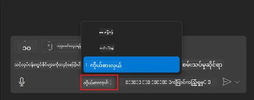
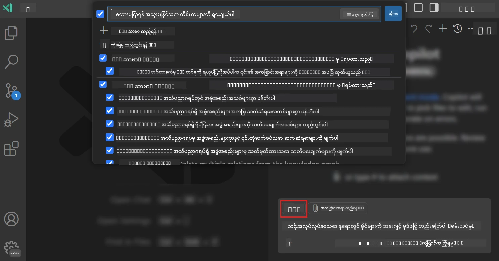
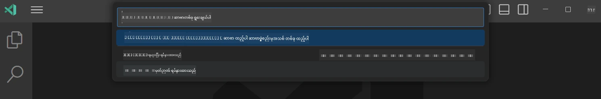
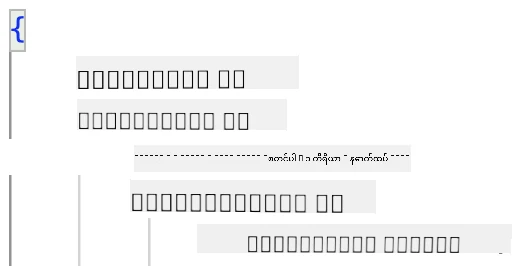
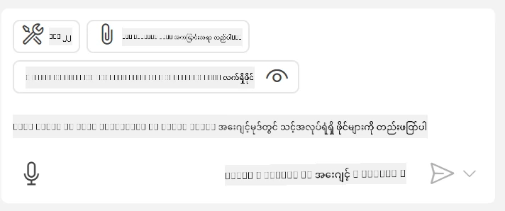
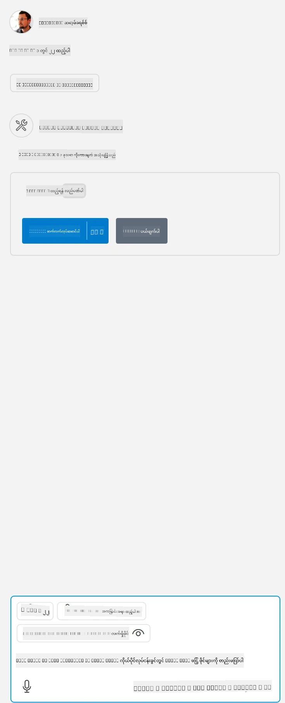

# GitHub Copilot Agent မုဒ်မှ ဆာဗာတစ်ခုကို အသုံးပြုခြင်း

Visual Studio Code နဲ့ GitHub Copilot တို့ဟာ client တစ်ယောက်အနေနဲ့ MCP Server ကို အသုံးပြုနိုင်တယ်။ ဒါကို ဘာကြောင့်လိုချင်တာလဲလို့မေးနိုင်ပါတယ်။ ဒါဆိုတာ MCP Server ရဲ့ features တွေကို သင့် IDE မှာ သုံးလို့ရမယ်ဆိုတဲ့ အဓိပ္ပါယ်ပါပဲ။ ဥပမာ GitHub ရဲ့ MCP server ကို ထည့်သွင်းလိုက်ရင်၊ terminal မှာ command တွေဆိုင်ရှင်းမရေးပဲ prompt တွေကနေ GitHub ကို ထိန်းချုပ်နိုင်ပါလိမ့်မယ်။ ဒါမှမဟုတ် developer အတွေ့အကြုံများကို မြှင့်တင်ပေးမယ့် အရာတစ်ခုခုကို နိုင်ငံဘာသာစကားနဲ့ ထိန်းချုပ်နိုင်တယ်ဆိုတာ အသိအမှတ်ပြုလိုက်ပါစို့။ အခုတော့ အောင်မြင်မှုကို တွေ့နေတာမျိုးတော့ ဖြစ်လာပြီလား။

## အနှစ်ချုပ်

ဒီသင်ခန်းစာမှာ Visual Studio Code နဲ့ GitHub Copilot Agent mode ကို MCP Server အတွက် client အဖြစ် ဘယ်လိုအသုံးပြုရမလဲ ဆိုတာကို လေ့လာပါမယ်။

## သင်ယူရမယ့် ရည်မှန်းချက်တွေ

ဒီသင်ခန်းစာအပြီးမှာ သင်လုပ်နိုင်မှာတွေကတော့-

- Visual Studio Code မှတဆင့် MCP Server ကို အသုံးပြုနိုင်ခြင်း။
- GitHub Copilot မှတဆင့် tools တွေလို capabilities များကို ပြေးနိုင်ခြင်း။
- MCP Server ကို ရှာဖွေစီမံခန့်ခွဲဖို့ Visual Studio Code ကို configuration ပြုလုပ်နိုင်ခြင်း။

## အသုံးပြုနည်း

MCP server ကို နှစ်မျိုးနဲ့ ထိန်းချုပ်နိုင်ပါတယ်။

- User interface, chapter နောက်ပိုင်းမှာ ဘယ်လိုလုပ်ရမလဲ မကြည့်ရအောင်ပြထားပါတယ်။
- Terminal, `code` executable ကို သုံးပြီး terminal မှ တိုက်ရိုက် ထိန်းချုပ်နိုင်ပါတယ်။

  MCP server ကို user profile ထဲသို့ ထည့်ရန် --add-mcp command line option ကိုသုံးပြီး JSON server configuration ကို {"name":"server-name","command":...} လိုဖော်ပြပါ။

  ```
  code --add-mcp "{\"name\":\"my-server\",\"command\": \"uvx\",\"args\": [\"mcp-server-fetch\"]}"
  ```

### ပုံရိပ်များ





အဆိုပါ visual interface ကို နောက်ပိုင်းအပိုဒ်တွေမှာ ပိုပြီးပြောပြပါမယ်။

## ရရှိနည်းလမ်း

အထက်ပါအဆင့်တွေကို အကြမ်းဖျင်းအားဖြင့် ကြည့်ရအောင်-

- MCP Server ရှာဖွေရန် ဖိုင်တစ်ခု configure လုပ်ပါ။
- ဆက်သွယ်/Start up လုပ်ပြီး server ၏ capabilities များ စစ်ဆေးပါ။
- တိုက်ရိုက် GitHub Copilot Chat interface မှတဆင့် အဆိုပါ capabilities ကို အသုံးပြုပါ။

နားလည်သွားပါပြီ၊ အခု MCP Server ကို Visual Studio Code မှတဆင့် နမူနာတစ်ခုလိုပြီး အသုံးပြုကြည့်ကြရအောင်။

## လေ့ကျင့်ခန်း: ဆာဗာတစ်ခု အသုံးပြုခြင်း

ဒီလေ့ကျင့်ခန်းမှာ Visual Studio Code ကို သင့် MCP server ရှာဖွေရန် configure လုပ်ပြီး GitHub Copilot Chat interface မှတဆင့် အသုံးပြုမယ်။

### -0- မိတ်ဆက်ဆင်ခြင်မှု၊ MCP Server ရှာဖွေရန် ဖွင့်ပါ

MCP Server တွေ ရှာဖွေဖို့ ဖွင့်ထားဖို့ လိုအပ်နိုင်ပါတယ်။

1. Visual Studio Code မှ File -> Preferences -> Settings သို့သွားပါ။

1. "MCP" ကို ရှာပြီး settings.json ဖိုင်ထဲမှာ `chat.mcp.discovery.enabled` ကို ဖွင့်ပါ။

### -1- Config ဖိုင်ဖန်တီးခြင်း

project root ထဲမှာ MCP.json လို့နာမည်ပေးထားတဲ့ ဖိုင်တစ်ဖိုင် ဖန်တီးပါ၊ folder အမည် .vscode ထဲမှာထားရမှာဖြစ်ပြီး အောက်ပါအတိုင်း ဖြစ်သင့်ပါသည်။

```text
.vscode
|-- mcp.json
```

အခုတော့ server entry တစ်ခု ထည့်တယ်ဆိုတာ ဘယ်လိုလုပ်ရမလဲ ကြည့်ကြရအောင်။

### -2- ဆာဗာ configure လုပ်ခြင်း

*mcp.json* ထဲမှာ အောက်ပါအချက်အလက်တွေ ထည့်ပါ။

```json
{
    "inputs": [],
    "servers": {
       "hello-mcp": {
           "command": "node",
           "args": [
               "build/index.js"
           ]
       }
    }
}
```

အထက်ပါဥပမာမှာ Node.js နဲ့ရေးထားတဲ့ ဆာဗာ တစ်ခု စတင်ဖို့ ရိုးရှင်းတဲ့နည်းဖြစ်ပါသည်၊ အခြား runtime များရဲ့ command နဲ့ args ကို သတ်မှတ်ပေးရပါမယ်။

### -3- ဆာဗာ စတင်ခြင်း

အခု server entry တစ်ခု ထည့်ပြီးမှ ဆာဗာကို စတင်ကြည့်ကြရအောင်။

1. *mcp.json* ထဲမှာ entry ကို ရှာပြီး "play" သင်္ကေတကို ရှာပါ။

    

1. "play" သင်္ကေတကို နှိပ်ပါ၊ GitHub Copilot Chat မှာ tools icon က ရရှိနိုင်တဲ့ tools အရေအတွက်ကို တိုးလာမယ်။ tools icon ကို နှိပ်မယ်ဆိုရင် မှတ်ပုံတင်ထားတဲ့ tools တွေရဲ့ စာရင်းကိုမြင်ရပါလိမ့်မယ်။ GitHub Copilot က tools တွေကို context အနေနဲ့ အသုံးပြုရင် ခွင့်ပြုမဲ့ tool တွေကိုစစ်/မစစ် ရွေးနိုင်ပါတယ်။

  

1. tools တစ်ခုကို လည်ပတ်ဖို့ သင်သိပြီးသား prompt တစ်ခု ရိုက်ထည့်ပါ၊ ဥပမာ "add 22 to 1" စသဖြင့် prompt ဖြစ်ပါတယ်။

  

  နှုတ်ဆက်ပိုင်းမှာ 23 ပြန်ကြားပါလိမ့်မယ်။

## တာဝန်ပေးချက်

*mcp.json* ဖိုင်ကို server entry ထည့်ပြီး ဆာဗာ စတင်/ရပ်တန့်နိုင်စေရန် စမ်းကြည့်ပါ။ GitHub Copilot Chat interface မှတဆင့် server ရဲ့ tools တွေနဲ့ ဆက်သွယ်နိုင်စေရန်သေချာစေပါ။

## ဖြေရှင်းချက်

[Solution](./solution/README.md)

## မှတ်ချက်အချက်အလက်များ

ဒီအခန်းက မျှဝေမယ့် အချက်တွေက အောက်ပါအတိုင်းဖြစ်ပါတယ်။

- Visual Studio Code က MCP Servers အများအပြားနဲ့ tools တွေကို စားသုံးခွင့် ပြုတဲ့ က Client ကောင်းတစ်ခုဖြစ်ပါတယ်။
- GitHub Copilot Chat interface က ဆာဗာတွေဆီနဲ့ ဆက်သွယ်ရာ နည်းလမ်းဖြစ်ပါတယ်။
- *mcp.json* ဖိုင်ထဲမှာ MCP Server entry ကို configure လုပ်တဲ့အချိန်မှာ API key များလိုအပ်ရင် အသုံးပြုသူထံ prompt ချနိုင်ပြီး အဲဒါကို MCP Server ဆီ ပေးပို့နိုင်ပါတယ်။

## နမူနာများ

- [Java Calculator](../samples/java/calculator/README.md)
- [.Net Calculator](../../../../03-GettingStarted/samples/csharp)
- [JavaScript Calculator](../samples/javascript/README.md)
- [TypeScript Calculator](../samples/typescript/README.md)
- [Python Calculator](../../../../03-GettingStarted/samples/python)

## ထပ်မံရရှိနိုင်သော အရင်းအမြစ်များ

- [Visual Studio docs](https://code.visualstudio.com/docs/copilot/chat/mcp-servers)

## အောက်မှာဘာထပ်လုပ်မလဲ

- နောက်တစ်ဆင့်: [Creating a stdio Server](../05-stdio-server/README.md)

---

<!-- CO-OP TRANSLATOR DISCLAIMER START -->
**ပြောကြားချက်**
ဤစာတမ်းကို AI ဘာသာပြန်ဝန်ဆောင်မှု [Co-op Translator](https://github.com/Azure/co-op-translator) အသုံးပြု၍ ဘာသာပြန်ထားပါသည်။ ကျွန်ုပ်တို့သည် တိကျမှန်ကန်မှုအတွက် ကြိုးပမ်းနေသော်လည်း၊ စက်ကိရိယာဘာသာပြန်ခြင်းများတွင် အမှားများ သို့မဟုတ် မှားယွင်းချက်များ ပါဝင်နိုင်ကြောင်း သတိပြုပါရန် လိုအပ်ပါသည်။ မူလစာတမ်းကို မူရင်းဘာသာဖြင့်သာ ယုံကြည်စိတ်ချရသော အချက်အလက်အဖြစ် သတ်မှတ်သင့်သည်။ အရေးကြီးသည့် သတင်းအချက်အလက်များအတွက် ပရော်ဖက်ရှင်နယ် လူသားဘာသာပြန်သူဝန်ဆောင်မှုကို အကြံပြုပါသည်။ ဤဘာသာပြန်ချက်ကို အသုံးပြုခြင်းမှ ဖြစ်ပေါ်လာသော နားလည်မှုကွာခြားမှုများ သို့မဟုတ် မမှန်ကန်သော အသုံးပြုမှုများအတွက် ကျွန်ုပ်တို့ တာဝန်မခံပါ။
<!-- CO-OP TRANSLATOR DISCLAIMER END -->