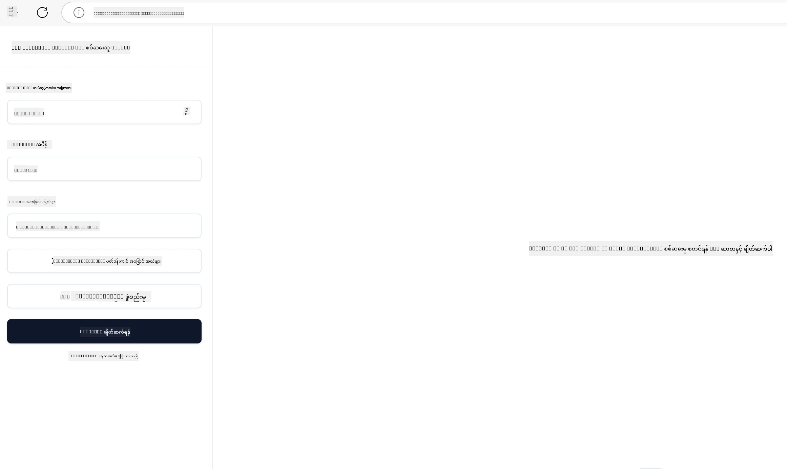

## စမ်းသပ်ခြင်းနှင့် အမှားရှင်းခြင်း

သင်၏ MCP ဆာဗာကို စမ်းသပ်မတိုင်မှီ၊ အသုံးပြုနိုင်သောကိရိယာများနှင့် အမှားရှင်းခြင်းအတွက် အကောင်းဆုံးလေ့ကျင့်မှုများကို နားလည်ရခြင်းမှာ အရေးကြီးသည်။ ထိရောက်စွာ စမ်းသပ်ခြင်းသည် သင့်ဆာဗာသည် မျှော်မှန်းထားသလို ဆောင်ရွက်နေကြောင်း သေချာစေပြီး ပြဿနာများကို အမြန်ဆုံး ရှာဖွေကာ ဖြေရှင်းနိုင်ရန် ကူညီပေးသည်။ အောက်ပါအပိုင်းတွင် သင့် MCP လုပ်ဆောင်ချက်အား မှန်ကန်စွာ စစ်ဆေးရန် အကြံပြုထားသော နည်းလမ်းများကို ဖော်ပြထားသည်။

## အနှစ်ချုပ်

ဒီသင်ခန်းစာက မှန်ကန်သော စမ်းသပ်မှု နည်းလမ်းနှင့် ထိရောက်ဆုံး testing ကိရိယာကို မည်သို့ ရွေးချယ်ရမည်ကို ဖော်ပြပေးသည်။

## သင်ယူရမည့်ရည်မှန်းချက်များ

ဒီသင်ခန်းစာ အဆုံးတွင် သင်ကြားနိုင်သောအရာများမှာ –

- စမ်းသပ်ရေးအတွက် မမျိုးစုံသော နည်းလမ်းများကို ဖော်ပြနိုင်ခြင်း။
- ကိုဒ်ကို ထိရောက်စွာ စမ်းသပ်ရန် ကိရိယာမျိုးစုံ အသုံးပြုနိုင်ခြင်း။


## MCP ဆာဗာများကို စမ်းသပ်ခြင်း

MCP သည် သင်၏ ဆာဗာများကို စမ်းသပ်ခြင်းနှင့် အမှားရှင်းခြင်းအတွက် ကိရိယာများကို ပံ့ပိုးပေးသည်။

- **MCP Inspector**: CLI ကိရိယာအဖြစ်လည်းဖြစ်၊ မြင်သာသောကိရိယာအဖြစ်လည်းဖြစ် အသုံးပြုနိုင်သော command line ကိရိယာတစ်ခု။
- **Manual testing**: curl ကဲ့သို့သော HTTP တောင်းဆိုမှု တတ်နိုင်သည့် ကိရိယာ တစ်ခုကို အသုံးပြုနိုင်သည်။
- **Unit testing**: မိမိနှစ်သက်ရာ စမ်းသပ်ရေး framework တစ်ခုကို အသုံးပြု၍ ဆာဗာနှင့် client နှစ်ဖက်လုံး၏ လုပ်ဆောင်ချက်များကို စမ်းသပ်နိုင်သည်။

### MCP Inspector အသုံးပြုခြင်း

ဒီကိရိယာကို ယခင်သင်ခန်းစာများတွင် ရှင်းပြထားပါသည်၊ သို့သော် အထွေထွေအဆင့်မှာ ပြောကြမည့်အတွက် Node.js သုံးပြီး တည်ဆောက်ထားသောကိရိယာဖြစ်ပြီး `npx` executable ကို ခေါ်ပြီး သုံးနိုင်သည်။ ၎င်းသည် ကိရိယာကို ယာယီ ဒေါင်းလုတ် ဆွဲယူထည့်သွင်းကာ လိုအပ်မှု ပြီးဆုံးသည်နှင့် ရုပ်သိမ်းပါသည်။

[MCP Inspector](https://github.com/modelcontextprotocol/inspector) သည် သင်ကို ကူညီပေးသည်။

- **ဆာဗာ၏ စွမ်းဆောင်ရည်များ ရှာဖွေခြင်း**: ရနိုင်သော အရင်းအမြစ်များ၊ ကိရိယာများနှင့် prompts များကို အလိုအလျောက် တွေ့ရှိစေသည်။
- **ကိရိယာ စစ်ဆေးခြင်း**: ပိုမိုကွဲပြားသော ပါရာမီတာများကို စမ်းသပ်ကြည့်နိုင်ပြီး အဖြေများကို တိုက်ရိုက် ကြည့်ရှုနိုင်သည်။
- **ဆာဗာ Metadata ကြည့်ရှုခြင်း**: ဆာဗာအချက်အလက်၊ schemas နှင့် သတ်မှတ်ချက်များကို စုံစမ်းစစ်ဆေးနိုင်သည်။

ကိရိယာရဲ့ သာမာန်အသုံးပြုမှုက ဒီလို ဖြစ်တယ်။

```bash
npx @modelcontextprotocol/inspector node build/index.js
```

အထက်ပါ command သည် MCP နှင့် ၎င်း၏ မြင်သာသော အင်တာဖေ့စ်ကို စတင်ပြီး သင့် browser တွင် ဒေသခံ web interface ကို ဖွင့်ပေးသည်။ သင်သည် သက်မှတ်ထားသော MCP ဆာဗာများ၊ ၎င်းတို့ဆက်ခဲ့သည့် ကိရိယာများ၊ အရင်းအမြစ်များနှင့် prompts များကို ပြသသည့် dashboard ကို တွေ့နိုင်မည်ဖြစ်သည်။ ထိုအင်တာဖေ့စ်မှ ကိရိယာ စစ်ဆေးမှု၊ ဆာဗာ metadata စစ်ဆေးမှုနှင့် တိုက်ရိုက်မေးခွန်းဖြေပေးခြင်းတို့ကို အပြန်အလှန် ဆက်သွယ်ပြီး စမ်းသပ်နိုင်စေရန် ကူညီပေးသည်။

ဒီလို ပြသနိုင်ပါတယ်။ 

CLI မုဒ်ဖြင့်လည်း ကိရိယာကို လည်ပတ်နိုင်ပြီး `--cli` attribute ကို ထည့်ရသည်။ ဆာဗာမှ တို့ကိရိယာအားလုံး ပေါင်းထည့် ပြထားသည့် "CLI" မုဒ်အတွက် ဥပမာ အောက်ပါအတိုင်း ဖြစ်ပါသည်။

```sh
npx @modelcontextprotocol/inspector --cli node build/index.js --method tools/list
```

### စိတ်ကြိုက် စမ်းသပ်ခြင်း

ဆာဗာစွမ်းဆောင်ရည်ကို စမ်းသပ်ရန် inspector ကိရိယာ ထည့်သုံးခြင်းမှ ပြင်ပတွင်၊ HTTP အသုံးပြုနိုင်သည့် client တစ်ခုဖြစ်သော curl ကိုလည်း အသုံးပြုနိုင်သည်။

curl နှင့်တကွ MCP ဆာဗာများကို တိုက်ရိုက် HTTP တောင်းဆိုမှုဖြင့် စမ်းသပ်နိုင်သည်။

```bash
# ဥပမာ: စမ်းသပ် ဆာဗာ မီတာဒေတာ
curl http://localhost:3000/v1/metadata

# ဥပမာ: ကိရိယာ တစ်ခုကို တိုးဆွဲခြင်း
curl -X POST http://localhost:3000/v1/tools/execute \
  -H "Content-Type: application/json" \
  -d '{"name": "calculator", "parameters": {"expression": "2+2"}}'
```

အထက်ပါ curl အသုံးပြုမှုမှ တွေ့ရသလို၊ ကိုယ်တိုင် HTTP POST တောင်းဆိုမှုဖြင့် ကိရိယာအသုံးပြုမှုကို ကိရိယာအမည်နှင့် ပါရာမီတာတို့ ပါဝင်သော payload ဖြင့် ခေါ်နိုင်သည်။ သင့်ကိုသင့်တော်သည်ဖြစ်သော နည်းလမ်းကို အသုံးပြုပါ။ CLI ကိရိယာများမှာ တတ်မြောက်စွာအသုံးပြုရလွယ်ကူပြီး script များတွင် အသုံးပြုခြင်းလည်း CI/CD လောကတွင် အထောက်အကူပြုသည်။

### Unit Testing

သင့်ကိရိယာများနှင့် အရင်းအမြစ်များအတွက် unit test များ ဖန်တီးပါ၊ ၎င်းတို့သည် မျှော်မှန်းသလို လုပ်ဆောင်ကြောင်း သေချာစေသည်။ ဤမှာ စမ်းသပ်ရေး ကုဒ် ဥပမာများ ရှိသည်။

```python
import pytest

from mcp.server.fastmcp import FastMCP
from mcp.shared.memory import (
    create_connected_server_and_client_session as create_session,
)

# အားလုံးအတွက် async စမ်းသပ်မှုများအတွက် module ကို အမှတ်ပြုပါ
pytestmark = pytest.mark.anyio


async def test_list_tools_cursor_parameter():
    """Test that the cursor parameter is accepted for list_tools.

    Note: FastMCP doesn't currently implement pagination, so this test
    only verifies that the cursor parameter is accepted by the client.
    """

 server = FastMCP("test")

    # စမ်းသပ်မှုကိရိယာ နှစ်ခု ဖန်တီးပါ
    @server.tool(name="test_tool_1")
    async def test_tool_1() -> str:
        """First test tool"""
        return "Result 1"

    @server.tool(name="test_tool_2")
    async def test_tool_2() -> str:
        """Second test tool"""
        return "Result 2"

    async with create_session(server._mcp_server) as client_session:
        # cursor ပါရာမီတာမပါဘဲ စမ်းသပ်မှု (မျက်နှာမစာရ)
        result1 = await client_session.list_tools()
        assert len(result1.tools) == 2

        # cursor=None ဖြင့် စမ်းသပ်မှု
        result2 = await client_session.list_tools(cursor=None)
        assert len(result2.tools) == 2

        # string အဖြစ် cursor ဖြင့် စမ်းသပ်မှု
        result3 = await client_session.list_tools(cursor="some_cursor_value")
        assert len(result3.tools) == 2

        # ဖောင်မှန်ကန်သည့် string cursor ဖြင့် စမ်းသပ်မှု
        result4 = await client_session.list_tools(cursor="")
        assert len(result4.tools) == 2
    
```

အထက်ပါကုဒ်သည် အောက်ပါအရာများကို လုပ်ဆောင်ပါသည် –

- pytest framework ကိုအသုံးပြု၍ function များအဖြစ် စမ်းသပ်မှုများ ဖန်တီးပြီး assert statement များကို သုံးသည်။
- ကိရိယာနှစ်ခုပါသည့် MCP ဆာဗာတစ်ခုကို ဖန်တီးသည်။
- အခြေအနေတချို့ ပြည့်မီမှုကို စစ်ဆေးရန် `assert` statement ကို အသုံးပြုသည်။

[အပြည့်အစုံဖိုင်ကို ဒီမှာကြည့်ပါ](https://github.com/modelcontextprotocol/python-sdk/blob/main/tests/client/test_list_methods_cursor.py)

အထက်ဖော်ပြသည့်ဖိုင်အရ သင့်အား ကိုယ်ပိုင်ဆာဗာကိုစမ်းသပ်ကာ စွမ်းဆောင်ရည်များ စိတ်တိုင်းမကျ များကို ဖန်တီးထားကြောင်း သေချာစေရန် အထောက်အကူပြုပါသည်။

လူကြီးမင်းရွေးချယ်သော runtime နှင့်ကိုက်ညီအောင် အဓိက SDK များတွင် သွယ်ဝိုက်စစ်ဆေးရေး အပိုင်းများ ရှိသည်။

## နမူနာများ

- [Java Calculator](../samples/java/calculator/README.md)
- [.Net Calculator](../../../../03-GettingStarted/samples/csharp)
- [JavaScript Calculator](../samples/javascript/README.md)
- [TypeScript Calculator](../samples/typescript/README.md)
- [Python Calculator](../../../../03-GettingStarted/samples/python) 

## အပိုဆောင်း အရင်းအမြစ်များ

- [Python SDK](https://github.com/modelcontextprotocol/python-sdk)

## နောက်ထပ်ဘာလဲ

- နောက်ထပ်: [Deployment](../09-deployment/README.md)

---

<!-- CO-OP TRANSLATOR DISCLAIMER START -->
**ပြောကြားချက်**
ဤစာတမ်းကို AI ဘာသာပြန်ဝန်ဆောင်မှု [Co-op Translator](https://github.com/Azure/co-op-translator) အသုံးပြု၍ ဘာသာပြန်ထားပါသည်။ ကျွန်ုပ်တို့သည် တိကျမှန်ကန်မှုအတွက် ကြိုးပမ်းနေသော်လည်း၊ စက်ကိရိယာဘာသာပြန်ခြင်းများတွင် အမှားများ သို့မဟုတ် မှားယွင်းချက်များ ပါဝင်နိုင်ကြောင်း သတိပြုပါရန် လိုအပ်ပါသည်။ မူလစာတမ်းကို မူရင်းဘာသာဖြင့်သာ ယုံကြည်စိတ်ချရသော အချက်အလက်အဖြစ် သတ်မှတ်သင့်သည်။ အရေးကြီးသည့် သတင်းအချက်အလက်များအတွက် ပရော်ဖက်ရှင်နယ် လူသားဘာသာပြန်သူဝန်ဆောင်မှုကို အကြံပြုပါသည်။ ဤဘာသာပြန်ချက်ကို အသုံးပြုခြင်းမှ ဖြစ်ပေါ်လာသော နားလည်မှုကွာခြားမှုများ သို့မဟုတ် မမှန်ကန်သော အသုံးပြုမှုများအတွက် ကျွန်ုပ်တို့ တာဝန်မခံပါ။
<!-- CO-OP TRANSLATOR DISCLAIMER END -->