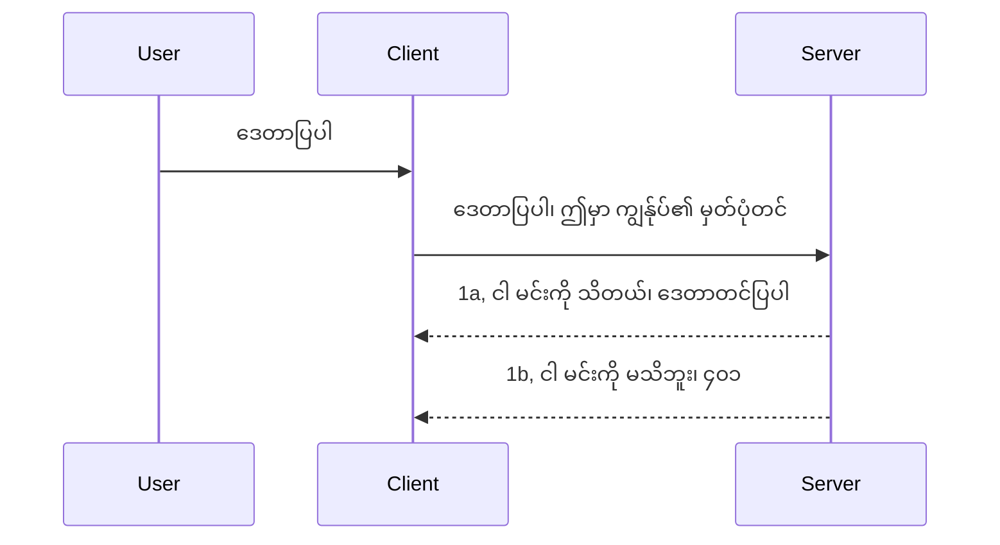

# ရိုးရှင်းသော အတည်ပြုခြင်း

MCP SDKs များသည် OAuth 2.1 အသုံးပြုမှုကို ထောက်ပံ့ပေးသည်၊ ၎င်းမှာ auth server၊ resource server၊ credential များ တင်ပို့ခြင်း၊ code ရယူခြင်း၊ code ကို bearer token နှင့် လဲလှယ်ခြင်းတို့ အပါအဝင် အကြောင်းအရာများ ပါဝင်သော အလွန်ပေါက်လွှာသော လုပ်ငန်းစဉ်ဖြစ်သည်။ OAuth ကို မသုံးဆောင်ရသေးသူများအတွက်၊ အကောင်းဆုံး ဖြစ်စေမည့် အရာတစ်ခုဖြစ်ပြီး၊ အခြေခံ အတည်ပြုမှုမှ စတင်ပြီး ပိုမိုတိုးတက်သော လုံခြုံရေးဆီသို့ တိုးတက်ဖွံ့ဖြိုးသင့်သည်။ ဒီအကြောင်းကြောင့် ဤအခန်းသည် ရှိပြီး ပိုမို ကြွယ်ဝသော အတည်ပြုမှုဆိုင်ရာအတွေ့အကြုံကို တည်ဆောက်ပေးရန် ဖြစ်သည်။

## အတည်ပြုခြင်းဆိုသည်မှာဘာလဲ?

အတည်ပြုခြင်းသည် authentication နှင့် authorization တို့၏ အတိုကောက်ဖြစ်သည်။ အဓိပ္ပါယ်မှာ မိမိတို့လုပ်ရန် လိုအပ်သည်မှာ -

- **Authentication** သည် လူတစ်ဦးကို မိမိတို့အိမ်ထဲ ဝင်ခွင့်ပေးရမယ်ဆိုတာ၊ သူတို့သည် "ဒီမှာ" ရှိရန် အခွင့်အရေးရှိတယ်ဆိုတာကို သတ်မှတ်ဖော်ထုတ်ခြင်းဖြစ်သည်၊ အဲဒါဆို resource server သို့ ဝင်ခွင့်ရရှိရန် ဖြစ်ပြီး သာ MCP Server ၏ feature များ နေရာဖြစ်သည်။
- **Authorization** သည် အသုံးပြုသူတစ်ဦးက တောင်းခံထားသော အထူး resource များ (ဥပမာ - မှာယူမှုများ၊ ကုန်ပစ္စည်းများ) သို့မဟုတ် ဖတ်ရှုခွင့်သာ ရှိပြီး ဖျက်ရန်ခွင့်မရှိခြင်းကို စစ်ဆေးရမည့်လုပ်ငန်းစဉ်ဖြစ်သည်။

## Credentials: စနစ်ကို မိမိတို့ကိုယ်တိုင် မည်သို့ပြောပြသည်

ကျန်တွင် အများဆုံး ဝက်ဘ် Developer များသည် server ထံ credential တစ်ခုတင်ပို့ရန် စဉ်းစားပြီး၊ မည်သူ "ဒီမှာ" ရှိခွင့်ရှိကြောင်း ဖေါ်ပြသည်။ မကြာခဏ ဘောင်နှင့် စကားဝှက် သို့မဟုတ် API key တစ်ခုဖြစ်ပြီး တစ်ဦးချင်းအသုံးပြုသူကို သီးခြားအားဖြင့် မှတ်သားခြင်းဖြစ်သည်။ 

ဤအရာသည် "Authorization" ဟူသော header ဖြင့်ပို့ပေးသည်၊ တစ်ခုက ဒီလိုဖြစ်သည် -

```json
{ "Authorization": "secret123" }
```

ယခုအတိုင်း basic authentication ဟုခေါ်ဆိုသည်။ အလွန်ပေါင်းသင်းသော လည်ပတ်မှုသည် အောက်ပါစနစ်ဖြင့် ဖြစ်သည် -


ယခု Flow ဆိုင်ရာနည်းလမ်းကို နားလည်ပြီးနောက်၊ အဲဒါကို မည်သို့ အကောင်အထည်ဖော်မလဲ။ ဝက်ဘ် server များတွင် middleware ဟူသော အကြောင်းအရာရှိပြီး၊ ၎င်းသည် request တစ်ခုဖြစ်ရာတွင် credential များကို စစ်ဆေးကာမှန်ကန်ပါက request ကို ကြိုတင်ခွင့်ပြုသည်၊ မမှန်ကန်ပါက auth ကို error ပေးသည်။ အဲဒါကို ဘယ်လိုရေးမလဲဆိုတာ ကြည့်ရှုကြမည် မိတ်ဆွေတို့အား ပြုလုပ်ပေးပါမည် -

**Python**

```python
class AuthMiddleware(BaseHTTPMiddleware):
    async def dispatch(self, request, call_next):

        has_header = request.headers.get("Authorization")
        if not has_header:
            print("-> Missing Authorization header!")
            return Response(status_code=401, content="Unauthorized")

        if not valid_token(has_header):
            print("-> Invalid token!")
            return Response(status_code=403, content="Forbidden")

        print("Valid token, proceeding...")
       
        response = await call_next(request)
        # မည်သည့်ဖောက်သည်ခေါင်းစီးများကိုမဆိုထည့်သွင်းရန် သို့မဟုတ် တုံ့ပြန်ချက်တွင်မည်သည့်နည်းဖြင့်မဆိုပြောင်းလဲရန်
        return response


starlette_app.add_middleware(CustomHeaderMiddleware)
```

ဤနေရာတွင် -

- AuthMiddleware ဟုခေါ်သော middleware တစ်ခု ဖန်တီးပြီး `dispatch` method ကို web server မှ ခေါ်၍ အသုံးပြုသည်။
- Middleware ကို web server တွင် ထည့်သွင်း -

    ```python
    starlette_app.add_middleware(AuthMiddleware)
    ```

- Authorization header ရှိမရှိ၊ လျှို့ဝှက်ချက် မှန်ကန်မှုစစ်ဆေးမှုရေးသည့် validation logic ရေးသားသည် -

    ```python
    has_header = request.headers.get("Authorization")
    if not has_header:
        print("-> Missing Authorization header!")
        return Response(status_code=401, content="Unauthorized")

    if not valid_token(has_header):
        print("-> Invalid token!")
        return Response(status_code=403, content="Forbidden")
    ```

    လျှို့ဝှက်ချက်ရှိပြီးမှန်ကန်ပါက `call_next` ကိုခေါ်၍ request ကို အတည်ပြုပြီး response ပြန်သည်။

    ```python
    response = await call_next(request)
    # ပြန်လည်တုံ့ပြန်မှုတွင် မည်သည့်ဖောက်သည်ခေါင်းစဉ်များကိုမဆို ထည့်သွင်းရန် သို့မဟုတ် ပြောင်းလဲရန်
    return response
    ```

အလုပ်လုပ်ပုံမှာ web request တင်ပို့ခဲ့သည်နှင့်တပြိုင်နက် middleware ကခေါ်တယ်၊ validation အရ request ပေးလိုအားလွှတ်ပါမည်၊ သို့မဟုတ် client ထွက်ခွာခွင့်မရှိဟု error ပြန်ပေးမည်ဖြစ်သည်။

**TypeScript**

Express Framework နဲ့ အသုံးပြုသည့် middleware တစ်ခု ဖန်တီးကာ MCP Server တွင် request ရောက်ရန် မတိုင်ခင် intercept လုပ်သည်။ နမူနာအောက်ပါအတိုင်း -

```typescript
function isValid(secret) {
    return secret === "secret123";
}

app.use((req, res, next) => {
    // ၁။ ခွင့်ပြုချက်ခေါင်းစဉ် ရှိပါသလား?
    if(!req.headers["Authorization"]) {
        res.status(401).send('Unauthorized');
    }
    
    let token = req.headers["Authorization"];

    // ၂။ တရားဝင်မှုကို စစ်ဆေးပါ။
    if(!isValid(token)) {
        res.status(403).send('Forbidden');
    }

   
    console.log('Middleware executed');
    // ၃။ မှတဆင့် မေးခွန်းကို နောက်တစ်ဆင့်တွင် ပို့ဆောင်သည်။
    next();
});
```

ဒီကုဒ်တွင် -

1. Authorization header ရှိ/မရှိ စစ်ဆေးပြီး မရှိ နေပါက 401 error ပေးသည်။
2. credential/token မှန်/မမှန် စစ်ဆေးပြီး မမှန် နေပါက 403 error ပေးသည်။
3. request pipeline တွင် request ရောက်ကာ လိုအပ်သည့် resource ပေးသည်။

## လေ့ကျင့်ခန်း: authentication ကို အကောင်အထည်ဖော်ပါ

ကျော်လည်သိရှိမှုပြီးနောက် ကုဒ်ကိုရေးဆွဲကြမယ်။ အလည်အပတ်မှာ -

Server

- web server နှင့် MCP instance ဖန်တီးခြင်း။
- Middleware တစ်ခုရေးဆွဲခြင်း။

Client

- Credential ပါသော request တင်ပို့ခြင်း၊ header မှတဆင့်။

### -1- Web server နှင့် MCP instance ဖန်တီးခြင်း

အဆင့်ပထမ တစ်ခုမှာ web server instance နှင့် MCP Server ဖန်တီးရန်။

**Python**

MCP Server instance ဖန်တီးပြီး starlette web app ကိုဖန်တီး၊ uvicorn ဖြင့် host ပြုလုပ်သည်။

```python
# MCP ဆာဗာ ဖန်တီးနေသည်

app = FastMCP(
    name="MCP Resource Server",
    instructions="Resource Server that validates tokens via Authorization Server introspection",
    host=settings["host"],
    port=settings["port"],
    debug=True
)

# starlette ဝဘ် အက်ပ် ဖန်တီးနေသည်
starlette_app = app.streamable_http_app()

# uvicorn ဖြင့် အက်ပ်ကို ဝန်ဆောင်မှုပေးနေသည်
async def run(starlette_app):
    import uvicorn
    config = uvicorn.Config(
            starlette_app,
            host=app.settings.host,
            port=app.settings.port,
            log_level=app.settings.log_level.lower(),
        )
    server = uvicorn.Server(config)
    await server.serve()

run(starlette_app)
```

ကုဒ်မှာ -

- MCP Server ဖန်တီးသည်။
- starlette web app ကို MCP Server မှ `app.streamable_http_app()` ဖြင့် တည်ဆောက်သည်။
- uvicorn အသုံးပြုပြီး web app ကို hosting ပြုလုပ်သည် `server.serve()`။

**TypeScript**

MCP Server instance ဖန်တီးခြင်းဖြစ်သည်။

```typescript
const server = new McpServer({
      name: "example-server",
      version: "1.0.0"
    });

    // ... ဆာဗာ အရင်းအမြစ်များ၊ ကိရိယာများနှင့် ပရော့မ့်များကို စီစဉ်ပါ ...
```

MCP Server ဖန်တီးခြင်းကို POST /mcp route တွင် ဖန်တီးရမည်၊ ထို့ကြောင့် အထက်ဖော်ပြထားသော ကုဒ်ကို ရိုက်ပေါ်ပြီး ဆက်လက်ပြောင်းရွှေ့မှု သတ်မှတ်-

```typescript
import express from "express";
import { randomUUID } from "node:crypto";
import { McpServer } from "@modelcontextprotocol/sdk/server/mcp.js";
import { StreamableHTTPServerTransport } from "@modelcontextprotocol/sdk/server/streamableHttp.js";
import { isInitializeRequest } from "@modelcontextprotocol/sdk/types.js"

const app = express();
app.use(express.json());

// session ID ဖြင့် သယ်ယူပို့ဆောင်မှုများကို သိမ်းဆည်းရန် မြေပုံ
const transports: { [sessionId: string]: StreamableHTTPServerTransport } = {};

// client-to-server ဆက်သွယ်မှုအတွက် POST ကိန်းတင်ရန် ကိုင်တွယ်ပါ
app.post('/mcp', async (req, res) => {
  // ရှိပြီးသား session ID ကို စစ်ဆေးပါ
  const sessionId = req.headers['mcp-session-id'] as string | undefined;
  let transport: StreamableHTTPServerTransport;

  if (sessionId && transports[sessionId]) {
    // ရှိပြီးသား သယ်ယူပို့ဆောင်မှုကို ပြန်အသုံးပြုပါ
    transport = transports[sessionId];
  } else if (!sessionId && isInitializeRequest(req.body)) {
    // အသစ်စတင်ရန် တောင်းဆိုမှု
    transport = new StreamableHTTPServerTransport({
      sessionIdGenerator: () => randomUUID(),
      onsessioninitialized: (sessionId) => {
        // session ID ဖြင့် သယ်ယူပို့ဆောင်မှုကို သိမ်းဆည်းပါ
        transports[sessionId] = transport;
      },
      // DNS rebinding ကာကွယ်မှုကို နောက်ကျောလိုက်နာမှုအတွက် ပုံမှန်အားဖြင့် ပိတ်ထားသည်။ သင်သည် ဒီဆာဗာကို
      // တည်နေရာဒေသတွင် စက်ရုပ်လုပ်နေပါက၊ သေချာစွာ သတ်မှတ်ပါ:
      // enableDnsRebindingProtection: true,
      // allowedHosts: ['127.0.0.1'],
    });

    // ပိတ်သွားသောအခါ သယ်ယူပို့ဆောင်မှုကို သန့်ရှင်းပါ
    transport.onclose = () => {
      if (transport.sessionId) {
        delete transports[transport.sessionId];
      }
    };
    const server = new McpServer({
      name: "example-server",
      version: "1.0.0"
    });

    // ... ဆာဗာအရင်းအမြစ်များ၊ ကိရိယာများနှင့် မေးခွန်းများကို ပြင်ဆင်ပါ ...

    // MCP ဆာဗာနှင့် ချိတ်ဆက်ပါ
    await server.connect(transport);
  } else {
    // မှားသော တောင်းဆိုမှု
    res.status(400).json({
      jsonrpc: '2.0',
      error: {
        code: -32000,
        message: 'Bad Request: No valid session ID provided',
      },
      id: null,
    });
    return;
  }

  // တောင်းဆိုမှုကို ကိုင်တွယ်ပါ
  await transport.handleRequest(req, res, req.body);
});

// GET နှင့် DELETE တောင်းဆိုမှုများအတွက် ပြန်အသုံးပြုနိုင်သော ကိုင်တွယ်သူ
const handleSessionRequest = async (req: express.Request, res: express.Response) => {
  const sessionId = req.headers['mcp-session-id'] as string | undefined;
  if (!sessionId || !transports[sessionId]) {
    res.status(400).send('Invalid or missing session ID');
    return;
  }
  
  const transport = transports[sessionId];
  await transport.handleRequest(req, res);
};

// SSE အားဖြင့် server-to-client အသိပေးချက်များအတွက် GET တောင်းဆိုမှုကို ကိုင်တွယ်ပါ
app.get('/mcp', handleSessionRequest);

// session ပိတ်သိမ်းရန် DELETE တောင်းဆိုမှုကို ကိုင်တွယ်ပါ
app.delete('/mcp', handleSessionRequest);

app.listen(3000);
```

MCP Server ဖန်တီးခြင်းကို `${app.post("/mcp")}` အတွင်းသို့ ရွှေ့ထားသည်။

နောက်တစ်ဆင့် middleware ဖန်တီးခြင်းသို့ တိုးမည်။

### -2- Server အတွက် middleware ဖန်တီးမှု

middleware မှာ Authorization header တွင် credential ရှိမည်ကိုရှာဖွေ စစ်ဆေး၍ မှန်ကန်မှ request ကို ဆက်လက် ဆောင်ရွက်ပေးမည်။

**Python**

middleware ဖန်တီးရန် `BaseHTTPMiddleware` ကို အဟောင်းယူထားသည့် class တစ်ခု ဖန်တီးရမည်။

- request `request` သည် header အချက်အလက်များဖတ်ရန်။
- `call_next` က client မှ credential တစ်ခု ကျေနပ်ပါက ခေါ်သည့် callback ဖြစ်သည်။

အစပိုင်းတွင် `Authorization` header မရှိပါက ကိစ္စကို ကိုင်တွယ်သင့်သည် -

```python
has_header = request.headers.get("Authorization")

# header မရှိပါ၊ 401 နှင့် မအောင်မြင်ပါ၊ မဟုတ်လျှင် ဆက်လက်ဆောင်ရွက်ပါ။
if not has_header:
    print("-> Missing Authorization header!")
    return Response(status_code=401, content="Unauthorized")
```

client သည် authentication မအောင်မြင်ခြင်းကြောင့် 401 unauthorized message ပေးသည်။

သို့မှမဟုတ် credential တင်သွင်းပါက မှန်ကန်မှု စစ်ဆေးသည့် နည်းဖြင့် -

```python
 if not valid_token(has_header):
    print("-> Invalid token!")
    return Response(status_code=403, content="Forbidden")
```

403 forbidden message ပေးသည်ကို တွေ့ရသည်။ အောက်တွင် စုစည်းပြီး ဆက်တင်ထားသည် middleware မြင်သာသည် -

```python
class AuthMiddleware(BaseHTTPMiddleware):
    async def dispatch(self, request, call_next):

        has_header = request.headers.get("Authorization")
        if not has_header:
            print("-> Missing Authorization header!")
            return Response(status_code=401, content="Unauthorized")

        if not valid_token(has_header):
            print("-> Invalid token!")
            return Response(status_code=403, content="Forbidden")

        print("Valid token, proceeding...")
        print(f"-> Received {request.method} {request.url}")
        response = await call_next(request)
        response.headers['Custom'] = 'Example'
        return response

```

ကောင်းပါသည်၊ `valid_token` function ဆိုတာ ဘယ်လိုလဲဆိုတာ -

```python
# ထုတ်လုပ်မှုအတွက် မသုံးပါနဲ့ - ပိုမိုကောင်းမွန်အောင် လုပ်ပါ !!
def valid_token(token: str) -> bool:
    # "Bearer " prefix ကို ဖယ်ရှားပါ။
    if token.startswith("Bearer "):
        token = token[7:]
        return token == "secret-token"
    return False
```

ထိုနည်းလမ်းသည် တိုးတက်အောင် မြှင့်တင်သင့်သည်။

အရေးကြီး - secret များကို ကုဒ်ထဲတွင် မထားရ။ ဒေတာရင်းမြစ် သို့မဟုတ် IDP (identity service provider) ကနေ ပြန်ရွေးချယ်ထောက်ခံစစ်ဆေးသင့်သည်။

**TypeScript**

Express အသုံးပြုပြီး middleware ကို `use` method ဖြင့်ခေါ်၍ အကောင်အထည်ဖော်သည်။

လုပ်ဆောင်ရန် -

- request တွင် `Authorization` property တစ်ခုကို credential ရှိ/မရှိစစ်ဆေးခြင်း။
- credential မှန်ကန်/မမှန် ဆုံးဖြတ်ပြီး request ဆက်လက်လုပ်ဆောင်ခွင့်ပြုသည်။

Authorization header မရှိပါက request ရပ်တန့်သည် -

```typescript
if(!req.headers["authorization"]) {
    res.status(401).send('Unauthorized');
    return;
}
```

မရောက်သော အခါ 401 error အဖြစ်ဖြစ်သည်။

နောက်ပြီး credential မှန်ကန်မှု မရှိပါက request ထပ်မလုပ်ဖို့ မတိုင်ခင် 403 error ဖြစ်သည် -

```typescript
if(!isValid(token)) {
    res.status(403).send('Forbidden');
    return;
} 
```

အထက်ပါ full code ကို ကြည့်ပါ-

```typescript
app.use((req, res, next) => {
    console.log('Request received:', req.method, req.url, req.headers);
    console.log('Headers:', req.headers["authorization"]);
    if(!req.headers["authorization"]) {
        res.status(401).send('Unauthorized');
        return;
    }
    
    let token = req.headers["authorization"];

    if(!isValid(token)) {
        res.status(403).send('Forbidden');
        return;
    }  

    console.log('Middleware executed');
    next();
});
```

web server ကို credential စစ်ဆေးရန် middleware အသုံးပြုစေထားသည်။ client ကို မည်သို့ပြုကြမလဲ?

### -3- Credential ပါ header ဖြင့် web request တင်ပို့ခြင်း

client က credential ဖော်ပြရာ header ဖြင့် ပို့နေကြောင်း သေချာစေရမည်။ MCP client ကို အသုံးပြုပြီးလုပ်သည်။ ဘယ်လိုလုပ်လဲ?

**Python**

client ၏ header တွင် credential ထည့်ပေးမှု -

```python
# အဖျက်အကြောင်းမရေးပါနှင့်၊ အနည်းဆုံး သတ်မှတ်အထိ ဆိုဒ်တစ်ခုတွင် သို့မဟုတ် လုံခြုံမှုပိုမိုရှိသော သိမ်းဆည်းရာနေရာတွင် ထားပါ
token = "secret-token"

async with streamablehttp_client(
        url = f"http://localhost:{port}/mcp",
        headers = {"Authorization": f"Bearer {token}"}
    ) as (
        read_stream,
        write_stream,
        session_callback,
    ):
        async with ClientSession(
            read_stream,
            write_stream
        ) as session:
            await session.initialize()
      
            # အလုပ်လုပ်ရန်လိုသောအရာများ၊ ဥပမာ - ဆော့ဝဲကိရိယာများ စာရင်းပြုစုခြင်း၊ ဆော့ဝဲကိရိယာများ ခေါ်ရန် စသဖြင့် ။
```

`headers = {"Authorization": f"Bearer {token}"}` ဆိုသည့် ပုံစံဖြင့် ထည့်သွင်းသည်။

**TypeScript**

ဒီကို နှစ်ဆင့်ဖြင့် ဖြေရှင်းနိုင်သည် -

1. credential ပါ configuration object တစ်ခု တည်ဆောက်ခြင်း။
2. configuration object ကို transport ထံ ပို့ခြင်း။

```typescript

// ဒီမှာပြထားသလို တန်ဖိုးကို လက်ရှိတိုက်ရိုက်ထည့်မထားပါနဲ့။ အနည်းဆုံး env variable အဖြစ်ထားပြီး dev mode မှာ dotenv တို့လိုဟာတွေကို အသုံးပြုပါ။
let token = "secret123"

// client transport option object ကို သတ်မှတ်ပါ
let options: StreamableHTTPClientTransportOptions = {
  sessionId: sessionId,
  requestInit: {
    headers: {
      "Authorization": "secret123"
    }
  }
};

// options object ကို transport သို့ ပေးပို့ပါ
async function main() {
   const transport = new StreamableHTTPClientTransport(
      new URL(serverUrl),
      options
   );
```

options object တည်ဆောက်ပြီး `requestInit` property တွင် headers ထည့်သွင်းထားသည်။

အရေးကြီး - ဒီလို credential ပို့ခြင်းမှာ HTTPS ရှိသင့်သည်၊ မဟုတ်လျှင် credential ခိုးခံနိုင်ခြင်းရှိပြီး token ပြန်သိမ်းခြင်း၊ ယခု token ရလာရာနေရာ၊ များစွာတောင်းဆိုမှု (bot လုပ်ဆောင်မှု) စစ်ဆေးမှု ပြုလုပ်ရမည်။

ရိုးရှင်းသော API များအတွက် authentication မရှိမျှ API ခေါ်ယူခြင်းမှ ကာကွယ်ရန်အတွက် ယခုနည်းက ရှေ့ဆက်အဆင့်အနေဖြင့် ကောင်းမွန်သည်။

ကြိုတင်ပြောကြားပြီး၊ JSON Web Token (JWT) စနစ်သုံး၍ လုံခြုံရေးပိုမို တိုးတက်စေရန် ကြိုးစားကြမယ်။

## JSON Web Tokens, JWT

ရိုးရှင်းသော credential တွေမှ ကောင်းမွန်မြင်သာသော ဆက်တင်များရရှိရန် JWT ကို လက်ခံအသုံးပြုခြင်း၏ အကျိုးကျေးဇူးများ -

- **လုံခြုံရေး တိုးတက်မှုများ**။ Basic auth မွာ username နှင့် password ကို base64 ပုံစံပြောင်း၍ လွှဲပို့သည် (သို့ API key)၊ ဤသည်မှာ အန္တရာယ်ရှိသည်။ JWT မှာ username နှင့် password ပို့ပြီး token ရရှိပြီး၊ ဤ token သည် သတ်မှတ်ထားသည့် ကာလအတွင်း အသုံးပြုနိုင်သည်။ JWT သည် roles, scopes, permissions အသုံးပြု၍ အသေးစိတ် လက်ခံခွင့် ထိန်းချုပ်နိုင်သည်။
- **Statelessness နှင့် scalability**။ JWT သည် မှတ်တမ်းတင်မှုမရှိ၊ အသုံးပြုသူအချက်အလက် အားလုံး ပါဝင်ကာ server-side session ကို သိမ်းဆည်းရန် မလိုအပ်ပေ။ နေရာဒေသအလိုက် token ကို Validate လုပ်နိုင်သည်။
- **Interoperability နှင့် federation**။ JWT သည် Open ID Connect ၏ အခြေခံဖြစ်ပြီး Entra ID, Google Identity, Auth0 ကဲ့သို့သော အထင်ကြီး identity providers တွင် အသုံးပြုသည်။ Single Sign-On ပေါင်းစပ်နိုင်ပြီး အဖွဲ့အစည်း၏အဆင့်အတန်းမြှင့်တင်သည်။
- **Modularity နှင့် flexibility**။ JWT ကို Azure API Management, NGINX နှင့် အခြား API Gateway နည်းပညာတွင် အသုံးပြုနိုင်မည်။ အတည်ပြုမှုနှင့် server-to-service ဆက်သွယ်မှု (impersonation, delegation) များတွင် အသုံးပြုနိုင်သည်။
- **စွမ်းဆောင်ရည်နှင့် cache အကျိုးကျေးဇူးများ**။ JWT ကို ပြန်ဖော်စင်ပြီး cache ထားနိုင်ပြီး ပါးလျော့ parsing လုပ်မှု လျော့ချပေးသည်။ အသုံးပြုမှုများ များပြားသည့် app များတွင် throughput မြှင့်တင်ပြီး infrastructure ၏ လုပ်အား လျော့ချပေးသည်။
- **တိုးတက်သော feature များ**။ introspection (server ပေါ်မှာ validity စစ်ဆေးခြင်း) နှင့် revocation (token ကို မမှန်ခွင့်ပြုသည်အဖြစ် ပြောင်းခြင်း) ပါဝင်သည်။

ဤအားလုံး ရှိတာကြောင့် ယခု implementation ကို ပိုမိုကောင်းမွန်အောင် ဘယ်လိုလုပ်မလဲဆိုတာ ကြည့်ရအောင်။

## Basic auth ကို JWT သို့ ပြောင်းလဲခြင်း

အမြင်တစ်ခုအနေနဲ့ ပြောင်းလဲရန်လိုအပ်တာတွေမှာ -

- **JWT token ကို ဖန်တီးနည်း စသိမ့်ခဲ့ပြီး client မှ server သို့ ပို့ရန် အသင့်ပြင်ဆင်ခြင်း**။
- **JWT token ကို အတည်ပြုခြင်း၊ မှန်ကန်ပါက client လက်ခံခွင့်ပေးခြင်း**။
- **Token ကို လုံခြုံစွာ သိမ်းဆည်းခြင်း**။
- **လမ်းကြောင်းများကာကွယ်ခြင်း**။ MCP features တွင် route များကာကွယ်ရန်။
- **refresh tokens ထည့်သွင်းခြင်း**။ လျော့ချက်သက်တမ်းရှိ token များဖြစ်စေ၊ ရေရှည်သက်တမ်းရှိ refresh token များဖြင့် expired token များ ပြန်ရရှိနိုင်ရန်။ refresh endpoint နှင့် rotation နည်းလမ်း ရှိရန်။

### -1- JWT token ဖန်တီးခြင်း

JWT token တွင် ပါဝင်သည့် အစိတ်အပိုင်းများမှာ -

- **header**: အယ်လ်ဂိုရစ်မနှင့် token အမျိုးအစား။
- **payload**: sub (token ကို ကိုယ်စားပြုသူ user/entity - authentication တွင် user id ဖြစ်သည်), exp (သက်တမ်းကုန်ဆုံးချိန်), role (အခန်းကဏ္ဍ) လို အသိအမှတ်ပြုချက်များ။
- **signature**: လျှို့ဝှက်ချက် သို့မဟုတ် ကိုယ်ပိုင် key ဖြင့် လက်မှတ်ရေးထားမှု။

Python ကုဒ်

```python

import jwt
import jwt
from jwt.exceptions import ExpiredSignatureError, InvalidTokenError
import datetime

# JWT ကို လက်မှတ်ရေးထိုးရန် အသုံးပြုသော လျှို့ဝှက်သော key
secret_key = 'your-secret-key'

header = {
    "alg": "HS256",
    "typ": "JWT"
}

# အသုံးပြုသူအချက်အလက်များနှင့် ၎င်း၏ ပိုင်ခွင့်များနှင့် မတိုင်မီ အချိန်
payload = {
    "sub": "1234567890",               # ခေါင်းစဉ် (အသုံးပြုသူ ID)
    "name": "User Userson",                # အသုံးပြုသူသတ်မှတ်ထားသော ပိုင်ခွင့်
    "admin": True,                     # အသုံးပြုသူသတ်မှတ်ထားသော ပိုင်ခွင့်
    "iat": datetime.datetime.utcnow(),# ဖြန့်ချိသည့် အချိန်
    "exp": datetime.datetime.utcnow() + datetime.timedelta(hours=1)  # မတိုင်မီ သတ်မှတ်ထားသော အချိန်
}

# ဝင်ရောက်ကုန်ဆောင်လုပ်ရန် encode လုပ်ပါ
encoded_jwt = jwt.encode(payload, secret_key, algorithm="HS256", headers=header)
```

အထက်က ကုဒ်မှာ -

- HS256 Algorithm နှင့် JWT type အသုံးပြုပြီး header ကို သတ်မှတ်ထားသည်။
- Payload တွင် subject/user id၊ username၊ role၊ issue time၊ expire time ကို ထည့်သွင်းပြီး အချိန်ကန့်သတ်မှုကို ထည့်သွင်းထားသည်။

TypeScript သုံးရာတွင် dependency များလိုအပ်သည် -

```sh

npm install jsonwebtoken
npm install --save-dev @types/jsonwebtoken
```

တစ်ချက် ကိစ္စထားပြီး header, payload ဖန်တီးပြီး encoded token ကို ထုတ်ယူသည် -

```typescript
import jwt from 'jsonwebtoken';

const secretKey = 'your-secret-key'; // ထုတ်လုပ်မှုတွင် env var များ အသုံးပြုပါ

// payload သတ်မှတ်ပါ
const payload = {
  sub: '1234567890',
  name: 'User usersson',
  admin: true,
  iat: Math.floor(Date.now() / 1000), // ထုတ်ပြန်ချိန်
  exp: Math.floor(Date.now() / 1000) + 60 * 60 // ၁ နာရီအတွင်း ကုန်ဆုံးသည်
};

// ခေါင်းစီးကို သတ်မှတ်ပါ (စိစစ်ဖြင့်၊ jsonwebtoken က default များ သတ်မှတ်ပါတယ်)
const header = {
  alg: 'HS256',
  typ: 'JWT'
};

// token ကို ဖန်တီးပါ
const token = jwt.sign(payload, secretKey, {
  algorithm: 'HS256',
  header: header
});

console.log('JWT:', token);
```

Token တွင် -

HS256 နည်းဖြင့် လက်မှတ်ရေးသည်၊
တစ်နာရီ သက်တမ်းရှိသည်။
sub, name, admin, iat, exp စသည့် claim များ ပါဝင်သည်။

### -2- Token အတည်ပြုခြင်း

Server ပေါ်တွင် client ပို့လာသည့် token ကို စစ်ဆေးရန် လိုအပ်သည်။

Structure မှ စတင်စစ်ဆေးပြီး validity စစ်ဆေးခြင်း ပါဝင်သည်။ သင့်စနစ်တွင် user ရှိ/မရှိ၊ user ၏ အခွင့်အရေး သင့်တင့်မှု စစ်ဆေးသည်။

Python

```python

# JWT ကို ဖြေ解နှင့် အတည်ပြုပါ။
try:
    decoded = jwt.decode(token, secret_key, algorithms=["HS256"])
    print("✅ Token is valid.")
    print("Decoded claims:")
    for key, value in decoded.items():
        print(f"  {key}: {value}")
except ExpiredSignatureError:
    print("❌ Token has expired.")
except InvalidTokenError as e:
    print(f"❌ Invalid token: {e}")

```

jwt.decode ကို token, secret key နှင့် algorithm ဖြင့် ခေါ်ကာ စစ်ဆေးသည်။ စစ်ဆေးမှုမအောင်မြင်လျှင် error တက်သည်။

TypeScript

jwt.verify ကို ခေါ်ကာ token ကို decoded ပြန်ရောက်စွာ ရယူသည်။ မအောင်မြင်လျှင် token structure မမှန်ပါ သို့မဟုတ် အသုံးပြုခွင့် သက်တမ်းကုန်ဆုံးထားသည်။

```typescript

try {
  const decoded = jwt.verify(token, secretKey);
  console.log('Decoded Payload:', decoded);
} catch (err) {
  console.error('Token verification failed:', err);
}
```

မှတ်ချက် - သတ်မှတ်ထားသကဲ့သို့ user ကိုသတ်မှတ်ပြီး user ၏ အခွင့်အရေးရှိမှုကြောင်း စစ်ဆေးသင့်သည်။

နောက်တစ်ခုမှာ role-based access control (RBAC) ကိုကြည့်မည်။
## Role အခြေခံ ပြုလုပ်ထားသော access control ထည့်သွင်းခြင်း

အကြောင်းအရာမှာ role မျိုးစုံကွဲပြားခြားနားသော permission များရှိကြောင်း ဖော်ပြလိုခြင်းဖြစ်သည်။ ဥပမာအားဖြင့် admin က အားလုံးပြုလုပ်နိုင်ပြီး user သာအနည်းငယ် read/write လုပ်နိုင်ပြီး guest ကသက်ဆိုင်ရာအတိုင်းသာ ဖတ်ခြင်းသာလုပ်နိုင်သည်ဟု ခန့်မှန်းကြသည်။ ထို့ကြောင့် permission အဆင့်အတန်းများအနေဖြင့် အောက်ပါအတိုင်းဖြစ်နိုင်သည်-

- Admin.Write 
- User.Read
- Guest.Read

Middleware ဖြင့် control အတူတကွ ဘယ်လိုလုပ်ဆောင်နိုင်သလဲ ကြည့်ကြမယ်။ Middleware များကို route တစ်ခုချင်းစီနှင့် route အားလုံးအတွက်လည်း ထည့်နိုင်ပါသည်။

**Python**

```python
from starlette.middleware.base import BaseHTTPMiddleware
from starlette.responses import JSONResponse
import jwt

# ဒီကိုးဒ်ထဲမှာ လျှို့ဝှက်ချက် မထားပါနဲ့၊ ဒါဟာ ပြသရည်ရွယ်ချက်အတွက်သာ ဖြစ်ပါတယ်။ ဘေးကင်းတဲ့နေရာမှ ဖတ်ယူပါ။
SECRET_KEY = "your-secret-key" # ဒါကို env variable ထဲထည့်ပါ။
REQUIRED_PERMISSION = "User.Read"

class JWTPermissionMiddleware(BaseHTTPMiddleware):
    async def dispatch(self, request, call_next):
        auth_header = request.headers.get("Authorization")
        if not auth_header or not auth_header.startswith("Bearer "):
            return JSONResponse({"error": "Missing or invalid Authorization header"}, status_code=401)

        token = auth_header.split(" ")[1]
        try:
            decoded = jwt.decode(token, SECRET_KEY, algorithms=["HS256"])
        except jwt.ExpiredSignatureError:
            return JSONResponse({"error": "Token expired"}, status_code=401)
        except jwt.InvalidTokenError:
            return JSONResponse({"error": "Invalid token"}, status_code=401)

        permissions = decoded.get("permissions", [])
        if REQUIRED_PERMISSION not in permissions:
            return JSONResponse({"error": "Permission denied"}, status_code=403)

        request.state.user = decoded
        return await call_next(request)


```

middleware ထည့်ရန်နည်းလမ်းအချို့မှာ အောက်ပါအတိုင်းဖြစ်ပါသည်-

```python

# ဥပမာ 1: starlette app တည်ဆောက်နေစဥ် middleware ထည့်ပါ
middleware = [
    Middleware(JWTPermissionMiddleware)
]

app = Starlette(routes=routes, middleware=middleware)

# ဥပမာ 2: starlette app တည်ဆောက်ပြီးမှ middleware ထည့်ပါ
starlette_app.add_middleware(JWTPermissionMiddleware)

# ဥပမာ 3: လမ်းကြောင်းအလိုက် middleware ထည့်ပါ
routes = [
    Route(
        "/mcp",
        endpoint=..., # ကိုင်တွယ်သူ
        middleware=[Middleware(JWTPermissionMiddleware)]
    )
]
```

**TypeScript**

`app.use` နှင့် အားလုံးသော requests အတွက် ပြေးမည့် middleware ကို အသုံးပြုနိုင်ပါသည်။

```typescript
app.use((req, res, next) => {
    console.log('Request received:', req.method, req.url, req.headers);
    console.log('Headers:', req.headers["authorization"]);

    // 1. ခွင့်ပြုချက် header ပို့ထားမှုကိုစစ်ဆေးပါ

    if(!req.headers["authorization"]) {
        res.status(401).send('Unauthorized');
        return;
    }
    
    let token = req.headers["authorization"];

    // 2. token တန်ဖိုးမှန်ကန်မှုကိုစစ်ဆေးပါ
    if(!isValid(token)) {
        res.status(403).send('Forbidden');
        return;
    }  

    // 3. token အသုံးပြုသူသည် ကျွန်ုပ်တို့စနစ်တွင်ရှိမှုကိုစစ်ဆေးပါ
    if(!isExistingUser(token)) {
        res.status(403).send('Forbidden');
        console.log("User does not exist");
        return;
    }
    console.log("User exists");

    // 4. token တွင် မှန်ကန်သော ခွင့်ပြုချက်များရှိမှုကို အတည်ပြုပါ
    if(!hasScopes(token, ["User.Read"])){
        res.status(403).send('Forbidden - insufficient scopes');
    }

    console.log("User has required scopes");

    console.log('Middleware executed');
    next();
});

```

middleware မှာ လုပ်ဆောင်ရမယ့်အရာ အများကြီးရှိပြီး၊ ထို middleware က လုပ်သင့်တယ့် အချက်များမှာ-

1. authorization header ရှိ/မရှိ စစ်ဆေးခြင်း
2. token တရားဝင်မှုစစ်ဆေးခြင်း၊ ကျွန်ုပ်တို့ရေးသားထားသော `isValid` method ဖြင့် JWT token ၏ ညီမျှမှု နှင့် တရားဝင်မှုကို စစ်ဆေးသည်။
3. အသုံးပြုသူသည် ကျွန်ုပ်တို့၏စနစ်ထဲတွင် ရှိ/မရှိ စစ်ဆေးသင့်သည်။

   ```typescript
    // ဒေတာဘေ့စ်ထဲရှိ အသုံးပြုသူများ
   const users = [
     "user1",
     "User usersson",
   ]

   function isExistingUser(token) {
     let decodedToken = verifyToken(token);

     // လုပ်ရန်၊ အသုံးပြုသူသည် ဒေတာဘေ့စ်တွင် ရှိပါသလား စစ်ဆေးပါ။
     return users.includes(decodedToken?.name || "");
   }
   ```

   အထက်ပါမှာ ကျွန်ုပ်တို့က အလွန်ရိုးရှင်းသော `users` စာရင်းကို ဖန်တီးခဲ့ပြီး၊ သည်းမည်း database တွင်ရှိသင့်ပါသည်။

4. ထို့အပြင် token သည် မှန်ကန်သော permission များပါဝင်သည်လား စစ်ပါ။

   ```typescript
   if(!hasScopes(token, ["User.Read"])){
        res.status(403).send('Forbidden - insufficient scopes');
   }
   ```

   အထက်ပါ middleware ကုဒ်တွင်၊ token တွင် User.Read permission ရှိမရှိစစ်ဆေးပြီး မရှိပါက 403 error ပို့သည်။ အောက်တွင် `hasScopes` helper method ပါသည်။

   ```typescript
   function hasScopes(scope: string, requiredScopes: string[]) {
     let decodedToken = verifyToken(scope);
    return requiredScopes.every(scope => decodedToken?.scopes.includes(scope));
  }
   ```

Have a think which additional checks you should be doing, but these are the absolute minimum of checks you should be doing.

Using Express as a web framework is a common choice. There are helpers library when you use JWT so you can write less code.

- `express-jwt`, helper library that provides a middleware that helps decode your token.
- `express-jwt-permissions`, this provides a middleware `guard` that helps check if a certain permission is on the token.

Here's what these libraries can look like when used:

```typescript
const express = require('express');
const jwt = require('express-jwt');
const guard = require('express-jwt-permissions')();

const app = express();
const secretKey = 'your-secret-key'; // put this in env variable

// Decode JWT and attach to req.user
app.use(jwt({ secret: secretKey, algorithms: ['HS256'] }));

// Check for User.Read permission
app.use(guard.check('User.Read'));

// multiple permissions
// app.use(guard.check(['User.Read', 'Admin.Access']));

app.get('/protected', (req, res) => {
  res.json({ message: `Welcome ${req.user.name}` });
});

// Error handler
app.use((err, req, res, next) => {
  if (err.code === 'permission_denied') {
    return res.status(403).send('Forbidden');
  }
  next(err);
});

```

ဘာသာပြန်ထားသော middleware သည် authentication နှင့် authorization နှစ်ခုလုံးအတွက်အသုံးပြုနိုင်ကြောင်း ကြည့်ပြီးပါပြီ၊ MCP တွင် auth ကို ပြောင်းလဲသလား? အောက်ကအပိုင်းတွင် သိရှိကြမည်။

### -3- MCP အတွက် RBAC ထည့်သွင်းခြင်း

middleware ဖြင့် RBAC ထည့်သွင်းနိုင်ကြောင်း ကြည့်ခဲ့ပြီး၊ MCP အတွက်တော့ per MCP feature RBAC ထည့်သွင်းရတာ ရိုးရှင်းမှုမရှိပါ။ ဘာလုပ်ပေးရမည်နည်း? Client သည် တိကျသော tool အသုံးပြုခွင့်ရှိ/မရှိ စစ်ဆေးရန် ကုဒ်ထည့်ပေးရပါမည်-

Per feature RBAC အတွက် နည်းလမ်းအများကြီးရှိပြီး အောက်ပါအတိုင်းဖြစ်သည်-

- အဆင့်အသီးသီး tool, resource, prompt တစ်ခုစီအတွက် permission level စစ်ဆေးမှု ထည့်သွင်းရေး။

   **python**

   ```python
   @tool()
   def delete_product(id: int):
      try:
          check_permissions(role="Admin.Write", request)
      catch:
        pass # ဖောက်သည်အာမခံခြင်း မအောင်မြင်ပါ၊ အာမခံမှားယွင်းချက် များဖြင့်တက်ကြွပါ။
   ```

   **typescript**

   ```typescript
   server.registerTool(
    "delete-product",
    {
      title: Delete a product",
      description: "Deletes a product",
      inputSchema: { id: z.number() }
    },
    async ({ id }) => {
      
      try {
        checkPermissions("Admin.Write", request);
        // ပြုလုပ်ရန်၊ id ကို productService နှင့် remote entry သို့ ပို့ပါ။
      } catch(Exception e) {
        console.log("Authorization error, you're not allowed");  
      }

      return {
        content: [{ type: "text", text: `Deletected product with id ${id}` }]
      };
    }
   );
   ```


- Advanced server နည်းဗျူဟာများ နှင့် request handlers များကို အသုံးပြုပြီး permission စစ်ဆေးရန်နေရာများကို လျော့ချသည်။

   **Python**

   ```python
   
   tool_permission = {
      "create_product": ["User.Write", "Admin.Write"],
      "delete_product": ["Admin.Write"]
   }

   def has_permission(user_permissions, required_permissions) -> bool:
      # user_permissions: အသုံးပြုသူရှိသော ခွင့်ပြုချက်စာရင်း
      # required_permissions: ကိရိယာအတွက် လိုအပ်သော ခွင့်ပြုချက်စာရင်း
      return any(perm in user_permissions for perm in required_permissions)

   @server.call_tool()
   async def handle_call_tool(
     name: str, arguments: dict[str, str] | None
   ) -> list[types.TextContent]:
    # request.user.permissions ကို အသုံးပြုသူ၏ ခွင့်ပြုချက်စာရင်းဟု ထင်မြင်ပါ
     user_permissions = request.user.permissions
     required_permissions = tool_permission.get(name, [])
     if not has_permission(user_permissions, required_permissions):
        # "သင်သည် ကိရိယာ {name} ကိုခေါ်ရန် ခွင့်မရှိပါ" ဟူသော အမှားတက်ပါ
        raise Exception(f"You don't have permission to call tool {name}")
     # ဆက်လုပ်၍ ကိရိယာကို ခေါ်ပါ
     # ...
   ```   
   

   **TypeScript**

   ```typescript
   function hasPermission(userPermissions: string[], requiredPermissions: string[]): boolean {
       if (!Array.isArray(userPermissions) || !Array.isArray(requiredPermissions)) return false;
       // အသုံးပြုသူမှာ အနည်းဆုံးတစ်ခုသော လိုအပ်သောခွင့်ပြုချက်ရှိခဲ့လျှင် true ကို ပြန်အမ်းမည်
       
       return requiredPermissions.some(perm => userPermissions.includes(perm));
   }
  
   server.setRequestHandler(CallToolRequestSchema, async (request) => {
      const { params: { name } } = request;
  
      let permissions = request.user.permissions;
  
      if (!hasPermission(permissions, toolPermissions[name])) {
         return new Error(`You don't have permission to call ${name}`);
      }
  
      // ဆက်လက်လုပ်ဆောင်ပါ..
   });
   ```

   သတိပြုရန်- middleware က decoded token ကို request ၏ user property သို့ ချိန်ညှိပေးရန် လိုအပ်သည်၊ ထို့ကြောင့် အထက်ပါ ကုဒ်ကို ရိုးရှင်းစေပါသည်။

### စုစုပေါင်း

RBAC ကို ဘယ်လိုထပ်ထည့်ရမယ်ဆိုတာ နှင့် MCP အတွက် RBAC ထည့်သွင်းပုံကို ဆွေးနွေးပြီးဖြစ်သည်။ ခေါင်းစဉ်၌ ဖော်ပြခဲ့သည့် စိတ်ကူးများကို မိမိတိုင်း စမ်းသပ် လုပ်ဆောင်ကြပါစို့။

## Assignment 1: Basic authentication ဖြင့် mcp server နှင့် mcp client ထောက်ပံ့ခြင်း

ဒီမှာ header များဖြင့် credential များပို့ပေးခြင်းကို သင်ယူခဲ့သည်။

## Solution 1

[Solution 1](./code/basic/README.md)

## Assignment 2: Assignment 1 ရဲ့ ဖြေရှင်းချက်ကို JWT အသုံးပြုရန် အဆင့်မြှင့်

ပထမဆုံး ဖြေရှင်းချက်ကို ယခုလည်းတိုးတက်အောင်လုပ်နှုန်းပါ။

Basic Auth မသုံးပဲ JWT ကိုသုံးပါ။

## Solution 2

[Solution 2](./solution/jwt-solution/README.md)

## စိန်ခေါ်မှု

"Add RBAC to MCP" ဆိုတဲ့အပိုင်းမှာ ဖော်ပြထားသလို per tool အလိုက် RBAC ထည့်သွင်းပါ။

## အနှစ်ချုပ်

ဒီခေါင်းစဉ်မှာ မရှိမဖြစ်လိုအပ်သော ဘေးကင်းရေးမှစပြီး, ပုံမှန်ဘေးကင်းရေး, JWT, MCP တွင် ဘယ်လို ထည့်သွင်းနိုင်သည်ဆိုတာ လေ့လာပြီးသားဖြစ်သည့် အနေဖြင့် မိမိအပေါ်မှာ လုံခြုံရေးနည်း စနစ်တည်ဆောက်၍ တတ်မြောက်စေရမှာ ဖြစ်သည်။

ကျွန်ုပ်တို့သည် custom JWT များဖြင့် အခြေခံကို အားကောင်းစွာ တည်ဆောက်ထားပြီးဖြစ်သည်။ သို့သော် ရပ်တည်မှုတိုးလာသည့်အခါ ကျွန်ုပ်တို့သည် အဆင့်သတ်မှတ်ထားသော identity module ကို ရွှေ့ပြောင်းနေကြသည်။ Entra သို့မဟုတ် Keycloak ကဲ့သို့ IdP ကို အသုံးပြုခြင်းဖြင့် token ထုတ်ပေးခြင်း၊ စစ်ဆေးခြင်း နှင့်လုပ်ဆောင်သက်တမ်းစီမံခန့်ခွဲမှုကို ယုံကြည်စိတ်ချရသော ပလက်ဖောင်းသို့အပ်နှံနိုင်ပြီး app logic နှင့် အသုံးပြုသူအတွေ့အကြုံကို ပိုမိုဆန်းသစ်လာနိုင်စေပါသည်။

ဆက်လုပ်ရန် [Entra နဲ့ Advanced chapter](../../05-AdvancedTopics/mcp-security-entra/README.md)

## နောက်တစ်ခု

- နောက်တစ်ခု: [MCP Hosts ချိတ်ဆက်ခြင်း](../12-mcp-hosts/README.md)

---

<!-- CO-OP TRANSLATOR DISCLAIMER START -->
**ပယ်ချမှတ်ချက်**  
ဤစာတမ်းကို AI ဘာသာပြန်ဝန်ဆောင်မှု [Co-op Translator](https://github.com/Azure/co-op-translator) ဖြင့် ဘာသာပြန်ထားပါသည်။ တိကျမှုအတွက် ကြိုးစားပေမယ့် အလိုအလျှောက် ဘာသာပြန်ခြင်းသည် အမှားများ သို့မဟုတ် မှားယွင်းချက်များ ပါရှိနိုင်ကြောင်း သတိပြုပါ။ မူရင်းစာတမ်းကို မိခင်ဘာသာဖြင့် သတ်မှတ်ထားသည့် အတည်ပြု အရင်းအမြစ်အဖြစ် ယူဆရပါသည်။ အရေးပါသော အချက်အလက်များအတွက် ပရော်ဖက်ရှင်နယ် လူ့ဘာသာပြန်ခွင့်ပြုချက်ရရှိသော ဘာသာပြန်မှုကို အကြံပြုပါသည်။ ဤဘာသာပြန်မှု အသုံးပြုမှုကြောင့် ဖြစ်ပေါ်လာနိုင်သော နားမလည်မှုများ သို့မဟုတ် မှားသဘောပေါက်မှုများအတွက် ကျနော်တို့ တာဝန်မယူပါ။
<!-- CO-OP TRANSLATOR DISCLAIMER END -->