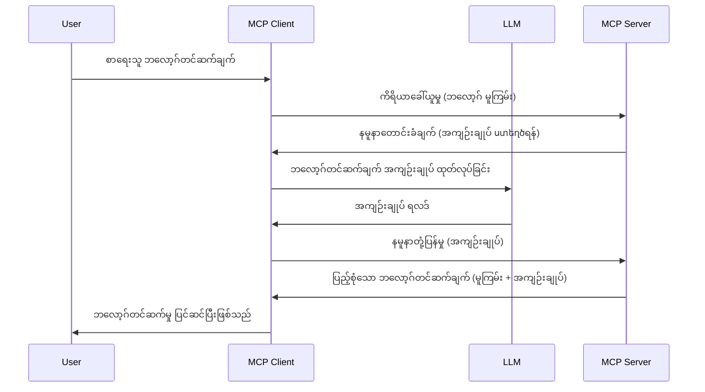

> [!WARNING]
> Sampling ကို MCP `2026-07-28` တွင် အသုံးမပြုတော့ပါ။ ဤသင်ခန်းစာကို များသောအားဖြင့် အဟောင်းအဆိပ်အသုံးပြုမှုများအတွက် ထိန်းသိမ်းထားသည်။ ဆာဗာအသစ်များသည် LLM ပံ့ပိုးသူ API နှင့် တိုက်ရိုက် ပေါင်းစည်းသင့်ပါသည်။
> New servers should integrate directly with an LLM
> provider API.

# Sampling - delegate features to the Client

> Sampling သည် `2026-07-28` သတ်မှတ်ချက်တွင် တွဲဖက်အသုံးပြုမှုအတွက်လည်း ရှိပြီး ဂျူလိုင် ၂၈၊ ၂၀၂၇ သို့မဟုတ် အချိန်ကာလအတွင်း မူလတစ်ကြိမ်ပြင်ဆင်ချက်၌ ဖယ်ရှားနိုင်သည်။ ဤသင်ခန်းစာ၌ ပါသော နမူနာများသည် `2025-11-25` ကို ထောက်ပံ့သည့် SDK API များကို အသုံးပြုနိုင်သည်။
> eligible for removal in the first revision released on or after July 28,
> 2027. Examples in this lesson may use SDK APIs that implement `2025-11-25`.
> See [What's Changed in MCP: The 2026-07-28 Specification](../../01-CoreConcepts/mcp-2026-07-28.md).

အဟောင်းအဆိပ်များတွင် Sampling သည် MCP ဆာဗာဟာ ဖောက်သည်မှ ဦးဆောင်သော LLM မှ အကူအညီတောင်းဆိုရန် ခွင့်ပြုသည်။ အသစ်များအတွက် သင့်သတ်မှတ်ထားသော LLM ပံ့ပိုးသူကို တိုက်ရိုက် ခေါ်ဆိုသင့်သည်။
managed by the client. For new implementations, call the chosen LLM provider
directly instead.

Sampling ကို အသုံးပြုမှုအမျိုးမျိုးနှင့် မည်သို့ မိတ်ဆက်တည်ဆောက်ရမည့်နည်းကို လေ့လာကြစို့။

## အကြောင်းအရာအကျဉ်း

ဤသင်ခန်းစာတွင် Sampling အသုံးပြုသည့် အချိန်နှင့် နေရာ၊ ဖွဲ့စည်းပုံကိစ္စတို့ကို အဓိကထား ရှင်းပြပါမည်။

## သင်ယူရမည့် ရည်မှန်းချက်များ

ဤအခန်းတွင် -

- Sampling ဆိုသည်မှာ ဘာလဲ၊ ဘယ်တော့ အသုံးပြုရမလဲ ဆိုတာ ရှင်းပြမည်။
- MCP တွင် Sampling ကို တပ်ဆင်ကြည့်ရန်။
- Sampling ကို လက်တွေ့အသုံးပြုထားသော နမူနာများ ကို ပြသမည်။

## Sampling ဆိုတာဘာလဲ၊ ဘာကြောင့် အသုံးပြုရတာလဲ?

Sampling သည် အဆင့်မြင့် လက္ခဏာတစ်ခုဖြစ်ပြီး အောက်ပါနည်းလမ်းဖြင့် လည်ပတ်သည်။



### Sampling တောင်းဆိုမှု

ကောင်းပြီ၊ ယခု ကျွန်ုပ်တို့မှာ ယုံကြည်စွာမြင်နိုင်သော အမြင့်မြင်ကြည့်မှုရှိသည့်အခါ Sampling တောင်းဆိုမှုကို ဆာဗာက ဖောက်သည်ထံ ပြန်ပို့ပုံကို ဆွေးနွေးကြပါစို့။ JSON-RPC ပုံစံနဲ့ ဒီလိုပုံစံရှိနိုင်သည်။

```json
{
  "jsonrpc": "2.0",
  "id": 1,
  "method": "sampling/createMessage",
  "params": {
    "messages": [
      {
        "role": "user",
        "content": {
          "type": "text",
          "text": "Create a blog post summary of the following blog post: <BLOG POST>"
        }
      }
    ],
    "modelPreferences": {
      "hints": [
        {
          "name": "claude-3-sonnet"
        }
      ],
      "intelligencePriority": 0.8,
      "speedPriority": 0.5
    },
    "systemPrompt": "You are a helpful assistant.",
    "maxTokens": 100
  }
}
```

ဤနေရာတွင် အရေးပါတော့ဖြစ်သည့်အချက်အလက်အနည်းငယ် ရှာတွေ့နိုင်ပါသည်။

- Prompt တွင် content -> text အတွင်းဖြစ်သော အရာသည် မိုဃ်းသားတင်ဆောင်းရာမှ အကြောင်းအရာကို ရှင်းလင်းဖေါ်ပြရန် LLM အတွက်ညွှန်ကြားချက်ဖြစ်ပါသည်။

- **modelPreferences**. ဤပိုင်းသည် ကောင်းကောင်းလှတယ်ညွှန်ကြားချက်တစ်ခုဖြစ်၍ LLM နဲ့သုံးရန် အကြံပြုချက်အဖြစ် ရှိသည်။ အသုံးပြုသူသည် ဤအကြံပြုချက်များအား လက်ခံရမည် ဒါမှမဟုတ် ပြောင်းလဲနိုင်သည်။ ဤကိစ္စတွင် မော်ဒယ်ကို အသုံးပြုရန်နှင့် အရှိန်နှင့်အသိအမှတ်ပြုမှု ဦးစားပေးမှုအကြောင်း ပြောကြားထားသည်။
- **systemPrompt**, ၎င်းသည် သင်၏ LLM အတွက် ကိုယ်ပိုင်အကျင့်ပြုနည်းနှင့် လမ်းညွှန်ချက်များ ပါဝင်သည့် ပုံမှန် စနစ်ထုတ်ပြန်ချက်ဖြစ်သည်။
- **maxTokens**, ရွေးချယ်ထားသည့် ဤလုပ်ငန်းအတွက် အသုံးပြုရန် အကြံပြုToken အရေအတွက်ဖြစ်သည်။

### Sampling တုံ့ပြန်မှု

ဤတုံ့ပြန်ချက်သည် MCP Client မှ MCP Server သို့ ပြန်ပို့သော အရာဖြစ်ပြီး၊ ဖောက်သည်က LLM က ခေါ်ဆိုပြီး တုံ့ပြန်ချက်ကို စောင့်ပြီး၊ အဲ့ဒီ message ကို ဖန်တီးသော ရလဒ် ဖြစ်သည်။ JSON-RPC ပုံစံမှာ ဒီလိုရှိနိုင်။

```json
{
  "jsonrpc": "2.0",
  "id": 1,
  "result": {
    "role": "assistant",
    "content": {
      "type": "text",
      "text": "Here's your abstract <ABSTRACT>"
    },
    "model": "gpt-5",
    "stopReason": "endTurn"
  }
}
```

တုံ့ပြန်ချက်သည် blog post အကျဉ်းချုပ်ဖြစ်ကြောင်း သတိပြုကြည့်ပါ။ အသုံးပြုသော `model` ကို ကျွန်ုပ်တို့ တောင်းဆိုသမျှ "claude-3-sonnet" မဟုတ်ပဲ "gpt-5" ဖြစ်သည်။ ၎င်းသည် အသုံးပြုသူသည် အသုံးပြုမည့် အရာကို ပြောင်းလဲနိုင်ပြီး sampling တောင်းဆိုမှုသည် အကြံပြုချက်ဖြစ်ပေါ်သည်ဆိုတာကို ဖော်ပြသည်။

အခုဦးတည်ချက်ကောင်းကို နားလည်သွားတာနဲ့အညီ "blog post ဖန်တီးမှု + အကျဉ်းချုပ်" အတွက် အသုံးတည့်ခွင့်ရှိသည်။ ၎င်းကို အလုပ်လုပ်အောင်လုပ်ရန် ဘာလုပ်ရမလဲ ကြည့်ကြရအောင်။

### စာတိုက်အမျိုးအစားများ

Sampling message များသည် စာသားတင်မကပါ၊ ပုံနှင့် အသံကိုလည်း ပို့နိုင်သည်။ JSON-RPC ပုံစံ အခြား ဒီလိုပါ။

**စာသား**

```json
{
  "type": "text",
  "text": "The message content"
}
```

**ပုံအကြောင်းအရာ**

```json
{
  "type": "image",
  "data": "base64-encoded-image-data",
  "mimeType": "image/jpeg"
}
```

**အသံအကြောင်းအရာ**

```json
{
  "type": "audio",
  "data": "base64-encoded-audio-data",
  "mimeType": "audio/wav"
}
```

> NOTE: လက်ရှိ အခြေအနေ နှင့် ပြောင်းရွှေ့မှု လမ်းညွှန်ချက်များအတွက်
> [deprecated Sampling documentation](https://modelcontextprotocol.io/specification/2026-07-28/client/sampling) ကို ကြည့်ပါ။

## Client တွင် Sampling ကို ပြင်ဆင်နည်း

> ကျေးဇူးပြု၍ မင်းသည် ဆာဗာတစ်ခုသာ တည်ဆောက်နေပါက၊ ဤနေရာတွင် ရိုးရိုးစွာ လုပ်စရာ မလိုပါ။

Client တွင် အောက်ပါ လက္ခဏာကို အောက်ပါအတိုင်း သတ်မှတ်ရမည်။

```json
{
  "capabilities": {
    "sampling": {}
  }
}
```

သင့်ရွေးထားသော client မှ ဆာဗာနှင့်စတင်တိုက်ဆိုင်သောအခါ ဤအရာကို ရွှေ့လျားယူပါလိမ့်မည်။

## Sampling ကို လက်တွေ့ အသုံးပြုခြင်း ဥပမာ - ဘလော့ဂ်စာတစ်ခု ဖန်တီးခြင်း

Sampling ဆာဗာတစ်ခုကို ရေးသားကြမယ်၊ ကျွန်ုပ်တို့ လိုအပ်တာတွေက -

1. ဆာဗာပေါ်မှာ tool တစ်ခု ဖန်တီးပါ။
1. ထို tool မှ sampling request တစ်ခု ဖန်တီးပါ။
1. tool သည် client ၏ sampling request ပြန်တုံ့ပြန်မှုကို စောင့်ပါ။
1. ရလဒ်ထွက်ပေးပါ။

အဆင့်လိုက် code ကို ကြည့်ကြရအောင် -

### -1- tool ဖန်တီးခြင်း

**python**

```python
@mcp.tool()
async def create_blog(title: str, content: str, ctx: Context[ServerSession, None]) -> str:
    """Create a blog post and generate a summary"""

```

### -2- sampling request တစ်ခု ဖန်တီးခြင်း

tool ကို အောက်ပါ code နဲ့ တိုးချဲ့ပါ။

**python**

```python
post = BlogPost(
        id=len(posts) + 1,
        title=title,
        content=content,
        abstract=""
    )

prompt = f"Create an abstract of the following blog post: title: {title} and draft: {content} "

result = await ctx.session.create_message(
        messages=[
            SamplingMessage(
                role="user",
                content=TextContent(type="text", text=prompt),
            )
        ],
        max_tokens=100,
)

```

### -3- တုံ့ပြန်မှုကို စောင့်ပြီး ပြန်ပို့ခြင်း

**python**

```python
post.abstract = result.content.text

posts.append(post)

# အကုန်ဆုံး ထုတ်ကုန်ကို ပြန်ပေးသည်
return json.dumps({
    "id": post.title,
    "abstract": post.abstract
})
```

### -4- အပြည့်အစုံ code

**python**

```python
from starlette.applications import Starlette
from starlette.routing import Mount, Host

from mcp.server.fastmcp import Context, FastMCP

from mcp.server.session import ServerSession
from mcp.types import SamplingMessage, TextContent

import json


from uuid import uuid4
from typing import List
from pydantic import BaseModel


mcp = FastMCP("Blog post generator")

# app = FastAPI()

posts = []

class BlogPost(BaseModel):
    id: int
    title: str
    content: str
    abstract: str

posts: List[BlogPost] = []

@mcp.tool()
async def create_blog(title: str, content: str, ctx: Context[ServerSession, None]) -> str:
    """Create a blog post and generate a summary"""

    post = BlogPost(
        id=len(posts) + 1,
        title=title,
        content=content,
        abstract=""
    )

    prompt = f"Create an abstract of the following blog post: title: {title} and draft: {content} "

    result = await ctx.session.create_message(
        messages=[
            SamplingMessage(
                role="user",
                content=TextContent(type="text", text=prompt),
            )
        ],
        max_tokens=100,
    )

    post.abstract = result.content.text

    posts.append(post)

    # ပြည့်စုံသော ဘလော့ဂ်စာတမ်းကို ပြန်ပေးသည်
    return json.dumps({
        "id": post.title,
        "abstract": post.abstract
    })

if __name__ == "__main__":
    print("Starting server...")
    # mcp.run()
    mcp.run(transport="streamable-http")

# အက်ပ်ကို အသုံးပြုရန်: python server.py ဖြင့် run ပြုလုပ်ပါ
```

### -5- Visual Studio Code တွင် စမ်းသပ်ခြင်း

Visual Studio Code တွင် စမ်းသပ်ရန် -

1. Terminal မှ ဆာဗာ စတင်ပါ။
1. *mcp.json* ထဲသို့ ထည့်လိုက်ပြီး (စတင်ထားမှုကို အတည်ပြုပြီး) အောက်ပါကဲ့သို့ ဖြစ်ရန်။

   ```json
   "servers": {
      "blog-server": {
        "type": "http",
        "url": "http://localhost:8000/mcp"
      }
   }
   ```

1. Prompt တစ်ခု ရိုက်ထည့်ပါ။

   ```text
   create a blog post named "Where Python comes from", the content is "Python is actually named after Monty Python Flying Circus"
   ```

1. Sampling လုပ်ငန်းစဉ်ဖြစ်ပါဦးမည်။ ပထမဆုံး စမ်းသပ်သောအခါ သင်သည် သဘောတူညီခြင်း အဆုံးဖြတ်ချက် dialogue တစ်ခုကို ကြုံတွေ့မည်၊ မျက်နှာပြင်ပုံမှန် dialog သို့ ပြင်ဆင်ခြင်းဖြင့် စဉ်ဆက်မပြတ် ကိရိယာကို ခေါ်လို့ရပါမည်။

1. ရလဒ်များကို အသေးစိတ်ကြည့်ရှုပါ။ GitHub Copilot Chat တွင် သဘောတူညီခွင့် ပြသထားပြီး၊ မူရင်း JSON တုံ့ပြန်မှုကိုလည်း ကြည့်ရှုနိုင်သည်။

**အပို**။ Visual Studio Code ကိရိယာတွင် Sampling အတွက် အထောက်အကူပြုမှု ကောင်းမွန်သည်။ သင့် စတင်ထားသော ဆာဗာတွင် Sampling ခွင့်ပြုချက်ကို အောက်ပါအတိုင်း ဖြတ်သန်း၍ ပြင်ဆင်နိုင်ပါသည်။

1. Extension အပိုင်းသို့ သွားပါ။
1. "MCP SERVERS - INSTALLED" ပိုင်းအောက်ရှိ သင့်တပ်ဆင်ထားသော ဆာဗာ၏ cog icon ကို ရွေးချယ်ပါ။
1 "Configure Model Access" ကို ရွေးပါ၊ ဤနေရာတွင် Sampling လုပ်စဉ်အတွက် GitHub Copilot သုံးမည့် မော်ဒယ်များကို ရွေးချယ်နိုင်သည်။ "Show Sampling requests" ကိုရွေး၍ မကြာသေးမီက ဖြစ်ပေါ်ခဲ့သော Sampling တောင်းဆိုမှုများကို ဖော်ပြနိုင်ပါသည်။

## အလုပ်အပ်

ဤအလုပ်အပ်မှာ သင်သည် sampling integration သေးငယ်တစ်ခု ဖြစ်စေရေး ဆောက်လုပ်မည်။ ထို့အတွက် နမူနာကတော့ -

**သရုပ်ပြချက်** - အီးကောမပ်စ်ပေါ် မျက်နှာပြင်အလုပ်သမားသည် ကုန်ပစ္စည်းဖော်ပြချက် များပြုလုပ်ရာတွင် အချိန် အများကြီး ပမာဏပိုနေတယ်။ ထို့ကြောင့် သင်သည် "title" နဲ့ "keywords" ကို argument အဖြစ်အသုံးပြုပြီး "create_product" လို့ခေါ်တဲ့ tool တစ်ခု ဖန်တီးရမည်၊ ၎င်းတွင် "description" field တစ်ခု ပါရှိပြီး client ၏ LLM မှ ဖြည့်စွက်ပေးမည်။

TIP: နောက်ဆုံး သင်ယူခဲ့သော အတိုင်း sampling request ဖြင့် ဤဆာဗာနှင့် tool ကို တည်ဆောက်ပါ။

## ဖြေရှင်းချက်

[Solution](./solution/README.md)

## အဓိကယူရန်အချက်များ


Sampling သည် server သည် LLM ၏ အကူအညီ လိုအပ်သောအခါ client ထံ သို့ တာဝန်များကို delegate လုပ်ပေးနိုင်သည့် အင်္ဂါရပ်အားကောင်း တစ်ခုဖြစ်သည်။

## နောက်တစ်ခန်းဘာတွေကသွားမလဲ

- [အခန်း ၄ - လက်တွေ့ကန့်သတ်ချက်ဖြင့် အကောင်အထည်ဖော်ခြင်း](../../04-PracticalImplementation/README.md)

---

<!-- CO-OP TRANSLATOR DISCLAIMER START -->
**ပြောကြားချက်**
ဤစာတမ်းကို AI ဘာသာပြန်ဝန်ဆောင်မှု [Co-op Translator](https://github.com/Azure/co-op-translator) အသုံးပြု၍ ဘာသာပြန်ထားပါသည်။ ကျွန်ုပ်တို့သည် တိကျမှန်ကန်မှုအတွက် ကြိုးပမ်းနေသော်လည်း၊ စက်ကိရိယာဘာသာပြန်ခြင်းများတွင် အမှားများ သို့မဟုတ် မှားယွင်းချက်များ ပါဝင်နိုင်ကြောင်း သတိပြုပါရန် လိုအပ်ပါသည်။ မူလစာတမ်းကို မူရင်းဘာသာဖြင့်သာ ယုံကြည်စိတ်ချရသော အချက်အလက်အဖြစ် သတ်မှတ်သင့်သည်။ အရေးကြီးသည့် သတင်းအချက်အလက်များအတွက် ပရော်ဖက်ရှင်နယ် လူသားဘာသာပြန်သူဝန်ဆောင်မှုကို အကြံပြုပါသည်။ ဤဘာသာပြန်ချက်ကို အသုံးပြုခြင်းမှ ဖြစ်ပေါ်လာသော နားလည်မှုကွာခြားမှုများ သို့မဟုတ် မမှန်ကန်သော အသုံးပြုမှုများအတွက် ကျွန်ုပ်တို့ တာဝန်မခံပါ။
<!-- CO-OP TRANSLATOR DISCLAIMER END -->