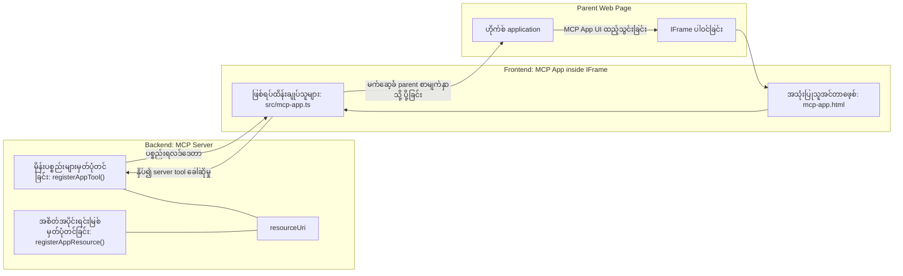
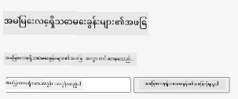
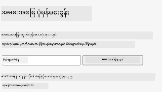
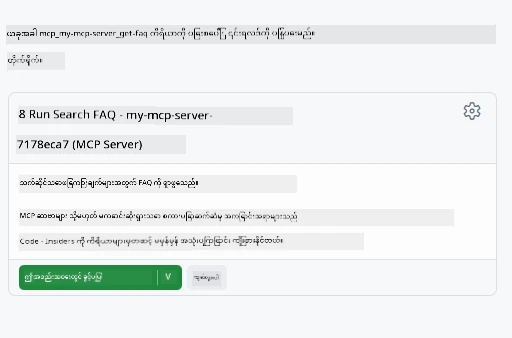
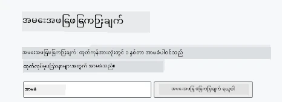

# MCP Apps

MCP Apps သည် MCP တွင် အရှယ်အစားအသစ်တစ်ခုဖြစ်သည်။ ယုံကြည်ချက်မှာ သင်သည် ကိရိယာခေါ်ဆိုမှုမှ ဒေတာကို ပြန်လည်တုံ့ပြန်သောအပြင် ဤသတင်းအချက်အလက်ကို မည်သို့ ဆက်သွယ်သင့်သည်ကိုပါ ပေးဆောင်ပါသည်။ ဒါဆိုတဲ့အဓိပ္ပါယ်က tool ရလဒ်တွေအခု UI သတင်းအချက်အလက် ပါဝင်နိုင်ပြီဆိုတာပါ။ ဒါဆို ဘာကြောင့် ဒီလိုလုပ်ချင်ကြတာလဲ? နေ့စဉ် သင်လုပ်နေတဲ့အတိုင်း စဉ်းစားကြည့်ပါစို့။ သင် MCP Server ရဲ့ ရလဒ်တွေကို frontend တည်ဆောက်ပြီး အသုံးပြုနေတတ်တယ်။ ၎င်းက စနစ်ကြီးမှာ သင်ရေးပြီး ပြုပြင်ထိန်းသိမ်းရမည့် ကုဒ်ဖြစ်တယ်။ တခါတရံ ဘာသာရပ်တစ်ခုလိုချင်တတ်ပေမယ့် အချို့အခါ data ကနေ user interface ထိ အစုလိုက်အပြုံလိုက် ကောက်နုတ်ထားတဲ့ သတင်းအချက်အလက် တစ်ခုပဲ နဲ့လာရင် အထောက်အကူပြုမှာဖြစ်ပါတယ်။

## အကြောင်းအရာအနှစ်ချုပ်

ဒီသင်ခန်းစာမှာ MCP Apps အကြောင်း လက်တွေ့လမ်းညွှန်ချက်တွေ၊ ဘယ်လိုစတင်သုံးရန်၊ ရှိပြီးသား Web Apps တွေနဲ့ ဘယ်လိုပေါင်းစည်းရမယ်ဆိုတာ တင်ပြထားပါတယ်။ MCP Apps က MCP Standard ထဲသို့ သစ်စက်အသစ်တစ်ခုပါ။

## သင်ယူရမည့် ရည်ရွယ်ချက်များ

ဒီသင်ခန်းစာအဆုံးမှာ သင်သည် အောက်ပါအရာများ ပြုလုပ်နိုင်လိမ့်မည်-

- MCP Apps ဆိုတာဘာလဲဆိုတာရှင်းပြနိုင်သည်။
- MCP Apps ကို ဘာအချိန်တွင် သုံးရမည်ဆိုတာနားလည်တယ်။
- ကိုယ်တိုင် MCP Apps ကို တည်ဆောက် & ပေါင်းစည်းနိုင်သည်။

## MCP Apps - ဘယ်လိုအလုပ်လုပ်သလဲ

MCP Apps အတွက်ရည်ရွယ်ချက်မှာ နောက်ဆုတ်တုံ့ပြန်ချက်တစ်ခုအား ကွန်ပိုနင့်အဖြစ် ပေးဆောင်ခြင်းဖြစ်သည်။ ကွန်ပိုနင့်မှာ အမြင်၊ လက်တွေ့ဖောက်သည်နှင့် ဆက်နွယ်မှုများ ပါဝင်နိုင်သည်၊ ဥပမာ ခလုတ်နှိပ်ခြင်း၊ အသုံးပြုသူထည့်သွင်းမှု စသည်ဖြစ်သည်။ စတင်လျှင် server ဘက်နှင့် MCP Server ကအစစအရာရာစတင်ပါမည်။ MCP App ကွန်ပိုနင့်တစ်ခု တည်ဆောက်ရန်အတွက် အထောက်အကူပြု ကိရိယာတစ်ခုနှင့် application resource တစ်ခု တည်ဆောက်ရမည်။ ဤနှစ်ခုကို resourceUri ဖြင့် ဖော်ဆက်ထားသည်။

ဥပမာအားဖြင့် ကြည့်ပါစို့။ ဘာများပါ၀င်ပြီး ဘာလုပ်ဆောင်တာလဲဆိုတာ ဖော်ပြကြည့်ရအောင်-

```text
server.ts -- responsible for registering tools and the component as a UI component
src/
  mcp-app.ts -- wiring up event handlers
mcp-app.html -- the user interface
```

ဤ မြင်ကွင်းသည် ကွန်ပိုနင့်တည်ဆောက်မှုနှင့် ၎င်း၏ လုပ်ဆောင်မှုကို ဖော်ပြသည်။


နောက်တိုင်း backend နှင့် frontend တိုင်းတာတာဝန်များအား ရှင်းပြကြရအောင်။

### Backend

ဒီမှာ ပြီးမြောက်ရမည့် အရာနှစ်ခုရှိသည်-

- ဆက်သွယ်ရန်လိုသော ကိရိယာများကို မှတ်ပုံတင်ခြင်း။
- ကွန်ပိုနင့်ကို သတ်မှတ်ခြင်း။

**ကိရိယာမှတ်ပုံတင်ခြင်း**

```typescript
registerAppTool(
    server,
    "get-time",
    {
      title: "Get Time",
      description: "Returns the current server time.",
      inputSchema: {},
      _meta: { ui: { resourceUri } }, // ဒီကိရိယာနဲ့ UI ရင်းမြစ်ကိုချိတ်ဆက်သည်
    },
    async () => {
      const time = new Date().toISOString();
      return { content: [{ type: "text", text: time }] };
    },
  );

```

အထက်ပါကုဒ်မှာ `get-time` ဟုခေါ်သော ကိရိယာတစ်ခု ထုတ်ဖော်သည်။ ဒါဟာ input မလိုအပ်ပေမယ့် မိန့်စာချိန်ကို ထုတ်ပေးသည်။ အသုံးပြုသူ input လက်ခံရန်လိုပါက `inputSchema` ကို သတ်မှတ်နိုင်သည်။

**ကွန်ပိုနင့်မှတ်ပုံတင်ခြင်း**

တူညီသောဖိုင်ထဲမှာ ကွန်ပိုနင့်ကိုလည်း မှတ်ပုံတင်ရမည်-

```typescript
const resourceUri = "ui://get-time/mcp-app.html";

// UI အတွက် bundled HTML/JavaScript ကို ပြန်လာသော resource ကို မှတ်ပုံတင်ပါ။
registerAppResource(
  server,
  resourceUri,
  resourceUri,
  { mimeType: RESOURCE_MIME_TYPE },
  async () => {
    const html = await fs.readFile(path.join(DIST_DIR, "mcp-app.html"), "utf-8");

    return {
    contents: [
        { uri: resourceUri, mimeType: RESOURCE_MIME_TYPE, text: html },
    ],
    };
  },
);
```

`resourceUri` တွင် အတူတကွ ဆက်နွယ်သော ကိရိယာများနှင့် ကွန်ပိုနင့်ကို ဖော်ပြထားသည်။ ထူးခြားချက်မှာ UI ဖိုင်ကို load ပြီး ကွန်ပိုနင့်ကို ပြန်ထုတ်ပေးသည့် callback ဖြစ်သည်။

### ကွန်ပိုနင့် frontend

Backend ကဲ့သို့ frontend တွင်နှစ်ပိုင်းရှိသည်-

- ပုံမှန် HTML ဖြင့် ရေးဆွဲထားသော frontend။
- ကိရိယာခေါ်ဆိုမှု၊ မက်ဆေ့ခ်ျပို့ခြင်း စသည့် event ကို စီမံသည့်ကုဒ်။

**အသုံးပြုသူအင်တာဖေ့စ်**

အသုံးပြုသူအင်တာဖေ့စ်ကို ကြည့်ပါ-

```html
<!-- mcp-app.html -->
<!DOCTYPE html>
<html lang="en">
  <head>
    <meta charset="UTF-8" />
    <title>Get Time App</title>
  </head>
  <body>
    <p>
      <strong>Server Time:</strong> <code id="server-time">Loading...</code>
    </p>
    <button id="get-time-btn">Get Server Time</button>
    <script type="module" src="/src/mcp-app.ts"></script>
  </body>
</html>
```

**အဖြစ်အပျက်ချိတ်ဆက်ခြင်း**

နောက်ဆုံးပစ္စည်းမှာ အဖြစ်အပျက်ချိတ်ဆက်ခြင်းဖြစ်သည်။ UI ထဲတွင် အဖြစ်အပျက်ကို ကိုင်တွယ်ရန်နေရာနှင့် အဖြစ်အပျက် ဖြစ်လာသည့်အခါ ဆောင်ရွက်ရမည့်အတိုင်း ရှင်းပြသည်-

```typescript
// mcp-app.ts

import { App } from "@modelcontextprotocol/ext-apps";

// အချက်အလက်အရာဝတ္ထုများကို ရယူပါ
const serverTimeEl = document.getElementById("server-time")!;
const getTimeBtn = document.getElementById("get-time-btn")!;

// အက်ပ်အင်စတန်စ်တစ်ခု ဖန်တီးပါ
const app = new App({ name: "Get Time App", version: "1.0.0" });

// ဆာဗာမှ tool ရလဒ်များကို ကိုင်တွယ်ပါ။ `app.connect()` မပြုလုပ်ခင်ဦး စွာ သတ်မှတ်ရန်၊
// အစပိုင်း tool ရလဒ် မပျောက်ဆုံးစေဖို့။
app.ontoolresult = (result) => {
  const time = result.content?.find((c) => c.type === "text")?.text;
  serverTimeEl.textContent = time ?? "[ERROR]";
};

// ခလုတ် နှိပ်ခြင်းကို ချိတ်ဆက်ပါ
getTimeBtn.addEventListener("click", async () => {
  // `app.callServerTool()` သည် UI ကို ဆာဗာမှ သစ်သော ဒေတာ ရယူရန် ခွင့်ပြုသည်
  const result = await app.callServerTool({ name: "get-time", arguments: {} });
  const time = result.content?.find((c) => c.type === "text")?.text;
  serverTimeEl.textContent = time ?? "[ERROR]";
});

// ဟော့စ်နှင့် ချိတ်ဆက်ပါ
app.connect();
```

အထက်ပါ ကုဒ်အတိုင်း DOM အစိတ်အပိုင်းများနှင့် အဖြစ်အပျက်များချိတ်ဆက်ခြင်းဖြစ်သည်။ ထူးခြားချက်မှာ backend အပေါ်ကိရိယာကို ခေါ်ယူရန် `callServerTool` ကိုခေါ်သုံးသည်။

## အသုံးပြုသူ input ကို ကိုင်တွယ်ခြင်း

ယခုအထိ ခလုတ်နှိပ်ရင် ကိရိယာခေါ်ဆိုတာပါဝင်တဲ့ ကွန်ပိုနင့်ကို ဖြတ်သွားပြီ။ အခု input field တစ်ခု ထည့်ပြီး argument များ tool ထံပို့နိုင်မလား စမ်းကြည့်မယ်။ FAQ လုပ်ဆောင်မှုတစ်ခု ဖန်တီးကြည့်ပါမယ်- ရပ်တည်ချက်က

- ခလုတ်တင်းနှင့် အသုံးပြုသူ keyword ရိုက်ထည့်တဲ့ input element ရှိရမည်၊ ဥပမာ "Shipping" ဟု ရိုက်ထည့်သည်။ ဒါဟာ backend တွင် FAQ ဒေတာကို ရှာဖွေမှုလုပ်ဆောင်တဲ့ tool ကိုခေါ်ပါမယ်။
- ထို FAQ ရှာဖွေမှုကို ထောက်ပံ့သည့် tool တစ်ခု။

ပထမဆုံး backend ကို အောက်ပါအတိုင်း မြှင့်တင်လိုက်ရအောင်-

```typescript
const faq: { [key: string]: string } = {
    "shipping": "Our standard shipping time is 3-5 business days.",
    "return policy": "You can return any item within 30 days of purchase.",
    "warranty": "All products come with a 1-year warranty covering manufacturing defects.",
  }

registerAppTool(
    server,
    "get-faq",
    {
      title: "Search FAQ",
      description: "Searches the FAQ for relevant answers.",
      inputSchema: zod.object({
        query: zod.string().default("shipping"),
      }),
      _meta: { ui: { resourceUri: faqResourceUri } }, // ဤကိရိယာအား ၎င်း၏ UI ရင်းမြစ်နှင့် ချိတ်ဆက်သည်
    },
    async ({ query }) => {
      const answer: string = faq[query.toLowerCase()] || "Sorry, I don't have an answer for that.";
      return { content: [{ type: "text", text: answer }] };
    },
  );
```

ဒီမှာ မြင်ရတာက `inputSchema` ကို `zod` schema ဖြင့် ပြည့်စုံစွာ ဖော်ပြထားတာဖြစ်တယ်-

```typescript
inputSchema: zod.object({
  query: zod.string().default("shipping"),
})
```

အထက်ပါ schema တွင် `query` ဟု အမည်ရ input parameter ရှိပြီး ပုဂ္ဂိုလ်ရေးဖြစ်၍ `shipping` ဟူသော အကြောင်းအရာအား ပုံသေထားသည်။

အိုကေ၊ *mcp-app.html* ကို ရောက်ပြီး ဒီလို UI ဘာတွေလိုသလဲ ကြည့်ကြရအောင်-

```html
<div class="faq">
    <h1>FAQ response</h1>
    <p>FAQ Response: <code id="faq-response">Loading...</code></p>
    <input type="text" id="faq-query" placeholder="Enter FAQ query" />
    <button id="get-faq-btn">Get FAQ Response</button>
  </div>
```

ကောင်းပြီ၊ input element နဲ့ ခလုတ်ရှိပြီးပြီ။ *mcp-app.ts* ကို သွားပြီး အဖြစ်အပျက်များ ချိတ်ဆက်ကြရအောင်-

```typescript
const getFaqBtn = document.getElementById("get-faq-btn")!;
const faqQueryInput = document.getElementById("faq-query") as HTMLInputElement;

getFaqBtn.addEventListener("click", async () => {
  const query = faqQueryInput.value;
  const result = await app.callServerTool({ name: "get-faq", arguments: { query } });
  const faq = result.content?.find((c) => c.type === "text")?.text;
  faqResponseEl.textContent = faq ?? "[ERROR]";
});
```

ကုဒ်အပေါ်မှာ-

- စိတ်ဝင်စားဖွယ် UI element များ reference ဖန်တီးထားသည်။
- ခလုတ်နှိပ်သောအခါ input value ကို ဖော်ထုတ်ပြီး `app.callServerTool()` ကို `name` နဲ့ `arguments` ဖြင့် ခေါ်သည်၊ အဲ့မှာ arguments မှာ `query` ကို ပေးဖြတ်သည်။

`callServerTool` ခေါ်သည့်အခါ သဘောကတော့ မိခင် window ကို message ပေးပို့ပြီး မိခင် window က MCP Server ကို ခေါ်ယူပေးတယ်။

### သုံးကြည့်ပါ

စမ်းသပ်ကြည့်ရင် -



အောက်ပါအတိုင်း "warranty" ရိုက်ထည့်ပြီးစမ်းကြည့်သော နမူနာ-



ဤကုဒ်ကို ဆောင်ရွက်ရန် [Code section](./code/README.md) ကို သွားပါ။

## Visual Studio Code ထဲတွင် စမ်းသပ်ခြင်း

Visual Studio Code သည် MVP Apps အတွက် အသုံးအဆင်ပြေပြီး MCP Apps စမ်းသပ်ရာတွင် အလွန်လွယ်ကူသည်။ Visual Studio Code အသုံးပြုရန် *mcp.json* တွင် အောက်ပါအတိုင်း server entry ထည့်ပါ-

```json
"my-mcp-server-7178eca7": {
    "url": "http://localhost:3001/mcp",
    "type": "http"
  }
```

နောက် server ကို စတင်လိုက်ပါ- ဟာ MCP App နှင့် အချိတ်ဆက်ရန် ကျွန်ုပ်တို့ GitHub Copilot ထည့်သွင်းထားပါက Chat Window မှတစ်ဆင့် ဆက်သွယ်နိုင်ပါသည်။

ဥပမာ #get-faq ဖြင့် prompt ကို trigger လုပ်ခြင်း-



Web browser မှ လည်ပတ်သောအတိုင်း တူညီသောပုံစံဖြင့် UI ကို ဖော်ပြနိုင်သည်-



## တာဝန်အပ်ထားမှု

Rock paper scissor ဂိမ်းတစ်ခု ဖန်တီးပါ။ အောက်ဖော်ပြပါရည်မှတ်များ ပါဝင်ရမည်-

UI:

- ရွေးချယ်မှုတွေပေးသည့် dropdown စာရင်း
- ရွေးချယ်မှု တင်သွင်းရန် ခလုတ်
- ဘယ်သူဘာရွေးနှိပ်ပြီးဆိုတာနဲ့ ဘယ်သူအနိုင်ရလဲဆိုတာ ပြသသည့် လိပ်စာ

Server:

- `choice` ကို input အဖြစ် လက်ခံသည့် rock paper scissor tool တစ်ခု ရှိရမည်။ ကွန်ပျူတာရွေးချယ်မှုနှင့် အနိုင်ရသူ သတ်မှတ်ချက် မပါမဖြစ်ပါ။

## ဖြေရှင်းချက်

[Solution](./assignment/README.md)

## အကျဉ်းချုပ်

MCP Apps ဆိုတဲ့ paradigm အသစ်ကို ယခုသင်တန်းတွင် သင်ယူခဲ့သည်။ MCP Servers တွေဟာ data ကသာမက ထို data ကို မည်သိုင်းမ်ဖော်ပြသင့်သည်ဆိုတာကို ပိုင်ဆိုင်အမြင် ထိန်းသိမ်းခွင့် ရရှိသည်။

ထို MCP Apps များကို IFrame မှာထားပြီး MCP Servers တွေနဲ့ ဆက်သွယ်ရန် မိခင် web app ထံ သတင်းပို့အပ်ရန် လိုအပ်သည်။ ဤဆက်သွယ်မှုကို လွယ်ကူစေရန် JavaScript ၊ React စသည့် အသုံးအများအပြား ဖိုက်ချ်များရှိပါသည်။

## အဓိက ယူရမည့် စကားလုံးများ

သင်ယူခဲ့သောအချက်များမှာ-

- MCP Apps သည် data နှင့် UI အင်္ဂါရပ်များ ကို တစ်ပြိုင်နက် ပေးပို့လိုသောအခါ အသုံးဝင်သည့် စံနှုန်း အသစ်ဖြစ်သည်။
- ဤအမျိုးစား apps များကို လုံခြုံမှုအတွက် IFrame အတွင်းတွင် လည်ပတ်သည်။

## နောက်တော်တော်

- [အခန်း ၄](../../04-PracticalImplementation/README.md)

---

<!-- CO-OP TRANSLATOR DISCLAIMER START -->
**ကန့်ကွက်ချက်**:  
ဤစာရွက်ကို AI ဘာသာပြန်ဝန်ဆောင်မှု [Co-op Translator](https://github.com/Azure/co-op-translator) သုံး၍ ဘာသာပြန်ထားပါသည်။ ကျွန်ုပ်တို့သည် မှန်ကန်မှုကို ကြိုးစားအားထုတ်သော်လည်း အလိုအလျောက်ဘာသာပြန်မှုတွင် အမှားများသို့မဟုတ် မှားယွင်းချက်များရှိနိုင်ပါသည်။ မူရင်းစာရွက်ကို မှတ်စုဘာသာဖြင့် အတည်ပြုအရင်းအမြစ်အဖြစ်ကိုသာ ယူဆပါရန် လိုအပ်ပါသည်။ အရေးကြီးသည့် အချက်အလက်များအတွက် ကုသိုလ်ရှင်ပညာရှင်များ၏ လူ့ဘာသာပြန်ဝန်ဆောင်မှုကို အသုံးပြုရန် အကြံပြုပါသည်။ ဤဘာသာပြန်မှုကို အသုံးပြုခြင်းမှ ဖြစ်ပေါ်လာသည့် နားမလည်မှုများ သို့မဟုတ် မှားယွင်းစွာ စိတ်ဝင်စားမှုများအတွက် ကျွန်ုပ်တို့ အချုပ်မှုမရှိပါ။
<!-- CO-OP TRANSLATOR DISCLAIMER END -->