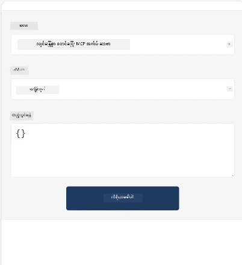
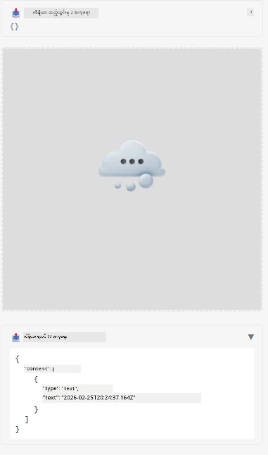

Here's a sample demonstrating MCP App

## Install 

1. *mcp-app* ဖိုလ်ဍာထဲသို့ ချဉ်းကပ်ပါ
1. `npm install` ကို chạy ပါ၊ ဒါက frontend နဲ့ backend မူလတန်းများကို 설치 လုပ်လိမ့်မည်

Backend ကုဒ် compile လုပ်နိုင်မလားစစ်ဆေးရန်:

```sh
npx tsc --noEmit
```

အရာအားလုံးမှန်ကန်ပါက output မထွက်ပါရဲ့။

## Run backend

> Windows စက်တစ်လုံးမှာ သင့်မှာ MCP Apps ဖြေရှင်းချက်က `concurrently` library ကို အသုံးပြုတဲ့အတွက် အခြားတစ်ခုကို ရှာဖွေရန်လိုသည်။ MCP App ထဲက *package.json* မှာ ထိုကောက်ခံလိုက်သောလိုင်းမှာ:

    ```json
    "start": "concurrently \"cross-env NODE_ENV=development INPUT=mcp-app.html vite build --watch\" \"tsx watch main.ts\""
    ```

ဒီ app ကို နှစ်ပိုင်းဖြင့် ဖွဲ့စည်းထားပါတယ်၊ backend ပိုင်းနဲ့ host ပိုင်း။

Backend ကို အောက်ပါအတိုင်း စတင်ပါ:

```sh
npm start
```

ဒီဟာက `http://localhost:3001/mcp` ပေါ်မှာ backend ကို run လုပ်မယ်။

> သတိပြုပါ၊ သင် Codespace တစ်ခုမှာရှိပါက port visibility ကို public အဖြစ် သတ်မှတ်ရန် လိုတတ်ပါသည်။ https://<name of Codespace>.app.github.dev/mcp မှတဆင့် browser မှာ endpoint ထိရောက်မှုရှိမရှိ စစ်ဆေးပါ။

## Choice -1 Visual Studio Code မှာ app ကို စမ်းသပ်ရန်

Visual Studio Code မှာ solution ကို စမ်းသပ်ဖို့ အောက်ပါအတိုင်းလုပ်ပါ:

- `mcp.json` ထဲကို အောက်ပါအတိုင်း server entry ကို ထည့်ပါ:

    ```json
    {
        "servers": {
            "my-mcp-server-7178eca7": {
                "url": "http://localhost:3001/mcp",
                "type": "http"
            }
        },
        "inputs": []
    }
    ```

1. *mcp.json* မှာ "start" ခလုတ်ကို နှိပ်ပါ
1. Chat ဝင်းဒိုး လိုင်းတစ်ခု ဖွင့်၍ `get-faq` ရိုက်ထည့်ပါ၊ ဒီလိုရလဒ်တစ်ခုကို တွေ့ရမည်-

    

## Choice -2- Host ဖြင့် app ကို စမ်းသပ်ပါ

Repo <https://github.com/modelcontextprotocol/ext-apps> တွင် MVP Apps ကို စမ်းသပ်ရန် အသုံးပြုနိုင်သည့် hosts များစွာပါဝင်သည်။

ဒီမှာ သင်အားနှစ်မျိုးရွေးချယ်စရာ ပေးပါမည်-

### ဒေသတွင်းစက်

- Repo မွ clone လုပ်ပြီးနောက် *ext-apps* သို့ ချဉ်းကပ်ပါ။

- မူလတန်းများ 설치 လုပ်ပါ။

   ```sh
   npm install
   ```

- ဒေါင်းလုပ် terminal window အသစ်တစ်ခုမှာ *ext-apps/examples/basic-host* ထဲ သွားပါ။

    > သင် Codespace ရှိပါက serve.ts ကို ဝင်ပြီး 27 လိုင်းမှာ http://localhost:3001/mcp ကို သင့် Codespace URL ဖြင့် အစားထိုးပါ၊ ဥပမာ https://psychic-xylophone-657rpjgvxpc5g64-3001.app.github.dev/mcp

- Host အား run ပါ:

    ```sh
    npm start
    ```

    ဒါက host နဲ့ backend ကို ဆက်သွယ်ပြီး app ကို ဒီလိုမြင်ရမှာ ဖြစ်ပါတယ်-

    

### Codespace

Codespace ပတ်ဝန်းကျင်တစ်ခုကို အလုပ်လုပ်စေရန် အနည်းငယ်ပိုထောင့်တည်မှုလိုအပ်ပါတယ်။ Codespace မှတဆင့် host အသုံးပြုလျှင်-

- *ext-apps* ဖိုလ်ဒါကို ကြည့်ပြီး *examples/basic-host* သို့ သွားပါ။
- `npm install` ဖြင့်မူလတန်းများ 설치 လုပ်ပါ
- `npm start` ဖြင့် host ကို စတင်ပါ။

## app ကို စမ်းသပ်ပါ

အောက်ပါနည်းဖြင့် app ကို စမ်းသပ်ပါ:

- "Call Tool" ခလုတ်ကို ရွေးချယ်ပြီး အောက်ပါအတိုင်း ရလဒ်တွေကို မြင်ရပါလိမ့်မယ်-

    

အဆင်ပြေပါပြီ၊ တစ်ခါတည်း အလုပ်လုပ်နေပါပြီ။

---

<!-- CO-OP TRANSLATOR DISCLAIMER START -->
**တရားမဝင်ချက်**:
ဤစာတမ်းကို AI ဘာသာပြန်ဝန်ဆောင်မှု [Co-op Translator](https://github.com/Azure/co-op-translator) ဖြင့် ဘာသာပြန်ထားသည်။ ကျွန်ုပ်တို့သည် တိကျမှန်ကန်မှုအတွက် ကြိုးပမ်းနေသော်လည်း၊ အလိုအလျောက် ဘာသာပြန်ခြင်းများတွင် အမှားများ သို့မဟုတ် မှန်ကန်မှု မရှိနိုင်ခြင်းများ ပါဝင်နိုင်ကြောင်း သတိပြုပါရန်။ မူရင်းစာတမ်းကို မူရင်းဘာသာဖြင့် ဆက်လက် ယူဆရန် ဦးစားပေးကြည့်ရန် အကြံပြုပါသည်။ အရေးကြီးသောသတင်းအချက်အလက်များအတွက်တော့ လူကိုယ်တိုင် ဘာသာပြန်ခြင်းကို အသုံးပြုရန် ညွှန်ကြားပါသည်။ ဤဘာသာပြန်ချက်ကို အသုံးပြုမှုကြောင့် ဖြစ်ပေါ်လာနိုင်သော ထင်ရှားမှုများ သို့မဟုတ် မှားယွင်းစွာ ဖြေရှင်းမှုများအတွက် ကျွန်ုပ်တို့ မည်သည့်တာဝန်ကိုမှ မယူဆောင်ပါ။
<!-- CO-OP TRANSLATOR DISCLAIMER END -->