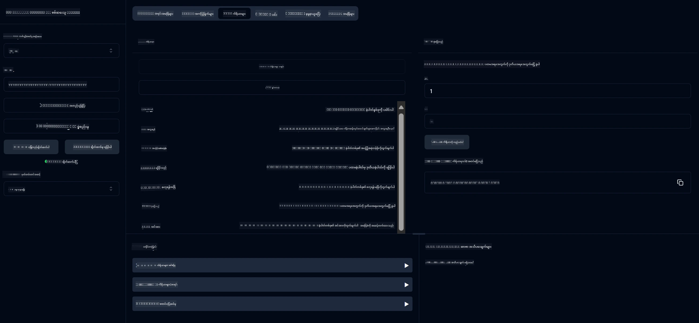

# အခြေခံကိန်းဂဏန်းတွက်စက် MCP ဝန်ဆောင်မှု

> [!NOTE]
> ဤနမူနာသည် အတိတ် HTTP+SSE ပို့ဆောင်မှုကို အသုံးပြုထားပြီး MCP `2025-11-25` နှင့် ကိုက်ညီသော SDK ကို ရည်မှန်းသည်။ အသစ်ရောက်ရှိလာသော နယ်ရာဝန်ဆောင်မှုများသည် `2026-07-28` Streamable HTTP အထောက်အပံ့ကို အသုံးပြုသင့်သည်။
> 
> 

ဤဝန်ဆောင်မှုသည် Model Context Protocol (MCP) ကို Spring Boot နှင့် WebFlux ပို့ဆောင်မှုဖြင့် အသုံးပြုကာ အခြေခံကိန်းဂဏန်းတွက်စက် လုပ်ဆောင်ချက်များကို ပေးသည်။ MCP အက်ပ်ကို သင်ယူနေသော စတင်သူများအတွက် ရိုးရိုးရှင်းရှင်း နမူနာတစ်ခုအဖြစ် ဖန်တီးထားသည်။

ပိုမိုသိရှိလိုပါက [MCP Server Boot Starter](https://docs.spring.io/spring-ai/reference/api/mcp/mcp-server-boot-starter-docs.html) ကို အသုံးပြု၍ ကြည့်ရှုနိုင်သည်။

## ကိစ္စအနှစ်ချုပ်

ဝန်ဆောင်မှုသည် အောက်ပါအချက်များကို ဖော်ပြသည်။
- SSE (Server-Sent Events) အထောက်အပံ့
- Spring AI ၏ `@Tool` အမှတ်အသားဖြင့် ကိရိယာအလိုအလျောက် မှတ်ပုံတင်ခြင်း
- အခြေခံ ကိန်းဂဏန်းတွက်စက် လုပ်ဆောင်ချက်များ
  - ပေါင်းခြင်း၊ နှုတ်ခြင်း၊ မြှင့်တင်ခြင်း၊ ဖြန့်ခြင်း
  - ပါဝါတွက်ချက်ခြင်းနှင့် စတုရန်းမြစ်
  - မော်ဒူလပ်(ကျန်မှတ်) နှင့် တန်ဖိုးအပြည့်အစုံ
  - လုပ်ဆောင်ချက်ဖော်ပြချက်များအတွက် အကူအညီလုပ်ဆောင်ချက်

## လက္ခဏာများ

ဤကိန်းဂဏန်းတွက်စက် ဝန်ဆောင်မှုမှာ အောက်ပါ စွမ်းဆောင်ရည်များ ပါဝင်သည်။

1. **အခြေခံ သင်္ချာရေး လုပ်ဆောင်ချက်များ**:
   - အရေအတွက် နှစ်ခု ပေါင်းခြင်း
   - တစ်ခုထဲ၏ အရေအတွက်ကို နောက်တစ်ခုမှ နှုတ်ခြင်း
   - အရေအတွက် နှစ်ခု မြှင့်တင်ခြင်း
   - တစ်ခု၏ အရေအတွက်ကို နောက်တစ်ခုဖြင့် ဖြန့်ခြင်း (သုညကော်ဒ်စစ်ဆေးမှုပါ၀င်သည်)

2. **အဆင့်မြင့် လုပ်ဆောင်ချက်များ**:
   - ပါဝါတွက်ချက်ခြင်း (အခြေခံကို စွမ်းအင်သို့ မြှင့်တင်ခြင်း)
   - စတုရန်းမြစ်တွက်ချက်ခြင်း (ကိုက်ညီခြင့်ရှိခြင်းစစ်ဆေးမှုနှင့်)
   - မော်ဒူလပ်(ကျန်မှတ်)တွက်ချက်ခြင်း
   - တန်ဖိုးအပြည့်အစုံတွက်ချက်ခြင်း

3. **အကူအညီစနစ်**:
   - အသုံးပြုနိုင်သောလုပ်ဆောင်ချက်အားလုံး ရှင်းပြသော ပုံမှန် အကူအညီလုပ်ဆောင်ချက်

## ဝန်ဆောင်မှုအသုံးပြုခြင်း

ဝန်ဆောင်မှုသည် MCP ပရိုတိုကော်မှတဆင့် အောက်ပါ API အဆုံးအဖြတ်များကို ဖော်ပြထားသည်။

- `add(a, b)`: အရေအတွက်နှစ်ခုစုစည်းခြင်း
- `subtract(a, b)`: ပထမအရေအတွက်မှ ဒုတိယအရေအတွက်နှုတ်ခြင်း
- `multiply(a, b)`: အရေအတွက်နှစ်ခု မြှင့်တင်ခြင်း
- `divide(a, b)`: ပထမအရေအတွက်ကို ဒုတိယအရေအတွက်ဖြင့် ဖြန့်ခြင်း (သုညစစ်ဆေးမှုပါ၀င်သည်)
- `power(base, exponent)`: အရေအတွက်၏ ပါဝါတွက်ချက်ခြင်း
- `squareRoot(number)`: စတုရန်းမြစ်တွက်ချက်ခြင်း (အနိမ့်တန်ဖိုးစစ်ဆေးမှုပါ၀င်သည်)
- `modulus(a, b)`: ဖြန့်ခြင်းအား ကျန်ရှိသော အတုံ့အခေါ်တွက်ချက်ခြင်း
- `absolute(number)`: တန်ဖိုးအပြည့်အစုံတွက်ချက်ခြင်း
- `help()`: အသုံးပြုနိုင်သည့် လုပ်ဆောင်ချက်များအကြောင်း သိရှိရန်

## စမ်းသပ်သူ Client

`com.microsoft.mcp.sample.client` package ထဲတွင် ရိုးရိုးရှင်းရှင်းသော စမ်းသပ်သူ client ပါဝင်သည်။ `SampleCalculatorClient` class သည် ကိန်းဂဏန်းတွက်စက် ဝန်ဆောင်မှု၏ လုပ်ဆောင်ချက်များကို ပြသသည်။

## LangChain4j Client အသုံးပြုခြင်း

ပရောဂျက်တွင် `com.microsoft.mcp.sample.client.LangChain4jClient` အဖြစ် LangChain4j နဲ့ GitHub မော်ဒယ်များကို ပေါင်းစပ်သုံးနိုင်သည့် ဥပမာ client ပါဝင်သည်။

### လိုအပ်ချက်များ

1. **GitHub Token ပြင်ဆင်ခြင်း**:
   
   GitHub ၏ AI မော်ဒယ်များ (ဥပမာ phi-4) ကို အသုံးပြုရန် GitHub personal access token လိုအပ်သည်။

   a. ကိုယ်ပိုင် GitHub အကောင့်၏ settings သို့ သွားပါ: https://github.com/settings/tokens
   
   b. "Generate new token" ကို နှိပ်ပြီး "Generate new token (classic)" ကို ရွေးပါ
   
   c. သင့် token ကို ဖော်ပြရမည့် အမည် သတ်မှတ်ပါ
   
   d. အောက်ပါ scopes များကို ရွေးချယ်ပါ:
      - `repo` (ပုဂ္ဂလိက repository များအပြည့်အ၀ ထိန်းချုပ်ခွင့်)
      - `read:org` (အဖွဲ့အစည်းနှင့် အဖွဲ့ဝင်စာရင်းဖတ်ခြင်း၊ အဖွဲ့အစည်း projects ဖတ်ခြင်း)
      - `gist` (gists ဖန်တီးခြင်း)
      - `user:email` (အသုံးပြုသူအီးမေးလ်လိပ်စာများကို သက်ဆိုင်ရာမှသာရှိသောအနေဖြင့် ဝင်ရောက်ကြည့်ရှုခွင့်)
   
   e. "Generate token" ကို နှိပ်ပြီး သင့် token အသစ်ကို ကော်ပီပါ
   
   f. အောက်ပါအတိုင်း ပတ်ဝန်းကျင် ရိုးရာပြင်ဆင်ချက်တွင် သတ်မှတ်ပါ။
      
      Windows တွင်:
      ```
      set GITHUB_TOKEN=your-github-token
      ```
      
      macOS/Linux တွင်:
      ```bash
      export GITHUB_TOKEN=your-github-token
      ```

   g. အမြဲတမ်းသတ်မှတ်ရန် စနစ်ပြင်ဆင်ချက်မှ အသုံးပြုမှုကို ပေါင်းထည့်ပါ

2. LangChain4j GitHub dependency ကို သင့်ပရောဂျက်တွင် ထည့်သွင်းပါ (pom.xml တွင်ပြီးသားပါဝင်သည်)။
   ```xml
   <dependency>
       <groupId>dev.langchain4j</groupId>
       <artifactId>langchain4j-github</artifactId>
       <version>${langchain4j.version}</version>
   </dependency>
   ```

3. ကိန်းဂဏန်းတွက်စက် server ကို `localhost:8080` တွင် ပွင့်လုပ်ထားပါ။

### LangChain4j Client ကို လည်ပတ်ခြင်း

ဤနမူနာသည်:
- SSE ပို့ဆောင်မှုဖြင့် ကိန်းဂဏန်း MCP server နှင့် ချိတ်ဆက်ခြင်း
- LangChain4j ကို အသုံးပြုကာ စကားပြောကွန်ပြူတာ chatbot တစ်ခု ဖန်တီးပြီး ကိန်းဂဏန်းတွက်လုပ်ဆောင်ချက်များကို အသုံးပြုခြင်း
- GitHub AI မော်ဒယ်များနှင့် ပေါင်းစပ်ခြင်း (ယခု phi-4 မော်ဒယ်ကို သုံးနေ)

client သည် အောက်ပါ နမူနာမေးခွန်းများကို လုပ်ဆောင်ချက်သတ်မှတ်ရန် ပို့သည်။
1. နံပါတ်နှစ်ခု ပေါင်းခြင်းတွက်ချက်ခြင်း
2. နံပါတ်တစ်ခု၏ စတုရန်းမြစ် ရှာဖွေခြင်း
3. အသုံးပြုနိုင်သည့် ကိန်းဂဏန်းတွက်စက်လုပ်ဆောင်ချက်များအကြောင်းအကူအညီ ရယူခြင်း

ဤနမူနာကို လည်ပတ်ပြီး console output တွင် AI မော်ဒယ်သည် ကိန်းဂဏန်းကိရိယာများကို မေးခွန်းများဖြေရှင်းရာတွင် မည်ကဲ့သို့ အသုံးပြုသည်ကို ကြည့်ရှုနိုင်သည်။

### GitHub မော်ဒယ် ပြင်ဆင်ခြင်း

LangChain4j client သည် GitHub ၏ phi-4 မော်ဒယ်ကို အောက်ပါ ပြင်ဆင်ချက်ဖြင့် အသုံးပြုထားသည်။

```java
ChatLanguageModel model = GitHubChatModel.builder()
    .apiKey(System.getenv("GITHUB_TOKEN"))
    .timeout(Duration.ofSeconds(60))
    .modelName("phi-4")
    .logRequests(true)
    .logResponses(true)
    .build();
```

မတူကွဲပြားသော GitHub မော်ဒယ်များအသုံးပြုလိုပါက `modelName` ပါရာမီတာကို အခြား ထောက်ခံထားသော မော်ဒယ် (ဥပမာ "claude-3-haiku-20240307", "llama-3-70b-8192" စသည်) သို့ အလွယ်တကူပြောင်းနိုင်ပါသည်။

## မူလစာရွက်များ

ပရောဂျက်တွင် လိုအပ်သည့် အဓိက မူလစာရွက်များမှာ အောက်ပါအတိုင်းဖြစ်သည်။

```xml
<!-- For MCP Server -->
<dependency>
    <groupId>org.springframework.ai</groupId>
    <artifactId>spring-ai-starter-mcp-server-webflux</artifactId>
</dependency>

<!-- For LangChain4j integration -->
<dependency>
    <groupId>dev.langchain4j</groupId>
    <artifactId>langchain4j-mcp</artifactId>
    <version>${langchain4j.version}</version>
</dependency>

<!-- For GitHub models support -->
<dependency>
    <groupId>dev.langchain4j</groupId>
    <artifactId>langchain4j-github</artifactId>
    <version>${langchain4j.version}</version>
</dependency>
```

## ပရောဂျက် တည်ဆောက်ခြင်း

Maven နှင့် ပရောဂျက်ကို တည်ဆောက်ပါ။
```bash
./mvnw clean install -DskipTests
```

## ဆာဗာ လည်ပတ်စေခြင်း

### Java အသုံးပြုခြင်း

```bash
java -jar target/calculator-server-0.0.1-SNAPSHOT.jar
```

### MCP Inspector အသုံးပြုခြင်း

MCP Inspector သည် MCP ဝန်ဆောင်မှုများနှင့် အလုပ်လုပ်ရာတွင် အထောက်အကူပြုကိရိယာ တစ်ခုဖြစ်သည်။ ဤကိန်းဂဏန်းတွက်စက်ဝန်ဆောင်မှုနှင့် အသုံးပြုရန် -

1. **အသုံးပြုပြီး MCP Inspector ကို run ပြုလုပ်ပါ**။ အသစ်ဖွင့်ထားသော terminal မှာ:
   ```bash
   npx @modelcontextprotocol/inspector
   ```

2. **web UI သို့ ဝင်ရောက်ပါ**။ app မှ ဖော်ပြသည့် URL တွင် (သတိပေး- သာမာန်အားဖြင့် http://localhost:6274)

3. **ချိတ်ဆက်မှု ပြင်ဆင်ခြင်း**:
   - ပို့ဆောင်ခြင်း မျိုးကို "SSE" သတ်မှတ်ပါ
   - သင့် server ၏ SSE endpoint ကို URL အနေဖြင့် သတ်မှတ်ပါ: `http://localhost:8080/sse`
   - "Connect" ကို နှိပ်ပါ

4. **ကိရိယာများ အသုံးပြုပါ**:
   - "List Tools" ကို နှိပ်၍ ရနိုင်သော ကိန်းဂဏန်းတွက်လုပ်ဆောင်ချက်များကြည့်ရှုပါ
   - ကိရိယာတစ်ခု ရွေးချယ်ပြီး "Run Tool" ကို နှိပ်ကာ လုပ်ဆောင်ချက်တစ်ခု အလုပ်လုပ်စေပါ



### Docker အသုံးပြုခြင်း

ပရောဂျက်တွင် container များအတွက် Dockerfile ပါရှိသည်။

1. **Docker image ကို တည်ဆောက်ပါ**။
   ```bash
   docker build -t calculator-mcp-service .
   ```

2. **Docker container ကို run ပြုလုပ်ပါ**။
   ```bash
   docker run -p 8080:8080 calculator-mcp-service
   ```

၎င်းသည် -
- Maven 3.9.9 နှင့် Eclipse Temurin 24 JDK အသုံးပြု၍ multi-stage Docker image တည်ဆောက်ခြင်း
- အဆင့်မြှင့် container image တစ်ခုဖန်တီးခြင်း
- ဝန်ဆောင်မှုကို port 8080 တွင် ဖော်ပြခြင်း
- container ၏ အတွင်းတွင် MCP calculator service စတင်ခြင်း

container run လုပ်ပြီးပါက `http://localhost:8080` တွင် ဝန်ဆောင်မှုကို ဝင်ရောက် အသုံးပြုနိုင်သည်။

## ပြဿနာဖြေရှင်းခြင်း

### GitHub Token နှင့် ပတ်သက်သည့် ရောင့်ချက်များ

1. **Token ခွင့်ပြဿနာ**: 403 Forbidden အမှားရပါက သင့် token တွင် လိုအပ်သောခွင့်ပြုချက်များ ရှိ/မရှိ စစ်ဆေးပါ။

2. **Token မတွေ့ရခြင်း**: "No API key found" အမှားပေါ်ပါက GITHUB_TOKEN ပတ်ဝန်းကျင်အပြောင်းအလဲ မှန်ကန်စွာ ထားရှိသည်ကို စစ်ဆေးပါ။

3. **နောက်ခံ အချိန်ကန့်သတ်မှု(ရေရှိန်ကန့်သတ်ချက်)**: GitHub API သည် အချိန်ကန့်သတ်ချက်များ ရှိသည်။ status code 429 အမှားရပါက မိနစ်အနည်းငယ် စောင့်ပြီး ပြန်ကြိုးစားပါ။

4. **Token သက်တမ်းကုန်ခြင်း**: GitHub token များသည် သက်တမ်းကုန်တတ်သည်။ အချိန်ကြာပြီးနောက် သက်သေခံရေး အမှားရှိပါက token အသစ်ထုတ်ပြီး ပတ်ဝန်းကျင်ပြောင်းလဲမှုအား ပြန်လည်ထားရှိပါ။

ပိုမိုအကူအညီလိုအပ်ပါက [LangChain4j documentation](https://github.com/langchain4j/langchain4j) သို့မဟုတ် [GitHub API documentation](https://docs.github.com/en/rest) ကို ကြည့်ရှုနိုင်ပါသည်။

---

<!-- CO-OP TRANSLATOR DISCLAIMER START -->
**ပြောကြားချက်**
ဤစာတမ်းကို AI ဘာသာပြန်ဝန်ဆောင်မှု [Co-op Translator](https://github.com/Azure/co-op-translator) အသုံးပြု၍ ဘာသာပြန်ထားပါသည်။ ကျွန်ုပ်တို့သည် တိကျမှန်ကန်မှုအတွက် ကြိုးပမ်းနေသော်လည်း၊ စက်ကိရိယာဘာသာပြန်ခြင်းများတွင် အမှားများ သို့မဟုတ် မှားယွင်းချက်များ ပါဝင်နိုင်ကြောင်း သတိပြုပါရန် လိုအပ်ပါသည်။ မူလစာတမ်းကို မူရင်းဘာသာဖြင့်သာ ယုံကြည်စိတ်ချရသော အချက်အလက်အဖြစ် သတ်မှတ်သင့်သည်။ အရေးကြီးသည့် သတင်းအချက်အလက်များအတွက် ပရော်ဖက်ရှင်နယ် လူသားဘာသာပြန်သူဝန်ဆောင်မှုကို အကြံပြုပါသည်။ ဤဘာသာပြန်ချက်ကို အသုံးပြုခြင်းမှ ဖြစ်ပေါ်လာသော နားလည်မှုကွာခြားမှုများ သို့မဟုတ် မမှန်ကန်သော အသုံးပြုမှုများအတွက် ကျွန်ုပ်တို့ တာဝန်မခံပါ။
<!-- CO-OP TRANSLATOR DISCLAIMER END -->