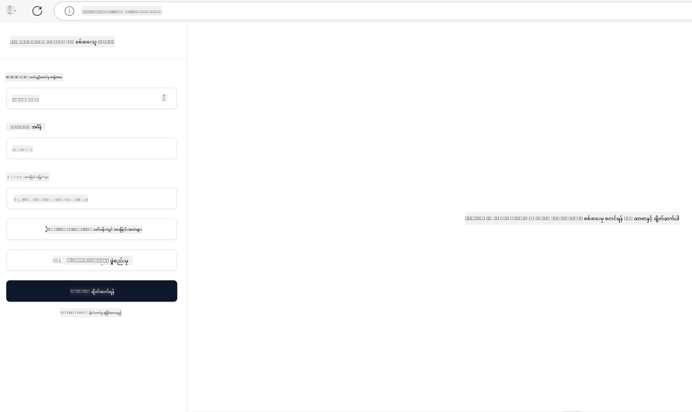

# လက်တွေ့အသုံးပြုခြင်း

[](https://youtu.be/vCN9-mKBDfQ)

_(ဒီသင်ခန်းစာရဲ့ ဗီဒီယိုကို ကြည့်ရန် အပေါ်ပုံကို ကလစ်ပါ)_

လက်တွေ့အသုံးပြုခြင်းဆိုသည်မှာ Model Context Protocol (MCP) ၏ စွမ်းအားကို တကယ်အတွေ့အကြုံရစေသော နေရာဖြစ်သည်။ MCP ၏ သီအိုရီနှင့် ပြုလုပ်ပုံများကို နားလည်သောအခါမှာ အရေးကြီးသော်လည်း၊ ဒီအယူအဆများကို အသုံးပြုပြီး အဖြေများကို တည်ဆောက်၊ စမ်းသပ်၊ ပြန်လည်ဖြန့်ချိခြင်းဖြင့် အမှန်တကယ်တန်ဖိုးရှိမှု ပေါ်ပေါက်လာသည်။ ဒီအခန်းမှာ သဘောအယူများနှင့် လက်တွေ့ဖွံ့ဖြိုးတိုးတက်မှုတို့ကြားက ချန်လှပ်ကို တည်ဆောက်ပေးကာ MCP ကို အခြေခံထားသော အက်ပ်များကို ဘယ်လိုတည်ဆောက်မယ်ဆိုတာ လမ်းပြပေးပါမယ်။

ရှုပ်ထွေးတဲ့အလုပ်တွေကို ဖြေရှင်းရန် မျှော်လင့်သော်လည်း တီထွင်တဲ့ အတွက်ဖြစ်စေ၊ AI ကို စီးပွားရေး လုပ်ငန်းစဉ်ထဲတွင် ပေါင်းစည်းရန်ဖြစ်စေ သို့မဟုတ် ဒေတာကို ကျွမ်းကျင်စွာ အလုပ်လုပ်စေနိုင်မည့် ကိရိယာများကို ဖန်တီးပြင်ဆင်ရန်ဖြစ်စေ MCP သည် ပလပ်ဖောင်း အမျိုးမျိုးနှင့်ပတ်သက်၍ တိုးချဲ့နိုင်သော မူလအခြေခံခြင်းကို ပေးစွမ်းသည်။ ၎င်း၏ ဘာသာစကား ကွဲပြားမှုလိုက်စားမှုမရှိသော ဒီဇိုင်းနှင့် လူကြိုက်များသော ပရိုဂရမ်မင်းဘာသာစကားများအတွက် တရားဝင် SDK များကြောင့် ဖန်တီးသူအများအတွက် ရိုးရှင်းလွယ်ကူစွာ သုံးနိုင်ပါသည်။ ဤ SDK များကို အသုံးချခြင်းဖြင့် ရှေ့ဆက်၌ ရိုးရှင်းသော စမ်းသပ်မှုများ၊ အဆင့်မြှင့်ခြင်းများနှင့် အမျိုးမျိုးသော ပလပ်ဖောင်းများနှင့် ပတ်ဝန်းကျင်များပေါ်တွင် လွယ်ကူစွာပိုမိုတိုးချဲ့နိုင်ပါသည်။

အောက်ပါပိုင်းများတွင် C#, Java with Spring, TypeScript, JavaScript, နှင့် Python တွင် MCP ကို အကောင်အထည်ဖော်ထားသည့် လက်တွေ့ နမူနာများ၊ စမ်းသပ်ကုဒ်များနှင့် ဖြန့်ချိမှုဗျူဟာများကို တွေ့ရှိနိုင်မှာဖြစ်ပြီး MCP ဆာဗာများကို debug နှင့် စမ်းသပ်နည်း၊ API များကို စီမံခန့်ခွဲနည်းနှင့် Azure ကို အသုံးပြုပြီး cloud သို့ ဖြန့်ချိနည်းတို့ကိုလည်း သင်ယူနိုင်ပါသည်။ ၎င်းတို့သည် သင့်သင်ယူမှုကို မြန်ဆန်စေပြီး ယုံကြည်စိတ်ချစွာ အားမာန်ပြင်းပြင်း MCP အက်ပ်များကို တည်ဆောက်ရာတွင် ကူညီပေးမည်ဖြစ်သည်။

## အကြောင်းအရာအကျဉ်း

ဒီသင်ခန်းစာသည် MCP ကို အမျိုးမျိုးသော ပရိုဂရမ်မင်းဘာသာစကားများဖြင့် လက်တွေ့အကောင်အထည်ဖော်ခြင်းဆိုင်ရာ အချက်များအပေါ် ဦးစားပေးထားသည်။ C#, Java with Spring, TypeScript, JavaScript, နှင့် Python တို့တွင် MCP SDK များကို အသုံးပြု၍ ခိုင်မာသော အက်ပ်များတည်ဆောက်ခြင်း၊ MCP ဆာဗာများကို debug နှင့် စမ်းသပ်ခြင်း၊ လုပ်ဆောင်ချက်များ (Resources, Prompts, Tools) ဖန်တီးအသုံးပြုခြင်းတို့ကို ရှာဖွေသင်ယူမှာ ဖြစ်သည်။

## သင်ယူရမည့် ရည်မှန်းချက်များ

ဒီသင်ခန်းစာ အဆုံးသတ်သည်မှာ သင်သည်:

- မတူညီသော ပရိုဂရမ်မင်းဘာသာစကားများတွင် တရားဝင် SDK များတိုးပွားအသုံးပြု၍ MCP ဖြေရှင်းနည်းများကို အကောင်အထည်ဖော်နိုင်ရန်
- MCP ဆာဗာများကို စနစ်တကျ debug နှင့် စမ်းသပ်နိုင်ရန်
- ဆာဗာလုပ်ဆောင်ချက်များ (Resources, Prompts, Tools) ဖန်တီးနှင့် အသုံးပြုနိုင်ရန်
- ရှုပ်ထွေးသောတာဝန်များအတွက် ထိရောက်သော MCP workflow များ ဒီဇိုင်းဆွဲနိုင်ရန်
- မြန်နှုန်းနှင့် ယုံကြည်စိတ်ချရမှုအတွက် MCP အကောင်အထည်ဖော်မှုများကို အကောင်းဆုံးပြုလုပ်နိုင်ရန်

## တရားဝင် SDK ရင်းမြစ်များ

Model Context Protocol သည် အမျိုးမျိုးသော ဘာသာစကားများအတွက် တရားဝင် SDK များ ( [MCP Specification 2025-11-25](https://spec.modelcontextprotocol.io/specification/2025-11-25/) နှင့် ထပ်တူညီညွတ်) လက်ခံထားသည်။

- [C# SDK](https://github.com/modelcontextprotocol/csharp-sdk)
- [Java with Spring SDK](https://github.com/modelcontextprotocol/java-sdk) **မှတ်ချက်:** Project Reactor ([link](https://projectreactor.io)) ကူညီမှုလိုအပ်သည်။ ([discussion issue 246](https://github.com/orgs/modelcontextprotocol/discussions/246) ကြည့်ရန်)
- [TypeScript SDK](https://github.com/modelcontextprotocol/typescript-sdk)
- [Python SDK](https://github.com/modelcontextprotocol/python-sdk)
- [Kotlin SDK](https://github.com/modelcontextprotocol/kotlin-sdk)
- [Go SDK](https://github.com/modelcontextprotocol/go-sdk)

## MCP SDK များနှင့် အလုပ်လုပ်ခြင်း

ဤအပိုင်းတွင် MCP ကို အမျိုးမျိုးသော ပရိုဂရမ်မင်းဘာသာစကားများဖြင့် အကောင်အထည်ဖော်နေစဉ် လက်တွေ့နမူနာများကို ပေးထားပါသည်။ စမ်းသပ်ကုဒ်များ သတ်မှတ်ထားသော `samples` ဖိုင်အတွင်း ဘာသာစကားအလိုက် စီစဉ်ထားသည်။

### ရနိုင်သော နမူနာများ

Repository တွင် အောက်ပါ ဘာသာစကားများအတွက် [နမူနာအကောင်အထည်ဖော်မှုများ](../../../04-PracticalImplementation/samples) ပါဝင်သည်။

- [C#](./samples/csharp/README.md)
- [Java with Spring](./samples/java/containerapp/README.md)
- [TypeScript](./samples/typescript/README.md)
- [JavaScript](./samples/javascript/README.md)
- [Python](./samples/python/README.md)

နမူနာတိုင်းသည် အဆိုပါ ဘာသာစကားနှင့် ပတ်သက်သော MCP အယူအဆများနှင့် အကောင်အထည်ဖော်မှု ပုံစံများကို ပြသပေးပါသည်။

### လက်တွေ့လမ်းညွှန်များ

ထပ်ဆောင်း လမ်းညွှန်များမှာ MCP ကို လက်တွေ့ အသုံးပြုခြင်းဆိုင်ရာ ဖြစ်ပါသည်။

- [Pagination နှင့် ကြီးမားသော ရလဒ်အစုများ](./pagination/README.md) - ကိရိယာများ၊ ရင်းမြစ်များနှင့် ကြီးမားသော ဒေတာအစုများအတွက် cursor-based pagination ကို ကိုင်တွယ်ခြင်း

## အဓိက ဆာဗာ လုပ်ဆောင်ချက်များ

MCP ဆာဗာများမှ အောက်ပါ အလုပ်လုပ်ပုံအနက် မည်သည့် ပေါင်းစပ်မှုမဆို လုပ်ဆောင်နိုင်သည်။

### Resources

Resources သည် အသုံးပြုသူ သို့မဟုတ် AI မော်ဒယ်၏ သုံးစွဲမှုအတွက် အကြောင်းအရာ နှင့် ဒေတာများ ပေးစွမ်းသည်။

- စာတည်း မိတ်ဆက်ထားသော ဒေတာစုစည်းမှုများ
- သတင်းအချက်အလက် စနစ်များ
- ဖွဲ့စည်းထားသော ဒေတာ အရင်းအမြစ်များ
- ဖိုင်စနစ်များ

### Prompts

Prompts သည် အသုံးပြုသူအတွက် အကြောင်းအရာဖော်ပြချက်ရပ်၊ စနစ်များနှင့် Workflow များ ဖြစ်သည်။

- ကြိုတင်သတ်မှတ်ထားသော ဆွေးနွေးပုံစံများ
- ဦးညွှတ်ချက်ရှိသော ဆက်ဆံရေး ပုံစံများ
- အထူးပြုထားသော စကားပြောဖွဲ့စည်းမှုများ

### Tools

Tools သည် AI မော်ဒယ် အတွက် အလုပ်လုပ်စေသော လုပ်ဆောင်ချက်များ ဖြစ်သည်။

- ဒေတာကို ပြုပြင်စီမံမှု ကိရိယာများ
- ပြင်ပ API ပေါင်းစည်းမှုများ
- မှတ်တွက်မှုစွမ်းရည်များ
- ရှာဖွေရေး လုပ်ဆောင်ချက်များ

## နမူနာ အကောင်အထည်ဖော်ခြင်း: C# Implementation

တရားဝင် C# SDK repository တွင် MCP ၏ အစိတ်အပိုင်းအမျိုးမျိုးကို ဖော်ပြထားသည့် နမူနာအကောင်အထည်ဖော်မှုများပါရှိသည်။

- **အခြေခံ MCP Client**: MCP client တည်ဆောက်ခြင်းနှင့် tool များခေါ်သုံးနည်း ရိုးရှင်းနမူနာ
- **အခြေခံ MCP Server**: အခြေခံ tool မှတ်ပုံတင်မှုရှိသော အနည်းငယ်သော ဆာဗာ
- **တိုးတက်မှု MCP Server**: tool မှတ်ပုံတင်ခြင်း၊ အတည်ပြုခြင်း၊ error ကိုင်တွယ်ခြင်းပါဝင်သည့် အပြည့်အစုံဆာဗာ
- **ASP.NET အဆက်သွယ်မှု**: ASP.NET Core နှင့် ပေါင်းစည်းရာ နမူနာများ
- **Tool Implementation ပုံစံများ**: ခက်ခဲမှုအမျိုးမျိုးပါသော tool ဖော်ဆောင်မှုပုံစံများ

C# MCP SDK သည် သုံးစွဲသူကြိုဆိုမှုအဆင့်တွင်ရှိပြီး API များပြောင်းလဲမှုရှိနိုင်သည်။ SDK တိုးတက်လာသည့်အတိုင်း ဘလော့ဂ်ကို ဆက်လက်မွမ်းမံသွားမည်။

### အဓိက လုပ်ဆောင်ချက်များ

- [C# MCP Nuget ModelContextProtocol](https://www.nuget.org/packages/ModelContextProtocol)
- သင်၏ [ပထမ MCP Server တည်ဆောက်ခြင်း](https://devblogs.microsoft.com/dotnet/build-a-model-context-protocol-mcp-server-in-csharp/)

C# အတွက် အပြည့်အစုံ နမူနာများလိုပါက [တရားဝင် C# SDK နမူနာ repository](https://github.com/modelcontextprotocol/csharp-sdk) ကို ဝင်ကြည့်နိုင်ပါသည်။

## နမူနာ အကောင်အထည်ဖော်ခြင်း: Java with Spring Implementation

Java with Spring SDK သည် စွမ်းဆောင်ရည်မြင့် MCP Implementation ကို အစွမ်းကုန်ပေးသော အဖွဲ့အစည်းအဆင့် အင်္ဂါရပ်များနှင့်ပါဝင်သည်။

### အဓိက လုပ်ဆောင်ချက်များ

- Spring Framework ပေါင်းစည်းမှု
- တင်းကြပ်သော Type Safety
- Reactive Programming ကို ထောက်ပံ့ခြင်း
- ပြည့်စုံသော Error Handling

Java with Spring အကောင်အထည်ဖော်မှုများအတွက် ပိုမိုသိရှိရန် samples ဖိုင်အတွင်း [Java with Spring sample](samples/java/containerapp/README.md) ကိုကြည့်ပါ။

## နမူနာ အကောင်အထည်ဖော်ခြင်း: JavaScript Implementation

JavaScript SDK သည် MCP Implementation အတွက် ပေါ့ပေါ့ပါးပါးနှင့် ရွေ့လျားမည့် နည်းလမ်းတစ်ခု ဖြစ်သည်။

### အဓိက လုပ်ဆောင်ချက်များ

- Node.js နှင့် browser ပံ့ပိုးမှု
- Promise-based API
- Express နှင့် အခြား framework များနှင့် လွယ်ကူစွာ ပေါင်းစည်းနိုင်မှု
- Streaming အတွက် WebSocket ပံ့ပိုးမှု

JavaScript အပြည့်အစုံ အကောင်အထည်ဖော်နမူနာအတွက် samples ဖိုင်အတွင်း [JavaScript sample](samples/javascript/README.md) ကို ကြည့်ပါ။

## နမူနာ အကောင်အထည်ဖော်ခြင်း: Python Implementation

Python SDK သည် ML Framework များနှင့် native ပေါင်းစည်းမှုကောင်းမွန်ပြီး Python ၏ သဘာ၀ ယဉ်ကျေးမှုအတိုင်း MCP ကို မှန်ကန်စွာ ကိုင်တွယ်ပေးသည်။

### အဓိက လုပ်ဆောင်ချက်များ

- asyncio အသုံးပြု async/await ပံ့ပိုးမှု
- FastAPI ပေါင်းစည်းမှု
- လွယ်ကူသော tool မှတ်ပုံတင်ခြင်း
- လူကြိုက်များသော ML လိုင်ဘရယ်ရီများနှင့် ပေါင်းစည်းမှု

Python အပြည့်အစုံ အကောင်အထည်ဖော်နမူနာများအတွက် samples ဖိုင်အတွင်း [Python sample](samples/python/README.md) ကို ကြည့်ပါ။

## API စီမံခန့်ခွဲမှု

Azure API Management သည် MCP ဆာဗာများကို ဘယ်လိုလုံခြုံစေမလဲဆိုသော ကောင်းမွန်သော ဖြေရှင်းချက်ဖြစ်သည်။ ယင်းသည် MCP ဆာဗာရှေ့တွင် Azure API Management အဖွဲ့အစည်းတစ်ခု တည်ဆောက်ပြီး လိုအပ်လားသော အင်္ဂါရပ်များကို စီမံခန့်ခွဲခြင်း အတွက်ဖြစ်သည်။

- အမြန်နှုန်း ကန့်သတ်ခြင်း
- token စီမံခန့်ခွဲမှု
- မောနီတာလုပ်ခြင်း
- လုပ်ငန်းခွဲခြင်း (load balancing)
- လုံခြုံရေး

### Azure နမူနာ

အောက်ပါ အတိုင်း Azure API Management ဖြင့် MCP server တည်ဆောက်ပြီး လုံခြုံစေသည့် နမူနာတစ်ခုရှိသည်။

(လိပ်စာတွင် မိမိ MCP ဆာဗာကို Authorization flow ဖြစ်ပုံကို ကြည့်နိုင်ပါသည်။)


ဤပုံတွင် အောက်ပါ အဖြစ်များဖြစ်ပေါ်ပါသည်။

- Microsoft Entra ကို အသုံးပြု Authentication / Authorization လုပ်ဆောင်ထားသည်။
- Azure API Management သည် Gateway အဖြစ် လုပ်ဆောင်ပြီး traffic ကို စီမံခန့်ခွဲရန် policies အသုံးပြုသည်။
- Azure Monitor သည် ရှာဖွေမှု အစီအစဉ်များကို အားလုံးမှတ်တမ်းတင်သည်။

#### Authorization flow

Authorization flow ကို နက်ရှိုင်းစွာကြည့်မယ်ဆိုရင်:


#### MCP authorization specification

[MCP Authorization specification](https://spec.modelcontextprotocol.io/specification/2025-11-25/basic/authorization/) အကြောင်းပိုမိုလေ့လာနိုင်သည်။

## Remote MCP Server ကို Azure သို့ ဖြန့်ချိခြင်း

ယခင်တွင် ဖော်ပြခဲ့သော နမူနာကို ဖြန့်ချိကြည့်မယ်။

1. Repository ကို clone လုပ်ပါ

    ```bash
    git clone https://github.com/Azure-Samples/remote-mcp-apim-functions-python.git
    cd remote-mcp-apim-functions-python
    ```

1. `Microsoft.App` resource provider ကို မှတ်ပုံတင်ပါ။

   - Azure CLI သုံးပါက `az provider register --namespace Microsoft.App --wait` ကို ရေးပေးပါ။
   - Azure PowerShell သုံးပါက `Register-AzResourceProvider -ProviderNamespace Microsoft.App` ကို ရေးပါ။ အချိန် အနည်းငယ်ပြီးနောက် `(Get-AzResourceProvider -ProviderNamespace Microsoft.App).RegistrationState` ဖြင့် မှတ်ပုံတင်မှု ပြီးစီးပြီလား စစ်ဆေးပါ။

1. ဒီ [azd](https://aka.ms/azd) command ဖြင့် api management service, function app (code ပါသော) နှင့် လိုအပ်သော Azure resource များအားလုံးကို provision လုပ်ပါ။

    ```shell
    azd up
    ```

    ဤ command သည် Azure အပေါ်ရှိ cloud resource များအားလုံးကို ဖြန့်ချိပေးမည်ဖြစ်သည်။

### MCP Inspector ဖြင့် ဆာဗာ စမ်းသပ်ခြင်း

1. **အသစ်တစ်ခု Terminal အဆင့်** ဖြင့် MCP Inspector ကို install ပြီး run ပါ

    ```shell
    npx @modelcontextprotocol/inspector
    ```

    အောက်ပါလိုမူများကဲ့သို့ မျက်နှာပြင် တွေ့ရမည်။

    

1. application မှ မြင်သာသည့် URL ကို CTRL ကလစ်ပြီး MCP Inspector web app ဖြင့် ဖွင့်ပါ (ဥပမာ [http://127.0.0.1:6274/#resources](http://127.0.0.1:6274/#resources))
1. transport type ကို `SSE` အဖြစ်သတ်မှတ်ပါ
1. `azd up` ပြီးနောက် ပြသထားသည့် API Management SSE endpoint URL ကို ဤနေရာတွင် ရိုက်ထည့်ပြီး **Connect** နှိပ်ပါ

    ```shell
    https://<apim-servicename-from-azd-output>.azure-api.net/mcp/sse
    ```

1. **List Tools** ကို နှိပ်ပါ။ Tool တစ်ခုကို ရွေးပြီး **Run Tool** ကို နှိပ်ပါ။  

အားလုံးမှန်ကန်ပါက MCP server နှင့် ချိတ်ဆက်ပြီး tool ခေါ်ဆိုခြင်း အောင်မြင်ပါပြီ။

## Azure အတွက် MCP servers

[Remote-mcp-functions](https://github.com/Azure-Samples/remote-mcp-functions-dotnet): Python, C# .NET သို့မဟုတ် Node/TypeScript သုံးပြီး Azure Functions ဖြင့် စိတ်ကြိုက် Remote MCP (Model Context Protocol) servers တည်ဆောက်၊ ဖြန့်ချိရန် အရှိန်မြန် starter template များဖြစ်သည်။

Samples များမှာ ဖန်တီးသူများအတွက် အောက်ပါ အခြေခံဖြေရှင်းချက်ကို ပေးသည်။

- ဒတ်စ်ပ်တော့ထက် ချောမွေ့စွာ တည်ဆောက်ခြင်းနှင့် debug လုပ်ခြင်း
- `azd up` command ရိုးရှင်းစွာဖြင့် cloud သို့ ဖြန့်ပွားခြင်း
- ဖောက်သည်ဘက် client များ VS Code Copilot agent mode နှင့် MCP Inspector ကိရိယာတို့မှ ဆာဗာကို ချိတ်ဆက်ခြင်း

### အဓိက လုပ်ဆောင်ချက်များ

- ဒီဇိုင်းနှင့် လုံခြုံရေး: MCP ဆာဗာကို key များနှင့် HTTPS ဖြင့် အကာအကွယ်ထားသည်
- အတည်ပြုမှုရွေးချယ်မှုများ: အတွင်းရေး auth သို့မဟုတ် API Management အသုံးပြု OAuth ကို ထောက်ပံ့သည်
- ကွန်ယက် ခြားနားမှု: Azure Virtual Networks (VNET) အသုံးပြုကာ ကွန်ယက်ကို ခြားနားလုပ်ဆောင်ခြင်း
- Serverless architecture: Azure Functions ကို အသုံးပြုပြီး အလုပ်ရှုပ်မှု ပြုလုပ်ခြင်း
- ဒတ်စ်ပ်တော့ထက်တွင် ဖန်တီးမှုနှင့် debug ကို အပြည့်အဝ ပံ့ပိုးမှု
- စိတ်လွတ်လပ်ပြီး ဖြန့်ချိမှု လွယ်ကူစေရန် ဆောင်ရွက်မှု

Repository တွင် လိုအပ်သော ပြောင်းလဲမှု ဖိုင်များ၊ ရင်းမြစ်ကုဒ်များနှင့် အခြေခံ အဆောက်အအုံ သတ်မှတ်ချက်များ ပါဝင်သည်၊ လက်တွေ့အသုံးပြုအတွက်၊ ပစ္စည်းအသစ်ဖန်တီးဖို့ အဆင်သင့်ဖြစ်စေသည်။

- [Azure Remote MCP Functions Python](https://github.com/Azure-Samples/remote-mcp-functions-python) - Python ဖြင့် Azure Functions အသုံးပြု MCP Implementation နမူနာ
- [Azure Remote MCP Functions .NET](https://github.com/Azure-Samples/remote-mcp-functions-dotnet) - C# .NET ဖြင့် Azure Functions အသုံးပြု MCP Implementation နမူနာ
- [Azure Remote MCP Functions Node/Typescript](https://github.com/Azure-Samples/remote-mcp-functions-typescript) - Node/TypeScript ဖြင့် Azure Functions အသုံးပြု MCP Implementation နမူနာ

## အဓိက သင်ခန်းစာကောက်ချက်များ

- MCP SDK များသည် ဘာသာစကားအလိုက် tool များဖြင့် ခိုင်မာသော MCP ဖြေရှင်းချက် ဖန်တီးရန် ရည်ရွယ်သည်
- Debug နှင့် စမ်းသပ်ခြင်းဖြင့် MCP အက်ပ်များ ယုံကြည်စိတ်ချရရှိစေသည်
- ပြန်လည်အသုံးပြုနိုင်သည့် prompt template များသည် AI နှင့် ပိုမိုထိရောက်သော ဆက်သွယ်မှု ရရှိစေသည်
- ဝိဇ္ဇာဝရ workflows များက တို့ tool များစွာ အတူ မြှင့်တင်ရန် အဆင်ပြေစေသည်
- MCP ဖြေရှင်းချက် ဖန်တီးရာတွင် လုံခြုံရေး၊ စွမ်းဆောင်ရည်နှင့် အမှား ကိုင်တွယ်မှုများကို စဥ်းစားရမည်

## လေ့ကျင့်ခန်း

သင့် နယ်ပယ်ရှိ အမှန်တကယ်ဖြေရှင်းအပ်ချက်တစ်ခုအတွက် လက်တွေ့ MCP workflow တစ်ခု ဒီဇိုင်းဆွဲပါ။

1. ပြဿနာဖြေရှင်းရာမှာ အသုံးဝင်မည့် tool ၃-၄ ခု ရွေးပါ
2. အဲဒီ tool များဘယ်လို ပေါင်းသင်းသွားမလဲဆိုတာ ဖော်ပြထားသည့် workflow ရုပ်ပုံ (diagram) ဖန်တီးပါ
3. သင်နှစ်သက်ရာ ဘာသာစကားဖြင့် tool တစ်ခု၏ အခြေခံဗားရှင်းကို အကောင်အထည်ဖော်ပါ
4. မော်ဒယ်အား tool ကို ထိရောက်စွာ အသုံးပြုစေမည့် prompt template တစ်ခု ဖန်တီးပါ

## ထပ်ဆောင်း ရင်းမြစ်များ

---

## အလားတူ ဆက်ကပ်

နောက်တစ်ဆင့်: [Advanced Topics](../05-AdvancedTopics/README.md)

---

<!-- CO-OP TRANSLATOR DISCLAIMER START -->
**အာမခံချက်**  
ဤစာရွက်စာတမ်းကို AI ဘာသာပြန်ဝန်ဆောင်မှုဖြစ်သည့် [Co-op Translator](https://github.com/Azure/co-op-translator) မှ အသုံးပြု၍ ဘာသာပြန်ထားခြင်းဖြစ်ပါသည်။ ကျွန်ုပ်တို့သည် တိကျမှုကို ကြိုးစားလေ့ရှိသော်လည်း အလိုအလျောက်ဘာသာပြန်ခြင်းတွင် အမှားများ သို့မဟုတ် အမှန်မဖြစ်မှုများ ပါရှိနိုင်သည်ကို သိရှိပေးပါရန် မေတ္တာရပ်ခံအပ်ပါသည်။ မူလစာရွက်စာတမ်းကို သူ့ စာကို စံပြအဖြစ်ယူဆရန်လိုအပ်ပါသည်။ အရေးကြီးသည့် သတင်းအချက်အလက်များအတွက် ပရော်ဖက်ရှင်နယ် လူ့ဘာသာပြန်ကို အသုံးပြုရန် အကြံပြုပါသည်။ ဤဘာသာပြန်ခြင်းအသုံးပြုမှုကြောင့် ဖြစ်ပေါ်လာသော နားမလည်မှုများ သို့မဟုတ် အဓိပ္ပာယ်ဖွဲ့စည်းမှားမှုများအတွက် ကျွန်ုပ်တို့တာဝန်မယူပါ။
<!-- CO-OP TRANSLATOR DISCLAIMER END -->