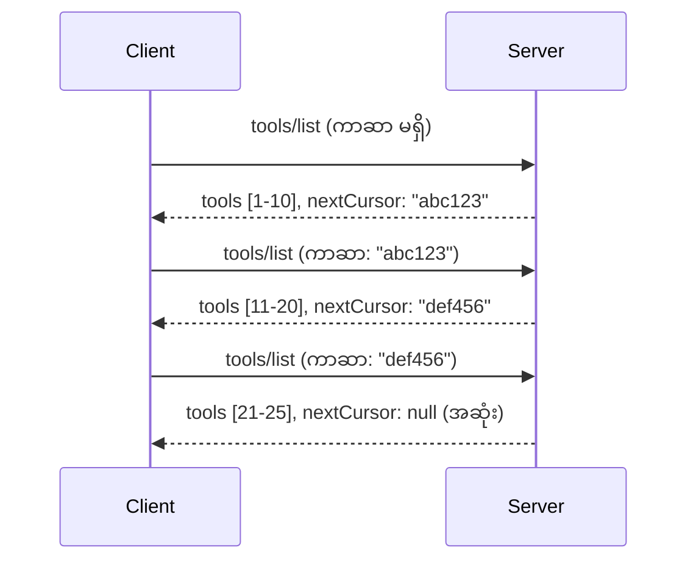

# MCP တွင် စာမျက်နှာခွဲခြင်းနှင့် ကြီးမားသောရလဒ်အစုလိုက်

သင်၏ MCP ဆာဗာသည် ဖိုင်များ ရှိရာ သန်းပေါင်းများစွာ၊ ဒေတာဘေ့စ်မှတ်တမ်းများ သို့မဟုတ် ရှာဖွေမှုရလဒ် များကို ကိုင်တွယ်သောအခါ၊ စွမ်းဆောင်ရည်ရှိစွာမှတ်ဉာဏ်ကို စီမံခန့်ခွဲရန်နှင့် အမြန်ဝန်ဆောင်မှုအသုံးပြုသူအတွေ့အကြုံရရှိစေရန် စာမျက်နှာခွဲခြင်း (pagination) လိုအပ်သည်။ ဤလမ်းညွှန်မှာ MCP တွင် pagination ကို မည်သို့ အကောင်အထည်ဖော်ပြီး အသုံးပြုရမည်ကို ဖော်ပြလိမ့်မည်။

## Pagination ချက်အရေးကြီးသောအကြောင်း

Pagination မရှိပါက ကြီးမားသော ပြန်ကြားချက်များက ဖြစ်လာနိုင်သည်။

- **မှတ်ဉာဏ် ပြည့်ထောက်ခြင်း** - သန်းပေါင်းများသော မှတ်တမ်းများကို တပြိုင်နက်တည်း ဖတ်ယူခြင်း
- **တုံ့ပြန်ချိန်ကြာခြင်း** - အသုံးပြုသူများသည် ဒေတာအားလုံး ဖတ်ယူပြီးမှ စောင့်ဆိုင်းရခြင်း
- **အချိန်ကုန်လွန်မှားယွင်းခြင်း** - တောင်းဆိုမှုများသည် အချိန်နောက်ကျသည်
- **ကြီးမားသောဆက်သွယ်မှုအကြောင်းအရာအားဖြင့် AI လုပ်ဆောင်မှု ယိုယွင်းခြင်း** - LLM များသည် ကြီးမားသော context တွင် အခက်အခဲရှိသည်

MCP သည် ရလဒ်အစုလိုက်ကောင်းစွာ၊ တည်ငြိမ်စွာ စာမျက်နှာခွဲနိုင်ရန် **cursor-based pagination** ကို သုံးသည်။

---

## MCP Pagination အလုပ်လုပ်ပုံ

### Cursor အကြောင်းအရာ

**cursor** ဆိုသည်မှာ သင့်ရလဒ်အစုတွင်းမှာ သင့်၏တည်နေရာကို မှတ်သားထားသော မမြင်ရသော စာသားတစ်ခုပါ။ စာအုပ်ရှည်လျားသည်မှာ bookmark တစ်ခုလို့ ထင်ပါ။



### MCP နည်းလမ်းများတွင် Pagination

MCP နည်းလမ်းများအနက် pagination ကို ထောက်ပံ့သောများမှာ -

| နည်းလမ်း | ပြန်အပ်သည် | Cursor ထောက်ပံ့မှု |
|--------|---------|----------------|
| `tools/list` | ကိရိယာအညွှန်းစာ | ✅ |
| `resources/list` | အရင်းအမြစ်အညွှန်းစာ | ✅ |
| `prompts/list` | မူကြမ်းအညွှန်းစာ | ✅ |
| `resources/templates/list` | အရင်းအမြစ်မှ စာရွက်များ | ✅ |

---

## ဆာဗာ တည်ဆောက်မှု

### Python (FastMCP)

```python
from mcp.server import Server
from mcp.types import Tool, ListToolsResult
import math

app = Server("paginated-server")

# ပြုစုထားသော ဒေတာအကြီးစား
ALL_TOOLS = [
    Tool(name=f"tool_{i}", description=f"Tool number {i}", inputSchema={})
    for i in range(100)
]

PAGE_SIZE = 10

@app.list_tools()
async def list_tools(cursor: str | None = None) -> ListToolsResult:
    """List tools with pagination support."""
    
    # စတင်သော အညွှန်းသင်္ကေတရယူရန် cursor ကို decode ပြုလုပ်ပါ
    start_index = 0
    if cursor:
        try:
            start_index = int(cursor)
        except ValueError:
            start_index = 0
    
    # ရလဒ်စာမျက်နှာရယူပါ
    end_index = min(start_index + PAGE_SIZE, len(ALL_TOOLS))
    page_tools = ALL_TOOLS[start_index:end_index]
    
    # နောက် cursor ကိုတွက်ချက်ပါ
    next_cursor = None
    if end_index < len(ALL_TOOLS):
        next_cursor = str(end_index)
    
    return ListToolsResult(
        tools=page_tools,
        nextCursor=next_cursor
    )
```

### TypeScript

```typescript
import { Server } from "@modelcontextprotocol/sdk/server/index.js";
import { ListToolsResultSchema } from "@modelcontextprotocol/sdk/types.js";

const server = new Server({
  name: "paginated-server",
  version: "1.0.0"
});

// ကြီးမားသော ဒေတာစုစည်းမှုကို စမတ်ပြုလုပ်ထားခြင်း
const ALL_TOOLS = Array.from({ length: 100 }, (_, i) => ({
  name: `tool_${i}`,
  description: `Tool number ${i}`,
  inputSchema: { type: "object", properties: {} }
}));

const PAGE_SIZE = 10;

server.setRequestHandler(ListToolsResultSchema, async (request) => {
  // ကုရိုးဆာကို ဖြေရှင်းပါ
  let startIndex = 0;
  if (request.params?.cursor) {
    startIndex = parseInt(request.params.cursor, 10) || 0;
  }
  
  // ရလဒ်စာမျက်နှာကို ရယူပါ
  const endIndex = Math.min(startIndex + PAGE_SIZE, ALL_TOOLS.length);
  const pageTools = ALL_TOOLS.slice(startIndex, endIndex);
  
  // နောက်တစ်ခုသော ကုရိုးဆာကို တွက်ချက်ပါ
  const nextCursor = endIndex < ALL_TOOLS.length ? String(endIndex) : undefined;
  
  return {
    tools: pageTools,
    nextCursor
  };
});
```

### Java (Spring MCP)

```java
@Service
public class PaginatedToolService {
    
    private static final int PAGE_SIZE = 10;
    private final List<Tool> allTools;
    
    public PaginatedToolService() {
        // ကြီးမားသော ဒေတာစုစည္းမှုကို စတင်ပုံသဏ္ဍာန်ဖော်ဆောင်ပါ
        this.allTools = IntStream.range(0, 100)
            .mapToObj(i -> new Tool("tool_" + i, "Tool number " + i, Map.of()))
            .collect(Collectors.toList());
    }
    
    @McpMethod("tools/list")
    public ListToolsResult listTools(@Param("cursor") String cursor) {
        // ကာရဆာကို ဖြေဆိုပါ
        int startIndex = 0;
        if (cursor != null && !cursor.isEmpty()) {
            try {
                startIndex = Integer.parseInt(cursor);
            } catch (NumberFormatException e) {
                startIndex = 0;
            }
        }
        
        // ရလဒ်စာမျက်နှာကို ရယူပါ
        int endIndex = Math.min(startIndex + PAGE_SIZE, allTools.size());
        List<Tool> pageTools = allTools.subList(startIndex, endIndex);
        
        // နောက်ထပ်ကာရဆာကိုတွက်ချက်ပါ
        String nextCursor = endIndex < allTools.size() ? String.valueOf(endIndex) : null;
        
        return new ListToolsResult(pageTools, nextCursor);
    }
}
```

---

## client တည်ဆောက်မှု

### Python Client

```python
from mcp import ClientSession

async def get_all_tools(session: ClientSession) -> list:
    """Fetch all tools using pagination."""
    all_tools = []
    cursor = None
    
    while True:
        result = await session.list_tools(cursor=cursor)
        all_tools.extend(result.tools)
        
        if result.nextCursor is None:
            break
        cursor = result.nextCursor
    
    return all_tools

# အသုံးပြုမှု
async with client_session as session:
    tools = await get_all_tools(session)
    print(f"Found {len(tools)} tools")
```

### TypeScript Client

```typescript
import { Client } from "@modelcontextprotocol/sdk/client/index.js";

async function getAllTools(client: Client): Promise<Tool[]> {
  const allTools: Tool[] = [];
  let cursor: string | undefined = undefined;
  
  do {
    const result = await client.listTools({ cursor });
    allTools.push(...result.tools);
    cursor = result.nextCursor;
  } while (cursor);
  
  return allTools;
}

// အသုံးပြုမှု
const tools = await getAllTools(client);
console.log(`Found ${tools.length} tools`);
```

### Lazy Loading ပုံစံ

ကြီးမားသောဒေတာအစုများအတွက် စာမျက်နှာများကို မလိုအပ်သလို ဖတ်ယူပါ။

```python
class PaginatedToolIterator:
    """Lazily iterate through paginated tools."""
    
    def __init__(self, session: ClientSession):
        self.session = session
        self.cursor = None
        self.buffer = []
        self.exhausted = False
    
    async def __anext__(self):
        # buffer တွင် ရှိပါက ပြန်လည်သွားပါ
        if self.buffer:
            return self.buffer.pop(0)
        
        # စာမျက်နှာများအားလုံး အဆုံးသတ်သလားစစ်ဆေးပါ
        if self.exhausted:
            raise StopAsyncIteration
        
        # နောက်ထပ်စာမျက်နှာယူပါ
        result = await self.session.list_tools(cursor=self.cursor)
        self.buffer = list(result.tools)
        self.cursor = result.nextCursor
        
        if self.cursor is None:
            self.exhausted = True
        
        if not self.buffer:
            raise StopAsyncIteration
        
        return self.buffer.pop(0)
    
    def __aiter__(self):
        return self

# အသုံးပြုမှု - အကြီးစားဒေတာအစုအဝေးများအတွက် မemory မြှုပ်နှံမှုအကောင်းဆုံး
async for tool in PaginatedToolIterator(session):
    process_tool(tool)
```

---

## အရင်းအမြစ်များအတွက် Pagination

အရင်းအမြစ်များတွင် သာမန်အားဖြင့် ဖိုင်ညွှန်ကြားမှုများ သို့မဟုတ် ကြီးမားသော ဒေတာအစုများအတွက် pagination လိုအပ်ပါသည်။

```python
from mcp.server import Server
from mcp.types import Resource, ListResourcesResult
import os

app = Server("file-server")

@app.list_resources()
async def list_resources(cursor: str | None = None) -> ListResourcesResult:
    """List files in directory with pagination."""
    
    directory = "/data/files"
    all_files = sorted(os.listdir(directory))
    
    # ကုဒ်ဖြေချက် ကူးဆာ (ဖိုင် အညွှန်း)
    start_index = int(cursor) if cursor else 0
    page_size = 20
    end_index = min(start_index + page_size, len(all_files))
    
    # ဒီစာမျက်နှာအတွက် အရင်းအမြစ် စာရင်း ဖန်တီးပါ
    resources = []
    for filename in all_files[start_index:end_index]:
        filepath = os.path.join(directory, filename)
        resources.append(Resource(
            uri=f"file://{filepath}",
            name=filename,
            mimeType="application/octet-stream"
        ))
    
    # နောက်ထပ် ကူးဆာ ကိုတွက်ချက်ပါ
    next_cursor = str(end_index) if end_index < len(all_files) else None
    
    return ListResourcesResult(
        resources=resources,
        nextCursor=next_cursor
    )
```

---

## Cursor ဒီဇိုင်း များနှင့် မဟာဗျူဟာများ

### မဟာဗျူဟာ ၁: အညွှန်းအခြေပြု (ရိုးရှင်း)

```python
# Cursor သည္ ပင္မကိုယ္စားျပဳညႊန္ၾကားခ်က္သာျဖစ္သည္
cursor = "50"  # ပစ္စည်း ၅၀ မွ စ၍ စတင္သည္
```

**အားသာချက်များ** - ရိုးရှင်းပြီး အခြေအနေမရှိ
**အားနည်းချက်များ** - အချက်အလက်များ ထည့်/ဖြုတ်သွားလျှင် ရလဒ်များ သွားပြီးလာနိုင်သည်

### မဟာဗျူဟာ ၂: ID အခြေပြု (တည်ငြိမ်)

```python
# ကာဆာသည် နောက်ဆုံးကြည့်ပြီး ID ဖြစ်သည်
cursor = "item_abc123"  # ဤအရာအပြီးတွင် စတင်ပါ
```

**အားသာချက်များ** - အချက်အလက်များ ပြောင်းလဲသော်လည်း တည်ငြိမ်သည်
**အားနည်းချက်များ** - စဉ်ဆက်မပြတ် ID များ လိုအပ်သည်

### မဟာဗျူဟာ ၃: အမှတ်အသားပြု အခြေအနေ Encoded (ရှုပ်ထွေး)

```python
import base64
import json

def encode_cursor(state: dict) -> str:
    return base64.b64encode(json.dumps(state).encode()).decode()

def decode_cursor(cursor: str) -> dict:
    return json.loads(base64.b64decode(cursor).decode())

# ကာဆာတွင် အခြေအနေများ များစွာ ပါ၀င်သည်
cursor = encode_cursor({
    "offset": 50,
    "filter": "active",
    "sort": "name"
})
```

**အားသာချက်များ** - ရှုပ်ထွေးသောအခြေအနေများသိမ်းဆည်းနိုင်သည်
**အားနည်းချက်များ** - ပို၍ရှုပ်ထွေးပြီး cursor စာသားများကြီးသည်

---

## အကောင်းဆုံး လက်တွေ့အသုံးပြုမှုများ

### ၁။ သင့်တော်သော စာမျက်နှာ အရွယ်အစား ရွေးချယ်ပါ

```python
# ဒေတာအရွယ်အစားကိုစဉ်းစားပါ
PAGE_SIZE_SMALL_ITEMS = 100   # ရိုးရှင်းသော မက်တာဒေတာ
PAGE_SIZE_MEDIUM_ITEMS = 20   # ပိုမိုပြည့်စုံသော အရာဝတ္တုများ
PAGE_SIZE_LARGE_ITEMS = 5     # ဖက်ဆစ်ရှင်းသော အကြောင်းအရာ
```

### ၂။ မမှန်ကန်သော Cursor များကို သင့်တော်စွာ ကိုင်တွယ်ပါ

```python
@app.list_tools()
async def list_tools(cursor: str | None = None) -> ListToolsResult:
    try:
        start_index = int(cursor) if cursor else 0
        if start_index < 0 or start_index >= len(ALL_TOOLS):
            start_index = 0  # စတင်နေရာသို့ ပြန်လည်စတင်ပါ
    except (ValueError, TypeError):
        start_index = 0  # မမှန်ကန်သော cursor, အသစ်စတင်ပါ
    # ...
```

### ၃။ စုစုပေါင်း အရေအတွက် ထည့်သွင်းပါ (ရွေးချယ်စရာ)

```python
return ListToolsResult(
    tools=page_tools,
    nextCursor=next_cursor,
    # အချို့အကောင်အထည်ဖော်မှုများသည် UI တိုးတက်မှုအတွက် စုစုပေါင်းကို ပါဝင်သည်။
    _meta={"total": len(ALL_TOOLS)}
)
```

### ၄။ နယ္နိမိတ္ခန္႔သတ္မွတ္မွုမ်ားကို စမ်းသပ်ပါ

```python
async def test_pagination():
    # ရလဒ်အမှတ်အသား မရှိပါ
    result = await session.list_tools()
    assert result.tools == []
    assert result.nextCursor is None
    
    # တစ်ခုတည်းစာမျက်နှာ
    result = await session.list_tools()
    assert len(result.tools) <= PAGE_SIZE
    
    # မှားယွင်းသော cursor
    result = await session.list_tools(cursor="invalid")
    assert result.tools  # ပထမစာမျက်နှာ ပြန်လည်ပေးသင့်သည်
```

---

## အချို့သောမှားယွင်းမှုများ

### ❌ ရလဒ်အားလုံးကို ပြန်လည်ပေးပြန်ပြီး client မှာ pagination လုပ်ခြင်း

```python
# ဆိုးတယ်: အားလုံးကိုမှတ်ဉာဏ်အတွင်းသို့โหลดနေသည်
@app.list_tools()
async def list_tools() -> ListToolsResult:
    all_tools = load_all_tools()  # ၁ သန်းကိရိယာများ!
    return ListToolsResult(tools=all_tools)
```

### ✅ ဒေတာအစုံရှိရာမှ pagination လုပ်ခြင်း

```python
# ကောင်းတယ်: လိုအပ်တာတွေ သာတင်ပေးတယ်
@app.list_tools()
async def list_tools(cursor: str | None = None) -> ListToolsResult:
    offset = int(cursor) if cursor else 0
    tools = await db.query_tools(offset=offset, limit=PAGE_SIZE)
    return ListToolsResult(tools=tools, nextCursor=...)
```

---

## နောက်တစ်ဆင့်

- [Module 5.14 - Context Engineering](../../05-AdvancedTopics/mcp-contextengineering/README.md)
- [Module 8 - Best Practices](../../08-BestPractices/README.md)
- [3.8 - Testing Your MCP Server](../../03-GettingStarted/08-testing/README.md)

---

## အပိုဆောင်း အရင်းအမြစ်များ

- [MCP Specification - Pagination](https://modelcontextprotocol.io/specification/2026-07-28/)
- [Cursor-Based Pagination Explained](https://slack.engineering/evolving-api-pagination-at-slack/)
- [Python SDK pagination tests](https://github.com/modelcontextprotocol/python-sdk/blob/main/tests/client/test_list_methods_cursor.py)

---

<!-- CO-OP TRANSLATOR DISCLAIMER START -->
**ပြောကြားချက်**
ဤစာတမ်းကို AI ဘာသာပြန်ဝန်ဆောင်မှု [Co-op Translator](https://github.com/Azure/co-op-translator) အသုံးပြု၍ ဘာသာပြန်ထားပါသည်။ ကျွန်ုပ်တို့သည် တိကျမှန်ကန်မှုအတွက် ကြိုးပမ်းနေသော်လည်း၊ စက်ကိရိယာဘာသာပြန်ခြင်းများတွင် အမှားများ သို့မဟုတ် မှားယွင်းချက်များ ပါဝင်နိုင်ကြောင်း သတိပြုပါရန် လိုအပ်ပါသည်။ မူလစာတမ်းကို မူရင်းဘာသာဖြင့်သာ ယုံကြည်စိတ်ချရသော အချက်အလက်အဖြစ် သတ်မှတ်သင့်သည်။ အရေးကြီးသည့် သတင်းအချက်အလက်များအတွက် ပရော်ဖက်ရှင်နယ် လူသားဘာသာပြန်သူဝန်ဆောင်မှုကို အကြံပြုပါသည်။ ဤဘာသာပြန်ချက်ကို အသုံးပြုခြင်းမှ ဖြစ်ပေါ်လာသော နားလည်မှုကွာခြားမှုများ သို့မဟုတ် မမှန်ကန်သော အသုံးပြုမှုများအတွက် ကျွန်ုပ်တို့ တာဝန်မခံပါ။
<!-- CO-OP TRANSLATOR DISCLAIMER END -->