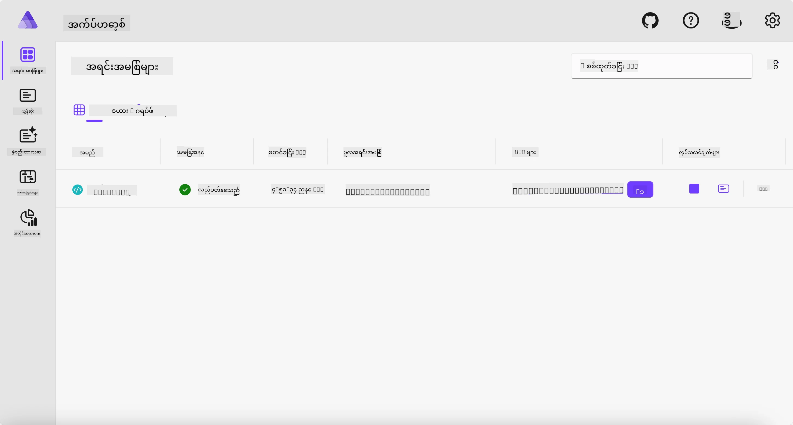
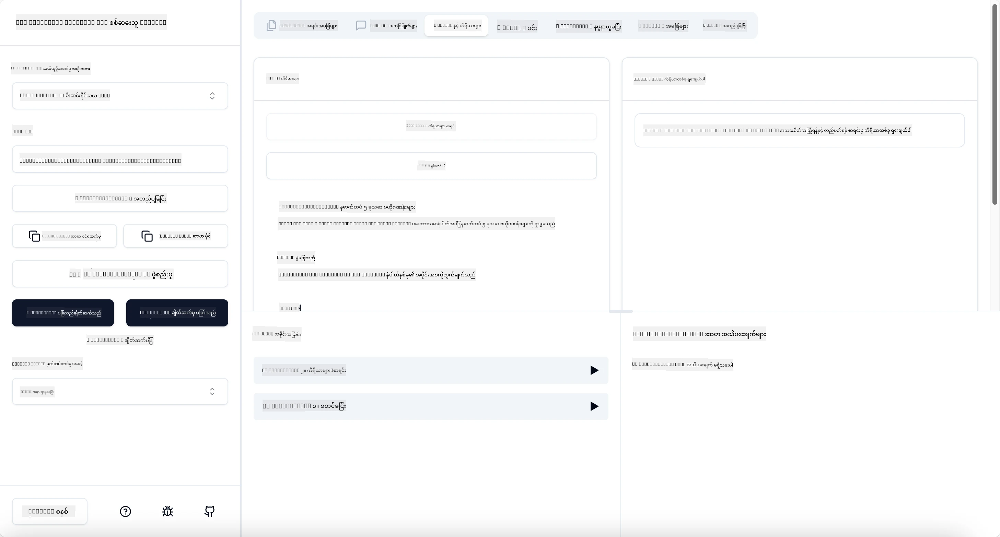

# ဥပမာ

ယခင် ဥပမာသည် `stdio` အမျိုးအစားဖြင့် ဒေသဆိုင်ရာ .NET ပရောဂျက်ကို မည်သို့ အသုံးပြုရမည်ကို ပြသသည်။ နှင့် ကွန်တိန်နာတွင် ဆာဗာကို ဒေသဆိုင်ရာအနေဖြင့် မည်သို့ ပြေးဆွဲရမည်ကို ပြသသည်။ ၎င်းသည် အခြေအနေများစွာတွင် ကောင်းမွန်သော ဖြေရှင်းချက်တစ်ခုဖြစ်သည်။ သို့သော် ဆာဗာကို တုံ့ပြန်မှုပတ်ဝန်းကျင်အဖြစ် အဝေးမှ ပြေးဆွဲထားခြင်းသည် ရရှိနိုင်ပါသည်။ ဒီမှာ `http` အမျိုးအစား ပါဝင်သည်။

`04-PracticalImplementation` ဖိုင်ဒါတွင် ဖြေရှင်းချက်ကို ကြည့်ပါက ယခင် ဥပမာထက် ပိုမိုရှုပ်ထွေးသလို ရှုပ်ထွေးနေတာကို တွေ့ရနိုင်သည်။ သို့သော် စစ်မှန်စွာ ကြည့်ပါက မဟုတ်ပါ။ `src/Calculator` ပရောဂျက်ကို အနီးကပ် ကြည့်ပါက ယခင် ဥပမာနှင့် မတူပါက များစွာ ကွဲပြားချက် မရှိပါ။ သာမာန်ကတော့ HTTP မေးခွန်းများကို ကိုင်တွယ်ရန် အခြားသောစာကြောင်း `ModelContextProtocol.AspNetCore` ကို အသုံးပြုနေခြင်းသာ ဖြစ်ပါသည်။ သို့သော် `IsPrime` နည်းပညာကို ကိုယ်ပိုင်(private) ပြောင်း၍ ကိုယ်ပိုင်နည်းများကို သင်၏ကုဒ်တွင် ထည့်နိုင်ကြောင်း ပြသရန်ဖြစ်သည်။ အတောအတွင်းက ကုဒ် အခြားများနှင့် အတူတူ ဖြစ်ပါသည်။

အခြား ပရောဂျက်များမှာ [Aspire](https://aspire.dev/get-started/what-is-aspire/) မှ ဖြစ်သည်။ Aspire ကို ဖြေရှင်းချက်တွင် ထည့်သွင်းထားခြင်းဖြင့် ဖွံ့ဖြိုးရေးသူအနေဖြင့် ဖွံ့ဖြိုးမှုနှင့် စမ်းသပ်မှုတွေကို များစွာ ကောင်းမွန်သွားစေပြီး ကြည့်ရှုရန်လွယ်ကူစေသည်။ ဆာဗာကို ပြေးဆွဲဖို့ မလိုအပ်ပါ၊ သို့သော် ဖြေရှင်းချက်ထဲတွင် ထည့်သွင်းထားသည့် ကောင်းမွန်သော အလေ့အကျင့်တစ်ခု ဖြစ်သည်။

## ဆာဗာကို ဒေသဆိုင်ရာ ပြေးမည်

1. VS Code (C# DevKit extension ဖြင့်) မှ `04-PracticalImplementation/samples/csharp` ဒိုက်ယက်ထရီသို့ သွားပါ။
1. ဆာဗာကို စတင်ရန် အောက်ဖော်ပြပါ command ကို အကောင်အထည် ဖော်ပါ။

   ```bash
    dotnet watch run --project ./src/AppHost
   ```

1. ဝက်ဘ်ဘရောက်ဇာသည် Aspire dashboard ကို ဖွင့်ပါက `http` URL ကို မှတ်ထားပါ။ ၎င်းမှာ `http://localhost:5058/` နီးပါး ဖြစ်တတ်သည်။

   

## MCP Inspector ဖြင့် Streamable HTTP စမ်းသပ်ခြင်း

Node.js 22.7.5 နှင့် အထက်ရှိပါက MCP Inspector ကို သုံးပြီး ဆာဗာကို စမ်းသပ်နိုင်ပါသည်။

ဆာဗာကို စတင်ပြီး တာမင်နယ်တစ်ခုတွင် အောက်ဖော်ပြပါ command ကို ပြေးပါ။

```bash
npx @modelcontextprotocol/inspector http://localhost:5058
```



- `Streamable HTTP` ကို Transport အမျိုးအစားအဖြစ် ရွေးချယ်ပါ။
- URL ဘာသာအတွင်းတွင် ဆာဗာ URL ကို ရိုက်ထည့်ပြီး `/mcp` ကို ထပ်ဆောင်းထည့်ပါ။ ၎င်းသည် `http` (https မဟုတ်ပါ) ဖြစ်ရမည်၊ ဥပမာ `http://localhost:5058/mcp` ဖြစ်မည်။
- Connect ခလုတ်ကို နှိပ်ပါ။

Inspector ၏ ကောင်းမွန်ချက်မှာ ဖြစ်ပျက်နေသည့်အရာများကို တိကျကျ မြင်ရစေခြင်း ဖြစ်သည်။

- ရနိုင်သော tools များစာရင်းကို ကြည့်ပါ။
- ၎င်း tools များကို စမ်းသပ်ပါ၊ ယခင်ကဲ့သို့ အလုပ်လုပ်နိုင်သည်။

## VS Code အတွက် GitHub Copilot Chat ဖြင့် MCP Server စမ်းသပ်ခြင်း

GitHub Copilot Chat နှင့် Streamable HTTP transport ကို သုံးရန်၊ ယခင်တွင် ဖန်တီးထားသော `calc-mcp` ဆာဗာ၏ အတှေ့အကွုံကို အောက်ပါအတိုင်း ပြောင်းလဲပါ။

```jsonc
// .vscode/mcp.json
{
  "servers": {
    "calc-mcp": {
      "type": "http",
      "url": "http://localhost:5058/mcp"
    }
  }
}
```

စမ်းသပ်မှုများ ပြုလုပ်ပါ။

- "6780 နောက် 3 ခုသော သာမာန်အဂ်ဂျာဂဏန်းများ" အတွက် မေးထားပါ၊ Copilot သည် အသစ်ထည့်ထားသော tools `NextFivePrimeNumbers` ကို သုံးပြီး ပထမ 3 ခုသာ ပြန်လည်ပေးဆောင်ပါသည်။
- "111 နောက် 7 ခုသော သာမာန်အဂ်ဂျာဂဏန်းများ" အား မေးပါ၊ ဖြစ်ပျက်မှုကို ကြည့်ပါ။
- "John မှ လော်လီ 24 ခု ရှိပြီး သူ၏ ကလေး 3 ဦးအား မှန်ကန်စွာ ဖြန့်ဝေလိုသည်။ အတူတူ လော်လီ များ ကျန်ရှိမရစေ။ ကလေးတစ်ဦးချင်းစီထံမှ လော်လီ မည်မျှ ရှိနေလဲ?" အတွက် မေးပါ၊ ဖြစ်ပျက်မှုကို ကြည့်ပါ။

## ဆာဗာကို Azure သို့ တင်သွင်းခြင်း

ဆာဗာကို Azure သို့ တင်သွင်းလိုက်ကြပါစို့၊ လူသိများသည့် နေရာများ စုစည်းစေမည်။

တာမင်နယ်ထဲမှ `04-PracticalImplementation/samples/csharp` ဖိုင်ဒါသို့ သွားပြီး အောက်ဖော်ပြပါ command ကို ပြေးပါ။

```bash
azd up
```

တင်သွင်းခြင်း ပြီးဆုံးလျှင် အောက်ပါစာသားကို တွေ့ ရပါမည်။


URL ကို ပြန်ယူပြီး MCP Inspector နှင့် GitHub Copilot Chat တို့တွင် သုံးပါ။

```jsonc
// .vscode/mcp.json
{
  "servers": {
    "calc-mcp": {
      "type": "http",
      "url": "https://calc-mcp.gentleriver-3977fbcf.australiaeast.azurecontainerapps.io/mcp"
    }
  }
}
```

## နောက်ထပ် ဘာများ ရှိလဲ?

ပို့ဆောင်မှု အမျိုးအစားများ၊ စမ်းသပ်ကိရိယာများကို စမ်းသပ်ကြည့်ခဲ့ပြီး MCP ဆာဗာကို Azure သို့ တင်သွင်းခဲ့သည်။ သို့သော် ဆာဗာသည် ကိုယ်ပိုင်အရင်းအမြစ်များသို့ ဝင်ဆက်ရန် လိုခြင်းရှိပါက ဘာဖြစ်မလဲ? ဥပမာ - ဒေတာဘေ့စ် ဒါမှမဟုတ် ကိုယ်ပိုင် API တစ်ခု? နောက်ပိုင်းအခန်းတွင် ဆာဗာ လုံခြုံမှု ကို မြှင့်တင်နည်းများကို ကြည့်ရှုမည်။

---

<!-- CO-OP TRANSLATOR DISCLAIMER START -->
**ပြောကြားချက်**
ဤစာတမ်းကို AI ဘာသာပြန်ဝန်ဆောင်မှု [Co-op Translator](https://github.com/Azure/co-op-translator) အသုံးပြု၍ ဘာသာပြန်ထားပါသည်။ ကျွန်ုပ်တို့သည် တိကျမှန်ကန်မှုအတွက် ကြိုးပမ်းနေသော်လည်း၊ စက်ကိရိယာဘာသာပြန်ခြင်းများတွင် အမှားများ သို့မဟုတ် မှားယွင်းချက်များ ပါဝင်နိုင်ကြောင်း သတိပြုပါရန် လိုအပ်ပါသည်။ မူလစာတမ်းကို မူရင်းဘာသာဖြင့်သာ ယုံကြည်စိတ်ချရသော အချက်အလက်အဖြစ် သတ်မှတ်သင့်သည်။ အရေးကြီးသည့် သတင်းအချက်အလက်များအတွက် ပရော်ဖက်ရှင်နယ် လူသားဘာသာပြန်သူဝန်ဆောင်မှုကို အကြံပြုပါသည်။ ဤဘာသာပြန်ချက်ကို အသုံးပြုခြင်းမှ ဖြစ်ပေါ်လာသော နားလည်မှုကွာခြားမှုများ သို့မဟုတ် မမှန်ကန်သော အသုံးပြုမှုများအတွက် ကျွန်ုပ်တို့ တာဝန်မခံပါ။
<!-- CO-OP TRANSLATOR DISCLAIMER END -->