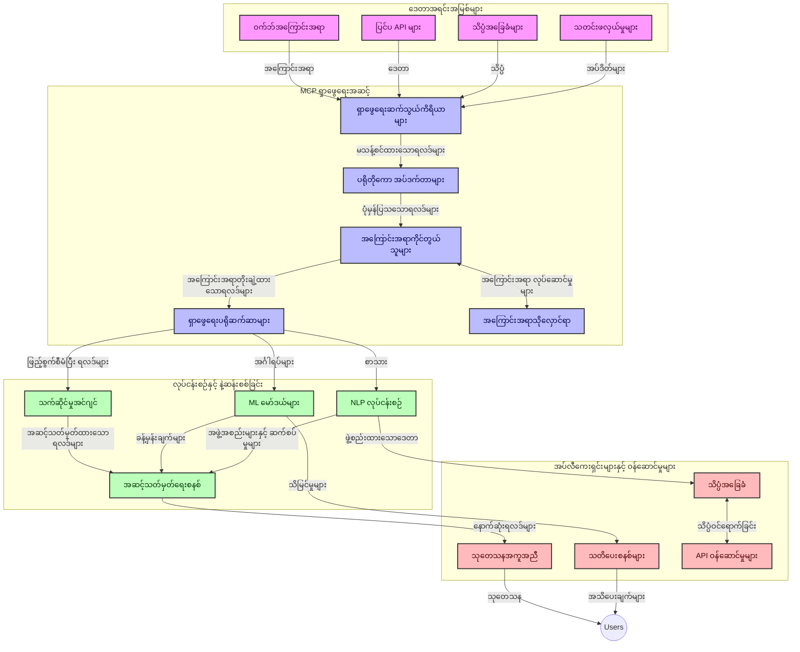
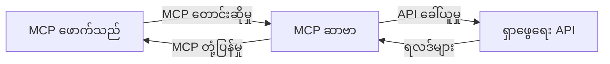
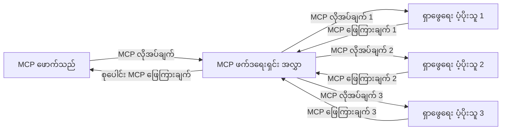
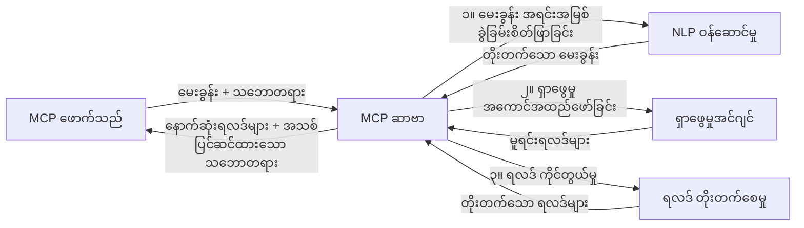

# အချိန်ကိုက် ဝက်ဘ်ရှာဖွေရေးအတွက် မော်ဒယ် အကြောင်းအရာ ပရိုတိုကောလ်

## အနှစ်ချုပ်

အချိန်ကိုက် ဝက်ဘ်ရှာဖွေရေးသည် ယနေ့ အချက်အလက်မောင်းနှင်သော ပတ်ဝန်းကျင်တွင် အလွန်အရေးပါသည်။ အက်ပလီကေးရှင်းများသည် အင်တာနက်တစ်လျှောက်မှ အချိန်မီနှင့် သက်ဆိုင်သော သတင်းအချက်အလက်များကို ချက်ချင်းရယူနိုင်ရန် လိုအပ်သည်။ မော်ဒယ် အကြောင်းအရာ ပရိုတိုကောလ် (MCP) သည် ဤအချိန်ကိုက် ရှာဖွေမှုလုပ်ငန်းစဉ်များကို ထိရောက်စွာ တိုးတက်ကောင်းမွန်စေရန်၊ ရှာဖွေမှု ထိရောက်မှုမြှင့်တင်ရန်၊ အကြောင်းအရာ သေသပ်မှု ထိန်းသိမ်းရန်နှင့် စနစ်လုံးဆိုင်ရာ ဖွံ့ဖြိုးတိုးတက်မှုကို တိုးမြှင့်ရန် အရေးကြီးသော တိုးတက်မှုတစ်ခုကို ကိုယ်စားပြုသည်။

ဤမော်ဂျူးတွင် MCP သည် AI မော်ဒယ်များ၊ ရှာဖွေမှုအင်ဂျင်များနှင့် အက်ပလီကေးရှင်းများအကြား အကြောင်းအရာ စီမံခန့်ခွဲမှုကို စံပြနည်းလမ်းဖြင့် ကမ်းလှမ်းပေးခြင်းအားဖြင့် အချိန်ကိုက် ဝက်ဘ်ရှာဖွေရေးကို မည်သို့ ပြောင်းလဲပေးသည်ကို ရှာဖွေပါမည်။

### သင်ယူလေ့လာရန်

ဤစုံလင်သော လမ်းညွှန်စာအုပ်တွင်၊ သင်သည် ရှာဖွေရန်:

- MCP သည် AI မော်ဒယ်များနှင့် အချိန်ကိုက် ဝက်ဘ်ရှာဖွေမှု အင်အားများအကြား မသို့မဖြစ် ချိတ်ဆက်မှုကို မည်သို့ ဖန်တီးပေးသည်
- MCP ဖြင့် ထိရောက်ကောင်းမွန်ပြီး မျှဝေမှုကောင်းစွာ လုပ်ဆောင်နိုင်သော ရှာဖွေမှုဖြေရှင်းနည်းများအတွက် အင်အားဆောက်လုပ်မှု ပုံစံများ
- များစွာသော မေးခွန်းများနှင့် လုပ်ဆောင်မှုများအတွင်း ရှာဖွေရေး၏ အကြောင်းအရာကို မည်သို့ ထိန်းသိမ်းမိန့်မိန့် ထိန်းသိမ်းမည်နည်း
- ရှာဖွေမှုအခြေအနေကွဲပြားမှုအတွက် Python နှင့် JavaScript တွင် လက်တွေ့ကုဒ် အသုံးပြုမှုများ
- MCP မော်ဒယ် စနစ်များတွင် သက်ဆိုင်မှု၊ နောက်ဆုံးရသတင်းများနှင့် စွမ်းဆောင်ရည်တို့ကို ဆန့်ကျင်ညီမျှစေရန် နည်းလမ်းများ

## အချိန်ကိုက် ဝက်ဘ်ရှာဖွေရေးတွင် ကျမ်းမာခံပြီး မိတ်ဆက်ခြင်း

အချိန်ကိုက် ဝက်ဘ်ရှာဖွေရေးသည် အထူးပညာမှူးနည်းပညာဖြစ်ပြီး ဝက်ဘ်အချက်အလက်များကို မကြာခဏ မေးမြန်းခြင်း၊ ဆန်းစစ်ခြင်း နှင့် ခွဲခြမ်းစိတ်ဖြာခြင်းများကို ဖြတ်သန်းစဉ်အတွင်း ထုတ်ဝေသည့်အခါ အသစ်များကို ချက်ချင်း ရယူနိုင်စေနိုင်သည်။ ယခင်က ရှာဖွေရေးစနစ်များသည် နာရီ သို့မဟုတ် ရက်များစွာ ကြာပြီး ထုတ်ယူထားသော ဒေတာအပေါ် အခြေခံပြီး လည်ပတ်ကြပါသည်။ အချိန်ကိုက်ရှာဖွေရေးသည် ဝက်ဘ်မှ တိုက်ရိုက် ဒေတာများကို ဆက်တိုက်ရယူပေးကာ လက်ရှိ အွန်လိုင်း အကြောင်းအရာအခြေအနေကို ပြသသည့် နောက်ဆုံးရ သတင်းအချက်အလက်များကို ပေးဆောင်သည်။

### အချိန်ကိုက် ဝက်ဘ်ရှာဖွေရေး၏ အဓိက အယူအဆများ

- **ဆက်တိုက်မေးမြန်းခြင်း လုပ်ငန်းစဉ်**: ရှာဖွေမေးခွန်းများကို သက်ဆိုင်ရာ ဒေတာရင်းမြစ်များတွင် မကြာခဏအပြောင်းအလဲဖြစ်နေစဉ် ဖြေရှင်းသည်
- **နောက်ဆုံးရ အချက်အလက် ဦးစားပေးခြင်း**: စနစ်များသည် အသစ်သော အချက်အလက်များကို ဦးစားပေးဖမ်းဆီးရန် ဒီဇိုင်းဆွဲထားသည်
- **သက်ဆိုင်မှုနှင့် နောက်ဆုံးရ စနစ်မျှတမှု**: သက်ဆိုင်မှု နှင့် နောက်ဆုံးရမှုတို့အကြားမျှတမှုကို ထိန်းသိမ်းသည်
- **အရွယ်မတူညီမှု များကို ကိုင်တွယ်နိုင်သော အင်ဂျင်နီယာပုံစံ**: မေးခွန်းပမာဏ မတူညီမှုနှင့် ဒေတာအရွယ်အစား များကို အလွယ်တကူ ကြီးမားစွာ ကိုင်တွယ်နိုင်ရန် လိုအပ်သည်
- **အကြောင်းအရာ နားလည်မှု**: ပိုမိုအကျိုးရှိသော ရလဒ်များအတွက် အသုံးပြုသူအကြောင်းအရာကို ရှာဖွေမှု လုပ်ငန်းစဉ်အတွင်း ထိန်းသိမ်းရန် အရေးကြီးသည်
- **မေးခွန်းပြောင်းလဲမှု သက်ရောက်မှု**: အကြောင်းအရာနှင့် ယခင်ရလဒ်များအပေါ် အခြေခံ၍ မေးခွန်းများကို လိုက်လျောညီထွေ ပြင်ဆင်ခြင်း
- **အရင်းအမြစ်အမျိုးမျိုး ပေါင်းစပ်မှု**: ရှာဖွေရေးပေးသူနှင့် ဝက်ဘ်ရင်းမြစ် များအများကြီးမှ ရလဒ်များကို ပေါင်းစပ်ခြင်း
- **အဓိပ္ပာယ်နားလည်မှု**: သီးခြားသော စကားလုံးများ အစား အဓိပ္ပာယ်အားအခြေခံ၍ မေးခွန်းများနှင့် အကြောင်းအရာများကို ခွဲခြမ်းစိတ်ဖြာခြင်း
- **အချိန်ကိုက် အဆင့်သတ်မှတ်ခြင်း**: အသစ်သော အချက်အလက်များ လာရောက်လာသလို ရလဒ် အဆင့်သတ်မှတ်ကို ဆက်တိုက် ပြင်ဆင်ခြင်း

### မော်ဒယ် အကြောင်းအရာ ပရိုတိုကောလ်နှင့် အချိန်ကိုက် ဝက်ဘ်ရှာဖွေရေး

မော်ဒယ် အကြောင်းအရာ ပရိုတိုကောလ် (MCP) သည် အချိန်ကိုက် ဝက်ဘ်ရှာဖွေရေး ပတ်ဝန်းကျင်တွင် ဆိုင်သော အားနည်းချက် အချို့အား ကိုင်တွယ်ဖြေရှင်းပေးသည်။

1. **ရှာဖွေရေး အကြောင်းအရာ ထိန်းသိမ်းမှု**: MCP သည် စံပြ နည်းလမ်းဖြင့် အကြောင်းအရာကို လူတော်သော ရှာဖွေမှုပစ္စည်းများအကြား ထိန်းသိမ်းပေးကာ AI မော်ဒယ်များနှင့် ဆက်ဆံရေး nodes များအနေဖြင့် သက်ဆိုင်သော မေးခွန်းသမိုင်းနှင့် အသုံးပြုသူ နှစ်သက်ချက်များကို ရယူနိုင်စေရန် အာမခံသည်။

2. **ထိရောက်သော မေးခွန်း စီမံခန့်ခွဲမှု**: MCP သည် အကြောင်းအရာ ပေးပို့ခြင်းအတွက် ဖွဲ့စည်းပုံ စနစ်များကို ပံ့ပိုးပေးကာ မေးခွန်းတိုင်းတွင် အကြောင်းအရာကို ထပ်မံအသုံးပြုရန် သက်သာစေသည်။

3. **ဆက်သွယ်မှု ထိတွေ့မှု**: MCP သည် ကွဲပြားသော ရှာဖွေမှု နည်းပညာများနှင့် AI မော်ဒယ်များအကြား အကြောင်းအရာမျှဝေရေးအတွက် သာမန်ဘာသာစကားတစ်ခုကို ဖန်တီးပေးသည်။ ထို့ကြောင့် ပိုမို လွတ်လပ်သော နှင့် ကျယ်ပြန့်သော ရှာဖွေမှု ဖွဲ့စည်းမှုများကို ခွင့်ပြုသည်။

4. **ရှာဖွေရေးအတွက် အကြောင်းအရာ မှန်ကန်မှုများ**: MCP ကို စနစ်တကျ အကောင်အထည်ဖော်၍ ရှာဖွေမှုဆောင်ရွက်ရာတွင် အကျိုးရှိဆုံးသော အကြောင်းအရာအချက်များကို ဦးစားပေးနိုင်ပြီး စွမ်းဆောင်ရည် နှင့် တိကျမှန်ကန်မှု အတွက် တန်ဖိုးထားနိုင်သည်။

5. **သင့်တော်စွာ ပြင်ဆင်နိုင်သော ရှာဖွေရေး**: MCP ဖြင့် ထိရောက်စွာ အကြောင်းအရာကို စီမံခန့်ခွဲခြင်းက ဆန့်ကျင်ပြင်းထန်လျက် ပြောင်းလဲနေသော အသုံးပြုသူ လိုအပ်ချက်နှင့် အချက်အလက်ပတ်ဝန်းကျင်အတိုင်း ရှာဖွေရေး လုပ်ငန်းစဉ်ကို အလိုအလျောက် ချိန်ညှိနိုင်စေသည်။

သတင်းစုစည်းခြင်းမှ စတင်၍ သုတေသန အကူအညီများအထိ လက်ရှိ အက်ပလီကေးရှင်းများတွင် MCP ကို ဝက်ဘ်ရှာဖွေရေး နည်းပညာများနှင့် ပေါင်းစပ်ထားခြင်းအားဖြင့် ပိုမိုတိုးတက် ကျွမ်းကျင်သည့်၊ အကြောင်းအရာ နားလည်မှုရှိသော ရှာဖွေမှုများ အောင်မြင်စွာ ဆောင်ရွက်နိုင်ပြီး အသုံးပြုသူ လုပ်ဆောင်မှုများနှင့်အမျိုးမျိုး အဆင့်ဆင့်တွင် ပိုမို သက်ဆိုင်သော ရလဒ်များ ပေးနိုင်သည်။

## သင်ယူလိုသော ရည်မှန်းချက်များ

ဤသင်ခန်းစာပြီးဆုံးပြီဆိုပါက သင်သည်:

- အချိန်ကိုက် ဝက်ဘ်ရှာဖွေရေး အခြေခံနှင့် အခက်အခဲများကို နားလည်ခြင်း
- မော်ဒယ် အကြောင်းအရာ ပရိုတိုကောလ် (MCP) သည် အချိန်ကိုက် ဝက်ဘ်ရှာဖွေရေး လုပ်ငန်းစဉ်များကို မည်သို့ တိုးတက်ကောင်းမွန်စေသည်ကို ရှင်းပြနိုင်ခြင်း
- လူကြိုက်များသော ဖရိမ်းဝန်းများ နှင့် API များအား အသုံးပြု၍ MCP အခြေခံ ရှာဖွေရေးဖြေရှင်းနည်းများ ဆောင်ရွက်နိုင်ခြင်း
- MCP ဖြင့် များပြားသော စွမ်းဆောင်ရည်ရှိသော ရှာဖွေမှု ဖွဲ့စည်းပုံများ ဒီဇိုင်းဆွဲ ထားရှိနိုင်ခြင်းနှင့် တပ်ဆင်နိုင်ခြင်း
- Semantic Search, Research Assistant နှင့် AI ထောက်ပံ့ခြင်း တို့အပါအဝင် MCP သဘောတရားများကို အသုံးပြုနိုင်ခြင်း
- MCP အခြေပြု ရှာဖွေမှု နည်းပညာသစ်များ၏ နောက်လမ်းကြောင်း နှင့် ရှေ့ဆောင် ဖန်တီးမှုများကို ပညာရယူခြင်း
- အသုံးပြုသူ လုပ်ဆောင်မှုများမှ သင်ယူသော အကြောင်းအရာ နားလည်ရောထည့်ထားသည့် ရှာဖွေရေးစနစ်များဖွံ့ဖြိုးတိုးတက်စေရန် ဖန်တီးနိုင်ခြင်း
- MCP စံနှုန်းအသုံးပြု၍ AI အကူအညီပေးသူများတွင် ဝက်ဘ်ရှာဖွေရေး အင်အားများ ပေါင်းစပ်ထည့်သွင်းနိုင်ခြင်း
- အကြောင်းအရာအခြေခံပြီး ရလဒ်များကို ဆက်လက်တိုးတက်ကောင်းမွန်လာစေသည့် အဆင့်ဆင့် ရှာဖွေရေး လုပ်ငန်းစဉ်များ ဖန်တီးနိုင်ခြင်း
- အကြောင်းအရာ နားလည်မှု ကျယ်ပြန့်စွာ ထိန်းသိမ်းထားပြီး ရှာဖွေမှု စွမ်းဆောင်ရည်ကို တိုးတက်ကောင်းမွန်အောင် ပြုလုပ်နိုင်ခြင်း

### အဓိပ္ပာယ်နှင့် အရေးပါမှု

အချိန်ကိုက် ဝက်ဘ်ရှာဖွေရေးသည် ဝက်ဘ် အချက်အလက်ကို ဆက်တိုက်မေးမြန်း၍ ရယူပြီး အချိန်နည်းပါးစွာနောက်ကျခြင်းဖြင့် ပေးပို့ခြင်း ဖြစ်သည်။ ရိုးရာ ရှာဖွေမှု အင်ဂျင်များသည် ဝက်ဘ်ကို နေ့စဉ် ဆောင်ရွက်၍ စာရင်းသွင်းပေးကာ ရှာဖွေသည့်အပြင်၊ အချိန်ကိုက်ရှာဖွေရေးသည် အသစ်ထွက်ရှိလာသည့် အချက်အလက်များကို ချက်ချင်း ရှာဖွေပေးနိုင်ရန် ရည်ရွယ်သည်။

အချိန်ကိုက် ဝက်ဘ်ရှာဖွေရေး၏ အဓိက အင်္ဂါရပ်များမှာ:

- **အသစ်မှု**: နောက်ဆုံးရ အကြောင်းအရာနှင့် ပြုပြင်မွမ်းမံမှုများကို ဦးစားပေးပေးသည်
- **ဆက်တိုက် ပြုလုပ်ခြင်း**: အသစ် သတင်းအချက်အလက်များ ရှာဖွေရန် နေ့စဉ် ကြီးကြပ်နေသည်
- **မေးခွန်း ချိန်ညှိမှု**: အကြောင်းအရာနှင့် တုံ့ပြန်ချက်အပေါ် အခြေခံကာ ရှာဖွေမှုမေးခွန်းများ ပြုပြင်သည်
- **ချက်ချင်း ပေးပို့မှု**: အချိန်နည်းပါးစွာနောက်ကျခြင်းဖြင့် ရလဒ်များ ပေးပို့သည်
- **အကြောင်းအရာ ထိန်းသိမ်းမှု**: ပိုမို သက်ဆိုင်စေရန် ယခင်မေးခွန်းများအပေါ် အခြေခံကာ ဆက်လက်တည်ဆောက်မှု

### ရိုးရာ ဝက်ဘ်ရှာဖွေရေး၏ စိန်ခေါ်မှုများ

ရိုးရာ ဝက်ဘ်ရှာဖွေရေး နည်းလမ်းများသည် အချိန်ကိုက်အခြေအနေများတွင် အောက်ပါ ကန့်သတ်ချက်များ ကြုံတွေ့ရသည်။

1. **အကြောင်းအရာ ဖျက်ငရှော့မှု**: များစွာသော မေးခွန်းများတွင် ရှာဖွေမှု အကြောင်းအရာများကို ထိန်းသိမ်းရန် အခက်အခဲရှိခြင်း
2. **သတင်းအချက်အလက် အသစ်ဖြစ်မှု**: နောက်ဆုံးရ သတင်းအချက်အလက်များကို ရယူခြင်းနှင့် ဦးစားပေးမှုတွင် အခက်အခဲများရှိခြင်း
3. **ပေါင်းစပ်လုပ်ငန်း ခက်ခဲမှု**: ရှာဖွေမှုစနစ်များနှင့် အက်ပလီကေးရှင်းများအကြား ဆက်သွယ်မှု ပြဿနာများ
4. **အချိန်နောက်ကျမှု ပြဿနာများ**: နေရာကျသော ရှာဖွေရေးအတောင်စုနှင့် တုံ့ပြန်မှုအချိန်တို့ကို ညီမျှစေရန် စိန်ခေါ်မှုများ
5. **သက်ဆိုင်မှု ချိန်ညှိမှု**: နောက်ဆုံးရသတင်းများကို ဦးစားပေးရင်း တိကျမှုနှင့် သက်ဆိုင်မှုကို သေချာစေရန်

## ရှာဖွေရေးအတွက် မော်ဒယ် အကြောင်းအရာ ပရိုတိုကောလ် (MCP) ကို နားလည်ခြင်း

### MCP သည် ရှာဖွေရေး အကြောင်းအရာတွင် ဘာလဲ?

မော်ဒယ် အကြောင်းအရာ ပရိုတိုကောလ် (MCP) သည် AI မော်ဒယ်များနှင့် အက်ပလီကေးရှင်းများအကြား တသွားတည်း ဆက်သွယ်မှု ထိရောက်စွာ ဖြစ်စေရန် ဒီဇိုင်းထုတ်ထားသော စံပြ ဆက်သွယ်မှုပရိုတိုကောလ်ဖြစ်သည်။ အချိန်ကိုက် ဝက်ဘ်ရှာဖွေရေးတွင် MCP သည် အောက်ပါအတိုင်း ချဉ်းကပ်ပေးသည်။

- ရှာဖွေရေး မေးခွန်းများ ဆက်တိုက် လုပ်ငန်းစဉ်အတွင်း အကြောင်းအရာကို ထိန်းသိမ်းခြင်း
- ရှာဖွေမေးခွန်းနှင့် ရလဒ် ဖော်မတ်များကို စံနစ်ပြုလုပ်ခြင်း
- ရှာဖွေရေး ပါရာမီတာများနှင့် ရလဒ်များ ပို့ဆောင်မှုကို ထိရောက်စွာ လုပ်ဆောင်ခြင်း
- မော်ဒယ်မှ ရှာဖွေမှု အင်ဂျင်သို့ ဆက်သွယ်မှု တိုးတက်စေရန်

### အဓိက အစိတ်အပိုင်းများနှင့် အင်ဂျင်နီယာပုံစံ

အချိန်ကိုက် ဝက်ဘ်ရှာဖွေရေးအတွက် MCP အင်ဂျင်နီယာပုံစံတွင် အဓိက အစိတ်အပိုင်း အချို့ပါဝင်သည်။

1. **မေးခွန်း အကြောင်းအရာ ကိုင်တွယ်သူများ**: မေးခွန်းများအနှစ်အပြာတွင် ရှာဖွေရေး အကြောင်းအရာကို စီမံထိန်းသိမ်းခြင်း
2. **ရှာဖွေရေး ပြုလုပ်သူများ**: အကြောင်းအရာနားလည်မှု နည်းပညာများ အသုံးပြု၍ ရှာဖွေရေး တောင်းဆိုမှုများကို ဆောင်ရွက်ခြင်း
3. **ပရိုတိုကောလ် အဒပ်တာများ**: အကြောင်းအရာထိန်းသိမ်းမှုကို ထိန်းသိမ်းကာ ရှာဖွေရေး API များ ကြား ပြောင်းလဲမှု
4. **အကြောင်းအရာ သိမ်းဆည်းရာ**: ရှာဖွေမှုပြီးခဲ့သည့် သမိုင်းနှင့် အသုံးပြုသူ နှစ်သက်ချက်များကို ထိရောက်စွာ သိမ်းဆည်းခြင်းနှင့် ရယူခြင်း
5. **ရှာဖွေရေး ချိတ်ဆက်သူများ**: မတူကွဲပြားသော ရှာဖွေမှု အင်ဂျင်များနှင့် ဝက်ဘ် API များ ချိတ်ဆက်ခြင်း



### MCP သည် အချိန်ကိုက် ဝက်ဘ်ရှာဖွေရေး ကို မည်သို့တိုးတက်ကောင်းမွန်စေသနည်း

MCP သည် ရိုးရာ ဝက်ဘ်ရှာဖွေရေး အခက်အခဲများကို အောက်ပါအတိုင်း ကိုင်တွယ် ဖြေရှင်းပေးသည်။

- **အကြောင်းအရာ ဆက်လက်မှု**: ရှာဖွေရေး အစဉ်အလာပတ်လုံး၌ မေးခွန်းများအကြား ပက်သက်ဆက်စပ်မှုကို ထိန်းသိမ်းထားခြင်း
- **တိုးတက်စွာ ပေးပို့မှု**: အကြောင်းအရာ စီမံခန့်ခွဲမှု ကျွမ်းကျင်မှုဖြင့် ရှာဖွေရေး ပါရာမီတာများ ထပ်ခါထပ်ခါ မပေးပို့ခြင်းအား လျှော့ချသည်
- **စံပိုင်း API များ**: ရှာဖွေမှု ဧရိယာများအတွက် တူညီသော API များ ပံ့ပိုးပေးခြင်း
- **အချိန်နောက်ကျမှု လျော့နည်းခြင်း**: ထိရောက်သော အကြောင်းအရာ ကိုင်တွယ်မှုမှတဆင့် သက်သာစေခြင်း
- **အထူးသက်ဆိုင်မှု မြှင့်တင်ခြင်း**: မေးခွန်းထပ်ခါထပ်ခါတွင် အသုံးပြုသူ ရည်ရွယ်ချက် ထိန်းသိမ်းမှုအားဖြင့် ရှာဖွေမှု သက်ဆိုင်မှု မြှင့်တင်ခြင်း

## ပေါင်းစပ်ခြင်းနှင့် အကောင်အထည်ဖော်ခြင်း

အချိန်ကိုက် ဝက်ဘ်ရှာဖွေရေး စနစ်များသည် စွမ်းဆောင်ရည်နှင့် အကြောင်းအရာ သေသပ်မှုကို ထိန်းသိမ်းထားရန် အင်ဂျင်နီယာပုံစံ အသုံးပြု၍ အကောင်အထည်ဖော်ရသည်။ မော်ဒယ် အကြောင်းအရာ ပရိုတိုကောလ်သည် AI မော်ဒယ်များနှင့် ရှာဖွေမှု နည်းပညာများကို ပေါင်းစပ်ရန် စံပြ နည်းလမ်းတစ်ခုဖြစ်၍ ပိုမို ချောမွေ့ပြီး၊ အကြောင်းအရာ နားလည်ကောင်းမွန်သော ရှာဖွေမှု လုပ်ငန်းစဉ်များ ဖန်တီးပေးသည်။

### MCP ကို ရှာဖွေရေး ဖွဲ့စည်းပုံများတွင် ပေါင်းစပ်ခြင်း အနှစ်ချုပ်

အချိန်ကိုက် ဝက်ဘ်ရှာဖွေရေး ပတ်ဝန်းကျင်များတွင် MCP ကို အကောင်အထည်ဖော်ရာတွင် အဓိက စဉ်းစားစရာများမှာ:

1. **ရှာဖွေရေး အကြောင်းအရာ ချိတ်ဆက်ခြင်း**: MCP သည် ရှာဖွေရေး တောင်းဆိုမှုအတွင်း အကြောင်းအရာ အချက်အလက်ကို ထိရောက်စွာ ကုဒ်ပြုလုပ်နိုင်ရန် စနစ်များ ပံ့ပိုးပေးသည်။ အဓိက သက်ဆိုင်မှုရှိသော အကြောင်းအရာများကို တောင်းဆိုချက်တွင် ထည့်သွင်းပေးကာ လုပ်ငန်းစဉ် တစ်လျှောက်တွင် မေးခွန်းနှင့်အတူ ဆက်လက် လှုပ်ရှားနိုင်သည်။

2. **အခြေအနေတက်တက် ရှာဖွေရေး လုပ်ဆောင်မှု**: MCP သည် ရှာဖွေမှု အဆင့်များအလျောက် အကြောင်းအရာ ကို တစ်ပတ်လုံး တိုက်ရိုက် ဖော်ပြထားနိုင်ပါသည်။ အခြေအနေတက်တက် လုပ်ဆောင်မှုဖြင့် တစ်နှစ်ဆင့် ရှာဖွေမှု လမ်းကြောင်းများတွင် ပိုမို သက်ဆိုင်သော ရလဒ်များ ရရှိစေသည်။

3. **မေးခွန်း တိုးချဲ့ခြင်းနှင့် ပြုပြင်ခြင်း**: MCP အကောင်အထည်ဖော်မှုများတွင် စုပေါင်းထားသော အကြောင်းအရာအပေါ် အခြေခံကာ အဆင့်မြှင့်မေးခွန်းများ ပြုပြင်ရန် စနစ်များတိုးတက်စေပြီး ရှာဖွေမှု အခြေအနေတိုးတက်လာစေရန် ဝါရင့်စေသည်။

4. **ရလဒ် သိမ်းဆည်းခြင်းနှင့် ဦးစားပေးခြင်း**: MCP သည် အကြောင်းအရာ ကိုင်တွယ်မှုစနစ် စံချိန်တင်ရေးဖြင့် ရလဒ်များကို သိမ်းဆည်းတင်ပြရာတွင် ထိရောက်စေကာ ရှာဖွေမှု ရှုခင်း အသစ်များအပေါ် အခြေခံပြီး ချိန်ညှိ တိုးတက်မှုများ ဖန်တီးပေးသည်။

5. **ရှာဖွေရေး ပေါင်းစပ်ခြင်းနှင့် စုစည်းခြင်း**: MCP သည် ရှာဖွေရေး စနစ် သော်လည်းကောင်း၊ အရင်းအမြစ်များစွာမှ ရလဒ်များ စုစည်းရန် ပိုမို ချဉ်းကပ်ဖြေရှင်း ပေးသည်။

MCP ကို ကွဲပြားသော ရှာဖွေမှု နည်းပညာများလုံးဆိုင်ရာ သုံး၍ အကြောင်းအရာ စီမံခန့်ခွဲမှု အသီးသီးကို လျှော့ချပေးကာ စိတ်ကြိုက် စိတ်ကြိုက်ပေါင်းစည်းမှု ကုဒ်များအား လျှော့ချပေးသလို အကြောင်းအရာအမှန်တရား ထိန်းသိမ်းနိုင်စေသည်။

### MCP ကို ဝက်ဘ်ရှာဖွေရေး အမျိုးမျိုးတွင် အသုံးပြုမှု

ဤနမူနာများသည် ယခုအချိန် MCP မှတ်တမ်း ထုတ်ပြန်ထားသည့် JSON-RPC အခြေပြု ပရိုတိုကောလ်ကို အသုံးပြုသော ပစ္စည်းများ ဖြစ်ပြီး သယ်ဆောင်ပို့ဆောင်မှု နည်းလမ်းများ ကွဲပြားခြားနားသည်။ ဤကုဒ်များသည် MCP ပရိုတိုကောလ်နှင့်အပြည့်အဝ ကိုက်ညီမှုရှိသော သီးသန့် ရှာဖွေမှု ပေါင်းစပ်ထည့်သွင်းမှုများ ဖန်တီးဖို့ဖော်ပြထားသည်။


<details>
<summary>Python ဖြင့် Generic Search API အသုံးပြုပုံ</summary>

```python
import asyncio
import json
import aiohttp
from typing import Dict, Any, Optional, List
from contextlib import asynccontextmanager
from collections.abc import AsyncIterator

# စံအိမ် MCP စာကြည့်တိုက်များကို တင်သွင်းပါ
from mcp.client.session import ClientSession
from mcp.client.streamable_http import streamablehttp_client
from mcp.types import TextContent, CreateMessageRequestParams, CreateMessageResult
from mcp.server.fastmcp import FastMCP

# ဝက်ဘ်ရှာဖွေမှုအတွက် FastMCP ဆာဗာတစ်ခု ဖန်တီးပါ
search_server = FastMCP("WebSearch")

# ဝက်ဘ်ရှာဖွေမှု လုပ်ဆောင်ချက်များကို ကိုင်တွယ်ရန် အတန်း
class WebSearchHandler:
    def __init__(self, api_endpoint: str, api_key: str):
        self.api_endpoint = api_endpoint
        self.api_key = api_key
        self.session = None
        
    async def initialize(self):
        """Initialize the HTTP session"""
        self.session = aiohttp.ClientSession(
            headers={"Authorization": f"Bearer {self.api_key}"}
        )
    
    async def close(self):
        """Close the HTTP session"""
        if self.session:
            await self.session.close()
            
    async def perform_search(self, query: str, max_results: int = 5, 
                           include_domains: List[str] = None, 
                           exclude_domains: List[str] = None,
                           time_period: str = "any") -> Dict[str, Any]:
        """Perform web search using the search API"""
        # ရှာဖွေရေး ပါရာမီတာများ တည်ဆောက်ပါ
        search_params = {
            "q": query,
            "limit": max_results,
            "time": time_period
        }
        
        if include_domains:
            search_params["site"] = ",".join(include_domains)
            
        if exclude_domains:
            search_params["exclude_site"] = ",".join(exclude_domains)
        
        # ရှာဖွေမှု အမိန့်ကို အလုပ်လုပ်ပါ
        try:
            async with self.session.get(
                self.api_endpoint,
                params=search_params
            ) as response:
                if response.status != 200:
                    error_text = await response.text()
                    raise Exception(f"Search API error: {response.status} - {error_text}")
                
                search_data = await response.json()
                
                # API အထူးဖြစ်စေသော တုံ့ပြန်ချက်ကို စံဖော်မတ်သို့ ပြောင်းပါ
                results = []
                for item in search_data.get("results", []):
                    results.append({
                        "title": item.get("title", ""),
                        "url": item.get("url", ""),
                        "snippet": item.get("snippet", ""),
                        "date": item.get("published_date", ""),
                        "source": item.get("source", "")
                    })
                
                return {
                    "query": query,
                    "totalResults": len(results),
                    "results": results
                }
        except Exception as e:
            print(f"Search API request error: {e}")
            raise

# ရှာဖွေရေး ကိုင်တွယ်သူကို စတင်ပါ
search_handler = WebSearchHandler(
    api_endpoint="https://api.search-service.example/search",
    api_key="your-api-key-here"
)

# ရှာဖွေရေး ကိုင်တွယ်သူကို စီမံရန် အသက်တာအပေါ်စီစဉ်ပါ
@asyncio.asynccontextmanager
async def app_lifespan(server: FastMCP):
    """Manage application lifecycle"""
    await search_handler.initialize()
    try:
        yield {"search_handler": search_handler}
    finally:
        await search_handler.close()

# ဆာဗာအတွက် အသက်တာကို သတ်မှတ်ပါ
search_server = FastMCP("WebSearch", lifespan=app_lifespan)

# ဝက်ဘ်ရှာဖွေရေးကိရိယာ တစ်ခု မှတ်ပုံတင်ပါ
@search_server.tool()
async def web_search(query: str, max_results: int = 5, 
                   include_domains: List[str] = None,
                   exclude_domains: List[str] = None,
                   time_period: str = "any") -> Dict[str, Any]:
    """
    Search the web for information
    
    Args:
        query: The search query
        max_results: Maximum number of results to return (default: 5)
        include_domains: List of domains to include in search results
        exclude_domains: List of domains to exclude from search results
        time_period: Time period for results ("day", "week", "month", "any")
        
    Returns:
        Dictionary containing search results
    """
    ctx = search_server.get_context()
    search_handler = ctx.request_context.lifespan_context["search_handler"]
    
    results = await search_handler.perform_search(
        query=query,
        max_results=max_results,
        include_domains=include_domains,
        exclude_domains=exclude_domains,
        time_period=time_period
    )
    
    return results

# ဖောက်သည် လုပ်ဆောင်မှု ဥပမာ
async def client_example():
    # Streamable HTTP သယ်ယူပို့ဆောင်မှုဖြင့် ရှာဖွေမှုဆာဗာသို့ ချိတ်ဆက်ပါ
    async with streamablehttp_client("http://localhost:8000/mcp") as (read, write, _):
        async with ClientSession(read, write) as session:
            # ချိတ်ဆက်မှုကို စတင်ပါ
            await session.initialize()
            
            # web_search ကိရိယာကိုခေါ်ပါ
            search_results = await session.call_tool(
                "web_search", 
                {
                    "query": "latest developments in AI and Model Context Protocol",
                    "max_results": 5,
                    "time_period": "day",
                    "include_domains": ["github.com", "microsoft.com"]
                }
            )
            
            print(f"Search results: {search_results}")

# ဆာဗာ အလုပ်လုပ်ခြင်း ဥပမာ
if __name__ == "__main__":
    # Streamable HTTP သယ်ယူပို့ဆောင်မှုဖြင့် ဆာဗာကို အလုပ်လုပ်ပါ
    search_server.run(transport="streamable-http")
```
</details> 

<details>
<summary>JavaScript ဖြင့် Browser အခြေခံ ရှာဖွေရေး အသုံးပြုပုံ</summary>


```javascript
// ဝဘ်ရှာဖွေရန် MCP ဆာဗာ အကောင်အထည်ဖော်ခြင်း
import { McpServer, ResourceTemplate } from '@modelcontextprotocol/sdk/server/mcp.js';
import { StreamableHTTPServerTransport } from '@modelcontextprotocol/sdk/server/streamableHttp.js';
import { z } from 'zod';

// ဝဘ်ရှာဖွေရန် MCP ဆာဗာ တစ်ခု ဖန်တီးပါ
const searchServer = new McpServer({
    name: "BrowserSearch",
    description: "A server that provides web search capabilities"
});

// ရှာဖွေရေး ဝန်ဆောင်မှု သင်္ကေတ
class SearchService {
    constructor(searchApiUrl, apiKey) {
        this.searchApiUrl = searchApiUrl;
        this.apiKey = apiKey;
    }

    async performSearch(parameters) {
        const {
            query = '',
            maxResults = 5,
            includeDomains = [],
            excludeDomains = [],
            timePeriod = 'any'
        } = parameters;
        
        // ပါရာမီတာများဖြင့် ရှာဖွေမှု URL ကို တည်ဆောက်ပါ
        const url = new URL(this.searchApiUrl);
        url.searchParams.append('q', query);
        url.searchParams.append('limit', maxResults);
        url.searchParams.append('time', timePeriod);
        
        if (includeDomains.length > 0) {
            url.searchParams.append('site', includeDomains.join(','));
        }
        
        if (excludeDomains.length > 0) {
            url.searchParams.append('exclude_site', excludeDomains.join(','));
        }
        
        try {
            const response = await fetch(url.toString(), {
                method: 'GET',
                headers: {
                    'Authorization': `Bearer ${this.apiKey}`,
                    'Content-Type': 'application/json'
                }
            });
            
            if (!response.ok) {
                const errorText = await response.text();
                throw new Error(`Search API error: ${response.status} - ${errorText}`);
            }
            
            const searchData = await response.json();
            
            // API အထူးမှ တုံ့ပြန်မှုကို စံညွှန်း ပုံစံသို့ ပြောင်းလဲပါ
            const results = searchData.results?.map(item => ({
                title: item.title || '',
                url: item.url || '',
                snippet: item.snippet || '',
                date: item.published_date || '',
                source: item.source || ''
            })) || [];
            
            return {
                query,
                totalResults: results.length,
                results
            };
        } catch (error) {
            console.error('Search API request error:', error);
            throw error;
        }
    }
}

// ရှာဖွေရေး ဝန်ဆောင်မှုကို စတင်သတ်မှတ်ပါ
const searchService = new SearchService(
    'https://api.search-service.example/search',
    'your-api-key-here'
);

// ဆာဗာအတွက် context provider ကို ပြင်ဆင်ပါ
searchServer.setContextProvider(() => {
    return {
        searchService
    };
});

// ဝဘ်ရှာဖွေရေးကိရိယာကို မှတ်ပုံတင်ပါ
searchServer.tool({
    name: 'web_search',
    description: 'Search the web for information',
    parameters: {
        type: 'object',
        properties: {
            query: {
                type: 'string',
                description: 'The search query'
            },
            maxResults: {
                type: 'integer',
                description: 'Maximum number of results to return',
                default: 5
            },
            includeDomains: {
                type: 'array',
                items: { type: 'string' },
                description: 'List of domains to include in search results'
            },
            excludeDomains: {
                type: 'array',
                items: { type: 'string' },
                description: 'List of domains to exclude from search results'
            },
            timePeriod: {
                type: 'string',
                description: 'Time period for results',
                enum: ['day', 'week', 'month', 'any'],
                default: 'any'
            }
        },
        required: ['query']
    },
    handler: async (params, context) => {
        const { searchService } = context;
        return await searchService.performSearch(params);
    }
});

// ရှာဖွေရေး ဆာဗာနှင့် ဆက်သွယ်ရန် ဥပမာ client ကုဒ်
import { Client } from '@modelcontextprotocol/sdk/client/index.js';
import { StreamableHTTPClientTransport } from '@modelcontextprotocol/sdk/client/streamableHttp.js';

async function connectToSearchServer() {
    // ရှာဖွေရေး ဆာဗာနှင့် ဆက်သွယ်ပါ
    const transport = new StreamableHTTPClientTransport(
        new URL('http://localhost:8000/mcp')
    );
    
    const client = new Client({
        name: 'search-client',
        version: '1.0.0'
    });
    
    await client.connect(transport);
    
    // ရှာဖွေရေး ကိရိယာကို အကောင်အထည်ဖော်ပါ
    const searchResults = await client.callTool({
        name: 'web_search',
        arguments: {
            query: 'Model Context Protocol implementation examples',
            maxResults: 10,
            timePeriod: 'week',
            includeDomains: ['github.com', 'docs.microsoft.com']
        }
    });
    
    console.log('Search results:', searchResults);
    
    // စုစည်းဖြတ်ရှင်းမှု
    await client.disconnect();
}

// ဆာဗာကို စတင်ပါ
const transport = new StreamableHTTPServerTransport();
await searchServer.connect(transport);
console.log('Search server running at http://localhost:8000/mcp');

// သီးခြား လုပ်ငန်းစဉ်မှ သို့မဟုတ် ဆာဗာ စတင်ပြီးမှ
// connectToSearchServer().catch(console.error);
```
</details> 


## ကုဒ် ဥပမာများ အတွက် အရေးကြီး သတိပေးချက်

> **အရေးကြီး မှတ်ချက်**: အောက်ပါ ကုဒ် ဥပမာများသည် မော်ဒယ် အကြောင်းအရာ ပရိုတိုကောလ် (MCP) နှင့် ဝက်ဘ်ရှာဖွေရေး လုပ်ဆောင်ချက်များ ပေါင်းစပ်ထားသည့် နမူနာများဖြစ်သည်။ ၎င်းတို့သည် MCP SDK မူရင်း ဖောင်ဖြတ် များအတိုင်း လိုက်နာထားသော်လည်း သင်ကြားမှု ရည်ရွယ်ချက်ဖြင့် လွယ်ကူစွာ ပြုလုပ်ထားသည်။
> 
> ဤနမူနာများတွင် ပြသထားတာများမှာ-
> 
> 1. **Python Implementation**: FastMCP ဆာဗာ တည်ဆောက်မှုဖြစ်ပြီး ဝက်ဘ်ရှာဖွေရေး ကိရိယာနှင့် အပြင်မှာ ရှာဖွေရေး API တစ်ခုချိတ်ဆက်ထားသည်။ ၎င်းတွင် ဘဝကာလ စီမံခန့်ခွဲခြင်း၊ အကြောင်းအရာ ကိုင်တွယ်မှုနှင့် ကိရိယာ ပေါင်းစပ်မှုများကို [Rasmi MCP Python SDK](https://github.com/modelcontextprotocol/python-sdk) ၏ နမူနာများအတိုင်း ပြုလုပ်ထားသည်။ ၎င်းဆာဗာသည် လက်ရှိ ထုတ်ကုန်များတွင် အသုံးပြုနေသော Streamable HTTP ပို့ဆောင်မှုကို အသုံးပြုထားပြီး အရင်ကကွဲပြားသည့် SSE ပို့ဆောင်မှုထက်ပိုမို ထိရောက်သည်။
> 
> 2. **JavaScript Implementation**: FastMCP ပုံစံကို အသုံးပြုပြီး [Rasmi MCP TypeScript SDK](https://github.com/modelcontextprotocol/typescript-sdk) မှ TypeScript/JavaScript ဖြင့် ရှာဖွေရေး ဆာဗာ ဖန်တီးထားသည်။ ၎င်းတွင် ကိရိယာ သတ်မှတ်ချက်များနှင့် ဖောက်သည် ချိတ်ဆက်မှုများ၏ လက်ရှိ အသုံးပြုဖောက်ပြရန် နည်းလမ်းများ စနစ်တကျ တည်ဆောက်ထားသည်။
> 
> ဤနမူနာများသည် ထုတ်ကုန်ကာလ၌ မှားယွင်းမှု စစ်ဆေးခြင်း၊ အတည်ပြုခြင်းနှင့် ကျယ်ပြန့်သော API ပေါင်းစပ်မှုကုဒ်များ ဖြည့်စွက်ရန် လိုအပ်ပါသည်။ ဖော်ပြထားသော ရှာဖွေရေး API သတ်မှတ်ချက်(`https://api.search-service.example/search`) များသည် ဥပမာအဖြစ်သာ ဖြစ်ပြီး၊ လက်တွေ့ အသုံးပြုရန် ဤနေရာတွင် သက်ဆိုင်သော ရှာဖွေရေး ဝန်ဆောင်မှုများ ထည့်သွင်းရန် လိုအပ်ပါသည်။
> 
> အပြည့်အစုံ အကောင်အထည် ဖော်ဆောင်ချက်များနှင့် နောက်ဆုံးရ နည်းလမ်းများအတွက် [Rasmi MCP သတ်မှတ်ချက်](https://spec.modelcontextprotocol.io/) နှင့် SDK မှတ်တမ်းများကို ကြည့်ရှုရန် တိုက်တွန်းအပ်ပါသည်။

## အဓိက အယူအဆများ

### မော်ဒယ် အကြောင်းအရာ ပရိုတိုကောလ် (MCP) ဖရိမ်းဝန်း

အခြေခံအားဖြင့် မော်ဒယ် အကြောင်းအရာ ပရိုတိုကောလ်သည် AI မော်ဒယ်များ၊ အက်ပလီကေးရှင်းများနှင့် ဝန်ဆောင်မှုများအကြား အကြောင်းအရာ ရလဒ်များကို ပြန်လည်ဖလှယ်ရမည့် စံနည်းတစ်ခုကို ပံ့ပိုးပေးသည်။ အချိန်ကိုက် ဝက်ဘ်ရှာဖွေရေးတွင် ဤဖရိမ်းဝန်းသည် ဆက်လက်အတည်ပြုနိုင်သော၊ အဆင့်မြင့် ရှာဖွေမှု အတွေ့အကြုံများ ဖန်တီးရန် မရှိမဖြစ် လိုအပ်သည်။ အဓိက အစိတ်အပိုင်းများမှာ:

1. **ဖောက်သည်-ဆာဗာ ဖွဲ့စည်းပုံ**: MCP သည် ရှာဖွေရေး ဖောက်သည်များ(တောင်းဆိုသူ) နှင့် ရှာဖွေရေး ဆာဗာများ(ပံ့ပိုးသူ) ကို လွတ်လပ်ခွဲခြားထားပြီး လွတ်လပ်သော Rule များစီမံနိုင်သည်။

2. **JSON-RPC ဆက်သွယ်မှု**: ပရိုတိုကောလ်သည် JSON-RPC ကို အသုံးပြုသူဆက်သွယ်မှုအတွက် အသုံးပြုသည်၊ ဤနည်းလမ်းသည် ဝက်ဘ်နည်းပညာများနှင့် ကိုက်ညီပြီး မတူညီသော ပလက်ဖောင်းများတွင်လည်း ထည့်သွင်းရလွယ်ကူသည်။

3. **အကြောင်းအရာ စီမံခန့်ခွဲမှု**: MCP သည် မေးခွန်းများအနှစ်အပြာတွင် ရှာဖွေရေး အကြောင်းအရာကို ထိန်းသိမ်း၊ ပြင်ဆင် နှင့် အသုံးချ နည်းလမ်းများကို သတ်မှတ်သည်။

4. **ကိရိယာ သတ်မှတ်ချက်များ**: ရှာဖွေရေး လုပ်ဆောင်ချက်များကို အဆင့်မြင့် စံချိန်တင်ထားသော ကိရိယာများအဖြစ် ဖော်ပြသည်။

5. **စီးဆင်းမှု ထောက်ပံ့မှု**: ရလဒ်များကို တိုက်ရိုက် စီးဆင်းပေးရန် ပရိုတိုကောလ်သည် ထောက်ခံပေးသည်၊ ၎င်းသည် အချိန်ကိုက် ရှာဖွေရေးတွင် အရေးကြီးသည်။

### ဝက်ဘ်ရှာဖွေရေး ပေါင်းစပ် နည်းလမ်းများ

MCP ကို ဝက်ဘ်ရှာဖွေရေးနှင့် ပေါင်းစပ်ရာတွင် အောက်ပါ ပုံစံများ ဆွဲထုတ်နိုင်ပါသည်။

#### 1. တိုက်ရိုက် ရှာဖွေရေး ပံ့ပိုးသူ ပေါင်းစပ်မှု



ဤပုံစံတွင် MCP ဆာဗာသည် တိုက်ရိုက် ရှာဖွေ API များနှင့် အသုံးပြုပြီး MCP တောင်းဆိုမှုများအား API အတွက် အသိအမှတ်ပြု စနစ်ဖြင့် ပြောင်းလဲပေးကာ ရလဒ်များကို MCP တုံ့ပြန်ချက်အဖြစ် ပြန်လည် ပေးပို့သည်။

#### 2. အကြောင်းအရာ ထိန်းသိမ်းထားသည့် အသင်းတစ်စု ရှာဖွေရေး



ဤပုံစံသည် MCP ကိုက်ညီသူ ရှာဖွေမှု ပံ့ပိုးသူများစွာကို မေးခွန်းများ ချိတ်ဆက်ပေးပြီး အမျိုးမျိုးသော အကြောင်းအရာပေါ် မူတည်၍ အဆင့်မြှင့် အတူတကွ စီမံခန့်ခွဲပေးသည်။

#### 3. အကြောင်းအရာ မြှင့်တင်ထားသည့် ရှာဖွေရေး လုပ်ငန်းစဉ် ကြိုးချုပ်



ဤပုံစံတွင် ရှာဖွေရေးလုပ်ငန်းစဉ်ကို အဆင့်အတန်း များစွာ ခွဲခြားပြီး အဆင့်တိုင်းတွင် အကြောင်းအရာအား မြှင့်တင်ကာ တိုးတက်လာသည့် ရလဒ်များရရှိစေရသည်။

### ရှာဖွေရေး အကြောင်းအရာ အသေးစိတ် ပစ္စည်းများ

MCP အခြေပြု ဝက်ဘ်ရှာဖွေရေးတွင် အကြောင်းအရာများတွင်

- **မေးခွန်းသမိုင်း**: အစည်းအဝေး ထဲမှ ယခင် ရှာဖွေ မေးခွန်းများ
- **အသုံးပြုသူ နှစ်သက်ချက်များ**: ဘာသာစကား၊ ဒေသ၊ လုံခြုံရေး ရှာဖွေမှု နည်းစနစ်များ
- **လက်တွဲမှု သမိုင်း**: ဘယ်ရလဒ်များကို နှိပ်ပြီး၊ ရလဒ်ပေါ် တွင် ဘယ်လောက် အချိန်ကုန်ခဲ့သည်
- **ရှာဖွေရေး ပါရာမီတာများ**: ဖန်တာများ၊ စီစဉ်မှု အစီအစဉ်များနှင့် အခြား ရှာဖွေရေး ပြင်ဆင်မှုများ
- **ဒိုမိန်း အသိပညာ**: ရှာဖွေရေးတွင် လိုက်လျောညီထွေ အကြောင်းအရာများ
- **အချိန် အခြေခံ အကြောင်းအရာ**: အချိန်နှင့်ပတ်သက်သော သက်ဆိုင်မှု ပြုခြင်း
- **အရင်းအမြစ် နှစ်သက်ချက်များ**: ယုံကြည်စိတ်ချရသော သတင်းအချက်အလက်အရင်းအမြစ်များ

## အသုံးပြုမှု စနစ်များနှင့် အက်ပလီကေးရှင်းများ

### သုတေသနနှင့် အချက်အလက် စုဆောင်းခြင်း

MCP သည် သုတေသန လုပ်ငန်းစဉ်များကို အောက်ပါအတိုင်း တိုးတက်ကောင်းမွန်စေသည်

- သုတေသန သမိုင်းကို ရှာဖွေမှု အစည်းအဝေးများတွင် ထိန်းသိမ်းစောင့်ရှောက်ခြင်း
- ပိုမို ချက်တိပြီး သက်ဆိုင်မှုရှိသော မေးခွန်းများ ဖန်တီးနိုင်ခြင်း
- အရင်းအမြစ် များစွာမှ ရှာဖွေရေးအသင်းတိုးမြှင့်နိုင်ခြင်း
- ရှာဖွေမှု ရလဒ်များမှ အသိပညာ ဆွဲထုတ်ခြင်းကို ပံ့ပိုးပေးခြင်း

### အချိန်ကိုက် သတင်းနှင့် အကြောင်းအရာ သတိပေးမှု

MCP စွမ်းဆောင်ရည်ရှိသော ရှာဖွေမှုသည် သတင်းကြေညာမှုပိုင်းတွင် အောက်ပါအားသာချက်များ ရှိသည်

- မျက်နှာမူ်းလိုက် မဟုတ်သည့် အချိန်နီးပါး သတင်းဝင်များ ရှာဖွေတွေ့ရှိခြင်း
- သက်ဆိုင်သော သတင်းများကို အကြောင်းအရာ ထိန်းသိမ်းပြီး မျှဝေခြင်း
- အမျိုးမျိုးသော အရင်းအမြစ်များပါသည့် အကြောင်းနှင့် အရာဝတ္ထုများ ချဉ်းကပ်ခြင်း
- အသုံးပြုသူ အကြောင်းအရာ မူတည်၍ ကိုယ်ပိုင် သတင်းလက်ခံချက်များ ပေးပို့ခြင်း

### AI-ထောက်ပံ့သည့် ကြည့်ရှုခြင်းနှင့် သုတေသန

MCP သည် AI ထောက်ပံ့သည့် ကြည့်ရှုမှုတွင် အောက်ပါ အခွင့်အလမ်းများ ဖန်တီးသည်

- လက်ရှိ ပရောဂျက်လ် လှုပ်ရှားမှု အခြေအနေ အပေါ် အခြေခံ၍ အကြောင်းအရာရောက် ရှာဖွေရေး အကြံပြုချက်များ ဖန်တီးခြင်း
- LLM အင်အားပေး အကူအညီများနှင့် ဝက်ဘ်ရှာဖွေရေး ပေါင်းစပ်ခြင်းကို ချဲ့ထွင်ထည့်သွင်းခြင်း
- အကြောင်းအရာ ထိန်းသိမ်းထားသည့် မေးခွန်းများ ဖြင့် ရှာဖွေမှု အဆင့်ဆင့် တိုးတက်အောင် ဆောင်ရွက်ခြင်း
- သတင်းအချက်အလက်စစ်မှန်မှု နှင့် အချက်အလက် အတည်ပြုမှု တိုးတက်လာစေရန်

## အနာဂတ်လမ်းကြောင်းများနှင့် ဖန်တီးမှုများ

### ဝက်ဘ်ရှာဖွေရေးတွင် MCP ၏ ဖွံ့ဖြိုးတိုးတက်မှု

ရှေ့ဆက်သည့်အချိန်၌ MCP သည် အောက်ပါ အခက်အခဲများကို ကိုင်တွယ် ဖြေရှင်းရန် မျှော်လင့်ရသည်။


- **စုပေါင်းအမျိုးမျိုးရှာဖွေမှု**: စာသား၊ ပုံ၊ အသံနှင့် ဗီဒီယိုရှာဖွေမှုများကို အခြေအနေနှင့်အတူ ပေါင်းစည်းခြင်း
- **စက်ပျောက်ရှာဖွေမှု**: ဖြန့်ဝေထားပြီး ပူးပေါင်းထားသောရှာဖွေမှု စနစ်များကို ထောက်ပံ့ခြင်း
- **ရှာဖွေရန် ပုဂ္ဂိုလ်ရေးကာကွယ်မှု**: အခြေအနေသတိပြုနိုင်သော ပုဂ္ဂိုလ်ရေးလုံခြုံစွာရှာဖွေရေး စနစ်များ
- **မေးခွန်းနားလည်မှု**: သဘာဝဘာသာစကားရှာဖွေမှုမေးခွန်းများအတွက် နက်နဲသန့်ရှင်းသော သဘောတရားခွဲခြမ်းစိတ်ဖြာမှု

### နည်းပညာတွင် မဖြစ်မနေတိုးတက်မှုများ

MCP ရှာဖွေမှု၏ အနာဂတ်ကို ပုံသွင်းမည့် လာမည့်နည်းပညာများမှာ-

1. **နယူးရယ်ရှာဖွေရေး အင်္ဂါရပ်များ**: MCP အတွက် အနှိပ်ထားသောရှာဖွေရေး စနစ်များ
2. **ပုဂ္ဂိုလ်ရေးရှာဖွေရေး အခြေအနေ**: သုံးစွဲသူတစ်ဦးချင်းစီ၏ ရှာဖွေရေး ပုံစံများကို အချိန်အလိုက် သင်ယူခြင်း
3. **အသိပညာ အကြောင်းအရာပုံဆွဲ တစ်ခု ဘက်ဆက်တင်ခြင်း**: ကဏ္ဍအထူး အသိပညာပုံဆွဲများဖြင့် အခြေအနေတိုးမြှင့်ထားသောရှာဖွေမှု
4. **မာတိကာအခြေအနေကို ကျော်လွှားခြင်း**: ကွဲပြားသောရှာဖွေရေး မိုးဒယ်များအတွင်း အခြေအနေကို ထိန်းသိမ်းခြင်း

## လက်တွေ့လေ့ကျင့်ခန်းများ

### လေ့ကျင့်ခန်း ၁: အခြေခံ MCP ရှာဖွေရေး လမ်းကြောင်းတစ်ခု တည်ဆောက်ခြင်း

ဒီလေ့ကျင့်ခန်းတွင် သင်သည် -
- အခြေခံ MCP ရှာဖွေရေး ပတ်ဝန်းကျင် ဆက်တင်ခြင်း
- ဝက်ဘ်ရှာဖွေရေး အတွက် အခြေအနေ ကိုင်တွယ်မှုများ အကောင်အထည်ဖော်ခြင်း
- ရှာဖွေမှု ကြိမ်ဖြတ်တိုင်းမှာ အခြေအနေ ထိန်းသိမ်းမှု စစ်ဆေးသုံးသပ်ခြင်း

### လေ့ကျင့်ခန်း ၂: MCP ရှာဖွေရေးဖြင့် သုတေသန အကူအညီပေးသူ တည်ဆောက်ခြင်း

အပြည့်အစုံသော အက်ပ်လိကေးရှင်းတစ်ခု မျှုတည်ဆောက်ပါ -
- သဘာဝဘာသာစကား သုတေသန မေးခွန်းများ ကို ဖြေရှင်းခြင်း
- အခြေအနေသတိပြုထားသော ဝက်ဘ်ရှာဖွေရေး ပြုလုပ်ခြင်း
- အရင်းအမြစ်အနည်းငယ်မှ သတင်းအချက်အလက် ပေါင်းစပ်ခြင်း
- စုစည်းဖော်ပြထားသော သုတေသန ရလဒ်များ ပေးပို့ခြင်း

### လေ့ကျင့်ခန်း ၃: MCP ဖြင့် မျိုးစုံအစုံ ရှာဖွေရေး ဖက်ဒရေးရှင်း တည်ဆောက်ခြင်း

အဆင့်မြင့်လေ့ကျင့်ခန်းမှာ -
- အခြေအနေသတိပြုထားသော မေးခွန်း ထုတ်ပို့မှုများကို ရှာဖွေမှုလှုပ်ရှားမှုများထံ ပေးပို့ခြင်း
- ရလဒ် အဆင့်သတ်မှတ်ခြင်းနှင့် စုစည်းခြင်း
- ရလဒ်များ၏ အခြေအနေကျတဲ့ ထပ်တူမွမ်းမံမှု လုပ်ဆောင်ခြင်း
- အရင်းအမြစ် သိမ်းဆည်းမှု သတင်းအချက်အလက် ကိုင်တွယ်ခြင်း

## အပိုမည်များ

- [Model Context Protocol Specification](https://spec.modelcontextprotocol.io/) - MCP တရားဝင် စံချိန်နှင့် အသေးစိတ် စာရွက်စာတမ်းများ
- [Model Context Protocol Documentation](https://modelcontextprotocol.io/) - အသေးစိတ် သင်ခန်းစာများနှင့် အကောင်အထည်ဖော် လမ်းညွှန်များ
- [MCP Python SDK](https://github.com/modelcontextprotocol/python-sdk) - MCP protocol ၏ တရားဝင် Python အကောင်အထည်ဖော်မှု
- [MCP TypeScript SDK](https://github.com/modelcontextprotocol/typescript-sdk) - MCP protocol ၏ တရားဝင် TypeScript အကောင်အထည်ဖော်မှု
- [MCP Reference Servers](https://github.com/modelcontextprotocol/servers) - MCP ဆာဗာများ၏ ကိုးကား အကောင်အထည်ဖော်မှုများ
- [Bing Web Search API Documentation](https://learn.microsoft.com/en-us/bing/search-apis/bing-web-search/overview) - Microsoft ၏ ဝက်ဘ်ရှာဖွေရေး API
- [Google Custom Search JSON API](https://developers.google.com/custom-search/v1/overview) - Google ၏ လက်လှမ်းရောက်ရှာဖွေရေး အင်ဂျင်
- [SerpAPI Documentation](https://serpapi.com/search-api) - ရှာဖွေရေး အင်ဂျင်ရလဒ် စာမျက်နှာ API
- [Meilisearch Documentation](https://www.meilisearch.com/docs) - အများသုံး မဖြန့်ဝေသော ရှာဖွေရေး အင်ဂျင်
- [Elasticsearch Documentation](https://www.elastic.co/guide/index.html) - ဖြန့်ဝေထားသော ရှာဖွေရေးနှင့် အချက်အလက် phân tíchအင်ဂျင်
- [LangChain Documentation](https://python.langchain.com/docs/get_started/introduction) - LLM များဖြင့် အက်ပ်များ တည်ဆောက်ခြင်း

## သင်ယူသင့်သောအကျိုးရလဒ်များ

ဒီမော်ဂျူးကို ပြီးမြောက်စေရန်ဖြင့် သင်မှာ

- အကျိုးသက်ရောက်မှုရှိသော ဝက်ဘ်ရှာဖွေရေး တည်ဆောက်ပုံနှင့် ပြဿနာများကို နားလည်စေမည်
- Model Context Protocol (MCP) သည် အချိန်နှင့်တပြေးညီ ဝက်ဘ်ရှာဖွေရေး စွမ်းရည်တိုးတက်စေသည့် နည်းလမ်းများကို ရှင်းလင်းပြသနိုင်
- လူကြိုက်များသော ဖရိမ်ဝတ်များနှင့် API များ အသုံးပြုပြီး MCP ကို အကောင်အထည်ဖော်နိုင်မည်
- MCP အသုံးပြု၍ နှစ်မြှုပ်၊ မြန်နှုန်းမြင့် ရှာဖွေရေး အင်္ဂါရပ်များကို ဒီဇိုင်းဆွဲကာ တပ်ဆင်နိုင်မည်
- MCP မှာ ပါရှိသော အယူအဆများကို သက္ကရာဇ်ရှာဖွေရေး၊ သုတေသနအကူအညီ၊ AI ဖြင့် အကြောင်းကြား ဘရောက်ဇင်အပါအဝင် အသုံးချမှုများတွင် လျှောက်လွှဲနိုင်မည်
- MCP လုပ်ငန်းနဲ့ ပတ်သက်သော ရှာဖွေရေးနည်းပညာအမှုနဲ့ပါ၊ မကြာခဏ ဖြစ်ပေါ်လာမည့် နည်းပညာလမ်းစဉ်များ၊ မျှော်လင့်ချက်အကြောင်း မျှော်မှန်းသုံးသပ်နိုင်မည်


### ယုံကြည်မှုနှင့် ဘေးကင်းရေး စဉ်းစားချက်များ

MCP အခြေခံ ဝက်ဘ်ရှာဖွေရေး သတ်မှတ်ချက်များကို အကောင်အထည်ဖော်သောအခါတွင် ထိရောက်မှုရှိသော အောက်ပါ မူဝါဒများကို မှတ်သားထားပါ-

1. **အသုံးပြုသူ သဘောတူညီမှုနှင့် ထိန်းချုပ်မှု**: အသုံးပြုသူသည် ဒေတာပင်မသိမ်းဆည်းမှု နှင့် လုပ်ဆောင်ချက်များအား သေချာသဘောတူမှသာ အသုံးပြုသင့်သည်။  ဝက်ဘ်ရှာဖွေရေး အကောင်အထည်ဖော်မှုများတွင် အပြင်အရင်းအမြစ်များကိုလည်း ဝင်ရောက်သုံးစွဲနိုင်သည့်အတွက် အရေးကြီးသည်။

2. **ဒေတာ ပုဂ္ဂိုလ်ရေးကာကွယ်မှု**: သ sensitေးရှင်းနယ်သာလွန်နိုင်သော စာရင်းများနှင့် ရလဒ်များကို သေချာစွာ ကိုင်တွယ်ပါ။ အသုံးပြုသူ ဒေတာ သိုလှောင်မှုများကို လုံခြုံစောင့်ရှောက်မှု ဆိုင်းငံ့ချုပ်ကို မဖြစ်ရပါ။

3. **ကိရိယာ ဘေးကင်းရေး**: ရှာဖွေရေး ကိရိယာများကို အသုံးပြုမှုအတွက် တရားဝင် ခွင့်ပြုချက်များနှင့် အတည်ပြုမှုများပြုလုပ်ပါ။  ကိရိယာ အပြုအမှု အားလုံးကို ယုံကြည်ရသည့် ဆာဗာမှသာ ရယူသင့်သည်။ မဟုတ်ရင် ဘေးကင်းရေးအန္တရာယ် ဖြစ်တတ်သည်။

4. **ရှင်းလင်းသော စာရွက်စာတမ်းများ**: MCP တွင် ပါဝင်သည့် လုပ်ဆောင်ချက်များ၊ ကန့်သတ်ချက်များနှင့် လုံခြုံရေးဆိုင်ရာ သတိပြုချက်များကို ရှင်းလင်းစွာ ဖော်ပြထားသည့် စာရွက်စာတမ်းများ ပံ့ပိုးဆောင်ရွက်ပါ။

5. **သေချာသော သဘောတူညီမှုစနစ်များ**: သဘောတူညီမှုနှင့် ခွင့်ပြုချက်စနစ်များကို ထိရောက်စွာ ဖန်တီးကာ ကိရိယာတစ်ခုချင်းစီ၏ လုပ်ဆောင်ချက်ကို အသုံးခွင့်မပြုမီ သေချာရှင်းလင်းစွာ ဖော်ပြပါ၊ အထူးသဖြင့် အပြင်အသုံးတည့်သော ဝက်ဘ်အရင်းအမြစ်များနှင့် ဆက်သွယ်မှုရှိသော ကိရိယာများအတွက်။

MCP လုံခြုံရေးနှင့် ယုံကြည်မှုစိုးရိမ်ချက်များကို လုံးဝ သိရှိလိုပါက [တရားဝင်စာရွက်စာတမ်း](https://modelcontextprotocol.io/specification/2025-11-25/basic/security_best_practices) သို့ ကိုးကားပါ။

## နောက်ထပ်ဘာတွေများရှိနေလဲ

- [5.12 Entra ID Authentication for Model Context Protocol Servers](../mcp-security-entra/README.md)

---

<!-- CO-OP TRANSLATOR DISCLAIMER START -->
**ပြောကြားချက်**
ဤစာတမ်းကို AI ဘာသာပြန်ဝန်ဆောင်မှု [Co-op Translator](https://github.com/Azure/co-op-translator) အသုံးပြု၍ ဘာသာပြန်ထားပါသည်။ ကျွန်ုပ်တို့သည် တိကျမှန်ကန်မှုအတွက် ကြိုးပမ်းနေသော်လည်း၊ စက်ကိရိယာဘာသာပြန်ခြင်းများတွင် အမှားများ သို့မဟုတ် မှားယွင်းချက်များ ပါဝင်နိုင်ကြောင်း သတိပြုပါရန် လိုအပ်ပါသည်။ မူလစာတမ်းကို မူရင်းဘာသာဖြင့်သာ ယုံကြည်စိတ်ချရသော အချက်အလက်အဖြစ် သတ်မှတ်သင့်သည်။ အရေးကြီးသည့် သတင်းအချက်အလက်များအတွက် ပရော်ဖက်ရှင်နယ် လူသားဘာသာပြန်သူဝန်ဆောင်မှုကို အကြံပြုပါသည်။ ဤဘာသာပြန်ချက်ကို အသုံးပြုခြင်းမှ ဖြစ်ပေါ်လာသော နားလည်မှုကွာခြားမှုများ သို့မဟုတ် မမှန်ကန်သော အသုံးပြုမှုများအတွက် ကျွန်ုပ်တို့ တာဝန်မခံပါ။
<!-- CO-OP TRANSLATOR DISCLAIMER END -->