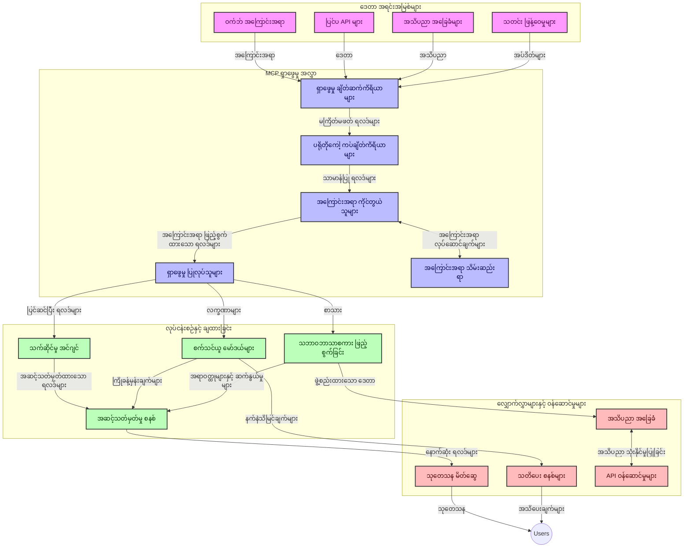
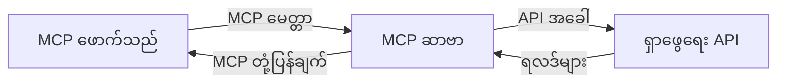
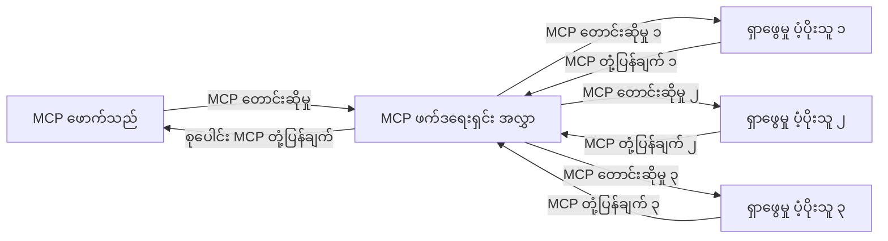
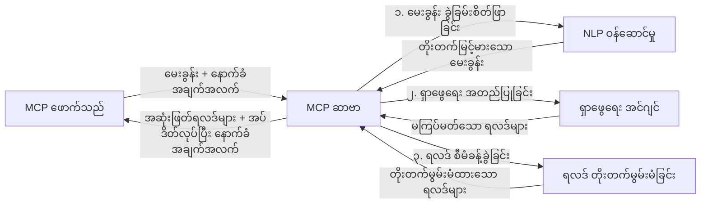

# အချိန်实时 ဝက်ဘ်ရှာဖွေမှုအတွက် မော်ဒယ် ကွန်တက် ပရိုတိုကော (Model Context Protocol)

## အကြမ်းဖျင်း

အချိန်实时 ဝက်ဘ်ရှာဖွေမှုသည် ယနေ့အချက်အလက်ကို အခြေခံသော ပတ်ဝန်းကျင်တွင် မရှိမဖြစ် လိုအပ်လာပြီး၊ အက်ပလီကေးရှင်းများသည် အင်တာနက်အကြောင်းအရာများမှ အသစ်စက်စက်သော အချက်အလက်များကို ချက်ချက်ချင်း ချိတ်ဆက် လာရန် လိုအပ်နေသည်။ Model Context Protocol (MCP) သည် အချိန်实时 ဝက်ဘ်ရှာဖွေမှု သုတေသနလုပ်ငန်းစဉ်များကို ထိရောက်မြှင့်တင်၊ စနစ်၏ ထိတွေ့မှုမှန်ကန်မှုနှင့် စွမ်းဆောင်ရည်အား တိုးတက်စေသော အရေးကြီးတိုးတက်မှုတစ်ခု ဖြစ်သည်။

ဤမော်ဂျူးသည် MCP သည် AI မော်ဒယ်များ၊ ရှာဖွေရေးအင်ဂျင်များနှင့် အက်ပလီကေးရှင်းများအကြား ကွန်တက် စီမံခန့်ခွဲမှုကို စံနှုန်းတကျ ဖြန့်ဝေခြင်းအားဖြင့် အချိန်实时 ဝက်ဘ်ရှာဖွေမှုကို မည်သို့ ပြောင်းလဲပေးသည်ကို လေ့လာသွားမည်ဖြစ်သည်။

### သင်သိရှိသွားမည့်အချက်များ

ဤလမ်းညွှန်တစ်ခုတွင် သင်သည်:

- MCP သည် AI မော်ဒယ်များနှင့် အချိန်实时 ဝက်ဘ်ရှာဖွေရေး စွမ်းဆောင်ရည်များအကြား ချိတ်ဆက်တစ်ခု ရေးဆွဲပုံ
- MCP ဖြင့် ထိရောက် scalable ဆိုရှယ်ရှာဖွေရေး ဖြေရှင်းချက် အသုံးပြုနည်း ပုံစံများ
- များပြားသော မေးခွန်းများနှင့် လုပ်ဆောင်ချက်များအတွင်း ရှာဖွေရေးကွန်တက် ထိန်းသိမ်းနည်းများ
- Python နှင့် JavaScript ဖြင့် ရှာဖွေရေး အခြေအနေ အမျိုးမျိုးအတွက် အကောင်အထည်ဖော်ကုဒ် နမူနာများ
- MCP မောင်းနှင်သော ရှာဖွေရေး စနစ်များတွင် သင့်တော်မှု၊ နောက်ဆုံးရ သတင္းအချက်အလက်နှင့် စွမ်းဆောင်ရည်တို့ကို သင်ချိန်ညှိနည်းများ

## အချိန်实时 ဝက်ဘ်ရှာဖွေရေး အစ

အချိန်实时 ဝက်ဘ်ရှာဖွေရေးသည် ဝက်ဘ်အခြေခံ အချက်အလက်များကို မကြာခဏ စစ်ဆေး၊ ဆန်းစစ်ပြီး ချက်ချက်ချင်း အသစ်အဆန်းများနှင့် သက်ဆိုင်ရာ အချက်အလက်များကို ဖြန့်ဝေသည့် နည်းပညာတစ်ခုဖြစ်သည်။ ပုံမှန်ရှာဖွေမှုတွင် နာရီများ သို့မဟုတ် ရက်များအကြာ အချက်အလက်များကို အသုံးပြုသော်လည်း အချိန်实时 ရှာဖွေရေးတွင် တိုက်ရိုက်အွန်လိုင်းအချက်အလက်များကို လက်ခံရရှိပြီး အသုံးပြုသူများအား မြန်ဆန်စွာ သက်ဆိုင်ရာ အချက်အလက်များ ပေးဆောင်နိုင်သည်။

### အချိန်实时 ဝက်ဘ်ရှာဖွေရေး၏ အခြေခံ အယူအဆများ

- **ဆက်တိုက် မေးခွန်းဆက်သွယ်မှု**: အမြဲတမ်း နေရာပြောင်းနေသည့် ဒေတာအရင်းအမြစ်များအပေါ် သက်ဆိုင်ရာ မေးခွန်းများကို ပြုလုပ်သည်။
- **နောက်ဆုံးရ သတင်းအချက်အလက် ဦးစားပေးမှု**: စနစ်များသည် အသစ်စက်စက်သော အချက်အလက်ကို ဦးစားပေးလုပ်ဆောင်ရန် ချမှတ်ထားသည်။
- **သင့်တော်မှု နှင့် နောက်ဆုံးရ သတင်းအချက်အလက် စုပေါင်းထားမှု**: သင့်တော်မှုနှင့် နောက်ဆုံးရ မြင်ကွင်းတို့ကို စုပေါင်းသိမ်းဆည်းထားသည်။
- **Scalableသော ဖွဲ့စည်းပုံ**: မေးခွန်းများစွာနှင့် ဒေတာပမာဏ မတည်ငြိမ်မှုများကို စနစ် ကြီးကြပ်နိုင်ရမည်။
- **သုံးစွဲသူ ကွန်တက် နားလည်မှု**: ရှာဖွေရေး လုပ်ဆောင်ချက်များအတွင်း သုံးစွဲသူ ကွန်တက်ကို ထိန်းသိမ်းမှုသည် အရေးကြီးသည်။
- **မေးခွန်းများပြန်ပြင်ခြင်း (Dynamic Query Reformulation)**: ကွန်တက်နှင့် ယခင်ရလဒ်များအပေါ် မူတည်၍ မေးခွန်းများကို ထပ်မံ ပြောင်းလဲရန်။
- **မတူညီသော မူရင်းများ ပေါင်းစပ်ခြင်း**: မတူညီသော ရှာဖွေရေး ပံ့ပိုးသူများနှင့် ဝက်ဘ်များမှ ရလဒ်များပေါင်းစပ်ခြင်း။
- **အဓိပ္ပာယ်အပေါ် အခြေခံသော နားလည်မှု**: စကားလုံးများ မဟုတ်ဘဲ အဓိပ္ပာယ်အပေါ် မေးခွန်းနှင့် အကြောင်းအရာ ကို ဆန်းစစ်ခြင်း။
- **အချိန်实时 ရန်ပုံငွေ**: အသစ်ရသော အချက်အလက်များကို အချိန်တိုင်းမှ စီစစ်ပြီး ရလဒ်အဆင့်သတ်မှတ်မှု ပြန်လည် ပြောင်းလဲခြင်း။

### Model Context Protocol နှင့် အချိန်实时 ဝက်ဘ်ရှာဖွေရေး

Model Context Protocol (MCP) သည် အချိန်实时 ဝက်ဘ်ရှာဖွေရေး ပတ်ဝန်းကျင်များတွင် ဖြစ်ပေါ်တတ်သည့် အခက်အခဲအချို့ကို ဖြေရှင်းပေးသည်။

၁။ **ရှာဖွေရေး ကွန်တက် ထိန်းသိမ်းမှု**: MCP သည် ဖြန့်ဖြူးထားသည့် ရှာဖွေရေး အစိတ်အပိုင်းများအကြား ကွန်တက် ထိန်းသိမ်းမှုကို စံထားသတ်မှတ်ပြီး AI မော်ဒယ်များနှင့် ကိုင်တွယ်ဆောင်ရွက်မှုနဲ့ ပတ်သက်သည့် မေးခွန်း သမိုင်းနှင့် သုံးစွဲသူ ဦးစားပေးချက်များကို ရရှိစေသည်။

၂။ **ထိရောက်သော မေးခွန်း စီမံခန့်ခွဲမှု**: ကွန်တက် ပို့ဆောင်မှုအတွက် ဖွဲ့စည်းပုံများ ထောက်ပံ့ပေးခြင်းအားဖြင့် MCP သည် မေးခွန်းတစ်ခါတစ်ရံတိုင်းတွင် ကွန်တက် ထပ်ပြောခြင်းဟာ ထိန်းချုပ်နိုင်စေသည်။

၃။ **အပြန်အလှန် ဆက်သွယ်မှု**: MCP သည် ကွဲပြားသော ရှာဖွေရေး နည်းပညာနှင့် AI မော်ဒယ်များ အကြား ချိတ်ဆက်မှုများအတွက် တစ်ခုတည်းသော ဘာသာစကားတစ်ခု ဖန်တီးပေးသည်၊ ပိုမို ယုံကြည်စိတ်ချရပြီး တိုးချဲ့နိုင်သော ဖွဲ့စည်းပုံများ ဖြစ်လာစေသည်။

၄။ **ရှာဖွေရေးအတွက် သင့်တော်သော ကွန်တက်**: MCP အကောင်အထည်ဖော်မှုများသည် အကျိုးရှိစေရန် သင့်တော်သော ကွန်တက်အပိုင်းများကို ဦးစားပေး၍ စွမ်းဆောင်ရည်နှင့် မှန်ကန်မှုကို တိုးတက်စေသည်။

၅။ **ချိန်ညှိနိုင်သော ရှာဖွေရေးလုပ်ငန်းစဉ်**: MCP မှတဆင့် မှန်ကန်သော ကွန်တက် စီမံခန့်ခွဲမှုဖြင့် ရှာဖွေရေး စနစ်များသည် သုံးစွဲသူ လိုအပ်ချက်များနှင့် အချက်အလက် ပတ်ဝန်းကျင် အခြေအနေများ အပေါ် မူတည်၍ ပိုမို တုန့်ပြန် ပြောင်းလဲဆောင်ရွက်နိုင်သည်။

သတင်းစုဆောင်းခြင်းမှ စမ်းသပ်ဖော်ဆောင်မှု အထောက်အကူပြုကိရိယာများထိ မော်ဒယ် ကွန်တက် ပရိုတိုကောနှင့် ဝက်ဘ်ရှာဖွေရေးနည်းပညာ ပေါင်းစပ်မှုသည် ပိုမို ဖန်တီးနိုင်သော၊ ကွန်တက်ကို သတိထားသော ရှာဖွေရေးအား တိုးတက်စေရန် အထောက်အကူပြုသည်။

## သင်ယူရမည့် ရည်မှန်းချက်များ

ဤသင်ခန်းစာအပြီး သင်သည်:

- အချိန်实时 ဝက်ဘ်ရှာဖွေရေး အခြေခံနှင့် ယနေ့ခေတ် အက်ပလီကေးရှင်းများတွင် ရင်ဆိုင်နေရသည့် အခက်အခဲများကို နားလည်နိုင်မည်
- Model Context Protocol (MCP) သည် အချိန်实时 ဝက်ဘ်ရှာဖွေရေး စွမ်းဆောင်ရည်များကို မည်သို့ တိုးတက်စေသည်ကို ရှင်းပြနိုင်မည်
- ပရိသတ်တွင် နာမည်ကြီးသော ဖွဲ့စည်းပုံများနှင့် API များ အသုံးပြု၍ MCP အခြေခံ ရှာဖွေရေး ဖြေရှင်းချက်များ တည်ဆောက်နိုင်မည်
- MCP ဖြင့် scalable နှင့် စွမ်းဆောင်ရည်မြင့် ရှာဖွေရေး ဖွဲ့စည်းပုံများ ချမှတ် နှင့် ဖြန့်ချိနိုင်မည်
- စာလုံးအဓိပ္ပာယ်ရှာဖွေရေး၊ သုတေသနကူညီမှုနှင့် AI ပူးပေါင်း Browsing အပါအဝင် မတူကွဲပြားသော အသုံးအဆောင်များတွင် MCP အယူအဆများကို အသုံးချနိုင်မည်
- MCP အခြေခံ ရှာဖွေရေး နည်းပညာများတွင် ပေါ်ပေါက်လာသော လမ်းစဉ်များနှင့် မနာလိုက်နာရမည့် ရှာဖွေရေး ဆန်းသစ်တီထွင်မှုများကို မွေးမြူနိုင်မည်
- သုံးစွဲသူ ဆက်သွယ်မှုမှ သင်ယူသော ကွန်တက် သတိထားရမည့် ရှာဖွေရေး စနစ်များဖန်တီးနိုင်မည်
- စံနှုန်းတကျ MCP ပရိုတိုကောများကို အသုံးပြုသည့် AI ကူညီသူများသို့ ဝက်ဘ်ရှာဖွေရေး စွမ်းဆောင်ရည်များ ထည့်သွင်းနိုင်မည်
- ကွန်တက် အပေါ် အခြေခံ၍ စဉ်ဆက်မပြတ် ရလဒ် တိုးတက်စေရန် multi-stage ရှာဖွေရေး လမ်းကြောင်းများ ဖန်တီးနိုင်မည်
- ပြည့်စုံသော ကွန်တက် နားလည်မှုကို ထိန်းထားထားကာ ရှာဖွေရေး စွမ်းဆောင်ရည်ကို မြှင့်တင်နိုင်မည်

### အဓိပ္ပာယ်နှင့် အရေးကြီးမှု

အချိန်实时 ဝက်ဘ်ရှာဖွေရေးဆိုသည်မှာ လျင်မြန်စွာ မေးခွန်း အသစ်များထား၍ ဝက်ဘ် အချက်အလက်များကို ဆက်တိုက် ရယူခြင်းနှင့် ဖြန့်ဝေခြင်းဖြစ်ပြီး၊ ပုံမှန် ရှာဖွေမှုများ၏ ကွာခြားချက်မှာ စာရင်းသွင်းထားသည့် ဒေတာများ မဟုတ်ဘဲ အသစ်အဆန်းအချက်အလက်များကို ချက်ချက်ချင်း ရရှိစေခြင်း ဖြစ်သည်။

အချိန်实时 ဝက်ဘ်ရှာဖွေရေး၏ အဓိက လက္ခဏာများမှာ:

- **အသစ်စက်စက်ခြင်း**: နောက်ဆုံးရ အကြောင်းအရာများနှင့် ပြင်ဆင်မှုများကို ဦးစားပေးခြင်း
- **ဆက်တိုက် ဆောင်ရွက်မှု**: အသစ်ထွက်ရှိသော အချက်အလက်များကို အလျင်အမြန် စစ်ဆေးခြင်း
- **မေးခွန်း ပြင်ဆင်ခြင်း**: ကွန်တက်နှင့် လမ်းညွှန်ချက်များအပေါ် မူတည်၍ ရှာဖွေရေး မေးခွန်းများကို တိုးချဲ့ပြင်ဆင်ခြင်း
- **ချက်ချင်း ဖြန့်ဖြူးမှု**: ရှာဖွေရေး ရလဒ်များကိုနည်းနည်းဆီးခြောက်ပြီး မျက်နှာပြင်ပေးခြင်း
- **ကွန်တက် ထိန်းသိမ်းမှု**: ယခင် မေးခွန်းများအပေါ် ဆက်လက် တည်ဆောက်ခြင်းဖြင့် သင့်တော်မှု တိုးတက်စေခြင်း

### ပုံမှန် ဝက်ဘ်ရှာဖွေမှုတွင် ရှားပါးသော အခက်အခဲများ

ပုံမှန် ဝက်ဘ်ရှာဖွေမှု နည်းလမ်းများသည် အချိန်实时 စနစ်များတွင် အချို့ကန့်သတ်ချက်များကြုံတွေ့ရသည်။

၁။ **ကွန်တက် ဖြတ်ကွက်မှု**: မေးခွန်းများစွာ ဆက်တိုက် မေးလျှင် ကွန်တက် ထိန်းသိမ်းရန် ခက်ခဲခြင်း။
၂။ **သတင်းအချက်အလက် အသစ်စပ်မှုလုပ်ငန်း**: နောက်ဆုံးရ သတင်းအချက်အလက်ကို ရယူရန် နှင့် အဓိကထားပေးရန် အခက်အခဲ။
၃။ **ပေါင်းစည်းခြင်း အခက်အခဲ**: ရှာဖွေရေးစနစ်များနှင့် အက်ပလီကေးရှင်းများ အကြား ပေါင်းစည်းပေါင်းဝင်ရေး အခက်အခဲ။
၄။ **ကြာရှည်ချက်**: နောက်ဆုံးရ လိုအပ်ချက်များနှင့် အချိန်ကန့်သတ်ချက်တို့ကို သက်ဆိုင်ရာ ကျင့်သုံးမှု။
၅။ **သင့်တော်မှု ချိန်ညှိမှု**: ကျစနစ်ရှိသည်နှင့် သင့်တော်မှုကို ထိန်းသိမ်းခြင်း။

## ရှာဖွေရေးအတွက် Model Context Protocol (MCP) နားလည်ခြင်း

### ရှာဖွေရေး ကွန်တက် တွင် MCP ဆိုသည်မှာ ဘာလဲ?

Model Context Protocol (MCP) သည် AI မော်ဒယ်များနှင့် အက်ပလီကေးရှင်းတို့ အကြား ထိရောက်သော ဆက်သွယ်မှုအတွက် စံနှုန်းတကျ ဆက်သွယ်မှု ပရိုတိုကောဖြစ်သည်။ အချိန်实时 ဝက်ဘ်ရှာဖွေရေး ပတ်ဝန်းကျင်တွင် MCP သည် အောက်ပါအပိုင်းများ ပါဝင်သည်။

- ရှာဖွေရေး မေးခွန်း လူကြားတွင် ကွန်တက် ထိန်းသိမ်းပေးခြင်း
- ရှာဖွေရေး မေးခွန်း နှင့် ရလဒ် ပုံစံများ စံထားဖော်ပြပေးခြင်း
- ရှာဖွေရေး ပါရာမီတာများနှင့် ရလဒ်ပေးပို့မှုများကို တိုးတက်အောင် တင်ပို့ပေးခြင်း
- မော်ဒယ်နှင့် ရှာဖွေရေးအင်ဂျင် အကြား ဆက်သွယ်မှု ကောင်းမွန်စေခြင်း

### အဓိက အစိတ်အပိုင်းများနှင့် ဖွဲ့စည်းပုံ

အချိန်实时 ဝက်ဘ်ရှာဖွေရေးအတွက် MCP ဖွဲ့စည်းပုံတွင် အဓိကအစိတ်အပိုင်းများမှာ:

၁။ **မေးခွန်း ကွန်တက် ကိုင်တွယ်သူများ**: မေးခွန်းများအတွင်း ကွန်တက် ထိန်းသိမ်းမှုကို စီမံခန့်ခွဲသည်။
၂။ **ရှာဖွေရေး လုပ်ဆောင်သူများ**: ကွန်တက်အသိပညာ တည်ရှိမှုဖြင့် ရှာဖွေရေး တောင်းဆိုမှုများကို ပြုလုပ်သည်။
၃။ **ပရိုတိုကော အပ်တာများ**: ကွန်တက် ထိန်းသိမ်းမှုကို လျှော့မချဘဲ မတူညီသော ရှာဖွေရေး API များကြား သယ်ဆောင်သည်။
၄။ **ကွန်တက် သိမ်းဆည်းမှုပြင်**: ရှာဖွေမှု သမိုင်းနှင့် ကိုက်ညီမှုများကို ထိန်းသိမ်းရာ။
၅။ **ရှာဖွေရေး ချိတ်ဆက်သူများ**: မတူညီသော ရှာဖွေရေး အင်ဂျင်နှင့် ဝက်ဘ် API များကို ချိတ်ဆက်သည်။



### MCP သည် အချိန်实时 ဝက်ဘ်ရှာဖွေရေးကို မည်သို့ တိုးတက်စေသနည်း

MCP သည် ပုံမှန် ဝက်ဘ်ရှာဖွေရေး ခက်ခဲမှုများကို အောက်ပါအတိုင်း ဖြေရှင်းပေးသည်။

- **ကွန်တက်ဆက်လက်မှု**: ရှာဖွေရေး session တစ်လျှောက် မေးခွန်းများအကြား ဆက်စပ်မှုများ ထိန်းသိမ်းထားခြင်း
- **ထိရောက်သော တင်ပို့မှု**: မေးခွန်း ပါရာမီတာများ၏ ထပ်တလဲလဲ ဖြစ်မှုကို စမတ်စွာ စီမံခန့်ခွဲခြင်း
- **စံထား API များ**: ရှာဖွေရေး အစိတ်အပိုင်းများအတွက် တည်ငြိမ်သော API များ ပံ့ပိုးပေးခြင်း
- **ကြာရှည်ချက် လျှော့ချပေးခြင်း**: ကွန်တက် ထိန်းသိမ်းမှု ထိရောက်စွာ ပြုလုပ်ခြင်းဖြင့် ပိုမိုမြန်ဆန်သော အလုပ်လုပ်နိုင်မှု
- **သင့်တော်မှု တိုးတက်မှု**: မေးခွန်း များအကြား သုံးစွဲသူ အဓိပ္ပာယ်ကို ထိန်းသိမ်းလျက် ရှာဖွေရေး သင့်တော်မှု တိုးတက်စေခြင်း

## ပေါင်းစည်းခြင်းနှင့် အကောင်အထည်ဖော်ခြင်း

အချိန်实时 ဝက်ဘ်ရှာဖွေရေး စနစ်များမှာ စွမ်းဆောင်ရည်နှင့် ကွန်တက် တိကျမှုကို ထိန်းသိမ်းရန် ဖွဲ့စည်းပုံကို ဂရုစိုက်စွာ ဒီဇိုင်းဆွဲထုတ်တည်ဆောက်ရမည် ဖြစ်သည်။ Model Context Protocol သည် AI မော်ဒယ်များ နဲ့ ရှာဖွေရေး နည်းပညာများ ပေါင်းစပ်ရာ တွင် စံနှုန်းတကျ နည်းလမ်းကို ပေးပြီး ပိုမို တိုးတက် အကြောင်းအရာ သတိထားသည့် ရှာဖွေရေး လမ်းကြောင်းများ ဖန်တီးပေးသည်။

### ရှာဖွေရေး ဖွဲ့စည်းပုံများတွင် MCP ပေါင်းစပ်ခြင်း အကြမ်းဖျင်း

အချိန်实时 ဝက်ဘ်ရှာဖွေရေး ပတ်ဝန်းကျင်များတွင် MCP ကို တပ်ဆင်ဆောင်ရွက်ရာတွင် အောက်ပါ အချက်များကို ဦးစားပေးစဉ်းစားရမည်။

၁။ **ရှာဖွေရေး ကွန်တက် များအား စနစ်တကျ အမျိုးအစားဖြင့် စာသားတစ်ခုလိုဖြင့် သယ်ဆောင်ရန်**: MCP သည် ရှာဖွေရေး တောင်းဆိုမှုများအတွင်း အရေးကြီးသော ကွန်တက်ကို အကောင်အထည်ဖော်နိုင်ရန် ထိရောက်သော နည်းလမ်းများ နှင့် စံစနစ်တစ်ခု ပေးသည်။ ၎င်းတွင် ရှာဖွေရေး နဲ့ ပတ်သက်သော အသေးစိတ် Meta Data များအတွက် စံချိန်ထားသော စာသားပုံစံပါရှိသည်။

၂။ **အခြေအနေတစ်ခုတည်း ရှာဖွေရေး လုပ်ဆောင်မှု**: MCP သည် ရှာဖွေရေး ယခင်လှုပ်ရှားမှုများအတွင်း ဆက်သာတည့်သော ကွန်တက် ကို ဆက်လက် ထိန်းသိမ်းရာတွင် ပိုမို ဉာဏ်ရှိစွာ လုပ်ဆောင်နိုင်စေသည်။ ဒါဟာ ရှာဖွေရေးအစိတ်အပိုင်းများ ဆက်လက် ပြင်ဆင်ပြီး ရလဒ်များ ပိုမိုတိုးတက်စေသည့် Multi-stage ရှာဖွေရေး လမ်းကြောင်းများတွင် အထူးအသုံးဝင်သည်။

၃။ **မေးခွန်း ကွဲပြားမှု နှင့် စစ်ထုတ်ခြင်း**: MCP အကောင်အထည်ဖော်မှုများသည် ဆက်စပ် ကွန်တက် အရရှိမှုအပေါ်မူတည်၍ ဝေစုနှင့် စစ်ထုတ်ပြီး သင့်တော်သော ရလဒ်များ ပိုမိုရရှိစေရန် ကူညီပေးနိုင်သည်။

၄။ **ရလဒ် ထိန်းသိမ်းခြင်းနှင့် ဦးစားပေးခြင်း**: MCP သည် ကွန်တက် ကို စနစ်တကျ ဆောင်ရွက်ခြင်းအားဖြင့် ရလဒ် ထိန်းသိမ်းမှုနှင့် ဦးစားပေးမှုကို စီမံရန် အထောက်အကူဖြစ်စေသည်။

၅။ **ရှာဖွေရေး သက်ဆိုင်ရာ အစိတ်အပိုင်းများ ပေါင်းစည်းခြင်း**: MCP သည် အမျိုးအစား ကွဲပြားသော backend များအကြား ရှာဖွေရေး ပေါင်းစည်းမှုကို ပိုမို ဖန်တီးတတ်စေရန် ကွန်တက်ကို စနစ်တကျ ညှိနှိုင်းစေသည်။

MCP ကို ရှာဖွေရေးနည်းပညာ အမျိုးမျိုးတွင် တပ်ဆင်ခြင်းအားဖြင့် ကွန်တက်စီမံခန့်ခွဲမှုအတွက် တစ်ကြောင်းတည်းနည်းလမ်းတစ်ခု ဖြစ်လာသည်၊ ထို့ကြောင့် စိတ်ကြိုက်ပေါင်းစည်းမှု ကုဒ်များ လျော့နည်းပြီး ရှာဖွေရေး မေးခွန်းများ အတိုးအကျယ် ပြောင်းလဲသွားသည်အခါ ကွန်တက် သိသာထင်ရှား ထိန်းသိမ်းနိုင်သည်။

### MCP ကို ဝက်ဘ် ရှာဖွေရေး အမျိုးမျိုးတွင် အသုံးပြုခြင်း

ဤနမူနာများသည် MCP စံနှုန်းကို လိုက်နာပြီး JSON-RPC အခြေခံ ပရိုတိုကောနှင့် သယ်ယူပို့ဆောင်မှု အစီအစဉ်များ ဖော်ပြသည်။ ကြာရှည်သုံး Custom ရှာဖွေရေး ပေါင်းစပ်နည်းကို MCP ပရိုတိုကောနှင့်ကိုက်ညီစွာ ပြုလုပ်နိုင်ခြင်းကို ဥပမာပြသည်။


<details>
<summary>Python ဖြင့် Generic ရှာဖွေရေး API အသုံးပြု၍ အကောင်အထည်ဖော်ခြင်း</summary>

```python
import asyncio
import json
import aiohttp
from typing import Dict, Any, Optional, List
from contextlib import asynccontextmanager
from collections.abc import AsyncIterator

# သာမန် MCP စာကြည့်တိုက်များကို နယူပါ
from mcp.client.session import ClientSession
from mcp.client.streamable_http import streamablehttp_client
from mcp.types import TextContent, CreateMessageRequestParams, CreateMessageResult
from mcp.server.fastmcp import FastMCP

# ဝက်ဘ်ရှာဖွေမှုအတွက် FastMCP ဆာဗာ တစ်ခု ဖန်တီးပါ
search_server = FastMCP("WebSearch")

# ဝက်ဘ်ရှာဖွေမှု လုပ်ဆောင်ချက်များ ကို ကိုင်တွယ်ရန် အတန်း
class WebSearchHandler:
    def __init__(self, api_endpoint: str, api_key: str):
        self.api_endpoint = api_endpoint
        self.api_key = api_key
        self.session = None
        
    async def initialize(self):
        """Initialize the HTTP session"""
        self.session = aiohttp.ClientSession(
            headers={"Authorization": f"Bearer {self.api_key}"}
        )
    
    async def close(self):
        """Close the HTTP session"""
        if self.session:
            await self.session.close()
            
    async def perform_search(self, query: str, max_results: int = 5, 
                           include_domains: List[str] = None, 
                           exclude_domains: List[str] = None,
                           time_period: str = "any") -> Dict[str, Any]:
        """Perform web search using the search API"""
        # ရှာဖွေရေး ပါရာမီတာများ တည်ဆောက်ပါ
        search_params = {
            "q": query,
            "limit": max_results,
            "time": time_period
        }
        
        if include_domains:
            search_params["site"] = ",".join(include_domains)
            
        if exclude_domains:
            search_params["exclude_site"] = ",".join(exclude_domains)
        
        # ရှာဖွေမှု တောင်းဆိုမှု ဆောင်ရွက်ပါ
        try:
            async with self.session.get(
                self.api_endpoint,
                params=search_params
            ) as response:
                if response.status != 200:
                    error_text = await response.text()
                    raise Exception(f"Search API error: {response.status} - {error_text}")
                
                search_data = await response.json()
                
                # API သီးသန့် ဖြေကြားချက်ကို သာမန်ပုံစံ သို့ ပြောင်းလဲပါ
                results = []
                for item in search_data.get("results", []):
                    results.append({
                        "title": item.get("title", ""),
                        "url": item.get("url", ""),
                        "snippet": item.get("snippet", ""),
                        "date": item.get("published_date", ""),
                        "source": item.get("source", "")
                    })
                
                return {
                    "query": query,
                    "totalResults": len(results),
                    "results": results
                }
        except Exception as e:
            print(f"Search API request error: {e}")
            raise

# ရှာဖွေမှု ကိုင်တွယ်သူ ကို စတင်အရင်
search_handler = WebSearchHandler(
    api_endpoint="https://api.search-service.example/search",
    api_key="your-api-key-here"
)

# ရှာဖွေမှု ကိုင်တွယ်သူ ကို စီမံရန် အသက်တာကြာမြင့်ချိန် ကိုပြင်ဆင်ပါ
@asyncio.asynccontextmanager
async def app_lifespan(server: FastMCP):
    """Manage application lifecycle"""
    await search_handler.initialize()
    try:
        yield {"search_handler": search_handler}
    finally:
        await search_handler.close()

# ဆာဗာ အတွက် အသက်တာကြာမြင့်ချိန် သတ်မှတ်ပါ
search_server = FastMCP("WebSearch", lifespan=app_lifespan)

# ဝက်ဘ်ရှာဖွေရေး ကိရိယာ တစ်ခုကို မှတ်ပုံတင်ပါ
@search_server.tool()
async def web_search(query: str, max_results: int = 5, 
                   include_domains: List[str] = None,
                   exclude_domains: List[str] = None,
                   time_period: str = "any") -> Dict[str, Any]:
    """
    Search the web for information
    
    Args:
        query: The search query
        max_results: Maximum number of results to return (default: 5)
        include_domains: List of domains to include in search results
        exclude_domains: List of domains to exclude from search results
        time_period: Time period for results ("day", "week", "month", "any")
        
    Returns:
        Dictionary containing search results
    """
    ctx = search_server.get_context()
    search_handler = ctx.request_context.lifespan_context["search_handler"]
    
    results = await search_handler.perform_search(
        query=query,
        max_results=max_results,
        include_domains=include_domains,
        exclude_domains=exclude_domains,
        time_period=time_period
    )
    
    return results

# ဥပမာ ဖောက်သည် အသုံးပြုမှု
async def client_example():
    # Streamable HTTP သယ်ယူပို့ဆောင်မှုပုံစံ အသုံးပြု၍ ရှာဖွေရေး ဆာဗာချိတ်ဆက်ပါ
    async with streamablehttp_client("http://localhost:8000/mcp") as (read, write, _):
        async with ClientSession(read, write) as session:
            # ချိတ်ဆက်မှု ကို စတင်ပါ
            await session.initialize()
            
            # web_search ကိရိယာကို ခေါ်ဆိုပါ
            search_results = await session.call_tool(
                "web_search", 
                {
                    "query": "latest developments in AI and Model Context Protocol",
                    "max_results": 5,
                    "time_period": "day",
                    "include_domains": ["github.com", "microsoft.com"]
                }
            )
            
            print(f"Search results: {search_results}")

# ဆာဗာ လုပ်ဆောင်သည့် ဥပမာ
if __name__ == "__main__":
    # Streamable HTTP သယ်ယူပို့ဆောင်မှုပုံစံ ဖြင့် ဆာဗာကို ရပ်ဆာ ဆောင်ရွက်ပါ
    search_server.run(transport="streamable-http")
```
</details> 

<details>
<summary>JavaScript ဖြင့် Browser-Based ရှာဖွေရေး အကောင်အထည်ဖော်ခြင်း</summary>


```javascript
// ဝဘ်ရှာဖွေရေးအတွက် MCP ဆားဗာ အကောင်အထည်ဖော်ခြင်း
import { McpServer, ResourceTemplate } from '@modelcontextprotocol/sdk/server/mcp.js';
import { StreamableHTTPServerTransport } from '@modelcontextprotocol/sdk/server/streamableHttp.js';
import { z } from 'zod';

// ဝဘ်ရှာဖွေရေးအတွက် MCP ဆားဗာ တည်ဆောက်ပါ
const searchServer = new McpServer({
    name: "BrowserSearch",
    description: "A server that provides web search capabilities"
});

// ရှာဖွေရေးဝန်ဆောင်မှုအတန်း
class SearchService {
    constructor(searchApiUrl, apiKey) {
        this.searchApiUrl = searchApiUrl;
        this.apiKey = apiKey;
    }

    async performSearch(parameters) {
        const {
            query = '',
            maxResults = 5,
            includeDomains = [],
            excludeDomains = [],
            timePeriod = 'any'
        } = parameters;
        
        // ပါရာမီတာများဖြင့် ရှာဖွေရေး URL ကို ဖန်တီးပါ
        const url = new URL(this.searchApiUrl);
        url.searchParams.append('q', query);
        url.searchParams.append('limit', maxResults);
        url.searchParams.append('time', timePeriod);
        
        if (includeDomains.length > 0) {
            url.searchParams.append('site', includeDomains.join(','));
        }
        
        if (excludeDomains.length > 0) {
            url.searchParams.append('exclude_site', excludeDomains.join(','));
        }
        
        try {
            const response = await fetch(url.toString(), {
                method: 'GET',
                headers: {
                    'Authorization': `Bearer ${this.apiKey}`,
                    'Content-Type': 'application/json'
                }
            });
            
            if (!response.ok) {
                const errorText = await response.text();
                throw new Error(`Search API error: ${response.status} - ${errorText}`);
            }
            
            const searchData = await response.json();
            
            // API အမျိုးအစားကို သတ်မှတ်response ကို စံပုံဖော်သို့ ပြောင်းလဲပါ
            const results = searchData.results?.map(item => ({
                title: item.title || '',
                url: item.url || '',
                snippet: item.snippet || '',
                date: item.published_date || '',
                source: item.source || ''
            })) || [];
            
            return {
                query,
                totalResults: results.length,
                results
            };
        } catch (error) {
            console.error('Search API request error:', error);
            throw error;
        }
    }
}

// ရှာဖွေရေးဝန်ဆောင်မှုကို စတင်အပ်ပါ
const searchService = new SearchService(
    'https://api.search-service.example/search',
    'your-api-key-here'
);

// ဆားဗာအတွက် context ပံ့ပိုးသူကို တပ်ဆင်ပါ
searchServer.setContextProvider(() => {
    return {
        searchService
    };
});

// ဝဘ်ရှာဖွ Lew tool ကို မှတ်ပေးပါ
searchServer.tool({
    name: 'web_search',
    description: 'Search the web for information',
    parameters: {
        type: 'object',
        properties: {
            query: {
                type: 'string',
                description: 'The search query'
            },
            maxResults: {
                type: 'integer',
                description: 'Maximum number of results to return',
                default: 5
            },
            includeDomains: {
                type: 'array',
                items: { type: 'string' },
                description: 'List of domains to include in search results'
            },
            excludeDomains: {
                type: 'array',
                items: { type: 'string' },
                description: 'List of domains to exclude from search results'
            },
            timePeriod: {
                type: 'string',
                description: 'Time period for results',
                enum: ['day', 'week', 'month', 'any'],
                default: 'any'
            }
        },
        required: ['query']
    },
    handler: async (params, context) => {
        const { searchService } = context;
        return await searchService.performSearch(params);
    }
});

// ရှာဖွေရေးဆားဗာနှင့် ချိတ်ဆက်ထားသော client ကုဒ်နမူနာ
import { Client } from '@modelcontextprotocol/sdk/client/index.js';
import { StreamableHTTPClientTransport } from '@modelcontextprotocol/sdk/client/streamableHttp.js';

async function connectToSearchServer() {
    // ရှာဖွေရေးဆားဗာနှင့် ချိတ်ဆက်ပါ
    const transport = new StreamableHTTPClientTransport(
        new URL('http://localhost:8000/mcp')
    );
    
    const client = new Client({
        name: 'search-client',
        version: '1.0.0'
    });
    
    await client.connect(transport);
    
    // ရှာဖွ Lew tool ကို လည်ပတ်ပါ
    const searchResults = await client.callTool({
        name: 'web_search',
        arguments: {
            query: 'Model Context Protocol implementation examples',
            maxResults: 10,
            timePeriod: 'week',
            includeDomains: ['github.com', 'docs.microsoft.com']
        }
    });
    
    console.log('Search results:', searchResults);
    
    // လွှတ်ရန်သန့်ရှင်းရေးလုပ်ဆောင်ပါ
    await client.disconnect();
}

// ဆားဗာကို စတင်ပါ
const transport = new StreamableHTTPServerTransport();
await searchServer.connect(transport);
console.log('Search server running at http://localhost:8000/mcp');

// လွတ်လပ်နေသောလုပ်ငန်းစဉ် တစ်ခုတွင် သို့မဟုတ် ဆားဗာစတင်ပြီးနောင့်
// connectToSearchServer().catch(console.error);
```
</details> 


## ကုဒ် ဥပမာများ အကြောင်း သတိပေးချက်

> **အရေးကြီး သတိပေးချက်**: အောက်ပါကုဒ် ဥပမာများသည် Model Context Protocol (MCP) နှင့် ဝက်ဘ် ရှာဖွေရေး လုပ်ဆောင်မှု ပေါင်းစပ်မှုကို ပြသသည်။ ၎င်းတို့သည် MCP တရားဝင် SDK များ၏ ဗဟိုပုံစံနှင့် ဂြိုလ်တု ဖွဲ့စည်းပုံများနှင့် ကိုက်ညီသော်လည်း ပညာရေး ရည်ရွယ်ချက်ဖြင့် ရိုးရှင်းအောင် လုပ်ထားသည်။
> 
> ဤနမူနာများတွင် ပါရှိသည်။
> 
> ၁။ **Python implementation**: FastMCP server ကို အသုံးပြု၍ ဝက်ဘ်ရှာဖွေရေး ပရိုဂရမ်တစ်ခု ဖန်တီးထားပြီး အပြင် API နှင့် ချိတ်ဆက်မှု ရှိသည်။ ဤနမူနာတွင် သက်တမ်းထိန်းသိမ်းမှု၊ ကွန်တက် ကောင်းမွန်စွာ စီမံခြင်းနှင့် ကိရိယာ အသုံးပြုမှုကို [တရားဝင် MCP Python SDK](https://github.com/modelcontextprotocol/python-sdk) ၏ ပုံစံဖြင့် ပြသထားသည်။ Server သည် အသစ်ထွက်သော Streamable HTTP သယ်ယူပို့ဆောင်မှုကို အသုံးပြုထားသောကြောင့် အဖွဲ့အစည်းထုတ်လုပ်မှုအတွက် SSE ၏ အစားလိုက်ပါသည်။
> 
> ၂။ **JavaScript implementation**: FastMCP ပုံစံကို [တရားဝင် MCP TypeScript SDK](https://github.com/modelcontextprotocol/typescript-sdk) မှ ထုတ်ယူပြီး TypeScript/JavaScript အသုံးပြု၍ ရှာဖွေရေး ဆာဗာတစ်ခု ဖန်တီးထားသည်။ ၎င်းသည် session ကို စီမံခြင်းနှင့် ကွန်တက် ထိန်းသိမ်းမှု အတွက် နောက်ဆုံး အကြံပြု နည်းလမ်းများကို လိုက်နာသည်။
> 
> ဤနမူနာများတွင် ထုတ်လုပ်မှု အသုံးပြုရန်အတွက် အပို error handling၊ အတည်ပြုမှုနှင့် API ပေါင်းစပ်မှုကုဒ်များ လိုအပ်နေဆဲ ဖြစ်သည်။ ရှာဖွေရေး API တည်နေရာများဖြစ်သည့် (`https://api.search-service.example/search`) များသည် နမူနာများဖြစ်ပြီး အကောင်းမြင်ရာ ဝန်ဆောင်မှု တည်နေရာများဖြင့် အစားထိုးရန်လိုအပ်သည်။
> 
> လုံးဝအကောင်အထည်ဖော်မှုအသေးစိတ်နှင့် နောက်ဆုံးနည်းလမ်းများအတွက်,
> [တရားဝင် MCP သတ်မှတ်ချက်](https://modelcontextprotocol.io/specification/2026-07-28/)
> နှင့် SDK စာရွက်စာတမ်းများကို ရည်ညွှန်းပါ။

## အဓိက အယူအဆများ

### Model Context Protocol (MCP) ဖွဲ့စည်းပုံ

အခြေခံအားဖြင့် Model Context Protocol သည် AI မော်ဒယ်များ၊ အက်ပလီကေးရှင်းများနှင့် ဝန်ဆောင်မှုများကြားတွင် ကွန်တက် အပေါ် အစီအစဉ်တကျ အပြန်အလှန် ဆက်သွယ်နိုင်ရန် စံချိန်တစ်ခု ပေးသည်။ အချိန်实时 ဝက်ဘ်ရှာဖွေရေးတွင် ဤစံချိန်သည် စဥ်ဆက်မပြတ် ရှာဖွေရေး အတွေ့အကြုံများ ဖန်တီးရာတွင် အရေးကြီးသည်။ အဓိကအစိတ်အပိုင်းများမှာ:

၁။ **Client-Server ဖွဲ့စည်းပုံ**: MCP သည် ရှာဖွေရေး client (တောင်းဆိုသူ) နှင့် ရှာဖွေရေး server (ပံ့ပိုးသူ) ကြား သဘာဝကွဲပြားမှု ရှိစေရန် ခွဲခြားပေးသည်၊ ထို့ကြောင့် အသုံးပြုရာတွင် ရွေးချယ်မှုများ ရရှိသည်။

၂။ **JSON-RPC ဆက်သွယ်မှု**: ဤပရိုတိုကောသည် JSON-RPC ကို သတင်းအချက်အလက် လွှဲပြောင်းရန်အသုံးပြု၍ ဝက်ဘ်နည်းပညာနှင့်လိုက်ဖက်ပြီး မတူညီသည့် ပလက်ဖောင်းများတွင် လွယ်ကူစွာ နောက်ထပ် တပ်ဆင်နိုင်သည်။

၃။ **ကွန်တက် စီမံခန့်ခွဲမှု**: MCP သည် ရှာဖွေရေး ဆက်ဆံမှုများအတွင်း ကွန်တက်များ ကို တည်ဆောက်၊ ပြင်ဆင်၊ အသုံးချနိုင်ရန် ဖွဲ့စည်းပုံများ သတ်မှတ်ပေးသည်။

၄။ **ကိရိယာ ဇယား ဖော်ပြချက်များ**: ရှာဖွေရေး စွမ်းဆောင်ရည်များကို ဉပမာတစ်ခုဖြစ်သော ကိရိယာများအဖြစ် ပြသပြီး ၎င်းတို့၏ ပါရာမီတာများနှင့် ပြန်လာသော ဒေတာများကို တိကျစွာ သတ်မှတ်ပေးသည်။ 

၅။ **ထုတ်လွှင့်မှု ထောက်ပံ့မှု**: ပရိုတိုကောသည် ရလဒ်များကို စဉ်ဆက်မပြတ် ထွက်ရှိလာစေရန် အပြန်အလှန် ထုတ်လွှင့်ခြင်းကို ထောက်ပံ့သည်၊ အချိန်实时 ရှာဖွေရေးတွင် အရေးကြီးသည်။

### ဝက်ဘ် ရှာဖွေရေး ပေါင်းစပ်မှု နမူနာများ

MCP ကို ဝက်ဘ် ရှာဖွေရေးနဲ့ ပေါင်းစပ်ရာတွင် အောက်ပါ ပုံစံများ ပေါ်ထွန်းသည်။

#### ၁။ တိုက်ရိုက် ရှာဖွေရေး ပံ့ပိုးသူများ ပေါင်းစပ်ခြင်း



ဤပုံစံတွင် MCP server သည် အချို့ သို့မဟုတ် များပြားသော ရှာဖွေရေး API များနှင့် တိုက်ရိုက် ဆက်သွယ်ပြီး MCP တောင်းဆိုချက်များကို API call များအဖြစ် ဘာသာပြန်၍ MCP ရလဒ်အဖြစ် Format ပြောင်းပေးသည်။

#### ၂။ ကွန်တက် ထိန်းသိမ်းထားသော ဖက်ဒရိတ် ရှာဖွေရေး



ဤပုံစံတွင် MCP အညီမွန်းထား၍ မတူညီသော ရှာဖွေရေး ပံ့ပိုးသူများဆီသို့ မေးခွန်းများ ချိတ်ဆက်ပေးပြီး ထူးခြားသော အကြောင်းအရာများ သို့မဟုတ် ရှာဖွေရေးစွမ်းဆောင်ရည်များအပေါ် ပညာရှင်သင့်အောင် စုစည်းပေးသည်။

#### ၃။ ကွန်တက် တိုးမြှင့်ထားသော ရှာဖွေရေး ချိတ်ဆက်မှုကြိုး



ဤပုံစံတွင် ရှာဖွေရေး လုပ်ငန်းစဉ်ကို အဆင့်အတန်းများခွဲဝေထားပြီး အဆင့်တိုင်းတွင် ကွန်တက် အကြောင်းအရာမျှဝေခြင်းဖြင့် ရလဒ်များ ပိုမို သင့်တော်လာစေသည်။

### ရှာဖွေရေး ကွန်တက် အစိတ်အပိုင်းများ

MCP အခြေပြု ဝက်ဘ် ရှာဖွေရေးတွင် ကွန်တက်တွင် အောက်ပါအရာများ ပါဝင်သည်။

- **မေးခွန်း သမိုင်း**: စာဝှက်ရှာဖွေမှုများအတွင်း ယခင် မေးခွန်းများ
- **သုံးစွဲသူ ရွေးချယ်မှုများ**: ဘာသာစကား၊ ဒေသ၊ လုံခြုံရေး ရွေးချယ်ချက်များ
- **ဆက်သွယ်မှု သမိုင်း**: ရလဒ် များကို နှိပ်ကြည့်မှုနှင့် ကြည့်ရှုချိန်
- **ရှာဖွေရေး ပါရာမီတာများ**: စစ်ထုတ်မှုများ၊ အဆင့်ခွဲစနစ်များနှင့် အခြား ရှာဖွေရေး ပြုပြင်မှုများ
- **အကြောင်းအရာ အသိပညာ**: ရှာဖွေရေးနှင့် သက်ဆိုင်သော အကြောင်းအရာ အထူးနယ်ပယ်များ
- **အချိန် အခြေပြု ကွန်တက်**: အချိန်အပေါ် မူတည်သော သင့်တော်မှုကြားကွက်များ
- **မူရင်းရင်းမြစ် ရွေးချယ်မှုများ**: ယုံကြည်စိတ်ချရ သို့မဟုတ် ဦးစားပေးသော အချက်အလက် ရင်းမြစ်များ

## အသုံးချမှုနယ်ပယ်များနှင့် အက်ပလီကေးရှင်းများ

### သုတေသနနှင့် အချက်အလက် စုဆောင်းခြင်း

MCP သည် သုတေသန လုပ်ငန်းစဉ်များကို အောက်ပါအတိုင်း တိုးတက်စေသည်။

- ရှာဖွေရေး session များအတွင်း သုတေသန ကွန်တက် ထိန်းသိမ်းမှု
- ပိုမို တိကျပြီး ကွန်တက်ကို သတိထားသော မေးခွန်းများ ချမှတ်နိုင်ခြင်း
- အရင်းအမြစ် မျိုးစုံ ရှာဖွေမှု ပေါင်းစည်းမှုကို ပံ့ပိုးမှု
- ရလဒ်များမှ အသိပညာ ထုတ်ယူမှု ကူညီမှု

### အချိန်实时 သတင်းနှင့် လေ့လာမှု မျှဝေမှု

MCP မောင်းနှင်သော ရှာဖွေရေးသည် သတင်းစောင့်ကြည့်မှုအတွက် အင်အားများပေးသည်။

- အနီးကပ်အချိန်实时 သတင်းထွက်ရှိမှုတွေ့ရှိနိုင်ခြင်း
- သက်ဆိုင်ရာ သတင်း အချက်အလက် များကို ကွန်တက် ဖြင့် စစ်ထုတ်ပေးခြင်း
- မျိုးစုံရင်းမြစ်များအကြား ခေါင်းစဉ် နှင့် ဌာန တွဲဖက်စောင့်ကြည့်ခြင်း
- သုံးစွဲသူ ကွန်တက်အပေါ် မူတည်၍ ကိုယ်ပိုင် သတင်း အသိပေးချက် များ ပေးခြင်း

### AI ကူညီမှုဖြင့် ဘရောက်ဇင်းနှင့် သုတေသန

MCP သည် AI ကူညီသူများ အတွက် ဘရောက်ဇင်း အသုံးချမှု အသစ်တီထွင်မှုများ ဖန်တီးသည်။

- လက်ရှိ browser လှုပ်ရှားမှု အပေါ် မူတည်၍ ကွန်တက်ကို သတိထားသော ရှာဖွေရေး အကြံပြုချက်များ
- LLM မောင်းနှင်ထားသည့် ကူညီသူများနှင့် ဝက်ဘ်ရှာဖွေရေး ပေါင်းစပ်မှု ကျစ်လစ်ခြင်း
- ကွန်တက်ကို ထိန်းသိမ်းထားသော ပြန်တမ်း မေးခွန်းများဖြင့် အဆက်မပြတ် ရှာဖွေရေး တိုးတက်ခြင်း
- သတင်းအချက်အလက် စစ်ဆေးခြင်းနှင့် အချက်အလက် နှိုင်းယှဉ်မှု တိုးတက်စေရန်

## အနာဂတ် လမ်းစဉ်များနှင့် ဆန်းသစ်တီထွင်မှုများ

### ဝက်ဘ် ရှာဖွေရေးတွင် MCP ၏ တိုးတက်မှု

ရှေ့ဆက်တွင် MCP သည် အောက်ပါ ပြဿနာများကို လက်ခံ ပြုပြင်ရန် မျှော်မှန်းထားသည်။


- **စုံလင်အသုံးပြုမှု ရှာဖွေရေး**: စာသား၊ ပုံ၊ အသံနှင့် ဗွီဒီယိုရှာဖွေရေးများကို ယဉ်ကျေးမှုအတိုင်း ထိန်းသိမ်းမှုနှင့် ပေါင်းစည်းခြင်း
- **ဗဟိုပြုမဟုတ်သော ရှာဖွေရေး**: ဖြန့်ဝေထားသောနှင့် ပြည်ထောင်စုရှာဖွေရေး စနစ်များကို ထောက်ပံ့ခြင်း
- **ရှာဖွေရေး ကိုယ်ခံစိတ်ကူးရန် မှတ်သားမှု**: ဂရုစိုက်စွာကာကွယ်ထားသည့် လုံခြုံမှုဖြင့် ရှာဖွေရေးနည်းစနစ်များ
- **မေးခွန်းနားလည်မှု**: သဘာဝဘာသာစကား ရှာဖွေရေး မေးခွန်းများ၏ အနက်အဓိပ္ပာယ် မှန်ကန်စွာ ခွဲခြမ်းစိတ်ဖြာခြင်း

### နည်းပညာတိုးတက်မှု များစွာ

MCP ရှာဖွေရေး အနာဂတ်ကို ပုံသဏ္ဍာန်ပေးမည့် နည်းပညာအသစ်များ

1. **နယူးရယ် ရှာဖွေရေး တည်ဆောက်မှုပုံစံများ**: MCP အတွက် အင်္ဂါရပ်စာတမ်းပေါ် အေဒီတာများ သုံး၍ တိုးတက်ကောင်းမွန်သော ရှာဖွေရေးစနစ်များ
2. **အထူးပြုရှာဖွေရေး အရင်းအမြစ်**: အသုံးပြုသူ တစ်ဦးချင်း စူးစမ်းကြည့်ရှုမှု စနစ်များကို လေ့လာသိရှိခြင်း
3. **အသိပညာ ကဏ္ဍ ဂရပ်ဖ် ပေါင်းစည်းမှု**: နယ်ပယ်အလိုက် အသိပညာဂရပ်ဖ်များဖြင့် ဂရုပေးတင်စား ရှာဖွေရေး တိုးတက်စွာ ပြုလုပ်ခြင်း
4. **မော်ဒယ်တစ်ခုနှင့်အခြား မော်ဒယ်များ အကြား အဓိက ယုံကြည်မှုကို ထိန်းသိမ်းခြင်း**

## လက်တွေ့ လေ့ကျင့်ခန်းများ

### လေ့ကျင့်ခန်း ၁: အခြေခံ MCP ရှာဖွေရေး လမ်းကြောင်း ပြုလုပ်ခြင်း

ဒီလေ့ကျင့်ခန်းမှာ နင်တို့သင်ကြားမယ့်အရာတွေက -
- အခြေခံ MCP ရှာဖွေရေးပတ်ဝန်းကျင် သတ်မှတ်ခြင်း
- ဝက်ဘ်ရှာဖွေရေးအတွက် အကြောင်းအရာ ကိုင်တွယ်ရေး ပရိုဂရမ်များ ပြုလုပ်ခြင်း
- ရှာဖွေမှု iteration များအတွင်း context သက်သေအောင် စစ်ဆေး ထိန်းသိမ်းခြင်း

### လေ့ကျင့်ခန်း ၂: MCP ရှာဖွေရေးဖြင့် သုတေသန အကူအညီပေးစက် တည်ဆောက်ခြင်း

ပြီးစီးတဲ့ အက်ပလီကေးရှင်းမှာ -
- သဘာဝဘာသာစကား သုတေသနမေးခွန်းများကို ပုံဖော်လုပ်ဆောင်ခြင်း
- အကြောင်းအရာကို မှတ်သားထားသော ဝက်ဘ်ရှာဖွေရေး လုပ်ငန်းစဉ်များ တိုးတက်စေရန်
- ရင်းမြစ်များစွာမှ အချက်အလက်များကို ပေါင်းစပ် ဆွဲဆောင်ခြင်း
- တင့့်တငေ့ ညှိနှိုင်းထားသော သုတေသန ရလဒ်များကို ပြသခြင်း

### လေ့ကျင့်ခန်း ၃: MCP ဖြင့် မျိုးစုံ ရင်းမြစ်ရှာဖွေရေး ပြည့်စုံ စည်းမျဉ်းတစ်ခု တည်ဆောက်ခြင်း

အဆင့်မြင့် လေ့ကျင့်ခန်း အတွင်း -
- မျိုးစုံ ရှာဖွေမှု အင်ဂျင်များသို့ အကြောင်းအရာ ကြားဖြတ် မေးခွန်း စီစဉ်ပေးခြင်း
- ရလဒ်များ အဆင့်သတ်မှတ်ခြင်းနှင့် စုပေါင်းခြင်း
- ရလဒ်ထဲမှ အချက်အလက်ထပ်တလဲလဲ ဖြစ်မှု လျှော့ချခြင်း
- ရင်းမြစ်ပိုင်ရှင်ဆိုင်ရာ မီတာဒေတာ ကိုင်တွယ်ခြင်း

## အပိုဆောင်း အရင်းအမြစ်များ

- [Model Context Protocol Specification](https://modelcontextprotocol.io/specification/2026-07-28/) - MCP ကိုယ်စားလှယ် အတည်ပြုစာတမ်းနှင့် အသေးစိတ် စံသတ်မှတ်ချက်များ
- [Model Context Protocol Documentation](https://modelcontextprotocol.io/) - အသေးစိတ် သင်ခန်းစာများနှင့် တည်ဆောက်မှုလမ်းညွှန်များ
- [MCP Python SDK](https://github.com/modelcontextprotocol/python-sdk) - MCP ကို Python ဖြင့် တရားဝင် တည်ဆောက်မှု
- [MCP TypeScript SDK](https://github.com/modelcontextprotocol/typescript-sdk) - MCP ကို TypeScript ဖြင့် တရားဝင် တည်ဆောက်မှု
- [MCP Reference Servers](https://github.com/modelcontextprotocol/servers) - MCP ဆာဗာ အတည်ပြု မျှဝေမှု များ
- [Bing Web Search API Documentation](https://learn.microsoft.com/en-us/bing/search-apis/bing-web-search/overview) - Microsoft ၏ ဝက်ဘ်ရှာဖွေရေး API
- [Google Custom Search JSON API](https://developers.google.com/custom-search/v1/overview) - Google ၏ အပြင်အဆင်ပြု ရှာဖွေရေး အင်ဂျင်
- [SerpAPI Documentation](https://serpapi.com/search-api) - ရှာဖွေရေးရလဒ် စာမျက်နှာ API
- [Meilisearch Documentation](https://www.meilisearch.com/docs) - အခမဲ့ အရင်းအမြစ် ရှာဖွေရေး အင်ဂျင်
- [Elasticsearch Documentation](https://www.elastic.co/guide/index.html) - ဖြန့်ဝေသော ရှာဖွေရေးနှင့် ဂရုဏာလိုက်လံချက် မီလ်
- [LangChain Documentation](https://python.langchain.com/docs/get_started/introduction) - LLM များဖြင့် အက်ပလီကေးရှင်း ဆောက်ခြင်း

## သင်ယူရမည့်ရလဒ်များ

ဤအပိုင်းကို ပြီးမြောက်ပါက၊ သင်မှာ စွမ်းရည်များ -

- အချိန်မှန် ဝက်ဘ်ရှာဖွေရေး အခြေခံ နားလည်မှုနှင့် စိန်ခေါ်မှုများကို နားလည်နိုင်မည်
- Model Context Protocol (MCP) သည် အချိန်မှန် ဝက်ဘ်ရှာဖွေရေး စွမ်းရည်များကို ကွမ်းခြံပေးပုံကို ရှင်းလင်းပြနိုင်မည်
- MCP အခြေပြု ရှာဖွေရေး ဖြေရှင်းနည်းများကို လူကြိုက်များသော ဖရိမ်ဝက်နှင့် API များဖြင့် ပြုလုပ်နိုင်မည်
- MCP ဖြင့် ကျယ်ပြန့်၍ စွမ်းဆောင်ရည်မြင့် ရှာဖွေရေး တည်ဆောက်မှုများ ဒီဇိုင်းဆွဲ၍ ထုတ်လုပ်နိုင်မည်
- MCP အယူအဆများကို သင်္ချက်ရှိသော ရှာဖွေရေး၊ သုတေသန အကူအညီနှင့် AI ဖြင့်အားဖြည့်သော ဗရောက်ဇင်းတို့တွင် အသုံးပြုနိုင်မည်
- MCP အခြေပြု ရှာဖွေရေး နည်းပညာ အသစ်များနှင့် အနာဂတ် တိုးတက်မှုများကို ခန့်မှန်းဆန်းစစ်နိုင်မည်


### ယုံကြည်မှုနှင့် လုံခြုံရေး စဉ်းစားချက်များ

MCP အခြေပြု ဝက်ဘ်ရှာဖွေရေး ဖြေရှင်းနည်းများကို တည်ဆောက်စဉ် MCP တိကျတဲ့ စံချက်များမှ အရေးကြီးစွာ သတိပြုရမည့်အချက်များမှာ-

1. **အသုံးပြုသူ သဘောတူညီမှုနှင့် ထိန်းချုပ်မှု**: အသုံးပြုသူများသည် ဒေတာဝင်ရောက်မှုပြီး လုပ်ဆောင်မှုများအားလုံးကို ဟန့်တားသဘောတူညီလက်ခံ ရှင်းလင်းနားလည်ရမည်။ အထူးသဖြင့် ပြင်ပဒေတာရင်းမြစ်များကိုဝင်ရောက်နိုင်သည့် ဝက်ဘ်ရှာဖွေရေးဆိုင်ရာ အကောင်အထည်ဖော်မှုများတွင် အရေးကြီးပါသည်။

2. **ဒေတာ လုံခြုံမှု**: ရှာဖွေရေး မေးခွန်းများနှင့် ရလဒ်များကို သင့်တော်စွာ ကာကွယ်ထိန်းသိမ်းရန် ယုံကြည်စိတ်ချရသော လုပ်ထုံးလုပ်နည်းများ ထားရှိရမည်။ အသုံးပြုသူ ဒေတာများကိုလည်း လုံခြုံစစ်ဆေးမှု များဖြင့် ကာကွယ်ရမည်။

3. **ကိရိယာ လုံခြုံမှု**: ရှာဖွေရေးကိရိယာများအတွက် ခွင့်ပြုချက်နှင့် အတည်ပြုထားမှု များကို ဆောင်ရွက်ရမည်၊ ဘာဖြစ်လို့ဆိုတော့ အဲဒီကိရိယာများက arbitrary code execution မှာလုံခြုံမှုအတွက် အန္တရာယ် ဖြစ်ပေါ်စေနိုင်သည်။ ကိရိယာနှင့်ပတ်သက်သောဖေါ်ပြချက်များသည် ယုံကြည်စိတ်ချရသော ဆာဗာမှ ရရှိသည်မဟုတ်လျှင် ယုံကြည်ရန် မသင့်တော်ပါ။

4. **ရှင်းလင်းသော စာတမ်းများ**: MCP အခြေပြု ရှာဖွေရေး အကောင်အထည်ဖော်မှု၏ စွမ်းဆောင်ချက်၊ ကန့်သတ်ချက်များနှင့် လုံခြုံရေးစဉ်းစားချက်များကို စနစ်တကျ ရှင်းလင်းတင်ပြရမည်၊ MCP စံချက်မှ တိုက်ရိုက် လမ်းညွှန်ချက်များနှင့် ကိုက်ညီစေရမည်။

5. **ပြောပြရန် ခိုင်မာသော သဘောတူညီမှု လမ်းကြောင်းများ**: ကိရိယာအသီးသီး၏လုပ်ဆောင်ချက်များကို အသုံးပြုပြီးမတိုင်မီ ရှင်းလင်းရှင်းလင်း ရှင်းပြနိုင်သော သဘောတူညီမှုနှင့် ခွင့်ပြုချက် လမ်းကြောင်းများကို တည်ဆောက်ရန်၊ အထူးသဖြင့် ပြင်ပ ဝက်ဘ်အရင်းအမြစ်များနှင့် ဆက်သွယ်သော ကိရိယာများအတွက် ဖြစ်ပါသည်။

MCP လုံခြုံရေးနှင့် ယုံကြည်မှု စဉ်းစားချက်များအတွက် အသေးစိတ်ကို
[တရားဝင်စာတမ်း](https://modelcontextprotocol.io/specification/2026-07-28/basic/security_best_practices) တွင် လေ့လာနိုင်ပါသည်။

## နောက်ကွယ်မှာဘာရှိနေလဲ

- [5.12 Entra ID Authentication for Model Context Protocol Servers](../mcp-security-entra/README.md)

---

<!-- CO-OP TRANSLATOR DISCLAIMER START -->
**ပြောကြားချက်**
ဤစာတမ်းကို AI ဘာသာပြန်ဝန်ဆောင်မှု [Co-op Translator](https://github.com/Azure/co-op-translator) အသုံးပြု၍ ဘာသာပြန်ထားပါသည်။ ကျွန်ုပ်တို့သည် တိကျမှန်ကန်မှုအတွက် ကြိုးပမ်းနေသော်လည်း၊ စက်ကိရိယာဘာသာပြန်ခြင်းများတွင် အမှားများ သို့မဟုတ် မှားယွင်းချက်များ ပါဝင်နိုင်ကြောင်း သတိပြုပါရန် လိုအပ်ပါသည်။ မူလစာတမ်းကို မူရင်းဘာသာဖြင့်သာ ယုံကြည်စိတ်ချရသော အချက်အလက်အဖြစ် သတ်မှတ်သင့်သည်။ အရေးကြီးသည့် သတင်းအချက်အလက်များအတွက် ပရော်ဖက်ရှင်နယ် လူသားဘာသာပြန်သူဝန်ဆောင်မှုကို အကြံပြုပါသည်။ ဤဘာသာပြန်ချက်ကို အသုံးပြုခြင်းမှ ဖြစ်ပေါ်လာသော နားလည်မှုကွာခြားမှုများ သို့မဟုတ် မမှန်ကန်သော အသုံးပြုမှုများအတွက် ကျွန်ုပ်တို့ တာဝန်မခံပါ။
<!-- CO-OP TRANSLATOR DISCLAIMER END -->