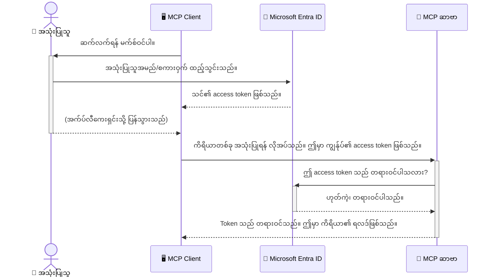

# AI Workflow များကို ဘေးကင်းစေခြင်း: Model Context Protocol ဆာဗာများအတွက် Entra ID Authentication

> [!NOTE]
> ဒီသင်ခန်းစာအတွင်းရှိ အဝေးဆာဗာကုဒ်သည် စဉ်ဆက်မပြတ် `/sse` နှင့် `/message` ပေါက်များကို ကာကွယ်ပေးပြီး MCP `2025-11-25` ကို ရည်ညွှန်းထားသည်။ ၎င်း၏ အသိအမှတ်ပြုခြင်းနှင့် token-အတည်ပြုမှုဆိုင်ရာ လေ့ကျင့်မှုများကို ထိန်းသိမ်းထားပေမယ့် အသစ်တီထွင်ချက်များအတွက် `2026-07-28` ကို ကိုက်ညီသော Streamable HTTP သယ်ဆောင်မှုကို အသုံးပြုပါ။


## မိတ်ဆက်
သင့် Model Context Protocol (MCP) ဆာဗာကို ဘေးကင်းစေရန် သင့်အိမ်၏ရှေ့ တွန်းပေါက်ကိုသောကာမှ ပိုလုံခြုံသည်။ MCP ဆာဗာကို ဖွင့်လှစ်ထားခြင်းက တရား မဝင်သောလက်လှမ်းမီမှုအတွက် သင့်ကိရိယာများနှင့် ဒေတာများကို ထိခိုက်နိုင်သည်၊ ဒါကြောင့် လုံခြုံရေး ဖောက်ထွင်းမှုများ ဖြစ်ပေါ်နိုင်သည်။ Microsoft Entra ID သည် မည်သူမှတင်သတ်မှတ်ထားသောအသုံးပြုသူများနှင့် အပလီကေးရှင်းများသာ MCP ဆာဗာနှင့် အပြန်အလှန်ဆက်သွယ်နိုင်ရန် အတည်ပြုမှုနှင့် လက်လှမ်းမီမှု စီမံခန့်ခွဲမှုကို ခိုင်မာစွာ ပံ့ပိုးပေးသော cloud-based လုံခြုံရေး ဖြေရှင်းချက်ဖြစ်သည်။ ဒီအပိုင်းမှာ သင်သည် Entra ID authentication ကို အသုံးပြု၍ ရှေ့နေ AI workflow များကို ဘယ်လိုကာကွယ်ရမည်ကို လေ့လာပါမည်။

## သင်ယူရမည့် ရည်မှန်းချက်များ
ဒီအပိုင်း၏ အဆုံးတွင် သင်မှာ အောက်ပါအချက်များကို နားလည်ကျွမ်းကျင်နိုင်ပါမည်။

- MCP ဆာဗာများအား ဘေးကင်းစေခြင်း၏ အရေးကြီးမှုကို နားလည်ရန်။
- Microsoft Entra ID နှင့် OAuth 2.0 authentication ၏အခြေခံအချက်များကို ရှင်းပြနိုင်ရန်။
- အများပြည်သူနှင့် လျှို့ဝှက်ဖောက်သည် client များ၏ ကွဲပြားချက်ကို သေချာ သိရှိရန်။
- Entra ID authentication ကို ဒေသတွင်း (public client) နှင့် အဝေး (confidential client) MCP ဆာဗာ အခြေအနေများတွင် အကောင်အထည်ဖော်နိုင်ရန်။
- AI workflows ဆင့်တွဲ လုံခြုံရေးသတ်မှတ်ချက်များကို အကောင်အထည်ဖော်ရာတွင် အသုံးချနိုင်ရန်။

## လုံခြုံရေးနှင့် MCP

သင့်အိမ်၏ရှေ့ တံခါးကို ဖွင့်ထားမထားသလို MCP ဆာဗာကိုလည်း မည်သူ့ကိုမဆို ဝင်ရောက်အသုံးပြုခွင့် မပြုသင့်ပါ။ AI workflows များသည် ခိုင်မာ၊ ယုံကြည်စိတ်ချရပြီး ဘေးကင်းလုံခြုံသော အက်ပလီကေးရှင်းများ ဖန်တီးရန် အရေးကြီးသည်။ ဒီအခန်းမှာ သင့် MCP ဆာဗာများကို Microsoft Entra ID အသုံးပြုကာ ဘေးကင်းရှိစေရန် မိတ်ဆက်ပေးပါမည်၊ အသုံးပြုခွင့်ရရှိထားသူ အသုံးပြုသူများနှင့် အပလီကေးရှင်းများသာ သင့်ကိရိယာများနှင့် ဒေတာများကို အသုံးပြုနိုင်မည်ကို သေချာစေပါသည်။

## MCP ဆာဗာများအတွက် လုံခြုံရေး၏ အရေးကြီးချက်

သင့် MCP ဆာဗာတွင် အီးမေလ်ပို့ခြင်း သို့မဟုတ် ဖောက်သည်ဒေတာဘေ့စ် အသုံးပြုနိုင်သော ကိရိယာတစ်ခုရှိကြောင်း တွေးပါ။ လုံခြုံမထားသော ဆာဗာဆိုသည်မှာ မည်သူမဆို အဲဒီကိရိယာကို အသုံးပြုနိုင်ခြင်းဖြစ်ပြီး ဒေတာမမှန် ရယူခြင်း၊ စပါမ်ပို့ခြင်း သို့မဟုတ် ထူးဆန်းဆိုးဆိုးနည်းလမ်းများ ဖြစ်နိုင်သည်။

Authentication များကို အသုံးပြုခြင်းဖြင့် သင်သည် ဆာဗာသို့ လာသော အပေ့်တောင်းဆိုမှုတိုင်းကို စစ်ဆေးနိုင်ပြီး အသုံးပြုသူ သို့မဟုတ် အပလီကေးရှင်း၏ အသိအမှတ်ပြုမှုကို သေချာစေသည်။ ၎င်းသည် သင့် AI workflows များကို ဘေးကင်းစေရာ လုံခြုံရေးဆိုင်ရာ ရှေ့ဆုံးနှင့် အရေးကြီးဆုံး အဆင့်ဖြစ်သည်။

## Microsoft Entra ID မိတ်ဆက်

[**Microsoft Entra ID**](https://adoption.microsoft.com/microsoft-security/entra/) သည် cloud-based မှတ်ပုံတင်မှုနှင့် လက်လှမ်းမီမှု စီမံခန့်ခွဲမှု ဝန်ဆောင်မှုတစ်ခု ဖြစ်သည်။ သင့်အပလီကေးရှင်းများအတွက် ကမ္ဘာလုံးဆိုင်ရာ လုံခြုံရေးဆိုင်ရာ အရာရှိတစ်ဦး အဖြစ် စဉ်းစားကြည့်ပါ။ ၎င်းသည် အသုံးပြုသူများ၏ အသိအမှတ်ပြုမှု (authentication) နှင့် ၎င်းတို့ဆောင်ရွက်ခွင့် (authorization) ကို စီမံခန့်ခွဲခြင်းဖြင့် ပိုမိုလွယ်ကူစေသည်။

Entra ID အသုံးပြုခြင်းအားဖြင့် သင်စွမ်းနိုင်သည် -

- အသုံးပြုသူများအတွက် လုံခြုံစိတ်ချရသော စာရင်းဝင်ခြင်းကို ချမှတ်နိုင်သည်။
- API များနှင့် ဝန်ဆောင်မှုများကို ကာကွယ်နိုင်သည်။
- ကွပ်ကဲရာနေရာမှ လက်လှမ်းမီမှု မူဝါဒများ ကို စီမံခန့်ခွဲနိုင်သည်။

MCP ဆာဗာများအတွက် Entra ID သည် မည်သူကသင့်ဆာဗာ အင်အားများကို အသုံးပြုခွင့် ရရှိမည်ကို စီမံခန့်ခွဲရန် ခိုင်မာကာယကံရှင်ဖြစ်သော နည်းလမ်းဖြစ်သည်။

---

## ကံရှင်သဘောတရားနားလည်ခြင်း: Entra ID Authentication မည်သို့ လုပ်ဆောင်သည်

Entra ID သည် **OAuth 2.0** ကဲ့သို့သော open standards များကို အသုံးပြုကာ Authentication ကို စီမံခန့်ခွဲသည်။ အသေးစိတ်မှာ ရှုပ်ထွေးနိုင်ပေမယ့် အခြေခံအယူအဆက များသောအားဖြင့် ရိုးရှင်းပြီး သဘောတရားတစ်ခုဖြင့် နားလည်နိုင်သည်။

### OAuth 2.0 မိတ်ဆက်သင်ခန်းစာ: Valet Key

OAuth 2.0 ကို သင့်ကားအတွက် valet ဝန်ဆောင်မှုတစ်ခုလို ထင်ပါစေ။ သင်ရောက်သောစားသောက်ဆိုင်မှာ သင့်အတွက် master key ကို မပေးပို့ဘဲ ဘယ်လိုလုပ်မလဲဆိုတာပါ။ ထိုနေရာတွင် **valet key** ကိုပဲ ပေးပါမည်၊ ၎င်းမှာ မှန်သည့်ခွင့်အကန့်အသတ်ရှိသည်။ ကားစတင်နိုင်စေပြီး တံခါးများကို ပိတ်နိုင်ပေမယ့် ကားခလုတ်ရိုး သို့မဟုတ် လက်အိတ်တွင်းကို မဖွင့်နိုင်ပါ။

ဒီ analogy တစ်ခုတွင်:

- **သင်သည်** **အသုံးပြုသူ (User)** ဖြစ်သည်။
- **သင့်ကားသည်** **ကျန် MCP ဆာဗာ** ဖြစ်ပြီး အရေးကြီးကိရိယာများနှင့် ဒေတာများ ပါရှိသည်။
- **Valet** သည် **Microsoft Entra ID** ဖြစ်သည်။
- **ကားမှတ်တိုင်းသူ** သည် **MCP Client** (ဆာဗာနှင့် ဆက်သွယ်ကာ အသုံးပြုမည့် အပလီကေးရှင်း) ဖြစ်သည်။
- **Valet key** သည် **Access Token** ဖြစ်သည်။

access token သည် သင် ဝင်ရောက်သည့်အခါ Entra ID မှ MCP client က လက်ခံရရှိသော လုံခြုံသော စာသားတန်းတစ်ခုဖြစ်သည်။ client သည် ဒီ token ကို MCP ဆာဗာအား တောင်းဆိုမှုတိုင်းတွင် တင်ပြသည်။ ဆာဗာသည် ဤ token ကို စစ်ဆေးကာ တောင်းဆိုမှုမှန်ကန်ကြောင်းနှင့် client တွင် လိုအပ်သော ခွင့်ပြုချက်ရှိကြောင်း သေချာစေပြီး မိမိ၏ လျှို့ဝှက်စာသား (လျှို့ဝှက်နံပါတ်ကဲ့သို့) ကို ကိုင်တွယ်စရာမလိုပဲ လုပ်ဆောင်နိုင်သည်။

### Authentication ခရီးစဉ်

ဒီလုပ်ငန်းစဉ်သည် လက်တွေ့မှာ အောက်ပါအတိုင်း ဖြစ်သည် -



### Microsoft Authentication Library (MSAL) မိတ်ဆက်ခြင်း

ကုဒ်ကို ဦးစွာ ကြည့်မချက်မည့် မည်သည့်အခြေအနေမျိုးတွင်ပင် သင်မြင်ရမည့် အဓိကအစိတ်အပိုင်းတစ်ခုမှာ **Microsoft Authentication Library (MSAL)** ဖြစ်သည်။

MSAL သည် Microsoft က ဖန်တီးထားသော library တစ်ခုဖြစ်ပြီး authentication ကို လက်ဖြင့် hand ကုဒ်ရေးသားခြင်း မလိုဘဲ စွမ်းဆောင်စေသည်။ လုံခြုံရေး token များကို စီမံခန့်ခွဲခြင်း၊ စာရင်းဝင်ခြင်းစနစ်ကို စီမံခြင်းနှင့် session များကို ပြန်လည်အသစ်ဖန်တီးခြင်းများကို MSAL မှ ကြီးမားသော တာဝန်ကို ကိုင်တွယ်ပေးသည်။

MSAL ကို အသုံးပြုရန် အကြံပြုလျက်ရှိသောအကြောင်းရင်းများမှာ -

- **လုံခြုံသည်:** စက်မှုအဆင့် protocols များနှင့် လုံခြုံရေးအကောင်းဆုံးလေ့ကျင့်မှုများကို အကောင်အထည်ဖော်ထားခြင်းဖြစ်ပြီး ကုဒ်တွင် ချို့ယွင်းမှုများ ဖြစ်ပေါ်မှုစိုးရိမ်မှုကို လျော့ချပေးသည်။
- **ဖွံ့ဖြိုးတိုးတက်မှု လွယ်ကူစေသည်:** OAuth 2.0 နှင့် OpenID Connect protocols ၏ ရှုပ်ထွေးမှုကို ဖုံးကွယ်ပေးကာ အသုံးပြုသူ applications တွင် အားကောင်းသော authentication ကို နည်းနည်းကုဒ်ဖြင့် ပေါင်းထည့်နိုင်သည်။
- **ထိန်းသိမ်းမည့် လုပ်ထုံးလုပ်နည်းရှိသည်:** Microsoft မှ MSAL ကို ဆက်လက်ထိန်းသိမ်းကာ လုံခြုံရေး ခြိမ်းခြောက်မှုအသစ်များနှင့် ပလက်ဖောင်းပြောင်းလဲမှုများကို ဖြေရှင်းပေးသည်။

MSAL သည် .NET, JavaScript/TypeScript, Python, Java, Go နှင့် iOS နှင့် Android ကဲ့သို့သော မိုဘိုင်းပလက်ဖောင်းများ အပါအဝင် ဘာသာစကားများနှင့် application frameworks များစွာကို ဆက်လက်ထောက်ပံ့ပေးသည်။ ဒါကြောင့် တင့်တယ်ညီညွတ်သော authentication ပုံစံကို သင်၏ နည်းပညာစနစ်တစ်လျှောက်လုံး အသုံးပြုနိုင်ပါသည်။

MSAL အကြောင်း ပိုမိုသိရှိလိုပါက တရားဝင် [MSAL မှတ်စုအနှစ်ချုပ် စာရွက်စာတမ်း](https://learn.microsoft.com/entra/identity-platform/msal-overview) ကို ကြည့်ရှုနိုင်ပါသည်။

---

## Entra ID ဖြင့် သင့် MCP ဆာဗာကို ဘေးကင်းစေရန် လမ်းညွှန်ချက်အဆင့်လိုက်

ယခုအခါ Entra ID ကို သုံးပြီး ဒေသတွင်း MCP ဆာဗာ (stdio မှတဆင့် ဆက်သွယ်သော) ကို ဘယ်လိုဘေးကင်းစေမည်နည်းဆိုတာ လမ်းလျှောက်ကြရအောင်။ ဤဥပမာတွင် အသုံးပြုသူ၏ စက်ပေါ်တွင် ဆော့ဝဲလ်များသို့မဟုတ် ဒေသတွင်းဖွံ့ဖြိုးရေးဆာဗာများ နှင့် သင့်လျော်သော **public client** ကို အသုံးပြုထားသည်။

### ကိစ္စစဥ် ၁: ဒေသတွင်း MCP ဆာဗာ (public client ဖြင့်) ကို ဘေးကင်းစေရန်

ဤကိစ္စစဥ်တွင် MCP ဆာဗာတစ်ခုကို ဒေသတွင်းမှာ run လုပ်ကာ `stdio` ဖြင့် ဆက်သွယ်ပြီး အသုံးပြုသူကို ယုံစိတ်စနစ်ဖြင့် စစ်ဆေးပြီးမှ သင့်စက်ကိရိယာများကို အသုံးပြုခွင့်ပြုသည်။ ဆာဗာတွင် အသုံးပြုသူ၏ Microsoft Graph API မှ အချက်အလက်ကို ယူရန် ကိရိယာတစ်ခုသာ ပါရှိမည်။

#### ၁။ Entra ID တွင် application ကို စတင်မှတ်ပုံတင်ခြင်း

ကုဒ်ရေးသားခြင်းမပြုမီ သင့် application ကို Microsoft Entra ID တွင် မှတ်ပုံတင်ရန် လိုအပ်သည်။ ၎င်းသည် Entra ID ကို သင်၏ အပလီကေးရှင်းအကြောင်း သိရှိစေပြီး authentication ဝန်ဆောင်မှု အသုံးပြုခွင့် ပေးသည်။

၁။ **[Microsoft Entra portal](https://entra.microsoft.com/)** သို့ သွားပါ။
၂။ **App registrations** ကို သွားပါ၊ နှင့် **New registration** ကို နှိပ်ပါ။

၃။ သင့်လျှောက်လွှာကို နာမည်တစ်ခုပေးပါ (ဥပမာ "ကျွန်ုပ်၏ဒေသခံ MCP ဆာဗာ")။
၄။ **ထောက်ခံထားသောအကောင့်အမျိုးအစား** အတွက် **ဤအဖွဲ့အစည်း ဒိုင်ရေးထရီ၌သာ ရှိသောအကောင့်များ** ကို ရွေးချယ်ပါ။
၅။ ဤဥပမာအတွက် **အနောက်ပြန်လမ်းညွှန် URI** ကို ဖျတ်လပ်ထားနိုင်သည်။
၆။ **မှတ်ပုံတင်မည်** ကိုနှိပ်ပါ။

မှတ်ပုံတင်ပြီးပါက **လျှောက်လွှာ (ဖောက်သည်) အိုင်ဒီ** နှင့် **ဒိုင်ရေးထရီ (tenant) အိုင်ဒီ** ကို မှတ်သားထားပါ။ ၎င်းတို့ကို သင့်ကုဒ်တွင် လိုအပ်မည်။

#### ၂။ ကုတ်ကို ဖော်ပြချက်

အတိုင်းအတာအသေအချာ အထောက်အထားလိမ့်မည့် ကုတ်၏ အရေးပါတဲ့ အစိတ်အပိုင်းများကို ကြည့်ရအောင်။ ဤဥပမာအတွက် ပြည့်စုံသော ကုတ်ကို [Entra ID - Local - WAM](https://github.com/Azure-Samples/mcp-auth-servers/tree/main/src/entra-id-local-wam) ဖိုလ်ဒါ ထဲတွင် [mcp-auth-servers GitHub ရိုက်ပင်](https://github.com/Azure-Samples/mcp-auth-servers) တွင် ရနိုင်သည်။

**`AuthenticationService.cs`**

ဤသင်္ကေတသည် Entra ID နှင့် အပြန်အလှန် ဆက်သွယ်မှုကို ကိုင်တွယ်သည်။

- **`CreateAsync`**: ဒီ မက်သော့ချက်သည် MSAL (Microsoft Authentication Library) မှ `PublicClientApplication` ကို စတင်ဖန်တီးသည်။ ၎င်းသည် သင့်လျှောက်လွှာ၏ `clientId` နှင့် `tenantId` ဖြင့် အတည်ပြုထားသည်။
- **`WithBroker`**: ဒါဟာ broker တစ်ခု (Windows Web Account Manager ကဲ့သို့) ကို အသုံးပြုနိုင်ရန် ခွင့်ပြုသည်၊ အဲဒါက အာမခံမှုနဲ့ တစ်ခါသုံး လက်မှတ်အတည်ပြုခြင်းကို ပိုမိုလုံခြုံပြီး ပြတ်သားစေသည်။
- **`AcquireTokenAsync`**: ဒါက အဓိက မက်သော့ချက်ပါ။ ပထမဦးဆုံး တိတ္တဆတ် စနစ်ဖြင့် တိုးတက်မှု ရရှိနိုင်မည့် လက်မှတ် (token) ရှာဖွေမည် (သုံးစွဲသူကအကောင့်ရဲ့ အခြေအနေကျရွေးရှာပြီးပါက ထပ်တ login လုပ်စရာမလိုအပ်ပါ)။ တိတ္တဆတ် token ရရှိနိုင်မလာလျှင် သုံးစွဲသူကို လက်တွေ့ sign-in လုပ်ဖို့ တောင်းဆိုမည်။

```csharp
// Simplified for clarity
public static async Task<AuthenticationService> CreateAsync(ILogger<AuthenticationService> logger)
{
    var msalClient = PublicClientApplicationBuilder
        .Create(_clientId) // Your Application (client) ID
        .WithAuthority(AadAuthorityAudience.AzureAdMyOrg)
        .WithTenantId(_tenantId) // Your Directory (tenant) ID
        .WithBroker(new BrokerOptions(BrokerOptions.OperatingSystems.Windows))
        .Build();

    // ... cache registration ...

    return new AuthenticationService(logger, msalClient);
}

public async Task<string> AcquireTokenAsync()
{
    try
    {
        // Try silent authentication first
        var accounts = await _msalClient.GetAccountsAsync();
        var account = accounts.FirstOrDefault();

        AuthenticationResult? result = null;

        if (account != null)
        {
            result = await _msalClient.AcquireTokenSilent(_scopes, account).ExecuteAsync();
        }
        else
        {
            // If no account, or silent fails, go interactive
            result = await _msalClient.AcquireTokenInteractive(_scopes).ExecuteAsync();
        }

        return result.AccessToken;
    }
    catch (Exception ex)
    {
        _logger.LogError(ex, "An error occurred while acquiring the token.");
        throw; // Optionally rethrow the exception for higher-level handling
    }
}
```

**`Program.cs`**

ဒီမှာ MCP ဆာဗာထူထောင်ခြင်းနှင့် authentication service အက်စေ့အင်တိတ်လုပ်ခြင်း ဖြစ်ပေါ်သည်။

- **`AddSingleton<AuthenticationService>`**: ၎င်းသည် `AuthenticationService` ကို dependency injection ကွန်တိန်းနာတွင် မှတ်ပုံတင်ခြင်းဖြစ်ပြီး လျှောက်လွှာ၏ အခြားပိတ်ပဲများက အသုံးပြုနိုင်စေသည်။
- **`GetUserDetailsFromGraph` ကိရိယာ**: ၎င်းကိရိယာသည် `AuthenticationService` အစိတ်အပိုင်းတစ်ခု လိုအပ်သည်။ အစောပိုင်း၌ `authService.AcquireTokenAsync()` ကို သုံးပြီး သက်ဆိုင်ရာ လက်မှတ်ရ (access token) ရရှိစေရန် ကြိုးပမ်းသည်။ အောင်မြင်လျှင် Microsoft Graph API ကို ဖုန်းခေါ်၍ သုံးစွဲသူ၏ အသေးစိတ်အချက်အလက်များ ပြန်လည် ရယူသည်။

```csharp
// Simplified for clarity
[McpServerTool(Name = "GetUserDetailsFromGraph")]
public static async Task<string> GetUserDetailsFromGraph(
    AuthenticationService authService)
{
    try
    {
        // This will trigger the authentication flow
        var accessToken = await authService.AcquireTokenAsync();

        // Use the token to create a GraphServiceClient
        var graphClient = new GraphServiceClient(
            new BaseBearerTokenAuthenticationProvider(new TokenProvider(authService)));

        var user = await graphClient.Me.GetAsync();

        return System.Text.Json.JsonSerializer.Serialize(user);
    }
    catch (Exception ex)
    {
        return $"Error: {ex.Message}";
    }
}
```

#### ၃။ အားလုံးပေါင်းပြီး ဘယ်လိုအလုပ်လုပ်သည်

၁။ MCP client က `GetUserDetailsFromGraph` ကိရိယာကို အသုံးပြုကြိုးစားသည်။
၂။ ရိုက်ကွက်ကိုသုံးပြီး `AcquireTokenAsync` ကိုခေါ်သည်။
၃။ တက်ရောက်ထားသော token မရှိလျှင် MSAL သည် broker ဖြင့် သုံးစွဲသူကို Entra ID အကောင့် ဖြင့် အကောင့်ဝင်ရန် တောင်းဆိုမည်။
၄။ သုံးစွဲသူအကောင့်ဝင်ပြီးပါက Entra ID က အက်ဆက်လက်မှတ်(token) ထုတ်ပေးသည်။
၅။ ကိရိယာသည် token ကို လက်ခံပြီး Microsoft Graph API ကို လုံခြုံစိတ်ချစွာ ဖုန်းခေါ်သည်။
၆။ သုံးစွဲသူ၏ အသေးစိတ်အချက်အလက်များ MCP client သို့ ပြန်သော့ပါသည်။

ဤဖြစ်စဉ်သည် အထောက်အထားရှိသည့် သုံးစွဲသူများသာ ကိရိယာကို အသုံးပြုခွင့်ရရှိစေရန် အာမခံပေးပြီး ဒေသခံ MCP ဆာဗာကို လုံခြုံစေသည်။

### ရှေ့နောက် ၂: ဝေးလံသော MCP ဆာဗာ လုံခြုံရေး (လျှို့ဝှက်ဖောက်သည်(Client) ဖြင့်)

MCP ဆာဗာကို ဝေးဝှမ်းသော မာရှင် (ကလောင့်ဆာဗာကဲ့သို့) မှာ HTTP Streaming ကဲ့သို့သော ပရိုတိုကော ဖြင့် ဆက်သွယ်သည့်အခါ လုံခြုံရေးလိုအပ်ချက်များက ခြားနားသည်။ ဤအခြေအနေတွင် **လျှို့ဝှက်ဖောက်သည်** နှင့် **Authorization Code Flow** ကို အသုံးပြုသင့်သည်။ ၎င်းသည် နောက်ခံတွင် လျှို့ဝှက်ချက်များကို ဘရောင်ဇာမှာ မဖော်ပြဘဲ လုံခြုံစေသော နည်းလမ်းဖြစ်သည်။

ဤဥပမာသည် Express.js ဖြင့် HTTP တောင်းဆိုမှုများကို ကိုင်တွယ်သည့် TypeScript အခြေပြု MCP ဆာဗာ ဖြစ်သည်။

#### ၁။ Entra ID တွင် လျှောက်လွှာတည်ဆောက်ခြင်း

Entra ID တွင် ထားရှိမှုများသည် public client အတွက်အတိုင်းဖြစ်သော်လည်း အဓိကကွာခြားချက်တစ်ခုရှိသည်။ ၎င်းမှာ **client secret** တစ်ခု ဖန်တီးရမည် ဖြစ်သည်။

၁။ **[Microsoft Entra portal](https://entra.microsoft.com/)** သို့ သွားပါ။
၂။ သင့်အက်ပ်မှတ်ပုံတင်မှုတွင် **Certificates & secrets** ပြတင်းပေါက်သို့ သွားပါ။
၃။ **New client secret** ကိုနှိပ်ပြီး ဖော်ပြချက်ရေးထည့်၊ **Add** ကိုနှိပ်ပါ။
၄။ **အရေးကြီးချက်:** လျှို့ဝှက်တန်ဖိုးကို ချက်ချင်း မိတ္တူယူပါ။ ထပ်မမြင်ရတော့ပါ။
၅။ အနောက်ပြန်လမ်းညွှန် URI ကိုလည်း ဖန်တီးရမည်။ **Authentication** လွှမ်းမိုးချက်သို့ သွား၍ **Add a platform** ကိုနှိပ်ပြီး **Web** ကို ရွေးချယ်ပါ။ သင့်လျှောက်လွှာအတွက် redirect URI (ဥပမာ `http://localhost:3001/auth/callback`) ကို ထည့်သွင်းပါ။

> **⚠️ အရေးပါသော လုံခြုံရေး မှတ်ချက်:** ထုတ်လုပ်မှုပိုင်း အက်ပ်များအတွက် Microsoft သည် client secret မဟုတ်သော **secretless authentication** နည်းလမ်းများ၊ ဥပမာ **Managed Identity** သို့မဟုတ် **Workload Identity Federation** ကို အကြံပြုသည်။ client secret များသည် လုံခြုံရေး အန္တရာယ်ရှိပြီး ဖော်ပြသော်လည်း ပျက်စီးနိုင်သည်။ Managed identity များသည် သင့်ကုဒ် သို့မဟုတ် ပြင်ဆင်မှုတွင် credential မသိမ်းဆည်းဘဲ ပိုမိုလုံခြုံသောနည်းလမ်းဖြစ်သည်။
>
> Managed identities နှင့် ၎င်းတို့၏ အသုံးပြုပုံများအကြောင်းပိုမိုသိရှိလိုပါက [Managed identities for Azure resources overview](https://learn.microsoft.com/entra/identity/managed-identities-azure-resources/overview) ကို ကြည့်ရှုပါ။

#### ၂။ ကုတ်ကို ဖော်ပြချက်

ဤဥပမာသည် အစည်းအဝေး အခြေပြုနည်းလမ်းကို သုံးသည်။ သုံးစွဲသူ အထောက်အထားခံရသည်အခါ ဆာဗာတွင် access token နှင့် refresh token ကို session တွင် သိမ်းဆည်းပြီး သုံးစွဲသူထံ session token သိုလှောင်ပေးသည်။ ထို session token ကို အောက်မေ့ တောင်းဆိုမှုများတွင် အသုံးပြုသည်။ ပြည့်စုံသော ကုတ်ကို [Entra ID - Confidential client](https://github.com/Azure-Samples/mcp-auth-servers/tree/main/src/entra-id-cca-session) ဖိုလ်ဒါ တွင် [mcp-auth-servers GitHub ရိုက်ပင်](https://github.com/Azure-Samples/mcp-auth-servers) တွင် ရနိုင်သည်။

**`Server.ts`**

ဤဖိုင်သည် Express ဆာဗာနှင့် MCP ပို့ဆောင်မှု အလွှာကို တည်ဆောက်သည်။

- **`requireBearerAuth`**: ၎င်းသည် `/sse` နှင့် `/message` အံ့သဏ္ဍာန်များကို ကာကွယ်သည့် middleware ဖြစ်သည်။ တောင်းဆိုချက် `Authorization` ခေါင်းစဉ်တွင် လက်မှတ် bearer တန်ဖိုးရှိမရှိ စစ်ဆေးသည်။
- **`EntraIdServerAuthProvider`**: ၎င်းသည် `McpServerAuthorizationProvider` အင်တာဖေ့စ်ကို အကောင်အထည်ဖော်သည့် custom class ဖြစ်ပြီး OAuth 2.0 အဆင့်များကို ကိုင်တွယ်ပေးသည်။
- **`/auth/callback`**: ဤ endpoint သည် သုံးစွဲသူ အတည်ပြုပြီးနောက် Entra ID မှ redirect လာသည့် လမ်းကြောင်းကို ကိုင်တွယ်သည်။ authorization code ကို access token နှင့် refresh token ပြောင်းလဲပေးသည်။

```typescript
// ရိုးရှင်းစွာ ပြသရန်
const app = express();
const { server } = createServer();
const provider = new EntraIdServerAuthProvider();

// SSE အဆုံးပိုင်းကို ကာကွယ်ပါ
app.get("/sse", requireBearerAuth({
  provider,
  requiredScopes: ["User.Read"]
}), async (req, res) => {
  // ... သယ်ယူပို့ဆောင်မှုသို့ ချိတ်ဆက်ပါ ...
});

// စာတိုက်အဆုံးပိုင်းကို ကာကွယ်ပါ
app.post("/message", requireBearerAuth({
  provider,
  requiredScopes: ["User.Read"]
}), async (req, res) => {
  // ... စာတိုက်ကို ကိုင်တွယ်ပါ ...
});

// OAuth 2.0 ပြန်လည်ခေါ်ဆိုမှုကို ကိုင်တွယ်ပါ
app.get("/auth/callback", (req, res) => {
  provider.handleCallback(req.query.code, req.query.state)
    .then(result => {
      // ... အောင်မြင်မှု သို့မဟုတ် မအောင်မြင်မှုကို ကိုင်တွယ်ပါ ...
    });
});
```

**`Tools.ts`**

ဤဖိုင်သည် MCP ဆာဗာ  ပံ့ပိုးသည့် ကိရိယာများကို သတ်မှတ်ထားသည်။ `getUserDetails` ကိရိယာသည် ယခင်ဥပမာကဲ့သို့ပင်ဖြစ်သော်လည်း access token ကို session မှ ရယူသည်။

```typescript
// ရိုးရှင်းစွာ ဖော်ပြထားသည်
server.setRequestHandler(CallToolRequestSchema, async (request) => {
  const { name } = request.params;
  const context = request.params?.context as { token?: string } | undefined;
  const sessionToken = context?.token;

  if (name === ToolName.GET_USER_DETAILS) {
    if (!sessionToken) {
      throw new AuthenticationError("Authentication token is missing or invalid. Ensure the token is provided in the request context.");
    }

    // session store မှ Entra ID token ကို ရယူပါ
    const tokenData = tokenStore.getToken(sessionToken);
    const entraIdToken = tokenData.accessToken;

    const graphClient = Client.init({
      authProvider: (done) => {
        done(null, entraIdToken);
      }
    });

    const user = await graphClient.api('/me').get();

    // ... အသုံးပြုသူအသေးစိတ်များကို ပြန်ပေးပါ ...
  }
});
```

**`auth/EntraIdServerAuthProvider.ts`**

ဤသင်္ကေတသည် အောက်ပါ လုပ်ဆောင်ချက်များကို ကိုင်တွယ်သည်-

- သုံးစွဲသူကို Entra ID အကောင့် ဝင်ရန် စာမျက်နှာသို့ တောင်းဆိုခြင်း။
- authorization code ကို access token သို့ ပြောင်းလဲပေးခြင်း။
- `tokenStore` တွင် token များ သိမ်းဆည်းခြင်း။

- ဝင်ခွင့်လက်မှတ် သက်တမ်းကုန်ဆုံးသောအခါ ထပ်မံအသစ်ရယူခြင်း။


#### 3. စုစည်းလုံးဝနည်းလမ်းများ

1. အသုံးပြုသူတစ်ဦး MCP ဆာဗာနှင့် ဆက်သွယ်ရန် ကြိုးစားသောအခါ `requireBearerAuth` middleware သည် သူတို့အတွက် တရားဝင်အတည်ပြုမှုမရှိကြောင်း တွေ့ရှိကာ Entra ID စာရင်း၀င်စာမျက်နှာသို့ ပြန်လည်ပို့ဆောင်သည်။
2. အသုံးပြုသူသည် သူ၏ Entra ID အကောင့်ဖြင့် စာရင်း၀င်သည်။
3. Entra ID သည် အသုံးပြုသူအား `/auth/callback` endpoint သို့ authorization code ဖြင့် ပြန်လည် လမ်းညွှန်သည်။
4. ဆာဗာသည် အဆိုပါ code ကို access token နှင့် refresh token အဖြစ် လဲလှယ်၍ သိမ်းဆည်းကာ session token တစ်ခု ဖန်တီးပြီး client သို့ ပို့ပေးသည်။
5. Client သည် ယခု session token ကို MCP ဆာဗာသို့ မည်သည့် နောက်ထပ်ဖိတ်ခေါ်မှုများတွင်မဆို `Authorization` header တွင် အသုံးပြုနိုင်သည်။
6. `getUserDetails` ကိရိယာကို ခေါ်သည့်အခါ၊ session token ကို အသုံးပြုကာ Entra ID access token ကို ရှာဖွေပြီး ထို token ဖြင့် Microsoft Graph API ကို ခေါ်ဆိုသည်။

ဤ သဘောတရားသည် public client ရဲ့ လမ်းကြောင်းထက် ပို၍ ရိုးရှင်းမှု နည်းပါသည်၊ သို့သော် အင်တာနက်ရှေ့သို့ ကြည့်ရှုမည့် endpoints များအတွက် လိုအပ်ပါသည်။ remote MCP ဆာဗာများသည် ပြည်သူ့အင်တာနက်မှ ဝင်ရောက်နိုင်သောကြောင့် ခွင့်မရှိသူ ဝင်ရောက်မှုနှင့် တိုက်ခိုက်မှုများကို ကာကွယ်ရန် ကြပ်မတ်စိုးရိမ်မှုအား ပိုမိုလိုအပ်လိမ့်မည်။


## လုံခြုံရေး အကောင်းဆုံး လုပ်ထုံးလုပ်နည်းများ

- **အမြဲ HTTPS ကို အသုံးပြုပါ**: Client နှင့် ဆာဗာ အကြား ဆက်သွယ်မှုကို အင်္ဂါရပ်စနစ်အတိုင်း ကာကွယ်ရန်။
- **Role-Based Access Control (RBAC) ကို အကောင်အထည်ဖော်ပါ**: အသုံးပြုသူ အတည်ပြုသည်ကိုသာ မစစ်ဆေးဘဲ၊ သူတို့ ဘာလုပ်နိုင်သည်ကို စစ်ဆေးပါ။ Entra ID တွင် role များကို သတ်မှတ်၍ MCP ဆာဗာတွင် စစ်ဆေးနိုင်သည်။
- **စောင့်ကြည့်ခြင်းနှင့် လုပ်ဆောင်ပုံ စစ်ဆေးခြင်း**: အတည်ပြုမှု ဖြစ်စဉ်များအားလုံး ကိုလော့ဂ်ထာင်းပြီး အထင်ရှားသော လှုပ်ရှားမှုများ ရှာဖွေနိုင်ပါ။
- **ချိန်မှီမှု ကန့်သတ်မှုနှင့် နှိုးဆော်မှု ကို ကိုင်တွယ်ပါ**: Microsoft Graph နှင့် အခြား API များသည် ခွင့်မပြုသော အသုံးပြုမှုကို ကာကွယ်ရန် rate limiting ကို သတ်မှတ်ထားသည်။ Expoential backoff နှင့် retry logic ကို MCP ဆာဗာတွင် ထည့်သွင်းကာ HTTP 429 (Too Many Requests) ကို လူမိုက်မှု လိုက်နာစွာ ကိုင်တွယ်ပါ။ API ခေါ်ဆိုမှုများ လျော့နည်းစေရန် အကြိမ်ကြိမ်အသုံးပြုသော ဒေတာများကို cache အဖြစ် သိမ်းဆည်းပါ။
- **Token များကို လုံခြုံစွာ သိမ်းဆည်းပါ**: Access token နှင့် refresh token များကို လုံခြုံစွာ သိမ်းဆည်းပါ။ ဒေသဆိုင်ရာ လျှောက်လွှာများတွင် စနစ်၏ လုံခြုံမှု စနစ်များကို အသုံးပြုပြီး ဆာဗာလျှောက်လွှာများတွင် ဖန်ဆင်းထားသော encrypted storage သို့မဟုတ် Azure Key Vault ကဲ့သို့သော လုံခြုံသော key management ဝန်ဆောင်မှုများကို စဉ်းစားပါ။
- **Token သက်တမ်းကုန်ဆုံးမှု ကိုင်တွယ်မှု**: Access token များသည် သက်တမ်း ကန့်သတ်ထားသည်။ refresh token များကို အသုံးပြုပြီး token ကို အလိုအလျောက် ပြန်လည်ရယူနည်း ကို အကောင်အထည်ဖော်ကာ အသုံးပြုသူ လေ့လာမှုကို ဆက်လက်ဂရုစိုက်စေပါ။
- **Azure API Management ကို စဉ်းစားပါ**: MCP ဆာဗာတွင် လုံခြုံရေးကိုတိုက်ရိုက် ဆောင်ရွက်ခြင်းက ဆက်လက်ထိန်းချုပ်မှု မြင့်မားပြီး၊ Azure API Management ကဲ့သို့သော API Gateway များသည် authentication၊ authorization, rate limiting နှင့် monitoring တို့ကို အလိုအလျောက် ကိုင်တွယ်နိုင်သည်။ ဤသည်တို့သည် client များနှင့် MCP ဆာဗာတို့ကြားတွင် ဗဟိုပြု လုံခြုံရေး အလွှာ တစ်ခုကို ပေးသည်။ MCP နှင့် API Gateway အသုံးပြုခြင်း အကြောင်း ပိုမိုသိရှိလိုပါက [Azure API Management Your Auth Gateway For MCP Servers](https://techcommunity.microsoft.com/blog/integrationsonazureblog/azure-api-management-your-auth-gateway-for-mcp-servers/4402690) ကို ကြည့်ပါ။


## အဓိက အသိပညာများ

- MCP ဆာဗာများကို လုံခြုံစွာ ကာကွယ်ခြင်းသည် သင့်ဒေတာနှင့် ကိရိယာများအတွက် အရေးကြီးသည်။
- Microsoft Entra ID သည် authentication နှင့် authorization အတွက် ခိုင်မာပြီး တိုးချဲ့နိုင်သော ဖြေရှင်းချက်ကို ကိုယ်စားပြုသည်။
- ဒေသဆိုင်ရာ လျှောက်လွှာများအတွက် **public client** ကို အသုံးပြုပြီး၊ remote ဆာဗာများအတွက် **confidential client** ကို အသုံးပြုပါ။
- **Authorization Code Flow** သည် ဝက်ဘ်လျှောက်လွှာများအတွက် အကောင်းဆုံး လုံခြုံမှု ရွေးချယ်မှု ဖြစ်သည်။


## လေ့ကျင့်ခန်း

1. သင် တည်ဆောက်ချင်သော MCP ဆာဗာကို စဉ်းစားပါ။ ဒေသဆိုင်ရာ ဆာဗာ ဖြစ်ပါသလား၊ remote ဆာဗာ ဖြစ်ပါသလား။
2. သင်၏ ဖြေချက်အရ public client သို့ confidential client ကို အသုံးပြုမည်နည်း။
3. Microsoft Graph နှင့် လုပ်ငန်းဆောင်ရန် MCP ဆာဗာသည် မည်သည့် ခွင့်ပြုချက်ကို ပေးခံရမည်နည်း။


## လက်တွေ့ လေ့ကျင့်ခန်းများ

### လေ့ကျင့်ခန်း 1: Entra ID တွင် လျှောက်လွှာ တင်သွင်းခြင်း
Microsoft Entra portal သို့ သွားပါ။
သင့် MCP ဆာဗာအတွက် လျှောက်လွှာ အသစ် တင်သွင်းပါ။
Application (client) ID နှင့် Directory (tenant) ID ကို မှတ်တမ်းတင်ပါ။

### လေ့ကျင့်ခန်း 2: ဒေသဆိုင်ရာ MCP ဆာဗာ (Public Client) ကို လုံခြုံစေခြင်း
- အသုံးပြုသူ အတည်ပြုမှုအတွက် MSAL (Microsoft Authentication Library) ကို ပေါင်းစပ်ရန် ကုဒ် ဥပမာကို လိုက်နာပါ။
- Microsoft Graph မှ အသုံးပြုသူ အသေးစိတ်ထုတ်ယူမှု MCP ကိရိယာကို ခေါ်၍ အတည်ပြုမှု လမ်းကြောင်းကို စမ်းသပ်ပါ။

### လေ့ကျင့်ခန်း 3: remote MCP ဆာဗာ (Confidential Client) ကို လုံခြုံစေခြင်း
- Entra ID တွင် confidential client တင်သွင်းပြီး client secret တစ်ခု ဖန်တီးပါ။
- Express.js MCP ဆာဗာကို Authorization Code Flow အသုံးပြုရန် ကွန်ဖစ်စတားလုပ်ပါ။
- ကာကွယ်ထားသော endpoints များကို စမ်းသပ်ပြီး token အခြေခံ ဝင်ရောက်ခွင့်ကို အတည်ပြုပါ။

### လေ့ကျင့်ခန်း 4: လုံခြုံရေး အကောင်းဆုံး လုပ်ထုံးလုပ်နည်းများ ကို စေလွှတ်ပါ
- ဒေသဆိုင်ရာ သို့မဟုတ် remote ဆာဗာများအတွက် HTTPS ကို ဖွင့်ပါ။
- ဆာဗာ အတွင်း role-based access control (RBAC) ကို အကောင်အထည်ဖော်ပါ။
- Token သက်တမ်းကုန်ဆုံးမှု ကိုင်တွယ်မှုနှင့် လုံခြုံသော token သိမ်းဆည်းမှုကို ဖြည့်စွက်ပါ။

## ရင်းမြစ်များ

1. **MSAL အနှစ်ချုပ် စာတမ်း**  
   Microsoft Authentication Library (MSAL) က စနစ်များပေါ်တွင် လုံခြုံသော token ရရှိမှု ချဲ့ထွင်ပေးမှုကို စာသင်ကြားပါ။  
   [MSAL Overview on Microsoft Learn](https://learn.microsoft.com/en-gb/entra/msal/overview)

2. **Azure-Samples/mcp-auth-servers GitHub Repository**  
   MCP ဆာဗာများ၏ authentication လမ်းကြောင်းများကို သရုပ်ပြသော ကိုးကားလုပ်ငန်းများ။  
   [Azure-Samples/mcp-auth-servers on GitHub](https://github.com/Azure-Samples/mcp-auth-servers)

3. **Azure အရင်းအမြစ်များအတွက် Managed Identities အနှစ်ချုပ်**  
   စနစ်သတ်မှတ်ထားသည့် Managed Identities ဖြင့် လျှို့ဝှက်ချက်များ မလိုအပ်တော့ပုံကို နားလည်ပါ။  
   [Managed Identities Overview on Microsoft Learn](https://learn.microsoft.com/en-us/entra/identity/managed-identities-azure-resources/)

4. **Azure API Management: MCP ဆာဗာများအတွက် သင့်အတည်ပြု ဝင်ပေါက်**  
   MCPဆာဗာများအတွက် OAuth2 အဖြစ် APIM ကို လုံခြုံစွာ ဝင်ရောက်ခွင့်ပေး Gateway အဖြစ် အသုံးပြုနည်း စူးစမ်းခြင်း။  
   [Azure API Management Your Auth Gateway For MCP Servers](https://techcommunity.microsoft.com/blog/integrationsonazureblog/azure-api-management-your-auth-gateway-for-mcp-servers/4402690)

5. **Microsoft Graph ခွင့်ပြုချက်များ ကိုးကားစာရင်း**  
   Microsoft Graph အတွက် delegated နှင့် application ခွင့်ပြုချက်များ စုံလင်စွာ။  
   [Microsoft Graph Permissions Reference](https://learn.microsoft.com/zh-tw/graph/permissions-reference)


## သင်ယူနိုင်မည့် အကျိုးရလဒ်များ
ဤ အပိုင်းပြီးဆုံးပါက သင်သည် ပြုလုပ်နိုင်မည်ဖြစ်သည်။

- MCP ဆာဗာများ နှင့် AI လုပ်ငန်းစဉ်များအတွက် အတည်ပြုမှုသည် ဘာကြောင့် အရေးကြီးသည်ကို ဖေါ်ပြနိုင်သည်။
- ဒေသဆိုင်ရာ နှင့် remote MCP ဆာဗာ အခြေအနေများအတွက် Entra ID အတည်ပြုမှုကို သတ်မှတ်ပြီး ပြင်ဆင်နိုင်သည်။
- သင်၏ ဆာဗာ တည်ဆောက်မှုအခြေအနေ မူတည်၍ သင့်တော်သော client အမျိုးအစား (public သို့ confidential) ကို ရွေးချယ်နိုင်သည်။
- လုံခြုံသော ကုဒ်ရေးနည်းများ အပါအဝင် token သိမ်းဆည်းမှုနှင့် role-based authorization ကို အကောင်အထည်ဖော်နိုင်သည်။
- ခွင့်မပြုထားသော ဝင်ရောက်မှုမှ MCP ဆာဗာနှင့် ကိရိယာများကို ယုံကြည်စိတ်ချစွာ ကာကွယ်နိုင်သည်။

## နောက်တစ်ဆင့် သွားရန်

- [5.13 Model Context Protocol (MCP) Integration with Microsoft Foundry](../mcp-foundry-agent-integration/README.md)

---

<!-- CO-OP TRANSLATOR DISCLAIMER START -->
**ပြောကြားချက်**
ဤစာတမ်းကို AI ဘာသာပြန်ဝန်ဆောင်မှု [Co-op Translator](https://github.com/Azure/co-op-translator) အသုံးပြု၍ ဘာသာပြန်ထားပါသည်။ ကျွန်ုပ်တို့သည် တိကျမှန်ကန်မှုအတွက် ကြိုးပမ်းနေသော်လည်း၊ စက်ကိရိယာဘာသာပြန်ခြင်းများတွင် အမှားများ သို့မဟုတ် မှားယွင်းချက်များ ပါဝင်နိုင်ကြောင်း သတိပြုပါရန် လိုအပ်ပါသည်။ မူလစာတမ်းကို မူရင်းဘာသာဖြင့်သာ ယုံကြည်စိတ်ချရသော အချက်အလက်အဖြစ် သတ်မှတ်သင့်သည်။ အရေးကြီးသည့် သတင်းအချက်အလက်များအတွက် ပရော်ဖက်ရှင်နယ် လူသားဘာသာပြန်သူဝန်ဆောင်မှုကို အကြံပြုပါသည်။ ဤဘာသာပြန်ချက်ကို အသုံးပြုခြင်းမှ ဖြစ်ပေါ်လာသော နားလည်မှုကွာခြားမှုများ သို့မဟုတ် မမှန်ကန်သော အသုံးပြုမှုများအတွက် ကျွန်ုပ်တို့ တာဝန်မခံပါ။
<!-- CO-OP TRANSLATOR DISCLAIMER END -->