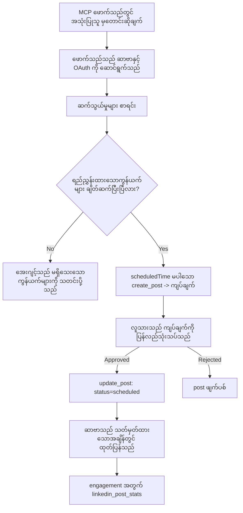

# ကိစ္စလေ့လာမှု: အေးဂျင့်မှ အသံတိုး MCP စာဗာကို အသုံးပြု၍ လူမှုကွန်ရက်များတွင် ပို့စ်တင်ခြင်း

> **မှတ်ချက်:** လူမှုကွန်ရက်များတွင် ပို့စ်တင်စေနိုင်သော ဝန်ဆောင်မှုများနှင့် open-source စီမံကိန်းများစွာ ရှိပြီး၊ အဖွဲ့တစ်ဖွဲ့သည် လည်း အချင်းချင်း API များကို တိုက်ရိုက် ပေါင်းစည်းနိုင်သည်။ အောက်ပါအခြေအနေသည် **ရေးသားနိုင်သော ဝေးလံသော MCP စာဗာ** တစ်ခုကို ဒီဇိုင်းဆွဲပြီး အသုံးပြုသည့် ဥပမာတစ်ခုအဖြစ် ပေးထားသည်။ Publora သည် အခမဲ့အဆင့်ပါရှိသည့် ကုမ္ပဏီဝန်ဆောင်မှုဖြစ်ပြီး၊ ဒီနေရာတွင် ဖော်ပြထားသည့် ပုံစံများသည် အသုံးပြုသူအတွက် ပြန်လည်မပြုပြင်နိုင်သောလုပ်ဆောင်ချက်များကို လုပ်ဆောင်သော MCP စာဗာ မည်သည်ကိုမဆို လိုက်နာသင့်သည်။

## သုံးသပ်ချက်

အေးဂျင့်များသည် အကြောင်းအရာကို ချမှတ်ရေးသားရာတွင် အထူးကောင်းစွာလုပ်ဆောင်နိုင်သော်လည်း ထုတ်ပြန်ပေးရာတွင် အားနည်းသည်။ မော်ဒယ်တစ်ခုသည် ထုတ် ပြန်ကြေငြာချက်တစ်ခုကို စက္ကန့်အတွင်းရေးသားနိုင်ပြီး ထို့နောက် အလုပ်အပ်ပြီးသွားသည်။ ထုတ်ပြန်ခြင်းဆိုသည်မှာ လုပ်ဆောင်ရန် တစ်ခြား API တစ်ခုချင်းစီနှင့် OAuth app တစ်ခုချင်းစီလိုအပ်ပြီး အမျိုးမျိုးသောမီဒီယာနည်းစနစ်များကိုလိုက်နာရမည်ဖြစ်သည်။ အများစုအဖွဲ့များသည် ဘရောက်ဆာတွင် စာသားကို မိမိတို့လက်ဖြင့် ကူးယူထည့်ခြင်းဖြင့် ပြဿနာကို ဖြေရှင်းကြသည်။

ဒီကိစ္စလေ့လာမှုသည် အဲ့ဒီနောက်ဆုံးအဆင့်ကို ဝေးလံသော MCP စာဗာတစ်ခုဖြင့် မည်သို့ ပိတ်ပင်နိုင်သည်ကို ပြသနှိုင်းယှဉ်ပြီး၊ အသုံးပြုသူတစ်ဦး အတွက် နားလည်ရန် အရေးကြီးသည်မှာ **ရေးသားနိုင်သော** စာဗာသည် မှန်ကန် စွာဒီဇိုင်းဆွဲ ရမည့်ဆုံးဖြတ်ချက်များသည် ဘာလဲဆိုတာကို ဖော်ပြပေးသည်။ ဒေတာဖတ်ခြင်းသည် သန့်ရှင်းခြင်းဖြစ်သော်လည်း၊ ပို့စ်တင်ခြင်းသည် မဟုတ်ပါ။ မှားယွင်းသော ကိရိယာခေါ်ဆိုမှုသည် ပရိသတ်ရှေ့တွင် မြင်သာပြီး ပြန်လည်ဖျက်ပစ်လို့မရပါ။

## အခြေအနေ

အေးဂျင့် (Claude, VS Code, Cursor - သုံးစွဲသူက အရေးမရွိ) အတွင်းမှာ ရေးသားသူအသေးစားဖွဲ့လေးတစ်ဖွဲ့ ရှိသည်။ ၎င်းတို့ အေးဂျင့်သို့ ဤလုပ်ဆောင်ချက်များ လုပ်နိုင်ရန်လိုချင်သည်။

- အဖွဲ့မှာ ချိတ်ဆက်ထားသည့် လူမှုကွန်ရက်အကောင့်များကို ကြည့်ရှုနိုင်ရန်,
- ပို့စ်တစ်ခုကို ချမှတ်ရေးသားပြီး လူ့အတည်ပြုမှုအတွက် ရက်မတင်နှင့် မထုတ်ပြန်ထားရန်,
- ပုံတစ်ပုံတူးတူးဖွဲပေးရန်,
- သတ်မှတ်ထားသည့်အချိန်တွင် လူမှုကွန်ရက် အများအတွက် အချိန်ဇယားချိန်ညှိရန်,
- ကြေညာချက်ကို နောက်ပိုင်း အကောင်အထည်ဖော်မှုအပေါ် စစ်တမ်းရရှိရန်။

အရေးကြီးသည်မှာ၊ အေးဂျင့်သည် စမ်းသပ်မှုများဖြစ်စဉ်က ကျော်လွန်လွန်းသွားပြီး မတော်တဆ ပို့စ်တင်မှုပြုလုပ်ခြင်း မဖြစ်စေရန် ဖြစ်သည်။

## အသုံးပြုသော ကိရိယာများ

- [Publora MCP Server](https://github.com/publora/mcp-server) — ပို့စ်တင်ခြင်း၊ အချိန်ဇယားချိန်ညှိခြင်း၊ မီဒီယာနှင့် LinkedIn စမ်းသပ်စစ်ဆေးမှုကိရိယာများ ပါဝင်သော ဝေးလံ MCP စာဗာ (`streamable-http`)။ `com.publora/mcp-server` အဖြစ် MCP မှတ်ပုံတင်စာရင်းတွင် မှတ်ပုံတင်ထားသည်။

## လုပ်ဆောင်မှု အဆင့်ဆင့် လမ်းညွှန်

1. **စာဗာချိတ်ဆက်ပါ။** OAuth ကို ပြောဆိုနိုင်သည့် လိုအပ်ချက်ရှိသော client များသည် PKCE ဖြင့် အသိအမှတ်ပြု ကုဒ်လမ်းကြောင်း ကို သုံးပြီး စာဗာ၏ သဘောတူညီမှု မျက်နှာပြင်ကို အသုံးပြုကာ ခွင့်ပြုချက်ကောက်ယူသည်။ Headless CLI ကဲ့သို့သော client များမှာ Publora API Key ကို header ထဲတွင် အသုံးပြုသည်။ နှစ်ခုစလုံးအား ပံ့ပိုးပေးထားပြီး client အပေါ်မှာ မူတည်သည်၊ စာဗာပေါ်မူတည်ခြင်းမဟုတ်ပါ။
2. ** ချိတ်ဆက်မှုစာရင်းကို ပြပါ။** အေးဂျင့်သည် `list_connections` ကို ခေါ်ဆိုပြီး ချိတ်ဆက်ထားသော အကောင့်များနှင့် ၎င်းတို့၏ အိုင်ဒီများကို လက်ခံရရှိသည်။
3. ** ချမှတ်ရေးသားမှု။** အေးဂျင့်သည် စီစဉ်ချိန်တစ်ခုမပါဘဲ `create_post` ကို ခေါ်ဆိုသည်။ အဲ့ဒီပို့စ်ကို ချမှတ်အဖြစ် သိမ်းဆည်းပြီး မည်သည့်ပို့စ်မျှ မထုတ်ပြန်ပါ။
4. ** မီဒီယာ ထည့်ပါ။** အသေးစား ပုံ URL များကို တစ်ဆက်တည်းခေါ်ဆိုမှုတွင် ပို့သည်။ စာဗာသည် ဒေါင်းလုပ်ပြီး စစ်ဆေးပေးသည်။
5. ** အချိန်ဇယားချိန်ညှိပါ။** လူ့အတည်ပြုမှုပြီးနောက် `update_post` သည်၊ အခြေအနေကို ISO 8601 အချိန်ဖြင့် စီစဉ်ထားခြင်းအဖြစ် ပြောင်းလဲပေးသည်။
6. ** တိုင်းတာပါ။** LinkedIn အတွက် `linkedin_post_stats` သည် ပို့စ်တင်ပြီးမှ လက်တွေ့ ပါဝင်မှုရလဒ်များ ပြန်ပေးသည်။

## ဥပမာ အမိန့်

```text
Which social accounts do I have connected?
Draft a post announcing our new changelog page, attach the screenshot at
https://example.com/changelog.png, and keep it as a draft — do not publish it.
Once I approve, schedule it to LinkedIn and Bluesky for tomorrow at 09:00 UTC.
```

## Mermaid အဆင့်ဆင့်ဇယား



## နည်းပညာဆိုင်ရာ ဆောင်ရွက်ချက်

အောက်ပါသင်ခန်းစာများနှင့် လမ်းညွှန်ချက်များသည် ဒီကိစ္စလေ့လာမှုမှ လွှဲပြောင်း၍ အသုံးပြုနိုင်သော အစိတ်အပိုင်းများ ဖြစ်သည်။

### ဖွင့်လှစ် သူ့ဟာ ရှာဖွေခြင်း၊ အတည်ပြုလက်ခံမှု ပါဝင်သော ဆောင်ရွက်ချက်

`tools/list` ကို ခွင့်ပြုချက်မလိုအပ်ဘဲ ပေးထားပြီး၊ `tools/call` တစ်ခုစီသည် token လိုအပ်သည်
၍ မလိုက်နာပါက၊ `WWW-Authenticate` header ပါဝင်သည့် `401` ပြန်ပေးသည်
၎င်းဟာ သတ်မှတ်ထားသော အရင်းအမြစ် metadata ကို ရည်ညွှန်းပါသည်။ စာဗာ၏ ရှေးဟောင်း endpoint သည်
`2026-07-28` နောက်ပိုင်း protocol ဗားရှင်းကြိုတင်အသုံးပြုသူများအတွက်၊
မသုံးသည့် မအတည်ပြု `initialize` မေးခွန်းကိုလည်း ဖြေကြားပေးပါသည်။

ဒီစာဗာနီးယား ခွဲခြားမှုသည် မှတ်တမ်းစာရင်းများ၊ ကြည့်ရှုစာရင်းများနှင့် client များသည် ကိရိယာ အမည်များ၊ စနစ်များနှင့် မှတ်ချက်များအား ဆီးသွားခြင်းမရှိဘဲ ကြည့်ရှုနိုင်စေရန်ဖြစ်သည်။ anonymous လုပ်ဆောင်မှုကို ကန့်သတ်သည်။ ဖွင့်လှစ် ရှာဖွေရေးသည် MCP ရဲ့ လိုအပ်ချက်မဟုတ်ဘဲ တပ်ဆင်မှု မျိုးတစ်ခုပဲဖြစ်သည်။ အကာအကွယ်ရှိသော တပ်ဆင်မှုတွင် `tools/list` အတွက်လည်း ခွင့်ပြုချက်တောင်းနိုင်သည်။

### မှတ်ပုံတင်ခြင်း: dynamic client registration နှင့် ၎င်းအားအစားထိုးသည့် နည်းလမ်း


အသုံးပြု၍ **dynamic client registration** ကို ပံ့ပိုးပေးသည်။

Dynamic registration သည် ဒေသန္တရ client များအတွက် လက်ဖြင့်လုပ်ရသောအဆင့်ကို ဖယ်ရှားပေးသည်။ မလုပ်ပါက


ဒီနေရာရှိသည်မှာ ဒီဇိုင်းထည့်သွင်းရန် မဟုတ်ဘဲ ကိုက်ညီမှု အသွင်အပြင်အဖြစ် တည်းဖြတ်ရန်လိုအပ်သည်ဟု သတ်မှတ်ပါ။ `2026-07-28` စံမှတ်တမ်းကား dynamic client registration ကို လျှော့ထားပြီး Client ID Metadata Document (CIMD) တွင် အစားထိုးသည်။ CIMD သည် client မှ HTTPS URL တည်ငြိမ်ရာတွင် metadata စာတမ်းကို နေရာပေးပြီး အဲဒီ URL က သူ့ `client_id` ဖြစ်သည်။ DCR သည် ယခုအချိန်တွင် အသုံးပြုနိုင်သေးသော်လည်း၊ ယနေ့ ဆော့ဖ်ဝဲတည်ဆောက်သူသည် CIMD အတွက် စီစဉ်ပြီး DCR ကို အသုံးပြုသည်မှာ ဟောင်းသော client များ အတွက်သာ ဖြစ်စေရန် ဖြစ်သည်။

### ကိရိယာ မှတ်ချက်များသည် ဖော်ဆောင်မှု မဟုတ်ပါ

ကိရိယာတစ်ခုစီတွင် `title` နှင့် အသုံးပြုနိုင်သော အကြံပေးချက်များ: `readOnlyHint`, `destructiveHint`, `idempotentHint`, `openWorldHint` ပါဝင်သည်။

နှစ်ခုနေ့ သက်သေ အကြောင်း: ပထမအား client များသည် အကြံပေးချက်များကို အသုံးပြုကာ အသုံးပြုသူထံမှာ ကိုယ်တိုင် အတည်ပြုမှု လုပ်ရန် ဆုံးဖြတ်ကြသည်။ client တစ်ခုသည် ဖတ်ခွင့်သာ ရှိသည့် ရှာဖွေရေးကို အလိုအလျောက် လုပ်ဆောင်ပြီး ဖျက်ရန်အတည်ပြုပေးရန် ရပ်တန့်နိုင်သည်။ စံလက်မှတ်တွင် မှတ်ချက်များသည် ယုံကြည်စိတ်ချရသော အတည်ပြုမှုမဟုတ်ကြောင်း သတ်မှတ်ထားသည်။ ၎င်းသည် client ကလုပ်ဆောင်ရမည့်အရာများကိုဖော်ပြပေးသည်၊ စာဗာကို မဆန့်ကျင်ဘဲ ကိုယ်တိုင် စည်းကမ်းများကို ပေးရန် ဖြစ်သည်။ ဒုတိယအား connector directories အကြီးကြီးများသည် ၎င်းတို့အတွက် title နဲ့ hint မပါသော စာဗာတို့ကို လက်ခံ မပေးကြပါ။

### အိုင်ဒီဖိုင်ယာများကို မထောက်လှမ်းပေးရ

ပလက်ဖောင်းအိုင်ဒီများသည် `list_connections` မှ ပြန်ပေးသော မမြင်သာသော စာကြောင်းများဖြစ်ပြီး schema သည် မုခ်မထည့်၊ မဖြည့်မပြောင်း ကူးယူရမည့် အမျိုးအစားဖြစ်ကြောင်း သေချာရေးသားထားသည်။ စာဗာသည် အခြားကို တောင်းဆိုမှုများကို ငြင်းပယ်သည်။

မော်ဒယ်များမှာ အလွယ်တကူ ခန့်မှန်းနိုင်သည်။ ရေးသားနိုင်သော စာဗာတစ်ခုစီသည် အိုင်ဒီကို မှားယွင်းခန့်မှန်းမှုများ မဖြစ်အောင်၊ အသံကြီးစွာပဲ မမှန်ကန်သော တန်ဖိုးဖြင့် လုပ်ဆောင်ရာ မရောက်အောင် ဆောင်ရွက်ရမည်။

### ပို့စ်တင်ရမည့်အောက်ဆုံးမှ အိုကေချင်တင်မီ ရပ်တန့်ပါ၊ လုပ်ဆောင်နိုင်သော သတင်းအချက်အလက်နှင့်

တချို့သော လူမှုကွန်ရက်များသည် စာသားဖြင့်သာ ပို့စ်တင်ရန် မလက်ခံပဲ ပုံရုပ်၊ ဗီဒီယိုလိုအပ်သည်။ ၎င်းသည် အချိန်ဇယားချိန်ညှိရာတွင် စစ်ဆေးပြီး အမှားအတွက် ပလက်ဖောင်းနှင့် လိုအပ်ချက်အား သတ်မှတ်ပေးသည်။

အေးဂျင့်သည် "Instagram သည် media လိုသည် — ပုံတစ်ပုံ သို့မဟုတ် ဗီဒီယိုတစ်ခု ထည့်ရန်" လို့ ပြောဆိုသော အမှားကို နောက်တစ်ကြိမ် ပြန်လာစစ်ဆေးရန် မလိုဘဲ ပြန်လည်ဖြေရှင်းနိုင်သည်။ `400` ရာစုခွဲသော အမှားမှ ပြန်လည်ပြုပြင်နိုင်ခြင်း မရှိပါ။

### ထပ်မံကြိုးစားမှုများအား လုံခြုံစေရန်

အကြောင်းအရာဖန်တီးသည့် ကိရိယာနှစ်ခုမှာ `create_post` နှင့် `update_post` ဖြစ်ပြီး၊ idempotency key ကိုလက်ခံသည်။ ဒီ key ကို တူညီသော မေးသည့်အခါ မူလတုံ့ပြန်ချက်ကို ပြန်လည် ထုတ်ပေးပြီး ဒုတိယပို့စ် မဖန်တီးပါ။ အေးဂျင့် အချိန်ကျော်များ ့တွင် သိမ်းဆည်းထားသည့် idempotency မရှိရင်၊ မြန်နှုန်းနည်းသော တုံ့ပြန်ချက်များသည် ပို့စ်တင်မှုကို နှစ်ကြိမ်ပြုလုပ်သွားနိုင်သည်။ အခြားရေးဆောင်ရွက်ချက်များ — ဖျက်ခြင်း၊ မီဒီယာဆက်တင်များ၊ LinkedIn မှ တုံ့ပြန်ချက်နှင့် မှတ်ချက်များ — အတွက် idempotency key မလိုအပ်သည့်အတွက် ထပ်မံကြိုးစားမှုတွင် အလိုအလျောက်လုံခြုံမနေသေးပါ။ သင်တွင် ဘယ်လို ပြောင်းလဲမှုများ ဘယ်ဟာနဲ့ မလုံခြုံသေးကောင်း သိထားဖို့လိုသည်။

### တဆိတ်လောက်စစ်ဆေးရန်နည်းလမ်း ပေးပါ၊ ပို့စ်တင်ခြင်း မဖြစ်စေသူ

စာဗာသည် သတ်မှတ်ထားသော `publora-playground` ဆိုသော အမှာစာလိပ်စာ များလက်ခံပြီး၊ တုန့်ပြန်ဆိုင်ရာတွင် အတုအဖြစ်မှတ်ပုံတင်ပြီး လက်ခံမှုပြုသော်လည်း တကယ့် အကောင့်သို့ မရောက်ပါ။ စာသား schema တွင် ဖော်ပြပြီး၊ client မည်သည့်အခါမဆို ခွင့်ပြုချက် မလိုဘဲ ဖတ်ရှုနိုင်သည်။ `create_post` ၏ `platforms` ကွက်တိၤၨတွင် "တကယ့် ချိတ်ဆက်မှု မလိုအပ်ဘဲ စမ်းသပ်ရန် သတ်မှတ်ထားသော ရည်မှန်းချက် — ပို့စ်အား လက်ခံပြီး ဖျက်သိမ်းပေးပြီး၊ မည်သည့်ပို့စ်မျှ မထုတ်ပြန်ပါ" ဟု သတ်မှတ်ထားသည်။ တစ်ခုတည်း အကြောင်းအရာအဖြစ် `platforms: ["publora-playground"]` ဖြင့် ခေါ်ဆိုနိုင်သည်။


## ရလဒ်များနှင့် သက်ရောက်မှု

- ပို့စ်တင်ခြင်းအဆင့်သည် ဘရောက်ဆာမှ အကြောင်းအရာရေးသားသော စကားဝိုင်းထဲသို့ ပြောင်းရွှေ့ပြီး ချမှတ်အရင်ဆင့်ဟာ လူ့အဖွဲ့ဝင်တစ်ယောက်ပါဝင်ထားသည်။ ချမှတ်သည် ရိုးရာစနစ်ဖြစ်ပြီး နယ်နိမိတ်မဟုတ်ကြောင်း သိထားသင့်သည်။ ချမှတ်သည် credential တစ်ခုတည်းဖြင့် အချိန်ဇယားသတ်မှတ်ခြင်းသို့မဟုတ် ပို့စ်တင်ခြင်း ပြုလုပ်နိုင်သည်။ အတည်ပြုသည် တကယ့်လိုအပ်သောသူသည် ကိရိယာမှာမဟုတ်ဘဲ စာဗာရှေ့နေရာ - credential နှစ်ခုခွဲခြားခြင်း သို့မဟုတ် စာဗာရှေ့တွင် နိုင်ငံတကာမူဝါဒ ထပ်ဆင့် အတည်ပြုခြင်း ပြုလုပ်ရမည်။ 
- လူမှုကွန်ရက် တစ်ခုချင်းစီ၏ ခွဲထွက်ချက်များ — မီဒီယာ လိုအပ်ချက်များ၊ string thread များ၊ ပြန်ဖြေချုပ်ခွင့်များ — ကို စာဗာထဲတွင် တစ်ကြိမ်တည်း ကိုင်တွယ်ပြီး agent တစ်ခုချင်းစီမှာ မလုပ်တော့ဘဲဖြစ်သည်။
- အဲ့ဒီစာဗာသည် ကြိုတင် credential မရှိဘဲ MCP client အများအပြားကို ပံ့ပိုးပေးသည်။
    လက်ရှိ client များသည် Client ID Metadata Document များကို အသုံးပြုနိုင်ပြီး၊ DCR သည် ဟောင်းသော client များအတွက် စံနေဆဲဖြစ်သည်။

- အထက်ဖော်ပြခဲ့သည့် ဒီဇိုင်း ကန့်သတ်ချက်များကို Connector directory ပြန်လည်သုံးသပ်ချက်များနှင့် အသုံးပြုသူများ တို့က သွင်ပြင်သောကြောင့် ရရှိသည်။ မှတ်ချက်များ၊ OAuth နှင့် လုံခြုံသော စမ်းသပ်ရန် ရည်ရွယ်ချက် တို့သည် တစ်ခုစီ လိုအပ်ခဲ့သည်။

## ကိုးကားချက်များ

- [Publora MCP Server (အရင်းအမြစ်)](https://github.com/publora/mcp-server)
- [Publora API နှင့် MCP စာရွက်စာတမ်းများ](https://docs.publora.com)
- [MCP မှတ်ပုံတင်စာရင်း အပိုင်း: `com.publora/mcp-server`](https://registry.modelcontextprotocol.io/v0/servers?search=com.publora/mcp-server)
- [MCP စံညွှန်း - ခွင့်ပြုချက်](https://modelcontextprotocol.io/specification/2026-07-28/basic/authorization)
- [MCP စံညွှန်း - ကိရိယာ မှတ်ချက်များ](https://modelcontextprotocol.io/docs/concepts/tools)

## နောက်တစ်ဆင့်

- သင်တည်ဆောက်နေသော MCP စာဗာအား ယခုအချက်သုံးခုအတွက် စိစစ်ပါ: ကိရိယာတစ်ခုချင်းစီ ထက်မှတ်ချက်များ၊ အရာအားလုံးရေးသည့် idempotency key နှင့် စာရွက်စာတမ်း ထောက်ပြထားသည့် no-op ရည်ရွယ်ချက်။
- ဖွင့်လှစ်ရှာဖွေရေးခွဲခြားမှုကို စမ်းပါ: အခမဲ့ ဝေးလံစာဗာတစ်ခုမှ `tools/list` ကို ခွင့်ပြုချက်မလိုဘဲ ခေါ်ဆိုပါ၊ ထို့နောက် ကိရိယာတစ်ခုခေါ်ဆိုပြီး `401` စိစစ်ချက်ကို ကြည့်ရှုပါ။
- သင့်ဒေသငယ်အတွက် "ပြန်လည်ဖျက်ပစ်ခြင်း" ဆိုသည်ဘာကိုဆိုတာစဉ်းစားပါ။ ပို့စ်တင်ခြင်းတွင် ချမှတ်ခြင်းနှင့် ဖျက်ခြင်းရှိ၏။ သင်၏ လုပ်ဆောင်ချက်များတွင် ယခုလို မှတည့်ခြင်း မရှိပါက အတည်ပြုခြင်းကို ကိရိယာ ဒီဇိုင်းတွင် ထည့်သွင်းပါ၊ ဖော်ပြချက်တွင် မဟုတ်ပါ။

---

<!-- CO-OP TRANSLATOR DISCLAIMER START -->
**ပြောကြားချက်**
ဤစာတမ်းကို AI ဘာသာပြန်ဝန်ဆောင်မှု [Co-op Translator](https://github.com/Azure/co-op-translator) အသုံးပြု၍ ဘာသာပြန်ထားပါသည်။ ကျွန်ုပ်တို့သည် တိကျမှန်ကန်မှုအတွက် ကြိုးပမ်းနေသော်လည်း၊ စက်ကိရိယာဘာသာပြန်ခြင်းများတွင် အမှားများ သို့မဟုတ် မှားယွင်းချက်များ ပါဝင်နိုင်ကြောင်း သတိပြုပါရန် လိုအပ်ပါသည်။ မူလစာတမ်းကို မူရင်းဘာသာဖြင့်သာ ယုံကြည်စိတ်ချရသော အချက်အလက်အဖြစ် သတ်မှတ်သင့်သည်။ အရေးကြီးသည့် သတင်းအချက်အလက်များအတွက် ပရော်ဖက်ရှင်နယ် လူသားဘာသာပြန်သူဝန်ဆောင်မှုကို အကြံပြုပါသည်။ ဤဘာသာပြန်ချက်ကို အသုံးပြုခြင်းမှ ဖြစ်ပေါ်လာသော နားလည်မှုကွာခြားမှုများ သို့မဟုတ် မမှန်ကန်သော အသုံးပြုမှုများအတွက် ကျွန်ုပ်တို့ တာဝန်မခံပါ။
<!-- CO-OP TRANSLATOR DISCLAIMER END -->