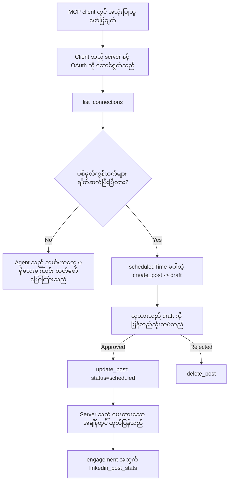

# ကိစ္စလေ့လာမှု: မျှဝေပေးသူတစ်ဦးမှ Social Networks များသို့ Remote MCP Server ဖြင့် ပျံ့နှံ့ခြင်း

> **ချုပ်ဆိုချက်:** ဝန်ဆောင်မှုများနှင့် open-source ပရောဂျက်များစွာက ဆိုးရှယ်ကွန်ယက်များတွင် ပို့စ်များထုတ်နို်င်ပြီး၊ တစ်ဖက်သတ်အသင်းတစ်ဦးကလည်း ထိုကွန်ယက်တိုင်း၏ API ကို တိုက်ရိုက် ပေါင်းစပ်နိုင်သည်။ အောက်တွင် ဖော်ပြထားသော ကိစ္စလေ့လာမှုမှာ **ရေးသားနိုင်သော remote MCP server** တစ်ခုကို မည်သို့ဒီဇိုင်းဆွဲ၍ အသုံးပြုနိုင်သည်ကို မျဉ်းတစ်ခုအနေနှင့် ပေးထားခြင်းဖြစ်သည်။ Publora သည် အခမဲ့အဆင့်ထည့်ထားသည့် စီးပွားရေးဝန်ဆောင်မှုဖြစ်ပြီး၊ ဒီမှာဖေါ်ပြထားတဲ့ ပုံစံများဟာ အသုံးပြုသူအတွက် မပြန်လည်ဖြေရှင်းနိုင်သော လုပ်ဆောင်ချက်များ ပြုလုပ်တဲ့ MCP server များအားလုံးတွင် သက်ဆိုင်သည်။

## အနှိပ်ချုပ်

Agent များသည် အကြောင်းအရာကိုရေးဆွဲရာတွင် ကောင်းသော်လည်း ပို့နိုင်ခြင်းတွင် မကောင်းကြောင်းဖြစ်သည်။ မော်ဒယ်တစ်ခုသည် မိနစ်ပိုင်းအတွင်း ထုတ်လွှင့်ကြေညာချက်ရေးနိုင်သော်လည်း အလုပ်ကြပ်သွားသည်။ မျှဝေပေးရန်ဆိုသည်မှာ ကွန်ယက်တစ်ခုခြင်းစီအတွက် API တစ်ခုနှင့် OAuth app တစ်ခုလိုအပ်ပြီး မီဒီယာ စည်းမျဉ်း များကွဲပြားသည်။ အများအားဖြင့် အသင်းများသည် ဒီအဆင့်ကို လက်ဖြင့် browser ထဲသို့ စာသားကို ကူးယူကော်ပီခြင်းဖြင့် ဖြေရှင်းကြသည်။

ဤ ကိစ္စလေ့လာမှုသည် နောက်ဆုံးအဆင့်ကို remote MCP server တစ်ခုဖြင့် ကန့်သတ်ပြီး — MCP server တစ်ခုကို တည်ဆောက်သူများအတွက် အထောက်အကူဖြစ်စေရန် — **ရေးသားနိုင်သော** server တစ်ခုမှာ မှန်ကန်ပုံသဏ္ဍာန်ကို ရှိရမည့် ဒီဇိုင်းဆုံးဖြတ်ချက်များကိုလည်း ဖော်ပြထားသည်။ အချက်အလက်ဖတ်ခြင်းမှာ သနားစရာကောင်းသော်လည်း မျှဝေခြင်းမှာ မဟုတ်ပါ: အမှားလုပ်မှုသည် ပရိသတ်ရှေ့ပြသပြီး ပြန်ဖြေရှင်း၍ မရနိုင်ပါ။

## ဇာတ်လမ်းအခြေအနေ

Developer-relations အသေးစားအသင်းက agent (Claude, VS Code, Cursor — client ဘာဖြစ်စေ မဟုတ်ပါ) မှာ ပို့စ်များရေးဆွဲကြသည်။ သူတို့လိုချင်တာမှာ -

- အသင်းက ချိတ်ဆက်ထားသည့် social အကောင့်များကို ကြည့်ရှုနိုင်ရန်,
- ပို့စ်ရေးပြီး လူ့ဘက်မှ အတည်ပြုရန်အတွက် draft အဖြစ်ထားရှိရန်,
- ပုံတစ်ပုံလည်း တပ်ဆင်နိုင်ရန်,
- ရွေးချယ်ထားသော အချိန်တွင် ကွန်ယက်များစွာသို့ အချိန်ဇယားထားရန်,
- နောက်ပိုင်းမှာ ထိုပို့စ်၏ လည်ပတ်မှုကို အစီရင်ခံရန်။

အရေးကြီးတာက agent မှ စမ်းသပ်နေစဉ် မျှဝေမှု အမှားဖြစ်ပွားခြင်းကို *မပြုလုပ်နိုင်အောင်* လုပ်ချင်တာဖြစ်သည်။

## အသုံးပြုသည့်ကိရိယာများ

- [Publora MCP Server](https://github.com/publora/mcp-server) — remote MCP server (`streamable-http`) တခုဖြစ်ပြီး မျှဝေပေးခြင်း၊ အချိန်ဇယား၊ မီဒီယာနှင့် LinkedIn သုံးသပ်ချက်ကိရိယာများကို ဖြန့်ဝေသည်။ တရားဝင် MCP မှတ်ပုံတင်စာရင်းတွင် `com.publora/mcp-server` အဖြစ် မှတ်ပုံတင်ထားသည်။

## လုပ်ငန်းစဉ် အဆင့်လိုက်

1. **Server ချိတ်ဆက်ခြင်း။** OAuth က client များသည် server ၏ consent screen ကို အသုံးပြု၍ PKCE နှင့် authorization-code flow ကို ပြီးမြောက်စေသည်။ Headless CLI ကဲ့သို့ OAuth မလိုအပ်သူများသည် header ထဲတွင် Publora API key သုံးသည်။ နှစ်မျိုးလုံးကို ထောက်ခံပြီး client မူတည်၍ ရွေးချယ်သည်၊ server မသတ်မှတ်သည်။
2. **ချိတ်ဆက်မှုများစာရင်း။** Agent သည် `list_connections` ကို ခေါ်ပြီး ချိတ်ဆက်ထားသောအကောင့်များနှင့် အမှတ်အသားများကို လက်ခံရရှိသည်။
3. **Draft။** Agent သည် `create_post` ကို အချိန်ဇယား မပါဘဲ ခေါ်သည်။ ပို့စ်သည် draft အဖြစ်သိမ်းဆည်းထားပြီး မည်သည့်ပို့စ်မျှ မထုတ်ပြန်ပါ။
4. **မီဒီယာတပ်ခြင်း။** ဖွင့်လှစ်ရရှိနိုင်သော ပုံ URL များကို တစ်ချက်တွင်ပေးပြီး server မှ ဒေါင်းလုဒ်နှင့်စိစစ်သည်။
5. **အချိန်ဇယား။** လူ့ဘက်မှ อတည်ပြုချက်ရရှိပြီးနောက် `update_post` သည် status ကို scheduled အဖြစ် ISO 8601 အချိန်ဖြင့် ပြောင်းလဲသည်။
6. **တိုင်းတာမှု။** LinkedIn အတွက် `linkedin_post_stats` သည် ပို့စ်တင်ပြီးနောက် engagement ကို ပြန်ပေါ်အပ်သည်။

## နမူနာ Prompt

```text
Which social accounts do I have connected?
Draft a post announcing our new changelog page, attach the screenshot at
https://example.com/changelog.png, and keep it as a draft — do not publish it.
Once I approve, schedule it to LinkedIn and Bluesky for tomorrow at 09:00 UTC.
```

## Mermaid Flowchart



## နည်းပညာဆိုင်ရာ အကောင်အထည်ဖော်မှု

အောက်တွင် ဖော်ပြထားသော သင်ခန်းစာများကို ဤကိစ္စလေ့လာမှုမှ လွဲပြောင်းအသုံးချနိုင်သည်။

### ဖွင့်လင်းရှာဖွေရေး၊ အတည်ပြုချက်ရှိသော လုပ်ဆောင်ချက်

`tools/list` ကို credential မပါဘဲ ဝန်ဆောင်မှုပေးပြီး `tools/call` တစ်ခုခုအားလုံးတွင် token လိုအပ်ပြီး မရှိပါက `401` တုံ့ပြန်မှုနှင့် `WWW-Authenticate` header ဖြင့် ကာကွယ်ထားသည့် resource ၏ metadata ကို ပြသသည်။ (server သည် unathenticated `initialize` ကိုလည်း ဖြေကြားသည်၊ ၎င်းသည် `2026-07-28` မတိုင်မီ protocol ဗားရှင်းများသာ အရေးကြီးသည်။ အဆိုပါပြင်ဆင်မှုက အသိအမွေ handshake ကို ဖယ်ရှားသွားသည်။)

ယင်းခြားနားချက်က လက်တွေ့အသုံးပြုမှုတွင် အရေးပါသည်။ မွတ်ပေါ်ဝန်ဆောင်မှုစာရင်းများ၊ စာရင်းများနှင့် client များသည် လျှို့ဝှက်ချက်မပါဘဲ tool အမျိုးအစားများကို ကြည့်ရှုနိုင်သည်၊ သို့သော် *anonymous* အနေဖြင့် လုပ်ဆောင်ခြင်း မပြုလုပ်နိုင်ပါ။ `initialize` အတွက် token တောင်းဆိုသည့် server သည် tooling မှ မမြင်ရသလို၊ anonymous `tools/call` ခွင့်ပြုသည့် server သည် ပြဿနာဖြစ်စေသည်။

### မှတ်ပုံတင်ခြင်း: dynamic client registration နှင့် ၎င်းကိုအစားထိုးသည်

Server သည် `/.well-known/oauth-protected-resource` နှင့် `/.well-known/oauth-authorization-server` ကိုကြေညာပြီး authorization-code flow ကို PKCE (`S256`) ဖြင့်၊ refresh token များနှင့် **dynamic client registration** ကို ထောက်ခံသည်။

Dynamic registration က manual အဆင့်ကိုဖယ်ရှားသည်။ ၎င်းမရှိပါက client အသစ်တိုင်းအတွက် vendor ဆီသို့ out-of-band request တောင်းရမည်။

၎င်းအမူအရာကို မိတ်ဆက်အစီအစဉ်အဖြစ် နှီးနှောစရာအနေဖြင့်ယူပါ၊ ၎င်းသည် ကူးယူရန်ဒီဇိုင်းမဟုတ်ပါ။ `2026-07-28` မှာ Client ID Metadata Documents (CIMD) ကို အစားထိုးပြီး၊ client က stable HTTPS URL တွင် metadata document တင်ပြီး URL သည် `client_id` ဖြစ်သည်။ DCR သည် ယခုထိအလုပ်လုပ်သော်လည်း ယနေ့ ဖန်တီးသော server သည် CIMD အတွက် ပြင်ဆင်ပြီး DCR ကို ဟောင်းသော client များအတွက်သာရှိစေသင့်သည်။

### Tool အညွှန်းများသည် အလှဆင်မှုမဟုတ်ပါ

tool တစ်ခုစီတွင် `title` နှင့် သင့်တော်သော အညွှန်းများမှ `readOnlyHint`, `destructiveHint`, `idempotentHint`, `openWorldHint` ပါရှိသည်။

၎င်းတို့အတွက် အကြောင်းရင်းနှစ်ချက် ရှိသည်။ ပထမတစ်ခုမှာ client များသည် အညွှန်းကို အသုံးပြု၍ အသုံးပြုသူနှင့် အတည်ပြုစရာရှိ/မရှိဆုံးဖြတ်သည် — client သည် read-only lookup ကို အလိုအလျောက် လုပ်ပြီး ဖျက်ရန် မဆို Approval မရောက်မှ ရပ်နိုင်သည်။ Specification တွင် အဓိကပြောသည်မှာ အညွှန်းများသည် ယုံကြည်၍မရသော အချက်များဖြစ်ပြီး ခွင့်ပြုချက်မဟုတ်ပါ။ Client များ၏ သဘောတူညီချက်များကို သက်သေပြကာ server တွင် စည်းကမ်းများကို ပြသထားရမည်။ ဒုတိယမှာ connector directory များသည် အဓိက လိုအပ်ချက်အဖြစ် သတ်မှတ်ပြီး tool များတွင် title နှင့် hints မပါလျှင် အလုပ်ကောင်းသော်လည်း ပြန်ပေးပို့ခံရမည်။

### အမှတ်အသားများကို မထုတ်ဖော်နိုင်အောင် ပြုလုပ်ပါ

Platform အမှတ်အသားများသည် `list_connections` မှ ပြန်လာသော သီးသန့် string များဖြစ်ပြီး schema ဖေါ်ပြချက်တွင် အတိအကျ ကူးယူရမည်၊ ခန့်မှန်းရန် မလိုကြောင်း ဖော်ပြထားသည်။ Server သည် အခြားအရာများကို သတင်းမပို့ပါ။

မော်ဒယ်များသည် ခန့်မှန်းစွမ်းရည်ရှိသည်။ ရေးသားနိုင်သည့် server များသည် အမှတ်အသားဟူးမျိုးခန့်မှန်းမှုများ ဖြစ်ပေါ်နိုင်ကြောင်း သဘောတူ၍ အဆင့်မတက်ခင် မှတ်တမ်းတင်ကာ မဖြစ်စေဘဲ ပျက်ကွက်စေရမည်။

### ပို့ရန်မတိုင်ခင် အဆင်မပြေမှုများကို ကြိုတင်ဖမ်းယူပါ၊ လုပ်ဆောင်နိုင်သောအကြောင်းကြားချက်နှင့်

ကွန်ယက်အချို့သည် စာသားတစ်ခုပဲမဖြစ်ရ၊ ပုံ သို့မဟုတ် ဗီဒီယို တစ်ခုထည့်ရန်လိုအပ်သည်။ ၎င်းကို အချိန်ဇယားချိန်တွင် စစ်ဆေးပြီး အမှားသည် platform နှင့် လိုအပ်ချက်ပျောက်ဆုံးမှုကို ဖော်ပြသည်။

Agent တစ်ခုသည် "Instagram သည် မီဒီယာလိုအပ်သည် — ပုံ သို့မဟုတ် ဗီဒီယို တပ်ဆင်ပါ" ဆိုသော အမှားမှ နောက်ထပ် လည်ပတ်မှုမလိုဘဲ ပြန်လည်ကယ်ဆယ်နိုင်သည်။ သို့သော် မိဘ untyped `400` error မှ ကယ်ဆယ်၍ မရပါ။

### ပြန်လည်ကြိုးစားမှုများကို လုံခြုံစေပါ

အကြောင်းအရာဖန်တီးကိရိယာနှစ်ခု `create_post` နှင့် `update_post` သည် idempotency key ကို လက်ခံသည်။ တူညီသောတောင်းဆိုမှုဖြင့် ထပ်မံအသုံးပြုပါက မူလတုံ့ပြန်မှုကို တောင်ကြီးထပ်ခေါ်ပြီး ဒုတိယပို့စ် မဖန်တီးပဲဖြစ်သည်။ Agent runtime များသည် timeout တွင် ပြန်ကြိုးစားကြသည်။ idempotency မရှိပါက ရှုပ်ထွေးသောတုံ့ပြန်မှုသည် duplicate ပို့စ်ဖြစ်စေသည်။ အခြားရေးသားမှုကိရိယာများ — ဖျက်ခြင်း၊ မီဒီယာ အဆင့်များ၊ LinkedIn ပြန်လည်ထိုက်ခံခြင်းနှင့် မှတ်ချက်များ — idempotency key မယူသောကြောင့် ပြန်ကြိုးစားမှုမှာ လုံခြုံမှုမရှိပါ။ သင့် mutation များမှ မည်မှုက ပိုင်ဆိုင်မှုရှိပြီး မည်မှုက မရှိမည်ကို သိထားလျှင် ကောင်းသည်။

### ပျံ့နှံ့မှု မရှိသော စမ်းသပ်မှုနည်းလမ်း တစ်ခု ပေးပါ

Server သည် `publora-playground` ဟု အကြိုreserved target တစ်ခုကို လက်ခံပြီး အမှန်တကယ်ရောက်သည့်နေရာအဖြစ် ယူဆပြီး အတည်ပြုကာ ဤနေရာသို့ မျှဝေပေးခြင်း မရှိဘဲ ပယ်ဖျက်သည်။ ၎င်းကို tool schema တွင် ရေးပြထားသည်၊ client မည်သည့်ရရှိနိုင်ပါကလည်း ဖတ်လို့ရသည်။ `create_post` ၏ `platforms` field တွင် "ချိတ်ဆက်မှုစမ်းသပ်မှုတစ်ခုဖြစ်ပြီး အမှန်တကယ်ချိတ်ဆက်မှုမလိုအပ်ပါ — ပို့စ်ကို အတည်ပြုကာ ပယ်ဖျက်ပြီး မျှဝေလုပ်ဆောင်မှု မရှိပါ" ဟူ၍ဖေါ်ပြသည်။ ထည့်သွင်းသုံးနိုင်ဖို့ `platforms: ["publora-playground"]` ဟု အထဲသို့ ထည့်ရမည်။

ဒီအချက်သည် surface နှင့် ပတ်သက်၍ အထောက်အကူဖြစ်သော အသေးစိတ်အချက်အလက်တစ်ခု ဖြစ်လာသည်။ connector directory အထောက်အထားအဖြစ် သုံးသပ်သူများ၊ ဝန်ထမ်းများနှင့် CI များသည် စံတော်ချိန် အပြည့်အစုံကို တုန့်ပြန်စစ်ဆေးနိုင်သည်။ မည်သည့် MCP server မဆို မပြန်လည်ဖြေရှင်းနိုင်သော လုပ်ဆောင်ချက်များရှိပါက documented no-op target ၏ အကျိုးအမြတ် ရရှိမည် ဖြစ်သည်။

## ရလဒ်များနှင့် အကျိုးသက်ရောက်မှုများ

- Publishing လုပ်ငန်းစဉ်ကို browser မှ ရေးသားနေသော စကားပြောခန်းတစ်ခုသို့ ရွှေ့ပြောင်းခဲ့ပြီး draft-first အပြုအမူဖြင့် လူ့ဘက်ပါဝင်မှုရှိနေသည်။ ဤ draft ဆိုသည်မှာ စံသတ်မှတ်ချက်ဖြစ်ပြီး နယ်နိမိတ်မဟုတ်ပါ။ Credential တစ်ခုနဲ့ schedule သို့မဟုတ် publish လုပ်နိုင်သည်၊ ထို့ကြောင့် အမှန်တကယ် အတည်ပြုရန် လိုအပ်သူသည် tool surface အပြင်တွင် enforcement လုပ်ရမည် — credential ကွဲခြားစေခြင်း သို့မဟုတ် server ရှေ့တွင် policy layer တပ်ဆင်ခြင်းဖြင့်။
- ကွန်ယက်တစ်ခုချင်းစီတွင် ဆက်စပ်မီဒီယာလိုအပ်ချက်များ၊ စည်းမျဉ်းများ၊ ပြန်ဆိုခွင့်များကို server တစ်ခုတည်းတွင် မျှဝေကြောင်းဖြေရှင်းပြီး agent တစ်ခုစီတွင် မလုပ်ရပါ။
- Server တစ်ခုတည်းက MCP client များ အများအပြားကို client အလိုက် အလုပ်မလုပ်ဘဲ ပံ့ပိုးပေးသည်၊ discovery သည် ဖွင့်လင်းပြီး မှတ်ပုံတင်ခြင်းသည် dynamic ဖြစ်ပါသည်။
- ဒီဇိုင်းကန့်သတ်ချက်များသည် connector-directory သုံးသပ်မှုများနှင့် အသုံးပြုသူများ၏ အမြင်များနှစ်ခုလုံးကို ထိန်းသိမ်းထားသည် — အညွှန်းများ၊ OAuth နှင့် လုံခြုံသည့် စမ်းသပ်မှု target တို့သည် တစ်ခုချင်းလိုအပ်ခဲ့သည်။

## ရင်းမြစ်များ

- [Publora MCP Server (source)](https://github.com/publora/mcp-server)
- [Publora API and MCP documentation](https://docs.publora.com)
- [MCP Registry entry: `com.publora/mcp-server`](https://registry.modelcontextprotocol.io/v0/servers?search=com.publora/mcp-server)
- [MCP specification — Authorization](https://modelcontextprotocol.io/specification/draft/basic/authorization)
- [MCP specification — Tool annotations](https://modelcontextprotocol.io/docs/concepts/tools)

## နောက်တစ်ဆင့်

- မည်သည့် MCP server ကိုမဆို အောက်ပါ အဆင့်သုံးခုပြုလုပ်ပါ — tool တစ်ခုစီတွင် အညွှန်းများ ထည့်သွင်းခြင်း၊ ရေးသားမှုတစ်ခုစီတွင် idempotency key ထည့်သွင်းခြင်းနှင့် documented no-op target ထည့်သွင်းခြင်း။
- ဖွင့်လင်းရှာဖွေရေး ခွဲခြားမှုကို စမ်းသပ်ပါ — public remote server ကို credentials မပါဘဲ `tools/list` သို့ ခေါ်ပြီး နောက်တစ် tool မှာ `401` လုပ်ဆောင်မှုကို စစ်ဆေးပါ။
- သင့်ဒိုမိန်းအတွက် "undo" ဆိုသည်မှာ အဓိပ္ပာယ်ဖြစ်စေစဉ်းစားပါ — publishing တွင် draft နှင့် ဖျက်သိမ်းမှုရှိသည်၊ သင့် လုပ်ဆောင်ချက်များမှာ မရှိလျှင် အတည်ပြုချက်သည် prompt မဟုတ် tool ဒီဇိုင်းမှာ ရှိသင့်သည်။

---

<!-- CO-OP TRANSLATOR DISCLAIMER START -->
**ပြောကြားချက်**
ဤစာတမ်းကို AI ဘာသာပြန်ဝန်ဆောင်မှု [Co-op Translator](https://github.com/Azure/co-op-translator) အသုံးပြု၍ ဘာသာပြန်ထားပါသည်။ ကျွန်ုပ်တို့သည် တိကျမှန်ကန်မှုအတွက် ကြိုးပမ်းနေသော်လည်း၊ စက်ကိရိယာဘာသာပြန်ခြင်းများတွင် အမှားများ သို့မဟုတ် မှားယွင်းချက်များ ပါဝင်နိုင်ကြောင်း သတိပြုပါရန် လိုအပ်ပါသည်။ မူလစာတမ်းကို မူရင်းဘာသာဖြင့်သာ ယုံကြည်စိတ်ချရသော အချက်အလက်အဖြစ် သတ်မှတ်သင့်သည်။ အရေးကြီးသည့် သတင်းအချက်အလက်များအတွက် ပရော်ဖက်ရှင်နယ် လူသားဘာသာပြန်သူဝန်ဆောင်မှုကို အကြံပြုပါသည်။ ဤဘာသာပြန်ချက်ကို အသုံးပြုခြင်းမှ ဖြစ်ပေါ်လာသော နားလည်မှုကွာခြားမှုများ သို့မဟုတ် မမှန်ကန်သော အသုံးပြုမှုများအတွက် ကျွန်ုပ်တို့ တာဝန်မခံပါ။
<!-- CO-OP TRANSLATOR DISCLAIMER END -->