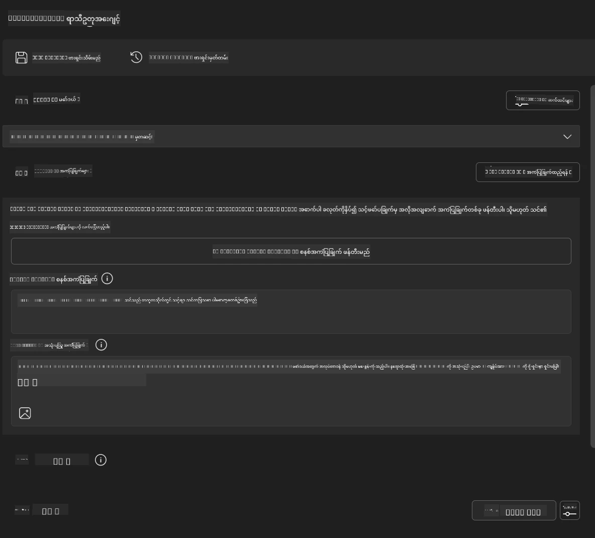
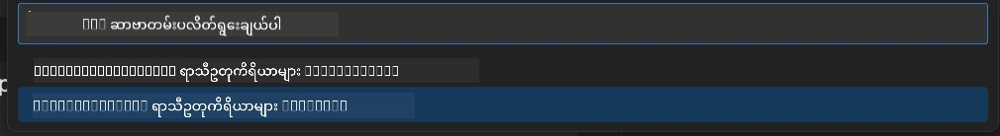
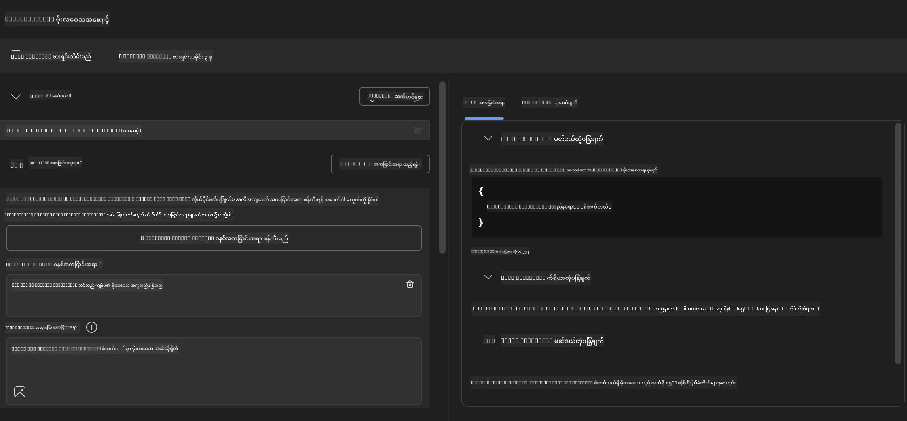
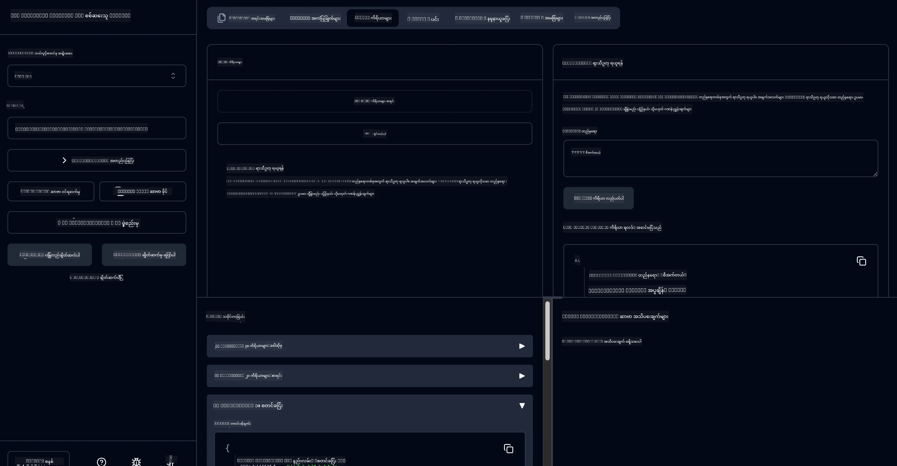

# 🔧 Module 3: Microsoft Foundry Toolkit ဖြင့် အဆင့်မြင့် MCP ဖွံ့ဖြိုးမှု

> [!NOTE]
> ဤလက်တွေ့လုပ်ငန်းခွင်တွင် Inspector URLs သည် အဟောင်း `/sse` endpoint ကို အသုံးပြုသည်နှင့်
> pinned MCP SDK `1.9.3` နှင့် Inspector `0.14.0` မှတ်တမ်းများကို ရည်ညွှန်းသည်။ ၎င်းတို့သည်
> လက်ရှိ `2026-07-28` Streamable HTTP ဥပမာများ မဟုတ်ပါ။


## 🎯 သင်ယူရမည့်ရည်မှန်းချက်များ

ဤလက်တွေ့လုပ်ငန်းခွင် အဆုံးသတ်ချိန်တွင် သင်သည် အောက်ပါအရာများ ပြုလုပ်နိုင်လိမ့်မည်-

- ✅ Microsoft Foundry Toolkit ကို အသုံးပြု၍ မိမိကိုယ်ပိုင် MCP စာဝန်ဆောင်မှုများ ဖန်တီးနိုင်ခြင်း
- ✅ နောက်ဆုံးပေါ် MCP Python SDK (v1.9.3) ကို ပြင်ဆင်၍ သုံးစွဲနိုင်ခြင်း
- ✅ MCP Inspector ကို သုံး၍ အမှားရှာဖွေမှု ပြုလုပ်နိုင်ခြင်း
- ✅ Agent Builder နှင့် Inspector ပတ်ဝန်းကျင်များတွင် MCP စာဝန်ဆောင်မှုများကို debug ပြုလုပ်နိုင်ခြင်း
- ✅ အဆင့်မြင့် MCP စာဝန်ဆောင်မှု ဖွံ့ဖြိုးမှု လုပ်ငန်းစဉ်များကို နားလည်ခြင်း

## 📋 မရှိမဖြစ်လိုအပ်ချက်များ

- Lab 2 (MCP အခြေခံများ) ပြီးမြောက်ပြီးသားဖြစ်ရပါမည်
- Microsoft Foundry Toolkit extension ပါရှိသော VS Code
- Python 3.10+ ပတ်ဝန်းကျင်
- Inspector စီစဉ်ရန် Node.js နှင့် npm

## 🏗️ သင်တည်ဆောက်မယ့် အရာ

ဤလက်တွေ့လုပ်ငန်းခွင်တွင် သင်တည်ဆောက်မည့် **Weather MCP Server** သည် အောက်ပါများကို ပြသပါမည်-
- မိမိကိုယ်ပိုင် MCP စာဝန်ဆောင်မှု အကောင်အထည်ဖော်ခြင်း
- Microsoft Foundry Toolkit Agent Builder နှင့် ပေါင်းစပ်ခြင်း
- ပညာရှင်အဆင့် debugging လုပ်ငန်းစဉ်များ
- နောက်ဆုံးပေါ် MCP SDK အသုံးပြုမှု ပုံစံများ

---

## 🔧 အဓိကအစိတ်အပိုင်းများအကျဉ်းချုပ်

### 🐍 MCP Python SDK
Model Context Protocol Python SDK သည် မိမိကိုယ်ပိုင် MCP စာဝန်ဆောင်မှုများ တည်ဆောက်ရန် အခြေခံထားသည်။ သင်သည် ဗားရှင်း 1.9.3 နှင့် debugging စွမ်းဆောင်ရည်မြှင့်တင်ထားသည့် ဗားရှင်းကို အသုံးပြုမှာဖြစ်သည်။

### 🔍 MCP Inspector
ပြင်းထန်ကျယ်ပြန့်သော debugging ကိရိယာဖြစ်ပြီး အောက်ပါအရာများကို ပံ့ပိုးပေးသည်-
- တိုက်ရိုက် စာဝန်ဆောင်မှု စောင့်ကြည့်မှု
- ကိရိယာဆောင်ရွက်ချက် မြင်ကွင်းပြခြင်း
- ကွန်ယက် တောင်းဆိုမှု/တုံ့ပြန်မှု စစ်ဆေးမှု
- လက်တွေ့စမ်းသပ်ရန် ပတ်ဝန်းကျင် ပေးခြင်း

---

## 📖 အဆင့်ဆင့် ဆောင်ရွက်နည်း

### အဆင့် 1: Agent Builder တွင် WeatherAgent တည်ဆောက်ခြင်း

1. **VS Code ထဲတွင် Microsoft Foundry Toolkit extension မှတဆင့် Agent Builder ကို စတင်ဖွင့်ပါ**
2. **အောက်ပါပြင်ဆင်ချက်ဖြင့် agent အသစ်တစ်ခုဖန်တီးပါ:**
   - Agent Name: `WeatherAgent`



### အဆင့် 2: MCP Server Project သတ်မှတ်ခြင်း

1. **Agent Builder တွင် Tools → Add Tool သို့ သွားပါ**
2. **ရရှိနိုင်သော ရွေးချယ်စရာများထဲမှ "MCP Server" ကို ရွေးချယ်ပါ**
3. **"Create A new MCP Server" ကို ရွေးချယ်ပါ**
4. **`python-weather` template ကို ရွေးချယ်ပါ**
5. **သင်၏ server အမည်အား `weather_mcp` ဟု သတ်မှတ်ပါ**



### အဆင့် 3: ပရောဂျက်ဖွင့်၍ စစ်ဆေးခြင်း

1. **ဖန်တီးထားသည့် ပရောဂျက်ကို VS Code တွင် ဖွင့်ပါ**
2. **ပရောဂျက်၏ ဖွဲ့စည်းတည်ဆောက်ပုံကို ပြန်လည်ကြည့်ရှုပါ။**
   ```
   weather_mcp/
   ├── src/
   │   ├── __init__.py
   │   └── server.py
   ├── inspector/
   │   ├── package.json
   │   └── package-lock.json
   ├── .vscode/
   │   ├── launch.json
   │   └── tasks.json
   ├── pyproject.toml
   └── README.md
   ```

### အဆင့် 4: နောက်ဆုံးပေါ် MCP SDK သို့ မြှင့်တင်ခြင်း

> **🔍 ဘာကြောင့်မြှင့်တင်ရတာလဲ?** နောက်ဆုံး MCP SDK (v1.9.3) နှင့် Inspector ဝန်ဆောင်မှု (0.14.0) ကို အသုံးပြုရန်ဖြစ်ပြီး Enhanced အင်္ဂါရပ်များနှင့် Debugging စွမ်းဆောင်ရည်များအတွက်ဖြစ်သည်။

#### 4a. Python မှ ဂရုတစိုက်နေခြင်း

**`pyproject.toml` ကို ပြင်ဆင်ပါ:** အောက်ပါလိပ်စာတွင် ပြင်ဆင်ရန် [./code/weather_mcp/pyproject.toml](../../../../10-StreamliningAIWorkflowsBuildingAnMCPServerWithAIToolkit/lab3/code/weather_mcp/pyproject.toml)


#### 4b. Inspector ပြင်ဆင်မှု

**`inspector/package.json` ကို ပြင်ဆင်ပါ:** အောက်ပါလိပ်စာတွင် ပြင်ဆင်ရန် [./code/weather_mcp/inspector/package.json](../../../../10-StreamliningAIWorkflowsBuildingAnMCPServerWithAIToolkit/lab3/code/weather_mcp/inspector/package.json)

#### 4c. Inspector တွင် သတ်မှတ်ထားသည့် မလိုအပ်ချက်များ ပြင်ဆင်ခြင်း

**`inspector/package-lock.json` ကို ပြင်ဆင်ပါ:** အောက်ပါလိပ်စာတွင် ပြင်ဆင်ရန် [./code/weather_mcp/inspector/package-lock.json](../../../../10-StreamliningAIWorkflowsBuildingAnMCPServerWithAIToolkit/lab3/code/weather_mcp/inspector/package-lock.json)

> **📝 မှတ်ချက်:** ဤဖိုင်တွင် မလိုအပ်ချက်များအများအပြား သတ်မှတ်ထားသည်။ အောက်တွင် အရေးကြီးသော ဖွဲ့စည်းပုံဖြစ်ပြီး စိစစ်မှု တိကျမှုအတွက် အပြည့်အစုံပါရှိသည်။


> **⚡ အပြည့်အစုံ Package Lock:** package-lock.json စာမျက်နှာ ၃၀၀၀ ကျော်သော မလိုအပ်ချက်များ သတ်မှတ်ချက်ပါရှိသည်။ အထက်ပါ ဖော်ပြချက်မှာ အဓိက ဖွဲ့စည်းပုံဖြစ်သည် - လိုအပ်ပါက အပြည့်အစုံ ဖိုင်ကို အသုံးပြုပါ။

### အဆင့် 5: VS Code တွင် Debugging ပြင်ဆင်ခြင်း

*မှတ်ချက်: သတ်မှတ်ထားသည့်လမ်းကြောင်းရှိ ဖိုင်ကို ကူးယူ ပြင်ဆင်ရန် ကျေးဇူးပြု၍ ဆောင်ရွက်ပါ*

#### 5a. Launch ပြင်ဆင်မှု သတင်းအချက်အလက် ပြင်ဆင်ခြင်း

**`.vscode/launch.json` ကို ပြင်ဆင်ပါ:**

```json
{
  "version": "0.2.0",
  "configurations": [
    {
      "name": "Attach to Local MCP",
      "type": "debugpy",
      "request": "attach",
      "connect": {
        "host": "localhost",
        "port": 5678
      },
      "presentation": {
        "hidden": true
      },
      "internalConsoleOptions": "neverOpen",
      "postDebugTask": "Terminate All Tasks"
    },
    {
      "name": "Launch Inspector (Edge)",
      "type": "msedge",
      "request": "launch",
      "url": "http://localhost:6274?timeout=60000&serverUrl=http://localhost:3001/sse#tools",
      "cascadeTerminateToConfigurations": [
        "Attach to Local MCP"
      ],
      "presentation": {
        "hidden": true
      },
      "internalConsoleOptions": "neverOpen"
    },
    {
      "name": "Launch Inspector (Chrome)",
      "type": "chrome",
      "request": "launch",
      "url": "http://localhost:6274?timeout=60000&serverUrl=http://localhost:3001/sse#tools",
      "cascadeTerminateToConfigurations": [
        "Attach to Local MCP"
      ],
      "presentation": {
        "hidden": true
      },
      "internalConsoleOptions": "neverOpen"
    }
  ],
  "compounds": [
    {
      "name": "Debug in Agent Builder",
      "configurations": [
        "Attach to Local MCP"
      ],
      "preLaunchTask": "Open Agent Builder",
    },
    {
      "name": "Debug in Inspector (Edge)",
      "configurations": [
        "Launch Inspector (Edge)",
        "Attach to Local MCP"
      ],
      "preLaunchTask": "Start MCP Inspector",
      "stopAll": true
    },
    {
      "name": "Debug in Inspector (Chrome)",
      "configurations": [
        "Launch Inspector (Chrome)",
        "Attach to Local MCP"
      ],
      "preLaunchTask": "Start MCP Inspector",
      "stopAll": true
    }
  ]
}
```

**`.vscode/tasks.json` ကို ပြင်ဆင်ပါ:**

```
{
  "version": "2.0.0",
  "tasks": [
    {
      "label": "Start MCP Server",
      "type": "shell",
      "command": "python -m debugpy --listen 127.0.0.1:5678 src/__init__.py sse",
      "isBackground": true,
      "options": {
        "cwd": "${workspaceFolder}",
        "env": {
          "PORT": "3001"
        }
      },
      "problemMatcher": {
        "pattern": [
          {
            "regexp": "^.*$",
            "file": 0,
            "location": 1,
            "message": 2
          }
        ],
        "background": {
          "activeOnStart": true,
          "beginsPattern": ".*",
          "endsPattern": "Application startup complete|running"
        }
      }
    },
    {
      "label": "Start MCP Inspector",
      "type": "shell",
      "command": "npm run dev:inspector",
      "isBackground": true,
      "options": {
        "cwd": "${workspaceFolder}/inspector",
        "env": {
          "CLIENT_PORT": "6274",
          "SERVER_PORT": "6277",
        }
      },
      "problemMatcher": {
        "pattern": [
          {
            "regexp": "^.*$",
            "file": 0,
            "location": 1,
            "message": 2
          }
        ],
        "background": {
          "activeOnStart": true,
          "beginsPattern": "Starting MCP inspector",
          "endsPattern": "Proxy server listening on port"
        }
      },
      "dependsOn": [
        "Start MCP Server"
      ]
    },
    {
      "label": "Open Agent Builder",
      "type": "shell",
      "command": "echo ${input:openAgentBuilder}",
      "presentation": {
        "reveal": "never"
      },
      "dependsOn": [
        "Start MCP Server"
      ],
    },
    {
      "label": "Terminate All Tasks",
      "command": "echo ${input:terminate}",
      "type": "shell",
      "problemMatcher": []
    }
  ],
  "inputs": [
    {
      "id": "openAgentBuilder",
      "type": "command",
      "command": "ai-mlstudio.agentBuilder",
      "args": {
        "initialMCPs": [ "local-server-weather_mcp" ],
        "triggeredFrom": "vsc-tasks"
      }
    },
    {
      "id": "terminate",
      "type": "command",
      "command": "workbench.action.tasks.terminate",
      "args": "terminateAll"
    }
  ]
}
```


---

## 🚀 သင်၏ MCP စာဝန်ဆောင်မှု ကို စတင်ရန်နှင့် စမ်းသပ်ရန်

### အဆင့် 6: မလိုအပ်ချက်များ ထည့်သွင်းတပ်ဆင်ခြင်း

ပြင်ဆင်မှုများ ပြုလုပ်ပြီးနောက် အောက်ပါ command များကို လုပ်ဆောင်ပါ-

**Python မလိုအပ်ချက်များ တပ်ဆင်ပါ:**
```bash
uv sync
```

**Inspector မလိုအပ်ချက်များ တပ်ဆင်ပါ:**
```bash
cd inspector
npm install
```

### အဆင့် 7: Agent Builder ဖြင့် Debug ပြုလုပ်ခြင်း

1. **F5 ကိုနှိပ်မည် သို့မဟုတ် "Debug in Agent Builder" ပြင်ဆင်မှုကို အသုံးပြုပါ**
2. **Debug panel မှ compound ပြင်ဆင်မှုကို ရွေးချယ်ပါ**
3. **စာဝန်ဆောင်မှုစတင်သည့်အချိန်နှင့် Agent Builder ဖွင့်လှစ်မှုကို စောင့်ဆိုင်းပါ**
4. **သင့် weather MCP server ကို သဘာဝ ဘာသာ စကားဖြင့် စမ်းသပ်ပါ**

ဤလို Input prompt ကို အသုံးပြုပါ

SYSTEM_PROMPT

```
You are my weather assistant
```

USER_PROMPT

```
How's the weather like in Seattle
```



### အဆင့် 8: MCP Inspector ဖြင့် Debug ပြုလုပ်ခြင်း

1. **"Debug in Inspector" ပြင်ဆင်မှုကို အသုံးပြုပါ (Edge သို့မဟုတ် Chrome)**
2. **Inspector အင်တာဖေ့စ်ကို `http://localhost:6274` တွင် ဖွင့်ပါ**
3. **လက်တွေ့စမ်းသပ်ပတ်ဝန်းကျင် ကို လေ့လာကြည့်ရှုပါ:**
   - ရရှိနိုင်သော ကိရိယာများ ကြည့်ရှုခြင်း
   - ကိရိယာ ဆောင်ရွက်ချက် စမ်းသပ်ခြင်း
   - ကွန်ယက် တောင်းဆိုမှုများ စောင့်ကြည့်ခြင်း
   - စာဝန်ဆောင်မှုတုံ့ပြန်မှုများ Debug ပြုလုပ်ခြင်း



---

## 🎯 အဓိက သင်ယူရမည့် ရလဒ်များ

ဤလက်တွေ့လုပ်ငန်းခွင် ပြီးမြောက်ခြင်းဖြင့် သင်သည်-

- [x] Microsoft Foundry Toolkit template များကို အသုံးပြု၍ မိမိကိုယ်ပိုင် MCP စာဝန်ဆောင်မှု တည်ဆောက်နိုင်ခဲ့သည်
- [x] အင်္ဂါရပ်များ မြှင့်တင်ထားသည့် နောက်ဆုံး MCP SDK (v1.9.3) သို့ ပြောင်းလဲနိုင်ခဲ့သည်
- [x] Agent Builder နှင့် Inspector နှစ်ခုစလုံးအတွက် ပညာရှင်အဆင့် Debugging လုပ်ငန်းစဉ်များ စီမံနိုင်ခဲ့သည်
- [x] MCP Inspector ကို တည်ဆောက်ကာ လက်တွေ့ စမ်းသပ်မှုတွင် အသုံးပြုနိုင်ခဲ့သည်
- [x] MCP ဖွံ့ဖြိုးမှုအတွက် VS Code debugging ပြင်ဆင်မှုများ သေချာကျွမ်းကျင်စွာ အသုံးပြုနိုင်ခဲ့သည်

## 🔧 ရှာဖွေတင်သွင်းထားသည့် အဆင့်မြင့် အင်္ဂါရပ်များ

| အင်္ဂါရပ် | ဖော်ပြချက် | အသုံးပြုမှု |
|---------|-------------|----------|
| **MCP Python SDK v1.9.3** | နောက်ဆုံး protocol အကောင်အထည်ဖော်မှု | ခေတ်မှီစာဝန်ဆောင်မှု ဖွံ့ဖြိုးမှု |
| **MCP Inspector 0.14.0** | လက်တွေ့ Debugging ကိရိယာ | တိုက်ရိုက် စာဝန်ဆောင်မှု စမ်းသပ်မှု |
| **VS Code Debugging** | ပေါင်းစပ်ဖွံ့ဖြိုးရေး ပတ်ဝန်းကျင် | ပညာရှင်အဆင့် Debugging လုပ်ငန်းစဉ် |
| **Agent Builder ပေါင်းစပ်မှု** | Microsoft Foundry Toolkit ဖြင့် တိုက်ရိုက်ချိတ်ဆက်မှု | အကျုံးဝင်ထားသော agent စမ်းသပ်မှု |

## 📚 အပို အရင်းအမြစ်များ

- [MCP Python SDK စာတမ်းများ](https://modelcontextprotocol.io/docs/sdk/python)
- [Microsoft Foundry Toolkit Extension လမ်းညွှန်](https://code.visualstudio.com/docs/ai/ai-toolkit)
- [VS Code Debugging စာတမ်းများ](https://code.visualstudio.com/docs/editor/debugging)
- [Model Context Protocol ဖော်ပြချက်](https://modelcontextprotocol.io/docs/concepts/architecture)

---

**🎉 ဂုဏ်ပြုပါတယ်!** Lab 3 ကို အောင်မြင်စွာ ပြီးမြောက်ပြီးဖြစ်သည်။ သင်သည် အခုမှ ပညာရှင်ဖွံ့ဖြိုးမှု လုပ်ငန်းစဉ်များကို အသုံးပြုကာ မိမိလက်တွင် MCP စာဝန်ဆောင်မှုများ တည်ဆောက်၊ debug နှင့် ဖြန့်ချိနိုင်ပါပြီ။

### 🔜 နောက်ထပ် Module သို့ ဆက်လက်ရန်

သင်၏ MCP ကျွမ်းကျင်မှုများကို အပြည့်အစုံအသုံးချ၍ စိပွဲလုပ်ငန်းစဉ်ကို စတင်လိုပါသလား? ကျေးဇူးပြု၍ **[Module 4: Practical MCP Development - Custom GitHub Clone Server](../lab4/README.md)** သို့ ဆက်လက်ပါ။ ဤModule တွင်-
- GitHub repository လုပ်ငန်းစဉ်များကို အလိုအလျောက်ဆောင်ရွက်နိုင်သော ထုတ်လုပ်မှုပတ်ဝန်းကျင်အတွက် MCP စာဝန်ဆောင်မှု တည်ဆောက်မည်
- MCP ဖြင့် GitHub repository cloning လုပ်ဆောင်မှု ထည့်သွင်းမည်
- VS Code နှင့် GitHub Copilot Agent Mode တွင် မိမိကိုယ်ပိုင် MCP စာဝန်ဆောင်မှုများ ပေါင်းစပ်မည်
- ထုတ်လုပ်မှုပတ်ဝန်းကျင်တွင် MCP စာဝန်ဆောင်မှုများ စမ်းသပ်ခြင်းနှင့် ဖြန့်ချိခြင်း ပြုလုပ်မည်
- ဖွံ့ဖြိုးသူများအတွက် လုံလောက်သော လုပ်ငန်းစဉ် အလိုအလျောက်ဖြစ်စေရေးသင်ကြားမည်

---

<!-- CO-OP TRANSLATOR DISCLAIMER START -->
**ပြောကြားချက်**
ဤစာတမ်းကို AI ဘာသာပြန်ဝန်ဆောင်မှု [Co-op Translator](https://github.com/Azure/co-op-translator) အသုံးပြု၍ ဘာသာပြန်ထားပါသည်။ ကျွန်ုပ်တို့သည် တိကျမှန်ကန်မှုအတွက် ကြိုးပမ်းနေသော်လည်း၊ စက်ကိရိယာဘာသာပြန်ခြင်းများတွင် အမှားများ သို့မဟုတ် မှားယွင်းချက်များ ပါဝင်နိုင်ကြောင်း သတိပြုပါရန် လိုအပ်ပါသည်။ မူလစာတမ်းကို မူရင်းဘာသာဖြင့်သာ ယုံကြည်စိတ်ချရသော အချက်အလက်အဖြစ် သတ်မှတ်သင့်သည်။ အရေးကြီးသည့် သတင်းအချက်အလက်များအတွက် ပရော်ဖက်ရှင်နယ် လူသားဘာသာပြန်သူဝန်ဆောင်မှုကို အကြံပြုပါသည်။ ဤဘာသာပြန်ချက်ကို အသုံးပြုခြင်းမှ ဖြစ်ပေါ်လာသော နားလည်မှုကွာခြားမှုများ သို့မဟုတ် မမှန်ကန်သော အသုံးပြုမှုများအတွက် ကျွန်ုပ်တို့ တာဝန်မခံပါ။
<!-- CO-OP TRANSLATOR DISCLAIMER END -->