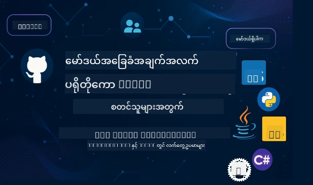

 

[](https://GitHub.com/microsoft/mcp-for-beginners/graphs/contributors)
[](https://GitHub.com/microsoft/mcp-for-beginners/issues)
[](https://GitHub.com/microsoft/mcp-for-beginners/pulls)
[](http://makeapullrequest.com)

[](https://GitHub.com/microsoft/mcp-for-beginners/watchers)
[](https://GitHub.com/microsoft/mcp-for-beginners/fork)
[](https://GitHub.com/microsoft/mcp-for-beginners/stargazers)


[](https://discord.gg/nTYy5BXMWG)

Follow these steps to get started using these resources:
1. **Fork the Repository**: Click [](https://GitHub.com/microsoft/mcp-for-beginners/fork)
2. **Clone the Repository**:   `git clone https://github.com/microsoft/mcp-for-beginners.git`
3. **Join The** [](https://discord.gg/nTYy5BXMWG)


### 🌐 Multi-Language Support

#### Supported via GitHub Action (Automated & Always Up-to-Date)

<!-- CO-OP TRANSLATOR LANGUAGES TABLE START -->
[Arabic](../ar/README.md) | [Bengali](../bn/README.md) | [Bulgarian](../bg/README.md) | [Burmese (Myanmar)](./README.md) | [Chinese (Simplified)](../zh-CN/README.md) | [Chinese (Traditional, Hong Kong)](../zh-HK/README.md) | [Chinese (Traditional, Macau)](../zh-MO/README.md) | [Chinese (Traditional, Taiwan)](../zh-TW/README.md) | [Croatian](../hr/README.md) | [Czech](../cs/README.md) | [Danish](../da/README.md) | [Dutch](../nl/README.md) | [Estonian](../et/README.md) | [Finnish](../fi/README.md) | [French](../fr/README.md) | [German](../de/README.md) | [Greek](../el/README.md) | [Hebrew](../he/README.md) | [Hindi](../hi/README.md) | [Hungarian](../hu/README.md) | [Indonesian](../id/README.md) | [Italian](../it/README.md) | [Japanese](../ja/README.md) | [Kannada](../kn/README.md) | [Korean](../ko/README.md) | [Lithuanian](../lt/README.md) | [Malay](../ms/README.md) | [Malayalam](../ml/README.md) | [Marathi](../mr/README.md) | [Nepali](../ne/README.md) | [Nigerian Pidgin](../pcm/README.md) | [Norwegian](../no/README.md) | [Persian (Farsi)](../fa/README.md) | [Polish](../pl/README.md) | [Portuguese (Brazil)](../pt-BR/README.md) | [Portuguese (Portugal)](../pt-PT/README.md) | [Punjabi (Gurmukhi)](../pa/README.md) | [Romanian](../ro/README.md) | [Russian](../ru/README.md) | [Serbian (Cyrillic)](../sr/README.md) | [Slovak](../sk/README.md) | [Slovenian](../sl/README.md) | [Spanish](../es/README.md) | [Swahili](../sw/README.md) | [Swedish](../sv/README.md) | [Tagalog (Filipino)](../tl/README.md) | [Tamil](../ta/README.md) | [Telugu](../te/README.md) | [Thai](../th/README.md) | [Turkish](../tr/README.md) | [Ukrainian](../uk/README.md) | [Urdu](../ur/README.md) | [Vietnamese](../vi/README.md)

> **Prefer to Clone Locally?**

> This repository includes 50+ language translations which significantly increases the download size. To clone without translations, use sparse checkout:
> ```bash
> git clone --filter=blob:none --sparse https://github.com/microsoft/mcp-for-beginners.git
> cd mcp-for-beginners
> git sparse-checkout set --no-cone '/*' '!translations' '!translated_images'
> ```
> This gives you everything you need to complete the course with a much faster download.
<!-- CO-OP TRANSLATOR LANGUAGES TABLE END -->

# 🚀 စတင်တတ်နိုင်သူများအတွက် Model Context Protocol (MCP) သင်ရိုးညွှန်းတမ်း

## **C#, Java, JavaScript, Rust, Python, နှင့် TypeScript ဖြင့် လက်တွေ့ ကုဒ်နမူနာများစွာဖြင့် MCP ကိုလေ့လာပါ**

## 🧠 Model Context Protocol သင်ရိုးညွှန်းတမ်း၏ အနှစ်ချုပ်
Model Context Protocol (MCP) လောကထဲသို့ မင်္ဂလာပါ။ သင်သည် AI အပလီကေးရှင်းများသည် ကိရိယာများနှင့် ဝန်ဆောင်မှုများအပြောင်းအလဲ ပြောဆိုဆက်သွယ်ပုံကို စဉ်းစားဖူးခဲ့ပါက၊ သင်သည် ဖန်တီးသူများအနေဖြင့် စွမ်းအင်မြှင့်တင်နိုင်သော စနစ်အရာများကို ပြုပြင်ပြောင်းလဲနေသော ပေါ်လစီတစ်ခုကို တွေ့ရှိမည်ဖြစ်သည်။

MCP ကို AI အပလီကေးရှင်းများအတွက် ကမ္ဘာလုံးဆိုင်ရာ ဘာသာပြန်သံလွှားတစ်ခုဟု ထင်ပါ။ USB ဆိပ်ကမ်းများက မည်သည့်ကိရိယာမဆို ကြိုးမဲ့ချိတ်ဆက်နိုင်သည့်အတိုင်း MCP သည် AI မော်ဒယ်များကို မည်သည့်ကိရိယာ သို့မဟုတ် ဝန်ဆောင်မှု သို့မဆို စံသတ်မှတ်ထားသော နည်းလမ်းဖြင့် ချိတ်ဆက်နိုင်ရန် လက်ခံထားသည်။ သင်၏ပထမဆုံး chatbot ကို တည်ဆောက်ပါက သို့မဟုတ် ရှုပ်ထွေးသော AI လုပ်ငန်းစဉ်များပေါ်တွင် အလုပ်လုပ်ပါက MCP ကိုနားလည်သွားခြင်းဖြင့် ပိုမိုစွမ်းရည်ပြည့်ဝပြီး အလွယ်တကူသုံးနိုင်သော အပလီကေးရှင်းများကို ဖန်တီးနိုင်မည်ဖြစ်သည်။

ဤသင်ရိုးညွှန်းတမ်းမှာ သင်၏သင်ယူမှု ခရီးကို သည်းခံမှုနှင့် သတိထားမှု ဖြင့် တည်ဆောက်ထားပါသည်။ သင်သည် ရိုးရှင်းပြီး ရိုးရာ ဗဟုသုတရှိသော အကြောင်းအရာများဖြင့် စတင်ကာ ကြိုက်နှစ်သက်သော ပရိုဂရမ်းမင်းဘာသာစကားဖြင့် လက်တွေ့လေ့ကျင့်မှုများဖြင့် သင်၏ကျွမ်းကျင်မှုကို တစ်ဆင့်ခြားတိုးတက်အောင်လုပ်ပါမည်။ အဆင့်တိုင်းတွင် နားလည်ရလွယ်ကူသော ရှင်းလင်းချက်များ၊ လက်တွေ့ နမူနာများနှင့် အားပေးမှုများလည်း ပါဝင်ပါသည်။

ဤခရီးအပြီးတွင် သင်သည် မိမိရဲ့ MCP ဆာဗာများကို တည်ဆောက်နိုင်ခြင်း၊ လူကြိုက်များသော AI ပလက်ဖောင်းများနှင့် ပေါင်းစပ်အသုံးပြုနိုင်ခြင်း နှင့် ဤနည်းပညာက AI ဖွံ့ဖြိုးတိုးတက်မှု၏ အနာဂတ်ကို မည်သို့ပြောင်းလဲနေသည်ကို နားလည်ထားနိုင်ချိန် သို့ရောက်ရှိမည်ဖြစ်ပါသည်။ ဒီစိတ်လှုပ်ရှားဖွယ် ခရီးစဉ်ကိုအတူတကွ စလိုက်ကြပါစို့!

### တရားဝင်စာရွက်စာတမ်းများနှင့် သတ်မှတ်ချက်များ

ဤရင်းမြစ်များမှာ သင်၏နားလည်မှုများ တိုးတက်လာသည့်အခါ ပို၍တန်ဖိုးရှိလာပါမည်၊ သို့သော် အားလုံးကို ချက်ချင်းဖတ်ရန် ဖိအားမခံပါနဲ့။ သင်စိတ်ဝင်စားသည့် နေရာများမှ စတင်ဖတ်ရှုပါ!
- 📘 [MCP Documentation](https://modelcontextprotocol.io/) – ကိုယ်တိုင်မြန်ဆန်စွာ လေ့လာနိုင်သော လမ်းညွှန်များ နှင့် အသုံးပြုသူ ညွှန်ကြားချက်များပါရှိသော သင်ခန်းစာအတွက် အဓိကရင်းမြစ်।
- 📜 [MCP Specification](https://modelcontextprotocol.io/docs/) – အကျဉ်းချုပ် အညွန်းစာအုပ်တစ်အုပ်လိုဖြစ်သည်။ သင်သည် သင်ရိုးကို လေ့လာနေစဉ် တိကျသော အသေးစိတ်များကိုရှာဖွေ သို့မဟုတ် ထူးခြားသော လုပ်ဆောင်ချက်များကို စူးစမ်းနိုင်မည်။
- 📜 [Original MCP Specification](https://modelcontextprotocol.io/specification/versioning) – ပိုမိုရှုပ်ထွေးသော အကောင်အထည်ဖော်တည်ဆောက်မှုများအတွက် အသုံးဝင်နိုင်သည့် နည်းပညာအသေးစိတ် ပါဝင်သည်။ ပိုမိုတိုးတက်သော လုပ်ဆောင်ချက်များအတွက် လိုအပ်ပါက သုံးနိုင်မည် ဖြစ်သော်လည်း အစပိုင်းတွင် စိတ်ပူစရာ မလိုပါ။
- 🧑‍💻 [MCP GitHub Repository](https://github.com/modelcontextprotocol) – မတူညီသည့် ပရိုဂရမ်းမင်းဘာသာစကားများဖြင့် SDK များ၊ ကိရိယာများနှင့် ကုဒ်နမူနာများ ပါရှိသည်။
- 🌐 [MCP Community](https://github.com/orgs/modelcontextprotocol/discussions) – MCP နှင့်ပတ်သက်သော ဆွေးနွေးပွဲများတွင် တက်ကြွစွာ ဝင်ရောက် ပါဝင်နိုင်သော ပူးပေါင်း ဆဲလျာမှုရှိသော မိတ်ဆွေများအုပ်စု။

## သင်ယူရမည့် မျှော်မှန်းချက်များ

ဤသင်ရိုးပတ်လမ်း ပြီးဆုံးသောအခါ သင်သည် သင်၏ အသစ်ရရှိသော စွမ်းရည်များအပေါ် ယုံကြည်မှုရှိပြီး စိတ်လှုပ်ရှားနေပါလိမ့်မည်။ သင်သည်အောက်ပါ အချက်များကို မှီဝဲ ပြီး တတ်မြောက်ပါလိမ့်မည်-

• **MCP အခြေခံသဘောတရားများကို နားလည်ရန်**: Model Context Protocol ဆိုသည်မှာ မည်သို့ AI အပလီကေးရှင်းများ အတူတကွ တက်ကြွစွာ လုပ်ဆောင်ပုံကို လွယ်လင့်တယ်နားလည်နိုင်သော ဟောပြောချက်များနှင့် နမူနာများဖြင့် ခွဲခြား ဖော်ပြပေးပါမည်။

• **မိမိ၏ ပထမဆုံး MCP ဆာဗာအား တည်ဆောက်ရန်**: ကြိုက်နှစ်သက်သော ပရိုဂရမ်းမင်းဘာသာစကားဖြင့် စတင်ကာ ပုံမှန်နမူနာများသုံး၍ ပထမဆုံး MCP ဆာဗာကို တည်ဆောက်ပြီး ကျွမ်းကျင်မှု မြှင့်တင်ပါမည်။

• **AI မော်ဒယ်များကို အမှန်တကယ် ကိရိယာများနှင့် ချိတ်ဆက်ရန်**: AI မော်ဒယ်များနှင့် လက်တွေ့ ဝန်ဆောင်မှုများအကြား အချက်အလက်များ လွယ်ကူစွာတွေ့ဆုံဖလှယ်နိုင်ရန် ပြင်းထန်စွာ တိုးတက်စေမည့် နည်းလမ်းအား သင်ယူပါမည်။

• **လုံခြုံရေး လုပ်ထုံးလုပ်နည်းများ အကောင်အထည်ဖော်ရန်**: မိမိ၏ MCP များကို လုံခြုံစိတ်ချစေပြီး အသုံးပြုသူများနှင့် အပလီကေးရှင်းများကို ကာကွယ်ထားနိုင်မည့် ဦးစားပေး လုံခြုံရေးနည်းလမ်းများကို နားလည်ပါမည်။

• **ယုံကြည်စိတ်ချစွာ ဖြန့်ချိ ရေးဆွဲရန်**: ဖွံ့ဖြိုးမှုပြုလုပ်မှုပြီးနောက် MCP ပရောဂျက်များကို အမှန်တကယ် အသုံးချနိုင်သော ဖြန့်ချိမှုနည်းဗျူဟာများနဲ့ အသုံးဝင်စွာ ပြုလုပ်နိုင်ပါလိမ့်မည်။

• **MCP အသိုင်းအဝိုင်းတွင် ပါဝင်ပါ**: MCP အသုံးပြုသူအသစ်များနှင့် ဖန်တီးသူများ အဆုံးမဲ့ တိုးတက်နေသော အသိုင်းအဝိုင်း၏ အစိတ်အပိုင်းတစ်ခု ဖြစ်လာပါလိမ့်မည်။

## အခြေခံဖြစ်ကြောင်း သိရှိခြင်း

MCP အကြောင်းအသေးစိတ်သို့ ရောက်ရှိမည် မတိုင်မီ အခြေခံ အကြောင်းအရာများကို နားလည်ထားရမည်။ ဤနယ်ပယ်များတွင် ကျွမ်းကျင်သူ မဟုတ်လျှင်စိတ်မပူပါနဲ့ - သင်လိုအပ်သည့်အချက်အလက်အားလုံးကို လေ့လာသင်ယူ မည်ဖြစ်သည်။

### ပရိုတိုကောများ၏နားလည်မှု (အခြေခံ)

ပရိုတိုကောကို စကားပြောဆိုရေး ဥပဒေများလို ယူဆပါ။ မိတ်ဆွေတစ်ယောက်ကို ဖုန်းခေါ်လျှင် "ဟယ်လို" ဟု ပြောကြပြီး စကားပြောခွင့်ကို လဲလှယ်ကာ အဆုံးသတ်၍ "သွားတော့မယ်" ဟု ပြောကြသည်ဟူ၍ သဘောတူပါသည်။ ကွန်ပျူတာပရိုဂရမ်များသည် ထိုအတိုင်း စည်းမျဉ်းများ လိုအပ်သည်။

MCP သည် AI မော်ဒယ်များနှင့် အပလီကေးရှင်းများကို ကိရိယာများနှင့် ဝန်ဆောင်မှုများဆီ "စကားပြော" လုပ်ရန် ဆင်တူ စည်းမျဉ်းများ ဖြစ်သည်။ လူကြားစကားပြောဆိုရာတွင် စည်းမျဉ်းများရှိခြင်းက အဆင်ပြေစေသလို MCP ရှိခြင်းက AI အပလီကေးရှင်းများ အပြန်အလှန် ဆက်သွယ်ရာတွင် ယုံကြည်မှုနှင့် ထိရောက်မှုကို တိုးတက်စေသည်။

### Client-Server ဆက်ဆံရေးများ (ပရိုဂရမ်းများ၏ ပူးပေါင်းဆောင်ရွက်ပုံ)

သင်နေ့တိုင်း client-server ဆက်ဆံရေးများ အသုံးပြုနေပြီးဖြစ်သည်! ဝဘ်ဘောက်စရာ (client) ကိုသုံး၍ ဝဘ်ဆိုက်တစ်ခု သွားရောက်လျှင် ဝဘ်ဆာဗာမှ စာမျက်နှာအချက်အလက်များ ပေးပိုက်သည်။ ဘောက်စရာသည် မေးမြန်းရန် နည်းလမ်းကို သိပြီး ဆာဗာသည် ပြန်ဖြေ တတ်သည်။

MCP တွင်လည်း ဆင်တူ client-server ဆက်ဆံရေး ရှိသည်- AI မော်ဒယ်များသည် အချက်အလက် သို့မဟုတ် လုပ်ဆောင်ချက် များကို တောင်းဆိုသော client အဖြစ် သန့်ရှင်းပြီး MCP ဆာဗာများက ၎င်းအတွက် လိုအပ်ချက်များကို ဖြေရှင်းပေးသည်။ အဆိုပါ MCP ဆာဗာကို AI ၏ ကူညီအကူအညီအဖြစ် ယူဆနိုင်သည်။

### စံချိန်စံညွှန်းထားခြင်း၏ အရေးပါပုံ (အတူတကွ လုပ်ဆောင်ရန်)

မော်တော်ကားကုမ္ပဏီတိုင်းက သံပတ်ပုံစံ မတူပေမယ့် အဆီဖြည့်စက်ပုံစံ မတူပါက မော်တော်ကားတစ်စီးစီအတွက် ချိတ်ဆက်စက်ကိရိယာထူးခြားချက်များ လိုက်နာရမည်ဖြစ်ပေ ။

MCP သည် AI အပလီကေးရှင်းများအတွက် စံချိန်သတ်မှတ်ချက် တစ်ခုဖြစ်ပြီး AI မော်ဒယ်တိုင်း အတိအကျ မတူညီသော ကိရိယာများနှင့် သီးခြားရေးသားထားသော ကုဒ်များ မလိုအပ်ဘဲ ထိန်းညှိချက် တစ်မျိုးဖြင့် ဆက်သွယ်နိုင်စေသည်။ ထို့ကြောင့် ဖန်တီးသူများသည် ကိရိယာတစ်ခုကို တည်ဆောက်ပြီး များစွာသော AI စနစ်များနှင့် အသုံးချနိုင်သည်။

## 🧭 သင်ယူမှုလမ်းကြောင်း အနှစ်ချုပ်

သင့် MCP ခရီးသည် သိပ္ပံနှင့် ကျွမ်းကျင်မှု များ တိုးတက်လာစေရန် စနစ်တကျ တည်ဆောက်ထားသည်။ အဆင့်တစ်ခုစီမှာ သင့်တွင် လေ့လာပြီးသားအကြောင်းအရာများကို အားဖြည့်ပေးကြောင်း အသစ်တစ်ခုစီကို မိတ်ဆက်ပေးမည်။

### 🌱 အခြေခံ အဆင့်: အခြေခံတွေ နားလည်ခြင်း (မော်ဂျူး ၀-၂)

သင်၏ စွန့်စားခန်းကို ဒီနေရာကနေ စတင်ပါပြီ။ MCP အကြောင်းအရာများကို သိသာမြင်သာသော ရှင်းတမ်းများနှင့် ရိုးရိုးလေး နမူနာများဖြင့် မိတ်ဆက်ပေးမည်။ MCP ဆိုတာဘာလဲ၊ အတွက်ဘာလဲ၊ AI ဖွံ့ဖြိုးတိုးတက်မှု တစ်ခုအဖြစ် ဘယ်လို ပါဝင်တာလဲ ဆိုတာ မြင်သာပါလိမ့်မည်။

• **မော်ဂျူး ၀ - MCP နိဒါန်း**: MCP ရဲ့ အဓိက အထောက်အကူများနှင့် အသုံးဝင်မှု အကြောင်းကို စမ်းသပ်လေ့လာမည်။ MCP ကို တည်ဆောက်သူများ ကြုံတွေ့နေသော ပြဿနာများကို MCP မည်သို့ ဖြေရှင်းသည်၊ သက်သေများနှင့် ဆွဲဆောင်မှုများ လင့်ခ်ပါမည်။

• **မော်ဂျူး ၁ - အဓိက အသိပညာများ ရှင်းလင်းခြင်း**: MCP ၏ အခြေခံအစိတ်အပိုင်းများကို ရိုးရှင်းသေချာစွာ မိတ်ဆက်ပေးမည်။ အနားလည်ရန် လွယ်ကူစေဖို့ အချုပ်အခြာစက်များ၊ ကွဲပြားသော ဥပမာနဲ့ ရုပ်ပုံများ အသုံးပြုမည်။

• **မော်ဂျူး ၂ - MCP တွင် လုံခြုံရေး**: လုံခြုံရေးသည် စိတ်ဖိစီးမှုဖြစ်နိုင်ပေမယ့် MCP ၌ ထည့်သွင်းထားသော လုံခြုံအင်အားကောင်းသော လုပ်ဆောင်ချက်များနှင့် သင့်အက်ပ်များကို စတင်ကာကွယ်သည့် အကောင်းဆုံး လေ့လာရေးများကို တင်ပြမည်။

### 🔨 တည်ဆောက်ခြင်း အဆင့်: ပထမဆုံး အကောင်အထည်ဖော်ခြင်း (မော်ဂျူး ၃)

ယခုမှစပြီး စိတ်လှုပ်ရှားဖွယ်ရာ စတင်မိပါပြီ! MCP ဆာဗာများနှင့် client များကို လက်တွေ့ အတူတူ တည်ဆောက်မည်။ စိတ်မပူပါနဲ့ - ရိုးရှင်းပြီး လမ်းညွှန်ချက်များ နဲ့ လိုက်ဖက်ကာ ပံ့ပိုးမပေးပါမည်။

ဤမော်ဂျူးတွင် သင်ကြိုက်နှစ်သက်သော ပရိုဂရမ်မင်းဘာသာစကားများဖြင့် လေ့ကျင့်နိုင်သော လမ်းညွှန်ချက်များစွာ ပါဝင်သည်။ သင်၏ ပထမဆုံး ဆာဗာကို တည်ဆောက်ပြီး ၎င်းနှင့် ချိတ်ဆက်ရန် client တစ်ခု ပြုလုပ်ကာ VS Code ကဲ့သို့ လူကြိုက်များသော ဖွံ့ဖြိုးရေးကိရိယာများနဲ့ ပေါင်းစပ်အသုံးပြုနိုင်ပါမည်။
Each guide includes complete code examples, troubleshooting tips, and explanations of why we make specific design choices. By the end of this phase, you'll have working MCP implementations you can be proud of!

### 🚀 Growing Phase: Advanced Concepts and Real-World Application (Modules 4-5)

With the basics mastered, you're ready to explore more sophisticated MCP features. We'll cover practical implementation strategies, debugging techniques, and advanced topics like multi-modal AI integration.

You'll also learn how to scale your MCP implementations for production use and integrate with cloud platforms like Azure. These modules prepare you to build MCP solutions that can handle real-world demands.

### 🌟 Mastery Phase: Community and Specialization (Modules 6-11)

The final phase focuses on joining the MCP community and specializing in areas that interest you most. You'll learn how to contribute to open-source MCP projects, implement advanced authentication patterns, and build comprehensive database-integrated solutions.

Module 11 deserves special mention - it's a complete 13-lab hands-on learning path that teaches you to build production-ready MCP servers with PostgreSQL integration. It's like a capstone project that brings together everything you've learned!

### 📚 Complete Curriculum Structure

| Module | Topic | Description | Link |
|--------|-------|-------------|------|
| **Module 1-3: Fundamentals** | | | |
| 00 | Introduction to MCP | Overview of the Model Context Protocol and its significance in AI pipelines | [Read more](./00-Introduction/README.md) |
| 01 | Core Concepts Explained | In-depth exploration of core MCP concepts | [Read more](./01-CoreConcepts/README.md) |
| 02 | Security in MCP | Security threats and best practices | [Read more](./02-Security/README.md) |
| 03 | Getting Started with MCP | Environment setup, basic servers/clients, integration | [Read more](./03-GettingStarted/README.md) |
| **Module 3: Building Your First Server & Client** | | | |
| 3.1 | First Server | Create your first MCP server | [Guide](./03-GettingStarted/01-first-server/README.md) |
| 3.2 | First Client | Develop a basic MCP client | [Guide](./03-GettingStarted/02-client/README.md) |
| 3.3 | Client with LLM | Integrate large language models | [Guide](./03-GettingStarted/03-llm-client/README.md) |
| 3.4 | VS Code Integration | Consume MCP servers in VS Code | [Guide](./03-GettingStarted/04-vscode/README.md) |
| 3.5 | stdio Server | Create servers using stdio transport | [Guide](./03-GettingStarted/05-stdio-server/README.md) |
| 3.6 | HTTP Streaming | Implement HTTP streaming in MCP | [Guide](./03-GettingStarted/06-http-streaming/README.md) |
| 3.7 | AI Toolkit | Use AI Toolkit with MCP | [Guide](./03-GettingStarted/07-aitk/README.md) |
| 3.8 | Testing | Test your MCP server implementation | [Guide](./03-GettingStarted/08-testing/README.md) |
| 3.9 | Deployment | Deploy MCP servers to production | [Guide](./03-GettingStarted/09-deployment/README.md) |
| 3.10 | Advanced server usage | Use advanced servers for advanced feature usage and improved architecture | [Guide](./03-GettingStarted/10-advanced/README.md) |
| 3.11 | Simple auth | A chapter showing you auth from the beginning and RBAC | [Guide](./03-GettingStarted/11-simple-auth/README.md) |
| **Module 4-5: Practical & Advanced** | | | |
| 04 | Practical Implementation | SDKs, debugging, testing, reusable prompt templates | [Read more](./04-PracticalImplementation/README.md) |
| 05 | Advanced Topics in MCP | Multi-modal AI, scaling, enterprise use | [Read more](./05-AdvancedTopics/README.md) |
| 5.1 | Azure Integration | MCP Integration with Azure | [Guide](./05-AdvancedTopics/mcp-integration/README.md) |
| 5.2 | Multi-modality | Working with multiple modalities | [Guide](./05-AdvancedTopics/mcp-multi-modality/README.md) |
| 5.3 | OAuth2 Demo | Implement OAuth2 authentication | [Guide](./05-AdvancedTopics/mcp-oauth2-demo/README.md) |
| 5.4 | Root Contexts | Understand and implement root contexts | [Guide](./05-AdvancedTopics/mcp-root-contexts/README.md) |
| 5.5 | Routing | MCP routing strategies | [Guide](./05-AdvancedTopics/mcp-routing/README.md) |
| 5.6 | Sampling | Sampling techniques in MCP | [Guide](./05-AdvancedTopics/mcp-sampling/README.md) |
| 5.7 | Scaling | Scale MCP implementations | [Guide](./05-AdvancedTopics/mcp-scaling/README.md) |
| 5.8 | Security | Advanced security considerations | [Guide](./05-AdvancedTopics/mcp-security/README.md) |
| 5.9 | Web Search | Implement web search capabilities | [Guide](./05-AdvancedTopics/web-search-mcp/README.md) |
| 5.10 | Realtime Streaming | Build realtime streaming functionality | [Guide](./05-AdvancedTopics/mcp-realtimestreaming/README.md) |
| 5.11 | Realtime Search | Implement realtime search | [Guide](./05-AdvancedTopics/mcp-realtimesearch/README.md) |
| 5.12 | Entra ID Auth | Authentication with Microsoft Entra ID | [Guide](./05-AdvancedTopics/mcp-security-entra/README.md) |
| 5.13 | Foundry Integration | Integrate with Azure AI Foundry | [Guide](./05-AdvancedTopics/mcp-foundry-agent-integration/README.md) |
| 5.14 | Context Engineering | Techniques for effective context engineering | [Guide](./05-AdvancedTopics/mcp-contextengineering/README.md) |
| 5.15 | MCP Custom Transport | Custom Transport implementations | [Guide](./05-AdvancedTopics/mcp-transport/README.md) |
| **Module 6-10: Community & Best Practices** | | | |
| 06 | Community Contributions | How to contribute to the MCP ecosystem | [Guide](./06-CommunityContributions/README.md) |
| 07 | Insights from Early Adoption | Real-world implementation stories | [Guide](./07-LessonsFromEarlyAdoption/README.md) |
| 08 | Best Practices for MCP | Performance, fault-tolerance, resilience | [Guide](./08-BestPractices/README.md) |
| 09 | MCP Case Studies | Practical implementation examples | [Guide](./09-CaseStudy/README.md) |
| 10 | Hands-on Workshop | Building an MCP Server with AI Toolkit | [Lab](./10-StreamliningAIWorkflowsBuildingAnMCPServerWithAIToolkit/README.md) |
| **Module 11: MCP Server Hands On Lab** | | | |
| 11 | MCP Server Database Integration | Comprehensive 13-lab hands-on learning path for PostgreSQL integration | [Labs](./11-MCPServerHandsOnLabs/README.md) |
| 11.1 | Introduction | Overview of MCP with database integration and retail analytics use case | [Lab 00](./11-MCPServerHandsOnLabs/00-Introduction/README.md) |
| 11.2 | Core Architecture | Understanding MCP server architecture, database layers, and security patterns | [Lab 01](./11-MCPServerHandsOnLabs/01-Architecture/README.md) |
| 11.3 | Security & Multi-Tenancy | Row Level Security, authentication, and multi-tenant data access | [Lab 02](./11-MCPServerHandsOnLabs/02-Security/README.md) |
| 11.4 | Environment Setup | Setting up development environment, Docker, Azure resources | [Lab 03](./11-MCPServerHandsOnLabs/03-Setup/README.md) |
| 11.5 | Database Design | PostgreSQL setup, retail schema design, and sample data | [Lab 04](./11-MCPServerHandsOnLabs/04-Database/README.md) |
| 11.6 | MCP Server Implementation | Building the FastMCP server with database integration | [Lab 05](./11-MCPServerHandsOnLabs/05-MCP-Server/README.md) |
| 11.7 | Tool Development | Creating database query tools and schema introspection | [Lab 06](./11-MCPServerHandsOnLabs/06-Tools/README.md) |
| 11.8 | Semantic Search | Implementing vector embeddings with Azure OpenAI and pgvector | [Lab 07](./11-MCPServerHandsOnLabs/07-Semantic-Search/README.md) |
| 11.9 | Testing & Debugging | Testing strategies, debugging tools, and validation approaches | [Lab 08](./11-MCPServerHandsOnLabs/08-Testing/README.md) |
| 11.10 | VS Code Integration | Configuring VS Code MCP integration and AI Chat usage | [Lab 09](./11-MCPServerHandsOnLabs/09-VS-Code/README.md) |
| 11.11 | Deployment Strategies | Docker deployment, Azure Container Apps, and scaling considerations | [Lab 10](./11-MCPServerHandsOnLabs/10-Deployment/README.md) |
| 11.12 | Monitoring | Application Insights, logging, performance monitoring | [Lab 11](./11-MCPServerHandsOnLabs/11-Monitoring/README.md) |
| 11.13 | Best Practices | Performance optimization, security hardening, and production tips | [Lab 12](./11-MCPServerHandsOnLabs/12-Best-Practices/README.md) |

### 💻 Sample Code Projects

One of the most exciting parts of learning MCP is seeing your code skills develop progressively. We've designed our code examples to start simple and grow more sophisticated as your understanding deepens. Here's how we introduce concepts - with code that's easy to understand but demonstrates real MCP principles, you'll understand not just what this code does, but why it's structured this way and how it fits into larger MCP applications.

#### Basic MCP Calculator Samples

| Language | Description | Link |
|----------|-------------|------|
| C# | MCP Server Example | [View Code](./03-GettingStarted/samples/csharp/README.md) |
| Java | MCP Calculator | [View Code](./03-GettingStarted/samples/java/calculator/README.md) |
| JavaScript | MCP Demo | [View Code](./03-GettingStarted/samples/javascript/README.md) |
| Python | MCP Server | [View Code](../../03-GettingStarted/samples/python/mcp_calculator_server.py) |
| TypeScript | MCP Example | [View Code](./03-GettingStarted/samples/typescript/README.md) |
| Rust | MCP Example | [View Code](./03-GettingStarted/samples/rust/README.md) |

#### Advanced MCP Implementations

| Language | Description | Link |
|----------|-------------|------|
| C# | Advanced Sample | [View Code](./04-PracticalImplementation/samples/csharp/README.md) |
| Java with Spring | Container App Example | [View Code](./04-PracticalImplementation/samples/java/containerapp/README.md) |
| JavaScript | Advanced Sample | [View Code](./04-PracticalImplementation/samples/javascript/README.md) |
| Python | Complex Implementation | [View Code](../../04-PracticalImplementation/samples/python/READMEmd) |
| TypeScript | Container Sample | [View Code](./04-PracticalImplementation/samples/typescript/README.md) |


## 🎯 Prerequisites for Learning MCP

To get the most out of this curriculum, you should have:

- Basic knowledge of programming in at least one of the following languages: C#, Java, JavaScript, Python, or TypeScript
- Understanding of client-server model and APIs
- Familiarity with REST and HTTP concepts
- (Optional) Background in AI/ML concepts

- Joining our community discussions for support

## 📚 Study Guide & Resources

This repository includes several resources to help you navigate and learn effectively:

### Study Guide

A comprehensive [Study Guide](./study_guide.md) is available to help you navigate this repository effectively. This visual curriculum map shows how all the topics connect and provides guidance on how to use the sample projects effectively. It's especially helpful if you're a visual learner who likes to see the big picture.

The guide includes:
- A visual curriculum map showing all topics covered
- Detailed breakdown of each repository section
- Guidance on how to use sample projects
- Recommended learning paths for different skill levels
- Additional resources to complement your learning journey

### Changelog

We maintain a detailed [Changelog](./changelog.md) that tracks all significant updates to the curriculum materials, so you can stay current with the latest improvements and additions.
- New content additions
- Structural changes
- Feature improvements
- Documentation updates

## 🛠️ How to Use This Curriculum Effectively

Each lesson in this guide includes:
1. MCP ကိုယ်စားပြုแนวคิดများကို ထင်ရှားရှင်းလင်းစွာရှင်းပြပေးခြင်း  
2. ဘာသာစကားအမျိုးမျိုးဖြင့် ကိုယ်တိုင်ကြည့်နိုင်သော ကုဒ်နမူနာများ  
3. အမှန်တကယ် MCP အသုံးပြုကိရိယာများ ဆောက်လုပ်ရန် လေ့ကျင့်ခန်းများ  
4. မြင့်မားသောအဆင့်သင်ယူသူများအတွက် ထပ်ဆောင်းအရင်းအမြစ်များ

## လိုအပ်သလို ကြည့်ရှုနိုင်သော အကြောင်းအရာ

### [MCP Dev Days July 2025](https://developer.microsoft.com/en-us/reactor/series/S-1563/)
#### [➡️Watch on Demand - MCP Dev Days](https://developer.microsoft.com/en-us/reactor/series/S-1563/)
MCP Dev Days တွင် နည်းပညာအထူးတန်းဖြစ်မှု၊ လူမှုအသိုင်းအဝိုင်း ချိတ်ဆက်မှုနှင့် လက်တွားသင်ယူမှုတို့ကို နှစ်ရက်တာအတွင်း ခံစားနိုင်ရန် အဆင်သင့်ဖြစ်ပါစေ။ Model Context Protocol (MCP) ကို အဓိကထား၍ ကျင်းပသော ဒီ ပြင်ပ အစီအစဉ်မှာ AI မော်ဒယ်များနှင့် ၎င်းတို့၏ ရည်မှန်းထားသော ကိရိယာများကို ချိတ်ဆက်ပေးသည့် အသစ်ထွက်လာသော စံတော်ချိန်တစ်ခုဖြစ်သည်။  
MCP Dev Days ကို https://aka.ms/mcpdevdays တွင် မှတ်ပုံတင်၍ ကြည့်ရှုနိုင်ပါသည်။

#### [Day 1: MCP Productivity, DevTools, & Community:](https://developer.microsoft.com/en-us/reactor/series/S-1563/)

ဒီနေ့မှာ MCP ကို တည်ဆောက်သူများ workflow ထဲတွင် အသုံးပြုနိုင်ရန် အားပေးခြင်း၊ MCP လူမှုအသိုင်းအဝိုင်း ထဲမှ မိတ်ဆွေများနှင့် သမိုင်းအတိတ်တွေရဲ့ဖော်ပြချက်များရှိသည်။ Arcade, Block, Okta, နှင့် Neon ကဲ့သို့သော မိတ်ဖက်များနှင့် Microsoft တို့ ပူးပေါင်းဆောင်ရွက်မှုမှတဆင့် ဖွင့်လွှင့်နိုင်သော MCP ecosystem ကို ရေးဆွဲနေတာကို တွေ့မြင်ရမည်။  
VS Code, Visual Studio, GitHub Copilot, လူကြိုက်များသော လူမှုစနစ်ကိရိယာများနှင့် ပတ်သက်သော ကိုယ်တိုင်သရုပ်ပြမှုများ  
လက်တွေ့အခြေအနေများနှင့် အထူးအခြေအနေများအပေါ် အခြေခံ dev workflow များ  
လူမှုအသိုင်းအဝိုင်းပိုင်းဆိုင်ရာ အစီအစဉ်များနှင့် အမြင်များ  
MCP နှင့် မိတ်ဆက်တာ စပြီဖြစ် သော်လည်း ထုတ်လုပ်မှုဆိုင်ရာ တည်ဆောက်မှုများတွင်ပါ ပါဝင်နေသူများအတွက် Day 1 သည် ရည်ရွယ်ချက်နှင့် လုပ်ဆောင်ရန်နည်းလမ်းများပေးမည်ဖြစ်သည်။

#### [Day 2: Build MCP Servers with Confidence](https://developer.microsoft.com/en-us/reactor/series/S-1563/)

MCP ဆောက်လုပ်သူများအတွက်ဖြစ်ပြီး  MCP servers များ ဖန်တီးခြင်းနှင့် MCP ကို AI workflow များတွင် ထည့်သွင်း အသုံးပြုခြင်းဆိုင်ရာ အကောင်းဆုံး နည်းဗျူဟာနှင့် အကောင်းဆုံး လေ့ကျင့်မှုများကို နက်နက်ရှိုင်းရှိုင်း ချိတ်ဆက်တယ်။

#### အကြောင်းအရာများမှာ -

- MCP Servers ဖန်တီးခြင်းနှင့် agent အတွေ့အကြုံများထဲသို့ ထည့်သွင်းခြင်း  
- Prompt လမ်းညွှန်ပြီး ဖွံ့ဖြိုးတိုးတက်မှု  
- ဆာဖတ်တန်ဖိုးမြင့် လုံခြုံရေး စနစ်များ  
- Functions, ACA နှင့် API Management ကဲ့သို့သော အဆောက်အအုံများ အသုံးပြုခြင်း  
- Registry ကို တကျောင်းတည်း စနစ်တကျ ထိန်းညှိပေးခြင်း (1P + 3P)

သင်သည် Developer, Tool Builder သို့မဟုတ် AI product strategy area အတွက် ရည်မှန်းထားသူဖြစ်လျှင် ဒီနေ့ရက်မှာ scalable, secure, နှင့် အနာဂတ်မွန်ကန်သော MCP ဖြေရှင်းချက်များထုတ်လုပ်ရန် လိုအပ်သော အမြင်များနှင့် အရေးကြီးသော သတင်းအချက်အလက်များပါဝင်သည်။

### MCP Boot Camp August 2025
MCP servers များ ဖန်တီးနည်း၊ VS Code ဖြင့် စပ်ဆက်နည်း၊ Azure ပေါ်တွင် လေ့လာသင်ကြားမှုများအရ ပရော်ဖက်ရှင်နယ် တည်ဆောက်နည်းများကို စိတ်အားထက်သန်စွာ တက်ရောက်နိုင်ပါသည်။ MCP for Beginners သင်ခန်းစာမှ အကြောင်းအရာများအပေါ် မူတည်ပြီး အထူးပြုသော နည်းပညာနှင့်အတူ လက်တွေ့ကျွမ်းကျင်မှုများ ရရှိပါမည်။

#### [➡️Watch on Demand MCP Bootcamp | English](https://developer.microsoft.com/en-us/reactor/series/s-1568/)
#### [➡️Watch on Demand MCP Bootcamp | Brasil](https://developer.microsoft.com/en-us/reactor/series/S-1566/)
#### [➡️Watch on Demand MCP Bootcamp | Spanish](https://developer.microsoft.com/en-us/reactor/series/S-1567/)

### Let's Learn MCP with C# - Tutorial Series
Model Context Protocol (MCP) ကို လေ့လာရင်း AI မော်ဒယ်များနှင့် client applications များ ကြား ဆက်သွယ်မှုကို စံသတ်မှတ်ချက်တစ်ခုအဖြစ် ဖွဲ့စည်းထားသော cutting-edge framework ဖြစ်ပါသည်။ ဒီ beginner-friendly စာရင်းပိုင်းမှတဆင့် MCP ကို မိတ်ဆက်ပေးပြီး သင့်ရဲ့ ပထမဆုံး MCP server ကို ဖန်တီးပုံကို ခန့်မှန်းညွှန်ပြပေးပါမည်။  
#### C#: [https://aka.ms/letslearnmcp-csharp](https://aka.ms/letslearnmcp-csharp)  
#### Java: [https://aka.ms/letslearnmcp-java](https://aka.ms/letslearnmcp-java)  
#### JavaScript: [https://aka.ms/letslearnmcp-javascript](https://aka.ms/letslearnmcp-javascript)  
#### Python: [https://aka.ms/letslearnmcp-python](https://aka.ms/letslearnmcp-python)

## 🎓 သင်၏ MCP ခရီးစဉ် စတင်ပါပြီ

ဂုဏ်ယူပါတယ်! သင်သည် ပရိုဂရမ်မင်း ကျွမ်းကျင့်မှုများ တိုးချဲ့ရန်နှင့် AI ဖွံ့ဖြိုးတိုးတက်မှု၏ နောက်ဆုံးပန်းတိုင်များနှင့် ချိတ်ဆက်ရေးရာအတွက် စိတ်လှုပ်ရှားဖြစ်စရာ ခရီးစဉ်ကို စတင်လိုက်ပြီဖြစ်သည်။

### သင် ယခုထိ ပြီးမြောက်ထားသော အရာများ

ဒီမိတ်ဆက်စာမျက်နှာကို ဖတ်ရှုခြင်းဖြင့် သင်သည် MCP အကြောင်းအသိပညာ အခြေခံ ရရှိစတင်ထားပြီး ဖြစ်သည်။ MCP ဆိုတာ ဘာလဲ၊ ဘာကြောင့် အရေးကြီးသလဲ၊ ဒီ သင်ရိုးညွှန်းမှုက သင့်တိုးတက်မှုခရီးစဉ်ကို ဘယ်လို ကူညီပေးမှာလဲ ဆိုတာကို နားလည်တတ်မြောက်ထားပါတယ်။ ဒါဟာ အရေးပါသော အောင်မြင်မှုတစ်ခု ဖြစ်ပြီး ဒီ နည်းပညာ သုံးနိုင်မှုများ အတွက် သင်၏ သိပ္ပံပညာ  အခြေခံ ဖြစ်ပါသည်။

### လျှောက်လှမ်းနည်းမော်တော်

သင်သည် modules များစွာဖြတ်သန်းသွားမည်ဖြစ်ပြီး အတတ်ပညာရှင်တစ်ဦးအားလုံးက စတင်မှသာ တကျော့အလျားရှိခဲ့ကြတယ်ဆိုတာကို မေ့မထား။ အခုခေတ်မှာ ရှုပ်ထွေးစရာ များသောအကြောင်းအရာများဟာ လေ့ကျင့်မှုနှင့် အသုံးချမှုဖြင့် သဘာဝကျကျ ဖြစ်လာမယ်။ ခြေလှမ်းတိုတိုတိုင်းက သင်၏ ဖွံ့ဖြိုးတိုးတက်မှုကို အားဖြည့်ပေးမည်ဖြစ်သည်။

### သင်၏ ထောက်ခံအားကူညီမှုကွန်ရက်

သင်သည် MCP ကို စိတ်အားထက်သန်ပြီး အခြားသူများကို ကူညီလိုသော သင်ယူသူများနှင့် ကွပ်ကဲမှုရှိသော အဖွဲ့အစည်းရဲ့ အဖျော်ယမကာတစ်ခုပါဝင်နေသည်။ ကုဒ်ရေးသည့်ပြဿနာတစ်ခုတွင် အတားအဆီး ရှိပါက သို့မဟုတ် ရရှိသော ရလဒ်တစ်ခုကို မျှဝေလိုပါက လူမှုအသိုင်းအဝိုင်းက သင့်အား ကူညီရမည်။

AI အက်ပ်များ ဖန်တီးရာတွင် အခက်အခဲတွေ့ပါက MCP နှင့် ပတ်သက်သော လေ့လာသူများနှင့် အတွေ့အကြုံရှိသူများ အတူတူဆွေးနွေးပါ။ ဒီကွန်ရက်သည် မေးခွန်းများအား လွတ်လပ်စွာ မေးမြန်းနိုင်ပြီး အသိပညာကို မျှဝေသည့် အဖွဲ့အစည်းတစ်ခုဖြစ်သည်။

[](https://discord.gg/nTYy5BXMWG)

ထုတ်ကုန်တုံ့ပြန်ချက် သို့မဟုတ် ဖန်တီးစဉ် အမှားများဖြစ်ပါက အောက်ပါနေရာသို့ သွားရောက်ကြည့်ရှုပါ -

[](https://aka.ms/foundry/forum)

### စတင်ရန် အသင့်ဖြစ်ပြီလား?

သင်၏ MCP ခရီးစဉ်ကို ယခုစတင်လိုက်ပါ! Module 0 မှ စတင်ပြီး ပထမဆုံး MCP လက်တွေ့အတွေ့အကြုံများ ထည့်သွင်းလေ့လာပါ၊ ဒါမှမဟုတ် ပုံစံ စမ်းသပ်မှု ပစ္စည်းများကို ကြည့်ရှုပြီး ဆောက်လုပ်မည့်အရာများကို ခန့်မှန်းကြည့်ပါ။ သတိထားပါ - အတတ်ပညာရှင်တိုင်းသည် သင်ရှိနေသည့် အချက်မှ စတင်ခဲ့ပြီး သည်းခံမှုနှင့် လေ့ကျင့်မှုဖြင့် မည်သည့် အောင်မြင်မှုကိုမဆို ရောင့်ရဲရပါမည်။

Model Context Protocol ဖွံ့ဖြိုးရေးကမ္ဘာသို့ ကြိုဆိုပါတယ်။ ကျွန်တော်တို့ အတူတကွ အံ့သြဖွယ်အရာတစ်ခုကို တည်ဆောက်ကြရအောင်!

## 🤝 သင်ယူမှု လူမှုအသိုင်းအဝိုင်းတွင် လှုပ်ရှားခြင်း

ဒီ သင်ရိုးညွှန်းမှုကို သင်တို့လို သင်ယူသူများ၏ ထောက်ပံ့မှုဖြင့် အားကောင်းလာပါသည်။ သင်သည် တစ်လုံးတည်းစာလုံးပြင်ခြင်း၊ ပိုမိုရှင်းလင်းသေချာသောရှင်းပြချက်တစ်ခု ထပ်ထည့်ရန် သို့မဟုတ် နမူနာအသစ်တစ်ခု ထပ်တင်ရန်ဖြစ်စေ သင်၏ ထောက်ပံ့မှုများက အခြား စတင်သင်ယူသူများအထောက်အကူဖြစ်စေပါသည်။

ခေတ်မီကုဒ်နမူနာများ ပံ့ပိုးပေးသူ Microsoft Valued Professional [Shivam Goyal](https://www.linkedin.com/in/shivam2003/) ကို ကျေးဇူးတင်ပါတယ်။

ထောက်ပံ့မှုလုပ်ငန်းစဉ်ကို ကြိုဆိုပြီး အထောက်အပံ့ရရှိစေဖို့ ရေးဆွဲထားပါတယ်။ အများစုသော ထောက်ပံ့မှုများအတွက် Contributor License Agreement (CLA) လိုအပ်ပါသည်။ ဒီလိုက်နာရမည့် စနစ်ကို ကြိုးပမ်းမှုပြုလုပ်စဉ်မှာ အလိုအလျောက် အတူ သွားပါလိမ့်မည်။

## 📜 အခမဲ့ပေါ်လွင်သင်ယူမှု

ဒီ လုံးဝ သင်ရိုးညွှန်းမှုကို MIT [LICENSE](../../LICENSE) ချုပ်ဆိုမှုဖြင့် ထုတ်ပြန်ထားသောကြောင့် သင်သည် အချိုးအစား ပြောင်းလဲ၊ နှင့် လွတ်လပ်စွာ မျှဝေခံနိုင်ပါသည်။ ကျွန်တော်တို့၏ ရည်ရွယ်ချက်မှာ MCP ပညာကို Developer များအားလုံး အတွက် ရရှိနိုင်စေရန်ဖြစ်သည်။
## 🤝 ထောက်ပံ့မှု လမ်းညွှန်ချက်များ

ဤပရောဂျက်သည် ထောက်ပံ့မှုများနှင့် အကြံပြုချက်များကို ကြိုဆိုပါသည်။  အများဆုံး ထောက်ပံ့မှုများအတွက် Contributor License Agreement (CLA) ဖြင့် သင်၏ ထောက်ပံ့မှုကို သုံးနိုင်မှုအခွင့်အရေး ကို မိုက်ခရိုဆိုဖ်တ် သို့တင်ပြ သောကြောင့် စီမံခန့်ခွဲမှုအတွက် သင် အသိမှတ်ပြုရပါမည်။ အသေးစိတ်အချက်အလက်များအတွက် <https://cla.opensource.microsoft.com> သို့လေ့လာပါ။

သင် pull request တင်သည့်အခါ CLA bot သည် သင် ဖြည့်စွက်ရမည့် CLA အရှိ/မရှိကို အလိုအလျောက်စာရမှတ် ပြုလုပ်ပြီး PR တွင် သင့်တော်သော အတည်ပြုချက်များ (ဉပမာ status check, comment) ကို ထည့်သွင်းပေးပါလိမ့်မည်။ ဘော့မှ ပေးသည့် လမ်းညွှန်ချက်များအတိုင်း လိုက်နာ လုပ်ဆောင်ပါ။ သင်သည် CLA နဲ့ ပတ်သက်သော အတည်ပြုချက်ကို တစ်ကြိမ်တည်းသာ ရှိသော repos အားလုံးအတွက် လိုက်နာရမှာဖြစ်သည်။

ဤပရောဂျက်အတွက် [Microsoft Open Source Code of Conduct](https://opensource.microsoft.com/codeofconduct/) ကို အသုံးပြုထားပြီး ဖြစ်ပါသည်။ ပိုမိုသိရှိလိုပါက [Code of Conduct FAQ](https://opensource.microsoft.com/codeofconduct/faq/) ကို ကြည့်ရှုပါ သို့မဟုတ် [opencode@microsoft.com](mailto:opencode@microsoft.com) ကို မေးမြန်း ဆက်သွယ်နိုင်ပါသည်။

---

*သင်၏ MCP ခရီးစဉ်ကို စတင်ဖို့ အသင့်ပါသလား? [Module 00 - Introduction to MCP](./00-Introduction/README.md) နှင့် စတင်ပြုလုပ်ပြီး Model Context Protocol ဖွံ့ဖြိုးရေးကမ္ဘာထဲ သို့ ပထမထပ်ကို ခြေလှမ်း ခဲ့ပါ!*


## 🎒 အခြားသင်တန်းများ
ကျွန်တော်တို့ အသင်းမှ အခြားသင်တန်းများကိုလည်း ထုတ်လုပ်တင်ဆက်နေသည်။ ကြည့်ရှုလိုက်ပါ -

<!-- CO-OP TRANSLATOR OTHER COURSES START -->
### LangChain
[](https://aka.ms/langchain4j-for-beginners)
[](https://aka.ms/langchainjs-for-beginners?WT.mc_id=m365-94501-dwahlin)

---

### Azure / Edge / MCP / Agents
[](https://github.com/microsoft/AZD-for-beginners?WT.mc_id=academic-105485-koreyst)
[](https://github.com/microsoft/edgeai-for-beginners?WT.mc_id=academic-105485-koreyst)
[](https://github.com/microsoft/mcp-for-beginners?WT.mc_id=academic-105485-koreyst)
[](https://github.com/microsoft/ai-agents-for-beginners?WT.mc_id=academic-105485-koreyst)

---
 
### Generative AI Series
[](https://github.com/microsoft/generative-ai-for-beginners?WT.mc_id=academic-105485-koreyst)
[-9333EA?style=for-the-badge&labelColor=E5E7EB&color=9333EA)](https://github.com/microsoft/Generative-AI-for-beginners-dotnet?WT.mc_id=academic-105485-koreyst)
[-C084FC?style=for-the-badge&labelColor=E5E7EB&color=C084FC)](https://github.com/microsoft/generative-ai-for-beginners-java?WT.mc_id=academic-105485-koreyst)
[-E879F9?style=for-the-badge&labelColor=E5E7EB&color=E879F9)](https://github.com/microsoft/generative-ai-with-javascript?WT.mc_id=academic-105485-koreyst)

---
 
### Core Learning
[](https://aka.ms/ml-beginners?WT.mc_id=academic-105485-koreyst)
[](https://aka.ms/datascience-beginners?WT.mc_id=academic-105485-koreyst)
[](https://aka.ms/ai-beginners?WT.mc_id=academic-105485-koreyst)
[](https://github.com/microsoft/Security-101?WT.mc_id=academic-96948-sayoung)
[](https://aka.ms/webdev-beginners?WT.mc_id=academic-105485-koreyst)
[](https://aka.ms/iot-beginners?WT.mc_id=academic-105485-koreyst)
[](https://github.com/microsoft/xr-development-for-beginners?WT.mc_id=academic-105485-koreyst)

---
 
### Copilot စီးရီး
[](https://aka.ms/GitHubCopilotAI?WT.mc_id=academic-105485-koreyst)
[](https://github.com/microsoft/mastering-github-copilot-for-dotnet-csharp-developers?WT.mc_id=academic-105485-koreyst)
[](https://github.com/microsoft/CopilotAdventures?WT.mc_id=academic-105485-koreyst)
<!-- CO-OP TRANSLATOR OTHER COURSES END -->

---

<!-- CO-OP TRANSLATOR DISCLAIMER START -->
**ေၾကညာခ်က္**:
ဤစာတမ္းကို AI ဘာသာျပန္ခြင့္ျဖင့္ [Co-op Translator](https://github.com/Azure/co-op-translator) အသံုးျပဳၿပီး ဘာသာျပန္ထားပါသည္။ တိကျမွန်ကန္ျခင္းကို ကြိဳးစားသည့္အေပၚမူတည္၍၊ အလိုအေလြ်ာက္ ဘာသာျပန္ျခင္းတြင္ အမွား သို့မဟုတ္ မမွန္ကန္ခ်က္မ်ား ပါရွိႏိုင္သည့္ အခ်က္ကို သိရွိထားေပးပါ။ မူရင္းစာတမ္းကို ေဒသခံဘာသာစကားျဖင့္ အေတာ္ေတာ္အေရးႀကီးေသာ အခ်က္အလက္အတြက္ ေအာက္ပါအတိုင္း တရားဝင္အခ်က္အလက္အေနျဖင့္ သင့္အား အသိေပးလိုပါတယ္။ အေရးႀကီးေသာ အခ်က္အလက္မ်ားအတြက္ လူ႔ဘာသာျပန္သူ တစ္ေယာက္၏ လုပ္ငန္းအတတ္ပညာ ေဖာ္ျပခ်က္ကို အသံုးျပဳရန္ ေၾကညာလိုပါသည္။ ဒီဘာသာျပန္ျခင္းကို အသံုးျပဳျခင္းသည္ ေပၚေပါက္လာတတ္ေသာ နားလည္မႈမွားခြင့္မ်ား သို႔မဟုတ္ မွားယြင္းဆက္ဆံမႈမ်ားအတြက္ တာဝန္မရွိပါကြောင်း ေၾကညာပါသည္။
<!-- CO-OP TRANSLATOR DISCLAIMER END -->