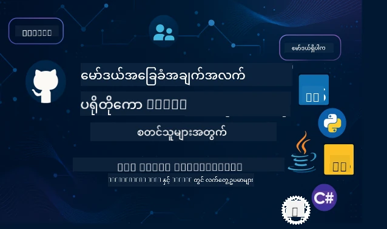

 

[](https://GitHub.com/microsoft/mcp-for-beginners/graphs/contributors)
[](https://GitHub.com/microsoft/mcp-for-beginners/issues)
[](https://GitHub.com/microsoft/mcp-for-beginners/pulls)
[](http://makeapullrequest.com)

[](https://GitHub.com/microsoft/mcp-for-beginners/watchers)
[](https://GitHub.com/microsoft/mcp-for-beginners/fork)
[](https://GitHub.com/microsoft/mcp-for-beginners/stargazers)


[](https://discord.gg/nTYy5BXMWG)

Follow these steps to get started using these resources:
1. **Fork the Repository**: Click [](https://GitHub.com/microsoft/mcp-for-beginners/fork)
2. **Clone the Repository**:   `git clone https://github.com/microsoft/mcp-for-beginners.git`
3. **Join The** [](https://discord.gg/nTYy5BXMWG)


### 🌐 မတူညီတဲ့ဘာသာစကားများအတွက် ထောက်ပံ့မှု

#### GitHub Action (အလိုအလျောက်နှင့် အမြဲအသစ်ဆုံး) မှတဆင့် ထောက်ပံ့ထားသည်

<!-- CO-OP TRANSLATOR LANGUAGES TABLE START -->
[Arabic](../ar/README.md) | [Bengali](../bn/README.md) | [Bulgarian](../bg/README.md) | [Burmese (Myanmar)](./README.md) | [Chinese (Simplified)](../zh-CN/README.md) | [Chinese (Traditional, Hong Kong)](../zh-HK/README.md) | [Chinese (Traditional, Macau)](../zh-MO/README.md) | [Chinese (Traditional, Taiwan)](../zh-TW/README.md) | [Croatian](../hr/README.md) | [Czech](../cs/README.md) | [Danish](../da/README.md) | [Dutch](../nl/README.md) | [Estonian](../et/README.md) | [Finnish](../fi/README.md) | [French](../fr/README.md) | [German](../de/README.md) | [Greek](../el/README.md) | [Hebrew](../he/README.md) | [Hindi](../hi/README.md) | [Hungarian](../hu/README.md) | [Indonesian](../id/README.md) | [Italian](../it/README.md) | [Japanese](../ja/README.md) | [Kannada](../kn/README.md) | [Korean](../ko/README.md) | [Lithuanian](../lt/README.md) | [Malay](../ms/README.md) | [Malayalam](../ml/README.md) | [Marathi](../mr/README.md) | [Nepali](../ne/README.md) | [Nigerian Pidgin](../pcm/README.md) | [Norwegian](../no/README.md) | [Persian (Farsi)](../fa/README.md) | [Polish](../pl/README.md) | [Portuguese (Brazil)](../pt-BR/README.md) | [Portuguese (Portugal)](../pt-PT/README.md) | [Punjabi (Gurmukhi)](../pa/README.md) | [Romanian](../ro/README.md) | [Russian](../ru/README.md) | [Serbian (Cyrillic)](../sr/README.md) | [Slovak](../sk/README.md) | [Slovenian](../sl/README.md) | [Spanish](../es/README.md) | [Swahili](../sw/README.md) | [Swedish](../sv/README.md) | [Tagalog (Filipino)](../tl/README.md) | [Tamil](../ta/README.md) | [Telugu](../te/README.md) | [Thai](../th/README.md) | [Turkish](../tr/README.md) | [Ukrainian](../uk/README.md) | [Urdu](../ur/README.md) | [Vietnamese](../vi/README.md)

> **ဒေသတွင်းမှ မိတ္တူယူရန် ပိုပြီး စိတ်တိုင်းကျပါသလား?**
>
> ဒီ Repository မှာ ၅၀ ကျော် ဘာသာပြန်စာတမ်းတွေ ပါရှိတာကြောင့် ဒေါင်းလုတ်အရွယ်အစား ကဲ့သို့ တိုးတက်ပါတယ်။ ဘာသာပြန်စာတမ်း မပါဘဲ မိတ္တူယူရန် sparse checkout ကို အသုံးပြုပါ:
>
> **Bash / macOS / Linux:**
> ```bash
> git clone --filter=blob:none --sparse https://github.com/microsoft/mcp-for-beginners.git
> cd mcp-for-beginners
> git sparse-checkout set --no-cone '/*' '!translations' '!translated_images'
> ```
>
> **CMD (Windows):**
> ```cmd
> git clone --filter=blob:none --sparse https://github.com/microsoft/mcp-for-beginners.git
> cd mcp-for-beginners
> git sparse-checkout set --no-cone "/*" "!translations" "!translated_images"
> ```
>
> အဘယ်ကြောင့်ဆိုသော် သင့်ကိုယ်ပိုင် သင်တန်းကို မြန်ဆန်စွာ ပြီးမြောက်နိုင်ဖို့ အတွက် လိုအပ်သမျှအားလုံး ရရှိသွားပါလိမ့်မယ်။
<!-- CO-OP TRANSLATOR LANGUAGES TABLE END -->

# 🚀 Model Context Protocol (MCP) အခြေခံသူများအတွက် သင်ရိုးညွှန်းတမ်း

## **C#, Java, JavaScript, Rust, Python နှင့် TypeScript မှာ လက်တွေ့ကိရိယာနောက်ခံ ကုဒ်နမူနာများဖြင့် MCP ကို သင်ယူပါ**

## 🧠 Model Context Protocol သင်ရိုးညွှန်းတမ်း အကြောင်းအကျဥ်း

Model Context Protocol အတွင်း ခရီးစဉ်သို့ ကြိုဆိုပါသည်! AI အပလီကေးရှင်းများက ဘယ်လို ကိရိယာများနှင့် ဝန်ဆောင်မှုများနှင့် ဆက်သွယ်သည်ကို ဘယ်တော့မှ စိတ်ဝင်စားခဲ့ပြီးဖြစ်ပါက၊ ဒီလှပသော ဖြေရှင်းချက်ကို သင်ရှာတွေ့မည်ဖြစ်ပြီး အဲဒါက အတက်အကျ ဆောင်ရွက်နည်းကို ပြောင်းလဲနေပါပြီ။

MCP ကို AI အပလီကေးရှင်းများအတွက် အပြည့်အဝ ဘာသာပြန်ကိရိယာတစ်ခုအဖြစ် စဉ်းစားပါ - USB ပေါက်များက မည်သည့်ကိရိယာမျိုးမဆို သင့်ကွန်ပျူတာနှင့် ချိတ်ဆက်နိုင်သလို၊ MCP က AI မော်ဒယ်များကို မည်သည့်ကိရိယာ သို့မဟုတ် ဝန်ဆောင်မှုမဆို စံနှုန်းတူနည်းဖြင့် ချိတ်ဆက်ရန် ခွင့်ပြုသည်။ သင့် ပထမဆုံး ချတ်ဘော့ အပလီကေးရှင်းကို ဆောက်ရန် ဖြစ်စေ၊ ရှုပ်ထွေးသော AI စနစ်များအတွက် အလုပ်လုပ်ရန်ဖြစ်စေ၊ MCP ကို နားလည်ခြင်းဖြင့် ပိုမိုစွမ်းဆောင်ရည်ရှိပြီး လွယ်ကူသော အပလီကေးရှင်းများ ဖန်တီးနိုင်မယ်။

ဒီ သင်ရိုးညွှန်းတမ်းကို သင်ယူရေးခရီးမှာ  သည်းခံမှုနဲ့ သေချာစွာ ကိုယ်စားပြုထားသည်။ သင့်လက်တွင် ရှိပြီးသား ရိုးရှင်းသော အယူအဆများကနေ စတင်ပြီး မိမိနှစ်သက်ရာ Programming ဘာသာစကားဖြင့် လက်တွေ့လုပ်ကာ ကျွမ်းကျင်မှုတိုးတက်မှုကို တဖြည်းဖြည်း တိုးတက်စေမယ်။ အဆင့်တိုင်းမှာရှင်းလင်းသော ရှင်းပြချက်များ၊ လက်တွေ့ ဥပမာများနှင့် စိတ်အားထက်သန်စေနိုင်သော အားပေးမှုများ ပါဝင်သည်။

ဒီခရီးကို ပြီးမြောက်သောအခါ သင့်ကိုယ်ပိုင် MCP ဆာဗာများ ဖန်တီးနိုင်မယ်၊ လူကြိုက်အများဆုံး AI ပလက်ဖောင်းများနှင့် ပေါင်းစည်းနိုင်မယ်၊ ဒီနည်းပညာသည် AI ဖွံ့ဖြိုးတိုးတက်မှု၏ အနာဂတ်ကို မည်သို့ ပြောင်းလဲနေသည်ကို နားလည်ကြမယ်။ စိတ်လှုပ်ရှားဖွယ် ဒီ ခရီးစဉ်ကို အတူတကွ စတင်ကြရအောင်!

### တရားဝင်စာရွက်စာတမ်းနှင့် ဖော်ပြချက်များ

ဒီသင်ရိုးညွှန်းတမ်းသည် **MCP Specification 2025-11-25** (နောက်ဆုံးမပြောင်းလဲသေးသော ဗားရှင်း) နှင့် ကိုက်ညီထားသည်။ MCP specification သည် ရက်စွဲအခြေပြု ဗားရှင်း (YYYY-MM-DD ဖော်မတ်) ကို အသုံးပြု၍ စနစ်တကျ protocol ဗားရှင်းများကို ခွဲခြားထားသည်။

အဆိုပါအရင်းအမြစ်များကို သင့်နားလည်မှု တိုးလာ၍ ဆာလငယ်မြင်က ရတနာတန်ဆာများလို ဖြစ်လာမည် သို့မဟုတ် မဖြတ်တောက်ဘဲ စိတ်ညစ်စရာမဖြစ်အောင် မျက်မှောက် စတင်စိုက်ထုတ်ပါ။
- 📘 [MCP Documentation](https://modelcontextprotocol.io/) – ဒီနေရာမှာ လမ်းညွှန်ချက်များ၊ အသုံးပြုသူလမ်းညွှန်စာအုပ်များကို ပုံမှန်စနစ်တကျ ရှာတွေ့နိုင်ပါသည်။ စတင်သင်ယူသူများအတွက် ရိုးရှင်းသော ဥပမာများကို ထည့်သွင်းရေးသားထားပြီး ကိုယ့်အလျောက် တိုးတက်စေမည်။
- 📜 [MCP Specification](https://modelcontextprotocol.io/specification/2025-11-25) – ဒီစာတမ်းကို သင့်ရဲ့ တကယ့်လမ်းညွှန် များအဖြစ်ယူနိုင်သည်။ သင့်သင်ရိုးညွှန်းတမ်းကို လေ့လာသွားစဉ် အထူးအသေးစိတ်များနှင့် တိုးတက်နည်းများကို ရှာဖွေရန် ဒီနေရာကို ပြန်လာရောက်ကြည့်ပါလိမ့်မယ်။
- 📜 [MCP Specification Versioning](https://modelcontextprotocol.io/specification/versioning) – protocol ဗားရှင်းသမိုင်းနဲ့ MCP ရက်စွဲအခြေပြု ဗားရှင်း အသုံးပြုခြင်းအကြောင်း ပါဝင်သည်။
- 🧑‍💻 [MCP GitHub Repository](https://github.com/modelcontextprotocol) – အမျိုးမျိုးသော programming ဘာသာစကားများဖြင့် SDK များ၊ ကိရိယာများနှင့် ကုဒ်နမူနာများကို တွေ့နိုင်သည့် သိုလှောင်ကွန်တော့ ဖြစ်ပါသည်။
- 🌐 [MCP Community](https://github.com/orgs/modelcontextprotocol/discussions) – MCP နည်းပညာ စင်တာလူ့အသိုင်းအဝိုင်းတွင်တွဲဖက်လေ့လာသူများနှင့် အတွေ့အကြုံရှိ developer များနှင့် ဆွေးနွေးပါ။ မေးခွန်းများကို ကြိုဆိုပြီး အတူတကွ သိမှုမျှဝေသော အဖွဲ့အစည်းတစ်ခု ဖြစ်ပါသည်။
  
## သင်ယူမှု ရည်မှန်းချက်များ

ဒီသင်ရိုးညွှန်းတမ်းပြီးဆုံးသောအခါ သင်သည် သင့်ရဲ့ နယူးကျွမ်းကျင်မှုများကို ယုံကြည်မှုရှိပြီး စိတ်လှုပ်ရှားနေတာကို ခံစားမယ်။ ရရှိမယ့် ပညာရပ်တွေက:

• **MCP အခြေခံများ နားလည်ခြင်း**: Model Context Protocol ဆိုတာဘာလဲ၊ AI အပ်ပလီကေးရှင်းများ ပြောဆိုဆက်သွယ်မှုအတွက် ဘယ်လို ရာဇဝင်ဖန်တီးနေသည် ဆိုတာ နားလည်သဖြင့် ရိုးရာအတိုင်းအတာနဲ့ ဥပမာများဖြင့် ဖော်ပြပါမယ်။

• **သင့် ပထမဆုံး MCP ဆာဗာတည်ဆောက်ခြင်း**: မိမိနှစ်သက်ရာ Programming ဘာသာစကားဖြင့် လက်တွေ့ MCP ဆာဗာတစ်ခု တည်ဆောက်နိုင်ရန်၊ ရိုးရှင်းသော နမူနာများဖြင့် စတင်ကာ တစ်ဆင့်ချင်းတိုးတက်စေမယ်။

• **AI မော်ဒယ်များကို တကယ့်ကိရိယာများနှင့် ချိတ်ဆက်ခြင်း**: AI မော်ဒယ်များနဲ့ တကယ့်ဝန်ဆောင်မှုများကြား လမ်းကြောင်း တည်ဆောက်ခြင်းကို သင်ယူမည်၊ မိမိဤရည်မှန်းချက်ဖြင့် အပလီကေးရှင်းများကို လုပ်ဆောင်ချက်များပိုမိုစွမ်းဆောင်နိုင်စေမယ်။

• **လုံခြုံရေးအကောင်းဆုံး လေ့လာမှုများ ကျင့်သုံးခြင်း**: MCP ရဲ့ လုံခြုံမှုနောက်ခံများကို နားလည်ပြီး မိမိအပလီကေးရှင်း နဲ့ အသုံးပြုသူများကို မလုံခြုံမှုမှ ကာကွယ်ရန် နည်းလမ်းတွေတည်ဆောက်မယ်။

• **ယုံကြည်စိတ်ချမှုနဲ့ ထုတ်လွှင့်ခြင်း**: MCP ပရောဂျက်များကို ဖွံ့ဖြိုးမှုပြီးလို့ ထုတ်လုပ်မှုဆီသို့ ရောက်အောင် အပြုသဘောဆောင်တဲ့ deployment နည်းလမ်းများကို ကိုင်တွယ်နိုင်မယ်။

• **MCP လူမှုအသိုင်းအဝိုင်းအသက်ဝင်ခြင်း**: AI အပ်ပလီကေးရှင်း ဖန်တီးရေးနယ်ပယ်မှာ အနာဂတ်ကို ပုံသေနိုင်သူ စွမ်းအားကြီးသော developer များအဖွဲ့အစည်းတစ်ခု ဖြစ်လာမယ်။ 

## အရေးကြီးသော နောက်ခံ

MCP အသေးစိတ်သို့ ကြိုးပမ်းသွားရန်မတိုင်မီ အခြေခံအတွေးအခေါ်များကို သေချာ နားလည်ထားရမည်။ မိမိမကျွမ်းကျင်သော်လည်း ရိုးရှင်းစွာ ရှင်းပြပေးသွားမည်ဖြစ်သောကြောင့် စိုးရိမ်ရန်မလိုပါ။

### Protocols နားလည်ခြင်း (အခြေခံအုတ်မြစ်)

Protocol ဆိုတာ ဆက်သွယ်မှု စည်းမျဉ်းစည်းကမ်းများလို ဖြစ်သည်။ မိတ်ဆွေတစ်ယောက်ကို ခေါ်မယ်ဆိုရင် "ဟယ်လို" လို့ ပြောတတ်ရမယ်၊ စကားပြောခေါင်းဖြတ်ကောငျ့များရှိပြီး "ပျော်ပါစေ" ဆိုပြီး နှုတ်ဆက်ရမည်။ ကွန်ပျူတာပရိုဂရမ်များလည်း မတူညီတဲ့ စည်းမျဉ်းများဖြင့် ဆက်သွယ်ကြတယ်။

MCP က protocol တစ်ခုဖြစ်ပြီး AI မော်ဒယ်နှင့် အပြင်ကိရိယာများ၊ ဝန်ဆောင်မှုများတွင် သဘောတူညီချက်ရှိသော စည်းကမ်းများဖြစ်သည်။ လူတွေ စကားပြောရာမှာ စည်းကမ်းတွေရှိခြင်းနဲ့ တူသည်။ MCP က AI အပလီကေးရှင်းလမ်းကြောင်းအသုံးပြုပြီး ထိရောက်စွာ ပြောဆိုဆက်သွယ်နိုင်စေသည်။

### Client-Server ဆက်ဆံရေး (ပရိုဂရမ်တွေ ဘယ်လိုပူးပေါင်းအလုပ်လုပ်သလဲ)

လူတိုင်းသည် client-server ဆက်ဆံရေးကို နေ့စဉ်အသုံးပြုနေပါပြီ။ Web browser (client) ဖြင့် website ကို သွားရောက်ကြည့်သောအခါ၊ မိမိတောင်းဆိုသည့် page စာများကို ဝဘ်ဆာဗာမှ လက်ခံရရှိသည်။ Browser က ဒေတာတောင်းယူ၊ ဆာဗာက တုံ့ပြန်တယ်။

MCP မှာလည်း ဒီလိုပဲ client-server ဆက်ဆံရေးရှိသည်။ AI မော်ဒယ်တွေ client အဖြစ်လုပ်ဆောင်ပြီး အချက်အလက် သို့မဟုတ် အချက်အလက်တစ်စုံတစ်ရာကို တောင်းဆိုသည်။ MCP ဆာဗာများက ဒီတာကို ဖြေကြားပေးသည်။ ဒါဟာ helper assistant (ဆာဘား) တစ်ယောက်လို ဖြစ်ပြီး AI ကို အကူအညီပေးသွားသည်။

### စံနှုန်းထားမှု အရေးပါမှု (အရာအားလုံးကို ပူးပေါင်းအလုပ်လုပ်စေခြင်း)

တစ်ချို့ကားထုတ်လုပ်သူတစ်ဦးချင်းစီက ကြိုးတံပို့ကွက်ပုံစံကွာခြားမှ ကားတစ်စီးစီအတွက် အဆက်အသွယ်ကိရိယာ အမျိုးမျိုးလိုအပ်ရမည်။ စံနှုန်းထားမှုဆိုသည်မှာ အရာအားလုံးကို ပူးပေါင်းအောင် အချက်အလက်များကို သဘောတူညီခြင်းဖြစ်သည်။

MCP သည် AI အပ်ပလီကေးရှင်းများအတွက် အဲဒီ စံနှုန်းထားမှု ဖြစ်သည်။ AI မော်ဒယ်တိုင်းသည် ကိရိယာအသစ် တစ်ခုတီထွင်ရန် မလိုအပ်ပဲ MCP ကို အသုံးပြု၍ စံပြတစ်ခုအတိုင်း ဆက်သွယ်နိုင်သည်။ ဒါကြောင့် developer တွေက တစ်ကြိမ်ကိရိယာ ဖန်တီးရုံနဲ့ မည်သည့် AI စနစ်နဲ့မဆို အလုပ်လုပ်နိုင်သည်။

## 🧭 သင်ယူရေး ခရီးစဉ် အနှစ်ချုပ်

MCP ခရီးစဉ်ကို စိတ်ချယုံကြည်စွာ နှင့် ကျွမ်းကျင်မှု ပြုလုပ်နိုင်စေဖို့ အဆင့်ဆင့် အခြေခံကနေ တိုးတက်လာအောင် စီစဉ်ထားသည်။ အဆင့်တိုင်းမှာ အသစ်အဟောင်း ထပ်မံ အကြောင်းအရာများ နားလည်စေသေးသည်။

### 🌱 အခြေခံ အဆင့်: အခြေခံ အယူအဆ နားလည်ခြင်း (Module 0-2)

ဒီနေရာမှာ သင့်စွန့်စားခန်းစတင်! MCP နည်းပညာများကို သေချာ သိအောင် ရိုးရှင်း ဥပမာများနှင့် အသုံးချ ဖော်ပြမည်။ MCP ဆိုတာ ဘာလဲ၊ ဘာကြောင့် လိုအပ်သလဲ၊ AI အဖွဲ့အစည်းမှာ ဘယ်လို ပါဝင်လဲ ဆိုတာနားလည်ရမည်။

• **Module 0 - MCP အကျဉ်းချုပ်**: MCP ရဲ့ အရေးကြီးချက်နှင့်  AI အပ်လီကေးရှင်းခေတ်သစ်မှာ ဘယ်လို အသုံးဝင်သလဲ၊ MCP ဖြေရှင်းနိုင်တဲ့ ပြဿနာများကို မြင်ရမည်။

• **Module 1 - အဓိက အယူအဆများ ရှင်းပြချက်**: MCP အခြေခံ အစိတ်အပိုင်းများကို ကျယ်ပြန့်စွာ သိအောင် ဥပမာနှင့် ပုံပြင်ပေါ်တွင် ရှင်းလင်းမည်။

• **Module 2 - MCP တွင် လုံခြုံရေး**: လုံခြုံရေးဆိုတာ ကြောက်တတ်စရာ မဟုတ်ပါဘူး၊ MCP မှာ လုံခြုံမှု ကောင်းမွန်စေရန် ဖန်တီးထားသော လုပ်ထုံးလုပ်နည်းများ ထည့်သွင်းထားတာနဲ့ လုံခြုံရေး ကောင်းမွန်စေဖို့ အကောင်းဆုံးနည်းလမ်းများကို သင်ယူမယ်။

### 🔨 ဆောက်လုပ်ခြင်း အဆင့်: သင့် ပထမဆုံး Implementation များ ဖန်တီးခြင်း (Module 3)

အခုမှ အစစ်အမှန် အခန်းကဏ္ဍ စတင်ပါပြီ! သင် လက်တွေ့ MCP ဆာဗာများနှင့် client များ ဖန်တီးရန် အတွေ့အကြုံ ရယူမည်။ စိုးရိမ်စရာ မရှိပဲ ရိုးရှင်းစတင်ပြီး တစ်ဆင့်ချင်း ဦးတည် လမ်းညွှန်မှု ရယူပါမည်။
ဤမော်ဒျူးတွင် သင်နှစ်သက်သည့် ပရိုဂရမ်မင်းဘာသာစကားတွင် လေ့ကျင့်နိုင်ရန် လက်တွေ့လမ်းညွှန်များစွာ ပါဝင်သည်။ သင်သည် သင်၏ ပထမဆုံးဆာဗာကို ဖန်တီးမည်၊ ၎င်းနှင့် ဆက်သွယ်ရန် ကလေးအင်တီးတစ်ရပ် တည်ဆောက်မည်၊ နှင့်မည်သည့် development tools ပေါ်လစီများဖြင့်ပင် ဆက်စပ် ထည့်သွင်းနိုင်မည်ဆိုသည်ကိုလည်း စမ်းသပ်နိုင်သည်။

လမ်းညွှန်တိုင်းတွင် ကုဒ်နမူနာ ပြည့်စုံ၊ ပြဿနာဖြေရှင်းရေးအကြံပြုချက်များနှင့် ဤဒီဇိုင်းရွေးချယ်မှုများကို မည်ကြောင့် ရွေးလိုက်သလဲ ဆိုသည့် ရှင်းပြချက်များ ပါဝင်သည်။ ဤအစိတ်အပိုင်းအဆုံးတွင် သင်သည် အလုပ်ဖြစ်စေသော MCP အကောင်အထည်ဖော်မှုများကို မည်သည့်အရာမှ ဂုဏ်ယူနိုင်ကြောင်း ထိမ်းသိမ်းထားမည်ဖြစ်သည်။

### 🚀 တိုးတက်မှုအဆင့် - ချိုးပွဲခံအယူအဆများနှင့် လက်တွေ့ လျှောက်လွှာ (Module 4-5)

အခြေခံအချက်များ ကို အတွေးပေါ် စွမ်းဆောင်နိုင်သည့်အခြေအနေတွင် သင်သည် MCP ၏ ပိုမိုတောင်တက်သော လုပ်ဆောင်ချက်များကို လေ့လာရန် ပြင်ဆင်ပြီးပါပြီ။ ကျွန်ုပ်တို့သည် လက်တွေ့ အကောင်အထည်ဖော်နည်းများ၊ ပြဿနာဖြေရှင်းနည်းများနှင့် မူလီမော်ဒယ် AI ပေါင်းစပ်မှု ကဲ့သို့သော အဆင့်မြင့်ခေါင်းစဉ်များကို ဖော်ပြပါမည်။

နောက်ထပ် MCP အကောင်အထည်ဖော်မှုများကို ထုတ်လုပ်မှုအတွက် မည်သို့ ပုံစံချနိုင်သည်နှင့် Azure စသည့် cloud platform များနှင့် ပေါင်းစပ် အသုံးပြုနိုင်မှုကိုလည်း သင်ယူမည်ဖြစ်သည်။ ဤမော်ဒျူးများသည် သဘာဝပတ်ဝန်းကျင် လိုအပ်ချက်များကို ကိုင်တွယ်နိုင်သည့် MCP ဖြေရှင်းချက်များကို တည်ဆောက်ရန် သင်ကို ပြင်ဆင်ပေးမည် ဖြစ်သည်။

### 🌟 ကျွမ်းကျင်မှုအဆင့် - လူမှုအသိုင်းအဝိုင်းနှင့် အထူးပြုမှု (Module 6-11)

နောက်ဆုံးအဆင့်သည် MCP လူမှုအသိုင်းအဝိုင်းသို့ ပူးပေါင်းဝင်ရောက်ရန်နှင့် သင့်အားစိတ်ဝင်စားရာနယ်ပယ်များတွင် အထူးပြုရန် အာရုံစိုက်သည်။ သင်သည် open-source MCP ပရောဂျက်များတွင် ကူညီပံ့ပိုးရာ၊ မြင့်မားသော အတည်ပြုမူ ပုံစံများ ကို အကောင်အထည်ဖော်ခြင်းနှင့် အချက်အလက် ဒေတာဘေ့စ်ပေါင်းစပ်ထားသည့် လုံးဝဉာဏ်ပညာဖြေရှင်းချက်များ တည်ဆောက်ရာတွင် လေ့လာသင်ယူမည်ဖြစ်သည်။

Module 11 သည် အထူးသဖြင့် အသိပညာဖြင့်လည်း ထူးခြားသည်။ ၎င်းသည် PostgreSQL ပေါင်းစပ်ပြီး ထုတ်လုပ်မှုအသင့် MCP ဆာဗာများ တည်ဆောက်ရန် သင်ခန်းစာ lab ၁၃ ခုပါဝင်သည့် လက်တွေ့ထက်မြက် သင်ယူမှုလမ်းကြောင်းဖြစ်သည်။ ၎င်းသည် သင်အတူတူ သင်ယူခဲ့သော အရာအားလုံးကို ထည့်သွင်းပြသသည့် အစိတ်အပိုင်း စီမံကိန်းတစ်ခုကဲ့သို့ ဖြစ်ပါသည်။

### 📚 အပြည့်အစုံ သင်ခန်းစာအစီအစဉ် ဖွဲ့စည်းမှု

| Module | ခေါင်းစဉ် | ဖော်ပြချက် | Link |
|--------|-------|-------------|------|
| **Module 0-3: အခြေခံများ** | | | |
| 00 | MCP အကြောင်းအရာမိတ်ဆက် | Model Context Protocol နှင့် AI pipeline များတွင် ၎င်း၏ အရေးပါမှု အနှစ်ချုပ် | [Read more](./00-Introduction/README.md) |
| 01 | အဓိကအယူအဆ ရှင်းလင်းချက် | MCP အဓိကအယူအဆ အကျယ်ပြန့် ရှင်းပြချက် | [Read more](./01-CoreConcepts/README.md) |
| 02 | MCP ၏ လုံခြုံရေး | လုံခြုံရေး မဟုတ်မှုများနှင့် အကောင်းဆုံး မျှဝေပုံများ | [Read more](./02-Security/README.md) |
| 03 | MCP နှင့် စတင်အသုံးပြုခြင်း | ပတ်ဝန်းကျင် ပြင်ဆင်ခြင်း၊ အခြေခံဆာဗာ/ကလီအင့်၊ ပေါင်းစပ်ခြင်း | [Read more](./03-GettingStarted/README.md) |
| **Module 3: ပထမဆုံး ဆာဗာနှင့် ကလီအင့် တည်ဆောက်ခြင်း** | | | |
| 3.1 | ပထမဆုံး ဆာဗာ | ပထမဆုံး MCP ဆာဗာ ဖန်တီးခြင်း | [Guide](./03-GettingStarted/01-first-server/README.md) |
| 3.2 | ပထမဆုံး ကလီအင့် | အခြေခံ MCP ကလီအင့် တည်ဆောက်ခြင်း | [Guide](./03-GettingStarted/02-client/README.md) |
| 3.3 | LLM ပါသည့် ကလီအင့် | မြင်ကွင်းကျယ်သော ဘာသာစကား မော်ဒယ်များ ထည့်သွင်းခြင်း | [Guide](./03-GettingStarted/03-llm-client/README.md) |
| 3.4 | VS Code ပေါင်းစပ်မှု | MCP ဆာဗာများကို VS Code တွင် အသုံးပြုခြင်း | [Guide](./03-GettingStarted/04-vscode/README.md) |
| 3.5 | stdio ဆာဗာ | stdio သယ်ယူပို့ဆောင်မှုဖြင့် ဆာဗာများ ဖန်တီးခြင်း | [Guide](./03-GettingStarted/05-stdio-server/README.md) |
| 3.6 | HTTP စီးဆင်းမှု | MCP တွင် HTTP စီးဆင်းမှု ထည့်သွင်းခြင်း | [Guide](./03-GettingStarted/06-http-streaming/README.md) |
| 3.7 | AI ကိရိယာစုံ | MCP နှင့် AI Toolkit အသုံးပြုခြင်း | [Guide](./03-GettingStarted/07-aitk/README.md) |
| 3.8 | စမ်းသပ်ခြင်း | MCP ဆာဗာ အကောင်အထည်ဖော်မှု စမ်းသပ်ခြင်း | [Guide](./03-GettingStarted/08-testing/README.md) |
| 3.9 | ထုတ်လုပ်မှု | MCP ဆာဗာများကို ထုတ်လုပ်ရန် ထုတ်ပြန်ခြင်း | [Guide](./03-GettingStarted/09-deployment/README.md) |
| 3.10 | အဆင့်မြင့် ဆာဗာ အသုံးပြုမူ | အဆင့်မြင့် လုပ်ဆောင်ချက်များနှင့် အဆောက်အဦးတိုးတက်မှုအတွက် အသုံးပြုခြင်း | [Guide](./03-GettingStarted/10-advanced/README.md) |
| 3.11 | ရိုးရှင်းသော အတည်ပြုမှု | အစအဆုံး အတည်ပြုမှုနှင့် RBAC ကို ပြသသည့်ခေါင်းစဉ် | [Guide](./03-GettingStarted/11-simple-auth/README.md) |
| 3.12 | MCP Hosts | Claude Desktop, Cursor, Cline တို့နှင့် အခြား MCP host များ တပ်ဆင်ခြင်း | [Guide](./03-GettingStarted/12-mcp-hosts/README.md) |
| 3.13 | MCP Inspector | MCP ဆာဗာများ အတည်ပြုစစ်ဆေးရန် နဲ့ Inspector ကိရိယာအသုံးပြုခြင်း | [Guide](./03-GettingStarted/13-mcp-inspector/README.md) |
| 3.14 | Sampling | Sampling ကို အသုံးပြုကလီအင့်နှင့် ပူးပေါင်းလုပ်ဆောင်ခြင်း | [Guide](./03-GettingStarted/14-sampling/README.md) |
| 3.15 | MCP Apps | MCP Apps တည်ဆောက်ခြင်း | [Guide](./03-GettingStarted/15-mcp-apps/README.md) |
| **Module 4-5: လက်တွေ့နှင့် အဆင့်မြင့်** | | | |
| 04 | လက်တွေ့ အကောင်အထည်ဖော်ခြင်း | SDK များ၊ ပြဿနာဖြေရှင်းခြင်း၊ စမ်းသပ်ခြင်း၊ ပြန်လည်အသုံးပြုနိုင်သော prompt အစီအစဉ်များ | [Read more](./04-PracticalImplementation/README.md) |
| 4.1 | Pagination | cursor-based pagination ဖြင့် ဆင်တူ အဖြေများ သိမ်းဆည်းခြင်း | [Guide](./04-PracticalImplementation/pagination/README.md) |
| 05 | MCP တွင် အဆင့်မြင့် ခေါင်းစဉ်များ | မူလီမော်ဒယ် AI ပေါင်းစပ်မှု၊ များပြားစွာ တိုးချဲ့ခြင်း၊ စီးပွားဖြစ် အသုံးပြုမှု | [Read more](./05-AdvancedTopics/README.md) |
| 5.1 | Azure ပေါင်းစပ်ခြင်း | MCP နှင့် Azure ပေါင်းစပ်ခြင်း | [Guide](./05-AdvancedTopics/mcp-integration/README.md) |
| 5.2 | မူလီမော်ဒယ် | မျိုးစုံ မော်ဒယ်များနှင့် လုပ်ကိုင်ခြင်း | [Guide](./05-AdvancedTopics/mcp-multi-modality/README.md) |
| 5.3 | OAuth2 ကို သရုပ်ပြ | OAuth2 အတည်ပြုမူ အကောင်အထည်ဖော်ခြင်း | [Guide](./05-AdvancedTopics/mcp-oauth2-demo/README.md) |
| 5.4 | Root Contexts | root context များကို နားလည်ပြီး အကောင်အထည်ဖော်ခြင်း | [Guide](./05-AdvancedTopics/mcp-root-contexts/README.md) |
| 5.5 | Routing | MCP သယ်ဆောင်ပေးမှု မဟာဗျူဟာများ | [Guide](./05-AdvancedTopics/mcp-routing/README.md) |
| 5.6 | Sampling | MCP တွင် sampling နည်းလမ်းများ | [Guide](./05-AdvancedTopics/mcp-sampling/README.md) |
| 5.7 | Scaling | MCP အကောင်အထည်ဖော်မှု တိုးချဲ့ခြင်း | [Guide](./05-AdvancedTopics/mcp-scaling/README.md) |
| 5.8 | လုံခြုံရေး | အဆင့်မြင့် လုံခြုံရေးဆိုင်ရာ စဉ်းစားချက်များ | [Guide](./05-AdvancedTopics/mcp-security/README.md) |
| 5.9 | Web ရှာဖွေမှု | ဝက်ဘ် ရှာဖွေရေး လုပ်ဆောင်ချက်များ အကောင်အထည်ဖော်ခြင်း | [Guide](./05-AdvancedTopics/web-search-mcp/README.md) |
| 5.10 | အချိန်နောက်ကျ Streaming | အချိန်နောက်ကျ စီးဆင်းမှု လုပ်နိုင်ခြင်း တည်ဆောက်ခြင်း | [Guide](./05-AdvancedTopics/mcp-realtimestreaming/README.md) |
| 5.11 | အချိန်နောက်ကျ ရှာဖွေမှု | အချိန်နောက်ကျ ရှာဖွေရေး အကောင်အထည်ဖော်ခြင်း | [Guide](./05-AdvancedTopics/mcp-realtimesearch/README.md) |
| 5.12 | Entra ID အတည်ပြုမူ | Microsoft Entra ID ဖြင့် အတည်ပြုခြင်း | [Guide](./05-AdvancedTopics/mcp-security-entra/README.md) |
| 5.13 | Foundry ပေါင်းစပ်မှု | Azure AI Foundry နှင့် ပေါင်းစပ်ခြင်း | [Guide](./05-AdvancedTopics/mcp-foundry-agent-integration/README.md) |
| 5.14 | Context Engineering | ထိရောက်သော context engineering နည်းပညာများ | [Guide](./05-AdvancedTopics/mcp-contextengineering/README.md) |
| 5.15 | MCP Custom Transport | သတ်မှတ်ထားသော သယ်ယူပို့ဆောင်မှု မော်ဒယ်များ | [Guide](./05-AdvancedTopics/mcp-transport/README.md) |
| 5.16 | Protocol Features | တိုးတက်မှု အသိပေးချက်များ၊ ပယ်ဖျက်မှု၊ resource template များ | [Guide](./05-AdvancedTopics/mcp-protocol-features/README.md) |
| **Module 6-10: လူမှုအသိုင်းအဝိုင်းနှင့် အကောင်းဆုံး ကျင့်ဝတ်များ** | | | |
| 06 | လူမှုအသိုင်းအဝိုင်း ပံ့ပိုးမှု | MCP စနစ်ထဲတွင် မည်သို့ ပံ့ပိုးပေးရမည် | [Guide](./06-CommunityContributions/README.md) |
| 07 | မစ မီ အသုံးပြုမှုမှ သင်ခန်းစာများ | လက်တွေ့ အကောင်အထည်ဖော်ရေး အကြောင်းအရာများ | [Guide](./07-LessonsfromEarlyAdoption/README.md) |
| 08 | MCP အတွက် အကောင်းဆုံးကျင့်ဝတ်များ | စွမ်းဆောင်ရည်၊ ချို့ယွင်းမှုခံနိုင်မှု၊ ပြန်လည်အသုံးမိမှု | [Guide](./08-BestPractices/README.md) |
| 09 | MCP အမှုလေ့လာမှုများ | လက်တွေ့ အကောင်အထည်ဖော်မှု ဥပမာများ | [Guide](./09-CaseStudy/README.md) |
| 10 | လက်တွေ့ အလုပ်ရုံဆိုင် | AI Toolkit ဖြင့် MCP ဆာဗာ တည်ဆောက်ခြင်း | [Lab](./10-StreamliningAIWorkflowsBuildingAnMCPServerWithAIToolkit/README.md) |
| **Module 11: MCP Server လက်တွေ့ Lab** | | | |
| 11 | MCP ဆာဗာ ဒေတာဘေ့စ် ပေါင်းစပ်မှု | PostgreSQL ပေါင်းစပ်ပြီး လက်တွေ့ ၁၃ ခုပါ lab စုစည်းမှု | [Labs](./11-MCPServerHandsOnLabs/README.md) |
| 11.1 | မိတ်ဆက် | ဒေတာဘေ့စ် ပေါင်းစပ်မှု၊ လက်လီ သုတေသန အကြောင်းအရာအနှစ်ချုပ် | [Lab 00](./11-MCPServerHandsOnLabs/00-Introduction/README.md) |
| 11.2 | အခြေခံ ဂေဟစနစ် | MCP ဆာဗာ အခြေခံသဘောတရား၊ ဒေတာဘေ့စ် အတိုင်းအတာ နှင့် လုံခြုံရေး ပုံစံများ | [Lab 01](./11-MCPServerHandsOnLabs/01-Architecture/README.md) |
| 11.3 | လုံခြုံရေးနှင့် multi-tenancy | Row Level Security, အတည်ပြုမူ နှင့် မျှဝေခွင့်များ | [Lab 02](./11-MCPServerHandsOnLabs/02-Security/README.md) |
| 11.4 | ပတ်ဝန်းကျင်ပြင်ဆင်ခြင်း | ဖွံ့ဖြိုးမှု ပတ်ဝန်းကျင် ပြင်ဆင်ခြင်း၊ Docker၊ Azure ရင်းမြစ်များ | [Lab 03](./11-MCPServerHandsOnLabs/03-Setup/README.md) |
| 11.5 | ဒေတာဘေ့စ် အကြံပြုချက် | PostgreSQL တပ်ဆင်ခြင်း၊ လက်လီ schema ဒီဇိုင်း၊ နမူနာဒေတာများ | [Lab 04](./11-MCPServerHandsOnLabs/04-Database/README.md) |
| 11.6 | MCP ဆာဗာ အကောင်အထည်ဖော်မှု | ဒေတာဘေ့စ် ချိတ်ဆက်ပြီး FastMCP ဆာဗာ တည်ဆောက်ခြင်း | [Lab 05](./11-MCPServerHandsOnLabs/05-MCP-Server/README.md) |
| 11.7 | ကိရိယာ ဖွံ့ဖြိုးမှု | ဒေတာ မေးခွန်းတောင်းခံ ကိရိယာများနှင့် schema ကို စစ်ဆေးခြင်း ဖန်တီးခြင်း | [Lab 06](./11-MCPServerHandsOnLabs/06-Tools/README.md) |
| 11.8 | Semantic ရှာဖွေမှု | Azure OpenAI နှင့် pgvector အသုံးပြု၍ vector embeddings ထည့်သွင်းခြင်း | [Lab 07](./11-MCPServerHandsOnLabs/07-Semantic-Search/README.md) |
| 11.9 | စမ်းသပ်ခြင်း နှင့် ပြဿနာရှာဖွေခြင်း | စမ်းသပ်နည်းများ၊ ပြဿနာ ရှာဖွေရေး ကိရိယာများ နဲ့ အတည်ပြုနည်းများ | [Lab 08](./11-MCPServerHandsOnLabs/08-Testing/README.md) |
| 11.10 | VS Code ပေါင်းစပ်ခြင်း | VS Code MCP ပေါင်းစပ်ခြင်းနှင့် AI စကားဝိုင်း အသုံးပြုခြင်း | [Lab 09](./11-MCPServerHandsOnLabs/09-VS-Code/README.md) |
| 11.11 | ထုတ်လုပ်မှု နည်းလမ်းများ | Docker ထုတ်လုပ်ခြင်း၊ Azure Container Apps နှင့် တိုးချဲ့သောစီမံကိန်းများ | [Lab 10](./11-MCPServerHandsOnLabs/10-Deployment/README.md) |
| 11.12 | ကိုင်တွယ်ခြင်း | Application Insights, logging, စွမ်းဆောင်ရည် ကြည့်ရှုခြင်း | [Lab 11](./11-MCPServerHandsOnLabs/11-Monitoring/README.md) |
| 11.13 | အကောင်းဆုံး ကျင့်ဝတ်များ | စွမ်းဆောင်ရည် တိုးတက်မှု၊ လုံခြုံရေး အားကောင်းတင်းကျပ်မှုနှင့် ထုတ်လုပ်ရေး အကြံပြုချက်များ | [Lab 12](./11-MCPServerHandsOnLabs/12-Best-Practices/README.md) |

### 💻 နမူနာကုဒ် ပရောဂျက်များ

MCP သင်ယူရင်း သင်၏ ကုဒ်ကျွမ်းကျင်မှုများ တိုးတက်လာမှုကို ဖော်ပြသည်မှာ အလွန်စိတ်လှုပ်ရှားဖွယ် သို့မဟုတ် အရေးကြီးသော အစိတ်အပိုင်းဖြစ်ပါသည်။ ဤကုဒ်နမူနာများကို ရိုးရှင်းစွာ စတင်၍ သင်၏ နားလည်မှု တိုးတက်လာသလို ပိုမိုရှုပ်ထွေးသော ပုံစံများသို့ တိုးတက်ပေါ်ပေါက်စေခဲ့သည်။ ဒီအတိုင်း ကျွန်ုပ်တို့ သင့်အား MCP အယူအဆများကို နားလည်ရလွယ်ကူစွာ ရှင်းပြပြီး ထိုကုဒ်သည် မည်သို့ ဖွဲ့စည်းထားသည်နှင့် MCP ပိုမိုကြီးမားသော လျှောက်လွှာများထဲတွင် မည်သို့ ထည့်သွင်းထားသည်ကို နားလည်စေမည်ဖြစ်သည်။

#### အခြေခံ MCP ကုဒ်တွက်စက် နမူနာများ

| ဘာသာစကား | ဖော်ပြချက် | Link |
|----------|-------------|------|
| C# | MCP ဆာဗာ နမူနာ | [View Code](./03-GettingStarted/samples/csharp/README.md) |
| Java | MCP ကုဒ်တွက်စက် | [View Code](./03-GettingStarted/samples/java/calculator/README.md) |
| JavaScript | MCP နမူနာ | [View Code](./03-GettingStarted/samples/javascript/README.md) |
| Python | MCP ဆာဗာ | [View Code](../../03-GettingStarted/samples/python/mcp_calculator_server.py) |
| TypeScript | MCP နမူနာ | [View Code](./03-GettingStarted/samples/typescript/README.md) |
| Rust | MCP နမူနာ | [View Code](./03-GettingStarted/samples/rust/README.md) |

#### အဆင့်မြင့် MCP အကောင်အထည်ဖော်မှုများ

| ဘာသာစကား | ဖော်ပြချက် | Link |
|----------|-------------|------|
| C# | အဆင့်မြင့် နမူနာ | [View Code](./04-PracticalImplementation/samples/csharp/README.md) |
| Java with Spring | Container App နမူနာ | [View Code](./04-PracticalImplementation/samples/java/containerapp/README.md) |
| JavaScript | အဆင့်မြင့် နမူနာ | [View Code](./04-PracticalImplementation/samples/javascript/README.md) |
| Python | ရုပ်ရှင်များ ပါသည့် အကောင်အထည်ဖော်မှု | [View Code](./04-PracticalImplementation/samples/python/README.md) |
| TypeScript | Container နမူနာ | [View Code](./04-PracticalImplementation/samples/typescript/README.md) |


## 🎯 MCP သင်ယူရန် လိုအပ်ချက်များ

ဤ သင်ခန်းစာအစီအစဉ်မှ အကောင်းဆုံး အကျိုးရလဒ် ရယူရန်အတွက် သင်သည်---


- အနည်းဆုံးအောက်ပါ programming ဘာသာစကားတစ်ခုခုဖြင့် မူလတန်းအခြေခံအသိပညာရှိခြင်း - C#, Java, JavaScript, Python, သို့မဟုတ် TypeScript
- client-server မော်ဒယ်နှင့် API များကို နားလည်ခြင်း
- REST နှင့် HTTP အကြောင်းအရာများနှင့် ရင်းနှီးမှု လုပ်ရှိခြင်း
- (Optional) AI/ML အကြောင်းအရာများ နောက်ခံညွှန်းခြင်း

- ပံ့ပိုးမှုအတွက် ကျွန်ုပ်တို့၏အသိုင်းအဝိုင်း ဆွေးနွေးပွဲများတွင် ပါဝင်ခြင်း

## 📚 လေ့လာသင်ယူလမ်းညွှန်နှင့် ရင်းမြစ်များ

ဤ repository တွင် သင်ကြားလမ်းညွှန်နှင့် ထိရောက်စွာ လေ့လာနိုင်ရန် အထောက်အကူဖြစ်မည့် ရင်းမြစ်များ ပါဝင်သည်။

### လေ့လာသင်ယူလမ်းညွှန်

ပြည့်စုံသော [လေ့လာသင်ယူလမ်းညွှန်](./study_guide.md) တစ်ခုမှာ ဤ repository ကို ထိရောက်စွာ လမ်းပြရန် ရရှိနိုင်သည်။ ဤ မြင်ကွင်းအပြည့်အစုံ သင်ရိုးညွှန်းတမ်းတွင် အကြောင်းအရာအားလုံး ချိတ်ဆက်ပုံကို ပြသပြီး၊ နမူနာပရောဂျက်များကို ဘာသာရပ်မှတ် အတိုင်း သုံးစွဲနည်း ပေးသည်။ သင်သည် ဗွီဇွရယ် လေ့လာသူ ဖြစ်ပါက ဤသည်သည် အထူးအကျိုးရှိမည်ဖြစ်သည်။

လမ်းညွှန်တွင်ပါဝင်ခြင်းများမှာ - 
- အကြောင်းအရာများအားလုံး ဖော်ပြထားသော မြင်ကွင်းအပြည့်အစုံ သင်ရိုးညွှန်းတမ်း
- repository အစိတ်အပိုင်းများ အသေးစိတ် ဖျက်ခွဲခြင်း
- နမူနာပရောဂျက်များ အသုံးချနည်း လမ်းညွှန်မှု
- အရည်အချင်းအဆင့်များ အလိုက် လေ့လာမှု လမ်းကြောင်းများ 추천
- သင်ယူခြင်းလမ်းကြောင်းကို ကူညီပံ့ပိုးရန် ထပ်ဆောင်းရင်းမြစ်များ

### ဖော်ပြချက်ပြောင်းလဲမှုမှတ်တမ်း

ကျွန်ုပ်တို့သည် သင်ရိုးညွှန်းတမ်း အရေးကြီးပြင်ဆင်မှုအားလုံးကို မှတ်တမ်းတင်ထားသော [ဖော်ပြချက်ပြောင်းလဲမှုမှတ်တမ်း](./changelog.md) ကို ထိန်းသိမ်းထားပါသည်၊ မကြာခဏအဆင့်မြှင့်မှုများ၊ အသစ်ထည့်သွင်းမှုများကို နောက်ဆုံးထိ သိရှိနားလည်နိုင်စေရန်ဖြစ်သည်။
- အသစ်ထည့်သွင်းသော အကြောင်းအရာများ
- ဖွဲ့စည်းပုံပြောင်းလဲမှုများ
- လုပ်ဆောင်ချက်တိုးတက်စေမှုများ
- စာရွက်စာတမ်းများ ပြင်ဆင်မှုများ

## 🛠️ ဤသင်ရိုးညွှန်းတမ်းကို ထိရောက်စွာ သုံးသောနည်း

ဤလမ်းညွှန်တစ်ခုချင်းစီတွင်ပါဝင်သည့်အရာများမှာ -

1. MCP အကြောင်း ဖော်ပြချက်ရှင်းလင်းမှုများ  
2. ဘာသာစကားအမျိုးမျိုးဖြင့် တိုက်ရိုက်ကုဒ် ဥပမာများ  
3. တကယ့် MCP အက်ပ်ဖွဲ့စည်းရန် လေ့ကျင့်ခန်းများ  
4. ရှိထက်တက်တဲ့လေ့လာသူများအတွက် ထပ်ဆောင်းရင်းမြစ်များ

### C# နှင့် MCP သင်ယူခြင်း - သင်ခန်းစာစီးရီး
AI မော်ဒယ်များနှင့် client အက်ပ်များအကြား ဆက်ဆံမှုများကို စံမဖြစ်စေရန် MCP ဆိုသည့် နောက်ဆုံးကျသော စနစ်ကို လေ့လာကြမည်။ ရိုးရှင်းသော သင်ခန်းစာတွင် MCP ကို မိတ်ဆက်ပေးပြီး ပထမဆုံး MCP server ဖန်တီးမှုကို လမ်းညွှန်ပေးပါမည်။
#### C#: [https://aka.ms/letslearnmcp-csharp](https://aka.ms/letslearnmcp-csharp)
#### Java: [https://aka.ms/letslearnmcp-java](https://aka.ms/letslearnmcp-java)
#### JavaScript: [https://aka.ms/letslearnmcp-javascript](https://aka.ms/letslearnmcp-javascript)
#### Python: [https://aka.ms/letslearnmcp-python](https://aka.ms/letslearnmcp-python)

## 🎓 သင်၏ MCP ခရီးစဉ် စတင်သည်

အောင်မြင်မှုများကို ဂုဏ်ယူပါ! သင်သည် programming ကျွမ်းကျင်မှုများ တိုးချဲ့ရန် နှင့် AI ဖွံ့ဖြိုးတိုးတက်မှု နောက်ဆုံးရပ်စက်မှ အာရုံစိုက်နိုင်မည့် ခရီးတွင် ပထမနေရာဆုကို လုယူလိုက်သည်။

### သင် လုပ်ဆောင်ပြီးသားများ

ဤနိဒါန်းကို ဖတ်ခြင်းအားဖြင့် သင်သည် MCP ပညာအခြေခံကို တည်ဆောက်မှု စတင်ပြီးဖြစ်သည်။ MCP ဆိုတာ ဘာဖြစ်သည်၊ ဘာကြောင့် အရေးကြီးသည်၊ သင်ရိုးညွှန်းတမ်းက မည်သို့ သင့်လေ့လာမှုခရီးကို ပံ့ပိုးပေးမည်ကြောင်း နားလည်မှု ရှိပြီး ဖြစ်သည်။ ၎င်းသည် အရေးကြီးသော နည်းပညာတွင် သင့်ကျွမ်းကျင်မှု အစကို ပြသနေသည်။

### မရှေးရှုနိုင်သော ခရီး

သင်ကော်စျမှုများ လျှောက်လှမ်းသွားသည့်အခါ ကျွမ်းကျင်သူ အချင်းချင်းလည်းရွေ့လျားလာခဲ့သည်ကို မေ့မိစေ။ ယခုခေတ်တွင် ရှုပ်ထွေးမြင်သာသည့် အယူအဆများကို လေ့ကျင့်လျက် အသုံးချမှုက ထုပ်ဖော်ပြ သွားမည်။ လယ်မြေပုံ တစ်စိတ်တစ်ပိုင်းစီသည် သင့်ဖွံ့ဖြိုးတိုးတက်ရေးကို ကူညီလိမ့်မည်။

### သင့်ပံ့ပိုးမှု ကွန်ရက်

သင်သည် MCP ကို နှစ်သက်၍ အခြားသူများကို အောင်မြင်အောင် ကူညီလိုသော အတန်းသားများနှင့် ကြားဆက်သူများ ပါဝင်သော အသိုင်းအဝိုင်းတစ်ခုဝင်ရောက်သည်။ ကျွန်မတို့၏အဖွဲ့ဝင်များက သင့်အတွက် ကူညီပံ့ပိုးရန် အမြဲရှိသည်။

AI app ဖန်တီးရာတွင် အခက်အခဲများ ဖြစ်ခဲ့လျှင် သို့မဟုတ် တိုးတက်မှုတစ်ခုကို မျှဝေချင်လျှင်အောက်ရှိ အသိုင်းအဝိုင်းကို ပြန်လည် ပူးပေါင်းပါ။

[](https://discord.gg/nTYy5BXMWG)

ထုတ်ကုန်အကြံပြုချက်များ သို့မဟုတ် အမှားများ ရှိပါက သွားရောက်ကြည့်ရှုနိုင်သည်-

[](https://aka.ms/foundry/forum)

### စတင်ရန် ပြင်ဆင်ပြီးလား?

သင့် MCP ခရီးစဉ် ယခုစတင်ပါပြီ! Module 0 မှ စပြီး သင့်ပထမဆုံး အတွေ့အကြုံများကို အရိုက်အနှက်အထိ ဝင်ရောက်လိုက်ပါ၊ ဒါမှမဟုတ် သင်ဖန်တီးမည့် ပရောဂျက်နမူနာများကို ကြည့်ရှု၊ ရယူပါ။ ကျွမ်းကျင်သူ အားလုံးသည် သင်ရှိရာနေရာမှ စတင်ခဲ့သည်၊ သည်းခံမှုနှင့် လေ့ကျင့်မှုဖြင့် သင်သည် မင်းရဲကို တွေ့မြင်လိမ့်မည်။

Model Context Protocol ဖွံ့ဖြိုးတိုးတက်ရေးကမ္ဘာသို့ ကြိုဆိုပါသည်။ အတူတကွ အံ့သြဖွယ်အရာတစ်ခုဖန်တီးကြမယ်!

## 🤝 သင်ယူမှု အသိုင်းအဝိုင်းအတွက် ဝန်းရံခြင်း

ဤသင်ရိုးညွှန်းတမ်းကို သင်လိုသည့် သင်ယူသူများမှ ဝန်းရံမှုများဖြင့် ပိုမိုကောင်းမွန်စေသည်။ သင်ပါးစပ်မှား၊ ရှင်းလင်းပြသမှု ထက်ကောင်းခြင်း သို့မဟုတ် နမူနာအသစ် ထည့်သွင်းခြင်းတိုင်းသည် အခြားသူ အသစ်များ အောင်မြင်စေရန် ကူညီပံ့ပိုးမှုဖြစ်သည်။

Microsoft Valued Professional [Shivam Goyal](https://www.linkedin.com/in/shivam2003/) ကို ကုဒ်နမူနာများ ပံ့ပိုးပေးမှုအတွက် ကျေးဇူးတင်ပါသည်။

ဝန်းရံမှုလုပ်ငန်းစဉ်များသည် ကြိုဆိုလက်ခံ မြင်သာစေသည့် ပုံစံဖြစ်သည်။ ဝန်းရံမှုများ၏ အများစုမှာ Contributor License Agreement (CLA) လိုအပ်သည်၊ သို့သော် Automated tools များက လမ်းပြမှုပေးမည်ဖြစ်သည်။

## 📜 ဖွင့်လှစ်နိုင်သော သင်ယူမှု

ဤသင်ရိုးညွှန်းတမ်း အားလုံးသည် MIT [LICENSE](../../LICENSE) ရွေးချယ်မှုအောက်ရှိဖြစ်ကာ မည်သူမဆို အခမဲ့အသုံးပြု၊ ပြင်ဆင်၊ မျှဝေနိုင်သည်။ ၎င်းသည် MCP ပညာကို လူတိုင်းအဆောင်အအုံရှိစေရန် ကျွန်ုပ်တို့၏သတ္တိတရားဖြစ်သည်။

## 🤝 ဝန်းရံမှု ညွှန်ကြားချက်များ

ဤပရောဂျက်သည် ဝန်းရံမှုများနှင့် အကြံပြုချက်များကို ကြိုဆိုသည်။ ဝန်းရံမှုအများစုတွင် CLA သဘောတူညီချက် တစ်ရပ်နှင့်အညီ သင်၏ ဝန်းရံခွင့်ရှိကြောင်း ဖော်ပြရမည်ဖြစ်သည်။ အသေးစိတ်အချက်အလက်များအတွက် <https://cla.opensource.microsoft.com> ကို ကြည့်ရှုပါ။

Pull request တင်သည့်အခါ၊ CLA bot သည် သင့်ကို CLA တင်ရမည်မဟုတ်မဟုတ်ကို လုပ်ဆောင်ပြီး PR ကို သီးသန့် အခြေအနေပြပေးပါမည် (ဥပမာ - status check, comment)။ Bot သည် လိုက်နာရန် လမ်းညွှန်ချက်များ ပေးမည်ဖြစ်သည်။ သင်သည် ဤ CLA ကို တစ်ကြိမ်တည်းသာ အပေါ်ပါ repository အားလုံးအတွက် လိုအပ်ပြီး ပြုလုပ်ရမည်ဖြစ်သည်။

ဤပရောဂျက်သည် [Microsoft Open Source Code of Conduct](https://opensource.microsoft.com/codeofconduct/) ကို လက်ခံအသုံးပြုသည်။ အသေးစိတ်အချက်အလက်များအတွက် [Code of Conduct FAQ](https://opensource.microsoft.com/codeofconduct/faq/) ကို သို့မဟုတ် [opencode@microsoft.com](mailto:opencode@microsoft.com) သို့ ဆက်သွယ်နိုင်သည်။

---

*သင့် MCP ခရီးစဉ်ကို စတင်ရန် အသင့်ဖြစ်ပါပြီ။ [Module 00 - MCP နိဒါန်း](./00-Introduction/README.md) ကို စတင်၍ Model Context Protocol ဖွံ့ဖြိုးတိုးတက်ရေးကမ္ဘာဆီ ပထမဆုံး ခြေလှမ်းများကို ရယူလိုက်ပါ။*

## 🎒 အခြားသင်တန်းများ
ကျွန်ုပ်တို့၏အဖွဲ့က အခြားသင်တန်းများကို ထုတ်လုပ်ပါသည်။ အောက်တွင် ကြည့်ရှုပါ-

<!-- CO-OP TRANSLATOR OTHER COURSES START -->
### LangChain
[](https://aka.ms/langchain4j-for-beginners)
[](https://aka.ms/langchainjs-for-beginners?WT.mc_id=m365-94501-dwahlin)
[](https://github.com/microsoft/langchain-for-beginners?WT.mc_id=m365-94501-dwahlin)
---

### Azure / Edge / MCP / Agents
[](https://github.com/microsoft/AZD-for-beginners?WT.mc_id=academic-105485-koreyst)
[](https://github.com/microsoft/edgeai-for-beginners?WT.mc_id=academic-105485-koreyst)
[](https://github.com/microsoft/mcp-for-beginners?WT.mc_id=academic-105485-koreyst)
[](https://github.com/microsoft/ai-agents-for-beginners?WT.mc_id=academic-105485-koreyst)

---
 
### Generative AI Series
[](https://github.com/microsoft/generative-ai-for-beginners?WT.mc_id=academic-105485-koreyst)
[-9333EA?style=for-the-badge&labelColor=E5E7EB&color=9333EA)](https://github.com/microsoft/Generative-AI-for-beginners-dotnet?WT.mc_id=academic-105485-koreyst)
[-C084FC?style=for-the-badge&labelColor=E5E7EB&color=C084FC)](https://github.com/microsoft/generative-ai-for-beginners-java?WT.mc_id=academic-105485-koreyst)
[-E879F9?style=for-the-badge&labelColor=E5E7EB&color=E879F9)](https://github.com/microsoft/generative-ai-with-javascript?WT.mc_id=academic-105485-koreyst)

---
 
### Core Learning
[](https://aka.ms/ml-beginners?WT.mc_id=academic-105485-koreyst)
[](https://aka.ms/datascience-beginners?WT.mc_id=academic-105485-koreyst)
[](https://aka.ms/ai-beginners?WT.mc_id=academic-105485-koreyst)
[](https://github.com/microsoft/Security-101?WT.mc_id=academic-96948-sayoung)
[](https://aka.ms/webdev-beginners?WT.mc_id=academic-105485-koreyst)
[](https://aka.ms/iot-beginners?WT.mc_id=academic-105485-koreyst)
[](https://github.com/microsoft/xr-development-for-beginners?WT.mc_id=academic-105485-koreyst)

---
 
### Copilot Series
[](https://aka.ms/GitHubCopilotAI?WT.mc_id=academic-105485-koreyst)
[](https://github.com/microsoft/mastering-github-copilot-for-dotnet-csharp-developers?WT.mc_id=academic-105485-koreyst)
[](https://github.com/microsoft/CopilotAdventures?WT.mc_id=academic-105485-koreyst)
<!-- CO-OP TRANSLATOR OTHER COURSES END -->

---

<!-- CO-OP TRANSLATOR DISCLAIMER START -->
**အဆိုပြုချက်**:
ယခုစာတမ်းကို AI ဘာသာပြန်ဝန်ဆောင်မှု [Co-op Translator](https://github.com/Azure/co-op-translator) ဖြင့် ဘာသာပြန်ထားပါသည်။ ကျွန်ုပ်တို့သည် တိကျမှန်ကန်မှုအတွက် ကြိုးစားသော်လည်း အလိုအလျောက် ဘာသာပြန်မှုများတွင် မှားယွင်းမှုများ သို့မဟုတ် အတိအကျမရှိမှုများ ဖြစ်နိုင်သည်ကို ကျေးဇူးပြု၍ သိရှိပါရန် လိုအပ်ပါသည်။ မူလစာတမ်းကို မိခင်ဘာသာဖြင့်သာ တရားဝင်အရင်းအမြစ်အဖြစ် ထောက်ခံရန် လိုအပ်ပါသည်။ အရေးကြီးသော နေရာများအတွက် အတတ်ပညာရှင်လူသားတို့က ဘာသာပြန်ပေးရန် အကြံပြုပါသည်။ ဤဘာသာပြန်မှုကို အသုံးပြုခြင်းမှ ဖြစ်ပေါ်နိုင်သည့် နားလည်မှားယွင်းမှုများ သို့မဟုတ် အဓိပ္ပါယ်မှားခြင်းများအတွက် ကျွန်ုပ်တို့သည် တာဝန်မယူပါ။
<!-- CO-OP TRANSLATOR DISCLAIMER END -->