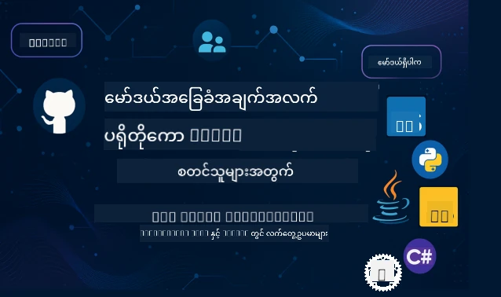

 

[](https://GitHub.com/microsoft/mcp-for-beginners/graphs/contributors)
[](https://GitHub.com/microsoft/mcp-for-beginners/issues)
[](https://GitHub.com/microsoft/mcp-for-beginners/pulls)
[](http://makeapullrequest.com)
[](https://mcptoplist.com/server/mcp.so%2Fmcp-for-beginners%2Fmicrosoft)

[](https://GitHub.com/microsoft/mcp-for-beginners/watchers)
[](https://GitHub.com/microsoft/mcp-for-beginners/fork)
[](https://GitHub.com/microsoft/mcp-for-beginners/stargazers)


[](https://discord.gg/nTYy5BXMWG)

ဒီရင်းမြစ်တွေကိုအသုံးပြုစဖို့ ဒီအဆင့်တွေကိုလိုက်နာပါ-
1. **Repository ကို Fork လုပ်ပါ**: Click [](https://GitHub.com/microsoft/mcp-for-beginners/fork)
2. **Repository ကို Clone လုပ်ပါ**:   `git clone https://github.com/microsoft/mcp-for-beginners.git`
3. **Join The** [](https://discord.gg/nTYy5BXMWG)


### 🌐 ဘာသာစကားများစွာကိုထောက်ပံ့ခြင်း

#### GitHub Action ဖြင့် ထောက်ပံ့ထားသည် (အလိုအလျောက်နှင့် အမြဲအသစ်ပြောင်းလဲနေ)

<!-- CO-OP TRANSLATOR LANGUAGES TABLE START -->
[Arabic](../ar/README.md) | [Bengali](../bn/README.md) | [Bulgarian](../bg/README.md) | [Burmese (Myanmar)](./README.md) | [Chinese (Simplified)](../zh-CN/README.md) | [Chinese (Traditional, Hong Kong)](../zh-HK/README.md) | [Chinese (Traditional, Macau)](../zh-MO/README.md) | [Chinese (Traditional, Taiwan)](../zh-TW/README.md) | [Croatian](../hr/README.md) | [Czech](../cs/README.md) | [Danish](../da/README.md) | [Dutch](../nl/README.md) | [Estonian](../et/README.md) | [Finnish](../fi/README.md) | [French](../fr/README.md) | [German](../de/README.md) | [Greek](../el/README.md) | [Hebrew](../he/README.md) | [Hindi](../hi/README.md) | [Hungarian](../hu/README.md) | [Indonesian](../id/README.md) | [Italian](../it/README.md) | [Japanese](../ja/README.md) | [Kannada](../kn/README.md) | [Khmer](../km/README.md) | [Korean](../ko/README.md) | [Lithuanian](../lt/README.md) | [Malay](../ms/README.md) | [Malayalam](../ml/README.md) | [Marathi](../mr/README.md) | [Nepali](../ne/README.md) | [Nigerian Pidgin](../pcm/README.md) | [Norwegian](../no/README.md) | [Persian (Farsi)](../fa/README.md) | [Polish](../pl/README.md) | [Portuguese (Brazil)](../pt-BR/README.md) | [Portuguese (Portugal)](../pt-PT/README.md) | [Punjabi (Gurmukhi)](../pa/README.md) | [Romanian](../ro/README.md) | [Russian](../ru/README.md) | [Serbian (Cyrillic)](../sr/README.md) | [Slovak](../sk/README.md) | [Slovenian](../sl/README.md) | [Spanish](../es/README.md) | [Swahili](../sw/README.md) | [Swedish](../sv/README.md) | [Tagalog (Filipino)](../tl/README.md) | [Tamil](../ta/README.md) | [Telugu](../te/README.md) | [Thai](../th/README.md) | [Turkish](../tr/README.md) | [Ukrainian](../uk/README.md) | [Urdu](../ur/README.md) | [Vietnamese](../vi/README.md)

> **ဒေသတွင်းမှာ Clone လုပ်ရှားချင်ပါသလား?**
>
> ဒီ repository မှာ ၅၀ ကျော် ဘာသာစကားဘာသာပြန်ထားမှုများပါဝင်ပြီး ဒါဟာ ဒေါင်းလုဒ်အရွယ်အစားကို အများကြီးတိုးစေပါတယ်။ဘာသာပြန်ခြင်းမပါဘဲ clone လုပ်ချင်ရင် sparse checkout ကိုသုံးပါ-
>
> **Bash / macOS / Linux:**
> ```bash
> git clone --filter=blob:none --sparse https://github.com/microsoft/mcp-for-beginners.git
> cd mcp-for-beginners
> git sparse-checkout set --no-cone '/*' '!translations' '!translated_images'
> ```
>
> **CMD (Windows):**
> ```cmd
> git clone --filter=blob:none --sparse https://github.com/microsoft/mcp-for-beginners.git
> cd mcp-for-beginners
> git sparse-checkout set --no-cone "/*" "!translations" "!translated_images"
> ```
>
> ဒါဟာ သင့်ကို သင်တန်းကိုပြီးမြောက်စေနိုင်ဖို့လိုအပ်သမျှကို ပေးစွမ်းပေးပြီး ဒေါင်းလုဒ်ပိုမိုမြန်ဆန်စေပါတယ်။
<!-- CO-OP TRANSLATOR LANGUAGES TABLE END -->

# 🚀 Model Context Protocol (MCP) အခြေခံသင်တန်းအစီအစဉ်

## **C#, Java, JavaScript, Rust, Python, နှင့် TypeScript တို့ဖြင့် MCP ကို လက်တွေ့ ကုဒ်ဥပမာများဖြင့် သင်ယူပါ**

## 🧠 Model Context Protocol သင်တန်းအစီအစဉ်အကြောင်းအနှစ်
Model Context Protocol အတွင်းသို့ သင်၏ ခရီးစဉ်ကို ကြိုဆိုပါသည်! AI အပလီကေးရှင်းများ သို့ ဘယ်လို ကိရိယာများနဲ့ ဝန်ဆောင်မှုများနှင့် ဆက်သွယ်ဆောင်ရွက်ကြသလဲဟု အမြဲစဉ်းစားနေပါက၊ ဒီနည်းလမ်းသည် အတည်ပြုသောဖြေရှင်းချက်တစ်ခုဖြစ်ပြီး developer များအတွက် အသုံးပြု ပြုလုပ်ဖို့ ပို၍ ချောမွေ့သော စနစ်တစ်ခုကို ဖန်တီးပေးနေပါသည်။

MCP ကို AI အပလီကေးရှင်းများအတွက် စူပါယုဇာတာဖြင့် ဘာသာပြန်တစ်ခုအဖြစ် စဉ်းစားကြည့်ပါ - USB စော့ခ်များက မည်သည့် ကိရိယာကိုမဆို ကွန်ပျူတာနှင့် ချိတ်ဆက်နိုင်သည့်နည်းပုံလိုပင် MCP က AI မော်ဒယ်များကို မည်သည့် ကိရိယာ သို့ ဝန်ဆောင်မှုမဆို စံသတ်မှတ်ထားသည့်နည်းဖြင့် ချိတ်ဆက်ခြင်းကို ခွင့်ပြုသည်။ သင့်သည် ပထမဆုံး chatbot တည်ဆောက်နေပါစေ ဂရဏ AI လုပ်ငန်းစဉ်များကို တည်ဆောက်နေပါစေ MCP ကိုနားလည်ခြင်းသည် ပို၍ စွမ်းဆောင်ရည်ရှိပြီး လွယ်ကူသော အပလီကေးရှင်းများကို ဖန်တီးနိုင်ရန် စွမ်းအားပေးပါလိမ့်မည်။

ဒီသင်တန်းအစီအစဉ်ကို သင်၏ သင်ယူမှုခရီးစဉ်အတွက် သည်းခံစိတ်နှင့် ဂရုစိုက်မှုဖြင့် ဒီဇိုင်းဆွဲထားပါသည်။ သင်ထားရှိပြီးသား လွယ်ကူသော အယူအဆများမှ စတင်ပြီး သင့်အကြိုက်ဆုံး programming language တစ်ခုဖြင့် လက်တွေ့ လေ့ကျင့်မှုများဖြင့် သင်၏ကျွမ်းကျင်မှုကို အဆင့်ဆင့်တိုးတက်စေပါမယ်။ ပြည့်စုံစွာရှင်းလင်းထားသော တင်ပြချက်များ၊ လက်တွေ့ ဥပမာများနှင့် လမ်းညွှန်မှုများ ပါဝင်ပါသည်။

ဒီခရီးစဉ် ပြီးဆုံးသည်အထိ သင့်တွင် ကိုယ်ပိုင် MCP servers များ ဖန်တီးနိုင်သောယုံကြည်ချက်ရှိလာပြီး လူကြိုက်များသော AI ပလက်ဖောင်းများနှင့် ပေါင်းစပ် ဆောင်ရွက်နိုင်ပြီး ဒီ နည်းပညာကြောင့် AI ဖွံ့ဖြိုးတိုးတက်မှုရဲ့ အနာဂတ်ကို နားလည်လာပါလိမ့်မယ်။ ဒီစိတ်လှုပ်ရှားဖွယ် ခရီးစဉ်ကို အတူတူ စတင်လိုက်ရအောင်!

### တရားဝင် စာရွက်စာတမ်းနှင့် ဖော်ပြချက်များ

ဒီသင်တန်းအစီအစဉ်သည် **MCP Specification 2025-11-25** (နောက်ဆုံး အတည်ပြု ထုတ်ပြန်ချက်) နှင့် ကိုက်ညီထားသည်။ MCP specification သည် ရက်စွဲအခြေခံ ဗားရှင်းစနစ် (YYYY-MM-DD ပုံစံ) ကို protocol ဗားရှင်း များကို ထိရောက်စေဖို့ အသုံးပြုသည်။

> **အနာဂတ်ကို ကြည့်ရှုခြင်း** - နောက်ထွက်မည့် specification ဗားရှင်း **2026-07-28** အတွက် release candidate ကို ၂၀၂၆ ခုနှစ် ဇူလိုင်လ ၂၈ ရက်တွင် ထုတ်ပြန်ရန် စီစဉ်ထားသည်။ ၎င်းသည် protocol ကို ဖလှယ်မှု အလွတ်အစား stateless ဖြစ်စေပြီး Extensions (MCP Apps, Tasks) framework ကို တရားဝင် အဖြစ် ဖွဲ့စည်းပြီး authorization ကို များထုတ်ကာ Roots, Sampling နှင့် Logging များကို အသုံးမပြုတော့ဘဲ ရပ်ဆိုင်းသည်။ အပြည့်အစုံအတွက် [What's Changing in MCP: The 2026-07-28 Release Candidate](./01-CoreConcepts/mcp-2026-07-28-release-candidate.md) ကို ကြည့်ပါ။

ဒီရင်းမြစ်တွေက သင်နားလည်မှု တိုးတက်လာသလို ပိုပြီးတန်ဖိုးရှိလာပါမယ်၊ ဒါပေမယ့် ချက်ချင်း အားလုံးကို ဖတ်ရမည်ဆိုတာကို စိုးရိမ်စရာ မရှိပါ။ ကိုယ်နှစ်သက်ရာ အကြောင်းအရာများမှ စတင်ဖတ်ရှုပါ။
- 📘 [MCP Documentation](https://modelcontextprotocol.io/) – ဒီဟာက သင်တန်းလှုပ်ရှားမှု နဲ့ အသုံးပြုသူ လမ်းညွှန်စာအုပ်များဖြစ်ပြီး စတင်သူများအတွက် ရေးသားထားပြီး ရိုးရှင်းပြီး လက်တွေ့နမူနာများစွာ ပါဝင်သည်။
- 📜 [MCP Specification](https://modelcontextprotocol.io/specification/2025-11-25) – ဒီဟာက သင်၏ အပြည့်အစုံ ကိုးကား စာအုပ်အဖြစ် သတ်မှတ်ပါသည်။ သင်တန်းအတွင်း အဆင့်ဆင့် လေ့လာသည့်အခါ သတ်မှတ်ချက်နှင့် အဆင့်မြင့် နည်းပညာများကို စစ်ဆေးဖို့ အချိန်မှီပြန်လာဖတ်ရမည့် နေရာဖြစ်ပါတယ်။
- 📜 [MCP Specification Versioning](https://modelcontextprotocol.io/specification/versioning) – Protocol ဗားရှင်း သမိုင်းနှင့် MCP သည် ရက်စွဲအခြေခံ ဗားရှင်းစနစ် (YYYY-MM-DD ပုံစံ) ကို မည်သို့ အသုံးပြုသည် ဆိုတာပါဝင်သည်။
- 🧑‍💻 [MCP GitHub Repository](https://github.com/modelcontextprotocol) – SDK များ၊ ကိရိယာများနှင့် programming language မျိုးစုံတွင် ကုဒ် နမူနာများ ပါရှိသည်။ လက်တွေ့ ဥပမာများနှင့် အသုံးပြုရန် ပြင်ဆင်ထားသော ကဏ္ဍအများစု ပါဝင်သည်။
- 🌐 [MCP Community](https://github.com/orgs/modelcontextprotocol/discussions) – MCP အကြောင်း ဆွေးနွေးမှုများတွင် သင်နှင့် အတူတူသင်ယူသူများ၊ အတွေ့အကြုံရှိ developer များ ပါဝင်ဆွေးနွေးကြသည်။ မေးခွန်းများ မေးဖို့၊ ဗဟုသုတ မျှဝေရန် ပြည့်စုံသော ဦးဆောင်ပေါင်းသင်းမှုရှိသောအသိုင်းအဝိုင်းဖြစ်သည်။
  
## သင်ယူရန် ရည်မှန်းချက်များ

ဒီသင်တန်းအစီအစဉ် အပြီးတွင် သင့်တွင် ယုံကြည်စိတ်ချမှုနှင့် စိတ်ဝင်စားမှု အသစ်များ ဖြစ်ပေါ်လာပါလိမ့်မည်။ ဆက်ပြီး သင်ဆောင်ရွက်နိုင်မယ့် အရာများမှာ မှ -

• **MCP အခြေခံအချက်များနားလည်ခြင်း**: Model Context Protocol ဆိုတာဘာလဲ၊ AI အပလီကေးရှင်းများဟာဘာကြောင့် MCP ဖြင့် ပိုမိုကောင်းမွန်စွာအတူတကွ လုပ်ဆောင်နေရတယ်ဆိုတာ အလွယ်တကူ ရေးသားထားသော နမူနာများနဲ့ နားလည်ရမှာဖြစ်ပါတယ်။

• **ပထမဆုံး MCP server ကို တည်ဆောက်ခြင်း**: ကိုယ်သုံးလိုတဲ့ programming language ဖြင့် လွယ်ကူသော ဥပမာများနဲ့ စတင်ပြီး သင့်ကျွမ်းကျင်မှု တိုးတက်လာအောင် ဆောက်လုပ်နိုင်ပါလိမ့်မယ်။

• **AI model များကို အမှန်တကယ် ကိရိယာများနှင့် ချိတ်ဆက်ခြင်း**: AI မော်ဒယ်နဲ့ အမှန်တကယ်ရှိသော ဝန်ဆောင်မှုများအကြား တံတား တည်ဆောက်နည်းများကို သင်ယူပြီး သင့် အပလီကေးရှင်းများအတွက် အင်အားကြီးသော လုပ်ဆောင်ချက် အသစ်များ ဖြည့်စွက်နိုင်ပါလိမ့်မယ်။

• **လုံခြုံရေး လုပ်ထုံးလုပ်နည်းများ လိုက်နာရေး**: MCP ကို လုံခြုံစွာ ဖန်တီးရာ၌ အသုံးပြုသူနှင့် အပလီကေးရှင်းများအား ကာကွယ်နိုင်အောင် နားလည်နိုင်ပါလိမ့်မယ်။

• **ယုံကြည်စိတ်ချစွာ ထုတ်လွှင့်နိုင်ခြင်း**: သင်၏ MCP စီမံကိန်းများကို ဖွံ့ဖြိုးတိုးတက်မှုမှ ထုတ်လုပ်မှုအဆင့်သို့ တင်ပေးနိုင်ရာတွင် လုပ်ဆောင်မှုနည်းလမ်းများကို နားလည်လာ ပါလိမ့်မယ်။

• **MCP အသိုင်းအဝိုင်းတွင် ပါဝင်ရန်**: AI အပလီကေးရှင်း ဖွံ့ဖြိုးမှုအနာဂတ်ကို ပုံဖော်နေသော developer အသိုင်းအဝိုင်းတိုးတက်လျက်ရှိသည်မှာ သင်ပါဝင်နိုင်ပါလိမ့်မယ်။

## အရေးကြီးသော အခြေခံ 지식

MCP အထူးသဖြင့် ဆွေးနွေးမှုများနှင့်ပတ်သက်ပြီး အခြေခံ အယူအဆများအား သေချာနားလည်စေရန် ရှင်းပြချင်ပါတယ်။ စိုးရိမ်စရာ မရှိပါနဲ့၊ မည်သည့်အခန်းရွက်များတွင်မဆို လိုအပ်သမျှကို ရှင်းပြသွားပါမယ်။

### Protocol များ နားလည်ခြင်း (အခြေခံ)

Protocol ကို စကားဝိုင်းတွင် 사용되는 စည်းကမ်းများအဖြစ် စဉ်းစားပါ။ မိတ်ဆွေတစ်ဦးကို ဖုန်းခေါ်သည့်အခါ "ဟယ်လို" ဟု ပြောဆိုရန်၊ တစ်ဦးချင်းစီ အဆိုပြောရန် လိုအပ်သည့် စည်းကမ်းများကို သိရှိထားရသည်။ ကွန်ပျူတာပရိုဂရမ်များသည် ထူးခြားသော စည်းမျဉ်းများကိုလိုအပ်သည်။

MCP သည် protocol တစ်ခုဖြစ်ပြီး AI မော်ဒယ်များနှင့် အပလီကေးရှင်းများကို ကိရိယာများနှင့် ဝန်ဆောင်မှုများအကြား ထိရောက်သော "စကားဝိုင်း" ကို ချိတ်ဆက်ပေးသည်။ လူမှုဆက်ဆံရေး၌ စကားဝိုင်း စည်းမျဉ်းများ ရှိသဖြင့် ဆက်သွယ်ရေး ပိုမိုကောင်းမွန်သည့်အတိုင်း MCP က AI ဆက်သွယ်ရေးကို ယုံကြည်စိတ်ချစွာ နှင့် အကျိုးရှိစေရန် အထောက်အကူပြုပါသည်။

### Client-Server ဆက်ဆံရေးများ (ပရိုဂရမ်များ အတူတကွလုပ်ဆောင်ပုံ)

သင့်တနေ့ထဲ Client-Server ဆက်ဆံရေးကို အသုံးပြုနေပါပြီ! Web browser (client) တစ်ခုကို အသုံးပြုသည်မှာ ကိုယ့်ဧည့်ခံ website server ကို ချိတ်ဆက်ခြင်းဖြစ်ပြီး ဆာဗာမှ စာမျက်နှာအကြောင်းအရာကို ပေးပို့သည်။ Browser သည် အချက်အလက် တောင်းမြှောက်ပုံကို သိပြီး Server သည် ပြန်ဖြေခြင်းကို သိသည်။

MCP တွင်လည်း ဒီလို ဆက်ဆံရေးရှိသည်။ AI မော်ဒယ်များသည် client အဖြစ် သတင်းအချက်အလက် သို့လုပ်ဆောင်ချက် များကို တောင်းဆိုသည်၊ MCP server များက ထို စွမ်းဆောင်ရည်များကို ပေးသည်။ ၎င်းသည် AI အတွက် အကူအညီ ပေးသူ (server) တစ်ဦးရှိနေသကဲ့သို့ဖြစ်သည်၊ AI မှ တိကျသော အစီအစဉ်များပြုလုပ်ရန် တောင်းဆိုနိုင်သည်။

### စံသတ်မှတ်ခြင်း အရေးကြီးခြင်း (အတူတကွလုပ်ဆောင်မှု များအောင်)

ကားထုတ်လုပ်သူတိုင်းမှ ဆီဖောက်ကိရိယာများ ပုံစံကွဲပြားကြလျှင် - မည်သည့်ကားတွေအတွက်မဆို အခြား adapter တပ်ရမည်။ စံသတ်မှတ်ခြင်း ဆိုသည်မှာ ကုန်ပစ္စည်းများ၏ အတူတကွ လုပ်ဆောင်နိုင်ရေးအတွက် အတူသဘောတူညီထားသည့်နည်းလမ်းများ ဖြစ်သည်။

MCP သည် AI အပလီကေးရှင်းများအတွက် ဒီစံသတ်မှတ်ခြင်းကို ပေးသည်။ AI မော်ဒယ်တိုင်းသည် ကိရိယာတစ်ခုချင်းစီနဲ့ လိုအပ်သည့် code အထူးပြုမရေးပဲ၊ MCP က သူတို့အကြား ဆက်သွယ်မှုအတွက် ပုံမှန် နည်းလမ်းတစ်ခု ဖန်တီးပေးသည်။ ဒါမှ developer များက ကိရိယာများကို တစ်ခါတည်း ဖန်တီးပြီး အမျိုးမျိုးသော AI စနစ်များနှင့် သုံးနိုင်ပါသည်။

## 🧭 သင်ယူမှုလမ်းကြောင်း အကြောင်းအမြင်

သင်၏ MCP ခရီးစဉ်ကို စိတ်ချမှုနှင့် ကျွမ်းကျင်မှု တိုးတက်ပွားလာအောင် သေချာစွာ လုပ်ထားသည်။ လှုပ်ရှားမှုတိုင်းတွင် အသစ်သော အယူအဆများအား မိတ်ဆက်ပြီး ယခင်လေ့လာမှုများအား တဖက်တည်း ထောက်ပံ့သည်။

### 🌱 အခြေခံအဆင့်: အခြေခံနားလည်မှု (Modules 0-2)

သင့်နောက်ဆုံး အစီအစဉ် စတင်ရာနေရာ! MCP အယူအဆများကို ကျယ်ပြန့်စွာ နှိုင်းယှဉ်၍ ရိုးရှင်းစွာ နမူနာထည့်ပြသပါမယ်။ MCP ဆိုတာဘာလဲ၊ ဘာလို့ ရှိနေသလဲ၊ AI ဖွံ့ဖြိုးတိုးတက်မှု ဒေသအတွင်း ဘယ်လို တက်ကြွနေသလဲ အတူတကွ လေ့လာပါမယ်။


• **Module 0 - MCP အကြောင်းအကြမ်းဖျဉ်း**: MCP ဆိုတာဘာလဲ၊ အဘယ်ကြောင့် ယနေ့ခေတ် AI လျှောက်လွှာများအတွက် အလွန်အရေးကြီးသလဲ ဆိုတာကို စတင်လေ့လာမှာဖြစ်ပါတယ်။ MCP ကို အဓိက အသုံးပြုမှုများနဲ့ တွေ့ရမယ့်နည်းလမ်းတွေကို မြင်တွေ့ပြီး တိုးတက်လိုသူနှင့် samst ရင်ဆိုင်ကြုံတွေ့ရတဲ့ ပြဿနာများကို MCP က ဘယ်လို ဖြေရှင်းပေးတယ်ဆိုတာ နားလည်မိပါလိမ့်မယ်။

• **Module 1 - အခြေခံ သိလိုသည့် အဓိက မှတ်ချက်များ**: ဒီနေရာမှာ MCP ၏ အဓိကအကြောင်းအရာ အဆောက်အအုံများကို သင်ယူပါမယ်။ အဓိကသဘောတူချက်နှင့် မျက်နှာဖုံးများစွာအသုံးပြုပြီး အဓိကများကို သဘာဝနှင့် နားလည်ရလွယ်ကူစေရန် ပြသပါမယ်။

• **Module 2 - MCP တွင် လုံခြုံရေး**: လုံခြုံရေးဆိုတာ ကြောက်ရွံ့ဖွယ်ကောင်းသော်လည်း MCP တွင် လုံခြုံရေးအင်္ဂါရပ်များ အခြားထည့်စွက်ထားတာနဲ့ မိမိ လျှောက်လွှာများကို စတင်ကာကွယ်မှုနည်းလမ်းကောင်းများ သင်ကြားပေးမှာဖြစ်ပါတယ်။

### 🔨 တည်ဆောက်ခြင်း အဆင့်: သင်၏ ပထမဆုံး အကောင်အထည်ဖော်မှုများ ဖန်တီးခြင်း (Module 3)

ယခုမှ စတင် အရမ်းပျော်စရာလေးပါပဲ! သင်မှတ်တမ်းမရှိသေးသော MCP ဆာဗာနှင့် ကလိုင့်များ တည်ဆောက်မှုကို လက်တွေ့ကျကျ လေ့လာသည်။ စတင် လွယ်ကူစွာနှင့် လက်တွေအားလုံးနဲ့လမ်းပြပေးပါမယ်။

ဒီ module မှာ သင်ဖွင့်ပွဲခဲ့သော programming ဘာသာစကားဖြင့် အတွေ့အကြုံရရှိစေရန် လက်တွေ့ လမ်းညွှန်ချက်များပါဝင်သည်။ သင့်ပထမဆုံး ဆာဗာကိုဖန်တီးပြီး၊ ချိတ်ဆက်ရန် client တစ်ခုတည်ဆောက်ပြီး၊ VS Code ကဲ့သို့သော လူကြိုက်များသော ဖွံ့ဖြိုးရေးကိရိယာများနှင့် ပေါင်းစည်းမှုလုပ်ပါလိမ့်မယ်။

လမ်းညွှန်ချက်တိုင်းတွင် ပြည့်စုံသော အကုဒ်နမူနာများ၊ ပြဿနာ ရှင်းလင်းနည်းများနှင့်ဒီဇိုင်း ရွေးချယ်မှုများ၏ အကြောင်းရှင်းပြချက်များ ပါဝင်သည်။ ဒီအဆင့်ကုန်ဆုံးသည်အထိ လေးစားစရာ MCP အကောင်အထည်ဖော်မှုများ ရရှိပါလိမ့်မယ်။

### 🚀 တိုးတက်မှု အဆင့်: ကြီးမားသော အကြောင်းအရာများနှင့် အမှန့်ထွက်လျှောက်လွှာများ (Modules 4-5)

အခြေခံများကိုကျွမ်းကျင်သွားပြီးနောက်၊ သင်သည် ပိုမိုခက်ခဲပြီး ရှုပ်ထွေးသော MCP လုပ်ဆောင်ချက်များကို ရှာဖွေရန် အသင့်ရှိသည်။ လက်တွေ့ လေ့ကျင့်နည်းချက်များ၊ တည်းဖြတ်ခြင်းနည်းလမ်းများနှင့် multi-modal AI ပေါင်းစပ်မှု ကဲ့သို့သော အဆင့်မြင့် အကြောင်းအရာများကို ခွဲခြမ်း လေ့လာမှာ ဖြစ်ပါသည်။

သင်သည် MCP အကောင်အထည်ဖော်မှုများကို လူကြီးမင်း ထုတ်လုပ်မှုတွင်သုံးနိုင်ရန် စွမ်းဆောင်ရည်တိုးမြှင့်ခြင်းနှင့် Azure ကဲ့သို့သော မိုးကောင်းကင် ပလက်ဖောင်းများနှင့် ပေါင်းစည်းနည်းများ လေ့လာပါလိမ့်မယ်။ ဒီ module များက သင်ကို အမှန်တကယ်လောကလိုအပ်ချက်များကို ချိုင့်နိုင်သော MCP ဖြေရှင်းချက်များ တည်ဆောက်ရန် ပြင်ဆင်ပေးပါသည်။

### 🌟ကျွမ်းကျင်မှု အဆင့်: အသိုင်းအဝိုင်းနှင့် ထူးခြားမှု (Modules 6-11)

နောက်ဆုံးအဆင့်မှာ MCP အသိုင်းအဝိုင်းသို့ လက်တွဲဝင်ရောက်ခြင်းနှင့် လူကြိုက်များသော နယ်ပယ်များတွင် အထူးပြုလုပ်ခြင်းပေါ်တွင် အလေးပေးသည်။ သင်သည် open-source MCP စီမံကိန်းများတွင် တက်ကြွစွာ ပါဝင်နည်း၊ အဆင့်မြင့် ခွင့်ပြုချက် နည်းပညာများကို အကောင်အထည်ဖော်နည်းနှင့် ပြည့်စုံသော ဒေတာဘေ့စ် ပေါင်းစည်းဖြေရှင်းချက်များ တည်ဆောက်နည်းကို သင်ယူပါလိမ့်မယ်။

Module 11 သည် အထူးပြောကြားရန် အရေးပါသည် - PostgreSQL ပေါင်းစည်းမှုနှင့် အတူ 13-lab လက်တွေ့ သင်ကြားမှုပုံစံတစ်ခုဖြစ်ပြီး ထုတ်လုပ်ရန် အသင့် MCP ဆာဗာများ ဖန်တီးပေးတယ်။ သင်ယူခဲ့သော အရာအားလုံးကို ပေါင်းစပ်သည့် အစီအစဉ် မြောက်ကင်ပိုင် ပရောဂျက်လိုဖြစ်ပါတယ်။

### 📚 ပြည့်စုံသော သင်ရိုးညွှန်းချက် အဖွဲ့စည်းများ

| Module | အကြောင်းအရာ | ဖော်ပြချက် | လင့်ခ် |
|--------|-------|-------------|------|
| **Module 0-3: အခြေခံများ** | | | |
| 00 | MCP အကြောင်း ချဉ်းကပ်ချက် | Model Context Protocol ၏အဓိပ္ပာယ်နှင့် AI လမ်းကြောင်းများတွင် ၎င်း၏ တန်ဖိုး | [Read more](./00-Introduction/README.md) |
| 01 | အဓိက ထင်မြင်ချက်များ ရှင်းပြချက် | MCP အဓိက အကြောင်းအရာများကို နက်ရှိုင်းစွာ ရှာဖွေခြင်း | [Read more](./01-CoreConcepts/README.md) |
| 1.1 | MCP မှာ ဘာတွေ ပြောင်းလဲနေတာလဲ (2026-07-28 RC) | Stateless protocol, Extensions framework နှင့် နောက်ထပ် spec ဗားရှင်းတွင် ဖျက်သိမ်းမည့် feature များ | [Guide](./01-CoreConcepts/mcp-2026-07-28-release-candidate.md) |
| 02 | MCP တွင် လုံခြုံရေး | လုံခြုံရေး ခြိမ်းခြောက်မှုများနှင့် အကောင်းဆုံးအသုံးပြုနည်းများ | [Read more](./02-Security/README.md) |
| 03 | MCP အတွက် စတင်လုပ်ဆောင်ခြင်း | ပတ်ဝန်းကျင် မြှုပ်နှံခြင်း၊ အခြေခံ ဆာဗာ/ကလိုင့်များ၊ ပေါင်းစည်းမှု | [Read more](./03-GettingStarted/README.md) |
| **Module 3: သင်၏ ပထမဆုံး ဆာဗာနှင့် ကလိုင့် တည်ဆောက်ခြင်း** | | | |
| 3.1 | ပထမဆုံး ဆာဗာ | သင်၏ ပထမဆုံး MCP ဆာဗာကို ဖန်တီးခြင်း | [Guide](./03-GettingStarted/01-first-server/README.md) |
| 3.2 | ပထမဆုံး ကလိုင့် | အခြေခံ MCP ကလိုင့် တစ်ခု ဖြေရှင်းခြင်း | [Guide](./03-GettingStarted/02-client/README.md) |
| 3.3 | LLM ပါသော ကလိုင့် | ကြီးမားသောဘာသာစကား မော်ဒယ်များ ပေါင်းစည်းခြင်း | [Guide](./03-GettingStarted/03-llm-client/README.md) |
| 3.4 | VS Code ပေါင်းစည်းခြင်း | MCP ဆာဗာများကို VS Code တွင် အသုံးပြုခြင်း | [Guide](./03-GettingStarted/04-vscode/README.md) |
| 3.5 | stdio ဆာဗာ | stdio သယ်ဆောင်မှု အသုံးပြုပြီး ဆာဗာများ ဖန်တီးခြင်း | [Guide](./03-GettingStarted/05-stdio-server/README.md) |
| 3.6 | HTTP စီးဆင်းမှု | MCP တွင် HTTP ပမာဏစီးဆင်းမှု အကောင်အထည်ဖော်ခြင်း | [Guide](./03-GettingStarted/06-http-streaming/README.md) |
| 3.7 | Microsoft Foundry Toolkit | MCP နှင့် Microsoft Foundry Toolkit ကို အသုံးပြုခြင်း | [Guide](./03-GettingStarted/07-aitk/README.md) |
| 3.8 | စမ်းသပ်ခြင်း | မိမိ MCP ဆာဗာ အကောင်အထည်ဖော်မှု ကို စမ်းသပ်ခြင်း | [Guide](./03-GettingStarted/08-testing/README.md) |
| 3.9 | ထည့်သွင်းရန် | MCP ဆာဗာများကို ထုတ်လုပ်မှုတွင် တင်သွင်းခြင်း | [Guide](./03-GettingStarted/09-deployment/README.md) |
| 3.10 | အဆင့်မြင့် ဆာဗာ အသုံးပြုမှု | အဆင့်မြင့် feature များ အသုံးပြုမှုနှင့် ဖွဲ့စည်းပုံ တိုးတက်မှုများ | [Guide](./03-GettingStarted/10-advanced/README.md) |
| 3.11 | ရိုးရှင်းသော auth | auth ရှေ့ဆောင်ခြင်းနှင့် RBAC ကို ဖော်ပြသော အခန်း | [Guide](./03-GettingStarted/11-simple-auth/README.md) |
| 3.12 | MCP Hosts | Claude Desktop, Cursor, Cline နှင့် အခြား MCP hosts များ ကို ထိန်းချုပ်တပ်ဆင်ခြင်း | [Guide](./03-GettingStarted/12-mcp-hosts/README.md) |
| 3.13 | MCP Inspector | Inspector ကိရိယာဖြင့် MCP ဆာဗာများကို ဖြေရှင်းနှင့် စမ်းသပ်ခြင်း | [Guide](./03-GettingStarted/13-mcp-inspector/README.md) |
| 3.14 | Sampling | Sampling ကို အသုံးပြု၍ ကလိုင့်နှင့် ပူးပေါင်းဆောင်ရွက်ခြင်း | [Guide](./03-GettingStarted/14-sampling/README.md) |
| 3.15 | MCP Apps | MCP Apps တည်ဆောက်ခြင်း | [Guide](./03-GettingStarted/15-mcp-apps/README.md) |
| **Module 4-5: လက်တွေ့နှင့် အဆင့်မြင့်** | | | |
| 04 | လက်တွေ့ အကောင်အထည်ဖော်ခြင်း | SDKs, တည်းဖြတ်ခြင်း, စမ်းသပ်ခြင်း၊ ပြန်လည်အသုံးပြုနိုင်သော prompt ပုံစံများ | [Read more](./04-PracticalImplementation/README.md) |
| 4.1 | စာမျက်နှာခွဲခြားခြင်း | cursor-based pagination ဖြင့် ကြီးမားသော ရလဒ်အစုအဝေးများကို ကိုင်တွယ်ခြင်း | [Guide](./04-PracticalImplementation/pagination/README.md) |
| 05 | MCP တွင် အဆင့်မြင့် ရောနှောမှုများ | Multi-modal AI, တိုးချဲ့ခြင်း, စီးပွားရေးအသုံးပြုမှု | [Read more](./05-AdvancedTopics/README.md) |
| 5.1 | Azure ပေါင်းစည်းခြင်း | MCP နှင့် Azure ပေါင်းစည်းမှု | [Guide](./05-AdvancedTopics/mcp-integration/README.md) |
| 5.2 | မော်ဒယ်မျိုးစုံအသုံးပြုခြင်း | modalities များစွာနှင့် လုပ်ကိုင်ခြင်း | [Guide](./05-AdvancedTopics/mcp-multi-modality/README.md) |
| 5.3 | OAuth2 ဒက်မို | OAuth2 ခွင့်ပြုချက် ပုံပြင်တည်ဆောက်ခြင်း | [Guide](./05-AdvancedTopics/mcp-oauth2-demo/README.md) |
| 5.4 | Root Contexts | root contexts ကို နားလည်ပြီး အကောင်အထည်ဖော်ခြင်း | [Guide](./05-AdvancedTopics/mcp-root-contexts/README.md) |
| 5.5 | Routing | MCP ဖေးရာ ရထားနည်းလမ်းများ | [Guide](./05-AdvancedTopics/mcp-routing/README.md) |
| 5.6 | Sampling | MCP တွင် sampling နည်းစနစ်များ | [Guide](./05-AdvancedTopics/mcp-sampling/README.md) |
| 5.7 | တိုးချဲ့ခြင်း | MCP အကောင်အထည်ဖော်မှုများ တိုးချဲ့ခြင်း | [Guide](./05-AdvancedTopics/mcp-scaling/README.md) |
| 5.8 | လုံခြုံရေး | အဆင့်မြင့် လုံခြုံရေးဆိုင်ရာ စဉ်းစားချက်များ | [Guide](./05-AdvancedTopics/mcp-security/README.md) |
| 5.9 | ဝက်ဘ် ရှာဖွေမှု | ဝက်ဘ် ရှာဖွေမှု လုပ်ဆောင်ချက်များ ဖော်ထုတ်ခြင်း | [Guide](./05-AdvancedTopics/web-search-mcp/README.md) |
| 5.10 | အချိန်နှင့် တပြိုင်နက် စီးဆင်းမှု | Realtime streaming လုပ်ဆောင်ချက် တည်ဆောက်ခြင်း | [Guide](./05-AdvancedTopics/mcp-realtimestreaming/README.md) |
| 5.11 | အချိန်နှင့် တပြိုင်နက် ရှာဖွေမှု | Realtime search လုပ်ဆောင်ခြင်း | [Guide](./05-AdvancedTopics/mcp-realtimesearch/README.md) |
| 5.12 | Entra ID Auth | Microsoft Entra ID ဖြင့် ခွင့်ပြုချက်လုပ်ခြင်း | [Guide](./05-AdvancedTopics/mcp-security-entra/README.md) |
| 5.13 | Foundry ပေါင်းစည်းမှု | Microsoft Foundry နှင့် ပေါင်းစည်းခြင်း | [Guide](./05-AdvancedTopics/mcp-foundry-agent-integration/README.md) |
| 5.14 | Context Engineering | ထိရောက်သော context engineering နည်းလမ်းများ | [Guide](./05-AdvancedTopics/mcp-contextengineering/README.md) |
| 5.15 | MCP Custom Transport | Custom Transport အကောင်အထည်ဖော်မှုများ | [Guide](./05-AdvancedTopics/mcp-transport/README.md) |
| 5.16 | Protocol Features | တိုးတက်ရေး အသိပေးချက်များ၊ ဖျက်ပစ်ခြင်း၊ ရင်းမြစ်အမျိုးအစား ပုံစံများ | [Guide](./05-AdvancedTopics/mcp-protocol-features/README.md) |
| 5.17 | လက်နက်ကြီး Multi-Agent Reasoning | ၂ ဦးသော အေးဂျင့်များ MCP ကိရိယာများနှင့် ဆန့်ကျင်ဘက်ကွဲပြားမှု ဥပဒေလျှောက် အေးဂျင့်မှ သုံးသပ်ခြင်း | [Guide](./05-AdvancedTopics/mcp-adversarial-agents/README.md) |
| **Module 6-10: အသိုင်းအဝိုင်း & အကောင်းဆုံး နည်းလမ်းများ** | | | |
| 06 | အသိုင်းအဝိုင်း ပါဝင်မှုများ | MCP စနစ်တွင် ဘယ်လို လှုပ်ရှားပေးရမလဲ | [Guide](./06-CommunityContributions/README.md) |
| 07 | စတင် အသုံးပြုမှုမှ သင်ခန်းစာများ | အမှန်တကယ် လုပ်ဆောင်မှု ဇာတ်လမ်းများ | [Guide](./07-LessonsfromEarlyAdoption/README.md) |
| 08 | MCP အတွက် အကောင်းဆုံး နည်းလမ်းများ | ဆောင်ရွက်မှုမြှင့်တင်မှု၊ အမှားခံနိုင်မှု၊ ယှဉ်တွဲခံနိုင်မှု | [Guide](./08-BestPractices/README.md) |
| 09 | MCP အမှုလက်တွေ့လေ့လာချက်များ | လက်တွေ့ အကောင်အထည်ဖော်မှု နမူနာများ | [Guide](./09-CaseStudy/README.md) |
| 10 | လက်တွေ့ အသုံးပြုမှု ပညာဝိုင်း | Microsoft Foundry Toolkit ဖြင့် MCP ဆာဗာ တည်ဆောက်ခြင်း | [Lab](./10-StreamliningAIWorkflowsBuildingAnMCPServerWithAIToolkit/README.md) |
| **Module 11: MCP ဆာဗာ လက်တွေ့သင်တန်း** | | | |
| 11 | MCP ဆာဗာ ဒေတာဘေ့စ် ပေါင်းစည်းမှု | PostgreSQL ပေါင်းစည်းမှု အတွက် လက်တွေ့ 13-lab သင်တန်းအစီအစဉ် | [Labs](./11-MCPServerHandsOnLabs/README.md) |
| 11.1 | မိတ်ဆက် | ဒေတာဘေ့စ် ပေါင်းစည်းခြင်းနှင့် လက်လီစျေးကွက် သုံးသပ်မှု အသုံးပြုမှု အကျဉ်းချုပ် | [Lab 00](./11-MCPServerHandsOnLabs/00-Introduction/README.md) |
| 11.2 | အဓိက ဖွဲ့စည်းပုံ | MCP ဆာဗာ ဖွဲ့စည်းပုံ၊ ဒေတာဘေ့စ် အလွှာများနှင့် လုံခြုံရေး ပုံစံများ နားလည်ခြင်း | [Lab 01](./11-MCPServerHandsOnLabs/01-Architecture/README.md) |
| 11.3 | လုံခြုံရေး & ဘက်သုံးစွဲသူများအလားအလာ | Row Level Security, ခွင့်ပြုချက်နှင့် Multi-tenant ဒေတာ ဝင်ကြည့်လမ်းများ | [Lab 02](./11-MCPServerHandsOnLabs/02-Security/README.md) |
| 11.4 | ပတ်ဝန်းကျင် စီစဉ်ခြင်း | ဖွံ့ဖြိုးရေး ပတ်ဝန်းကျင် တပ်ဆင်ခြင်း၊ Docker, Azure အရင်းအမြစ်များ | [Lab 03](./11-MCPServerHandsOnLabs/03-Setup/README.md) |
| 11.5 | ဒေတာဘေ့စ် ဒီဇိုင်း | PostgreSQL တပ်ဆင်ခြင်း၊ လက်လီ စနစ် ဒီဇိုင်းနှင့် နမူနာ ဒေတာများ | [Lab 04](./11-MCPServerHandsOnLabs/04-Database/README.md) |
| 11.6 | MCP ဆာဗာ အကောင်အထည်ဖော်ခြင်း | ဒေတာဘေ့စ် ပေါင်းစည်းမှုဖြင့် FastMCP ဆာဗာ တည်ဆောက်ခြင်း | [Lab 05](./11-MCPServerHandsOnLabs/05-MCP-Server/README.md) |
| 11.7 | ကိရိယာ ဖန်တီးမှု | ဒေတာဘေ့စ် ရှာဖွေရန် ကိရိယာနှင့် schema introspection ဖန်တီးခြင်း | [Lab 06](./11-MCPServerHandsOnLabs/06-Tools/README.md) |
| 11.8 | Semantic Search | Azure OpenAI နှင့် pgvector ဖြင့် vector embeddings အကောင်အထည်ဖော်ခြင်း | [Lab 07](./11-MCPServerHandsOnLabs/07-Semantic-Search/README.md) |
| 11.9 | စမ်းသပ်ခြင်း & တည်းဖြတ်ခြင်း | စမ်းသပ်နည်းဗျူဟာများ၊ တည်းဖြတ်ကိရိယာများနှင့် အတည်ပြုရန် နည်းလမ်းများ | [Lab 08](./11-MCPServerHandsOnLabs/08-Testing/README.md) |
| 11.10 | VS Code ပေါင်းစည်းခြင်း | VS Code MCP ပေါင်းစည်းမှုနှင့် AI Chat အသုံးပြုနည်း ပြင်ဆင်ခြင်း | [Lab 09](./11-MCPServerHandsOnLabs/09-VS-Code/README.md) |
| 11.11 | တင်သွင်းနည်းဗျူဟာများ | Docker တင်သွင်းခြင်း၊ Azure Container Apps နှင့် တိုးချဲ့ရန် စဉ်းစားချက်များ | [Lab 10](./11-MCPServerHandsOnLabs/10-Deployment/README.md) |
| 11.12 | ကြည့်ရှုမှတ်တမ်းတင်ခြင်း | Application Insights, မှတ်စုတင်ခြင်း, ဆောင်ရွက်မှု ကြည့်ရှုမှု | [Lab 11](./11-MCPServerHandsOnLabs/11-Monitoring/README.md) |
| 11.13 | အကောင်းဆုံး နည်းလမ်းများ | ဆောင်ရွက်မှု တိုးတက်မှု၊ လုံခြုံရေး တောက်ပစေရေးနှင့် ထုတ်လုပ်မှုအတွက် အကြံပေးချက်များ | [Lab 12](./11-MCPServerHandsOnLabs/12-Best-Practices/README.md) |
| **Module 12: MCP ကိရိယာများ** | | | |
| 12.1 | ကိရိယာများ | Copilot App တွင် MCP အသုံးပြုမှု | [ Guide ](./12-tooling/README.md) |

### 💻 နမူနာ ကုဒ် ပရောဂျက်များ

MCP သင်ယူရန် အရမ်းစိတ်ဝင်စားဖွယ်ကောင်းသောအပိုင်းတခုမှာ မိမိကုဒ်ကျွမ်းကျင်မှုများ တိုးတက်လာသည့် အဆင့်အတန်းကို မြင်တွေ့ခြင်း ဖြစ်ပါတယ်။ ကျွန်ုပ်တို့သည် ကုဒ်နမူနာများကို လွယ်ကူစွာ စတင်ပြီး နားလည်မှု မြင့်မားလာသည့်အတိုင်း မျှဝေပြီး တိုးတက်လာစေရန် ဒီဇိုင်းရေးဆွဲထားပါတယ်။ ဒီမှာ ကျွန်ုပ်တို့သည် အဓိက သဘောတရားများအား ရိုးရှင်းလွယ်ကူသော်လည်း MCP ၏ မှန်ကန်သောတန်ဖိုးများပြသသည့် ကုဒ်များဖြင့် မိတ်ဆက်ပြသထားသည်။ သင်မှာ ကြည့်ရှု သဘောပညာသာမက ဘာကြောင့် ဒီကုဒ်ကိုဒီလိုဖွဲ့စည်းထားပြီး MCP အကြီးစား လျှောက်ထားမှုတွင် ဘယ်လို သက်ဆိုင်တယ်ဆိုတာကိုလည်း နားလည်ရမည်ဖြစ်သည်။

#### အခြေခံ MCP ကိန်းဂဏန်း စမ်းသပ်မှု နမူနာများ

| ဘာသာစကား | ဖော်ပြချက် | လင့်ခ် |
|----------|-------------|------|

| C# | MCP Server ကိုယ်ပိုင်ဥပမာ | [View Code](./03-GettingStarted/samples/csharp/README.md) |
| Java | MCP ကိုယ်ပိုင်တွက်ချက်စက် | [View Code](./03-GettingStarted/samples/java/calculator/README.md) |
| JavaScript | MCP ပုံပြင်ပြ | [View Code](./03-GettingStarted/samples/javascript/README.md) |
| Python | MCP Server | [View Code](../../03-GettingStarted/samples/python/mcp_calculator_server.py) |
| TypeScript | MCP ကိုယ်ပိုင်ဥပမာ | [View Code](./03-GettingStarted/samples/typescript/README.md) |
| Rust | MCP ကိုယ်ပိုင်ဥပမာ | [View Code](./03-GettingStarted/samples/rust/README.md) |

#### တိုးတက်သော MCP အသုံးအဆောင်များ

| ဘာသာစကား | ဖော်ပြချက် | လင့်ခ် |
|----------|-------------|------|
| C# | တိုးတက်သော ဥပမာ | [View Code](./04-PracticalImplementation/samples/csharp/README.md) |
| Java with Spring | Container App ဥပမာ | [View Code](./04-PracticalImplementation/samples/java/containerapp/README.md) |
| JavaScript | တိုးတက်သော ဥပမာ | [View Code](./04-PracticalImplementation/samples/javascript/README.md) |
| Python | ရုပ်ရှင်ဝါကျ ခက်ခဲသော အကောင်အထည်ဖော်မှု | [View Code](./04-PracticalImplementation/samples/python/README.md) |
| TypeScript | Container ဥပမာ | [View Code](./04-PracticalImplementation/samples/typescript/README.md) |


## 🎯 MCP သင်ယူရန် မျှော်မှန်းချက်များ

မိမိဒီ သင်ခန်းစာမှ အကောင်းဆုံးရရှိရန်အတွက်၊ သင်သည် အောက်ပါ အရာများရှိရပါမည်။

- အနည်းဆုံး ဘာသာစကားတစ်ခု ထဲတွင် programming အခြေခံအသိပညာရှိမှ ဖြစ်ပါသည်။ (C#, Java, JavaScript, Python, ဒါမှမဟုတ် TypeScript)
- client-server မော်ဒယ်နှင့် API များကို နားလည်မှုရှိရန်
- REST နှင့် HTTP အယူအဆများကို သိရှိနေခြင်း
- (အခြားရန်) AI/ML အယူအဆများအပေါ်နောက်ခံပညာရှိခြင်း (Optional)

- ကူညီရန် အဖွဲ့ဝင်တွေ့ဆုံဆွေးနွေးပွဲများတွင် ပါဝင်ခြင်း

## 📚 သင်ယူလမ်းညွှန် နှင့် အရင်းအမြစ်များ

ဒီ repository မှာ သင်တန်းပိုင်း နှင့် သင်ယူမှုကို အကျိုးရှိစွာ စဉ်ဆက် ရှာဖွေရေးအတွက် အရင်းအမြစ်များစွာပါဝင်သည်။

### သင်ယူလမ်းညွှန်

သင့်အတွက် ဒီ repository ကို အကျိုးရှိစွာလမ်းပြပေးနိုင်ရန် comprehensive [Study Guide](./study_guide.md) တစ်ခုရရှိနိုင်ပါသည်။ ဒီမြင်ကွင်းမြင်မှတ်ပုံတင်က မြင်ကွင်းဖော်ပြချက်သည် အကြောင်းအရာများအားလုံးချိတ်ဆက်မှုကိုပြသပြီး ဥပမာပရိုဂျက်များကို ထိရောက်စွာ အသုံးချနိုင်ဖို့ လမ်းညွှန်မှု ပေးသည်။ သင်သည် အကြီးစားပုံစံတွေကို မျက်စိဖြင့် ကြည့်ရတာကို ချစ်သော သင်ယူသူဖြစ်ပါက အထူးအသုံးဝင်ပါသည်။

လမ်းညွှန်မှာ ပါသောအရာများမှာ-
- အားလုံးသော ခေါင်းစဉ်များ ပါသည့် မြင်ကွင်းမြင်မွတ်ပုံတင်ဇယား
- repository အပိုင်းများ အသေးစိတ် ခွဲခြမ်းမှု
- ဥပမာ ပရိုဂျက်များ အကောင်းဆုံးအသုံးချနည်းကို ညွှန်ပြခြင်း
- အတတ်နိုင် စွမ်းရည်အဆင့်များအလိုက် သင်ယူလမ်းကြောင်းများ အသုံးချရန် အကြံပြုချက်
- သင်ယူခြင်းခရီးစဉ်တွင် ပထမဆုံကမ်းသော အရင်းအမြစ်များ

### ပြောင်းလဲမှုမှတ်တမ်း

သင့်အား အသစ်ဆုံးကောင်းမွန်မှုများနှင့် ထည့်သွင်းပြင်ဆင်မှုများကို သိရှိနိုင်ဖို့ ကျွန်ုပ်တို့သည် အသေးစိတ် [Changelog](./changelog.md) ကို စောင့်ကြည့်ထိန်းသိမ်းထားပါသည်။
- အသစ်ထည့်သွင်းမှုများ
- ဖွဲ့စည်းမှု ပြောင်းလဲမှုများ
- အင်္ဂါရပ်များ တိုးတက်ပြောင်းလဲမှုများ
- စာရွက်စာတမ်းများ အသစ်ပြင်ဆင်မှုများ

## 🛠️ ဒီသင်ခန်းစာကို ထိရောက်စွာ အသုံးချနည်း

ဒီလမ်းညွှန်မှ ကျင်းပရမည့် အတန်းတိုင်းတွင် ပါဝင်သောအရာများမှာ-

1. MCP အကြောင်း ရှင်းလင်းတည်ဆောက်ချက်များ  
2. ဘာသာစကားစုံမှ လက်တွေ့ ကုဒ် ဥပမာများ  
3. MCP application ကို တည်ဆောက်ဖို့ လေ့ကျင့်ခန်းများ  
4. တိုးတက်သူများအတွက် ထပ်ဆောင်း အရင်းအမြစ်များ

### C# နဲ့ MCP ကို သင်ယူကြမယ် - သင်ခန်းစာ စီးရီး
Model Context Protocol (MCP) ဆိုတာက AI မော်ဒယ်တွေနဲ့ client application တွေကြား ဆက်ဆံခြင်းများကို စံတင်ပေးထားတဲ့ cutting-edge ဖွဲ့စည်းပုံတစ်ခုဖြစ်ပါတယ်။ စတင်သင်ကြားမှုအဆင့်မှာ MCP ကို စတင်မိတ်ဆက်ပေးပြီး သင့်ပထမဆုံး MCP server ကို ပြုလုပ်သွားမှာ ဖြစ်ပါတယ်။

#### C#: [https://aka.ms/letslearnmcp-csharp](https://aka.ms/letslearnmcp-csharp)
#### Java: [https://aka.ms/letslearnmcp-java](https://aka.ms/letslearnmcp-java)
#### JavaScript: [https://aka.ms/letslearnmcp-javascript](https://aka.ms/letslearnmcp-javascript)
#### Python: [https://aka.ms/letslearnmcp-python](https://aka.ms/letslearnmcp-python)

## 🎓 သင်၏ MCP ခရီးစဉ် စတင်ခြင်း

ဂုဏ်ယူပါတယ်! သင်သည် သင်၏ ပရိုဂရမ်မင်းခြင်းစွမ်းအားများ ကျယ်ပြန့်လာစေမည့် နှစ်သက်ဖွယ် ခရီးစဉ်တစ်ခုကို စတင်လိုက်ပြီ ဖြစ်ပြီး AI ဖွံ့ဖြိုးတိုးတက်မှု၏ နောက်ဆုံးပေါ်နည်းပညာများနှင့် ချိတ်ဆက်နိုင်မည်ဖြစ်သည်။

### သင် ယုတ်တေ့ မြောက်လုပ်ပြီးသား ခံစားချက်များ

ဒီနိဒါန်းကို ဖတ်ရှုခြင်းအားဖြင့် သင်သည် MCP အသိပညာ အခြေခံကို နိုင်ငံတကာဖြစ်အောင် စတင်တည်ဆောက်လျက်ရှိသည်။ MCP ဆိုတာ ဘာလဲ၊ မည်သို့အရေးပါသနည်း၊ ဒီသင်ခန်းစာများက သင်၏ သင်ယူမှု ခရီးစဉ်ကို မည်သို့ထောက်ပံ့ပေးနိုင်ပါသည်ဆိုတာကို နားလည်ထားပြီးဖြစ်သည်။ ဒါဟာ အရေးပါသော နည်းပညာကြီးတစ်ခုတွင် ဝါသနာပေါ် မူတည်၍ သင်၏ ကျွမ်းကျင်မှုအစကို အစပြုခြင်းဖြစ်သည်။

### ရှေ့မှာ ကြုံတွေ့ရမယ့် စွန့်စားခန်း

မော်ဂျူးများကို တိုးတက်စွာ ကျော်ဖြတ်သွားချိန်တွင် နည်းပညာဂျီနီယပ်များသည် ပထမ ဦးဆုံး စတင်ထားသည့်သူများဖြစ်ကြသည်ကို မှတ်ထားပါ။ လောလောဆယ် အခက်အခဲများ ဖြစ်ပေါ်မယ်လို့ တွေးမှန်းရတဲ့ အတွေးများသည် လေ့ကျင့်ပြီး လုပ်ငန်းများတွင် အသုံးပြုသွားလျှင် ဒုတိယသဘာဝဖြစ်လာမည်။ စိတ်တိုင်းကျ အဆင့်တိုင်းသည် သင်၏ ဖွံ့ဖြိုးတိုးတက်ရေးအတွက် တော်ဝင်အားကြီးမားသော စွမ်းဆောင်နိုင်မှုများ ဆောက်လုပ်ပေးမည်။

### သင်၏ ထောက်ပံ့ပေးသော ကွန်ယက်

သင်သည် MCP နှင့် စိတ်အားထက်သန်မှုရှိပြီး အခြားသူများအောင်မြင်ရေးအတွက် အကူအညီပြုလိုသော သင်ယူနေသူများနှင့် ကျွမ်းကျင်သူများရှိသော အသိုင်းအဝိုင်းတစ်ခုတွင် ပူးပေါင်းပါဝင်သွားမည် ဖြစ်သည်။ သင်သည် ကုတ်ရေးဆွဲရာတွင် သိပ္ပံအခက်အခဲကြုံတွေ့ရသော်လည်း သို့မဟုတ် မျှဝေလိုသော ဆန်းသစ်သောအတွေ့အကြုံရှိခဲ့ပါက အသိုင်းအဝိုင်းသည် သင်၏ ခရီးစဉ်ကို ထောက်ပံ့ရန်ရှိသည်။

သင် အခက်အခဲနှင့် ကြုံတွေ့ခဲ့ပါက သို့မဟုတ် AI ဆော့ဖ်ဝဲ ပလက်ဖောင်း ရေးဆွဲခြင်းအကြောင်းမေးခွန်းရှိပါက MCP အကြောင်း အခြားသင်ယူနေသူများနှင့် ကျွမ်းကျင်သူများနှင့် ဆွေးနွေးနိုင်ပါသည်။ ဒီအသိုင်းအဝိုင်းမှာ မေးခွန်းတွေကို ကြိုဆိုပြီး အသိပညာများကို လွတ်လပ်စွာ မျှဝေနိုင်ပါသည်။

[](https://discord.gg/nTYy5BXMWG)

ထုတ်ပိုးမှုပစ္စည်းဖြစ်စဉ်တွင် အမှားများပေါ်လွင်ပါက သို့မဟုတ် တုံ့ပြန်မှတ်ချက်ရှိပါက ဤနေရာကို သွားရောက်ကြည့်ရှုနိုင်သည်-

[](https://aka.ms/foundry/forum)

### စတင်အသုံးပြုပြီးပြီလား?

သင်၏ MCP စွန့်စားခန်းကိုယခု စတင်လိုက်ပါပြီ! သင်၏ ပထမဆုံး စူးစမ်းအသုံးပြုမှုများအား အတွေ့အကြုံ လက်တွေ့ လုပ်ဆောင်ရန် မော်ဂျူး 0 ဖြင့် စတင်ပါ၊ ဒါမှမဟုတ် သင် တည်ဆောက်မှာဖြစ်သော နမူနာ ပရောဂျက်များကို စူးစမ်းကြည့်ပါ။ စိတ်ရင်းရှင်းစွာ လေ့လာသည်နှင့် ခံစားချက်အလိုက် ပညာရှင်တစ်ယောက်လို ပုံဖော်လာမည် ဖြစ်ကြောင်း သတိပြုပါ။

Model Context Protocol ဖွံ့ဖြိုးတိုးတက်မှုကမ္ဘာသို့ ကြိုဆိုပါသည်။ နောက်တစ်ဆင့် တည်ဆောက်ကြပါစို့!

## 🤝 သင်ယူရေး အသိုင်းအဝိုင်း သို့ မူဝါဒ ဖြည့်စွက်ခြင်း

ဒီ သင်ခန်းစာအစီအစဉ်သည် သင်လိုသင်ယူနေသူများ၏ ထောက်ပံ့မှုဖြင့် ပိုမိုခိုင်မာလာပါသည်! စာလုံးလိုက် အမှားပြင်ခြင်း၊ ပိုမိုရှင်းလင်းသော ရှင်းပြချက်တစ်ခု အကြံပြုခြင်း သို့မဟုတ် နမူနာအသစ်ထည့်သွင်းခြင်းဖြင့် သင်၏ မူဝါဒများသည် အခြေခံသင်ယူသူများအောင်မြင်ရေးကို ကူညီပေးသည်။

Microsoft Valued Professional [Shivam Goyal](https://www.linkedin.com/in/shivam2003/) သည် ကုဒ်နမူနာများ ထည့်သွင်းပေးခဲ့ခြင်းအတွက် ကျေးဇူးတင်ရှိပါသည်။

မူဝါဒ ဖြည့်စွက်ခြင်း လုပ်ငန်းစဉ်သည် ကြိုဆိုဖိတ်ခေါ်မှုနှင့် တိုက်ရိုက်ထောက်ပံ့မှု ရရှိစေရန် ရည်ရွယ်ပြီး ပြုလုပ်ထားသည်။ မကြာခဏ မူဝါဒဖြည့်စွက်မှုများအတွက် Contributor License Agreement (CLA) လိုအပ်သော်လည်း စက်ရုပ်ကိရိယာများက လွယ်ကူစွာ လမ်းညွှန်ပေးမည်ဖြစ်သည်။

## 📜 အဖွင့်အမြစ် သင်ယူမှု

ဒီသင်ခန်းစာအစီအစဉ် အားလုံးကို MIT [LICENSE](../../LICENSE) အောက်မှာ ဖွင့်လှစ်ပေးထားသည်၊ သင်သည် အခမဲ့အသုံးပြုနိုင်ပြီး ပြင်ဆင်နိုင်ပြီး မျှဝေပေးနိုင်ပါသည်။ ဒါဟာ MCP သဘောတရားကို လူတိုင်း ရောက်ရှိနိုင်စေရန် ရည်ရွယ်ချက်ကို ထောက်ပံ့ပေးထားသည်။

## 🤝 ဝန်ထမ်းထည့်သွင်းခြင်း လမ်းညွှန်ချက်များ


ဒီစီမံကိန်းက အပေးအယူနဲ့ အကြံဉာဏ်တွေကို ကြိုဆိုပါတယ်။ အများစုသောလက်ခံယူမှုများအတွက် သင်သည်
Contributor License Agreement (CLA) ကို သဘောတူသည့်အကြောင်း၊ သင်တွင် အခြေအနေရှိပြီး မှန်ကန်စွာ
ကျွန်တော်တို့အား သင်၏အပေးအယူကို အသုံးပြုခွင့်များပေးချင်တယ်ဟု ကြေညာရမည်။ အသေးစိတ်သိရှိရန် <https://cla.opensource.microsoft.com> သို့ သွားပါ။

သင် pull request တင်လျှင် CLA bot သည် သင့်အား CLA ပေးရန်လိုအပ်မရှိရန်ကို စက်တင်စစ်ဆေးပြီး PR ကို သင့်တော်စေပါလိမ့်မယ် (ဥပမာ၊ status စစ်တမ်း၊ မှတ်ချက်). bot ကပေးတဲ့အညွှန်းများကို လိုက်နာပါ။ ကျွန်တော်တို့ CLA ကို အသုံးပြုသော အားလုံးသော repos များတွင် သင်သည် တစ်ကြိမ်တည်းသာ လုပ်ရမည်ဖြစ်ပါသည်။


ပိုမိုသိရှိရန်အတွက် [Code of Conduct FAQ](https://opensource.microsoft.com/codeofconduct/faq/) ကို ကြည့်ပါ သို့မဟုတ်
မေးခွန်း သို့မဟုတ် မှတ်ချက်များရှိပါက [opencode@microsoft.com](mailto:opencode@microsoft.com) သို့ ဆက်သွယ်ပါ။


---

*သင်၏ MCP ခရီးကို စတင်ရန် အဆင်သင့်ဖြစ်ပါသလား? [Module 00 - Introduction to MCP](./00-Introduction/README.md) မှစတင်ပြီး Model Context Protocol ဖန်တီးမှုကမ္ဘာသို့ သင်၏ ပထမဆုံးခြေလှမ်းများကို နေ့ခင်းပါ!*


## 🎒 အခြားသင်တန်းများ
ကျွန်ုပ်တို့အသင်းသည် အခြားသင်တန်းများကို ထုတ်လုပ်ပါသည်။ ကြည့်ရှုပါ-

<!-- CO-OP TRANSLATOR OTHER COURSES START -->
### LangChain
[](https://aka.ms/langchain4j-for-beginners)
[](https://aka.ms/langchainjs-for-beginners?WT.mc_id=m365-94501-dwahlin)
[](https://github.com/microsoft/langchain-for-beginners?WT.mc_id=m365-94501-dwahlin)
---

### Azure / Edge / MCP / Agents
[](https://github.com/microsoft/AZD-for-beginners?WT.mc_id=academic-105485-koreyst)
[](https://github.com/microsoft/edgeai-for-beginners?WT.mc_id=academic-105485-koreyst)

[](https://github.com/microsoft/mcp-for-beginners?WT.mc_id=academic-105485-koreyst)
[](https://github.com/microsoft/ai-agents-for-beginners?WT.mc_id=academic-105485-koreyst)

---
 
### မူလဖန်တီးရေး AI စီးရီး
[](https://github.com/microsoft/generative-ai-for-beginners?WT.mc_id=academic-105485-koreyst)
[-9333EA?style=for-the-badge&labelColor=E5E7EB&color=9333EA)](https://github.com/microsoft/Generative-AI-for-beginners-dotnet?WT.mc_id=academic-105485-koreyst)
[-C084FC?style=for-the-badge&labelColor=E5E7EB&color=C084FC)](https://github.com/microsoft/generative-ai-for-beginners-java?WT.mc_id=academic-105485-koreyst)
[-E879F9?style=for-the-badge&labelColor=E5E7EB&color=E879F9)](https://github.com/microsoft/generative-ai-with-javascript?WT.mc_id=academic-105485-koreyst)

---
 
### အခြေခံ သင်ယူမှု
[](https://aka.ms/ml-beginners?WT.mc_id=academic-105485-koreyst)
[](https://aka.ms/datascience-beginners?WT.mc_id=academic-105485-koreyst)

[](https://aka.ms/ai-beginners?WT.mc_id=academic-105485-koreyst)

[](https://github.com/microsoft/Security-101?WT.mc_id=academic-96948-sayoung)
[](https://aka.ms/webdev-beginners?WT.mc_id=academic-105485-koreyst)
[](https://aka.ms/iot-beginners?WT.mc_id=academic-105485-koreyst)
[](https://github.com/microsoft/xr-development-for-beginners?WT.mc_id=academic-105485-koreyst)

---
 
### Copilot အတွဲ
[](https://aka.ms/GitHubCopilotAI?WT.mc_id=academic-105485-koreyst)
[](https://github.com/microsoft/mastering-github-copilot-for-dotnet-csharp-developers?WT.mc_id=academic-105485-koreyst)
[](https://github.com/microsoft/CopilotAdventures?WT.mc_id=academic-105485-koreyst)
<!-- CO-OP TRANSLATOR OTHER COURSES END -->

---

<!-- CO-OP TRANSLATOR DISCLAIMER START -->
**ပြောကြားချက်**
ဤစာတမ်းကို AI ဘာသာပြန်ဝန်ဆောင်မှု [Co-op Translator](https://github.com/Azure/co-op-translator) အသုံးပြု၍ ဘာသာပြန်ထားပါသည်။ ကျွန်ုပ်တို့သည် တိကျမှန်ကန်မှုအတွက် ကြိုးပမ်းနေသော်လည်း၊ စက်ကိရိယာဘာသာပြန်ခြင်းများတွင် အမှားများ သို့မဟုတ် မှားယွင်းချက်များ ပါဝင်နိုင်ကြောင်း သတိပြုပါရန် လိုအပ်ပါသည်။ မူလစာတမ်းကို မူရင်းဘာသာဖြင့်သာ ယုံကြည်စိတ်ချရသော အချက်အလက်အဖြစ် သတ်မှတ်သင့်သည်။ အရေးကြီးသည့် သတင်းအချက်အလက်များအတွက် ပရော်ဖက်ရှင်နယ် လူသားဘာသာပြန်သူဝန်ဆောင်မှုကို အကြံပြုပါသည်။ ဤဘာသာပြန်ချက်ကို အသုံးပြုခြင်းမှ ဖြစ်ပေါ်လာသော နားလည်မှုကွာခြားမှုများ သို့မဟုတ် မမှန်ကန်သော အသုံးပြုမှုများအတွက် ကျွန်ုပ်တို့ တာဝန်မခံပါ။
<!-- CO-OP TRANSLATOR DISCLAIMER END -->