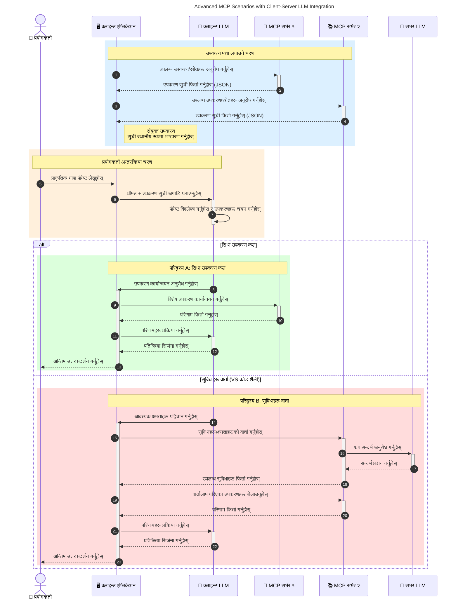

# मोडेल कन्टेक्स्ट प्रोटोकल (MCP) परिचय: स्केलेबल AI अनुप्रयोगहरूका लागि किन यो महत्वपूर्ण छ

[](https://youtu.be/agBbdiOPLQA)

_(यो पाठको भिडियो हेर्न माथि रहेको छविमा क्लिक गर्नुहोस्)_

जेनेराटिभ AI अनुप्रयोगहरू ठूलो प्रगति हुन् किनभने तिनीहरूले प्रायः प्रयोगकर्तालाई प्राकृतिक भाषाका प्रॉम्प्टहरू मार्फत एपसँग अन्तरक्रिया गर्न अनुमति दिन्छन्। यद्यपि, यस्ता अनुप्रयोगहरूमा अधिक समय र स्रोतहरू लगानी गर्नाले तपाईंले सुनिश्चित गर्न चाहानुहुन्छ कि तपाईं सुविधाहरू र स्रोतहरू सजिलै एकीकृत गर्न सक्नुहुन्छ जसले विस्तार गर्न सजिलो बनाउँछ, तपाईंको एप विभिन्न मोडेलहरू प्रयोग भइरहेको अवस्थामा सेवा गर्न सक्छ, र विभिन्न मोडेल जटिलताहरूलाई सम्हाल्न सक्छ। संक्षेपमा, जेनेराटिभ AI एपहरू बनाउन सुरुमा सजिलो छ, तर जति तिनीहरू बढ्छन् र जटिल हुन्छन्, तपाईंले वास्तुकला परिभाषित गर्न थाल्नु पर्छ र सम्भवतः एक मानकमा भर पर्नु पर्छ ताकि तपाईंका एपहरू सुसंगत तरिकाले निर्माण हुन्। यो हो जहाँ MCP आउँछ र कुराहरू व्यवस्थित गरेर मानक प्रदान गर्दछ।

---

## **🔍 मोडेल कन्टेक्स्ट प्रोटोकल (MCP) के हो?**

**मोडेल कन्टेक्स्ट प्रोटोकल (MCP)** एउटा **खुल्ला, मानकीकृत अन्तरफलक** हो जसले ठूलो भाषागत मोडेलहरू (LLMs) लाई बाह्य उपकरणहरू, API हरू, र डाटा स्रोतहरूसँग सहज रूपमा अन्तरक्रिया गर्न अनुमति दिन्छ। यसले प्रशिक्षण डाटाभन्दा पर AI मोडेलको कार्यक्षमता विस्तार गर्न सुसंगत वास्तुकला प्रदान गर्दछ, जसले दिमागिलो, स्केलेबल, र बढी प्रतिस्पन्दात्मक AI प्रणालीहरू सक्षम बनाउँछ।

---

## **🎯 AI मा मानकीकरण किन आवश्यक छ**

जब जेनेराटिभ AI अनुप्रयोगहरू जटिल बन्दै जान्छन्, त्यतिबेला **स्केलेबिलिटी, विस्तारयोग्यता, मर्मतयोग्यता**, र **विक्रेता लक-इनबाट बच्ने** यस्ता मापदण्डहरू अपनाउनु आवश्यक हुन्छ। MCP यी आवश्यकताहरूलाई यसरी सम्बोधन गर्छ:

- मोडेल-उपकरण एकीकरणलाई एकीकृत गर्दै
- कमजोर, एकल-कस्टम समाधानहरू घटाउँदै
- विभिन्न विक्रेताहरूका एक भन्दा बढी मोडेलहरू एकै इकोसिस्टममा सहअस्तित्व गर्न अनुमति दिँदै

**सूचना:** MCP आफैंलाई खुल्ला मानकको रूपमा प्रस्तुत गर्छ भने पनि, यसलाई IEEE, IETF, W3C, ISO वा कुनै अन्य मानक संगठनमार्फत आधिकारिक रूपमा मानकीकृत गर्ने योजना छैन।

---

## **📚 सिकाइका लक्ष्यहरू**

यस लेखको अन्तसम्ममा, तपाईं सक्षम हुनुहुनेछ:

- **मोडेल कन्टेक्स्ट प्रोटोकल (MCP)** परिभाषित गर्न र यसको प्रयोगका केसहरू बुझ्न
- MCP कसरी मोडेल-देखि-उपकरण संवादलाई मानकीकृत गर्छ बुझ्न
- MCP वास्तुकलाका मुख्य अङ्गहरू चिन्हित गर्न
- उद्यम र विकास सन्दर्भहरूमा MCP को वास्तविक प्रयोगहरू अन्वेषण गर्न

---

## **💡 मोडेल कन्टेक्स्ट प्रोटोकल (MCP) किन क्रान्तिकारी छ**

### **🔗 MCP ले AI अन्तरक्रियाहरूमा टुक्रावट अन्त्य गर्छ**

MCP भन्दा पहिले, मोडेलहरूलाई उपकरणहरूसँग एकीकृत गर्न आवश्यक थियो:

- प्रत्येक उपकरण-मोडेल जोडीको लागि कस्टम कोड
- हरेक विक्रेताका लागि गैर-मानक API हरू
- अपडेट हुने बेला बारम्बार अवरोधहरू
- थप उपकरणहरूका साथ खराब स्केलेबिलिटी

### **✅ MCP मानकीकरणका लाभहरू**

| **लाभ**              | **वर्णन**                                                                |
|--------------------------|--------------------------------------------------------------------------------|
| अन्तरसम्पर्कक्षमता         | LLM हरू विभिन्न विक्रेताका उपकरणहरूसँग सहज रूपमा काम गर्छन्                       |
| सुसंगतता              | प्लेटफर्म र उपकरणहरूमा समान व्यवहार                                    |
| पुन: प्रयोगयोग्यता              | एक पटक बनेका उपकरणहरू परियोजना र प्रणालीहरूमा प्रयोग गर्न सकिन्छ                       |
| विकास तीव्रता  | मानकीकृत प्लग-एन्ड-प्ले अन्तरफलक प्रयोग गरी विकास समय घटाउँछ                |

---

## **🧱 उच्च-स्तरीय MCP वास्तुकला अवलोकन**

MCP एक **क्लाइन्ट-सर्भर मोडेल** पालन गर्छ, जहाँ:

- **MCP होस्टहरू** AI मोडेलहरू चलाउँछन्
- **MCP क्लाइन्टहरू** अनुरोध आरम्भ गर्छन्
- **MCP सर्भरहरू** कन्टेक्स्ट, उपकरण, र क्षमता प्रदान गर्छन्

### **मुख्य अङ्गहरू:**

- **स्रोतहरू** – मोडेलहरूका लागि स्थिर वा गतिशील डाटा  
- **प्रॉम्प्टहरू** – पूर्वनिर्धारित कार्यप्रवाहहरू जसले दिशा निर्देश गर्छ  
- **उपकरणहरू** – खोज, गणना जस्ता कार्यहरू गर्ने कार्यसम्पादन योग्य फङ्सनहरू  
- **सम्पलिङ** – एजेन्टिक व्यवहार पुनरावृत्ता अन्तरक्रियाहरू मार्फत (MCP `2026-07-28` मा अप्रचलित; नयाँ कार्यान्वयनहरू सिधै LLM प्रदायकसँग समाकलन गर्नुपर्छ)
    
    
- **इलीसिटेशन** – प्रयोगकर्ताको इनपुटको लागि सर्भरद्वारा आरम्भ गरिएको अनुरोधहरू
- **रूटहरू** – सर्भरसँग सम्बन्धित सूचना फाइल प्रणाली स्थानहरू (MCP `2026-07-28` मा अप्रचलित; उपकरण प्यारामिटरहरू, स्रोत URI हरू वा सर्भर कन्फिगरेसन प्राथमिकता दिनु होस्)
    
    

### **प्रोटोकल वास्तुकला:**

MCP दुई तहको वास्तुकला प्रयोग गर्छ:
- **डाटा तह**: JSON-RPC 2.0 सन्देशहरू, अनुरोध-प्रति मेटाडाटा, खोज, र प्रोटोकल प्राथमिक वस्तुहरू
- **ट्रान्सपोर्ट तह**: स्थानीय उपप्रक्रियाहरूको लागि stdio र दूरस्थ सर्भरहरूको लागि स्ट्रीमयोग्य HTTP। स्ट्रीमयोग्य HTTP ले SSE फ्रेमिङ प्रयोग गर्न सक्छ स्ट्रिम गरिएको प्रतिक्रियाहरूका लागि, तर पुरानो HTTP+SSE ट्रान्सपोर्ट अप्रचलित छ।
    
    
    

---

## MCP सर्भरहरू कसरी काम गर्छन्

MCP सर्भरहरू निम्न तरिकाले सञ्चालन हुन्छन्:

- **अनुरोध प्रवाह**:
    1. अनुरोध अन्तिम प्रयोगकर्ता वा तिनीहरूको तर्फबाट कार्य गर्ने सफ्टवेयर द्वारा सुरु गरिन्छ।
    2. **MCP क्लाइन्ट** ले अनुरोधलाई **MCP होस्ट** तर्फ पठाउँछ, जसले AI मोडेल रनटाइम व्यवस्थापन गर्छ।
    3. **AI मोडेल** प्रयोगकर्ताको प्रॉम्प्ट प्राप्त गर्छ र बाह्य उपकरण वा डाटामा पहुँचका लागि एक वा अधिक उपकरण कलहरू अनुरोध गर्न सक्छ।
    4. **MCP होस्ट**, मोडेल सिधै होइन, उपयुक्त **MCP सर्भर(हरू)** सँग मानकीकृत प्रोटोकल प्रयोग गरी संवाद गर्छ।
- **MCP होस्ट कार्यक्षमता**:
    - **उपकरण दर्ता**: उपलब्ध उपकरण र तिनका क्षमताहरूको सूची राख्छ।
    - **प्रमाणीकरण**: उपकरण पहुँच अनुमति प्रमाणित गर्छ।
    - **अनुरोध ह्यान्डलर**: मोडेलबाट आउने उपकरण अनुरोधहरू प्रक्रिया गर्छ।
    - **प्रतिक्रिया स्वरूपकर्ता**: मोडेलले बुझ्ने ढाँचामा उपकरण आउटपुटहरू संरचित गर्छ।
- **MCP सर्भर कार्यान्वयन**:
    - **MCP होस्ट** ले उपकरण कलहरू एक वा बढी **MCP सर्भरहरू** तर्फ निर्देशन गर्छ, जुन विशिष्ट कार्यहरू (जस्तै खोज, गणना, डाटाबेस सोधपुछ) प्रदर्शन गर्छ।
    - **MCP सर्भरहरू** तिनका कार्यहरू सम्पन्न गरेर परिणामहरू **MCP होस्ट** लाई अति समान ढाँचामा फिर्ता पठाउँछन्।
    - **MCP होस्ट** ले ती परिणामहरू स्वरूपित गरी **AI मोडेल** तर्फ प्रसारित गर्छ।
- **प्रतिक्रिया समाप्ति**:
    - **AI मोडेल** उपकरण आउटपुटहरूलाई अन्तिम प्रतिक्रियामा समावेश गर्छ।
    - **MCP होस्ट** ले यो प्रतिक्रिया फिर्ता **MCP क्लाइन्ट** तर्फ पठाउँछ, जसले अन्तिम प्रयोगकर्ता वा कल गर्ने सफ्टवेयरसम्म पुर्‍याउँछ।
    

```mermaid
---
title: MCP Architecture and Component Interactions
description: A diagram showing the flows of the components in MCP.
---
graph TD
    Client[MCP क्लाइन्ट/एप्लिकेशन] -->|अनुरोध पठाउँछ| H[MCP होस्ट]
    H -->|सक्रिय पार्छ| A[एआई मोडेल]
    A -->|उपकरण कल अनुरोध| H
    H -->|MCP Protocol| T1[MCP Server Tool 01: वेब खोज
    H -->|MCP Protocol| T2[MCP Server Tool 02: क्यालकुलेटर उपकरण
    H -->|MCP Protocol| T3[MCP Server Tool 03: डाटाबेस पहुँच उपकरण
    H -->|MCP Protocol| T4[MCP Server Tool 04: फाइल सिस्टम उपकरण
    H -->|प्रतिक्रिया पठाउँछ| Client

    subgraph "MCP होस्ट कम्पोनेन्टहरू"
        H
        G[उपकरण दर्ता]
        I[प्रमाणीकरण]
        J[अनुरोध ह्यान्डलर]
        K[प्रतिक्रिया फर्माटर]
    end

    H <--> G
    H <--> I
    H <--> J
    H <--> K

    style A fill:#f9d5e5,stroke:#333,stroke-width:2px
    style H fill:#eeeeee,stroke:#333,stroke-width:2px
    style Client fill:#d5e8f9,stroke:#333,stroke-width:2px
    style G fill:#fffbe6,stroke:#333,stroke-width:1px
    style I fill:#fffbe6,stroke:#333,stroke-width:1px
    style J fill:#fffbe6,stroke:#333,stroke-width:1px
    style K fill:#fffbe6,stroke:#333,stroke-width:1px
    style T1 fill:#c2f0c2,stroke:#333,stroke-width:1px
    style T2 fill:#c2f0c2,stroke:#333,stroke-width:1px
    style T3 fill:#c2f0c2,stroke:#333,stroke-width:1px
    style T4 fill:#c2f0c2,stroke:#333,stroke-width:1px
```

## 👨‍💻 MCP सर्भर कसरी बनाउने (उदाहरणसहित)

MCP सर्भरहरूले तपाईंलाई डाटा र कार्यक्षमता प्रदान गरेर LLM क्षमताहरू विस्तार गर्न अनुमति दिन्छ। 

प्रयोग गर्न तयार हुनुहुन्छ? यहाँ विभिन्न भाषा/स्ट्याकका SDK हरू छन् जसमा विभिन्न भाषाहरू/स्ट्याकहरूमा सरल MCP सर्भरहरू बनाउन उदाहरणहरू छन्:

- **Python SDK**: https://github.com/modelcontextprotocol/python-sdk

- **TypeScript SDK**: https://github.com/modelcontextprotocol/typescript-sdk

- **Java SDK**: https://github.com/modelcontextprotocol/java-sdk

- **C#/.NET SDK**: https://github.com/modelcontextprotocol/csharp-sdk


## 🌍 MCP का वास्तविक-विश्व प्रयोग केसहरू

MCP ले AI क्षमताहरू विस्तार गरेर विभिन्न प्रकारका अनुप्रयोगहरू सक्षम पार्दछ:

| **अनुप्रयोग**              | **वर्णन**                                                                |
|------------------------------|--------------------------------------------------------------------------------|
| उद्यम डाटा एकीकरण  | LLM हरूलाई डेटाबेस, CRM हरू, वा आन्तरिक उपकरणहरूसँग जडान गर्नु                              |
| एजेन्टिक AI प्रणालीहरू           | उपकरण पहुँच र निर्णय-निर्माण कार्यप्रवाह सहित स्वतन्त्र एजेन्टहरू सक्षम पार्नु        |
| बहु-मोडल अनुप्रयोगहरू     | एकल एकीकृत AI एपमा पाठ, छवि, र अडियो उपकरणहरू संयोजन गर्नु            |
| वास्तविक-समय डाटा एकीकरण   | जीवित डाटा AI अन्तरक्रियामा ल्याएर अझ ठिक र वर्तमान उत्पादनहरू दिनु        |


### 🧠 MCP = AI अन्तरक्रियाहरूका लागि सार्वभौमिक मानक

मोडेल कन्टेक्स्ट प्रोटोकल (MCP) AI अन्तरक्रियाहरूका लागि सार्वभौमिक मानकको रूपमा काम गर्छ, जस्तै USB-C ले उपकरणहरूको भौतिक जडानलाई मानकीकृत गर्यो। AI संसारमा, MCP ले एक सुसंगत अन्तरफलक प्रदान गर्दछ, जसले मोडेलहरू (क्लाइन्टहरू) लाई बाह्य उपकरण र डाटा प्रदायकहरू (सर्भरहरू) सँग सहज रूपमा एकीकृत हुन दिन्छ। यसले हरेक API वा डाटा स्रोतका लागि फरक फरक, कस्टम प्रोटोकलहरूको आवश्यकतालाई हटाउँछ।

MCP अन्तर्गत, एक MCP-अनुकूल उपकरण (जुन MCP सर्भर भनिन्छ) एकीकृत मानक पालना गर्दछ। यी सर्भरहरूले आफुले प्रदान गर्ने उपकरण वा क्रियाहरू सूचीबद्ध गर्न सक्छन् र AI एजेन्टले अनुरोध गर्दा ती क्रियाहरूलाई कार्यान्वयन गर्छन्। MCP समर्थित AI एजेन्ट प्लेटफर्महरूले सर्भरहरूबाट उपलब्ध उपकरणहरू पत्ता लगाउन र यस मानक प्रोटोकल मार्फत तिनलाई बोलाउन सक्षम हुन्छन्।

### 💡 ज्ञान पहुँचलाई सजिलो बनाउँछ

उपकरणहरू मात्र उपलब्ध गराउनुको बाहेक, MCP ले ज्ञान पहुँचमा पनि मद्दत पुर्‍याउँछ। यसले अनुप्रयोगहरूलाई ठूलो भाषागत मोडेलहरू (LLMs) लाई विभिन्न डाटा स्रोतहरूसँग लिंक गरेर सन्दर्भ प्रदान गर्न सक्षम बनाउँछ। उदाहरणका लागि, एक MCP सर्भर कम्पनीको कागजात रिपोजिटरी प्रतिनिधित्व गर्न सक्छ, जसले एजेन्टहरूलाई अनुरोध अनुसार सान्दर्भिक जानकारी ल्याउन दिन्छ। अर्को सर्भरले इमेल पठाउने वा रेकर्ड अपडेट गर्ने जस्ता विशिष्ट क्रियाहरू सम्हाल्न सक्छ। एजेन्टको दृष्टिले, यी सबै उपकरणहरू जस्तै हुन्छन्—केही उपकरणहरूले डाटा (ज्ञान सन्दर्भ) फिर्ता गर्छन्, जबकि केहीले क्रियाहरू प्रदर्शन गर्छन्। MCP यी दुवैलाई प्रभावकारी रूपमा व्यवस्थापन गर्छ।

एक एजेन्टले MCP सर्भरसँग जडान गर्दा स्वतः नै सर्भरको उपलब्ध क्षमता र पहुँचयोग्य डाटा मानकीकृत ढाँचामा सिक्छ। यस मानकीकरणले गतिशील उपकरण उपलब्धता सक्षम पार्दछ। उदाहरणका लागि, कुनै नयाँ MCP सर्भर एजेन्टको प्रणालीमा थप्दा, यसको कार्यहरू तत्काल प्रयोग गर्न मिल्छ, एजेन्टका निर्देशनहरूमा थप अनुकूलन आवश्यक बिना।

यो सरल एकीकरण तलको चित्रमा देखाइएको प्रवाहसँग मेल खान्छ, जहाँ सर्भरहरूले उपकरण र ज्ञान दुबै प्रदान गर्छन्, प्रणालीहरू बीच सहज सहकार्य सुनिश्चित गर्दै। 

### 👉 उदाहरण: स्केलेबल एजेन्ट समाधान

```mermaid
---
title: Scalable Agent Solution with MCP
description: A diagram illustrating how a user interacts with an LLM that connects to multiple MCP servers, with each server providing both knowledge and tools, creating a scalable AI system architecture
---
graph TD
    User -->|सोधपुछ| LLM
    LLM -->|प्रतिक्रिया| User
    LLM -->|MCP| ServerA
    LLM -->|MCP| ServerB
    ServerA -->|युनिभर्सल कनेक्टर| ServerB
    ServerA --> KnowledgeA
    ServerA --> ToolsA
    ServerB --> KnowledgeB
    ServerB --> ToolsB

    subgraph सर्भर A
        KnowledgeA[ज्ञान]
        ToolsA[उपकरणहरू]
    end

    subgraph सर्भर B
        KnowledgeB[ज्ञान]
        ToolsB[उपकरणहरू]
    end
```
सार्वभौमिक कनेक्टरले MCP सर्भरहरूलाई आपसमा संवाद गर्न र क्षमताहरू साझा गर्न सक्षम पार्छ, जसले ServerA लाई ServerB लाई कार्यहरू सुम्पन वा यसको उपकरण र ज्ञानमा पहुँच पाउन अनुमति दिन्छ। यसले सर्भरहरू बीच उपकरण र डाटाको संघ बनाउँछ, स्केलेबल र मोडुलर एजेन्ट वास्तुकलाहरूलाई समर्थन गर्दै। MCP ले उपकरण प्रदर्शनलाई मानकीकृत गर्ने भएकाले, एजेन्टहरूले सर्भरहरू बीच अनुरोधहरू गतिशील रूपमा पत्ता लगाउन र मार्गनिर्देशन गर्न सक्छन्, पूर्वनिर्धारित एकीकरण बिना।


उपकरण र ज्ञान संघ: उपकरण र डाटा सर्भरहरूमा पहुँचयोग्य हुन्छन्, जसले बढी स्केलेबल र मोडुलर एजेन्टिक वास्तुकलाहरू सक्षम पार्छ।

### 🔄 ग्राहक-क्षेत्र LLM समाकलनसहित उन्नत MCP परिदृश्यहरू

आधारभूत MCP वास्तुकलाको अलावा, त्यहाँ उन्नत परिदृश्यहरू छन् जहाँ दुवै क्लाइन्ट र सर्भरमा LLM हुन्छ, जसले थप परिष्कृत अन्तरक्रियाहरू सक्षम बनाउँछ। निम्न चित्रमा, **क्लाइन्ट एप** प्रयोगकर्ताद्वारा LLM प्रयोग गरेर धेरै MCP उपकरणहरू भएको IDE हुन सक्छ:



## 🔐 MCP का व्यावहारिक लाभहरू

MCP प्रयोग गर्दा निम्न व्यावहारिक लाभहरू छन्:

- **ताजगी**: मोडेलहरूले उनीहरूको प्रशिक्षण डाटाभन्दा परको अद्यावधिक जानकारी पहुँच गर्न सक्छन्
- **क्षमता विस्तार**: मोडेलहरूले त्यो कार्यका लागि विशेषज्ञ उपकरणहरू प्रयोग गर्न सक्छन् जुनमा प्रशिक्षण पाएका थिएनन्
- **कल्पनाहरूमा कमी**: बाह्य डाटा स्रोतहरूले तथ्यात्मक आधार प्रदान गर्छन्
- **गोपनीयता**: संवेदनशील डाटा सन्दर्भहरूमा समावेश हुनुको सट्टा सुरक्षित वातावरणभित्र रहन सक्छ

## 📌 मुख्य निष्कर्षहरू

MCP प्रयोग गर्दा यी मुख्य निष्कर्षहरू छन्:

- **MCP** ले AI मोडेलहरूलाई उपकरण र डाटासँग अन्तरक्रिया गर्ने तरिका मानकीकृत गर्छ
- **विस्तारयोग्यता, सुसंगतता, र अन्तरसम्पर्कक्षमता** प्रवर्द्धन गर्छ
- MCP ले **विकास समय घटाउने, विश्वसनीयता सुधार्ने, र मोडेल क्षमताहरू विस्तार गर्ने** मद्दत गर्छ
- क्लाइन्ट-सर्भर वास्तुकलाले **लचिलो, विस्तारयोग्य AI अनुप्रयोगहरू** सक्षम बनाउँछ

## 🧠 अभ्यास

तपाईंले बनाउने इच्छाएको AI अनुप्रयोगको बारेमा सोच्नुहोस्।

- कुन **बाह्य उपकरण वा डाटा** ले यसको क्षमताहरू बढाउन सक्छ?
- MCP ले एकीकरणलाई **सरल र भरपर्दो** बनाउन कसरी मद्दत गर्न सक्छ?

## अतिरिक्त स्रोतहरू

- [MCP GitHub Repository](https://github.com/modelcontextprotocol)


## के छ अर्को

अर्को: [अध्याय १: मुख्य अवधारणाहरू](../01-CoreConcepts/README.md)

---

<!-- CO-OP TRANSLATOR DISCLAIMER START -->
**अस्वीकरण**:
यो दस्तावेज़ AI अनुवाद सेवा [Co-op Translator](https://github.com/Azure/co-op-translator) प्रयोग गरेर अनुवाद गरिएको हो। हामी सही हुन प्रयास गर्छौं, तर कृपया जानकार हुनुस् कि स्वचालित अनुवादमा त्रुटिहरू वा अशुद्धताहरू हुन सक्छन्। मूल दस्तावेज़ यसको मूल भाषामा आधिकारिक स्रोत मानिनुपर्छ। महत्वपूर्ण जानकारीका लागि व्यावसायिक मानव अनुवाद सिफारिस गरिन्छ। यस अनुवादको प्रयोगबाट उत्पन्न कुनै पनि गलत बुझाइ वा त्रुटिको लागि हामी जिम्मेवार छैनौं।
<!-- CO-OP TRANSLATOR DISCLAIMER END -->