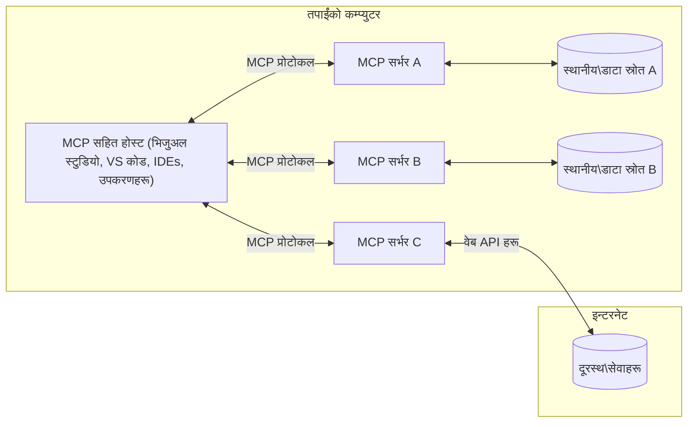

# MCP कोर अवधारणाहरू: AI एकीकरणका लागि मोडेल सन्दर्भ प्रोटोकलमा दक्षता हासिल गर्नुहोस्

[](https://youtu.be/earDzWGtE84)

_(यो पाठको भिडियो हेर्न माथिको छवि क्लिक गर्नुहोस्)_

[Model Context Protocol (MCP)](https://github.com/modelcontextprotocol) एक शक्तिशाली, मानकीकृत फ्रेमवर्क हो जसले ठूलो भाषा मोडेलहरू (LLMs) र बाह्य उपकरणहरू, अनुप्रयोगहरू, र डाटा स्रोतहरू बीचको सञ्चारलाई अनुकूलित गर्दछ।  
यो मार्गदर्शिकाले तपाईंलाई MCP का कोर अवधारणाहरू मार्फत लैजानेछ। तपाईं यसको क्लाइन्ट-सर्भर वास्तुकला, आवश्यक कम्पोनेन्टहरू, सञ्चार यान्त्रिकी, र कार्यान्वयनका उत्तम अभ्यासहरूबारे सिक्नुहुनेछ।

- **स्पष्ट प्रयोगकर्ता सहमति**: सबै डाटा पहुँच र अपरेसनहरू कार्यान्वयन अघि स्पष्ट प्रयोगकर्ता अनुमोदन आवश्यक हुन्छ। प्रयोगकर्ताले के डाटा पहुँच गरिनेछ र के क्रियाहरू गरिनेछन् स्पष्ट रूपमा बुझ्नुपर्छ, अनुमति र प्राधिकरणहरूमा सूक्ष्म नियन्त्रण सहित।

- **डाटा गोपनीयता संरक्षण**: प्रयोगकर्ताको डाटा केवल स्पष्ट सहमतिसँग मात्र खुलासा गरिन्छ र सम्पूर्ण अन्तरक्रिया जीवनचक्रमा कडा पहुँच नियन्त्रणद्वारा सुरक्षित हुनुपर्छ। कार्यान्वयनहरूले अनधिकृत डाटा प्रसारण रोक्न र कडा गोपनीयता सीमाहरू कायम राख्नुपर्छ।

- **उपकरण कार्यान्वयन सुरक्षा**: प्रत्येक उपकरण आह्वानमा स्पष्ट प्रयोगकर्ता सहमति आवश्यक छ जसले उपकरणको कार्यक्षमता, प्यारामिटरहरू, र सम्भावित प्रभाव स्पष्ट रूपमा बुझ्न सकियोस्। कडा सुरक्षा सीमाहरूले अनपेक्षित, असुरक्षित, वा दुष्ट उपकरण कार्यान्वयन रोक्नुपर्छ।

- **ट्रान्सपोर्ट लेयर सुरक्षा**: सबै सञ्चार च्यानलहरूले उपयुक्त इन्क्रिप्सन र प्रमाणीकरण यन्त्रहरू प्रयोग गर्नुपर्छ। रिमोट कनेक्शनहरूले सुरक्षित ट्रान्सपोर्ट प्रोटोकलहरू र उचित प्रमाणपत्र व्यवस्थापन कार्यान्वयन गर्नुपर्छ।

#### कार्यान्वयन मार्गनिर्देशनहरू:

- **अनुमति व्यवस्थापन**: प्रयोगकर्ताहरूलाई कुन सर्भरहरू, उपकरणहरू, र स्रोतहरू पहुँचयोग्य छन् नियन्त्रण गर्न सक्ने सूक्ष्म अनुमति प्रणालीहरू कार्यान्वयन गर्नुहोस्  
- **प्रमाणीकरण र प्राधिकरण**: सुरक्षित प्रमाणीकरण विधिहरू (OAuth, API कुञ्जीहरू) प्रयोग गर्नुहोस् उचित टोकन व्यवस्थापन र समाप्ति सहित  
- **इनपुट प्रमाणीकरण**: सबै प्यारामिटरहरू र डाटा इनपुटहरू परिभाषित स्किमाहरू अनुसार प्रमाणीकरण गर्नुहोस् जसले इन्जेक्सन आक्रमणहरू रोक्छ  
- **अडिट लगिङ**: सुरक्षा अनुगमन र अनुपालनका लागि सबै अपरेसनहरूको व्यापक लगहरू राख्नुहोस्

## अवलोकन

यो पाठले Model Context Protocol (MCP) पारिस्थितिकी तन्त्र बनाउने आधारभूत वास्तुकला र कम्पोनेन्टहरू अन्वेषण गर्दछ। तपाईंले क्लाइन्ट-सर्भर वास्तुकला, मुख्य कम्पोनेन्टहरू, र सञ्चार यान्त्रिकीहरूबारे सिक्नुहुनेछ जसले MCP अन्तरक्रियाहरूलाई सशक्त बनाउँछ।

## मुख्य सिकाइ उद्देश्यहरू

यस पाठको अन्त्यसम्म, तपाईंले:

- MCP क्लाइन्ट-सर्भर वास्तुकला बुझ्नुहुनेछ।  
- होस्टहरू, क्लाइन्टहरू, र सर्भरहरूको भूमिका र जिम्मेवारीहरू पहिचान गर्नुहुनेछ।  
- MCP लाई लचिलो एकीकरण तह बनाउने कोर सुविधाहरू विश्लेषण गर्नुहुनेछ।  
- MCP पारिस्थितिकी तन्त्र भित्र सूचना प्रवाह कसरी हुन्छ जान्नुहुनेछ।  
- .NET, Java, Python, र JavaScript मा कोड उदाहरणहरू मार्फत व्यावहारिक अन्तर्दृष्टि प्राप्त गर्नुहुनेछ।

## MCP वास्तुकला: गहिरो दृष्टि

MCP पारिस्थितिकी तन्त्र क्लाइन्ट-सर्भर मोडेलमा आधारित छ। यो मोड्युलर संरचनाले AI अनुप्रयोगहरूलाई उपकरणहरू, डाटाबेसहरू, API हरू, र सन्दर्भ स्रोतहरूसँग प्रभावकारी रूपमा अन्तरक्रिया गर्न अनुमति दिन्छ। आउनुहोस् यस वास्तुकलालाई यसको कोर कम्पोनेन्टहरूमा विभाजन गरौं।

यसको मूलमा, MCP ले क्लाइन्ट-सर्भर वास्तुकला अनुसरण गर्दछ जहाँ होस्ट अनुप्रयोगले धेरै सर्भरहरूसँग जडान गर्न सक्छ:


- **MCP होस्टहरू**: VSCode, Claude Desktop, IDE हरू, वा MCP मार्फत डाटा पहुँच गर्न चाहने AI उपकरणहरू जस्ता प्रोग्रामहरू  
- **MCP क्लाइन्टहरू**: सर्भरहरूसँग 1:1 जडान कायम राख्ने प्रोटोकल क्लाइन्टहरू  
- **MCP सर्भरहरू**: प्रत्येकले मानकीकृत Model Context Protocol मार्फत विशिष्ट क्षमता प्रदर्शन गर्ने हल्का प्रोग्रामहरू  
- **स्थानीय डाटा स्रोतहरू**: तपाईंको कम्प्युटरका फाइलहरू, डाटाबेसहरू, र सेवाहरू जुन MCP सर्भरहरूले सुरक्षित रूपमा पहुँच गर्न सक्छन्  
- **रिमोट सेवाहरू**: इन्टरनेटमा उपलब्ध बाह्य प्रणालीहरू जुन MCP सर्भरहरूले API मार्फत जडान गर्न सक्छन्।

MCP प्रोटोकल एक विकासशील मानक हो जुन मिति-आधारित संस्करण (YYYY-MM-DD ढाँचा) प्रयोग गर्दछ। वर्तमान प्रोटोकल संस्करण **2025-11-25** हो। तपाईं [प्रोटोकल विशिष्टता](https://modelcontextprotocol.io/specification/2025-11-25/) मा पछिल्ला अपडेटहरू हेर्न सक्नुहुन्छ।

### 1. होस्टहरू

Model Context Protocol (MCP) मा, **होस्टहरू** AI अनुप्रयोगहरू हुन् जुन प्रयोगकर्ताहरूले प्रोटोकलसँग अन्तरक्रिया गर्ने प्राथमिक इन्टरफेसको रूपमा सेवा गर्छन्। होस्टहरूले प्रत्येक सर्भर जडानका लागि समर्पित MCP क्लाइन्टहरू सिर्जना गरेर धेरै MCP सर्भरहरूसँग जडानहरू समन्वय र व्यवस्थापन गर्छन्। होस्टहरूको उदाहरणहरू:

- **AI अनुप्रयोगहरू**: Claude Desktop, Visual Studio Code, Claude Code  
- **विकास वातावरणहरू**: MCP एकीकरण भएका IDE हरू र कोड सम्पादकहरू  
- **अनुकूलित अनुप्रयोगहरू**: उद्देश्य-निर्मित AI एजेन्टहरू र उपकरणहरू

**होस्टहरू** ती अनुप्रयोगहरू हुन् जसले AI मोडेल अन्तरक्रियाहरू समन्वय गर्छन्। तिनीहरूले:

- **AI मोडेलहरू सञ्चालन गर्छन्**: प्रतिक्रिया उत्पन्न गर्न वा AI कार्यप्रवाहहरू समन्वय गर्न LLM हरूसँग अन्तरक्रिया गर्छन्  
- **क्लाइन्ट जडानहरू व्यवस्थापन गर्छन्**: प्रत्येक MCP सर्भर जडानका लागि एक MCP क्लाइन्ट सिर्जना र कायम राख्छन्  
- **प्रयोगकर्ता इन्टरफेस नियन्त्रण गर्छन्**: संवाद प्रवाह, प्रयोगकर्ता अन्तरक्रिया, र प्रतिक्रिया प्रस्तुति सम्हाल्छन्  
- **सुरक्षा लागू गर्छन्**: अनुमति, सुरक्षा सीमाहरू, र प्रमाणीकरण नियन्त्रण गर्छन्  
- **प्रयोगकर्ता सहमति सम्हाल्छन्**: डाटा साझेदारी र उपकरण कार्यान्वयनका लागि प्रयोगकर्ता अनुमोदन व्यवस्थापन गर्छन्

### 2. क्लाइन्टहरू

**क्लाइन्टहरू** आवश्यक कम्पोनेन्टहरू हुन् जसले होस्ट र MCP सर्भरहरू बीच समर्पित एक-देखि-एक जडानहरू कायम राख्छन्। प्रत्येक MCP क्लाइन्ट होस्टद्वारा एक विशिष्ट MCP सर्भरसँग जडान गर्न सिर्जना गरिन्छ, जसले व्यवस्थित र सुरक्षित सञ्चार च्यानलहरू सुनिश्चित गर्छ। धेरै क्लाइन्टहरूले होस्टहरूलाई एकै समयमा धेरै सर्भरहरूसँग जडान हुन सक्षम बनाउँछन्।

**क्लाइन्टहरू** होस्ट अनुप्रयोग भित्रका कनेक्टर कम्पोनेन्टहरू हुन्। तिनीहरूले:

- **प्रोटोकल सञ्चार**: सर्भरहरूलाई JSON-RPC 2.0 अनुरोधहरू पठाउँछन्, प्रॉम्प्ट र निर्देशनहरूसहित  
- **क्षमता वार्ता**: सुरुवातमा सर्भरहरूसँग समर्थित सुविधाहरू र प्रोटोकल संस्करणहरूमा वार्ता गर्छन्  
- **उपकरण कार्यान्वयन**: मोडेलहरूबाट उपकरण कार्यान्वयन अनुरोधहरू व्यवस्थापन र प्रतिक्रिया प्रक्रिया गर्छन्  
- **रियल-टाइम अपडेटहरू**: सर्भरहरूबाट सूचना र रियल-टाइम अपडेटहरू सम्हाल्छन्  
- **प्रतिक्रिया प्रक्रिया**: प्रयोगकर्तालाई प्रदर्शनका लागि सर्भर प्रतिक्रियाहरू प्रक्रिया र स्वरूपित गर्छन्

### 3. सर्भरहरू

**सर्भरहरू** प्रोग्रामहरू हुन् जसले MCP क्लाइन्टहरूलाई सन्दर्भ, उपकरणहरू, र क्षमताहरू प्रदान गर्छन्। तिनीहरू स्थानीय रूपमा (होस्टसँग एउटै मेसिनमा) वा रिमोट रूपमा (बाह्य प्लेटफर्महरूमा) सञ्चालन गर्न सक्छन्, र क्लाइन्ट अनुरोधहरू सम्हाल्ने र संरचित प्रतिक्रिया प्रदान गर्ने जिम्मेवारी लिन्छन्। सर्भरहरूले मानकीकृत Model Context Protocol मार्फत विशिष्ट कार्यक्षमता प्रदर्शन गर्छन्।

**सर्भरहरू** सेवा हुन् जसले सन्दर्भ र क्षमताहरू प्रदान गर्छन्। तिनीहरूले:

- **विशेषता दर्ता**: क्लाइन्टहरूलाई उपलब्ध प्रिमिटिभहरू (स्रोतहरू, प्रॉम्प्टहरू, उपकरणहरू) दर्ता र प्रदर्शन गर्छन्  
- **अनुरोध प्रक्रिया**: क्लाइन्टहरूबाट उपकरण कलहरू, स्रोत अनुरोधहरू, र प्रॉम्प्ट अनुरोधहरू प्राप्त र कार्यान्वयन गर्छन्  
- **सन्दर्भ प्रदान**: मोडेल प्रतिक्रियाहरू सुधार गर्न सन्दर्भगत जानकारी र डाटा प्रदान गर्छन्  
- **राज्य व्यवस्थापन**: सत्र अवस्था कायम राख्छन् र आवश्यक परेमा अवस्थासम्बन्धी अन्तरक्रियाहरू सम्हाल्छन्  
- **रियल-टाइम सूचनाहरू**: क्षमता परिवर्तन र अपडेटहरूबारे जडान भएका क्लाइन्टहरूलाई सूचनाहरू पठाउँछन्

सर्भरहरूलाई कुनै पनि व्यक्तिले मोडेल क्षमताहरूलाई विशेष कार्यक्षमतासँग विस्तार गर्न विकास गर्न सक्छन्, र तिनीहरूले स्थानीय र रिमोट दुवै परिनियोजन परिदृश्यहरू समर्थन गर्छन्।

### 4. सर्भर प्रिमिटिभहरू

Model Context Protocol (MCP) मा सर्भरहरूले तीन मुख्य **प्रिमिटिभहरू** प्रदान गर्छन् जसले क्लाइन्टहरू, होस्टहरू, र भाषा मोडेलहरू बीच समृद्ध अन्तरक्रियाका आधारभूत निर्माण ब्लकहरू परिभाषित गर्छन्। यी प्रिमिटिभहरूले प्रोटोकल मार्फत उपलब्ध सन्दर्भगत जानकारी र क्रियाहरूको प्रकारहरू निर्दिष्ट गर्छन्।

MCP सर्भरहरूले तलका तीन मुख्य प्रिमिटिभहरूको कुनै पनि संयोजन प्रदर्शन गर्न सक्छन्:

#### स्रोतहरू

**स्रोतहरू** डाटा स्रोतहरू हुन् जसले AI अनुप्रयोगहरूलाई सन्दर्भगत जानकारी प्रदान गर्छन्। तिनीहरूले स्थिर वा गतिशील सामग्री प्रतिनिधित्व गर्छन् जसले मोडेल बुझाइ र निर्णय प्रक्रियालाई सुधार गर्न सक्छ:

- **सन्दर्भगत डाटा**: AI मोडेल उपभोगका लागि संरचित जानकारी र सन्दर्भ  
- **ज्ञान आधारहरू**: कागजात भण्डार, लेखहरू, म्यानुअलहरू, र अनुसन्धान पत्रहरू  
- **स्थानीय डाटा स्रोतहरू**: फाइलहरू, डाटाबेसहरू, र स्थानीय प्रणाली जानकारी  
- **बाह्य डाटा**: API प्रतिक्रिया, वेब सेवा, र रिमोट प्रणाली डाटा  
- **गतिशील सामग्री**: बाह्य अवस्थाहरूमा आधारित वास्तविक-समय डाटा अपडेटहरू

स्रोतहरू URI द्वारा पहिचान गरिन्छ र `resources/list` मार्फत खोजी र `resources/read` विधिहरू मार्फत प्राप्त गर्न सकिन्छ:

```text
file://documents/project-spec.md
database://production/users/schema
api://weather/current
```

#### प्रॉम्प्टहरू

**प्रॉम्प्टहरू** पुन: प्रयोग गर्न मिल्ने टेम्प्लेटहरू हुन् जसले भाषा मोडेलहरूसँग अन्तरक्रियालाई संरचित गर्न मद्दत गर्छन्। तिनीहरूले मानकीकृत अन्तरक्रिया ढाँचाहरू र टेम्प्लेट गरिएको कार्यप्रवाहहरू प्रदान गर्छन्:

- **टेम्प्लेट-आधारित अन्तरक्रिया**: पूर्व-संरचित सन्देशहरू र संवाद सुरु गर्ने तरिकाहरू  
- **कार्यप्रवाह टेम्प्लेटहरू**: सामान्य कार्यहरू र अन्तरक्रियाहरूका लागि मानकीकृत अनुक्रमहरू  
- **थोरै-शट उदाहरणहरू**: मोडेल निर्देशनका लागि उदाहरण-आधारित टेम्प्लेटहरू  
- **प्रणाली प्रॉम्प्टहरू**: मोडेल व्यवहार र सन्दर्भ परिभाषित गर्ने आधारभूत प्रॉम्प्टहरू  
- **गतिशील टेम्प्लेटहरू**: विशिष्ट सन्दर्भहरूमा अनुकूल हुने प्यारामिटरयुक्त प्रॉम्प्टहरू

प्रॉम्प्टहरूले भेरिएबल प्रतिस्थापन समर्थन गर्छन् र `prompts/list` मार्फत खोजी र `prompts/get` मार्फत प्राप्त गर्न सकिन्छ:

```markdown
Generate a {{task_type}} for {{product}} targeting {{audience}} with the following requirements: {{requirements}}
```

#### उपकरणहरू

**उपकरणहरू** कार्यान्वयन योग्य कार्यहरू हुन् जुन AI मोडेलहरूले विशिष्ट क्रियाहरू गर्न आह्वान गर्न सक्छन्। तिनीहरूले MCP पारिस्थितिकी तन्त्रका "क्रियापद" प्रतिनिधित्व गर्छन्, जसले मोडेलहरूलाई बाह्य प्रणालीहरूसँग अन्तरक्रिया गर्न सक्षम बनाउँछन्:

- **कार्यान्वयन योग्य कार्यहरू**: मोडेलहरूले विशिष्ट प्यारामिटरहरूसँग आह्वान गर्न सक्ने पृथक अपरेसनहरू  
- **बाह्य प्रणाली एकीकरण**: API कलहरू, डाटाबेस क्वेरीहरू, फाइल अपरेसनहरू, गणना  
- **विशिष्ट पहिचान**: प्रत्येक उपकरणसँग फरक नाम, विवरण, र प्यारामिटर स्किमा हुन्छ  
- **संरचित I/O**: उपकरणहरूले प्रमाणीकरण गरिएका प्यारामिटरहरू स्वीकार्छन् र संरचित, टाइप गरिएको प्रतिक्रिया फर्काउँछन्  
- **क्रिया क्षमताहरू**: मोडेलहरूलाई वास्तविक-विश्व क्रियाहरू गर्न र प्रत्यक्ष डाटा प्राप्त गर्न सक्षम बनाउँछन्

उपकरणहरू प्यारामिटर प्रमाणीकरणका लागि JSON Schema प्रयोग गरेर परिभाषित गरिन्छ र `tools/list` मार्फत खोजी र `tools/call` मार्फत कार्यान्वयन गरिन्छ:

```typescript
server.tool(
  "search_products", 
  {
    query: z.string().describe("Search query for products"),
    category: z.string().optional().describe("Product category filter"),
    max_results: z.number().default(10).describe("Maximum results to return")
  }, 
  async (params) => {
    // खोज कार्यान्वयन गर्नुहोस् र संरचित परिणामहरू फिर्ता गर्नुहोस्
    return await productService.search(params);
  }
);
```

## क्लाइन्ट प्रिमिटिभहरू

Model Context Protocol (MCP) मा, **क्लाइन्टहरूले** प्रिमिटिभहरू प्रदर्शन गर्न सक्छन् जसले सर्भरहरूलाई होस्ट अनुप्रयोगबाट थप क्षमताहरू अनुरोध गर्न सक्षम बनाउँछन्। यी क्लाइन्ट-पक्ष प्रिमिटिभहरूले अधिक समृद्ध, अन्तरक्रियात्मक सर्भर कार्यान्वयनहरूलाई अनुमति दिन्छन् जसले AI मोडेल क्षमताहरू र प्रयोगकर्ता अन्तरक्रियाहरू पहुँच गर्न सक्छन्।

### नमुना सङ्कलन (Sampling)

**नमुना सङ्कलन** ले सर्भरहरूलाई क्लाइन्टको AI अनुप्रयोगबाट भाषा मोडेल पूर्तिहरू अनुरोध गर्न अनुमति दिन्छ। यस प्रिमिटिभले सर्भरहरूलाई आफ्नै मोडेल निर्भरता समावेश नगरी LLM क्षमताहरू पहुँच गर्न सक्षम बनाउँछ:

- **मोडेल-स्वतन्त्र पहुँच**: सर्भरहरूले LLM SDK समावेश नगरी वा मोडेल पहुँच व्यवस्थापन नगरी पूर्तिहरू अनुरोध गर्न सक्छन्  
- **सर्भर-प्रेरित AI**: सर्भरहरूलाई क्लाइन्टको AI मोडेल प्रयोग गरेर स्वतन्त्र रूपमा सामग्री सिर्जना गर्न सक्षम बनाउँछ  
- **पुनरावृत्त LLM अन्तरक्रिया**: जटिल परिदृश्यहरू समर्थन गर्छ जहाँ सर्भरहरूले प्रक्रिया गर्न AI सहयोग आवश्यक पर्छ  
- **गतिशील सामग्री सिर्जना**: होस्टको मोडेल प्रयोग गरेर सन्दर्भगत प्रतिक्रियाहरू सिर्जना गर्न सर्भरहरूलाई अनुमति दिन्छ

नमुना सङ्कलन `sampling/complete` विधि मार्फत सुरु गरिन्छ, जहाँ सर्भरहरूले पूर्ति अनुरोधहरू क्लाइन्टहरूलाई पठाउँछन्।

### जानकारी सङ्कलन (Elicitation)

**जानकारी सङ्कलन** ले सर्भरहरूलाई क्लाइन्ट इन्टरफेसमार्फत प्रयोगकर्ताबाट थप जानकारी वा पुष्टि अनुरोध गर्न सक्षम बनाउँछ:

- **प्रयोगकर्ता इनपुट अनुरोधहरू**: उपकरण कार्यान्वयनका लागि आवश्यक थप जानकारी सर्भरहरूले सोध्न सक्छन्  
- **पुष्टि संवादहरू**: संवेदनशील वा प्रभावकारी अपरेसनहरूको लागि प्रयोगकर्ता अनुमोदन अनुरोध  
- **अन्तरक्रियात्मक कार्यप्रवाहहरू**: सर्भरहरूले चरण-द्वारा-चरण प्रयोगकर्ता अन्तरक्रिया सिर्जना गर्न सक्षम बनाउँछन्  
- **गतिशील प्यारामिटर सङ्कलन**: उपकरण कार्यान्वयनको क्रममा हराएका वा वैकल्पिक प्यारामिटरहरू सङ्कलन

जानकारी सङ्कलन अनुरोधहरू `elicitation/request` विधि प्रयोग गरी क्लाइन्टको इन्टरफेसमार्फत प्रयोगकर्ता इनपुट सङ्कलन गर्न गरिन्छ।

### लगिङ

**लगिङ** ले सर्भरहरूलाई डिबगिङ, अनुगमन, र सञ्चालन दृश्यताका लागि संरचित लग सन्देशहरू क्लाइन्टहरूलाई पठाउन अनुमति दिन्छ:

- **डिबगिङ समर्थन**: समस्या समाधानका लागि विस्तृत कार्यान्वयन लगहरू प्रदान गर्न सर्भरहरूलाई सक्षम बनाउँछ  
- **सञ्चालन अनुगमन**: क्लाइन्टहरूलाई स्थिति अपडेट र प्रदर्शन मेट्रिक्स पठाउँछ  
- **त्रुटि रिपोर्टिङ**: विस्तृत त्रुटि सन्दर्भ र निदान जानकारी प्रदान गर्छ  
- **अडिट ट्रेलहरू**: सर्भर अपरेसन र निर्णयहरूको व्यापक लगहरू सिर्जना गर्छ

लगिङ सन्देशहरू सर्भर अपरेसनहरूमा पारदर्शिता प्रदान गर्न र डिबगिङ सजिलो बनाउन क्लाइन्टहरूलाई पठाइन्छ।

## MCP मा सूचना प्रवाह

Model Context Protocol (MCP) ले होस्टहरू, क्लाइन्टहरू, सर्भरहरू, र मोडेलहरू बीच सूचना प्रवाहको संरचित परिभाषा गर्दछ। यस प्रवाहलाई बुझ्नाले प्रयोगकर्ता अनुरोधहरू कसरी प्रक्रिया हुन्छन् र बाह्य उपकरणहरू र डाटा स्रोतहरू मोडेल प्रतिक्रियामा कसरी एकीकृत हुन्छन् स्पष्ट हुन्छ।

- **होस्टले जडान सुरु गर्छ**  
  होस्ट अनुप्रयोग (जस्तै IDE वा च्याट इन्टरफेस) ले प्रायः STDIO, WebSocket, वा अन्य समर्थित ट्रान्सपोर्टमार्फत MCP सर्भरसँग जडान स्थापना गर्छ।

- **क्षमता वार्ता**  
  क्लाइन्ट (होस्टमा एम्बेड गरिएको) र सर्भरले आफ्नो समर्थित सुविधाहरू, उपकरणहरू, स्रोतहरू, र प्रोटोकल संस्करणहरूबारे जानकारी साटासाट गर्छन्। यसले दुवै पक्षलाई सत्रका लागि उपलब्ध क्षमताहरू बुझ्न सुनिश्चित गर्छ।

- **प्रयोगकर्ता अनुरोध**  
  प्रयोगकर्ताले होस्टसँग अन्तरक्रिया गर्छ (जस्तै प्रॉम्प्ट वा आदेश प्रविष्टि)। होस्टले यो इनपुट सङ्कलन गरी प्रक्रिया गर्न क्लाइन्टलाई पठाउँछ।

- **स्रोत वा उपकरण प्रयोग**  
  - क्लाइन्टले मोडेलको बुझाइ समृद्ध बनाउन सर्भरबाट थप सन्दर्भ वा स्रोतहरू (जस्तै फाइलहरू, डाटाबेस प्रविष्टिहरू, वा ज्ञान आधार लेखहरू) अनुरोध गर्न सक्छ।  
  - यदि मोडेलले उपकरण आवश्यक ठान्छ (जस्तै डाटा ल्याउन, गणना गर्न, वा API कल गर्न), क्लाइन्टले उपकरण नाम र प्यारामिटरहरू निर्दिष्ट गर्दै उपकरण आह्वान अनुरोध सर्भरलाई पठाउँछ।

- **सर्भर कार्यान्वयन**  
  सर्भरले स्रोत वा उपकरण अनुरोध प्राप्त गरी आवश्यक अपरेसनहरू (जस्तै कार्य सञ्चालन, डाटाबेस क्वेरी, वा फाइल पुनःप्राप्ति) कार्यान्वयन गर्छ र परिणामहरू संरचित ढाँचामा क्लाइन्टलाई फर्काउँछ।

- **प्रतिक्रिया उत्पादन**  
  क्लाइन्टले सर्भरका प्रतिक्रियाहरू (स्रोत डाटा, उपकरण आउटपुटहरू आदि) मोडेल अन्तरक्रियामा समाहित गर्छ। मोडेलले यो जानकारी प्रयोग गरी व्यापक र सन्दर्भगत रूपमा सान्दर्भिक प्रतिक्रिया उत्पन्न गर्छ।

- **परिणाम प्रस्तुति**  
  होस्टले क्लाइन्टबाट अन्तिम आउटपुट प्राप्त गरी प्रयोगकर्तालाई प्रस्तुत गर्छ, प्रायः मोडेलले उत्पन्न गरेको पाठ र उपकरण कार्यान्वयन वा स्रोत खोजीका कुनै पनि परिणामहरू समावेश गर्दै।

यस प्रवाहले MCP लाई उन्नत, अन्तरक्रियात्मक, र सन्दर्भ-सचेत AI अनुप्रयोगहरूलाई मोडेलहरूलाई बाह्य उपकरणहरू र डाटा स्रोतहरूसँग सहज रूपमा जडान गरेर समर्थन गर्न सक्षम बनाउँछ।

## प्रोटोकल वास्तुकला र तहहरू

MCP दुई फरक वास्तुकला तहहरू मिलेर बनेको छ जसले पूर्ण सञ्चार फ्रेमवर्क प्रदान गर्न सँगै काम गर्छन्:

### डाटा तह

**डाटा तह** ले MCP कोर प्रोटोकललाई **JSON-RPC 2.0** प्रयोग गरेर कार्यान्वयन गर्छ। यस तहले सन्देश संरचना, अर्थ, र अन्तरक्रिया ढाँचाहरू परिभाषित गर्छ:

#### कोर कम्पोनेन्टहरू:

- **JSON-RPC 2.0 प्रोटोकल**: सबै सञ्चारले विधि कलहरू, प्रतिक्रिया, र सूचनाहरूका लागि मानकीकृत JSON-RPC 2.0 सन्देश ढाँचा प्रयोग गर्छ।
- **जीवनचक्र व्यवस्थापन**: क्लाइन्ट र सर्भरहरू बीच जडान आरम्भ, क्षमता वार्ता, र सत्र समाप्ति व्यवस्थापन गर्दछ
- **सर्भर प्रिमिटिभहरू**: सर्भरहरूलाई उपकरणहरू, स्रोतहरू, र प्रॉम्प्टहरू मार्फत मुख्य कार्यक्षमता प्रदान गर्न सक्षम बनाउँछ
- **क्लाइन्ट प्रिमिटिभहरू**: सर्भरहरूलाई LLM बाट नमूना अनुरोध गर्न, प्रयोगकर्ता इनपुट प्राप्त गर्न, र लग सन्देशहरू पठाउन सक्षम बनाउँछ
- **रियल-टाइम सूचनाहरू**: पोलिङ बिना गतिशील अपडेटहरूको लागि असिंक्रोनस सूचनाहरू समर्थन गर्दछ

#### मुख्य विशेषताहरू:

- **प्रोटोकल संस्करण वार्ता**: मिति-आधारित संस्करण (YYYY-MM-DD) प्रयोग गरेर अनुकूलता सुनिश्चित गर्दछ
- **क्षमता पत्ता लगाउने**: क्लाइन्ट र सर्भरहरूले आरम्भको समयमा समर्थित सुविधाहरू साटासाट गर्छन्
- **राज्यपूर्ण सत्रहरू**: सन्दर्भ निरन्तरताका लागि धेरै अन्तरक्रियाहरूमा जडान अवस्थालाई कायम राख्छ

### ट्रान्सपोर्ट तह

**ट्रान्सपोर्ट तह** MCP सहभागीहरू बीच सञ्चार च्यानलहरू, सन्देश फ्रेमिङ, र प्रमाणीकरण व्यवस्थापन गर्दछ:

#### समर्थित ट्रान्सपोर्ट मेकानिज्महरू:

1. **STDIO ट्रान्सपोर्ट**:
   - प्रत्यक्ष प्रक्रिया सञ्चारका लागि मानक इनपुट/आउटपुट स्ट्रिमहरू प्रयोग गर्दछ
   - एउटै मेसिनमा स्थानीय प्रक्रियाहरूका लागि उपयुक्त, कुनै नेटवर्क ओभरहेड छैन
   - प्रायः स्थानीय MCP सर्भर कार्यान्वयनहरूमा प्रयोग गरिन्छ

2. **स्ट्रीमयोग्य HTTP ट्रान्सपोर्ट**:
   - क्लाइन्ट-देखि-सर्भर सन्देशहरूको लागि HTTP POST प्रयोग गर्दछ  
   - वैकल्पिक रूपमा सर्भर-देखि-क्लाइन्ट स्ट्रिमिङका लागि Server-Sent Events (SSE)
   - नेटवर्कहरूमा टाढाको सर्भर सञ्चार सक्षम बनाउँछ
   - मानक HTTP प्रमाणीकरण (बेयरर टोकनहरू, API कुञ्जीहरू, कस्टम हेडरहरू) समर्थन गर्दछ
   - MCP ले सुरक्षित टोकन-आधारित प्रमाणीकरणका लागि OAuth सिफारिस गर्दछ

#### ट्रान्सपोर्ट अमूर्तता:

ट्रान्सपोर्ट तहले सञ्चार विवरणहरूलाई डाटा तहबाट अमूर्त बनाउँछ, जसले सबै ट्रान्सपोर्ट मेकानिज्महरूमा एउटै JSON-RPC 2.0 सन्देश ढाँचा प्रयोग गर्न सक्षम बनाउँछ। यस अमूर्तताले अनुप्रयोगहरूलाई स्थानीय र टाढा सर्भरहरू बीच सहजै स्विच गर्न अनुमति दिन्छ।

### सुरक्षा विचारहरू

MCP कार्यान्वयनहरूले सबै प्रोटोकल अपरेसनहरूमा सुरक्षित, भरपर्दो, र सुरक्षित अन्तरक्रियाहरू सुनिश्चित गर्न केही महत्वपूर्ण सुरक्षा सिद्धान्तहरू पालना गर्नुपर्छ:

- **प्रयोगकर्ता सहमति र नियन्त्रण**: कुनै पनि डाटा पहुँच वा अपरेसनहरू गर्नु अघि प्रयोगकर्ताले स्पष्ट सहमति दिनुपर्छ। उनीहरूले कुन डाटा साझा गर्ने र कुन क्रियाहरू अनुमोदित गर्ने स्पष्ट नियन्त्रण हुनु पर्छ, र गतिविधिहरू समीक्षा र स्वीकृत गर्न सहज प्रयोगकर्ता इन्टरफेसले समर्थन गर्नुपर्छ।

- **डाटा गोपनीयता**: प्रयोगकर्ता डाटा केवल स्पष्ट सहमतिसँग मात्र खुलासा गरिनुपर्छ र उपयुक्त पहुँच नियन्त्रणद्वारा सुरक्षित हुनुपर्छ। MCP कार्यान्वयनहरूले अनधिकृत डाटा प्रसारणबाट सुरक्षा गर्नुपर्छ र सबै अन्तरक्रियाहरूमा गोपनीयता कायम राख्नुपर्छ।

- **उपकरण सुरक्षा**: कुनै पनि उपकरण कल गर्नु अघि स्पष्ट प्रयोगकर्ता सहमति आवश्यक छ। प्रयोगकर्ताले प्रत्येक उपकरणको कार्यक्षमता स्पष्ट रूपमा बुझ्नुपर्छ, र अनपेक्षित वा असुरक्षित उपकरण कार्यान्वयन रोक्न कडा सुरक्षा सीमा लागू गर्नुपर्छ।

यी सुरक्षा सिद्धान्तहरू पालना गरेर, MCP ले सबै प्रोटोकल अन्तरक्रियाहरूमा प्रयोगकर्ता विश्वास, गोपनीयता, र सुरक्षा कायम राख्छ र शक्तिशाली AI एकीकरणहरू सक्षम बनाउँछ।

## कोड उदाहरणहरू: मुख्य कम्पोनेन्टहरू

तल केही लोकप्रिय प्रोग्रामिङ भाषाहरूमा कोड उदाहरणहरू छन् जसले कसरी मुख्य MCP सर्भर कम्पोनेन्टहरू र उपकरणहरू कार्यान्वयन गर्ने देखाउँछन्।

### .NET उदाहरण: उपकरणहरूसँग सरल MCP सर्भर सिर्जना

यहाँ एक व्यावहारिक .NET कोड उदाहरण छ जसले कसरी कस्टम उपकरणहरूसँग सरल MCP सर्भर कार्यान्वयन गर्ने देखाउँछ। यो उदाहरणले उपकरणहरू परिभाषित र दर्ता गर्ने, अनुरोधहरू ह्यान्डल गर्ने, र Model Context Protocol प्रयोग गरेर सर्भर जडान गर्ने तरिका देखाउँछ।

```csharp
using System;
using System.Threading.Tasks;
using ModelContextProtocol.Server;
using ModelContextProtocol.Server.Transport;
using ModelContextProtocol.Server.Tools;

public class WeatherServer
{
    public static async Task Main(string[] args)
    {
        // Create an MCP server
        var server = new McpServer(
            name: "Weather MCP Server",
            version: "1.0.0"
        );
        
        // Register our custom weather tool
        server.AddTool<string, WeatherData>("weatherTool", 
            description: "Gets current weather for a location",
            execute: async (location) => {
                // Call weather API (simplified)
                var weatherData = await GetWeatherDataAsync(location);
                return weatherData;
            });
        
        // Connect the server using stdio transport
        var transport = new StdioServerTransport();
        await server.ConnectAsync(transport);
        
        Console.WriteLine("Weather MCP Server started");
        
        // Keep the server running until process is terminated
        await Task.Delay(-1);
    }
    
    private static async Task<WeatherData> GetWeatherDataAsync(string location)
    {
        // This would normally call a weather API
        // Simplified for demonstration
        await Task.Delay(100); // Simulate API call
        return new WeatherData { 
            Temperature = 72.5,
            Conditions = "Sunny",
            Location = location
        };
    }
}

public class WeatherData
{
    public double Temperature { get; set; }
    public string Conditions { get; set; }
    public string Location { get; set; }
}
```

### Java उदाहरण: MCP सर्भर कम्पोनेन्टहरू

यो उदाहरणले माथिको .NET उदाहरण जस्तै MCP सर्भर र उपकरण दर्ता देखाउँछ, तर Java मा कार्यान्वयन गरिएको छ।

```java
import io.modelcontextprotocol.server.McpServer;
import io.modelcontextprotocol.server.McpToolDefinition;
import io.modelcontextprotocol.server.transport.StdioServerTransport;
import io.modelcontextprotocol.server.tool.ToolExecutionContext;
import io.modelcontextprotocol.server.tool.ToolResponse;

public class WeatherMcpServer {
    public static void main(String[] args) throws Exception {
        // एक MCP सर्भर सिर्जना गर्नुहोस्
        McpServer server = McpServer.builder()
            .name("Weather MCP Server")
            .version("1.0.0")
            .build();
            
        // मौसम उपकरण दर्ता गर्नुहोस्
        server.registerTool(McpToolDefinition.builder("weatherTool")
            .description("Gets current weather for a location")
            .parameter("location", String.class)
            .execute((ToolExecutionContext ctx) -> {
                String location = ctx.getParameter("location", String.class);
                
                // मौसम डेटा प्राप्त गर्नुहोस् (सरलीकृत)
                WeatherData data = getWeatherData(location);
                
                // स्वरूपित प्रतिक्रिया फर्काउनुहोस्
                return ToolResponse.content(
                    String.format("Temperature: %.1f°F, Conditions: %s, Location: %s", 
                    data.getTemperature(), 
                    data.getConditions(), 
                    data.getLocation())
                );
            })
            .build());
        
        // stdio ट्रान्सपोर्ट प्रयोग गरेर सर्भर जडान गर्नुहोस्
        try (StdioServerTransport transport = new StdioServerTransport()) {
            server.connect(transport);
            System.out.println("Weather MCP Server started");
            // प्रक्रिया समाप्त नभएसम्म सर्भर चलिराख्नुहोस्
            Thread.currentThread().join();
        }
    }
    
    private static WeatherData getWeatherData(String location) {
        // कार्यान्वयनले मौसम API कल गर्नेछ
        // उदाहरणका लागि सरलीकृत गरिएको छ
        return new WeatherData(72.5, "Sunny", location);
    }
}

class WeatherData {
    private double temperature;
    private String conditions;
    private String location;
    
    public WeatherData(double temperature, String conditions, String location) {
        this.temperature = temperature;
        this.conditions = conditions;
        this.location = location;
    }
    
    public double getTemperature() {
        return temperature;
    }
    
    public String getConditions() {
        return conditions;
    }
    
    public String getLocation() {
        return location;
    }
}
```

### Python उदाहरण: MCP सर्भर निर्माण

यो उदाहरणले fastmcp प्रयोग गर्दछ, कृपया पहिले यसलाई स्थापना गर्नुहोस्:

```python
pip install fastmcp
```
कोड नमूना:

```python
#!/usr/bin/env python3
import asyncio
from fastmcp import FastMCP
from fastmcp.transports.stdio import serve_stdio

# FastMCP सर्भर सिर्जना गर्नुहोस्
mcp = FastMCP(
    name="Weather MCP Server",
    version="1.0.0"
)

@mcp.tool()
def get_weather(location: str) -> dict:
    """Gets current weather for a location."""
    return {
        "temperature": 72.5,
        "conditions": "Sunny",
        "location": location
    }

# कक्षा प्रयोग गर्ने वैकल्पिक तरिका
class WeatherTools:
    @mcp.tool()
    def forecast(self, location: str, days: int = 1) -> dict:
        """Gets weather forecast for a location for the specified number of days."""
        return {
            "location": location,
            "forecast": [
                {"day": i+1, "temperature": 70 + i, "conditions": "Partly Cloudy"}
                for i in range(days)
            ]
        }

# कक्षा उपकरणहरू दर्ता गर्नुहोस्
weather_tools = WeatherTools()

# सर्भर सुरु गर्नुहोस्
if __name__ == "__main__":
    asyncio.run(serve_stdio(mcp))
```

### JavaScript उदाहरण: MCP सर्भर सिर्जना

यो उदाहरणले JavaScript मा MCP सर्भर सिर्जना र दुई मौसम सम्बन्धी उपकरणहरू दर्ता गर्ने तरिका देखाउँछ।

```javascript
// आधिकारिक मोडेल कन्टेक्स्ट प्रोटोकल SDK प्रयोग गर्दै
import { McpServer } from "@modelcontextprotocol/sdk/server/mcp.js";
import { StdioServerTransport } from "@modelcontextprotocol/sdk/server/stdio.js";
import { z } from "zod"; // प्यारामिटर प्रमाणीकरणको लागि

// एक MCP सर्भर सिर्जना गर्नुहोस्
const server = new McpServer({
  name: "Weather MCP Server",
  version: "1.0.0"
});

// मौसम उपकरण परिभाषित गर्नुहोस्
server.tool(
  "weatherTool",
  {
    location: z.string().describe("The location to get weather for")
  },
  async ({ location }) => {
    // यो सामान्यतया मौसम API कल गर्नेछ
    // प्रदर्शनको लागि सरल बनाइएको
    const weatherData = await getWeatherData(location);
    
    return {
      content: [
        { 
          type: "text", 
          text: `Temperature: ${weatherData.temperature}°F, Conditions: ${weatherData.conditions}, Location: ${weatherData.location}` 
        }
      ]
    };
  }
);

// पूर्वानुमान उपकरण परिभाषित गर्नुहोस्
server.tool(
  "forecastTool",
  {
    location: z.string(),
    days: z.number().default(3).describe("Number of days for forecast")
  },
  async ({ location, days }) => {
    // यो सामान्यतया मौसम API कल गर्नेछ
    // प्रदर्शनको लागि सरल बनाइएको
    const forecast = await getForecastData(location, days);
    
    return {
      content: [
        { 
          type: "text", 
          text: `${days}-day forecast for ${location}: ${JSON.stringify(forecast)}` 
        }
      ]
    };
  }
);

// सहायक कार्यहरू
async function getWeatherData(location) {
  // API कल अनुकरण गर्नुहोस्
  return {
    temperature: 72.5,
    conditions: "Sunny",
    location: location
  };
}

async function getForecastData(location, days) {
  // API कल अनुकरण गर्नुहोस्
  return Array.from({ length: days }, (_, i) => ({
    day: i + 1,
    temperature: 70 + Math.floor(Math.random() * 10),
    conditions: i % 2 === 0 ? "Sunny" : "Partly Cloudy"
  }));
}

// stdio ट्रान्सपोर्ट प्रयोग गरी सर्भर जडान गर्नुहोस्
const transport = new StdioServerTransport();
server.connect(transport).catch(console.error);

console.log("Weather MCP Server started");
```

यो JavaScript उदाहरणले कसरी MCP क्लाइन्ट सिर्जना गर्ने, सर्भरसँग जडान गर्ने, प्रॉम्प्ट पठाउने, र प्रतिक्रिया प्रक्रिया गर्ने देखाउँछ, जसमा गरिएका कुनै पनि उपकरण कलहरू समावेश छन्।

## सुरक्षा र प्राधिकरण

MCP ले प्रोटोकलभरि सुरक्षा र प्राधिकरण व्यवस्थापनका लागि केही निर्मित अवधारणाहरू र मेकानिज्महरू समावेश गर्दछ:

1. **उपकरण अनुमति नियन्त्रण**:  
  क्लाइन्टहरूले सत्रको समयमा कुन उपकरणहरू मोडेलले प्रयोग गर्न सक्छ भनेर निर्दिष्ट गर्न सक्छन्। यसले केवल स्पष्ट रूपमा अनुमोदित उपकरणहरू पहुँचयोग्य हुने सुनिश्चित गर्दछ, जसले अनपेक्षित वा असुरक्षित अपरेसनहरूको जोखिम कम गर्छ। अनुमति प्रयोगकर्ता प्राथमिकता, संगठनात्मक नीतिहरू, वा अन्तरक्रियाको सन्दर्भ अनुसार गतिशील रूपमा कन्फिगर गर्न सकिन्छ।

2. **प्रमाणीकरण**:  
  सर्भरहरूले उपकरणहरू, स्रोतहरू, वा संवेदनशील अपरेसनहरूमा पहुँच दिनुअघि प्रमाणीकरण आवश्यक पर्न सक्छ। यसमा API कुञ्जीहरू, OAuth टोकनहरू, वा अन्य प्रमाणीकरण योजनाहरू समावेश हुन सक्छन्। उचित प्रमाणीकरणले मात्र भरपर्दो क्लाइन्ट र प्रयोगकर्ताहरूले सर्भर-पक्षीय क्षमता कल गर्न सकून् सुनिश्चित गर्दछ।

3. **मान्यकरण**:  
  सबै उपकरण कलहरूको लागि प्यारामिटर मान्यकरण लागू गरिन्छ। प्रत्येक उपकरणले आफ्ना प्यारामिटरहरूको अपेक्षित प्रकार, ढाँचा, र प्रतिबन्धहरू परिभाषित गर्दछ, र सर्भरले आउने अनुरोधहरू तदनुसार मान्य गर्दछ। यसले खराब वा दुर्भावनापूर्ण इनपुट उपकरण कार्यान्वयनसम्म पुग्नबाट रोक्छ र अपरेसनहरूको अखण्डता कायम राख्न मद्दत गर्दछ।

4. **दर सीमितीकरण**:  
  दुरुपयोग रोक्न र सर्भर स्रोतहरूको न्यायसंगत प्रयोग सुनिश्चित गर्न, MCP सर्भरहरूले उपकरण कल र स्रोत पहुँचका लागि दर सीमितीकरण लागू गर्न सक्छन्। दर सीमितीकरण प्रयोगकर्ता, सत्र, वा विश्वव्यापी रूपमा लागू गर्न सकिन्छ, र डिनायल-ऑफ-सर्भिस आक्रमण वा अत्यधिक स्रोत उपभोगबाट सुरक्षा गर्दछ।

यी मेकानिज्महरू संयोजन गरेर, MCP ले बाह्य उपकरणहरू र डाटा स्रोतहरूसँग भाषा मोडेलहरू एकीकृत गर्न सुरक्षित आधार प्रदान गर्दछ, जबकि प्रयोगकर्ता र विकासकर्ताहरूलाई पहुँच र प्रयोगमा सूक्ष्म नियन्त्रण दिन्छ।

## प्रोटोकल सन्देशहरू र सञ्चार प्रवाह

MCP सञ्चारले संरचित **JSON-RPC 2.0** सन्देशहरू प्रयोग गरेर होस्ट, क्लाइन्ट, र सर्भरहरू बीच स्पष्ट र भरपर्दो अन्तरक्रियाहरू सहज बनाउँछ। प्रोटोकलले विभिन्न प्रकारका अपरेसनहरूको लागि विशिष्ट सन्देश ढाँचाहरू परिभाषित गर्दछ:

### मुख्य सन्देश प्रकारहरू:

#### **आरम्भ सन्देशहरू**
- **`initialize` अनुरोध**: जडान स्थापना र प्रोटोकल संस्करण तथा क्षमताहरू वार्ता गर्दछ
- **`initialize` प्रतिक्रिया**: समर्थित सुविधाहरू र सर्भर जानकारी पुष्टि गर्दछ  
- **`notifications/initialized`**: आरम्भ पूरा भएको र सत्र तयार भएको संकेत गर्दछ

#### **पत्ता लगाउने सन्देशहरू**
- **`tools/list` अनुरोध**: सर्भरबाट उपलब्ध उपकरणहरू पत्ता लगाउँछ
- **`resources/list` अनुरोध**: उपलब्ध स्रोतहरू (डाटा स्रोतहरू) सूचीबद्ध गर्दछ
- **`prompts/list` अनुरोध**: उपलब्ध प्रॉम्प्ट टेम्प्लेटहरू प्राप्त गर्दछ

#### **कार्यान्वयन सन्देशहरू**  
- **`tools/call` अनुरोध**: प्रदान गरिएका प्यारामिटरहरूसँग विशिष्ट उपकरण कार्यान्वयन गर्दछ
- **`resources/read` अनुरोध**: विशिष्ट स्रोतबाट सामग्री प्राप्त गर्दछ
- **`prompts/get` अनुरोध**: वैकल्पिक प्यारामिटरहरूसँग प्रॉम्प्ट टेम्प्लेट ल्याउँछ

#### **क्लाइन्ट-पक्ष सन्देशहरू**
- **`sampling/complete` अनुरोध**: सर्भरले क्लाइन्टबाट LLM पूर्णता अनुरोध गर्दछ
- **`elicitation/request`**: सर्भरले क्लाइन्ट इन्टरफेसमार्फत प्रयोगकर्ता इनपुट अनुरोध गर्दछ
- **लगिङ सन्देशहरू**: सर्भरले संरचित लग सन्देशहरू क्लाइन्टलाई पठाउँछ

#### **सूचना सन्देशहरू**
- **`notifications/tools/list_changed`**: सर्भरले उपकरण परिवर्तनको सूचना क्लाइन्टलाई दिन्छ
- **`notifications/resources/list_changed`**: सर्भरले स्रोत परिवर्तनको सूचना क्लाइन्टलाई दिन्छ  
- **`notifications/prompts/list_changed`**: सर्भरले प्रॉम्प्ट परिवर्तनको सूचना क्लाइन्टलाई दिन्छ

### सन्देश संरचना:

सबै MCP सन्देशहरू JSON-RPC 2.0 ढाँचामा हुन्छन्:
- **अनुरोध सन्देशहरू**: `id`, `method`, र वैकल्पिक `params` समावेश गर्छन्
- **प्रतिक्रिया सन्देशहरू**: `id` र `result` वा `error` समावेश गर्छन्  
- **सूचना सन्देशहरू**: `method` र वैकल्पिक `params` समावेश गर्छन् (कुनै `id` वा प्रतिक्रिया अपेक्षित छैन)

यो संरचित सञ्चारले भरपर्दो, ट्रेसयोग्य, र विस्तारयोग्य अन्तरक्रियाहरू सुनिश्चित गर्दछ जसले रियल-टाइम अपडेटहरू, उपकरण श्रृंखला, र कडा त्रुटि ह्यान्डलिङ जस्ता उन्नत परिदृश्यहरू समर्थन गर्दछ।

## मुख्य बुँदाहरू

- **आर्किटेक्चर**: MCP ले क्लाइन्ट-सर्भर आर्किटेक्चर प्रयोग गर्दछ जहाँ होस्टहरूले सर्भरहरूमा धेरै क्लाइन्ट जडानहरू व्यवस्थापन गर्छन्
- **भागीदारहरू**: पारिस्थितिकी तन्त्रमा होस्टहरू (AI अनुप्रयोगहरू), क्लाइन्टहरू (प्रोटोकल कनेक्टरहरू), र सर्भरहरू (क्षमता प्रदायकहरू) समावेश छन्
- **ट्रान्सपोर्ट मेकानिज्महरू**: सञ्चार STDIO (स्थानीय) र स्ट्रीमयोग्य HTTP सँग वैकल्पिक SSE (टाढा) समर्थन गर्दछ
- **मुख्य प्रिमिटिभहरू**: सर्भरहरूले उपकरणहरू (कार्यान्वयनयोग्य कार्यहरू), स्रोतहरू (डाटा स्रोतहरू), र प्रॉम्प्टहरू (टेम्प्लेटहरू) प्रदर्शन गर्छन्
- **क्लाइन्ट प्रिमिटिभहरू**: सर्भरहरूले क्लाइन्टबाट नमूना (LLM पूर्णता), elicitation (प्रयोगकर्ता इनपुट), र लगिङ अनुरोध गर्न सक्छन्
- **प्रोटोकल आधार**: JSON-RPC 2.0 मा आधारित, मिति-आधारित संस्करण (हाल: 2025-11-25)
- **रियल-टाइम क्षमता**: गतिशील अपडेट र रियल-टाइम समकालिकता लागि सूचनाहरू समर्थन गर्दछ
- **सुरक्षा पहिलो**: स्पष्ट प्रयोगकर्ता सहमति, डाटा गोपनीयता सुरक्षा, र सुरक्षित ट्रान्सपोर्ट मुख्य आवश्यकताहरू हुन्

## अभ्यास

आफ्नो डोमेनमा उपयोगी हुने सरल MCP उपकरण डिजाइन गर्नुहोस्। परिभाषित गर्नुहोस्:
1. उपकरणको नाम के हुनेछ
2. यसले कुन प्यारामिटरहरू स्वीकार गर्नेछ
3. यसले के आउटपुट फर्काउनेछ
4. मोडेलले यस उपकरणलाई प्रयोगकर्ताका समस्याहरू समाधान गर्न कसरी प्रयोग गर्न सक्छ

---

## के छ अर्को

अर्को: [अध्याय २: सुरक्षा](../02-Security/README.md)

---

<!-- CO-OP TRANSLATOR DISCLAIMER START -->
**अस्वीकरण**:
यो दस्तावेज AI अनुवाद सेवा [Co-op Translator](https://github.com/Azure/co-op-translator) प्रयोग गरी अनुवाद गरिएको हो। हामी शुद्धताका लागि प्रयासरत छौं, तर कृपया ध्यान दिनुहोस् कि स्वचालित अनुवादमा त्रुटि वा अशुद्धता हुन सक्छ। मूल दस्तावेज यसको मूल भाषामा नै अधिकारिक स्रोत मानिनु पर्छ। महत्वपूर्ण जानकारीका लागि व्यावसायिक मानव अनुवाद सिफारिस गरिन्छ। यस अनुवादको प्रयोगबाट उत्पन्न कुनै पनि गलतफहमी वा गलत व्याख्याका लागि हामी जिम्मेवार छैनौं।
<!-- CO-OP TRANSLATOR DISCLAIMER END -->