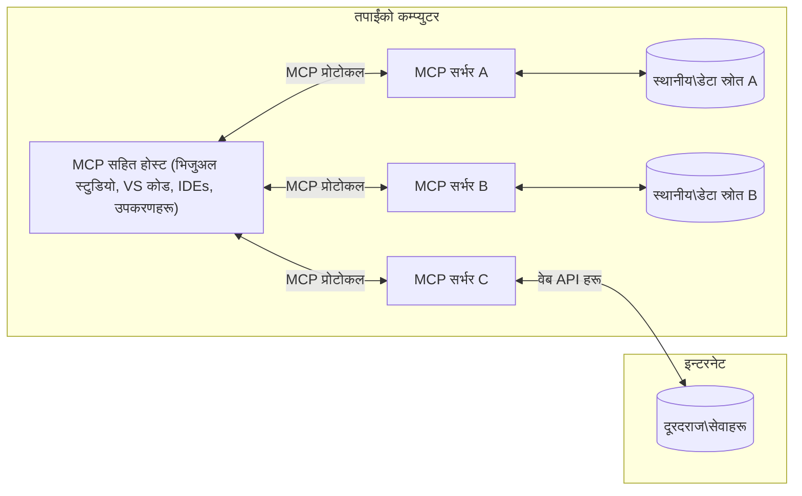

# MCP कोर अवधारणाहरू: AI एकीकरणका लागि मोडेल कन्टेक्स्ट प्रोटोकलमा मास्टरी

[](https://youtu.be/earDzWGtE84)

_(यस पाठको भिडियो हेर्न माथिको तस्बिरमा क्लिक गर्नुहोस्)_

[Model Context Protocol (MCP)](https://github.com/modelcontextprotocol) एक शक्तिशाली, मानकीकृत फ्रेमवर्क हो जुन ठूला भाषा मोडेलहरू (LLMs) र बाह्य उपकरणहरू, अनुप्रयोगहरू, र डाटास्रोतहरू बीचको संचारलाई अनुकूलित गर्दछ।  
यस मार्गदर्शनले तपाईंलाई MCP का केन्द्रीय अवधारणाहरू मार्फत लैजानेछ। तपाईं यसको क्लाइन्ट-सर्भर वास्तुकला, आवश्यक कम्पोनेन्टहरू, संचार प्रविधिहरू, र कार्यान्वयनका सर्वोत्तम अभ्यासहरू सिक्नुहुनेछ।

- **स्पष्ट प्रयोगकर्ता सहमति**: सबै डेटा पहुँच र अपरेसनहरू कार्यान्वयन अघि स्पष्ट प्रयोगकर्ता अनुमोदन आवश्यक पर्दछ। प्रयोगकर्ताले के डेटा पहुँच गरिनेछ र के कार्यहरू गरिनेछन् भनेर स्पष्ट रूपमा बुझ्नुपर्छ, अधिकार र अनुमति हरूमा सूक्ष्म नियन्त्रणका साथ।

- **डेटा गोपनीयता सुरक्षा**: प्रयोगकर्ताको डेटा केवल स्पष्ट सहमतिका साथ मात्र खोलिनेछ र सम्पूर्ण अन्तरक्रिया अवधिभर कडा पहुँच नियन्त्रणद्वारा सुरक्षित गर्नुपर्छ। कार्यान्वयनहरूले अनधिकृत डेटा प्रसारण रोक्नु पर्छ र कडा गोपनीयता सीमारेखा कायम राख्नुपर्छ।

- **उपकरण सञ्चालन सुरक्षा**: प्रत्येक उपकरण आह्वानमा स्पष्ट प्रयोगकर्ता सहमति आवश्यक हुन्छ जसले उपकरणको कार्यक्षमता, प्यारामिटरहरू, र सम्भावित प्रभावलाई स्पष्ट रूपमा बुझ्न मद्दत गर्दछ। शक्तिशाली सुरक्षा सीमाहरूले अवाञ्छित, असुरक्षित, वा दुष्ट उपकरण सञ्चालन रोक्नुपर्छ।

- **सञ्चार तह सुरक्षा**: सबै संचार च्यानलहरूमा उचित इन्क्रिप्शन र प्रमाणीकरण मेकानिज्महरू प्रयोग गर्नुपर्छ। रिमोट कनेक्शनहरूले सुरक्षित ट्रान्सपोर्ट प्रोटोकल र उचित प्रमाणपत्र व्यवस्थापन कार्यान्वयन गर्नुपर्छ।

#### कार्यान्वयन मार्गनिर्देशहरू:

- **अनुमति प्रबंधन**: प्रयोगकर्ताहरूलाई कुन सर्भरहरू, उपकरणहरू, र स्रोतहरू पहुँच योग्य छन् नियन्त्रण गर्न अनुमति दिने सूक्ष्म अनुमति प्रणालीहरू लागू गर्नुहोस्  
- **प्रमाणीकरण र अधिकृत प्रणाली**: सुरक्षित प्रमाणीकरण विधिहरू (OAuth, API कुञ्जीहरू) प्रयोग गर्नुहोस्, सही टोकन व्यवस्थापन र म्याद समाप्ति सहित  
- **इनपुट प्रमाणीकरण**: परिभाषित स्किमाहरू अनुसार सबै प्यारामिटर र डाटा इनपुटहरूको प्रमाणीकरण गर्नुहोस्, इन्जेक्शन आक्रमण रोक्नका लागि  
- **अडिट लगिङ**: सुरक्षात्मक अनुगमन र अनुपालनको लागि सबै अपरेसनहरूको व्यापक लग राख्नुहोस्

## अवलोकन

यस पाठले Model Context Protocol (MCP) इकोसिस्टमका आधारभूत वास्तुकला र कम्पोनेन्टहरू अन्वेषण गर्दछ। तपाईं MCP अन्तरक्रियाहरूलाई सञ्चालित गर्ने क्लाइन्ट-सर्भर वास्तुकला, मुख्य कम्पोनेन्टहरू, र संचार यन्त्रहरू सिक्नुहुनेछ।

## मुख्य सिकाइ लक्ष्यहरू

यस पाठको अन्त्यसम्म, तपाईंले:

- MCP क्लाइन्ट-सर्भर वास्तुकला बुझ्नु हुनेछ।  
- होस्ट, क्लाइन्ट, र सर्भरहरूको भूमिकाहरू र जिम्मेवारीहरू पहिचान गर्नुहोस्।  
- MCP लाई लचिलो एकीकरण तह बनाउने मुख्य विशेषताहरू विश्लेषण गर्नुहोस्।  
- MCP इकोसिस्टम भित्र जानकारी कसरी प्रवाहित हुन्छ बुझ्नुहोस्।  
- .NET, Java, Python, र JavaScript मा कोड उदाहरणहरूको माध्यमबाट व्यावहारिक दृष्टिकोणहरू प्राप्त गर्नुहोस्।

## MCP वास्तुकला: गहिरो दृष्टि

MCP इकोसिस्टम क्लाइन्ट-सर्भर मोडेलमा आधारित छ। यो मोडुलर संरचनाले AI अनुप्रयोगहरूलाई उपकरणहरू, डाटाबेसहरू, API हरू, र सन्दर्भीय स्रोतहरूसंग प्रभावकारी रूपमा अन्तरक्रिया गर्न सक्षम बनाउँछ। हामी यस वास्तुकलालाई यसको केन्द्रीय कम्पोनेन्टहरूमा विश्लेषण गरौं।

यसको मूलमा, MCP क्लाइन्ट-सर्भर वास्तुकलालाई पछ्याउछ जहाँ एक होस्ट अनुप्रयोगले धेरै सर्भरहरूसँग जडान गर्न सक्छ:


```mermaid
flowchart LR
    subgraph "तपाईंको कम्प्युटर"
        Host["MCP सहित होस्ट (भिजुअल स्टुडियो, VS कोड, IDEs, उपकरणहरू)"]
        S1["MCP सर्भर A"]
        S2["MCP सर्भर B"]
        S3["MCP सर्भर C"]
        Host <-->|"MCP प्रोटोकल"| S1
        Host <-->|"MCP प्रोटोकल"| S2
        Host <-->|"MCP प्रोटोकल"| S3
        S1 <--> D1[("स्थानीय\डेटा स्रोत A")]
        S2 <--> D2[("स्थानीय\डेटा स्रोत B")]
    end
    subgraph "इन्टरनेट"
        S3 <-->|"वेब API हरू"| D3[("दूरदराज\सेवाहरू")]
    end
```
- **MCP होस्टहरू**: VSCode, Claude Desktop, IDE हरू, वा AI उपकरणहरू जस्ता कार्यक्रमहरू जसले MCP मार्फत डेटा पहुँच गर्न चाहन्छन्  
- **MCP क्लाइन्टहरू**: प्रोटोकल क्लाइन्टहरू जसले सर्भरहरू सँग 1:1 कनेक्शनहरू कायम राख्छन्  
- **MCP सर्भरहरू**: प्रत्येकले मानकीकृत Model Context Protocol मार्फत विशिष्ट क्षमता प्रदान गर्ने हल्का कार्यक्रमहरू  
- **स्थानीय डाटा स्रोतहरू**: तपाईंको कम्प्युटरका फाइलहरू, डाटाबेसहरू, र सेवाहरू जुन MCP सर्भरहरूले सुरक्षित रूपमा पहुँच गर्न सक्छन्  
- **रिमोट सेवा**: इन्टरनेट मार्फत उपलब्ध बाह्य प्रणालीहरू जुन MCP सर्भरहरूले API हरू मार्फत जडान गर्न सक्छन्।

MCP प्रोटोकल दिनांक आधारित संस्करण सङ्केत (YYYY-MM-DD ढाँचा) प्रयोग गर्ने विकासशील मानक हो। वर्तमान प्रोटोकल संस्करण **2025-11-25** हो। तपाईं [प्रोटोकल विशिष्टता](https://modelcontextprotocol.io/specification/2025-11-25/) मा पछिल्लो अपडेटहरू हेर्न सक्नुहुन्छ।

### १. होस्टहरू

Model Context Protocol (MCP) मा, **होस्टहरू** AI अनुप्रयोगहरू हुन् जुन प्रयोगकर्ताहरूले प्रोटोकल संग अन्तरक्रिया गर्ने प्राथमिक अन्तरफलकको रूपमा काम गर्छन्। होस्टहरूले प्रत्येक सर्भर जडानका लागि समर्पित MCP क्लाइन्टहरू सिर्जना गरेर धेरै MCP सर्भरहरूसँग जडानहरू समन्वय र व्यवस्थापन गर्छन्। होस्टहरूको उदाहरणहरू:

- **AI अनुप्रयोगहरू**: Claude Desktop, Visual Studio Code, Claude Code  
- **विकास वातावरणहरू**: MCP एकीकरण भएका IDE हरू र कोड सम्पादकहरू  
- **कस्टम अनुप्रयोगहरू**: उद्देश्य-निर्मित AI एजेन्टहरू र उपकरणहरू

**होस्टहरू** ती अनुप्रयोगहरू हुन् जसले AI मोडेल अन्तरक्रियालाई समन्वय गर्छन्। तिनीहरूले:

- **AI मोडेलहरू समन्वय गर्ने**: प्रतिक्रिया उत्पादन गर्न वा LLM हरूसँग अन्तरक्रिया गर्न AI वर्कफ्लोहरू सञ्चालन गर्ने  
- **क्लाइन्ट जडान व्यवस्थापन गर्ने**: प्रत्येक MCP सर्भर जडानका लागि एक MCP क्लाइन्ट सिर्जना र रखरखाव गर्ने  
- **प्रयोगकर्ता अन्तरफलक नियन्त्रण गर्ने**: संवाद प्रवाह, प्रयोगकर्ता अन्तरक्रिया, र प्रतिक्रिया प्रदर्शनको ह्यान्डल गर्ने  
- **सुरक्षा प्रवर्तित गर्ने**: अनुमति, सुरक्षा नियन्त्रण, र प्रमाणीकरण नियन्त्रण गर्ने  
- **प्रयोगकर्ता सहमति ह्यान्डल गर्ने**: डाटा साझा र उपकरण सञ्चालनका लागि प्रयोगकर्ता अनुमोदन व्यवस्थापन गर्ने

### २. क्लाइन्टहरू

**क्लाइन्टहरू** होस्ट र MCP सर्भरहरू बीच समर्पित एक-देखि-अनेक कनेक्शनहरू कायम गर्ने अनिवार्य कम्पोनेन्टहरू हुन्। प्रत्येक MCP क्लाइन्ट होस्टले विशिष्ट MCP सर्भरसँग जडान गर्न सुरूवात गर्दछ, जसले व्यवस्थित र सुरक्षित संचार च्यानलहरू सुनिश्चित गर्दछ। धेरै क्लाइन्टहरूले होस्टहरूलाई एकै समयमा धेरै सर्भरहरूसँग जडान हुन सक्षम बनाउँछन्।

**क्लाइन्टहरू** होस्ट अनुप्रयोग भित्र कनेक्टर कम्पोनेन्टहरू हुन्। तिनीहरूले:

- **प्रोटोकल संचार**: सर्भरहरूलाई JSON-RPC 2.0 अनुरोधहरू पठाउने, प्रॉम्प्ट र निर्देशनहरूसँग  
- **क्षमता वार्तालाप**: आरम्भमा सर्भरहरूसँग समर्थित सुविधाहरू र प्रोटोकल संस्करणहरूको वार्तालाप गर्ने  
- **उपकरण सञ्चालन**: मोडेलहरूबाट उपकरण सञ्चालन अनुरोधहरू व्यवस्थापन गर्ने र प्रतिक्रियाहरू प्रक्रिया गर्ने  
- **रियल-टाइम अपडेट**: सर्भरहरूसँग जडान भएको सूचना र वास्तविक-समय अपडेटहरू ह्यान्डल गर्ने  
- **प्रतिक्रिया प्रशोधन**: प्रयोगकर्तालाई देखाउनका लागि सर्भर प्रतिक्रियाहरू प्रक्रिया र ढाँचा गर्ने

### ३. सर्भरहरू

**सर्भरहरू** ती कार्यक्रमहरू हुन् जसले सन्दर्भ, उपकरणहरू, र क्षमताहरू MCP क्लाइन्टहरूलाई प्रदान गर्छन्। तिनीहरू स्थानीय (होस्टकै कम्प्युटरमा) वा रिमोट (बाह्य प्लेटफर्महरूमा) सञ्चालन गर्न सक्छन्, र क्लाइन्ट अनुरोधहरू ह्यान्डल गरी संरचित प्रतिक्रियाहरू प्रदान गर्न जिम्मेवार हुन्छन्। सर्भरहरूले मानकीकृत Model Context Protocol मार्फत विशिष्ट कार्यक्षमता खोल्छन्।

**सर्भरहरू** सेवाहरू हुन् जसले सन्दर्भ र क्षमता प्रदान गर्छन्। तिनीहरूले:

- **विशेषता दर्ता**: उपलब्ध प्रिमिटिभहरू (स्रोतहरू, प्रॉम्प्टहरू, उपकरणहरू) क्लाइन्टहरूलाई दर्ता र खोल्ने  
- **अनुरोध प्रशोधन**: क्लाइन्टबाट उपकरण कल, स्रोत अनुरोध, र प्रॉम्प्ट अनुरोधहरू प्राप्त गरी कार्यान्वयन गर्ने  
- **सन्दर्भ प्रदान गर्ने**: मोडेल प्रतिक्रियाहरू सुधार गर्न सन्दर्भीय जानकारी र डाटा प्रदान गर्ने  
- **स्थिति व्यवस्थापन**: सत्र स्थिति राख्ने र आवश्यक परे स्थिति आधारित अन्तरक्रियाहरू ह्यान्डल गर्ने  
- **रियल-टाइम सूचनाहरू**: जडान भएका क्लाइन्टहरूलाई क्षमता परिवर्तन र अपडेटहरूको सूचनाहरू पठाउने

सर्भरहरू कुनै पनि व्यक्तिले मोडेल क्षमताहरूलाई विशेष कार्यक्षमता संग विस्तार गर्न विकास गर्न सक्छन्, र तिनीहरूले स्थानीय र रिमोट दुवै स्थापना परिदृश्यहरू समर्थन गर्छन्।

### ४. सर्भर प्रिमिटिभहरू

Model Context Protocol (MCP) का सर्भरहरूले तीन मुख्य **प्रिमिटिभहरू** प्रदान गर्छन् जसले क्लाइन्टहरू, होस्टहरू, र भाषा मोडेलहरू बीच धनी अन्तरक्रियाका आधारभूत निर्माण ब्लकहरू परिभाषित गर्छन्। यी प्रिमिटिभहरूले प्रोटोकल मार्फत उपलब्ध सन्दर्भीय जानकारी र कार्यहरूको प्रकारहरू निर्दिष्ट गर्छन्।

MCP सर्भरहरूले तलका कुनै पनि तीन मुख्य प्रिमिटिभहरूको संयोजन खुला गर्न सक्छन्:

#### स्रोतहरू 

**स्रोतहरू** ती डाटास्रोतहरू हुन् जसले AI अनुप्रयोगहरूलाई सन्दर्भीय जानकारी प्रदान गर्छन्। तिनीहरूले स्थिर वा गतिशील सामग्री प्रतिनिधित्व गर्छन् जसले मोडेलको बुझाइ र निर्णय क्षमतालाई सुधार गर्न सक्छ:

- **सन्दर्भीय डाटा**: AI मोडेलको उपयोगका लागि संरचित जानकारी र सन्दर्भ  
- **ज्ञान आधारहरू**: कागजात भण्डार, लेखहरू, म्यानुअलहरू, र अनुसन्धान पत्रहरू  
- **स्थानीय डाटा स्रोतहरू**: फाइलहरू, डाटाबेसहरू, र स्थानीय प्रणाली जानकारी  
- **बाह्य डाटा**: API प्रतिक्रिया, वेब सेवा, र रिमोट प्रणाली डाटा  
- **गतिशील सामग्री**: बाह्य परिस्थितिहरूमा आधारित वास्तविक-समय डाटा अपडेटहरू

स्रोतहरू URI हरूले पहिचान गरिन्छ र `resources/list` मार्फत पत्ता लगाउन सकिन्छ र `resources/read` विधिहरू मार्फत प्राप्त गर्न सकिन्छ:

```text
file://documents/project-spec.md
database://production/users/schema
api://weather/current
```

#### प्रॉम्प्टहरू

**प्रॉम्प्टहरू** पुन: प्रयोग गर्न मिल्ने ढाँचाहरू हुन् जसले भाषा मोडेलहरूसंगको अन्तरक्रियालाई संरचित गर्न मद्दत गर्दछन्। तिनीहरूले मानकीकृत अन्तरक्रिया नमूना र ढाँचा गरिएको कार्यप्रवाहहरू प्रदान गर्छन्:

- **ढाँचा आधारित अन्तरक्रिया**: पूर्व-संरचित सन्देशहरू र संवाद आरम्भकर्ता  
- **कार्यप्रवाह टेम्प्लेटहरू**: सामान्य कार्यहरू र अन्तरक्रियाहरूको लागि मानकीकृत अनुक्रम  
- **थोरै उदाहरणहरू**: मोडेल निर्देशनका लागि उदाहरण-आधारित टेम्प्लेटहरू  
- **प्रणाली प्रॉम्प्टहरू**: मोडेल व्यवहार र सन्दर्भ परिभाषित गर्ने आधारभूत प्रॉम्प्टहरू  
- **गतिशील ढाँचा**: विशिष्ट सन्दर्भहरूको लागि अनुकूलित प्यारामिटरयुक्त प्रॉम्प्टहरू

प्रॉम्प्टहरूले चल-अडान प्रतिस्थापन समर्थन गर्दछन् र `prompts/list` बाट पत्ता लगाउन र `prompts/get` बाट प्राप्त गर्न सकिन्छ:

```markdown
Generate a {{task_type}} for {{product}} targeting {{audience}} with the following requirements: {{requirements}}
```

#### उपकरणहरू

**उपकरणहरू** ती कार्यान्वयनयोग्य कार्यहरू हुन् जुन AI मोडेलहरूले विशिष्ट कार्यहरू गर्न आह्वान गर्न सक्छन्। तिनीहरूले MCP इकोसिस्टमका "क्रियापदहरू" प्रतिनिधित्व गर्छन्, जसले मोडेलहरूलाई बाह्य प्रणालीहरूसँग अन्तरक्रिया गर्न सक्षम बनाउँछ:

- **कार्यान्वयन योग्य कार्यहरू**: विशिष्ट प्यारामिटरहरूसँग मोडेलहरूले आह्वान गर्न सक्ने अलग-अलग अपरेसनहरू  
- **बाह्य प्रणाली एकीकरण**: API कलहरू, डाटाबेस क्वेरीहरू, फाइल अपरेसनहरू, गणना  
- **विशिष्ट पहिचान**: प्रत्येक उपकरणसँग एक अद्वितीय नाम, वर्णन, र प्यारामिटर स्कीमा हुन्छ  
- **संरचित इनपुट/आउटपुट**: उपकरणहरूले प्रमाणीकरण गरिएको प्यारामिटरहरू स्वीकार्छन् र संरचित, टाइप गरिएको प्रतिक्रियाहरू फर्काउँछन्  
- **कार्यकुशलता क्षमता**: मोडेलहरूलाई वास्तविक-विश्व क्रियाहरू गर्न र प्रत्यक्ष डाटा प्राप्त गर्न सक्षम पार्छ

उपकरणहरू प्यारामिटर प्रमाणीकरणका लागि JSON स्कीमा प्रयोग गरी परिभाषित गरिन्छ र `tools/list` द्वारा पत्ता लगाइन्छ र `tools/call` मार्फत सञ्चालन गरिन्छ। उपकरणहरूले UI प्रदर्शनका लागि थप मेटाडाटा रूपमा **आइकनहरू** पनि समावेश गर्न सक्छन्।

**उपकरण एनोटेसनहरू**: उपकरणहरूले व्यवहारिक एनोटेसनहरू समर्थन गर्छन् (जस्तै, `readOnlyHint`, `destructiveHint`) जसले उपकरण पठन मात्र हो वा विनाशकारी हो कि छैन भनेर वर्णन गर्छन्, जसले क्लाइन्टहरूलाई उपकरण सञ्चालनको बारेमा सूचित निर्णय गर्न मद्दत पुऱ्याउँछ।

उदाहरण उपकरण परिभाषा:

```typescript
server.tool(
  "search_products", 
  {
    query: z.string().describe("Search query for products"),
    category: z.string().optional().describe("Product category filter"),
    max_results: z.number().default(10).describe("Maximum results to return")
  }, 
  async (params) => {
    // खोज सञ्चालन गर्नुहोस् र संरचित परिणामहरू फर्काउनुहोस्
    return await productService.search(params);
  }
);
```

## क्लाइन्ट प्रिमिटिभहरू

Model Context Protocol (MCP) मा, **क्लाइन्टहरूले** यस्ता प्रिमिटिभहरू खोल्न सक्छन् जसले सर्भरहरूलाई होस्ट अनुप्रयोगबाट अतिरिक्त क्षमता अनुरोध गर्न सक्षम बनाउँछ। यी क्लाइन्ट-पक्षीय प्रिमिटिभहरूले अधिक धनी, अन्तरक्रियात्मक सर्भर कार्यान्वयनहरूलाई अनुमति दिन्छन् जसले AI मोडेल क्षमताहरू र प्रयोगकर्ता अन्तरक्रियाहरू पहुँच गर्न सक्छन्।

### नमूना (Sampling)

**नमूना** सर्भरहरूले क्लाइन्टको AI अनुप्रयोगबाट भाषा मोडेल पूरकहरू अनुरोध गर्न अनुमति दिन्छ। यो प्रिमिटिभले सर्भरहरूलाई आफ्नै मोडल निर्भरता राख्नु नपरी LLM क्षमताहरू पहुँच गर्न सक्षम बनाउँछ:

- **मोडेल-स्वतन्त्र पहुँच**: सर्भरहरूले LLM SDK वा मोडेल पहुँच व्यवस्थापन बिना पूरकहरू अनुरोध गर्न सक्छन्  
- **सर्भर-प्रेरित AI**: सर्भरहरूलाई स्वतन्त्र रूपमा क्लाइन्टको AI मोडेल प्रयोग गरी सामग्री सिर्जना गर्न सक्षम बनाउँछ  
- **पुनरावर्ती LLM अन्तरक्रियाहरू**: यस्तो जटिल परिदृश्यहरू समर्थन गर्दछ जहाँ सर्भरहरूलाई प्रक्रियाका लागि AI सहायता आवश्यक छ  
- **गतिशील सामग्री सिर्जना**: होस्टको मोडल प्रयोग गरी सन्दर्भीय प्रतिक्रियाहरू सिर्जना गर्न सर्भरहरूलाई अनुमति दिन्छ  
- **उपकरण कल समर्थन**: सर्भरहरूले नमूना क्रममा क्लाइन्ट मोडेललाई उपकरणहरू आह्वान गर्ने सक्षम बनाउने `tools` र `toolChoice` प्यारामिटरहरू समावेश गर्न सक्छन्

नमूना `sampling/complete` विधि मार्फत सुरु गरिन्छ, जहाँ सर्भरहरूले पूरक अनुरोधहरू क्लाइन्टलाई पठाउँछन्।

### रूचहरू (Roots)

**रूचहरू** क्लाइन्टहरूले सर्भरहरूलाई फाइलसिस्टम सीमाहरू खोल्ने मानकीकृत तरिका हुन् जसले सर्भरहरूले कुन डिरेक्टरीहरू र फाइलहरू पहुँच गर्न सक्छन् बुझ्न मद्दत गर्छ:

- **फाइलसिस्टम सीमाहरू**: सर्भरहरूले फाइलसिस्टम भित्र कहाँ सञ्चालन गर्न सक्छन् सीमालेख निर्धारण गर्ने  
- **पहुँच नियन्त्रण**: सर्भरहरूले कुन डिरेक्टरी र फाइलहरूमा अनुमति छ बुझ्न मद्दत गर्ने  
- **गतिशील अपडेटहरू**: क्लाइन्टहरूले रूचहरूको सूची परिवर्तन हुँदा सर्भरलाई सूचना दिन सक्छन्  
- **URI आधारित पहिचान**: रूचहरू `file://` URI हरू प्रयोग गरी पहुँचयोग्य डिरेक्टरी र फाइलहरूलाई चिन्हित गर्छन्

रूचहरू `roots/list` विधिद्वारा पत्ता लगाइन्छ, र रूचहरू बदलिंदा क्लाइन्टहरूले `notifications/roots/list_changed` पठाउँछन्।

### जानकारी सङ्कलन (Elicitation)

**जानकारी सङ्कलन** सर्भरहरूले क्लाइन्ट अन्तरफलक मार्फत प्रयोगकर्ताबाट अतिरिक्त जानकारी वा पुष्टि अनुरोध गर्न सक्षम पार्दछ:

- **प्रयोगकर्ता इनपुट अनुरोधहरू**: उपकरण सञ्चालनका लागि आवश्यक अतिरिक्त जानकारी सोध्न सर्भरहरूले सक्छन्  
- **पुष्टि संवाद**: संवेदनशील वा प्रभावकारी अपरेशनहरूका लागि प्रयोगकर्ता अनुमोदन अनुरोध गर्ने  
- **अन्तरक्रियात्मक कार्यप्रवाहहरू**: चरण-द्वारा-चरण प्रयोगकर्ता अन्तरक्रियाहरू सिर्जना गर्न सर्भरहरूलाई सक्षम पार्ने  
- **गतिशील प्यारामिटर सङ्ग्रह**: उपकरण सञ्चालन क्रममा हराएका वा वैकल्पिक प्यारामिटरहरू सङ्कलन गर्ने

जानकारी सङ्कलन अनुरोधहरू `elicitation/request` विधि प्रयोग गरी क्लाइन्टको अन्तरफलक मार्फत प्रयोगकर्ता इनपुट सङ्कलन गर्न गरिन्छ।

**URL मोड जानकारी सङ्कलन**: सर्भरहरूले URL आधारित प्रयोगकर्ता अन्तरक्रियाहरू पनि अनुरोध गर्न सक्छन् जसले सर्भरहरूलाई प्रमाणिकरण, पुष्टि, वा डाटा प्रविष्टिका लागि प्रयोगकर्ताहरूलाई बाह्य वेब पृष्ठहरूमा निर्देशित गर्न अनुमति दिन्छ।

### लगिङ

**लगिङ** ले सर्भरहरूलाई क्लाइन्टहरूलाई डिबगिङ, अनुगमन, र सञ्चालन देखिनेतालाई बढावा दिने संरचित लग सन्देशहरू पठाउन अनुमति दिन्छ:

- **डिबगिङ समर्थन**: समस्या समाधानका लागि विस्तृत कार्यान्वयन लगहरू प्रदान गर्न सर्भरहरूलाई सक्षम बनाउने  
- **सञ्चालन अनुगमन**: क्लाइन्टहरूलाई स्थिति अपडेटहरू र प्रदर्शन मेट्रिक्स पठाउने  
- **त्रुटि रिपोर्टिङ**: विस्तृत त्रुटि सन्दर्भ र निदान जानकारी प्रदान गर्ने  
- **अडिट ट्रेलहरू**: सर्भर अपरेसन र निर्णयहरूको व्यापक लग सिर्जना गर्ने

लगगिङ सन्देशहरू क्लाइन्टहरूलाई पठाइन्छ ताकि सर्भर अपरेसनहरूमा पारदर्शिता प्रदान गर्न र डिबगिङलाई सहज बनाउन।

## MCP मा जानकारी प्रवाह

Model Context Protocol (MCP) ले होस्टहरू, क्लाइन्टहरू, सर्भरहरू, र मोडेलहरू बीच संरचित जानकारी प्रवाह परिभाषित गर्दछ। यस प्रवाहलाई बुझ्नाले प्रयोगकर्ता अनुरोधहरू कसरी प्रक्रिया हुन्छन् र बाह्य उपकरणहरू र डाटाहरू मोडेल प्रतिक्रियामा कसरी एकीकृत हुन्छन् स्पष्ट पार्न मद्दत गर्दछ।
- **होस्ट कनेक्शन सुरु गर्छ**  
  होस्ट एप्लिकेसन (जस्तै IDE वा च्याट इन्टरफेस) ले MCP सर्भरसँग कनेक्शन स्थापना गर्छ, सामान्यतया STDIO, WebSocket, वा अन्य समर्थित ट्रान्सपोर्ट मार्फत।

- **क्षमता वार्ता**  
  क्लाइन्ट (होस्टमा एम्बेड गरिएको) र सर्भरले आफूले समर्थित सुविधाहरू, उपकरणहरू, स्रोतहरू, र प्रोटोकल संस्करणहरूको जानकारी साटासाट गर्छन्। यसले दुबै पक्षलाई सत्रका लागि उपलब्ध क्षमताहरू बुझ्न मद्दत गर्छ।

- **प्रयोगकर्ता अनुरोध**  
  प्रयोगकर्ताले होस्टसँग अन्तरक्रिया गर्छ (जस्तै, एउटा प्रम्प्ट या कमाण्ड प्रविष्टि गर्छ)। होस्टले यो इनपुट सङ्कलन गरेर प्रशोधनको लागि क्लाइन्टलाई पठाउँछ।

- **स्रोत वा उपकरण प्रयोग**  
  - क्लाइन्टले सर्भरबाट थप सन्दर्भ वा स्रोतहरू (जस्तै फाइलहरू, डाटाबेस प्रविष्टिहरू, वा ज्ञान आधारका लेखहरू) माग्न सक्छ ताकि मोडेलको बुझाइ धनी बनोस।  
  - मोडेलले उपकरण चाहिने निर्णय गरेमा (जस्तै डाटा प्राप्त गर्न, गणना गर्न, वा API कल गर्न), क्लाइन्टले उपकरण आह्वान अनुरोध सर्भरलाई पठाउँछ, जसमा उपकरणको नाम र प्यारामिटरहरू निर्दिष्ट गर्छ।

- **सर्भर कार्यान्वयन**  
  सर्भरले स्रोत वा उपकरण अनुरोध प्राप्त गरेर आवश्यक अपरेसनहरू (जस्तै फङ्सन चलाउने, डाटाबेस क्वेरी गर्ने, वा फाइल फेच गर्ने) प्रदर्शन गर्छ र नतिजाहरू क्लाइन्टलाई संरचित ढाँचामा फर्काउँछ।

- **प्रतिक्रिया सिर्जना**  
  क्लाइन्टले सर्भरका प्रतिक्रियाहरू (स्रोत डाटा, उपकरण उत्पादनहरू आदि) मोडेल अन्तरक्रियामा समावेश गर्छ। मोडेलले यो जानकारीलाई प्रयोग गरेर समग्र र सन्दर्भसँग मेल खाने प्रत्युत्तर सिर्जना गर्छ।

- **नतीजा प्रस्तुति**  
  होस्टले अन्तिम आउटपुट क्लाइन्टबाट प्राप्त गरेर प्रयोगकर्तालाई प्रस्तुत गर्छ, प्रायः मोडेलले सिर्जना गरेको पाठ र उपकरण कार्यान्वयन वा स्रोत खोजबाट नतिजा दुवै सहित।

यस प्रवाहले MCP लाई उन्नत, अन्तरक्रियात्मक, र सन्दर्भ-सचेत AI एप्लिकेसनहरू समर्थ बनाउँछ जसले मोडेलहरूलाई बाह्य उपकरण र डाटा स्रोतहरूसँग बिना रोकावट जडान गर्छ।

## प्रोटोकल आर्किटेक्चर & तहहरू

MCP दुई भिन्न वास्तुकला तहहरूबाट बनेको छ जुन पूर्ण सञ्चार Framework प्रदान गर्न सँगसँगै काम गर्छन्:

### डेटा तह

**डेटा तहले** MCP को मुख्य प्रोटोकल लागू गर्छ जसमा **JSON-RPC 2.0** लाई आधारको रूपमा प्रयोग गरिएको छ। यस तहले सन्देश संरचना, सेम्यान्टिक्स, र अन्तरक्रिया ढाँचाहरू परिभाषित गर्छ:

#### मुख्य घटकहरू:

- **JSON-RPC 2.0 प्रोटोकल**: सबै सञ्चारहरू मापदण्डबद्ध JSON-RPC 2.0 सन्देश ढाँचाको प्रयोग गरेर मेथड कल, प्रतिक्रियाहरू, र सूचनाहरूको लागि हुन्छ  
- **जीवनचक्र व्यवस्थापन**: क्लाइन्ट र सर्भरबीच कनेक्शन सुरुवात, क्षमता वार्ता, र सत्र समाप्ति सम्हाल्छ  
- **सर्भर प्रिमिटिभहरू**: सर्भरलाई उपकरणहरू, स्रोतहरू, र प्रम्प्टहरू मार्फत मुख्य कार्यक्षमता प्रदान गर्न सक्षम बनाउँछ  
- **क्लाइन्ट प्रिमिटिभहरू**: सर्भरहरूलाई LLM बाट नमूना माग्न, प्रयोगकर्ता इनपुट उठाउन, र लग सन्देशहरू पठाउन सक्षम बनाउँछ  
- **रियल-टाइम सूचनाहरू**: पोलिङ बिना गतिशील अपडेटहरूका लागि एसिन्क्रोनस सूचनाहरूलाई समर्थन गर्छ

#### मुख्य सुविधा:

- **प्रोटोकल संस्करण वार्ता**: YYYY-MM-DD ढाँचामा मितिमा आधारित संस्करण सुनिश्चित गर्न प्रयोग गर्छ  
- **क्षमता पत्ता लगाउने**: सुरुमै क्लाइन्ट र सर्भरले समर्थित सुविधाहरूको जानकारी साटासाट गर्छन्  
- **राज्यसंगत सत्रहरू**: धेरै अन्तरक्रियाहरूमा सन्दर्भ निरन्तरताका लागि कनेक्शन अवस्था कायम गर्छ

### ट्रान्सपोर्ट तह

**ट्रान्सपोर्ट तह** MCP सहभागीहरूबीच सञ्चार च्यानलहरू, सन्देश फ्रेमिङ, र प्रमाणिकरण व्यवस्थापन गर्छ:

#### समर्थित ट्रान्सपोर्ट प्रविधिहरू:

1. **STDIO ट्रान्सपोर्ट**:  
   - सीधा प्रोसेस सञ्चारको लागि मानक इनपुट/आउटपुट स्ट्रिम प्रयोग गर्दछ  
   - एउटै मेसिनमा स्थानीय प्रक्रियाहरूको लागि उपयुक्त, कुनै नेटवर्क ओभरहेड छैन  
   - स्थानीय MCP सर्भर कार्यान्वयनहरूमा सामान्यतया प्रयोग गरिन्छ

2. **Streamable HTTP ट्रान्सपोर्ट**:  
   - क्लाइन्ट-देखि-सर्भर सन्देशहरूको लागि HTTP POST प्रयोग गर्छ  
   - वैकल्पिक रूपमा सर्भर-देखि-क्लाइन्ट स्ट्रिमिङका लागि Server-Sent Events (SSE) समर्थन गर्छ  
   - नेटवर्क मार्फत दूरस्थ सर्भर सञ्चार सक्षम पार्दछ  
   - मानक HTTP प्रमाणीकरण (बेरेर टोकन, API कुञ्जीहरू, कस्टम हेडरहरू) लाई समर्थन गर्छ  
   - MCP ले सुरक्षित टोकन आधारित प्रमाणीकरणका लागि OAuth सिफारिस गर्छ

#### ट्रान्सपोर्ट सारांश:

ट्रान्सपोर्ट तहले डेटा तहबाट सञ्चार विवरणहरू abstract गर्छ, जसले सबै ट्रान्सपोर्ट प्रविधिहरूमा समान JSON-RPC 2.0 सन्देश ढाँचा प्रयोग गर्न सक्षम बनाउँछ। यसले अनुप्रयोगहरूलाई सहजै स्थानीय र दूरस्थ सर्भरहरू बीच स्विच गर्न मद्दत गर्छ।

### सुरक्षा विचारहरू

MCP कार्यान्वयनहरूले प्रोटोकलका सबै अपरेसनहरूमा सुरक्षित, विश्वासनीय, र सुरक्षित अन्तरक्रियाहरू सुनिश्चित गर्न निम्न महत्वपूर्ण सुरक्षा सिद्धान्तहरू पालन गर्नुपर्छ:

- **प्रयोगकर्ता सहमति र नियन्त्रण**: कुनै पनि डाटा पहुँच वा अपरेसन अघि प्रयोगकर्ताबाट स्पष्ट सहमति लिनुपर्छ। उनीहरूले के डाटा साझा गर्ने र कुन क्रियाहरू अनुमत छन् स्पष्ट जान्नुपर्छ, जसका लागि समीक्षा र स्वीकृतिका लागि सहज प्रयोगकर्ता इन्टरफेसहरू उपलब्ध गराइन्छ।

- **डेटा गोपनीयता**: प्रयोगकर्ता डाटालाई स्पष्ट सहमति बिना एक्सपोज गर्न हुँदैन र उपयुक्त पहुँच नियन्त्रण द्वारा सुरक्षा गर्नुपर्छ। MCP कार्यान्वयनहरूले अनधिकृत डाटा ट्रान्समिशनबाट जोगिन र सम्पूर्ण अन्तरक्रियामा गोपनीयता कायम राख्नुपर्छ।

- **उपकरण सुरक्षा**: कुनै उपकरण आह्वान गर्नुअघि प्रयोगकर्ताको स्पष्ट सहमति आवश्यक छ। प्रयोगकर्ताले प्रत्येक उपकरणको कार्यक्षमता स्पष्ट रूपमा बुझ्नुपर्छ र दुर्घटना वा असुरक्षित उपकरण सञ्चालनबाट बच्न कडा सुरक्षा सीमा लागू गर्नुपर्छ।

यी सुरक्षा सिद्धान्तहरू पालन गरेर, MCP ले सबै प्रोटोकल अन्तरक्रियाहरूमा प्रयोगकर्ताको विश्वास, गोपनीयता, र सुरक्षा कायम राख्छ भने शक्तिशाली AI एकीकरणहरू सक्षम पार्छ।

## कोड उदाहरणहरू: मुख्य कम्पोनेन्टहरू

तल विभिन्न लोकप्रिय प्रोग्रामिङ भाषाहरूमा केन्द्रीय MCP सर्भर कम्पोनेन्ट र उपकरणहरू कार्यान्वयन गर्ने कोड उदाहरणहरू छन्।

### .NET उदाहरण: साधारण MCP सर्भर र उपकरणहरू सिर्जना गर्ने

यहाँ एक व्यावहारिक .NET कोड उदाहरण छ जसले कस्टम उपकरणहरूसँग साधारण MCP सर्भर कसरी बनाउने देखाउँछ। यसले उपकरणहरू परिभाषित गर्न, दर्ता गर्न, अनुरोधहरू ह्यान्डल गर्न, र Model Context Protocol मार्फत सर्भर कनेक्ट गर्न देखाउँछ।

```csharp
using System;
using System.Threading.Tasks;
using ModelContextProtocol.Server;
using ModelContextProtocol.Server.Transport;
using ModelContextProtocol.Server.Tools;

public class WeatherServer
{
    public static async Task Main(string[] args)
    {
        // Create an MCP server
        var server = new McpServer(
            name: "Weather MCP Server",
            version: "1.0.0"
        );
        
        // Register our custom weather tool
        server.AddTool<string, WeatherData>("weatherTool", 
            description: "Gets current weather for a location",
            execute: async (location) => {
                // Call weather API (simplified)
                var weatherData = await GetWeatherDataAsync(location);
                return weatherData;
            });
        
        // Connect the server using stdio transport
        var transport = new StdioServerTransport();
        await server.ConnectAsync(transport);
        
        Console.WriteLine("Weather MCP Server started");
        
        // Keep the server running until process is terminated
        await Task.Delay(-1);
    }
    
    private static async Task<WeatherData> GetWeatherDataAsync(string location)
    {
        // This would normally call a weather API
        // Simplified for demonstration
        await Task.Delay(100); // Simulate API call
        return new WeatherData { 
            Temperature = 72.5,
            Conditions = "Sunny",
            Location = location
        };
    }
}

public class WeatherData
{
    public double Temperature { get; set; }
    public string Conditions { get; set; }
    public string Location { get; set; }
}
```


### Java उदाहरण: MCP सर्भर कम्पोनेन्टहरू

यस उदाहरणले माथिको .NET उदाहरण जस्तै MCP सर्भर र उपकरण दर्ता देखाउँछ, तर Java मा कार्यान्वयन गरिएको।

```java
import io.modelcontextprotocol.server.McpServer;
import io.modelcontextprotocol.server.McpToolDefinition;
import io.modelcontextprotocol.server.transport.StdioServerTransport;
import io.modelcontextprotocol.server.tool.ToolExecutionContext;
import io.modelcontextprotocol.server.tool.ToolResponse;

public class WeatherMcpServer {
    public static void main(String[] args) throws Exception {
        // एउटा MCP सर्भर सिर्जना गर्नुहोस्
        McpServer server = McpServer.builder()
            .name("Weather MCP Server")
            .version("1.0.0")
            .build();
            
        // मौसम उपकरण दर्ता गर्नुहोस्
        server.registerTool(McpToolDefinition.builder("weatherTool")
            .description("Gets current weather for a location")
            .parameter("location", String.class)
            .execute((ToolExecutionContext ctx) -> {
                String location = ctx.getParameter("location", String.class);
                
                // मौसम डेटा प्राप्त गर्नुहोस् (सरलीकृत)
                WeatherData data = getWeatherData(location);
                
                // स्वरूपित प्रतिक्रिया फर्काउनुहोस्
                return ToolResponse.content(
                    String.format("Temperature: %.1f°F, Conditions: %s, Location: %s", 
                    data.getTemperature(), 
                    data.getConditions(), 
                    data.getLocation())
                );
            })
            .build());
        
        // stdio ट्रान्सपोर्ट प्रयोग गरेर सर्भरसँग जडान गर्नुहोस्
        try (StdioServerTransport transport = new StdioServerTransport()) {
            server.connect(transport);
            System.out.println("Weather MCP Server started");
            // प्रक्रिया समाप्त नभएसम्म सर्भर चलिराख्नुहोस्
            Thread.currentThread().join();
        }
    }
    
    private static WeatherData getWeatherData(String location) {
        // कार्यान्वयनले मौसम API कल गर्नेछ
        // उदाहरणका लागि सरलीकृत गरिएको
        return new WeatherData(72.5, "Sunny", location);
    }
}

class WeatherData {
    private double temperature;
    private String conditions;
    private String location;
    
    public WeatherData(double temperature, String conditions, String location) {
        this.temperature = temperature;
        this.conditions = conditions;
        this.location = location;
    }
    
    public double getTemperature() {
        return temperature;
    }
    
    public String getConditions() {
        return conditions;
    }
    
    public String getLocation() {
        return location;
    }
}
```


### Python उदाहरण: MCP सर्भर निर्माण

यस उदाहरणले fastmcp प्रयोग गर्छ, कृपया पहिले यसलाई स्थापना गर्न निश्चित गर्नुहोस्:

```python
pip install fastmcp
```
Code Sample:

```python
#!/usr/bin/env python3
import asyncio
from fastmcp import FastMCP
from fastmcp.transports.stdio import serve_stdio

# एउटा FastMCP सर्भर बनाउनुहोस्
mcp = FastMCP(
    name="Weather MCP Server",
    version="1.0.0"
)

@mcp.tool()
def get_weather(location: str) -> dict:
    """Gets current weather for a location."""
    return {
        "temperature": 72.5,
        "conditions": "Sunny",
        "location": location
    }

# कक्षाको प्रयोग गर्दै वैकल्पिक विधि
class WeatherTools:
    @mcp.tool()
    def forecast(self, location: str, days: int = 1) -> dict:
        """Gets weather forecast for a location for the specified number of days."""
        return {
            "location": location,
            "forecast": [
                {"day": i+1, "temperature": 70 + i, "conditions": "Partly Cloudy"}
                for i in range(days)
            ]
        }

# कक्षा उपकरणहरू दर्ता गर्नुहोस्
weather_tools = WeatherTools()

# सर्भर सुरु गर्नुहोस्
if __name__ == "__main__":
    asyncio.run(serve_stdio(mcp))
```


### JavaScript उदाहरण: MCP सर्भर सिर्जना

यसले MCP सर्भर निर्माण र दुई मौसम सम्बन्धी उपकरणहरू दर्ता गर्ने देखाउँछ।

```javascript
// आधिकारिक मोडल सन्दर्भ प्रोटोकल SDK प्रयोग गर्दै
import { McpServer } from "@modelcontextprotocol/sdk/server/mcp.js";
import { StdioServerTransport } from "@modelcontextprotocol/sdk/server/stdio.js";
import { z } from "zod"; // प्यारामिटर प्रमाणीकरणको लागि

// एक MCP सर्भर सिर्जना गर्नुहोस्
const server = new McpServer({
  name: "Weather MCP Server",
  version: "1.0.0"
});

// मौसम उपकरण परिभाषित गर्नुहोस्
server.tool(
  "weatherTool",
  {
    location: z.string().describe("The location to get weather for")
  },
  async ({ location }) => {
    // यो सामान्यतया मौसम API कल गर्ने थियो
    // प्रदर्शनको लागि सरलीकृत
    const weatherData = await getWeatherData(location);
    
    return {
      content: [
        { 
          type: "text", 
          text: `Temperature: ${weatherData.temperature}°F, Conditions: ${weatherData.conditions}, Location: ${weatherData.location}` 
        }
      ]
    };
  }
);

// पूर्वानुमान उपकरण परिभाषित गर्नुहोस्
server.tool(
  "forecastTool",
  {
    location: z.string(),
    days: z.number().default(3).describe("Number of days for forecast")
  },
  async ({ location, days }) => {
    // यो सामान्यतया मौसम API कल गर्ने थियो
    // प्रदर्शनको लागि सरलीकृत
    const forecast = await getForecastData(location, days);
    
    return {
      content: [
        { 
          type: "text", 
          text: `${days}-day forecast for ${location}: ${JSON.stringify(forecast)}` 
        }
      ]
    };
  }
);

// सहायक कार्यहरू
async function getWeatherData(location) {
  // API कल सिमुलेट गर्नुहोस्
  return {
    temperature: 72.5,
    conditions: "Sunny",
    location: location
  };
}

async function getForecastData(location, days) {
  // API कल सिमुलेट गर्नुहोस्
  return Array.from({ length: days }, (_, i) => ({
    day: i + 1,
    temperature: 70 + Math.floor(Math.random() * 10),
    conditions: i % 2 === 0 ? "Sunny" : "Partly Cloudy"
  }));
}

// stdio ट्रान्सपोर्ट प्रयोग गरेर सर्भरसँग जडान गर्नुहोस्
const transport = new StdioServerTransport();
server.connect(transport).catch(console.error);

console.log("Weather MCP Server started");
```


यो JavaScript उदाहरणले कसरी stdio ट्रान्सपोर्ट प्रयोग गरेर क्लाइन्ट अनुरोधहरू ह्यान्डल गर्न मौसम-सम्बन्धी उपकरणहरू दर्ता गरी MCP सर्भर बनाउने देखाउँछ।

## सुरक्षा र अधिकार

MCP मा प्रोटोकलभरि सुरक्षा र अधिकार व्यवस्थापनका लागि केहि इनबिल्ट अवधारणा र संयन्त्रहरू समावेश छन्:

1. **उपकरण अनुमति नियन्त्रण**:  
   क्लाइन्टहरूले सत्रको अवधिमा मोडेलले कुन उपकरणहरू प्रयोग गर्न पाउने निर्धारण गर्न सक्छन्। यसले केवल स्पष्ट रूपमा अधिकृत उपकरणहरू पहुँचयोग्य बनाउन सुनिश्चित गर्छ, जसले अनपेक्षित वा असुरक्षित अपरेसनको जोखिम घटाउँछ। अनुमति प्रयोगकर्ता प्राथमिकता, संगठन नीति, वा अन्तरक्रियाको सन्दर्भ अनुसार गतिशील रूपमा कन्फिगर गर्न सकिन्छ।

2. **प्रमाणीकरण**:  
   उपकरणहरू, स्रोतहरू, वा संवेदनशील अपरेसन पहुँच अघि सर्भरले प्रमाणीकरण आवश्यक पार्न सक्छ। यसमा API कुञ्जीहरू, OAuth टोकनहरू, वा अन्य प्रमाणीकरण योजनाहरू समावेश हुन सक्छन्। उचित प्रमाणीकरणले मात्र विश्वासयोग्य क्लाइन्ट र प्रयोगकर्ताहरूले सर्भर-तर्फका क्षमता कल गर्न सक्छन् भनेर सुनिश्चित गर्छ।

3. **मान्यता**:  
   सबै उपकरण आह्वानहरूका लागि प्यारामिटर मान्यकरण लागू हुन्छ। प्रत्येक उपकरणले आफ्ना प्यारामिटरहरूको अपेक्षित प्रकार, ढाँचा, र प्रतिबन्धहरू परिभाषित गर्छ र सर्भरले आउने अनुरोधहरूलाई तदनुसार सत्यापन गर्छ। यसले खराबीपूर्ण वा दुर्भावनापूर्ण इनपुट उपकरण कार्यान्वयनसम्म पुग्न रोक्छ र अपरेसनहरूको अखण्डता कायम राख्न मद्दत गर्छ।

4. **दर सीमितीकरण**:  
   दुरुपयोग रोक्न र सर्भर स्रोतहरूको न्यायोचित प्रयोग सुनिश्चित गर्न, MCP सर्भरले उपकरण कल र स्रोत पहुँचमा दर सीमितीकरण लागू गर्न सक्छ। दर सीमितीकरण प्रयोगकर्ता, सत्र, वा विश्वव्यापी स्तरमा हुन सक्छ र सेवाअवरोध आक्रमण वा अत्यधिक स्रोत उपभोगबाट संरक्षण गर्दछ।

यी संयन्त्रहरू संयोजन गरेर MCP ले भाषा मोडेलहरूलाई बाह्य उपकरण र डाटा स्रोतहरूसँग सुरक्षित रूपमा एकीकृत गर्न आधार तयार पार्दछ, जबकि प्रयोगकर्ता र विकासकर्ताहरूलाई पहुँच र प्रयोगमा सूक्ष्म नियन्त्रण दिन्छ।

## प्रोटोकल सन्देशहरू र सञ्चार प्रवाह

MCP सञ्चारले स्पष्ट र भरपर्दो अन्तरक्रियाका लागि संरचित **JSON-RPC 2.0** सन्देशहरू प्रयोग गर्छ। प्रोटोकलले विभिन्न अपरेसन प्रकारका लागि विशेष सन्देश ढाँचाहरू परिभाषित गर्छ:

### मुख्य सन्देश प्रकारहरू:

#### **इनिशियलाइजेसन सन्देशहरू**  
- **`initialize` अनुरोध**: कनेक्शन स्थापना र प्रोटोकल संस्करण तथा क्षमताहरू वार्ता गर्छ  
- **`initialize` प्रतिक्रिया**: समर्थित सुविधाहरू र सर्भर जानकारी पुष्टि गर्छ  
- **`notifications/initialized`**: संकेत गर्छ कि इनिशियलाइजेसन पूरा भयो र सत्र तयार छ

#### **पत्ता लगाउने सन्देशहरू**  
- **`tools/list` अनुरोध**: सर्भरबाट उपलब्ध उपकरणहरू पत्ता लगाउँछ  
- **`resources/list` अनुरोध**: उपलब्ध स्रोतहरू (डाटा स्रोतहरू) सूचीकृत गर्छ  
- **`prompts/list` अनुरोध**: उपलब्ध प्रम्प्ट टेम्प्लेटहरू प्राप्त गर्छ

#### **कार्यान्वयन सन्देशहरू**  
- **`tools/call` अनुरोध**: निर्दिष्ट उपकरणलाई प्रदान गरिएको प्यारामिटरहरूसँग चलाउँछ  
- **`resources/read` अनुरोध**: निर्दिष्ट स्रोतबाट सामग्री प्राप्त गर्छ  
- **`prompts/get` अनुरोध**: वैकल्पिक प्यारामिटरहरूसहित प्रम्प्ट टेम्प्लेट फेच गर्छ

#### **क्लाइन्ट-पक्षका सन्देशहरू**  
- **`sampling/complete` अनुरोध**: सर्भरले क्लाइन्टबाट LLM पूर्ति अनुरोध गर्छ  
- **`elicitation/request`**: सर्भरले क्लाइन्ट इन्टरफेसमार्फत प्रयोगकर्ता इनपुट माग्छ  
- **लगिङ सन्देशहरू**: सर्भरले क्लाइन्टलाई संरचित लग सन्देशहरू पठाउँछ

#### **सूचना सन्देशहरू**  
- **`notifications/tools/list_changed`**: सर्भरले उपकरण परिवर्तनहरूको सूचना दिन्छ  
- **`notifications/resources/list_changed`**: सर्भरले स्रोत परिवर्तनहरूको सूचना दिन्छ  
- **`notifications/prompts/list_changed`**: सर्भरले प्रम्प्ट परिवर्तनहरूको सूचना दिन्छ

### सन्देश संरचना:

सबै MCP सन्देशहरूले JSON-RPC 2.0 ढाँचालाई पालना गर्छन् जसमा:  
- **अनुरोध सन्देशमा**: `id`, `method`, र वैकल्पिक `params` समावेश छन्  
- **प्रतिक्रिया सन्देशमा**: `id` र `result` वा `error` हुन्छ  
- **सूचना सन्देशमा**: `method` र वैकल्पिक `params` हुन्छ (id वा प्रतिक्रिया आवश्यक छैन)

यो संरचित सञ्चारले भरपर्दो, ट्रेसयोग्य, र विस्तारयोग्य अन्तरक्रिया सुनिश्चित गर्छ जसले रियल-टाइम अपडेटहरू, उपकरण श्रृंङ्खला, र कडा त्रुटि ह्यान्डलिङ जस्ता उन्नत परिदृश्यहरूलाई समर्थन गर्दछ।

### कार्यहरू (प्रयोगात्मक)

**कार्यहरू** एक प्रयोगात्मक सुविधा हुन् जसले MCP अनुरोधहरूको लागि स्थायी कार्यान्वयन आवरणहरू प्रदान गर्छन् जसले स्थगित परिणाम प्राप्ति र अवस्था ट्र्याकिङ सक्षम पार्छ:

- **दीर्घकालीन अपरेसनहरू**: महँगो गणना, कार्यप्रवाह स्वचालन, र ब्याच प्रशोधन ट्र्याक गर्छ  
- **स्थगित परिणामहरू**: कार्य स्थितिको लागि पोल गर्छ र अपरेसन पूरा हुँदा परिणाम प्राप्त गर्छ  
- **अवस्था ट्र्याकिङ**: परिभाषित जीवनचक्र अवस्थाहरू मार्फत कार्य प्रगति मोनिटर गर्छ  
- **धेरै-चरण अपरेसनहरू**: धेरै अन्तरक्रियाहरू बित्ने जटिल कार्यप्रवाहहरूलाई समर्थन गर्छ

कार्यहरूले मानक MCP अनुरोधहरूलाई आवरण गरेर तुरुन्त पूरा हुन नसक्ने अपरेसनहरूका लागि एसिन्क्रोनस कार्यान्वयन ढाँचा सक्षम पार्दछन्।

## मुख्य बुँदाहरू

- **आर्किटेक्चर**: MCP ले क्लाइन्ट-सर्भर वास्तुकला प्रयोग गर्दछ जहाँ होस्टहरूले धेरै क्लाइन्ट कनेक्शनहरूलाई सर्भरमा सम्हाल्दछन्  
- **भागीदारहरू**: पारिस्थितिकी तन्त्रमा होस्टहरू (AI एप्लिकेसनहरू), क्लाइन्टहरू (प्रोटोकल कनेक्तरहरू), र सर्भरहरू (क्षमता प्रदायकहरू) समावेश छन्  
- **ट्रान्सपोर्ट विधिहरू**: सञ्चार STDIO (स्थानीय) र Streamable HTTP (विद्यालय) SSE विकल्पसहित (दूरस्थ) समर्थित छ  
- **मुख्य प्रिमिटिभहरू**: सर्भरहरूले उपकरणहरू (कार्यन्वयन योग्य फङ्सनहरू), स्रोतहरू (डाटा स्रोतहरू), र प्रम्प्टहरू (टेम्प्लेटहरू) प्रदान गर्छन्  
- **क्लाइन्ट प्रिमिटिभहरू**: सर्भरहरूले नमूना माग गर्न (उपकरण कल समर्थनसहित LLM पूर्ति), उपयोगकर्ता इनपुट (URL मोड सहित), रुटहरू (फाइल सिस्टम सिमाना), र लगिङ क्लाइन्टबाट सोध्न सक्छन्  
- **प्रयोगात्मक सुविधा**: कार्यहरूले दीर्घकालीन अपरेसनहरूको लागि स्थायी कार्यान्वयन आवरण प्रदान गर्छ  
- **प्रोटोकल आधार**: JSON-RPC 2.0 मा निर्माण गरिएको र मिति आधारित संस्करण (हाल: 2025-11-25)  
- **रियल-टाइम क्षमता**: गतिशील अपडेटका लागि सूचनाहरू र रियल-टाइम समक्रमण समर्थन  
- **सुरक्षा प्रथम**: स्पष्ट प्रयोगकर्ता सहमति, डाटा गोपनीयता संरक्षण, र सुरक्षित ट्रान्सपोर्ट अनिवार्य

## अभ्यास

आफ्नो क्षेत्रमा उपयोगी हुने सरल MCP उपकरण डिजाइन गर्नुहोस्। परिभाषित गर्नुहोस्:  
1. उपकरणको नाम के हुनेछ  
2. यसले के कस्ता प्यारामिटरहरू स्वीकार गर्नेछ  
3. के प्रकारको आउटपुट फर्काउनेछ  
4. प्रयोगकर्ताका समस्याहरू समाधान गर्न मोडेल यस उपकरणलाई कसरी प्रयोग गर्न सक्छ

---

## के बाँकी छ

अर्को: [अध्याय २: सुरक्षा](../02-Security/README.md)

---

<!-- CO-OP TRANSLATOR DISCLAIMER START -->
**अस्वीकरण**:
यो कागजात AI अनुवाद सेवा [Co-op Translator](https://github.com/Azure/co-op-translator) प्रयोग गरी अनुवाद गरिएको हो। हामी शुद्धताको प्रयास गर्छौं भने पनि, कृपया ध्यान दिनुहोस् कि स्वचालित अनुवादमा त्रुटि वा अशुद्धता हुन सक्छ। मूल कागजात यसको मौलिक भाषामा अधिकारप्राप्त स्रोतको रूपमा मानिनुपर्छ। महत्वपूर्ण सूचनाका लागि पेशेवर मानव अनुवाद सिफारिस गरिन्छ। यस अनुवादको प्रयोगबाट उत्पन्न कुनै पनि गलत बुझाइ वा गलत व्याख्याका लागि हामी जिम्मेवार हुने छैनौं।
<!-- CO-OP TRANSLATOR DISCLAIMER END -->