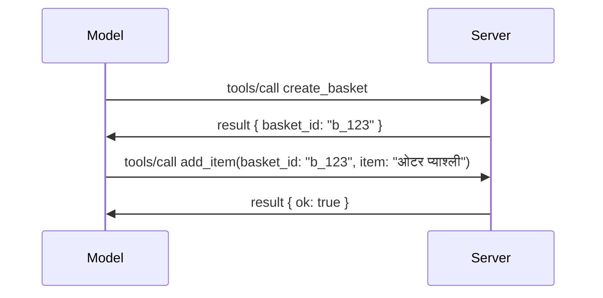

# MCP मा के परिवर्तन भयो: 2026-07-28 विनिर्देशन

> **स्थिति:** अन्तिम। MCP विनिर्देशन `2026-07-28` जुलाई 28, 2026 मा पठाइएको
> र हालको प्रोटोकल संशोधन हो। यस पाठले अन्तिम
> विनिर्देशनको वर्णन गर्दछ। केही पाठ्यक्रम उदाहरणहरू स्पष्ट रूपमा
> `2025-11-25` संस्करणमा छन् किनभने तिनीहरूको SDK हरूले नयाँ स्टेटलेस API अपनाएका छैनन्;
> ती उदाहरणहरूलाई पुरानो अनुकूलता मार्गदर्शनको रूपमा व्यवहार गर्नुहोस्।

## अवलोकन

`2026-07-28` MCP को सब भन्दा ठूलो संशोधन हो जबदेखि यसले सुरुत गर्यो। छ
विनिर्देशन सुधार प्रस्तावहरू (SEPs) ले प्रोटोकल-स्तरको सेसनहरू हटाउँछन् र
MCP लाई ट्रान्सपोर्ट तहमा स्टेटलेस बनाउँछन्, विस्तारहरू पहिलो श्रेणी,
संस्करणयुक्त मेकानिजम बन्छन्, र यस पाठ्यक्रममा पहिल्यै समेटिएका धेरै सुविधाहरू
(रूटहरू, स्याम्पलिंग, लगिङ) नयाँ जीवनचक्र नीति अन्तर्गत अवैध घोषित गरिएका छन्। यो
पाठले के परिवर्तन भयो, किन यो महत्त्वपूर्ण छ, र यसको अर्थ के हो भने लेखिएको कोडका लागि
`2025-11-25` विरुद्ध।

स्रोत: [The 2026-07-28 MCP Specification Release Candidate](https://blog.modelcontextprotocol.io/posts/2026-07-28-release-candidate/) (Model Context Protocol Blog, David Soria Parra and Den Delimarsky).

## सिकाइका उद्देश्यहरू

यस पाठको अन्त्यसम्म, तपाईं सक्षम हुनुहुनेछ:

- किन MCP स्टेटलेस प्रोटोकल कोरमा सर्ने छ र किन त्यो क्षैतिज फैलिएका परिनियोजनहरूको समस्या समाधान गर्छ भन्ने व्याख्या गर्नुहोस्।
- कसरी `initialize`/`initialized` हैंडशेक र `Mcp-Session-Id` हेडर प्रतिस्थापित हुन्छ व्याख्या गर्नुहोस्।
- नयाँ `Mcp-Method` र `Mcp-Name` हेडरहरू र `ttlMs`/`cacheScope` क्याचिङ मेटाडेटा पहिचान गर्नुहोस्।
- एक्सटेन्सन फ्रेमवर्क र यस रिलिजसँग जहाज हुने दुई एक्सटेन्सनहरू: MCP एप्स र टास्कहरू चिन्हित गर्नुहोस्।
- प्राधिकरण कडा बनाउने र डायनामिक क्लाइन्ट दर्ता
  अवैध बनाउने कुरा संक्षेप गर्नुहोस्।
- कुन मुख्य सुविधाहरू (रूटहरू, स्याम्पलिंग, लगिङ) अब अवैध घोषित गरिएका छन् र व्यावहारिक रूपमा यसको अर्थ के हो भनेर पहिचान गर्नुहोस्।
- पूर्ण JSON स्किमा 2020-12 परिवर्तनको व्याख्या गर्नुहोस् उपकरण `inputSchema`/`outputSchema` को लागि।

## एक स्टेटलेस प्रोटोकल

मुख्य परिवर्तन: MCP प्रोटोकल तहमा स्टेटलेस हुन्छ।

### पहिला (2025-11-25): सेसनहरूले तपाईंलाई एउटा सर्भर इन्स्टेन्समा बाँध्छ

स्ट्रीमेबल HTTP मार्फत कुनै उपकरणलाई कल गर्दा `initialize` हैंडशेकबाट सुरु हुन्छ। सर्भरले एक `Mcp-Session-Id` हेडरमा जवाफ दिन्छ जुन हरेक पछिल्लो अनुरोधले बोक्नै पर्छ:

```http
POST /mcp HTTP/1.1
Mcp-Session-Id: 1868a90c-3a3f-4f5b
Content-Type: application/json

{"jsonrpc":"2.0","id":2,"method":"tools/call",
 "params":{"name":"search","arguments":{"q":"otters"}}}
```

किनभने सेसन जसले त्यसलाई जारी गर्दछ त्यो सर्भर इन्स्टेन्ससँग बाँधिएको छ, क्षैतिज रूपमा फैलिएका परिनियोजनहरूमा लोड बेलन्सरमा **स्टिकी रुटिङ** र इन्स्टेन्सहरूबीच **साझा सेसन स्टोर** आवश्यक हुन्छ।

### पछि (2026-07-28): हरेक अनुरोध आफैंमै पूरा हुन्छ

```http
POST /mcp HTTP/1.1
MCP-Protocol-Version: 2026-07-28
Mcp-Method: tools/call
Mcp-Name: search
Content-Type: application/json

{"jsonrpc":"2.0","id":1,"method":"tools/call",
 "params":{"name":"search","arguments":{"q":"otters"},
           "_meta":{"io.modelcontextprotocol/protocolVersion":"2026-07-28",
                    "io.modelcontextprotocol/clientInfo":{"name":"my-app","version":"1.0"},
                    "io.modelcontextprotocol/clientCapabilities":{}}}}
```

कुनै पनि सर्भर इन्स्टेन्सले यो अनुरोध सम्हाल्न सक्छ। मुख्य परिवर्तनहरू:

- **`initialize`/`initialized` हैंडशेक हटाइएको छ** ([SEP-2575](https://github.com/modelcontextprotocol/modelcontextprotocol/pull/2575))। प्रोटोकल संस्करण, क्लाइन्ट जानकारी, र क्लाइन्ट क्षमताहरू हरेक अनुरोधमा `_meta` मा सारिए। नयाँ `server/discover` मेथडले क्लाइन्टलाई आवश्यक पर्दा सर्भर क्षमताहरू पहिले नै प्राप्त गर्न दिन्छ।

- **`Mcp-Session-Id` हेडर र प्रोटोकल-स्तर सेसन हटाइन्छ** ([SEP-2567](https://github.com/modelcontextprotocol/modelcontextprotocol/pull/2567))। स्टिकी राउटिङ र साझा सेसन स्टोरहरू अब प्रोटोकल तहमा आवश्यक छैनन्।

### स्टेटलेस प्रोटोकल, स्टेटफुल एप्लिकेशनहरू

प्रोटोकल-स्तर सेसन हटाउनु भनेको तपाईंको सर्भर स्टेटफुल हुन सक्दैन भन्ने होइन। सिफारिस गरिएको ढाँचा ठ्याक्कै त्यो हो जुन HTTP API हरूले सधैं प्रयोग गरेका छन्: एउटा उपकरण कलबाट स्पष्ट ह्यान्डल (जस्तै `basket_id`, `browser_id`) बनाएर, र मोडेलले त्यो ह्यान्डललाई पछि कलहरूमा सामान्य तर्कका रूपमा फर्काउँछ।



यसले स्टेटलाई मोडेलका लागि देखाउन योग्य र तर्कसंगत बनाउँछ, ट्रान्सपोर्ट मेटाडाटा भित्र लुकाउने सट्टा, र यसले कुनै पनि सर्भर इन्स्ट्यान्सलाई कुनै पनि कल ह्यान्डल गर्न दिन्छ।

### सर्भर-देखि-क्लाइन्ट अनुरोधहरू, पुनर्संरचित

एउटा स्टेटलेस प्रोटोकलले अझै सर्भरले कलको बीचमा क्लाइन्टलाई केही सोध्नुपर्ने तरिका चाहिन्छ (उदाहरणका लागि, एलिसिटेसन प्रॉम्प्ट):

- **सर्भर-आरम्भित अनुरोधहरू केवल तब मात्र जारी गर्न सक्छ जब सर्भर सक्रिय रूपमा क्लाइन्ट अनुरोध प्रक्रिया गरिरहेको हुन्छ** ([SEP-2260](https://github.com/modelcontextprotocol/modelcontextprotocol/pull/2260)) — पहिले सिफारिस थियो, अहिले आवश्यक छ। प्रयोगकर्ता कहिल्यै कहाँबाट भनेर सोधिँदैन।
- **मल्टि राउन्ड-ट्रिप अनुरोधहरू** ([SEP-2322](https://github.com/modelcontextprotocol/modelcontextprotocol/pull/2322)) SSE स्ट्रिम खुला राख्ने कामलाई प्रतिस्थापन गर्छ। यसको सट्टा, सर्भर `InputRequiredResult` फर्काउँछ:

  ```json
  {
    "resultType": "input_required",
    "inputRequests": {
      "confirm": {
        "type": "elicitation",
        "message": "Delete 3 files?",
        "schema": { "type": "boolean" }
      }
    },
    "requestState": "eyJzdGVwIjoxLCJmaWxlcyI6WyJhIiwiYiIsImMiXX0="
  }
  ```

  क्लाइन्टले उत्तरहरू सङ्कलन गर्छ र `inputResponses` र प्रतिबिम्बित `requestState` सहित मूल कल पुन:प्रेषण गर्छ। कुनै पनि सर्भर इन्स्ट्यान्स पुन:प्रयास लिन सक्छ किनभने आवश्यक सबै पोर्टेलोडमा हुन्छ।

### राउटेबल, क्यासेबल, ट्रेसेबल

तीन साना परिवर्तनहरूले स्टेटलेस ट्राफिक सञ्चालन गर्न सजिलो बनाउँछन्:

- **`Mcp-Method` र `Mcp-Name` हेडरहरू स्ट्रीमएबल HTTP मा आवश्यक छन्** ([SEP-2243](https://github.com/modelcontextprotocol/modelcontextprotocol/pull/2243)), ताकि लोड बालान्सरहरू, गेटवेहरू, र रेट लिमिटरहरू अपरेशनमा राउट गर्न सकून् JSON बडी हेर्नु पर्दैन। सर्भरले जब हेडर र बडी असहमति हुन्छ अनुरोध अस्वीकार गर्छ।
- **`tools/list` र स्रोत पढ्ने परिणामहरूले `ttlMs` र `cacheScope` समेट्छ** ([SEP-2549](https://github.com/modelcontextprotocol/modelcontextprotocol/pull/2549)), HTTP `Cache-Control` को मॉडेलमा। क्लाइन्टहरूलाई थाहा हुन्छ कति समयसम्म सूची ताजा हुन्छ र यो प्रयोगकर्ताबीच साझा गर्न सुरक्षित छ कि छैन, लामो समयसम्म चल्ने SSE स्ट्रिम आवश्यक नपरी परिवर्तनहरू जान्न।
- **W3C ट्रेस कन्टेक्स्ट प्रसारण `_meta` मा कागजात गरिएको छ** ([SEP-414](https://github.com/modelcontextprotocol/modelcontextprotocol/pull/414)), जसले `traceparent`, `tracestate`, र `baggage` कुञ्जी नामहरू सच्याउँछ ताकि वितरण गरिएको ट्रेस क्लाइन्ट SDK, MCP सर्भर, र डाउनस्ट्रीम प्रणालीहरूमा [OpenTelemetry](https://opentelemetry.io/) अनुकूल ब्याकएन्डमा कललाई पछ्याउन सकोस।

## विस्तारहरू प्रथम-श्रेणी हुन्छन्

विस्तारहरू अनौपचारिक रूपमा `2025-11-25` मा थिए। [SEP-2133](https://github.com/modelcontextprotocol/modelcontextprotocol/pull/2133) ले तिनीहरूलाई औपचारिक बनाउँछ:

- विस्तारहरू रिभर्स-DNS ID हरू द्वारा पहिचान गरिन्छ।
- तिनीहरू क्लाइन्ट र सर्भर क्षमताहरूमा `extensions` नक्शा मार्फत सौदाबाजी गरिन्छ।

- उनीहरूले आफ्नो `ext-*` रिपोजिटोरीहरूमा बस्छन् जुनमा प्रतिनिधि मर्मतकर्ताहरू छन् र कोर स्पेसिफिकेसनबाट स्वतन्त्ररूपमा संस्करण हुन्छ।
- SEP प्रक्रियामा नयाँ एक्सटेन्सन्स ट्र्याकले तिनीहरूलाई प्रयोगात्मकबाट आधिकारिकमा जानको लागि बाटो दिन्छ।

यो संस्करणले दुई आधिकारिक एक्सटेन्सन्सहरू पठाउँछ।


### MCP अनुप्रयोगहरू: सर्भर-रेंडर गरिएका प्रयोगकर्ता इन्टरफेसहरू

[MCP अनुप्रयोगहरू](https://blog.modelcontextprotocol.io/posts/2026-01-26-mcp-apps/) ([SEP-1865](https://github.com/modelcontextprotocol/modelcontextprotocol/pull/1865)) ले सर्भरहरूलाई अन्तरक्रियात्मक HTML इन्टरफेसहरू पठाउन अनुमति दिन्छ जसलाई होष्टहरूले स्यान्डबक्स गरिएको iframe मा रेंडर गर्छन्। उपकरणहरूले उनीहरूको UI टेम्प्लेटहरू पहिले नै घोषणा गर्छन् ताकि होष्टहरूले तिनीहरूलाई पहिले नै फेच, क्यास, र सुरक्षा समीक्षा गर्न सकून् पहिले केही चलाउनुअघि। तपाईंले यसका आधारभूत कुराहरू पहिले नै [पाठ १५: MCP अनुप्रयोगहरू](../03-GettingStarted/15-mcp-apps/README.md) मा सिकिसक्नुभएको छ — एक्सटेन्सन फ्रेमवर्क अन्तर्गत, MCP अनुप्रयोगहरू अहिले औपचारिक रूपमा एक एक्सटेन्सन बनिसकेको छ, न कि प्रायोगात्मक कोर सुविधाको रूपमा।

### टास्कहरू एक्सटेन्सनमा उन्नति

टास्कहरू प्रायोगात्मक कोर सुविधाको रूपमा `2025-11-25` मा पठाईएका थिए। उत्पादन प्रयोगले पुनःडिजाइन आवश्यक देखायो जसले यसको लागि सही स्थान एक्सटेन्सन हो: [टास्क एक्सटेन्सन](https://github.com/modelcontextprotocol/modelcontextprotocol/pull/2663) ले स्टेटलेस मोडलको वरिपरि जीवनचक्रलाई पुनःआकार दिन्छ — एउटा सर्भर `tools/call` को उत्तर टास्क ह्यान्डलसहित दिन सक्छ, र ग्राहकले यसलाई अघि बढाउन `tasks/get`, `tasks/update`, र `tasks/cancel` प्रयोग गर्छ। टास्क सिर्जना सर्भर-निर्देशित हुन्छ: ग्राहकले एक्सटेन्सनको प्रमोशन गर्छ, र सर्भरले निर्णय गर्छ कहिले कललाई टास्कको रूपमा सञ्चालन गर्नु पर्छ। `tasks/list` पूर्ण रूपमा हटाइयो किनभने यो सेसनहरू बिना सुरक्षित रूपमा सीमित गर्न सकिंदैन।

> **माइग्रेशन नोट:** यदि तपाईंले प्रायोगात्मक `2025-11-25` टास्क एपीआई कार्यान्वयन गर्नुभयो भने, नयाँ एक्सटेन्सन जीवनचक्रमा माइग्रेट गर्न आवश्यक छ — यो पछिल्लो संस्करणसँग मिल्दोजुल्दो छैन।

## प्राधिकरण कठोरता

केही SEPs ले
[प्राधिकरण निर्दिष्टीकरण](https://modelcontextprotocol.io/specification/2026-07-28/basic/authorization)
लाई वास्तविक OAuth 2.0 / OpenID Connect कार्यान्वयनहरूसँग बढी मेल खाने गरी कडा बनाउँछन्:

| SEP | परिवर्तन |
|---|---|
| [SEP-2468](https://github.com/modelcontextprotocol/modelcontextprotocol/pull/2468) | ग्राहकहरूले प्राधिकरण प्रतिक्रियाहरूमा `iss` प्यारामिटरलाई [RFC 9207](https://www.rfc-editor.org/rfc/rfc9207) अनुसार प्रमाणीकरण गर्नुपर्छ, जसले MCP को एकल-ग्राहक, धेरै-सर्भर नमुनामा सामान्य भएका मिक्स-अप आक्रमणहरूलाई कम गर्छ। भविष्यमा, `iss` नभएका प्रतिक्रियाहरू अस्वीकार गर्न आवश्यक हुनेछ। |
| [SEP-837](https://github.com/modelcontextprotocol/modelcontextprotocol/pull/837) | उपयुक्त मात्र गतिशील क्लाइन्ट दर्ता गर्ने ग्राहकहरूले उनीहरूको OpenID Connect `application_type` घोषणा गर्छन्, डेस्कटप र CLI ग्राहकहरूको लागि गलत `"web"` पूर्वनिर्धारित मानहरूबाट बच्न। |
| [SEP-2352](https://github.com/modelcontextprotocol/modelcontextprotocol/pull/2352) | उपयुक्त मात्र दर्ता गरिएका प्रमाणपत्रहरू जारी गर्ने प्राधिकरण सर्भरको `issuer` सँग बाँधिएका छन्; स्रोत सर्नुपरेमा ग्राहकहरूले पुनः दर्ता गर्नुपर्छ। |
| [SEP-2207](https://github.com/modelcontextprotocol/modelcontextprotocol/pull/2207) | OpenID Connect-शैलीका प्राधिकरण सर्भरहरूबाट रिफ्रेश टोकनहरू कसरी अनुरोध गर्ने भन्ने कुरा दस्तावेजमा राखिन्छ। |
| [SEP-2350](https://github.com/modelcontextprotocol/modelcontextprotocol/pull/2350) | स्तर वृद्धि प्राधिकरणको क्रममा स्कोप सङ्कलनलाई स्पष्ट पार्छ। |
| [SEP-2351](https://github.com/modelcontextprotocol/modelcontextprotocol/pull/2351) | `.well-known` डिस्कभरी प्रत्ययलाई स्पष्ट पार्छ। |

यदि तपाईं MCP को लागि प्राधिकरण सर्भर निर्माण गर्दै हुनुहुन्छ भने, कृपया `iss` प्रदान गर्नुहोस्

अनुमति प्रतिक्रियाहरू र अन्तिम अनुमति विशिष्टता अनुसरण गर्नुहोस्। कार्यान्वयन मार्गदर्शनको लागि हेर्नुहोस्
[02-Security](../02-Security/README.md)।

गतिशील क्लाइन्ट दर्ता उपलब्ध छ अनुकूलताका लागि तर `2026-07-28` मा पनि
अवरोध गरिएको छ। नयाँ कार्यान्वयनहरूले क्लाइन्ट ID मेटाडेटा
दस्ताेबेजहरू प्रयोग गर्नुपर्छ।

## अवरोध गरिएको सुविधाहरू

नयाँ
[feature lifecycle policy](https://github.com/modelcontextprotocol/modelcontextprotocol/pull/2577) अनुसार,
Roots, Sampling, Logging, र Dynamic Client Registration लाई **अवरोध गरिएको** रूपमा चिनिन्छ:

| सुविधा | सिफारिस गरिएको विकल्प |
|---|---|
| Roots | उपकरण प्यारामिटरहरू, स्रोत URI हरू, वा सर्भर कन्फिगरेसन |
| Sampling | LLM प्रदायक API सँग प्रत्यक्ष एकीकरण |
| Logging | stdio ट्रान्सपोर्टहरूका लागि `stderr`; संरचित अवलोकनका लागि OpenTelemetry |
| Dynamic Client Registration | क्लाइन्ट ID मेटाडेटा कागजातहरू |

यी सुविधाहरू `2026-07-28` मा अनुकूलताको लागि रहन्छन्। तिनीहरू पहलो विशिष्टता संशोधनमा
हटाउन योग्य छन् जुन जुलाई २८, २०२७ या त्यसपछि जारी हुनेछ;
वास्तविक हटाउने प्रक्रिया पछि हुन सक्छ। नयाँ कार्यान्वयनहरूले माथिका विकल्पहरू प्रयोग गर्नुपर्छ।


## उपकरणहरूका लागि पूर्ण JSON Schema 2020-12

उपकरणको `inputSchema` र `outputSchema` पूर्ण [JSON Schema 2020-12](https://json-schema.org/draft/2020-12) ([SEP-2106](https://github.com/modelcontextprotocol/modelcontextprotocol/pull/2106)) मा उन्नत गरिएको छ:

- इनपुट स्कीमाहरूले `type: "object"` मूल प्रतिबन्ध राख्छ तर अब संयोजन (`oneOf`, `anyOf`, `allOf`), सर्तहरू, र संदर्भहरू (`$ref`, `$defs`) अनुमति दिन्छ।
- आउटपुट स्कीमाहरूमा कुनै प्रतिबन्ध छैन, र `structuredContent` अब कुनै पनि JSON मान हुन सक्छ, केवल वस्तु मात्र होइन।
- कार्यान्वयनहरूले बाह्य `$ref` URI हरूलाई स्वचालित रूपमा डिरेफरेन्स गर्न हुँदैन र स्कीमा गहिराइ र प्रमाणीकरण समय सीमित गर्नुपर्छ (यदि तपाईं स्कीमाहरू सर्भर-पक्षमा प्रमाणीकरण गर्नुहुन्छ भने डिनायल-अफ-सर्भिस विचार)।

अलग गरी, हराएको स्रोतको लागि त्रुटि कोड MCP-विशेष `-32002` बाट JSON-RPC मानक `-32602` (अमान्य प्यारामिटरहरू) मा परिवर्तन भयो ([SEP-2164](https://github.com/modelcontextprotocol/modelcontextprotocol/pull/2164))। यदि तपाईंको क्लाइन्टले `-32002` सटीक मानमा मेल खान्छ भने, तपाईंलाई अपडेट गर्न आवश्यक छ।

## प्रोटोकल यसबाट कसरी विकास हुन्छ

यो संस्करणले ब्रेकिंग परिवर्तनहरू समावेश गर्दछ, जुन MCP व्यवस्थापकहरूले भविष्यमा सामान्य बनाउने उद्देश्य छैनन्। तीन शासकीय SEPs ले दोहोरिनबाट रोक्ने लक्ष्य राख्छ:

- **feature lifecycle policy** ले प्रत्येक सुविधालाई सक्रिय → अवरोधित → हटाइएको बाटो दिन्छ, जसमा अवरोधन र सबैभन्दा पहिले हटाउने बीच कम्तीमा बारह महिना हुन्छ।
- **Extensions framework** ले नयाँ क्षमता हरूलाई अप्ट-इन विस्तारको रूपमा पठाउन दिन्छ र त्यहाँ स्थिरीकरण हुन दिन्छ, त्यसपछि (यदि कहिल्यै) मूल विशिष्टतामा सार्ने।
- एक Standards Track SEP ले अझै अन्तिम स्थिति प्राप्त गर्न सक्दैन जबसम्म मिल्दोजुल्दो परिदृश्य [conformance suite](https://github.com/modelcontextprotocol/conformance) मा नरहेको छ ([SEP-2484](https://github.com/modelcontextprotocol/modelcontextprotocol/pull/2484)) — त्यो उत्तरदायित्व [SDK tier system](https://github.com/modelcontextprotocol/modelcontextprotocol/pull/1777) ले आधिकारिक SDK हरूलाई स्कोर गर्ने सुइट हो।

## रिलिज समयसीमा र प्रमाणीकरण

- रिलिज प्रत्याशी मे २१, २०२६ मा लक गरिएको थियो।
- अन्तिम विशिष्टता जुलाई २८, २०२६ मा पठाइएको थियो।

- SDK समर्थनले विशिष्टता पछ्याउन ढिलो गर्न सक्छ। एउटा उदाहरण माइग्रेट गर्नु अघि
  [SDK कागजात](https://modelcontextprotocol.io/docs/sdk) र SDK को
  रिलिज नोटहरू जाँच गर्नुहोस्।
- अन्तिम परिवर्तनहरू ट्र्याक गर्नुहोस्
  [2026-07-28 विशिष्टता](https://modelcontextprotocol.io/specification/2026-07-28/)
  र यसको
  [चेंजलग](https://modelcontextprotocol.io/specification/2026-07-28/changelog) मा।

## यस पाठ्यक्रमको लागि यसको अर्थ के हो

पाठ्यक्रम `2025-11-25` का उदाहरणहरूबाट हालको
`2026-07-28` विशिष्टतामा रूपान्तरण गर्दैछ। स्पष्ट रूपमा:

- **सत्रहरू र `initialize` ह्यान्डशेक** जुन उदाहरणहरू `2025-11-25` लाई लक्षित गरिएका छन्
  तिनीहरू पुरानो व्यवहार हुन्। `2026-07-28` प्रोटोकलले तिनीहरूलाई माथि उल्लेखित
  स्टेटलेस अनुरोध मोडेलले प्रतिस्थापन गरेको छ।
- **साम्पलिङ र रूटहरू** अनुकूलताका लागि उपलब्ध छन् तर हाल प्रयोग नगरिने छन्।
  नयाँ डिजाइनहरूले माथि उल्लेखित प्रतिस्थापन ढाँचाहरू प्रयोग गर्नुपर्छ।
- **प्रयोगात्मक कार्यहरू सुविधा**, यदि तपाईँले यसलाई प्रयोग गर्नुभएको छ भने, कार्यहरू विस्तारको नयाँ जीवनचक्रमा माइग्रेट गर्नुपर्नेछ।
- **MCP एपहरू** ([पाठ 15](../03-GettingStarted/15-mcp-apps/README.md)) व्यावहारिक रूपमा प्रभावित हुँदैनन्; यो औपचारिक विस्तार संरचनामा सारिन्छ।

## अतिरिक्त स्रोतहरू

- [MCP विशिष्टता 2026-07-28](https://modelcontextprotocol.io/specification/2026-07-28/)
- [2026-07-28 चेंजलग](https://modelcontextprotocol.io/specification/2026-07-28/changelog)
- [2026-07-28 MCP विशिष्टता रिलिज क्यान्डिडेट (ऐतिहासिक ब्लग पोस्ट)](https://blog.modelcontextprotocol.io/posts/2026-07-28-release-candidate/)
- [MCP ट्रान्सपोर्टहरूको भविष्य](https://blog.modelcontextprotocol.io/posts/2025-12-19-mcp-transport-future/)
- [SEP दिशानिर्देशहरू](https://modelcontextprotocol.io/community/sep-guidelines)
- [MCP SDK तिर प्रणाली](https://modelcontextprotocol.io/docs/sdk)

## अर्को चरणहरू

फिर्ता जानुहोस् [कोर अवधारणाहरू](./README.md) मा वा जारी राख्नुहोस्
[सुरक्षा](../02-Security/README.md) मा `2026-07-28` को निर्देशन लागू गर्न।

---

<!-- CO-OP TRANSLATOR DISCLAIMER START -->
**अस्वीकरण**:
यो दस्तावेज़ AI अनुवाद सेवा [Co-op Translator](https://github.com/Azure/co-op-translator) प्रयोग गरेर अनुवाद गरिएको हो। हामी सही हुन प्रयास गर्छौं, तर कृपया जानकार हुनुस् कि स्वचालित अनुवादमा त्रुटिहरू वा अशुद्धताहरू हुन सक्छन्। मूल दस्तावेज़ यसको मूल भाषामा आधिकारिक स्रोत मानिनुपर्छ। महत्वपूर्ण जानकारीका लागि व्यावसायिक मानव अनुवाद सिफारिस गरिन्छ। यस अनुवादको प्रयोगबाट उत्पन्न कुनै पनि गलत बुझाइ वा त्रुटिको लागि हामी जिम्मेवार छैनौं।
<!-- CO-OP TRANSLATOR DISCLAIMER END -->