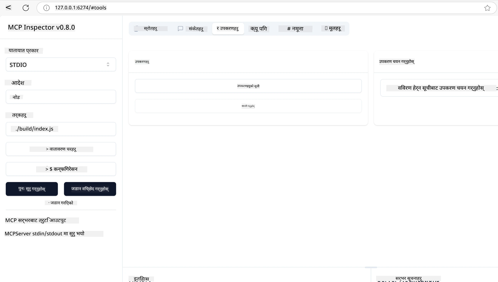
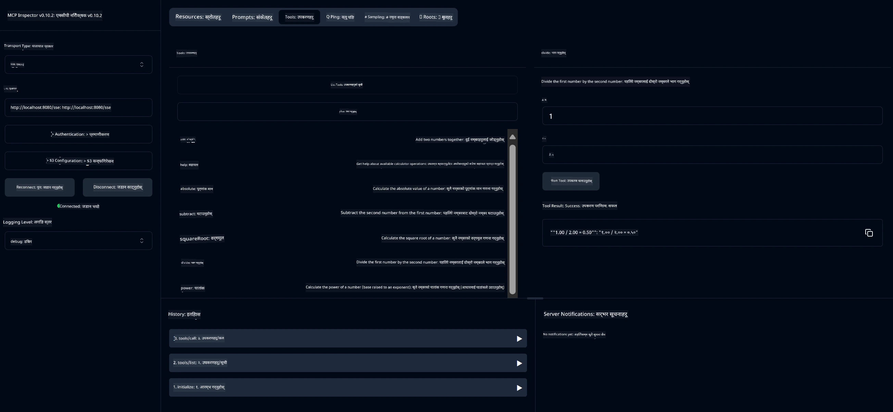
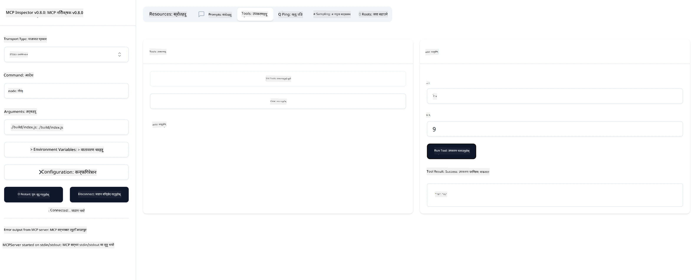

# MCP सँग सुरु गर्दै

> [!NOTE]
> यस पाठको Java HTTP उदाहरणले पुरानो HTTP+SSE ट्रान्सपोर्ट प्रयोग गर्दछ र
> MCP `2025-11-25` सँग मेल खाने SDK लक्षित गर्दछ। नयाँ रिमोट सर्भरहरूको लागि,
> `2026-07-28` स्ट्रिमेबल HTTP ट्रान्सपोर्ट प्रयोग गर्नुहोस् र आफ्नो SDK मा समर्थन पुष्टि गर्नुहोस्।

मोडेल क्यान्टेक्स्ट प्रोटोकल (MCP) सँग तपाईँका पहिलो कदमहरूमा स्वागत छ! तपाईँ MCP मा नयाँ हुनुहुन्छ वा तपाईँको बुझाइ गहिरो बनाउन चाहनुहुन्छ भने, यो मार्गदर्शकले आवश्यक सेटअप र विकास प्रक्रिया मार्फत तपाईंलाई लैजानेछ। तपाईंले पत्ता लगाउनुहुनेछ कि कसरी MCP ले AI मोडेलहरू र अनुप्रयोगहरू बीच सहज समेकन सक्षम पार्दछ, र कसरी छिटो आफ्नो वातावरण तयार पारेर MCP-सञ्चालित समाधानहरू निर्माण र परीक्षण गर्ने।

> TLDR; यदि तपाइँ AI अनुप्रयोगहरू बनाउनुहुन्छ भने, तपाइँले थाहा पाउनुहुन्छ कि तपाइँ आफ्नो LLM (ठूलो भाषा मोडेल) मा उपकरणहरू र अन्य स्रोतहरू थप्न सक्नुहुन्छ, जसले LLM लाई थप ज्ञानवान बनाउँछ। तर यदि ती उपकरणहरू र स्रोतहरू एक सर्भरमा राख्नुहुन्छ भने, अनुप्रयोग र सर्भर क्षमताहरू कुनै पनि क्लाइन्टले LLM को साथ वा बिना प्रयोग गर्न सक्छ।

## अवलोकन

यस पाठले MCP वातावरणहरू सेटअप गर्ने र तपाईँका पहिलो MCP अनुप्रयोगहरू निर्माण गर्ने व्यावहारिक मार्गनिर्देशन प्रदान गर्दछ। तपाईंले आवश्यक उपकरणहरू र फ्रेमवर्कहरू कसरि सेटअप गर्ने, आधारभूत MCP सर्भरहरू निर्माण गर्ने, होस्ट अनुप्रयोगहरू सिर्जना गर्ने, र तपाईंका कार्यान्वयनहरू परीक्षण गर्ने तरिका सिक्नुहुनेछ।

मोडेल क्यान्टेक्स्ट प्रोटोकल (MCP) एक खुला प्रोटोकल हो जसले कसरी अनुप्रयोगहरूले LLMs लाई सन्दर्भ प्रदान गर्दछन् भनेर मानकीकृत गर्दछ। MCP लाई AI अनुप्रयोगहरूको लागि USB-C पोर्ट जस्तो ठान्नुहोस् - यसले AI मोडेलहरूलाई विभिन्न डाटा स्रोत र उपकरणहरूसँग जोड्ने मानकीकृत तरिका प्रदान गर्दछ।

## सिकाइ लक्ष्यहरू

यस पाठको अन्त्यमा, तपाईं सक्षम हुनुहुनेछ:

- C#, Java, Python, TypeScript, र Rust मा MCP को लागि विकास वातावरणहरू सेट अप गर्ने
- अनुकूल सुविधाहरू (स्रोतहरू, प्रॉम्प्टहरू, र उपकरणहरू) सहित आधारभूत MCP सर्भरहरू निर्माण र तैनाथ गर्ने
- MCP सर्भरहरूमा जडान गर्ने होस्ट अनुप्रयोगहरू सिर्जना गर्ने
- MCP कार्यान्वयनहरूको परीक्षण र डिबग गर्ने

## आफ्नो MCP वातावरण सेटअप गर्दै

MCP सँग काम शुरु गर्नु अघि, आफ्नो विकास वातावरण तयार पार्न र आधारभूत काम गर्ने प्रक्रिया बुझ्न आवश्यक छ। यो खण्डले तपाईलाई सुरु गर्नका लागि आवश्यक प्रारम्भिक सेटअप चरणहरूमा मार्गदर्शन गर्नेछ।

### पूर्वशर्तहरू

MCP विकासमा प्रवेश गर्नु अघि, सुनिश्चित गर्नुहोस् कि तपाईंसँग छ:

- **विकास वातावरण**: तपाईले छानेको भाषा (C#, Java, Python, TypeScript, वा Rust) को लागि
- **IDE/संपादक**: Visual Studio, Visual Studio Code, IntelliJ, Eclipse, PyCharm, वा कुनै आधुनिक कोड संपादक
- **प्याकेज प्रबन्धकहरू**: NuGet, Maven/Gradle, pip, npm/yarn, वा Cargo
- **API कुञ्जीहरू**: जुनसुकै AI सेवाहरू जुन तपाइँले आफ्नो होस्ट अनुप्रयोगहरूमा प्रयोग गर्ने योजना बनाउनु भएको छ

## आधारभूत MCP सर्भर संरचना

एउटा MCP सर्भर सामान्यतया समावेश गर्दछ:

- **सर्भर कन्फिगरेसन**: पोर्ट, प्रमाणीकरण, र अन्य सेटिङहरू सेटअप गर्नुहोस्
- **स्रोतहरू**: LLMs लाई उपलब्ध गराइने डाटा र सन्दर्भ
- **उपकरणहरू**: मोडेलहरूले कल गर्न सक्ने कार्यक्षमता
- **प्रॉम्प्टहरू**: पाठ जनरेट वा संरचना गर्नका लागि टेम्प्लेटहरू

यहाँ TypeScript मा एक सरलीकृत उदाहरण छ:

```typescript
import { McpServer, ResourceTemplate } from "@modelcontextprotocol/sdk/server/mcp.js";
import { StdioServerTransport } from "@modelcontextprotocol/sdk/server/stdio.js";
import { z } from "zod";

// एक MCP सर्भर सिर्जना गर्नुहोस्
const server = new McpServer({
  name: "Demo",
  version: "1.0.0"
});

// एउटा थप उपकरण थप्नुहोस्
server.tool("add",
  { a: z.number(), b: z.number() },
  async ({ a, b }) => ({
    content: [{ type: "text", text: String(a + b) }]
  })
);

// एक गतिशील स्वागत स्रोत थप्नुहोस्
server.resource(
  "file",
  // 'list' प्यारामिटरले स्रोतले उपलब्ध फाइलहरू कसरी सूचीबद्ध गर्छ नियन्त्रण गर्छ। यसलाई undefined मा सेट गर्दा यस स्रोतको लागि सूचीबद्धता निष्क्रिय हुन्छ।
  new ResourceTemplate("file://{path}", { list: undefined }),
  async (uri, { path }) => ({
    contents: [{
      uri: uri.href,
      text: `File, ${path}!`
    }]
  })
);

// फाइल सामग्री पढ्ने फाइल स्रोत थप्नुहोस्
server.resource(
  "file",
  new ResourceTemplate("file://{path}", { list: undefined }),
  async (uri, { path }) => {
    let text;
    try {
      text = await fs.readFile(path, "utf8");
    } catch (err) {
      text = `Error reading file: ${err.message}`;
    }
    return {
      contents: [{
        uri: uri.href,
        text
      }]
    };
  }
);

server.prompt(
  "review-code",
  { code: z.string() },
  ({ code }) => ({
    messages: [{
      role: "user",
      content: {
        type: "text",
        text: `Please review this code:\n\n${code}`
      }
    }]
  })
);

// stdin मा सन्देशहरू प्राप्त गर्न र stdout मा सन्देशहरू पठाउन सुरु गर्नुहोस्
const transport = new StdioServerTransport();
await server.connect(transport);
```

माथिको कोडमा हामीले:

- MCP TypeScript SDK बाट आवश्यक कक्षाहरू आयात गरेका छौं।
- नयाँ MCP सर्भर उदाहरण सिर्जना र कन्फिगर गरेका छौं।
- एउटा कस्टम उपकरण (`calculator`) रजिस्टर गरेका छौं जुन एउटा ह्यान्डलर फङ्क्षनसँग जोडिएको छ।
- आउँदै गरेको MCP अनुरोधहरू सुन्न सर्भर सुरु गरेका छौं।

## परीक्षण र डिबगिङ

आफ्नो MCP सर्भर परीक्षण गर्नु अघि, उपलब्ध उपकरणहरू र डिबगिङका लागि उत्तम अभ्यासहरू बुझ्न महत्वपूर्ण छ। प्रभावकारी परीक्षणले तपाईको सर्भरले अपेक्षित रूपमा काम गरिरहेको छ भनी सुनिश्चित गर्छ र समस्या चाँडो पत्ता लगाई समाधान गर्न सहयोग गर्दछ। निम्न खण्डले तपाइँको MCP कार्यान्वयन मान्यकरणका लागि सिफारिस गरिएका दृष्टिकोणहरू विवरण गर्दछ।

MCP ले तपाईलाई सर्भरहरू परीक्षण र डिबग गर्न सहयोग गर्न उपकरणहरू प्रदान गर्दछ:

- **इन्स्पेक्टर उपकरण**, यो ग्राफिकल अन्तरफलकले तपाईंलाई तपाईको सर्भरसँग जडान गरी उपकरणहरू, प्रॉम्प्टहरू र स्रोतहरूको परीक्षण गर्न अनुमति दिन्छ।
- **curl**, तपाईं curl वा अन्य क्लाइन्टहरू प्रयोग गरी सर्भरसँग HTTP कमांडहरू सिर्जना र चलाउन सक्नुहुन्छ।

### MCP इन्स्पेक्टर प्रयोग गर्दै

[MCP Inspector](https://github.com/modelcontextprotocol/inspector) एक भिजुअल परीक्षण उपकरण हो जुन तपाईंलाई मद्दत गर्दछ:

1. **सर्भर क्षमताहरू पत्ता लगाउनु**: उपलब्ध स्रोतहरू, उपकरणहरू र प्रॉम्प्टहरू स्वचालित रूपमा पत्ता लगाउनुहोस्
2. **उपकरण कार्यान्वयन परीक्षण गर्नु**: विभिन्न парамет्रहरू प्रयास गर्नुहोस् र वास्तविक समय प्रतिक्रिया हेर्नुहोस्
3. **सर्भर मेटाडाटा हेर्नु**: सर्भर जानकारी, स्कीमा, र कन्फिगरेसनहरूको निरीक्षण गर्नुहोस्

```bash
# ex TypeScript, MCP इन्स्पेक्टर स्थापना र चलाउने
npx @modelcontextprotocol/inspector node build/index.js
```

माथिका कमाण्डहरू चलाउँदा, MCP Inspector तपाईंको ब्राउजरमा एक स्थानीय वेब अन्तरफलक सुरु गर्नेछ। तपाईंले आफ्नो दर्ता गरिएका MCP सर्भरहरू, तिनीहरूका उपलब्ध उपकरणहरू, स्रोतहरू, र प्रॉम्प्टहरूको ड्यासबोर्ड देख्न सक्नुहुनेछ। यो अन्तरफलकले तपाईंलाई अन्तरक्रियात्मक रूपमा उपकरण कार्यान्वयन परीक्षण गर्न, सर्भर मेटाडाटा निरीक्षण गर्न, र वास्तविक समय प्रतिक्रियाहरू हेर्न अनुमति दिन्छ, जसले तपाईंका MCP सर्भर कार्यान्वयनहरू प्रमाणित र डिबग गर्न सजिलो बनाउँछ।

यो यसरी देखिन सक्छ:



## सामान्य सेटअप समस्या र समाधानहरू

| समस्या | सम्भावित समाधान |
|-------|-------------------|
| जडान अस्वीकृत | सर्भर चलिरहेको छ कि छैन र पोर्ट सही छ कि छैन जाँच गर्नुहोस् |
| उपकरण कार्यान्वयन त्रुटिहरू | पैरामीटर प्रमाणीकरण र त्रुटि ह्यान्डलिङ समीक्षा गर्नुहोस् |
| प्रमाणीकरण असफलता | API कुञ्जीहरू र अनुमति जाँच गर्नुहोस् |
| स्कीमा प्रमाणीकरण त्रुटिहरू | पैरामीटरहरू परिभाषित स्कीमासँग मेल खाने सुनिश्चित गर्नुहोस् |
| सर्भर सुरु नभएको | पोर्ट द्वन्द्व वा अभाव श्रुतिहरू जाँच गर्नुहोस् |
| CORS त्रुटिहरू | क्रस-उत्पत्ति अनुरोधहरूको लागि उचित CORS हेडर कन्फिगर गर्नुहोस् |
| प्रमाणीकरण समस्या | टोकन वैधता र अनुमति जाँच गर्नुहोस् |

## स्थानीय विकास

स्थानीय विकास र परीक्षणको लागि, तपाईं MCP सर्भरहरू सिधै आफ्नो मेसिनमा चलाउन सक्नुहुन्छ:

1. **सर्भर प्रक्रिया सुरु गर्नुहोस्**: आफ्नो MCP सर्भर अनुप्रयोग चलाउनुहोस्
2. **नेटवर्किङ कन्फिगर गर्नुहोस्**: सर्भर अपेक्षित पोर्टमा पहुँचयोग्य छ भनी सुनिश्चित गर्नुहोस्
3. **क्लाइन्टहरू जडान गर्नुहोस्**: `http://localhost:3000` जस्ता स्थानीय जडान URLहरू प्रयोग गर्नुहोस्

```bash
# उदाहरण: टाइपस्क्रिप्ट MCP सर्भर स्थानीय रूपमा चलाउँदै
npm run start
# सर्भर http://localhost:3000 मा चलिरहेको छ
```

## तपाईको पहिलो MCP सर्भर निर्माण गर्दै

हामीले पहिलेको पाठमा [मूल अवधारणाहरू](../../01-CoreConcepts/README.md) समेटेका छौं, अब त्यो ज्ञानलाई काममा लगाउन समय आएको छ।

### सर्भरले के गर्न सक्छ

कोड लेख्न सुरु गर्नु अघि, हामीलाई सर्भरले के गर्न सक्छ भनी याद गरौं:

एउटा MCP सर्भर, उदाहरणका लागि, कसरि सक्छ:

- स्थानीय फाइलहरू र डाटाबेसहरू पहुँच गर्नु
- रिमोट API सँग जडान गर्नु
- गणना सञ्चालन गर्नु
- अन्य उपकरणहरू र सेवाहरूसँग एकीकृत हुनु
- अन्तरक्रियाको लागि प्रयोगकर्ता इन्टरफेस प्रदान गर्नु

राम्रो छ, अब हामीले जान्यौं के गर्न सक्छौं, सुरु गरौं कोडिङ।

## अभ्यास: सर्भर सिर्जना गर्दै

सर्भर बनाउनका लागि, यी चरणहरू पालना गर्नुहोस्:

- MCP SDK इन्स्टल गर्नुहोस्।
- परियोजना सिर्जना गर्ने र परियोजना संरचना सेटअप गर्ने।
- सर्भर कोड लेख्ने।
- सर्भर परीक्षण गर्ने।

### -1- परियोजना सिर्जना गर्नुहोस्

#### TypeScript

```sh
# परियोजना निर्देशिका बनाउनुहोस् र npm परियोजना सुरु गर्नुहोस्
mkdir calculator-server
cd calculator-server
npm init -y
```

#### Python

```sh
# प्रोजेक्ट डाइरेक्टरी सिर्जना गर्नुहोस्
mkdir calculator-server
cd calculator-server
# Visual Studio Code मा फोल्डर खोल्नुहोस् - यदि तपाईंले फरक IDE प्रयोग गर्दै हुनुहुन्छ भने यो छोड्नुहोस्
code .
```

#### .NET

```sh
dotnet new console -n McpCalculatorServer
cd McpCalculatorServer
```

#### Java

Java का लागि, Spring Boot परियोजना सिर्जना गर्नुहोस्:

```bash
curl https://start.spring.io/starter.zip \
  -d dependencies=web \
  -d javaVersion=21 \
  -d type=maven-project \
  -d groupId=com.example \
  -d artifactId=calculator-server \
  -d name=McpServer \
  -d packageName=com.microsoft.mcp.sample.server \
  -o calculator-server.zip
```

zip फाइल निकाल्नुहोस्:

```bash
unzip calculator-server.zip -d calculator-server
cd calculator-server
# वैकल्पिक रूपमा अप्रयुक्त परीक्षण हटाउनुहोस्
rm -rf src/test/java
```

तपाईंको *pom.xml* फाइलमा तलको सम्पूर्ण कन्फिगरेसन थप्नुहोस्:

```xml
<?xml version="1.0" encoding="UTF-8"?>
<project xmlns="http://maven.apache.org/POM/4.0.0"
    xmlns:xsi="http://www.w3.org/2001/XMLSchema-instance"
    xsi:schemaLocation="http://maven.apache.org/POM/4.0.0 http://maven.apache.org/xsd/maven-4.0.0.xsd">
    <modelVersion>4.0.0</modelVersion>
    
    <!-- Spring Boot parent for dependency management -->
    <parent>
        <groupId>org.springframework.boot</groupId>
        <artifactId>spring-boot-starter-parent</artifactId>
        <version>3.5.0</version>
        <relativePath />
    </parent>

    <!-- Project coordinates -->
    <groupId>com.example</groupId>
    <artifactId>calculator-server</artifactId>
    <version>0.0.1-SNAPSHOT</version>
    <name>Calculator Server</name>
    <description>Basic calculator MCP service for beginners</description>

    <!-- Properties -->
    <properties>
        <java.version>21</java.version>
        <maven.compiler.source>21</maven.compiler.source>
        <maven.compiler.target>21</maven.compiler.target>
    </properties>

    <!-- Spring AI BOM for version management -->
    <dependencyManagement>
        <dependencies>
            <dependency>
                <groupId>org.springframework.ai</groupId>
                <artifactId>spring-ai-bom</artifactId>
                <version>1.0.0-SNAPSHOT</version>
                <type>pom</type>
                <scope>import</scope>
            </dependency>
        </dependencies>
    </dependencyManagement>

    <!-- Dependencies -->
    <dependencies>
        <dependency>
            <groupId>org.springframework.ai</groupId>
            <artifactId>spring-ai-starter-mcp-server-webflux</artifactId>
        </dependency>
        <dependency>
            <groupId>org.springframework.boot</groupId>
            <artifactId>spring-boot-starter-actuator</artifactId>
        </dependency>
        <dependency>
         <groupId>org.springframework.boot</groupId>
         <artifactId>spring-boot-starter-test</artifactId>
         <scope>test</scope>
      </dependency>
    </dependencies>

    <!-- Build configuration -->
    <build>
        <plugins>
            <plugin>
                <groupId>org.springframework.boot</groupId>
                <artifactId>spring-boot-maven-plugin</artifactId>
            </plugin>
            <plugin>
                <groupId>org.apache.maven.plugins</groupId>
                <artifactId>maven-compiler-plugin</artifactId>
                <configuration>
                    <release>21</release>
                </configuration>
            </plugin>
        </plugins>
    </build>

    <!-- Repositories for Spring AI snapshots -->
    <repositories>
        <repository>
            <id>spring-milestones</id>
            <name>Spring Milestones</name>
            <url>https://repo.spring.io/milestone</url>
            <snapshots>
                <enabled>false</enabled>
            </snapshots>
        </repository>
        <repository>
            <id>spring-snapshots</id>
            <name>Spring Snapshots</name>
            <url>https://repo.spring.io/snapshot</url>
            <releases>
                <enabled>false</enabled>
            </releases>
        </repository>
    </repositories>
</project>
```

#### Rust

```sh
mkdir calculator-server
cd calculator-server
cargo init
```

### -2- निर्भरताहरू थप्नुहोस्

अब तपाईंले आफ्नो परियोजना सिर्जना गर्नुभएको छ, अब निर्भरताहरू थप्ने पालो आएको छ:

#### TypeScript

```sh
# यदि पहिले नै स्थापना गरिएको छैन भने, TypeScript लाई विश्वव्यापी रूपमा स्थापना गर्नुहोस्
npm install typescript -g

# MCP SDK र स्कीमा मान्यताको लागि Zod स्थापना गर्नुहोस्
npm install @modelcontextprotocol/sdk zod
npm install -D @types/node typescript
```

#### Python

```sh
# एक भर्चुअल वातावरण सिर्जना गर्नुहोस् र निर्भरता स्थापित गर्नुहोस्
python -m venv venv
venv\Scripts\activate
pip install "mcp[cli]"
```

#### Java

```bash
cd calculator-server
./mvnw clean install -DskipTests
```

#### Rust

```sh
cargo add rmcp --features server,transport-io
cargo add serde
cargo add tokio --features rt-multi-thread
```

### -3- परियोजना फाइलहरू सिर्जना गर्नुहोस्

#### TypeScript

*package.json* फाइल खोल्नुहोस् र निम्न सामग्रीसँग प्रतिस्थापन गर्नुहोस् ताकि तपाईं सर्भर निर्माण र चलाउन सक्नुहुनेछ:

```json
{
  "name": "calculator-server",
  "version": "1.0.0",
  "main": "index.js",
  "type": "module",
  "scripts": {
    "build": "tsc",
    "start": "npm run build && node ./build/index.js",
  },
  "keywords": [],
  "author": "",
  "license": "ISC",
  "description": "A simple calculator server using Model Context Protocol",
  "dependencies": {
    "@modelcontextprotocol/sdk": "^1.16.0",
    "zod": "^3.25.76"
  },
  "devDependencies": {
    "@types/node": "^24.0.14",
    "typescript": "^5.8.3"
  }
}
```

निम्न सामग्री भएको *tsconfig.json* सिर्जना गर्नुहोस्:

```json
{
  "compilerOptions": {
    "target": "ES2022",
    "module": "Node16",
    "moduleResolution": "Node16",
    "outDir": "./build",
    "rootDir": "./src",
    "strict": true,
    "esModuleInterop": true,
    "skipLibCheck": true,
    "forceConsistentCasingInFileNames": true
  },
  "include": ["src/**/*"],
  "exclude": ["node_modules"]
}
```

आफ्नो स्रोत कोडको लागि डाइरेक्टरी सिर्जना गर्नुहोस्:

```sh
mkdir src
touch src/index.ts
```

#### Python

*server.py* नामक फाइल सिर्जना गर्नुहोस्

```sh
touch server.py
```

#### .NET

आवश्यक NuGet प्याकेजहरू इन्स्टल गर्नुहोस्:

```sh
dotnet add package ModelContextProtocol --prerelease
dotnet add package Microsoft.Extensions.Hosting
```

#### Java

Java Spring Boot परियोजनाहरूका लागि, परियोजना संरचना स्वत: सिर्जना हुन्छ।

#### Rust

Rust मा, *src/main.rs* फाइल डिफ़ॉल्ट रूपमा `cargo init` चलाउँदा सिर्जना हुन्छ। फाइल खोल्नुहोस् र डिफ़ॉल्ट कोड हटाउनुहोस्।

### -4- सर्भर कोड सिर्जना गर्नुहोस्

#### TypeScript

*index.ts* फाइल सिर्जना गर्नुहोस् र निम्न कोड थप्नुहोस्:

```typescript
import { McpServer, ResourceTemplate } from "@modelcontextprotocol/sdk/server/mcp.js";
import { StdioServerTransport } from "@modelcontextprotocol/sdk/server/stdio.js";
import { z } from "zod";
 
// एक MCP सर्भर सिर्जना गर्नुहोस्
const server = new McpServer({
  name: "Calculator MCP Server",
  version: "1.0.0"
});
```

अब तपाईसँग सर्भर छ, तर यसले धेरै गर्दैन, त्यसलाई ठीक बनाऔं।

#### Python

```python
# server.py
from mcp.server.fastmcp import FastMCP

# एक MCP सर्भर बनाउनूहोस्
mcp = FastMCP("Demo")
```

#### .NET

```csharp
using Microsoft.Extensions.DependencyInjection;
using Microsoft.Extensions.Hosting;
using Microsoft.Extensions.Logging;
using ModelContextProtocol.Server;
using System.ComponentModel;

var builder = Host.CreateApplicationBuilder(args);
builder.Logging.AddConsole(consoleLogOptions =>
{
    // Configure all logs to go to stderr
    consoleLogOptions.LogToStandardErrorThreshold = LogLevel.Trace;
});

builder.Services
    .AddMcpServer()
    .WithStdioServerTransport()
    .WithToolsFromAssembly();
await builder.Build().RunAsync();

// add features
```

#### Java

Java का लागि, मुख्य सर्भर कम्पोनेन्टहरू सिर्जना गर्नुहोस्। पहिले, मुख्य अनुप्रयोग क्लासमा संशोधन गर्नुहोस्:

*src/main/java/com/microsoft/mcp/sample/server/McpServerApplication.java*:

```java
package com.microsoft.mcp.sample.server;

import org.springframework.ai.tool.ToolCallbackProvider;
import org.springframework.ai.tool.method.MethodToolCallbackProvider;
import org.springframework.boot.SpringApplication;
import org.springframework.boot.autoconfigure.SpringBootApplication;
import org.springframework.context.annotation.Bean;
import com.microsoft.mcp.sample.server.service.CalculatorService;

@SpringBootApplication
public class McpServerApplication {

    public static void main(String[] args) {
        SpringApplication.run(McpServerApplication.class, args);
    }
    
    @Bean
    public ToolCallbackProvider calculatorTools(CalculatorService calculator) {
        return MethodToolCallbackProvider.builder().toolObjects(calculator).build();
    }
}
```

क्यालकुलेटर सेवा सिर्जना गर्नुहोस् *src/main/java/com/microsoft/mcp/sample/server/service/CalculatorService.java*:

```java
package com.microsoft.mcp.sample.server.service;

import org.springframework.ai.tool.annotation.Tool;
import org.springframework.stereotype.Service;

/**
 * Service for basic calculator operations.
 * This service provides simple calculator functionality through MCP.
 */
@Service
public class CalculatorService {

    /**
     * Add two numbers
     * @param a The first number
     * @param b The second number
     * @return The sum of the two numbers
     */
    @Tool(description = "Add two numbers together")
    public String add(double a, double b) {
        double result = a + b;
        return formatResult(a, "+", b, result);
    }

    /**
     * Subtract one number from another
     * @param a The number to subtract from
     * @param b The number to subtract
     * @return The result of the subtraction
     */
    @Tool(description = "Subtract the second number from the first number")
    public String subtract(double a, double b) {
        double result = a - b;
        return formatResult(a, "-", b, result);
    }

    /**
     * Multiply two numbers
     * @param a The first number
     * @param b The second number
     * @return The product of the two numbers
     */
    @Tool(description = "Multiply two numbers together")
    public String multiply(double a, double b) {
        double result = a * b;
        return formatResult(a, "*", b, result);
    }

    /**
     * Divide one number by another
     * @param a The numerator
     * @param b The denominator
     * @return The result of the division
     */
    @Tool(description = "Divide the first number by the second number")
    public String divide(double a, double b) {
        if (b == 0) {
            return "Error: Cannot divide by zero";
        }
        double result = a / b;
        return formatResult(a, "/", b, result);
    }

    /**
     * Calculate the power of a number
     * @param base The base number
     * @param exponent The exponent
     * @return The result of raising the base to the exponent
     */
    @Tool(description = "Calculate the power of a number (base raised to an exponent)")
    public String power(double base, double exponent) {
        double result = Math.pow(base, exponent);
        return formatResult(base, "^", exponent, result);
    }

    /**
     * Calculate the square root of a number
     * @param number The number to find the square root of
     * @return The square root of the number
     */
    @Tool(description = "Calculate the square root of a number")
    public String squareRoot(double number) {
        if (number < 0) {
            return "Error: Cannot calculate square root of a negative number";
        }
        double result = Math.sqrt(number);
        return String.format("√%.2f = %.2f", number, result);
    }

    /**
     * Calculate the modulus (remainder) of division
     * @param a The dividend
     * @param b The divisor
     * @return The remainder of the division
     */
    @Tool(description = "Calculate the remainder when one number is divided by another")
    public String modulus(double a, double b) {
        if (b == 0) {
            return "Error: Cannot divide by zero";
        }
        double result = a % b;
        return formatResult(a, "%", b, result);
    }

    /**
     * Calculate the absolute value of a number
     * @param number The number to find the absolute value of
     * @return The absolute value of the number
     */
    @Tool(description = "Calculate the absolute value of a number")
    public String absolute(double number) {
        double result = Math.abs(number);
        return String.format("|%.2f| = %.2f", number, result);
    }

    /**
     * Get help about available calculator operations
     * @return Information about available operations
     */
    @Tool(description = "Get help about available calculator operations")
    public String help() {
        return "Basic Calculator MCP Service\n\n" +
               "Available operations:\n" +
               "1. add(a, b) - Adds two numbers\n" +
               "2. subtract(a, b) - Subtracts the second number from the first\n" +
               "3. multiply(a, b) - Multiplies two numbers\n" +
               "4. divide(a, b) - Divides the first number by the second\n" +
               "5. power(base, exponent) - Raises a number to a power\n" +
               "6. squareRoot(number) - Calculates the square root\n" + 
               "7. modulus(a, b) - Calculates the remainder of division\n" +
               "8. absolute(number) - Calculates the absolute value\n\n" +
               "Example usage: add(5, 3) will return 5 + 3 = 8";
    }

    /**
     * Format the result of a calculation
     */
    private String formatResult(double a, String operator, double b, double result) {
        return String.format("%.2f %s %.2f = %.2f", a, operator, b, result);
    }
}
```

**उत्पादन-तयार सेवाका लागि वैकल्पिक कम्पोनेन्टहरू:**

एउटा स्टार्टअप कन्फिगरेसन सिर्जना गर्नुहोस् *src/main/java/com/microsoft/mcp/sample/server/config/StartupConfig.java*:

```java
package com.microsoft.mcp.sample.server.config;

import org.springframework.boot.CommandLineRunner;
import org.springframework.context.annotation.Bean;
import org.springframework.context.annotation.Configuration;

@Configuration
public class StartupConfig {
    
    @Bean
    public CommandLineRunner startupInfo() {
        return args -> {
            System.out.println("\n" + "=".repeat(60));
            System.out.println("Calculator MCP Server is starting...");
            System.out.println("SSE endpoint: http://localhost:8080/sse");
            System.out.println("Health check: http://localhost:8080/actuator/health");
            System.out.println("=".repeat(60) + "\n");
        };
    }
}
```

एउटा स्वास्थ्य कन्ट्रोलर सिर्जना गर्नुहोस् *src/main/java/com/microsoft/mcp/sample/server/controller/HealthController.java*:

```java
package com.microsoft.mcp.sample.server.controller;

import org.springframework.http.ResponseEntity;
import org.springframework.web.bind.annotation.GetMapping;
import org.springframework.web.bind.annotation.RestController;
import java.time.LocalDateTime;
import java.util.HashMap;
import java.util.Map;

@RestController
public class HealthController {
    
    @GetMapping("/health")
    public ResponseEntity<Map<String, Object>> healthCheck() {
        Map<String, Object> response = new HashMap<>();
        response.put("status", "UP");
        response.put("timestamp", LocalDateTime.now().toString());
        response.put("service", "Calculator MCP Server");
        return ResponseEntity.ok(response);
    }
}
```

एउटा अपवाद ह्यान्डलर सिर्जना गर्नुहोस् *src/main/java/com/microsoft/mcp/sample/server/exception/GlobalExceptionHandler.java*:

```java
package com.microsoft.mcp.sample.server.exception;

import org.springframework.http.HttpStatus;
import org.springframework.http.ResponseEntity;
import org.springframework.web.bind.annotation.ExceptionHandler;
import org.springframework.web.bind.annotation.RestControllerAdvice;

@RestControllerAdvice
public class GlobalExceptionHandler {

    @ExceptionHandler(IllegalArgumentException.class)
    public ResponseEntity<ErrorResponse> handleIllegalArgumentException(IllegalArgumentException ex) {
        ErrorResponse error = new ErrorResponse(
            "Invalid_Input", 
            "Invalid input parameter: " + ex.getMessage());
        return new ResponseEntity<>(error, HttpStatus.BAD_REQUEST);
    }

    public static class ErrorResponse {
        private String code;
        private String message;

        public ErrorResponse(String code, String message) {
            this.code = code;
            this.message = message;
        }

        // गेटरहरू
        public String getCode() { return code; }
        public String getMessage() { return message; }
    }
}
```

एउटा कस्टम ब्यानेर सिर्जना गर्नुहोस् *src/main/resources/banner.txt*:

```text
_____      _            _       _             
 / ____|    | |          | |     | |            
| |     __ _| | ___ _   _| | __ _| |_ ___  _ __ 
| |    / _` | |/ __| | | | |/ _` | __/ _ \| '__|
| |___| (_| | | (__| |_| | | (_| | || (_) | |   
 \_____\__,_|_|\___|\__,_|_|\__,_|\__\___/|_|   
                                                
Calculator MCP Server v1.0
Spring Boot MCP Application
```

</details>

#### Rust

*src/main.rs* फाइलको माथिल्लो भागमा निम्न कोड थप्नुहोस्। यसले तपाईको MCP सर्भरका लागि आवश्यक पुस्तकालयहरू र मोड्युलहरू आयात गर्छ।

```rust
use rmcp::{
    handler::server::{router::tool::ToolRouter, tool::Parameters},
    model::{ServerCapabilities, ServerInfo},
    schemars, tool, tool_handler, tool_router,
    transport::stdio,
    ServerHandler, ServiceExt,
};
use std::error::Error;
```

क्यालकुलेटर सर्भर दुई नम्बरहरू जोड्न सक्ने साधारण हुनेछ। क्यालकुलेटर अनुरोध प्रतिनिधित्व गर्न एक स्ट्रक्चर बनाऔं।

```rust
#[derive(Debug, serde::Deserialize, schemars::JsonSchema)]
pub struct CalculatorRequest {
    pub a: f64,
    pub b: f64,
}
```

त्यसपछि, क्यालकुलेटर सर्भर प्रतिनिधित्व गर्न अर्को स्ट्रक्चर बनाउनुहोस्। यसमा उपकरण राउटर हुन्छ, जुन उपकरणहरू रजिस्टर गर्न प्रयोग हुन्छ।

```rust
#[derive(Debug, Clone)]
pub struct Calculator {
    tool_router: ToolRouter<Self>,
}
```

अब, हामी `Calculator` स्ट्रक्चरलाई कार्यान्वयन गर्न सक्छौं जसले सर्भरको नयाँ उदाहरण सिर्जना गर्छ र सर्भर ह्यान्डलर कार्यान्वयन गरी सर्भर जानकारी प्रदान गर्छ।

```rust
#[tool_router]
impl Calculator {
    pub fn new() -> Self {
        Self {
            tool_router: Self::tool_router(),
        }
    }
}

#[tool_handler]
impl ServerHandler for Calculator {
    fn get_info(&self) -> ServerInfo {
        ServerInfo {
            instructions: Some("A simple calculator tool".into()),
            capabilities: ServerCapabilities::builder().enable_tools().build(),
            ..Default::default()
        }
    }
}
```

अन्तमा, हामीले मुख्य कार्यान्वयन गर्नुपर्नेछ जसले सर्भर सुरु गर्छ। यो कार्यले `Calculator` स्ट्रक्चरको उदाहरण बनाउँछ र स्ट्यान्डर्ड इनपुट/आउटपुटमार्फत सेवा गर्दछ।

```rust
#[tokio::main]
async fn main() -> Result<(), Box<dyn Error>> {
    let service = Calculator::new().serve(stdio()).await?;
    service.waiting().await?;
    Ok(())
}
```

सर्भर अब आफैंको आधारभूत जानकारी उपलब्ध गराउन सेटअप भएको छ। अर्को, हामी थप गर्ने उपकरण थप्नेछौं जसले जोड गर्ने कार्य गर्दछ।

### -5- उपकरण र स्रोत थप्दै

निम्न कोड थपेर उपकरण र स्रोतहरू थप्नुहोस्:

#### TypeScript

```typescript
server.tool(
  "add",
  { a: z.number(), b: z.number() },
  async ({ a, b }) => ({
    content: [{ type: "text", text: String(a + b) }]
  })
);

server.resource(
  "greeting",
  new ResourceTemplate("greeting://{name}", { list: undefined }),
  async (uri, { name }) => ({
    contents: [{
      uri: uri.href,
      text: `Hello, ${name}!`
    }]
  })
);
```

तपाईंको उपकरणले पैरामीटर `a` र `b` लिन्छ र निम्न स्वरूपको प्रतिक्रियाको उत्पादन गर्ने फङ्क्शन चलाउँछ:

```typescript
{
  contents: [{
    type: "text", content: "some content"
  }]
}
```

तपाईंको स्रोत “greeting” स्ट्रिंगबाट पहुँचयोग्य हुन्छ र पैरामीटर `name` ले लिन्छ र उपकरण जस्तै प्रतिक्रिया उत्पादन गर्छ:

```typescript
{
  uri: "<href>",
  text: "a text"
}
```

#### Python

```python
# थप्ने उपकरण थप्नुहोस्
@mcp.tool()
def add(a: int, b: int) -> int:
    """Add two numbers"""
    return a + b


# एक गतिशील अभिवादन स्रोत थप्नुहोस्
@mcp.resource("greeting://{name}")
def get_greeting(name: str) -> str:
    """Get a personalized greeting"""
    return f"Hello, {name}!"
```

माथिको कोडमा हामीले:

- `add` उपकरण परिभाषित गरेका छौं जसले `a` र `b` नामका पूर्णांक पैरामीटरहरू लिन्छ।
- `greeting` नामक स्रोत सिर्जना गरेका छौं जुन `name` पैरामीटर लिन्छ।

#### .NET

यसलाई तपाईंको Program.cs फाइलमा थप्नुहोस्:

```csharp
[McpServerToolType]
public static class CalculatorTool
{
    [McpServerTool, Description("Adds two numbers")]
    public static string Add(int a, int b) => $"Sum {a + b}";
}
```

#### Java

उपकरणहरू पहिल्यै सिर्जना भइसकेका छन्।

#### Rust

`impl Calculator` ब्लक भित्र नयाँ उपकरण थप्नुहोस्:

```rust
#[tool(description = "Adds a and b")]
async fn add(
    &self,
    Parameters(CalculatorRequest { a, b }): Parameters<CalculatorRequest>,
) -> String {
    (a + b).to_string()
}
```

### -6- अन्तिम कोड

सर्भर सुरु गर्न आवश्यक अन्तिम कोड थपौं:

#### TypeScript

```typescript
// stdin मा सन्देश प्राप्त गर्न र stdout मा सन्देश पठाउन सुरु गर्नुहोस्
const transport = new StdioServerTransport();
await server.connect(transport);
```

पूर्ण कोड यहाँ छ:

```typescript
// index.ts
import { McpServer, ResourceTemplate } from "@modelcontextprotocol/sdk/server/mcp.js";
import { StdioServerTransport } from "@modelcontextprotocol/sdk/server/stdio.js";
import { z } from "zod";

// एउटा MCP सर्भर बनाउनुहोस्
const server = new McpServer({
  name: "Calculator MCP Server",
  version: "1.0.0"
});

// एउटा थप उपकरण थप्नुहोस्
server.tool(
  "add",
  { a: z.number(), b: z.number() },
  async ({ a, b }) => ({
    content: [{ type: "text", text: String(a + b) }]
  })
);

// एक गतिशील अभिवादन स्रोत थप्नुहोस्
server.resource(
  "greeting",
  new ResourceTemplate("greeting://{name}", { list: undefined }),
  async (uri, { name }) => ({
    contents: [{
      uri: uri.href,
      text: `Hello, ${name}!`
    }]
  })
);

// stdin मा सन्देशहरू प्राप्त गर्न थाल्नुहोस् र stdout मा सन्देशहरू पठाउनुहोस्
const transport = new StdioServerTransport();
server.connect(transport);
```

#### Python

```python
# server.py
from mcp.server.fastmcp import FastMCP

# एक MCP सर्भर सिर्जना गर्नुहोस्
mcp = FastMCP("Demo")


# एक थप्ने उपकरण थप्नुहोस्
@mcp.tool()
def add(a: int, b: int) -> int:
    """Add two numbers"""
    return a + b


# एक गतिशील स्वागत स्रोत थप्नुहोस्
@mcp.resource("greeting://{name}")
def get_greeting(name: str) -> str:
    """Get a personalized greeting"""
    return f"Hello, {name}!"

# मुख्य सञ्चालन ब्लक - सर्भर चलाउन यो आवश्यक छ
if __name__ == "__main__":
    mcp.run()
```

#### .NET

Program.cs फाइल निम्न सामग्रीका साथ सिर्जना गर्नुहोस्:

```csharp
using Microsoft.Extensions.DependencyInjection;
using Microsoft.Extensions.Hosting;
using Microsoft.Extensions.Logging;
using ModelContextProtocol.Server;
using System.ComponentModel;

var builder = Host.CreateApplicationBuilder(args);
builder.Logging.AddConsole(consoleLogOptions =>
{
    // Configure all logs to go to stderr
    consoleLogOptions.LogToStandardErrorThreshold = LogLevel.Trace;
});

builder.Services
    .AddMcpServer()
    .WithStdioServerTransport()
    .WithToolsFromAssembly();
await builder.Build().RunAsync();

[McpServerToolType]
public static class CalculatorTool
{
    [McpServerTool, Description("Adds two numbers")]
    public static string Add(int a, int b) => $"Sum {a + b}";
}
```

#### Java

तपाईंको पूर्ण मुख्य अनुप्रयोग क्लास यसरी देखिनु पर्छ:

```java
// McpServerApplication.java
package com.microsoft.mcp.sample.server;

import org.springframework.ai.tool.ToolCallbackProvider;
import org.springframework.ai.tool.method.MethodToolCallbackProvider;
import org.springframework.boot.SpringApplication;
import org.springframework.boot.autoconfigure.SpringBootApplication;
import org.springframework.context.annotation.Bean;
import com.microsoft.mcp.sample.server.service.CalculatorService;

@SpringBootApplication
public class McpServerApplication {

    public static void main(String[] args) {
        SpringApplication.run(McpServerApplication.class, args);
    }
    
    @Bean
    public ToolCallbackProvider calculatorTools(CalculatorService calculator) {
        return MethodToolCallbackProvider.builder().toolObjects(calculator).build();
    }
}
```

#### Rust

Rust सर्भरको अन्तिम कोड यसरी देखिनु पर्छ:

```rust
use rmcp::{
    ServerHandler, ServiceExt,
    handler::server::{router::tool::ToolRouter, tool::Parameters},
    model::{ServerCapabilities, ServerInfo},
    schemars, tool, tool_handler, tool_router,
    transport::stdio,
};
use std::error::Error;

#[derive(Debug, serde::Deserialize, schemars::JsonSchema)]
pub struct CalculatorRequest {
    pub a: f64,
    pub b: f64,
}

#[derive(Debug, Clone)]
pub struct Calculator {
    tool_router: ToolRouter<Self>,
}

#[tool_router]
impl Calculator {
    pub fn new() -> Self {
        Self {
            tool_router: Self::tool_router(),
        }
    }
    
    #[tool(description = "Adds a and b")]
    async fn add(
        &self,
        Parameters(CalculatorRequest { a, b }): Parameters<CalculatorRequest>,
    ) -> String {
        (a + b).to_string()
    }
}

#[tool_handler]
impl ServerHandler for Calculator {
    fn get_info(&self) -> ServerInfo {
        ServerInfo {
            instructions: Some("A simple calculator tool".into()),
            capabilities: ServerCapabilities::builder().enable_tools().build(),
            ..Default::default()
        }
    }
}

#[tokio::main]
async fn main() -> Result<(), Box<dyn Error>> {
    let service = Calculator::new().serve(stdio()).await?;
    service.waiting().await?;
    Ok(())
}
```

### -7- सर्भर परीक्षण गर्नुहोस्

निम्न कमाण्डमार्फत सर्भर सुरु गर्नुहोस्:

#### TypeScript

```sh
npm run build
```

#### Python

```sh
mcp run server.py
```

> MCP Inspector प्रयोग गर्न, `mcp dev server.py` प्रयोग गर्नुहोस् जसले स्वतः Inspector सुरु गर्दछ र आवश्यक प्रोक्सी सेसन टोकन प्रदान गर्दछ। `mcp run server.py` प्रयोग गर्दा, तपाईंले म्यानुअली Inspector सुरु गरेर जडान कन्फिगर गर्नुपर्ने हुन्छ।

#### .NET

सुनिश्चित गर्नुहोस् कि तपाईं आफ्नो परियोजना डाइरेक्टरीमा हुनुहुन्छ:

```sh
cd McpCalculatorServer
dotnet run
```

#### Java

```bash
./mvnw clean install -DskipTests
java -jar target/calculator-server-0.0.1-SNAPSHOT.jar
```

#### Rust

निम्न कमाण्डहरू प्रयोग गरी सर्भरलाई फर्म्याट र चलाउनुहोस्:

```sh
cargo fmt
cargo run
```

### -8- इन्स्पेक्टर प्रयोग गरेर चलाउनुहोस्

इन्स्पेक्टर एकदम राम्रो उपकरण हो जसले तपाईंको सर्भर सुरु गर्छ र तपाईंलाई अन्तरक्रियामा राख्छ ताकि तपाईं परीक्षण गर्न सक्नुहुनेछ कि सर्भर ठीक काम गरिरहेको छ। सुरु गरौं:

> [!NOTE]
> "command" फिल्डमा फरक देखिन सक्छ किनकि यसले तपाईंको विशेष रनटाइमसँग सर्भर चलाउने कमाण्ड समावेश गर्दछ/

#### TypeScript

```sh
npx @modelcontextprotocol/inspector node build/index.js
```

अथवा यसलाई तपाईँको *package.json* मा यसरी थप्नुहोस्: `"inspector": "npx @modelcontextprotocol/inspector node build/index.js"` र त्यसपछि चलाउनुहोस् `npm run inspector`

#### Python

Python एक Node.js उपकरण inspector लाई आवरण गर्दछ। यस उपकरणलाई यसरी कल गर्न सकिन्छ:

```sh
mcp dev server.py
```


तर, यसले उपकरणमा उपलब्ध सबै विधिहरू कार्यान्वयन गर्दैन त्यसैले तपाईंलाई सिधै तल जस्तै Node.js उपकरण चलाउन सिफारिश गरिन्छ:

```sh
npx @modelcontextprotocol/inspector mcp run server.py
```

यदि तपाईं स्क्रिप्टहरू चलाउन कमाण्ड र तर्कहरू कन्फिगर गर्न अनुमति दिने उपकरण वा IDE प्रयोग गर्दै हुनुहुन्छ भने,
सुनिश्चित गर्नुहोस् कि `Command` फिल्डमा `python` सेट गरिएको छ र `Arguments` मा `server.py` सेट गरिएको छ। यसले स्क्रिप्ट ठीकसँग चल्न सुनिश्चित गर्छ।

#### .NET

सुनिश्चित गर्नुहोस् कि तपाईं आफ्नो परियोजना डाइरेक्टरीमा हुनुहुन्छ:

```sh
cd McpCalculatorServer
npx @modelcontextprotocol/inspector dotnet run
```

#### Java

सुनिश्चित गर्नुहोस् कि तपाईंको क्याल्कुलेटर सर्भर चलिरहेको छ
त्यसपछि निरीक्षक चलाउनुहोस्:

```cmd
npx @modelcontextprotocol/inspector
```

निरीक्षक वेब इन्टरफेसमा:

1. "SSE" लाई ट्रान्सपोर्ट प्रकारको रूपमा चयन गर्नुहोस्
2. URL सेट गर्नुहोस्: `http://localhost:8080/sse`
3. "Connect" मा क्लिक गर्नुहोस्



**तपाईं अहिले सर्भरसँग जडित हुनुहुन्छ**
**Java सर्भर परीक्षण खण्ड अब पूरा भएको छ**

अर्को खण्ड सर्भरसँग अन्तरक्रिया गर्ने बारे छ।

तपाईंले तलको प्रयोगकर्ता इन्टरफेस देख्नुपर्नेछ:


1. Connect बटन चयन गरेर सर्भरसँग जडान हुनुहोस्
  एकपटक तपाईं सर्भरसँग जडान हुँदा तल देखिनेछ:

  

1. "Tools" र "listTools" चयन गर्नुहोस्, तपाईंले "Add" देख्नुपर्छ, "Add" चयन गर्नुहोस् र प्यारामिटर मानहरू भर्नुहोस्।

  तपाईंले तलको प्रतिक्रिया देख्नु पर्नेछ, जस्तै "add" उपकरणबाट परिणाम:

  

बधाई, तपाईंले आफ्नो पहिलो सर्भर सिर्जना र चलाउन सफल हुनुभएको छ!

#### Rust

MCP निरीक्षक CLI सँग Rust सर्भर चलाउन तलको कमाण्ड प्रयोग गर्नुहोस्:

```sh
npx @modelcontextprotocol/inspector cargo run --cli --method tools/call --tool-name add --tool-arg a=1 b=2
```

### आधिकारिक SDK हरु

MCP ले विभिन्न भाषाहरूका लागि आधिकारिक SDK प्रदान गर्दछ:

- [C# SDK](https://github.com/modelcontextprotocol/csharp-sdk) - Microsoft सँगको सहकार्यमा मर्मत गरिएको
- [Java SDK](https://github.com/modelcontextprotocol/java-sdk) - Spring AI सँगको सहकार्यमा मर्मत गरिएको
- [TypeScript SDK](https://github.com/modelcontextprotocol/typescript-sdk) - आधिकारिक TypeScript कार्यान्वयन
- [Python SDK](https://github.com/modelcontextprotocol/python-sdk) - आधिकारिक Python कार्यान्वयन
- [Kotlin SDK](https://github.com/modelcontextprotocol/kotlin-sdk) - आधिकारिक Kotlin कार्यान्वयन
- [Swift SDK](https://github.com/modelcontextprotocol/swift-sdk) - Loopwork AI सँगको सहकार्यमा मर्मत गरिएको
- [Rust SDK](https://github.com/modelcontextprotocol/rust-sdk) - आधिकारिक Rust कार्यान्वयन

## मुख्य कुरा

- भाषा-विशेष SDK हरूसँग MCP विकास वातावरण सेटअप गर्न सजिलो छ
- स्पष्ट स्किमाहरू सहित उपकरण सिर्जना र दर्ता गरेर MCP सर्भरहरू निर्माण गर्नुपर्छ
- भरपर्दो MCP कार्यान्वयनहरूको लागि परीक्षण र डिबगिंग आवश्यक छ

## नमूनाहरू

- [Java क्याल्कुलेटर](../samples/java/calculator/README.md)
- [.NET क्याल्कुलेटर](../../../../03-GettingStarted/samples/csharp)
- [JavaScript क्याल्कुलेटर](../samples/javascript/README.md)
- [TypeScript क्याल्कुलेटर](../samples/typescript/README.md)
- [Python क्याल्कुलेटर](../../../../03-GettingStarted/samples/python)
- [Rust क्याल्कुलेटर](../../../../03-GettingStarted/samples/rust)

## कार्य

आफ्नो रोजाइको उपकरणसहित एक साधारण MCP सर्भर सिर्जना गर्नुहोस्:

1. आफ्नो रोजाइको भाषामा उपकरण कार्यान्वयन गर्नुहोस् (.NET, Java, Python, TypeScript, वा Rust)।
2. इनपुट प्यारामिटरहरू र रिटर्न मानहरू परिभाषित गर्नुहोस्।
3. सर्भर ठीकसँग काम गर्छ कि भनी सुनिश्चित गर्न निरीक्षक उपकरण चलाउनुहोस्।
4. विभिन्न इनपुटहरूसँग कार्यान्वयन परीक्षण गर्नुहोस्।

## समाधान

[Solution](./solution/README.md)

## अतिरिक्त स्रोतहरू

- [Azure मा Model Context Protocol प्रयोग गरेर एजेन्टहरू निर्माण गर्नुहोस्](https://learn.microsoft.com/azure/developer/ai/intro-agents-mcp)
- [Azure Container Apps सँग Remote MCP (Node.js/TypeScript/JavaScript)](https://learn.microsoft.com/samples/azure-samples/mcp-container-ts/mcp-container-ts/)
- [.NET OpenAI MCP एजेन्ट](https://learn.microsoft.com/samples/azure-samples/openai-mcp-agent-dotnet/openai-mcp-agent-dotnet/)

## अब के

अर्को: [MCP क्लाइन्टहरू सुरु गर्न](../02-client/README.md)

---

<!-- CO-OP TRANSLATOR DISCLAIMER START -->
**अस्वीकरण**:
यो दस्तावेज़ AI अनुवाद सेवा [Co-op Translator](https://github.com/Azure/co-op-translator) प्रयोग गरेर अनुवाद गरिएको हो। हामी सही हुन प्रयास गर्छौं, तर कृपया जानकार हुनुस् कि स्वचालित अनुवादमा त्रुटिहरू वा अशुद्धताहरू हुन सक्छन्। मूल दस्तावेज़ यसको मूल भाषामा आधिकारिक स्रोत मानिनुपर्छ। महत्वपूर्ण जानकारीका लागि व्यावसायिक मानव अनुवाद सिफारिस गरिन्छ। यस अनुवादको प्रयोगबाट उत्पन्न कुनै पनि गलत बुझाइ वा त्रुटिको लागि हामी जिम्मेवार छैनौं।
<!-- CO-OP TRANSLATOR DISCLAIMER END -->