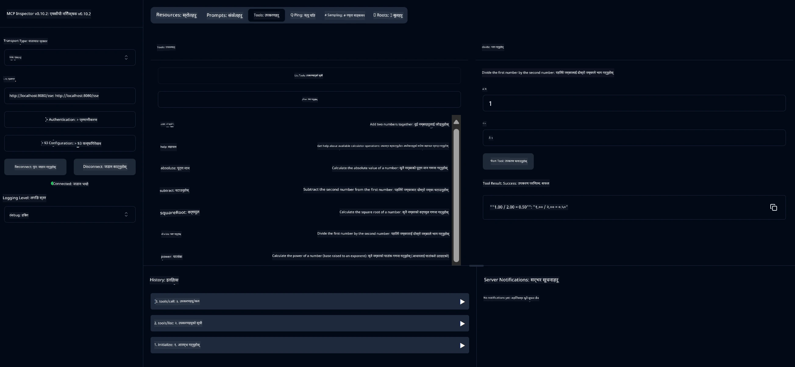

# आधारभूत क्याल्कुलेटर MCP सेवा

> [!NOTE]
> यो जाभा समाधान पुरानो HTTP+SSE ट्रान्सपोर्ट प्रयोग गर्छ र MCP `2025-11-25` सँग मिल्दोजुल्दो SDK लाई लक्षित गर्दछ।
> यो कोर्स कोडसँग मेलाउनका लागि राखिएको हो;
> नयाँ रिमोट सर्भरहरूले `2026-07-28` स्ट्रीमेबल HTTP सपोर्ट प्रयोग गर्नुपर्छ।

यो सेवा Spring Boot सँग WebFlux ट्रान्सपोर्ट प्रयोग गरी Model Context Protocol (MCP) मार्फत आधारभूत क्याल्कुलेटर अपरेसनहरू प्रदान गर्छ। यो MCP कार्यान्वयन सिक्न थालेका आरम्भकर्ताहरूका लागि सादृश्य उदाहरणको रूपमा डिजाइन गरिएको हो।

थप जानकारीको लागि, [MCP Server Boot Starter](https://docs.spring.io/spring-ai/reference/api/mcp/mcp-server-boot-starter-docs.html) सन्दर्भ दस्तावेज हेर्नुहोस्।


## सेवाको प्रयोग

यो सेवा MCP प्रोटोकल मार्फत तलका API अन्तबिन्दुहरू प्रदान गर्दछ:

- `add(a, b)`: दुई नम्बरहरूलाई थप्नुहोस्
- `subtract(a, b)`: दोस्रो नम्बरलाई पहिलो नम्बरबाट घटाउनुहोस्
- `multiply(a, b)`: दुई नम्बरहरूलाई गुणा गर्नुहोस्
- `divide(a, b)`: पहिलो नम्बरलाई दोस्रोबाट भाग गर्नुहोस् (शून्य जाँच सहित)
- `power(base, exponent)`: नम्बरको घात गणना गर्नुहोस्
- `squareRoot(number)`: वर्गमूल गणना गर्नुहोस् (ऋणात्मक नम्बर जाँच सहित)
- `modulus(a, b)`: भाग गर्दा बाँकी भाग गणना गर्नुहोस्
- `absolute(number)`: पूर्णांक मूल्य गणना गर्नुहोस्

## निर्भरताहरू

परियोजनाले तलका मुख्य निर्भरता आवश्यक पर्छ:

```xml
<dependency>
    <groupId>org.springframework.ai</groupId>
    <artifactId>spring-ai-starter-mcp-server-webflux</artifactId>
</dependency>
```

## परियोजना बनाउने तरिका

Maven प्रयोग गरी परियोजना बनाउनुहोस्:
```bash
./mvnw clean install -DskipTests
```

## सर्भर चलाउने तरिका

### जाभा प्रयोग गरेर

```bash
java -jar target/calculator-server-0.0.1-SNAPSHOT.jar
```

### MCP इन्स्पेक्टर प्रयोग गरेर

MCP इन्स्पेक्टर MCP सेवाहरूसँग अन्तरक्रिया गर्न उपयोगी उपकरण हो। यस क्याल्कुलेटर सेवासँग प्रयोग गर्न:

1. **नयाँ टर्मिनल विन्डोमा MCP इन्स्पेक्टर स्थापना र चलाउनुहोस्**:
   ```bash
   npx @modelcontextprotocol/inspector
   ```

2. **वेब UI पहुँच गर्नुहोस्** जुन एपले देखाएको URL क्लिक गरेर (सामान्यतया http://localhost:6274)

3. **जोडाइ सेटअप गर्नुहोस्**:
   - ट्रान्सपोर्ट प्रकार "SSE" मा सेट गर्नुहोस्
   - URL तपाईंको चलिरहेको सर्भरको SSE अन्तबिन्दुमा सेट गर्नुहोस्: `http://localhost:8080/sse`
   - "Connect" क्लिक गर्नुहोस्

4. **उपकरणहरू प्रयोग गर्नुहोस्**:
   - "List Tools" क्लिक गरेर उपलब्ध क्याल्कुलेटर अपरेसनहरू हेर्नुहोस्
   - उपकरण छान्नुहोस् र "Run Tool" क्लिक गरेर अपरेसन चलाउनुहोस्



---

<!-- CO-OP TRANSLATOR DISCLAIMER START -->
**अस्वीकरण**:
यो दस्तावेज़ AI अनुवाद सेवा [Co-op Translator](https://github.com/Azure/co-op-translator) प्रयोग गरेर अनुवाद गरिएको हो। हामी सही हुन प्रयास गर्छौं, तर कृपया जानकार हुनुस् कि स्वचालित अनुवादमा त्रुटिहरू वा अशुद्धताहरू हुन सक्छन्। मूल दस्तावेज़ यसको मूल भाषामा आधिकारिक स्रोत मानिनुपर्छ। महत्वपूर्ण जानकारीका लागि व्यावसायिक मानव अनुवाद सिफारिस गरिन्छ। यस अनुवादको प्रयोगबाट उत्पन्न कुनै पनि गलत बुझाइ वा त्रुटिको लागि हामी जिम्मेवार छैनौं।
<!-- CO-OP TRANSLATOR DISCLAIMER END -->