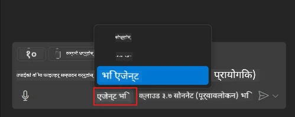
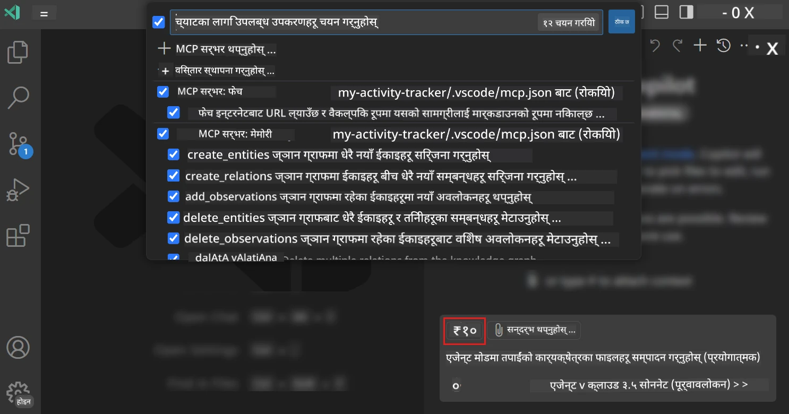
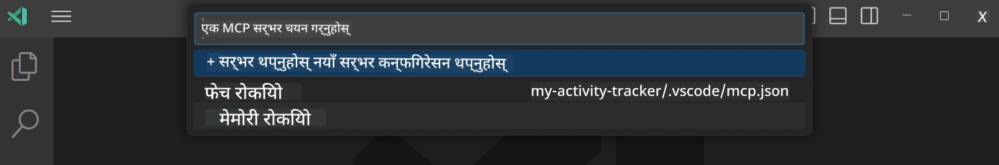
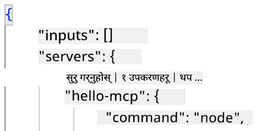
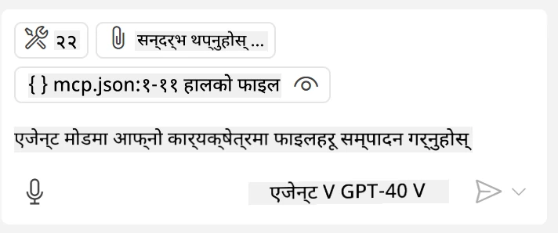
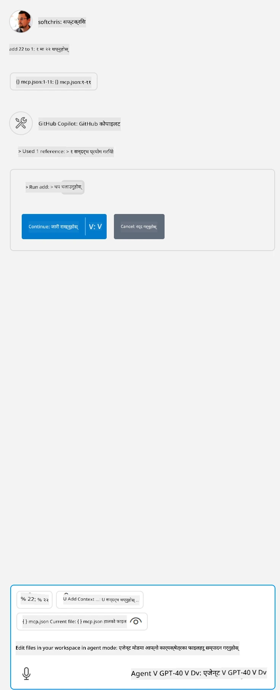

# GitHub Copilot Agent मोडबाट सर्भर उपभोग गर्ने

Visual Studio Code र GitHub Copilot एक ग्राहकको रूपमा कार्य गर्न र MCP सर्भर उपभोग गर्न सक्छन्। तपाईंले सोध्न सक्छन्, हामी किन यो गर्न चाहन्छौं? त्यसो भने यसको मतलब के हो भने MCP सर्भरका जुनसुकै सुविधाहरू अब तपाईंको IDE भित्रबाट प्रयोग गर्न सकिन्छ। उदाहरणका लागि तपाईं GitHub को MCP सर्भर थप्नु भयो भने, यसले टर्मिनलमा विशिष्ट आदेशहरू टाइप गर्ने सट्टा प्रॉम्प्टहरू मार्फत GitHub नियन्त्रण गर्न अनुमति दिनेछ। वा सामान्यतया कुनै पनि कुरा जुन तपाईंको विकासकर्ता अनुभव सुधार्न सक्छ सबै प्राकृतिक भाषाबाट नियन्त्रण गरिनेछ। अब तपाईंले विजयीता देख्न थाल्नुभयो, होइन र?

## अवलोकन

यो पाठले Visual Studio Code र GitHub Copilot को Agent मोडलाई तपाईंको MCP सर्भरको लागि ग्राहकको रूपमा कसरी प्रयोग गर्ने सिकाउँछ।

## सिकाइ उद्देश्यहरू

यस पाठको अन्त्यसम्म, तपाईं सक्षम हुनुहुनेछ:

- Visual Studio Code मार्फत MCP सर्भर उपभोग गर्न।
- GitHub Copilot मार्फत टुल्स जस्ता क्षमता सञ्चालन गर्न।
- Visual Studio Code कन्फिगर गर्न र तपाईंको MCP सर्भर फेला पार्न र व्यवस्थापन गर्न।

## प्रयोग

तपाईंले दुई तरिकाले तपाईंको MCP सर्भर नियन्त्रण गर्न सक्नुहुन्छ:

- प्रयोगकर्ता इन्टरफेस, यो अध्याय पछि कसरी गर्ने देखिन्छ।
- टर्मिनल, `code` executable प्रयोग गरी टर्मिनलबाट कुरा नियन्त्रण गर्न सम्भव छ:

  तपाईंको प्रयोगकर्ता प्रोफाइलमा MCP सर्भर थप्न, --add-mcp कमाण्ड लाइन आप्शन प्रयोग गर्नुहोस्, र JSON सर्भर कन्फिगरेसन प्रदान गर्नुहोस् जसको रूप {\"name\":\"server-name\",\"command\":...} हुनेछ।

  ```
  code --add-mcp "{\"name\":\"my-server\",\"command\": \"uvx\",\"args\": [\"mcp-server-fetch\"]}"
  ```

### स्क्रिनशटहरू





अब हामी अर्को भागहरूमा भिजुअल इन्टरफेस कसरी प्रयोग गर्ने बारे थप कुरा गरौं।

## दृष्टिकोण

उच्च स्तरमा हामी यो तरिकाले अघि बढ्न आवश्यक छ:

- एक फाइल कन्फिगर गर्नुहोस् जसले हाम्रो MCP सर्भर फेला पार्छ।
- उक्त सर्भर स्टार्ट/कनेक्ट गर्नुहोस् र यसको क्षमताहरू सूचीबद्ध गराउनुहोस्।
- GitHub Copilot Chat इन्टरफेस मार्फत ती क्षमताहरू प्रयोग गर्नुहोस्।

राम्रो, अब हामीले प्रवाह बुझ्यौं, आउनुहोस् Visual Studio Code मार्फत MCP सर्भर प्रयोग गर्ने अभ्यास गरौं।

## अभ्यास: सर्भर उपभोग गर्दै

यस अभ्यासमा, हामी Visual Studio Code लाई तपाईंको MCP सर्भर फेला पार्न कन्फिगर गर्नेछौं ताकि यसलाई GitHub Copilot Chat इन्टरफेसबाट प्रयोग गर्न सकियोस्।

### -0- प्रारम्भिक चरण, MCP सर्भर खोज सक्रिय गर्नुहोस्

तपाईंले MCP सर्भरहरूको खोज सक्षम गर्न आवश्यक हुन सक्छ।

1. Visual Studio Code मा `File -> Preferences -> Settings` मा जानुहोस्।

1. "MCP" खोज्नुहोस् र settings.json फाइलमा `chat.mcp.discovery.enabled` सक्षम गर्नुहोस्।

### -1- कन्फिग फाइल सिर्जना गर्नुहोस्

तपाईंको परियोजनाको मूल फोल्डरमा एक कन्फिग फाइल सिर्जना गरेर सुरु गर्नुहोस्, तपाईलाई MCP.json नामक फाइल बनाउनु हुने छ र यसलाई .vscode नामक फोल्डरमा राख्नु पर्नेछ। यसले यस प्रकार देखिनु पर्छ:

```text
.vscode
|-- mcp.json
```

अब, हामी कसरी सर्भर इन्ट्री थप्न सक्छौं हेर्नुहोस्।

### -2- सर्भर कन्फिगर गर्नुहोस्

*mcp.json* मा तलको सामग्री थप्नुहोस्:

```json
{
    "inputs": [],
    "servers": {
       "hello-mcp": {
           "command": "node",
           "args": [
               "build/index.js"
           ]
       }
    }
}
```

माथि साधारण उदाहरण छ जसले Node.js मा लेखिएको सर्भर सुरु गर्ने तरिका देखाउँछ, अन्य रनटाइमहरूका लागि `command` र `args` प्रयोग गरी सर्भर सुरु गर्ने सही आदेश उल्लेख गर्नुहोस्।

### -3- सर्भर सुरु गर्नुहोस्

अब जब तपाईंले इन्ट्री थप्नुभयो, सर्भर सुरु गरौं:

1. तपाईंको *mcp.json* मा इन्ट्री पत्ता लगाउनुहोस् र "play" आइकन फेला पार्नुहोस्:

    

1. "play" आइकनमा क्लिक गर्नुहोस्, GitHub Copilot Chat मा उपकरण आइकनले उपलब्ध उपकरणहरूको संख्या बढाएको देख्नु पर्नेछ। यदि तपाईं उक्त उपकरण आइकनमा क्लिक गर्नुहुन्छ भने, दर्ता गरिएको उपकरणहरूको सूची देख्नु हुनेछ। तपाईं एउटा एउटा उपकरण जाँच/अनचेक गर्न सक्नुहुन्छ यदि तपाईं GitHub Copilot लाई तिनीहरूलाई सन्दर्भको रूपमा प्रयोग गर्न चाहनुहुन्छ भने:

  

1. उपकरण चलाउन, त्यस्तो प्रॉम्प्ट टाइप गर्नुहोस् जुन तपाईं जानेको छ कि कुनै उपकरणको वर्णनसँग मेल खान्छ, उदाहरणका लागि यस्तो प्रॉम्प्ट "add 22 to 1":

  

  तपाईंले 23 भन्ने उत्तर देख्नुपर्छ।

## असाइनमेन्ट

तपाईं *mcp.json* फाइलमा सर्भर इन्ट्री थप्ने प्रयास गर्नुहोस् र सर्भर सुरु/रोक्न सक्षम हुनुहोस्। तपाईंले GitHub Copilot Chat इन्टरफेस मार्फत तपाईंको सर्भरमा उपकरणहरूसँग सञ्चार पनि गर्न सक्नु पर्छ।

## समाधान

[Solution](./solution/README.md)

## मुख्य बिन्दुहरू

यस अध्यायबाट मुख्य सिकाइहरू यसप्रकार छन्:

- Visual Studio Code एक उत्कृष्ट ग्राहक हो जसले तपाईंलाई थुप्रै MCP सर्भरहरू र तिनीहरूको उपकरणहरू उपभोग गर्न अनुमति दिन्छ।
- GitHub Copilot Chat इन्टरफेस तपाईंले सर्भरहरूसँग अन्तर्क्रिया गर्ने माध्यम हो।
- तपाईंले API कुञ्जी जस्ता इनपुटहरू प्रयोगकर्ताबाट माग्न सक्नुहुन्छ जुन *mcp.json* फाइलमा सर्भर इन्ट्री कन्फिगर गर्दा MCP सर्भरलाई पास गर्न सकिन्छ।

## नमूनाहरू

- [Java Calculator](../samples/java/calculator/README.md)
- [.Net Calculator](../../../../03-GettingStarted/samples/csharp)
- [JavaScript Calculator](../samples/javascript/README.md)
- [TypeScript Calculator](../samples/typescript/README.md)
- [Python Calculator](../../../../03-GettingStarted/samples/python)

## अतिरिक्त स्रोतहरू

- [Visual Studio कागजातहरू](https://code.visualstudio.com/docs/copilot/chat/mcp-servers)

## के गर्ने अर्को

- अर्को: [stdio सर्भर सिर्जना गर्दै](../05-stdio-server/README.md)

---

<!-- CO-OP TRANSLATOR DISCLAIMER START -->
**अस्वीकरण**:
यो दस्तावेज़ AI अनुवाद सेवा [Co-op Translator](https://github.com/Azure/co-op-translator) प्रयोग गरेर अनुवाद गरिएको हो। हामी सही हुन प्रयास गर्छौं, तर कृपया जानकार हुनुस् कि स्वचालित अनुवादमा त्रुटिहरू वा अशुद्धताहरू हुन सक्छन्। मूल दस्तावेज़ यसको मूल भाषामा आधिकारिक स्रोत मानिनुपर्छ। महत्वपूर्ण जानकारीका लागि व्यावसायिक मानव अनुवाद सिफारिस गरिन्छ। यस अनुवादको प्रयोगबाट उत्पन्न कुनै पनि गलत बुझाइ वा त्रुटिको लागि हामी जिम्मेवार छैनौं।
<!-- CO-OP TRANSLATOR DISCLAIMER END -->