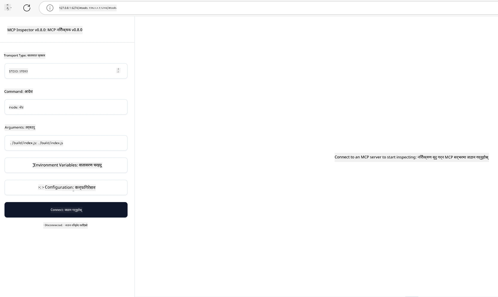

## परीक्षण र डिबगिङ

तपाईंले आफ्नो MCP सर्भर परीक्षण गर्नु अघि, उपलब्ध उपकरणहरू र डिबगिङका लागि सर्वोत्तम अभ्यासहरू बुझ्नु महत्त्वपूर्ण छ। प्रभावकारी परीक्षणले तपाईंको सर्भरले आशा गरिएको व्यवहार गर्दछ भन्ने सुनिश्चित गर्दछ र तपाईंलाई छिटो समस्याहरू पहिचान गर्न र समाधान गर्न मद्दत गर्दछ। निम्न खण्डले तपाईंको MCP कार्यान्वयन मान्य गर्न सिफारिश गरिएका दृष्टिकोणहरू बताउँछ।

## संक्षिप्त जानकारी

यस पाठले कुन परीक्षण दृष्टिकोण चयन गर्ने र सबैभन्दा प्रभावकारी परीक्षण उपकरणको बारेमा छ।

## सिकाइका उद्देश्यहरू

यस पाठको अन्त्यसम्म, तपाईं सक्षम हुनुहुनेछ:

- परीक्षणका विभिन्न दृष्टिकोणहरू वर्णन गर्न।
- प्रभावकारी रूपमा परीक्षण गर्न विभिन्न उपकरणहरू प्रयोग गर्न।


## MCP सर्भरहरू परीक्षण गर्दै

MCP ले तपाईंलाई तपाईंका सर्भरहरू परीक्षण र डिबग गर्न मद्दत गर्न उपकरणहरू प्रदान गर्दछ:

- **MCP Inspector**: एक कमाण्ड लाइन उपकरण जुन CLI उपकरणको रूपमा र भिजुअल उपकरणको रूपमा दुवै चलाउन सकिन्छ।
- **म्यानुअल परीक्षण**: तपाईं curl जस्तो उपकरण प्रयोग गरेर वेब अनुरोधहरू चलाउन सक्नुहुन्छ, तर HTTP चलाउन सक्षम कुनै पनि उपकरण प्रयोग गर्न सकिन्छ।
- **युनिट परीक्षण**: तपाईंको मनपर्ने परीक्षण फ्रेमवर्क प्रयोग गरेर दुवै सर्भर र क्लाइन्टका सुविधाहरू परीक्षण गर्न सम्भव छ।

### MCP Inspector प्रयोग गर्दै

यस उपकरणको प्रयोग हामीले पहिलेका पाठहरूमा वर्णन गरेका छौं तर यहाँ यसबारे उच्च स्तरमा कुरा गरौं। यो Node.js मा निर्माण गरिएको उपकरण हो र तपाईं यसलाई `npx` executable कल गरी प्रयोग गर्न सक्नुहुन्छ जसले उपकरणलाई अस्थायी रूपमा डाउनलोड र स्थापना गर्नेछ र सकेपछि तपाईंको अनुरोध चलाइसकेपछि आफै सफा गर्नेछ।

[MCP Inspector](https://github.com/modelcontextprotocol/inspector) ले तपाईंलाई मद्दत गर्दछ:

- **सर्भरका क्षमता पत्ता लगाउनुहोस्**: उपलब्ध स्रोतहरू, उपकरणहरू, र प्रॉम्प्टहरू स्वचालित रूपमा पत्ता लगाउनुहोस्
- **उपकरण परीक्षण कार्यान्वयन**: विभिन्न प्यारामिटरहरू प्रयास गर्नुहोस् र वास्तविक-समय प्रतिक्रियाहरू हेर्नुहोस्
- **सर्भर मेटाडाटा हेर्नुहोस्**: सर्भर जानकारी, स्किमाहरू, र कन्फिगरेसनहरू जाँच गर्नुहोस्

उपकरणको एक सामान्य चलाइ यस प्रकार देखिन्छ:

```bash
npx @modelcontextprotocol/inspector node build/index.js
```

माथिको कमाण्डले एउटा MCP र यसको भिजुअल इन्टरफेस सुरु गर्दछ र तपाईंको ब्राउजरमा एक स्थानीय वेब इन्टरफेस खोल्छ। तपाइँले दर्ता गरिएको MCP सर्भरहरू, तिनीहरूको उपलब्ध उपकरणहरू, स्रोतहरू, र प्रॉम्प्टहरू प्रदर्शन गर्ने ड्यासबोर्ड देख्न सक्नुहुन्छ। इन्टरफेसले तपाईंलाई अन्तरक्रियात्मक रूपमा उपकरण कार्यान्वयन परीक्षण गर्न, सर्भर मेटाडाटा जाँच गर्न, र वास्तविक-समय प्रतिक्रियाहरू हेर्न अनुमति दिन्छ, जसले तपाईंको MCP सर्भर कार्यान्वयनहरूलाई मान्य र डिबग गर्न सजिलो बनाउँछ।

यसले यसरी देखिन सक्छ: 

तपाईं यस उपकरणलाई CLI मोडमा पनि चलाउन सक्नुहुन्छ जहाँ तपाईं `--cli` एट्रिब्युट थप्नुहुन्छ। यहाँ "CLI" मोडमा उपकरण चलाउने एउटा उदाहरण छ जसले सर्भरमा भएका सबै उपकरणहरूको सूची देखाउँछ:

```sh
npx @modelcontextprotocol/inspector --cli node build/index.js --method tools/list
```

### म्यानुअल परीक्षण

सर्भरको क्षमताहरू परीक्षण गर्न इन्स्पेक्टर उपकरण चलाउनुको अलावा, अर्को समान दृष्टिकोण HTTP प्रयोग गर्न सक्षम क्लाइन्ट चलाउनु हो, जस्तै curl।

curl प्रयोग गरेर, तपाईं MCP सर्भरहरूलाई सिधै HTTP अनुरोधमार्फत परीक्षण गर्न सक्नुहुन्छ:

```bash
# उदाहरण: परीक्षण सर्भर मेटाडाटा
curl http://localhost:3000/v1/metadata

# उदाहरण: उपकरण कार्यान्वयन गर्नुहोस्
curl -X POST http://localhost:3000/v1/tools/execute \
  -H "Content-Type: application/json" \
  -d '{"name": "calculator", "parameters": {"expression": "2+2"}}'
```

माथिको curl प्रयोगबाट देखिएजस्तै, तपाईं POST अनुरोध प्रयोग गरेर उपकरणलाई यसको नाम र प्यारामिटरहरू सहितको पेलोड पठाएर चलाउनुहुन्छ। तपाईंलाई सबैभन्दा उपयुक्त तरिका प्रयोग गर्नुहोस्। CLI उपकरणहरू सामान्यतया छिटो हुन्छन् र स्क्रिप्ट गर्न सजिलो हुन्छ जुन CI/CD वातावरणमा उपयोगी हुन सक्छ।

### युनिट परीक्षण

तपाईंका उपकरण र स्रोतहरूको युनिट परीक्षणहरू सिर्जना गर्नुहोस् जसले तिनीहरू आशा गरिएको अनुसार काम गर्छन् भनेर सुनिश्चित गर्छ। यहाँ केही उदाहरण परीक्षण कोड छ।

```python
import pytest

from mcp.server.fastmcp import FastMCP
from mcp.shared.memory import (
    create_connected_server_and_client_session as create_session,
)

# सबै मोड्युललाई एसिङ्क परीक्षणहरूको लागि चिन्हित गर्नुहोस्
pytestmark = pytest.mark.anyio


async def test_list_tools_cursor_parameter():
    """Test that the cursor parameter is accepted for list_tools.

    Note: FastMCP doesn't currently implement pagination, so this test
    only verifies that the cursor parameter is accepted by the client.
    """

 server = FastMCP("test")

    # केही परीक्षण उपकरणहरू सिर्जना गर्नुहोस्
    @server.tool(name="test_tool_1")
    async def test_tool_1() -> str:
        """First test tool"""
        return "Result 1"

    @server.tool(name="test_tool_2")
    async def test_tool_2() -> str:
        """Second test tool"""
        return "Result 2"

    async with create_session(server._mcp_server) as client_session:
        # कर्सर प्यारामिटर बिना परीक्षण गर्नुहोस् (अवर्गीकृत)
        result1 = await client_session.list_tools()
        assert len(result1.tools) == 2

        # कर्सर=None सँग परीक्षण गर्नुहोस्
        result2 = await client_session.list_tools(cursor=None)
        assert len(result2.tools) == 2

        # कर्सर स्ट्रिङको रूपमा परीक्षण गर्नुहोस्
        result3 = await client_session.list_tools(cursor="some_cursor_value")
        assert len(result3.tools) == 2

        # खाली स्ट्रिङ कर्सरसँग परीक्षण गर्नुहोस्
        result4 = await client_session.list_tools(cursor="")
        assert len(result4.tools) == 2
    
```

माथिको कोडले निम्न कार्यहरू गर्छ:

- pytest फ्रेमवर्कको उपयोग गर्दछ जसले तपाईंलाई परीक्षणलाई फंक्शनको रूपमा सिर्जना गर्न र assert स्टेटमेन्टहरू प्रयोग गर्न अनुमति दिन्छ।
- दुई फरक उपकरणहरूसहित MCP सर्भर सिर्जना गर्दछ।
- निश्चित अवस्थाहरू पूरा भएका छन् कि छैनन् भनेर जाँच गर्न `assert` स्टेटमेन्ट प्रयोग गर्दछ।

[पूरा फाइल यहाँ हेर्नुहोस्](https://github.com/modelcontextprotocol/python-sdk/blob/main/tests/client/test_list_methods_cursor.py)

माथिल्लो फाइल अनुसार, तपाईंले आफ्नो सर्भर परीक्षण गर्न सक्नुहुन्छ कि क्षमताहरू सकेसरी सिर्जना भएका छन्।

सबै मुख्य SDK हरूमा समान परीक्षण भागहरू हुन्छन् त्यसैले तपाईंले आफ्नो रोजेको रनटाइम अनुसार मिलाउन सक्नुहुन्छ।

## नमूनाहरू 

- [Java Calculator](../samples/java/calculator/README.md)
- [.Net Calculator](../../../../03-GettingStarted/samples/csharp)
- [JavaScript Calculator](../samples/javascript/README.md)
- [TypeScript Calculator](../samples/typescript/README.md)
- [Python Calculator](../../../../03-GettingStarted/samples/python) 

## थप स्रोतहरू

- [Python SDK](https://github.com/modelcontextprotocol/python-sdk)

## अब के छ

- अर्को: [Deployment](../09-deployment/README.md)

---

<!-- CO-OP TRANSLATOR DISCLAIMER START -->
**अस्वीकरण**:
यो दस्तावेज़ AI अनुवाद सेवा [Co-op Translator](https://github.com/Azure/co-op-translator) प्रयोग गरेर अनुवाद गरिएको हो। हामी सही हुन प्रयास गर्छौं, तर कृपया जानकार हुनुस् कि स्वचालित अनुवादमा त्रुटिहरू वा अशुद्धताहरू हुन सक्छन्। मूल दस्तावेज़ यसको मूल भाषामा आधिकारिक स्रोत मानिनुपर्छ। महत्वपूर्ण जानकारीका लागि व्यावसायिक मानव अनुवाद सिफारिस गरिन्छ। यस अनुवादको प्रयोगबाट उत्पन्न कुनै पनि गलत बुझाइ वा त्रुटिको लागि हामी जिम्मेवार छैनौं।
<!-- CO-OP TRANSLATOR DISCLAIMER END -->