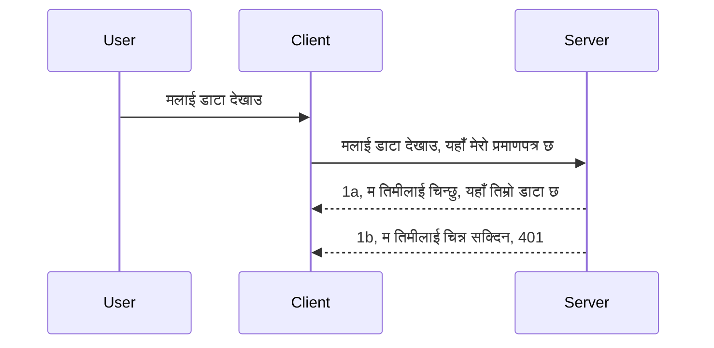

# सरल प्रमाणिकरण

MCP SDKs ले OAuth 2.1 को प्रयोगलाई समर्थन गर्दछ, जुन वास्तवमा प्रमाणीकरण सर्भर, स्रोत सर्भर, प्रमाणपत्र पोस्ट गर्ने, कोड प्राप्त गर्ने, कोडलाई बियरर टोकनमा विनिमय गर्नेसम्मको प्रक्रिया समावेश गर्दछ जबसम्म तपाईं अन्ततः आफ्नो स्रोत डेटा प्राप्त गर्न सक्नुहुन्छ। यदि तपाईं OAuth मा अपरिचित हुनुहुन्छ भने जुन कार्यान्वयन गर्न राम्रो कुरा हो, शुरुवातमा केही आधारभूत स्तरको प्रमाणीकरणबाट सुरु गरेर राम्रो र राम्रो सुरक्षा तर्फ बढ्नु राम्रो हुन्छ। त्यसैले यो अध्याय अस्तित्वमा छ, तपाईंलाई थप उन्नत प्रमाणीकरण तर्फ बढाउन।

## प्रमाणीकरण, हामी के भन्न खोज्छौं?

प्रमाणीकरण र अधिकार प्रदान गर्ने के हो त्यसको छोटकरी हो प्रमाणीकरण। विचार यो हो कि हामी दुई काम गर्नुपर्ने हुन्छ:

- **प्रमाणीकरण**, जसले के निर्धारण गर्दछ कि हामी कसैलाई हाम्रो घरमा प्रवेश गर्न दिने हो कि होइन, कि उनीहरूसँग "यहाँ" हुने अधिकार छ कि छैन, अर्थात् हाम्रो MCP सर्भर फीचर्स रहेको स्रोत सर्भरमा पहुँच छ कि छैन।
- **अधिकार प्रदान गर्ने**, जुन प्रक्रिया हो प्रयोगकर्ताले सोधेको विशिष्ट स्रोतमा पहुँच पाउनु पर्ने हो कि होइन पत्ता लगाउने, जस्तै यी अर्डरहरू वा यी उत्पादनहरू, वा उनीहरूलाई सामग्री पढ्न अनुमति छ तर मेटाउन अनुमति छैन जस्ता उदाहरणहरू।

## प्रमाणपत्र: हामी सिस्टमलाई कसरी बताउँछौं कि हामी को हौं

अधिकांश वेब विकासकर्ताहरू सामान्यतया सर्भरलाई प्रमाणपत्र दिने कुरामा सोच्न थाल्छन्, सामान्यतया यस्तो गोप्य कुरा जुन भन्छ कि उनीहरूलाई यहाँ रहन अनुमति छ ("प्रमाणीकरण")। यो प्रमाणपत्र सामान्यतया प्रयोगकर्ता नाम र पासवर्डको base64 इन्कोड गरिएको संस्करण वा API कुञ्जी जसले विशिष्ट प्रयोगकर्तालाई अनन्य रूपमा चिन्हित गर्दछ हुन्छ।

यसलाई "Authorization" नामक हेडर मार्फत पठाइन्छ जस्तै:

```json
{ "Authorization": "secret123" }
```

प्रायः यसलाई बेसिक प्रमाणीकरण भनिन्छ। समग्र प्रवाह त्यसपछि यस प्रकार काम गर्दछ:


अब हामीले प्रवाहको दृष्टिकोणबाट कसरी काम गर्छ भनेर बुझिसक्यौं, यसलाई कसरी कार्यान्वयन गर्ने? अधिकांश वेब सर्भरहरूमा मिडलवेयरको अवधारणा हुन्छ, जुन अनुरोधको भागको रूपमा चल्ने कोडको टुक्रा हो जसले प्रमाणपत्र जाँच्न सक्छ, र यदि प्रमाणपत्र मान्य छ भने अनुरोधलाई पास गर्न दिन्छ। यदि अनुरोधसँग वैध प्रमाणपत्र छैन भने प्रमाणीकरण त्रुटि प्राप्त हुन्छ। यसलाई कसरी लागू गर्न सकिन्छ हेरौं:

**Python**

```python
class AuthMiddleware(BaseHTTPMiddleware):
    async def dispatch(self, request, call_next):

        has_header = request.headers.get("Authorization")
        if not has_header:
            print("-> Missing Authorization header!")
            return Response(status_code=401, content="Unauthorized")

        if not valid_token(has_header):
            print("-> Invalid token!")
            return Response(status_code=403, content="Forbidden")

        print("Valid token, proceeding...")
       
        response = await call_next(request)
        # कुनै पनि ग्राहक हेडरहरू थप्नुहोस् वा प्रतिक्रिया लाई कुनै तरिकाले परिवर्तन गर्नुहोस्
        return response


starlette_app.add_middleware(CustomHeaderMiddleware)
```

यहाँ हामीले:

- `AuthMiddleware` नामक मिडलवेयर सिर्जना गरेका छौं जहाँ यसको `dispatch` विधि वेब सर्भरले बोलाउँछ।
- मिडलवेयर वेब सर्भरमा थपिएको छ:

    ```python
    starlette_app.add_middleware(AuthMiddleware)
    ```

- मान्यकरण तर्क लेखिएको छ जुन जाँच्छ कि Authorization हेडर छ कि छैन र पठाइएको गोप्य सूचना मान्य छ कि छैन:

    ```python
    has_header = request.headers.get("Authorization")
    if not has_header:
        print("-> Missing Authorization header!")
        return Response(status_code=401, content="Unauthorized")

    if not valid_token(has_header):
        print("-> Invalid token!")
        return Response(status_code=403, content="Forbidden")
    ```

    यदि गोप्य सूचना उपस्थित र मान्य छ भने हामी `call_next` कल गरी अनुरोध पास गराउने र प्रतिक्रिया फर्काउने काम गर्छौं।

    ```python
    response = await call_next(request)
    # कुनै पनि ग्राहक हेडरहरू थप्नुहोस् वा जवाफमा केही परिवर्तन गर्नुहोस्
    return response
    ```

यसले यसरी काम गर्छ कि यदि वेब अनुरोध सर्भर तर्फ गरिन्छ भने मिडलवेयर चलाइन्छ र यसको कार्यान्वयन अनुसार अनुरोध पास गर्न दिन्छ वा क्लाइन्टलाई अघि बढ्न दिन नदिने त्रुटि फर्काउँछ।

**TypeScript**

यहाँ हामी Express फ्रेमवर्कसँग मिडलवेयर सिर्जना गर्छौं र अनुरोध MCP सर्भरमा पुग्नु अघि रोक्छौं। कोड यस प्रकार छ:

```typescript
function isValid(secret) {
    return secret === "secret123";
}

app.use((req, res, next) => {
    // 1. प्राधिकरण हेडर छ कि छैन?
    if(!req.headers["Authorization"]) {
        res.status(401).send('Unauthorized');
    }
    
    let token = req.headers["Authorization"];

    // 2. वैधता जाँच गर्नुहोस्।
    if(!isValid(token)) {
        res.status(403).send('Forbidden');
    }

   
    console.log('Middleware executed');
    // 3. अनुरोधलाई अनुरोध पाइपलाइनको अर्को चरणमा पठाउनुहोस्।
    next();
});
```

यस कोडमा हामीले:

1. सबैभन्दा पहिला Authorization हेडर छ कि छैन जाँच्छौं, छैन भने 401 त्रुटि पठाउँछौं।
2. प्रमाणपत्र/टोकन मान्य छ कि छैन सुनिश्चित गर्छौं, छैन भने 403 त्रुटि पठाउँछौं।
3. अन्तमा अनुरोधलाई पाइपलाइनमा पास गरेर सोधिएको स्रोत फर्काउँछौं।

## अभ्यास: प्रमाणीकरण कार्यान्वयन गर्नुहोस्

हामीले गरेको ज्ञान लिएर यसलाई कार्यान्वयन गर्ने प्रयास गरौं। योजना यस प्रकार छ:

सर्भर

- वेब सर्भर र MCP उदाहरण सिर्जना गर्नुहोस्।
- सर्भरका लागि मिडलवेयर लागू गर्नुहोस्।

क्लाइन्ट 

- हेडर मार्फत प्रमाणपत्रसहित वेब अनुरोध पठाउनुहोस्।

### -1- वेब सर्भर र MCP उदाहरण सिर्जना गर्नुहोस्

पहिलो कदममा, हामीले वेब सर्भर र MCP सर्भर उदाहरण सिर्जना गर्नुपर्छ।

**Python**

यहाँ हामी MCP सर्भर उदाहरण सिर्जना गर्छौं, starlette वेब एप सिर्जना गर्छौं र uvicorn सँग होस्ट गर्छौं।

```python
# MCP सर्भर निर्माण गर्दैछ

app = FastMCP(
    name="MCP Resource Server",
    instructions="Resource Server that validates tokens via Authorization Server introspection",
    host=settings["host"],
    port=settings["port"],
    debug=True
)

# starlette वेब एप्लिकेशन निर्माण गर्दैछ
starlette_app = app.streamable_http_app()

# uvicorn मार्फत एप्लिकेशन सेवा गर्दैछ
async def run(starlette_app):
    import uvicorn
    config = uvicorn.Config(
            starlette_app,
            host=app.settings.host,
            port=app.settings.port,
            log_level=app.settings.log_level.lower(),
        )
    server = uvicorn.Server(config)
    await server.serve()

run(starlette_app)
```

यस कोडमा हामी:

- MCP सर्भर सिर्जना गर्छौं।
- MCP सर्भरबाट starlette वेब एप बनाउँछौं, `app.streamable_http_app()`।
- uvicorn प्रयोग गरेर वेब एप होस्ट र सर्भ गर्छौं `server.serve()`।

**TypeScript**

यहाँ हामी MCP सर्भर उदाहरण बनाउँछौं।

```typescript
const server = new McpServer({
      name: "example-server",
      version: "1.0.0"
    });

    // ... सर्भर स्रोतहरू, उपकरणहरू, र प्रॉम्प्टहरू सेट अप गर्नुहोस् ...
```

यो MCP सर्भर सिर्जना हाम्रो POST /mcp मार्ग परिभाषा भित्र हुनुपर्छ, त्यसैले माथिको कोड लिई यसरी सारौं:

```typescript
import express from "express";
import { randomUUID } from "node:crypto";
import { McpServer } from "@modelcontextprotocol/sdk/server/mcp.js";
import { StreamableHTTPServerTransport } from "@modelcontextprotocol/sdk/server/streamableHttp.js";
import { isInitializeRequest } from "@modelcontextprotocol/sdk/types.js"

const app = express();
app.use(express.json());

// सत्र ID द्वारा ट्रान्सपोर्टहरू भण्डारण गर्न नक्सा
const transports: { [sessionId: string]: StreamableHTTPServerTransport } = {};

// क्लाइन्ट-देखि-सर्भर संचारको लागि POST अनुरोधहरू ह्यान्डल गर्नुहोस्
app.post('/mcp', async (req, res) => {
  // अवस्थित सत्र ID जाँच गर्नुहोस्
  const sessionId = req.headers['mcp-session-id'] as string | undefined;
  let transport: StreamableHTTPServerTransport;

  if (sessionId && transports[sessionId]) {
    // अवस्थित ट्रान्सपोर्ट पुन: प्रयोग गर्नुहोस्
    transport = transports[sessionId];
  } else if (!sessionId && isInitializeRequest(req.body)) {
    // नयाँ इनिसियलाइजेसन अनुरोध
    transport = new StreamableHTTPServerTransport({
      sessionIdGenerator: () => randomUUID(),
      onsessioninitialized: (sessionId) => {
        // सत्र ID द्वारा ट्रान्सपोर्ट भण्डारण गर्नुहोस्
        transports[sessionId] = transport;
      },
      // DNS पुनः बाँध्ने सुरक्षा पूर्वनिर्धारित रूपमा पुराना अनुकूलताका लागि निष्क्रिय गरिएको छ। यदि तपाईं यो सर्भर
      // स्थानीय रूपमा चलाइरहनुभएको छ भने, सुनिश्चित गर्नुहोस् कि सेट गर्नुहोस्:
      // enableDnsRebindingProtection: true,
      // allowedHosts: ['127.0.0.1'],
    });

    // बन्द हुँदा ट्रान्सपोर्ट सफा गर्नुहोस्
    transport.onclose = () => {
      if (transport.sessionId) {
        delete transports[transport.sessionId];
      }
    };
    const server = new McpServer({
      name: "example-server",
      version: "1.0.0"
    });

    // ... सर्भर स्रोतहरू, उपकरणहरू, र प्रम्प्टहरू सेट अप गर्नुहोस् ...

    // MCP सर्भरमा जडान गर्नुहोस्
    await server.connect(transport);
  } else {
    // अवैध अनुरोध
    res.status(400).json({
      jsonrpc: '2.0',
      error: {
        code: -32000,
        message: 'Bad Request: No valid session ID provided',
      },
      id: null,
    });
    return;
  }

  // अनुरोध ह्यान्डल गर्नुहोस्
  await transport.handleRequest(req, res, req.body);
});

// GET र DELETE अनुरोधहरूको लागि पुन: प्रयोगयोग्य ह्यान्डलर
const handleSessionRequest = async (req: express.Request, res: express.Response) => {
  const sessionId = req.headers['mcp-session-id'] as string | undefined;
  if (!sessionId || !transports[sessionId]) {
    res.status(400).send('Invalid or missing session ID');
    return;
  }
  
  const transport = transports[sessionId];
  await transport.handleRequest(req, res);
};

// SSE मार्फत सर्भर-देखि-क्लाइन्ट सूचनाहरूको लागि GET अनुरोधहरू ह्यान्डल गर्नुहोस्
app.get('/mcp', handleSessionRequest);

// सत्र समाप्तिको लागि DELETE अनुरोधहरू ह्यान्डल गर्नुहोस्
app.delete('/mcp', handleSessionRequest);

app.listen(3000);
```

अब देख्न सकिन्छ कि MCP सर्भर सिर्जना `app.post("/mcp")` भित्र सारियो।

अब हामी अर्को चरण मिडलवेयर सिर्जना गर्ने तर्फ लागौं ताकि हामी आउने प्रमाणपत्र मान्यकरण गर्न सकौं।

### -2- सर्भरका लागि मिडलवेयर लागू गर्नुहोस्

अब मिडलवेयर भागमा आउनुहोस्। यहाँ हामीले `Authorization` हेडरमा प्रमाणपत्र खोज्ने र यसलाई मान्य गर्ने मिडलवेयर सिर्जना गर्नेछौं। यदि स्वीकार्य छ भने अनुरोधले आवश्यक कार्य जस्तै उपकरणहरूको सूची प्राप्त गर्ने, स्रोत पढ्ने वा क्लाइन्टले सोधेको MCP कार्यक्षमता गर्ने अनुमति पाउँछ।

**Python**

मिडलवेयर बनाउन, हामीले `BaseHTTPMiddleware` बाट वंश प्राप्त गर्ने कक्षा सिर्जना गर्नुपर्छ। दुई रोचक भागहरू छन्:

- अनुरोध `request`, जसबाट हामी हेडर जानकारी पढ्छौं।
- `call_next` जवाफ, जुन हामीले कल गर्नुपर्छ यदि क्लाइन्टले स्वीकार्य प्रमाणपत्र ल्याएको छ भने।

पहिला, `Authorization` हेडर छैन भनेको अवस्था ह्यान्डल गर्नुपर्छ:

```python
has_header = request.headers.get("Authorization")

# शीर्षक अनुपस्थित छ, 401 को साथ असफल हुनुहोस्, अन्यथा अगाडि बढ्नुहोस्।
if not has_header:
    print("-> Missing Authorization header!")
    return Response(status_code=401, content="Unauthorized")
```

यहाँ हामी 401 अनधिकृत सन्देश पठाउँछौं किनकि क्लाइन्ट प्रमाणीकरणमा असफल भयो।

अर्को, यदि प्रमाणपत्र प्रस्तुत गरिएको छ भने यसको मान्यता जाँच्नुपर्छ:

```python
 if not valid_token(has_header):
    print("-> Invalid token!")
    return Response(status_code=403, content="Forbidden")
```

यहाँ हामीले 403 निषेध सन्देश पठाएको देखिन्छ। तल पूरै मिडलवेयर छ जुन माथि भनिएका सबै कुरा लागू गर्दछ:

```python
class AuthMiddleware(BaseHTTPMiddleware):
    async def dispatch(self, request, call_next):

        has_header = request.headers.get("Authorization")
        if not has_header:
            print("-> Missing Authorization header!")
            return Response(status_code=401, content="Unauthorized")

        if not valid_token(has_header):
            print("-> Invalid token!")
            return Response(status_code=403, content="Forbidden")

        print("Valid token, proceeding...")
        print(f"-> Received {request.method} {request.url}")
        response = await call_next(request)
        response.headers['Custom'] = 'Example'
        return response

```

उत्तम, तर `valid_token` कार्य के हो? यहाँ यसो छ:

```python
# उत्पादनका लागि प्रयोग नगर्नुहोस् - यसलाई सुधार्नुहोस् !!
def valid_token(token: str) -> bool:
    # "Bearer " उपसर्ग हटाउनुहोस्
    if token.startswith("Bearer "):
        token = token[7:]
        return token == "secret-token"
    return False
```

यो स्पष्ट रूपमा सुधार गर्न सकिन्छ।

महत्त्वपूर्ण: यस्तो गोप्यता कहिल्यै कोडमा राख्नु हुँदैन। उचित उपाय हो कि यसको तुलना गर्ने मान डाटास्रोत वा पहिचान सेवा प्रदायक (IDP) बाट प्राप्त गर्ने वा IDP ले नै मान्यकरण गर्न दिनु।

**TypeScript**

Express प्रयोग गर्न, हामीले `use` विधि कल गर्नुपर्छ जुन मिडलवेयर कार्यहरू लिन्छ।

हामीले गर्नुपर्ने:

- `Authorization` गुणमा पठाइएको प्रमाणपत्र जाँच्न अनुरोधसँग अन्तरक्रिया गर्नु।
- प्रमाणपत्र मान्य भए अनुरोधलाई अगाडि बढ्न दिनु र क्लाइन्टको MCP अनुरोधले आवश्यक कार्य गर्न दिनु।

यहाँ, हामीले जांच गरिरहेका छौं कि `Authorization` हेडर छ कि छैन र छैन भने अनुरोध रोकिन्छ:

```typescript
if(!req.headers["authorization"]) {
    res.status(401).send('Unauthorized');
    return;
}
```

यदि हेडर पठाइएको छैन भने 401 प्राप्त हुन्छ।

अर्को, प्रमाणपत्र मान्य छ कि छैन जाँच्छौं, छैन भने फेरि अनुरोध रोकिन्छ तर फरक सन्देशसहित:

```typescript
if(!isValid(token)) {
    res.status(403).send('Forbidden');
    return;
} 
```

यहाँ 403 त्रुटि प्राप्त हुन्छ।

पूरा कोड यस प्रकार छ:

```typescript
app.use((req, res, next) => {
    console.log('Request received:', req.method, req.url, req.headers);
    console.log('Headers:', req.headers["authorization"]);
    if(!req.headers["authorization"]) {
        res.status(401).send('Unauthorized');
        return;
    }
    
    let token = req.headers["authorization"];

    if(!isValid(token)) {
        res.status(403).send('Forbidden');
        return;
    }  

    console.log('Middleware executed');
    next();
});
```

वेब सर्भरलाई मिडलवेयर स्वीकार गर्ने गरी सेटअप गरियो जसले क्लाइन्टबाट पठाइने प्रमाणपत्र जाँच्छ। क्लाइन्टको कुरा के छ?

### -3- हेडर मार्फत प्रमाणपत्रसहित वेब अनुरोध पठाउनुहोस्

क्लाइन्टले हेडर मार्फत प्रमाणपत्र पठाइरहेको सुनिश्चित गर्नुपर्छ। MCP क्लाइन्ट प्रयोग गर्ने भएकाले यसरी गर्ने तरिका जान्नुपर्छ।

**Python**

क्लाइन्टका लागि हामीले यसरी प्रमाणपत्र सहित हेडर पास गर्नुपर्छ:

```python
# मानलाई हार्डकोड नगर्नुहोस्, यसलाई कम्तिमा वातावरण चर वा थप सुरक्षित स्टोरेजमा राख्नुस्
token = "secret-token"

async with streamablehttp_client(
        url = f"http://localhost:{port}/mcp",
        headers = {"Authorization": f"Bearer {token}"}
    ) as (
        read_stream,
        write_stream,
        session_callback,
    ):
        async with ClientSession(
            read_stream,
            write_stream
        ) as session:
            await session.initialize()
      
            # TODO, क्लाइन्टमा के गर्न चाहनुहुन्छ, जस्तै उपकरणहरूको सूची दिने, उपकरणहरू कल गर्ने आदि।
```

यहाँ हामीले `headers` गुण यसरी भरेका छौं ` headers = {"Authorization": f"Bearer {token}"}`।

**TypeScript**

यो दुई चरणमा समाधान गर्न सकिन्छ:

1. प्रमाणपत्र सहित कन्फिगरेसन वस्तु तयार पार्नु।
2. उक्त कन्फिगरेसन वस्तु ट्रान्सपोर्टमा पठाउनु।

```typescript

// यहाँ देखाइएजस्तै मानलाई स्थिर रूपमा कोड नगर्नुहोस्। न्यूनतम रूपमा यसलाई वातावरण परिवर्तक (env variable) को रूपमा राख्नुहोस् र विकास मोड (dev mode) मा dotenv जस्ता केही प्रयोग गर्नुहोस्।
let token = "secret123"

// क्लाइन्ट ट्रान्सपोर्ट विकल्प वस्तु परिभाषित गर्नुहोस्
let options: StreamableHTTPClientTransportOptions = {
  sessionId: sessionId,
  requestInit: {
    headers: {
      "Authorization": "secret123"
    }
  }
};

// विकल्प वस्तुलाई ट्रान्सपोर्टमा पठाउनुहोस्
async function main() {
   const transport = new StreamableHTTPClientTransport(
      new URL(serverUrl),
      options
   );
```

यहाँ तल देखिन्छ कि कसरी `options` वस्तु बनाइयो र हेडरहरू `requestInit` गुण अन्तर्गत राखियो।

महत्त्वपूर्ण: यहाँबाट यसलाई कसरी सुधार्ने? हालको कार्यान्वयनमा केही समस्या छन्। पहिलो कुरा, यस्तो प्रमाणपत्र पास गर्नु खतरनाक हो यदि कम्तीमा HTTPS नछ भने। त्यसपनि, प्रमाणपत्र चोरी हुन सक्छ, त्यसैले यस्तो प्रणाली चाहिन्छ जहाँ टोकन सजिलै रद्द गर्न सकियोस र थप जाँचहरू जोडियोस् जस्तै संसारको कुन ठाउँबाट आएको, अनुरोध धेरै पटक भइरहेको छ कि छैन (बोट जस्तै व्यवहार), छोटकरीमा धेरै कुराहरू विचार गर्नुपर्छ।

तर भनौं, अत्यन्त सरल API हरूका लागि जहाँ तपाईं प्रमाणीकरण बिना कुनैलाई API कल गर्न नदिन चाहनुहुन्छ भने यो राम्रो शुरुवात हो।

त्यसोभए, हामी सुरक्षा कडा पार्ने प्रयास गरौं र JSON Web Token जस्तो मानकीकृत ढाँचा प्रयोग गरौं, जसलाई JWT वा "JOT" टोकन पनि भनिन्छ।

## JSON Web Tokens, JWT

अब हामी धेरै सरल प्रमाणपत्र पठाउने कार्य सुधार गर्ने प्रयास गर्दैछौं। JWT अपनाउँदा तुरुन्त के सुधार हुन्छ?

- **सुरक्षा सुधारहरू**। बेसिक प्रमाणिकरणमा, प्रयोगकर्ता नाम र पासवर्ड base64 इन्कोड टोकनको रूपमा बारम्बार पठाइन्छ (वा API कुञ्जी पठाइन्छ) जसले जोखिम बढाउँछ। JWT मा तपाईं आफ्नो प्रयोगकर्ता नाम र पासवर्ड पठाउनुहुन्छ र यसको सट्टामा टोकन प्राप्त गर्नुहुन्छ र यो समय-सीमित हुन्छ अर्थात् समाप्त हुन्छ। JWT ले भूमिकाहरू, स्कोपहरू र अनुमति प्रयोग गरी सूक्ष्म पहुँच नियन्त्रण सजिलै सम्भव बनाउँछ।
- **स्टेटलेसनेस र स्केलेबिलिटी**। JWT हरू स्व-सम्पूर्ण हुन्छन्, जसले सबै प्रयोगकर्ता जानकारी बोकेर सर्भर-साइड सेसन स्टोरेजको आवश्यकतालाई हटाउँछ। टोकन स्थानीय रूपमा पनि मान्यकरण गर्न सकिन्छ।
- **अन्तरपरिचालन र महासंघ**। JWT Open ID Connect को केन्द्र हो र Entra ID, Google Identity र Auth0 जस्ता परिचित पहिचान प्रदायकहरूसँग प्रयोग हुन्छ। यसले सिंगल साइन-अन लगायत धेरै सुविधा सम्भव बनाउँछ जसले यसलाई उद्यम-स्तर बनाउँछ।
- **मोड्युलरिटी र लचीलापन**। JWT Azure API Management, NGINX लगायत API गेटवेहरूमा पनि प्रयोग गर्न सकिन्छ। यो प्रमाणीकरण प्रयोग केसहरू र सर्भर-देखि-सेवा संवादहरूमा पनि सहयोगी छ जस्तै प्रतिरूपण (impersonation) र प्रतिनिधित्व (delegation)।
- **प्रदर्शन र क्यासिङ**। JWT डिकोड गरेपछिको क्यासिङले पार्सिङ आवश्यकता घटाउँछ। यसले विशेष गरी उच्च ट्राफिक एपहरूमा थ्रूपुट सुधार र चयनित पूर्वाधारमा लोड कम गर्न मद्दत गर्दछ।
- **उन्नत सुविधाहरू**। introspection (सर्भरमा मान्यता जाँच) र revocation (टोकन अमान्य बनाउने) पनि समर्थन गर्दछ।

यी सबै फाइदाहरूका साथ, हाम्रो कार्यान्वयनलाई अर्को स्तरमा लैजाने तरिका हेरौं।

## बेसिक प्रमाणीकरणलाई JWT मा परिवर्तन गर्ने

अर्को ठूलो परिवर्तनहरू यस प्रकार छन्:

- **JWT टोकन बनाउने तरिका सिक्ने** र क्लाइन्टबाट सर्भरमा पठाउने तयार गर्ने।
- **JWT टोकन मान्य गर्ने**, र यदि मान्य छ भने क्लाइन्टलाई हाम्रो स्रोतहरू दिनु।
- **टोकन सुरक्षित भण्डारण**। यो टोकन कसरी सुरक्षित राख्ने।
- **मार्गहरूलाई सुरक्षा गर्ने**। हामीले मार्गहरू, हाम्रो मामलामा विशेष MCP सुविधाहरू सुरक्षा गर्नुपर्छ।
- **रिफ्रेश टोकन थप्ने**। छोटो अवधिका टोकन र लामो अवधिका रिफ्रेश टोकनहरू सिर्जना गर्ने जसले टोकनExpire भएपछि नयाँ टोकन प्राप्त गर्न सकिन्छ। साथै रिफ्रेश अन्त बिन्दु र रोटेशन रणनीति पनि सुनिश्चित गर्ने।

### -1- JWT टोकन बनाउने

पहिले, JWT टोकनका भागहरू:

- **header**, प्रयोग गरिएको एल्गोरिदम र टोकन प्रकार।
- **payload**, दाबीहरू, जस्तै sub (टोकनले प्रतिनिधित्व गर्ने प्रयोगकर्ता वा इकाई, सामान्यतया userid), exp (समय समाप्ति), role (भूमिका)
- **signature**, गोप्य कुञ्जी वा निजी कुञ्जीसँग हस्ताक्षर गरिएको।

यसका लागि header, payload र इन्कोड गरिएको टोकन बनाउनु पर्छ।

**Python**

```python

import jwt
import jwt
from jwt.exceptions import ExpiredSignatureError, InvalidTokenError
import datetime

# JWT मा साइन गर्न प्रयोग गरिएको गोप्य कुञ्जी
secret_key = 'your-secret-key'

header = {
    "alg": "HS256",
    "typ": "JWT"
}

# प्रयोगकर्ता जानकारी र यसको दाबीहरू र समाप्ति समय
payload = {
    "sub": "1234567890",               # बिषय (प्रयोगकर्ता आईडी)
    "name": "User Userson",                # अनुकूल दाबी
    "admin": True,                     # अनुकूल दाबी
    "iat": datetime.datetime.utcnow(),# जारी गरिएको मिति
    "exp": datetime.datetime.utcnow() + datetime.timedelta(hours=1)  # समाप्ति
}

# यसलाई कूटलेखन गर्नुहोस्
encoded_jwt = jwt.encode(payload, secret_key, algorithm="HS256", headers=header)
```

माथिको कोडमा हामीले:

- HS256 एल्गोरिदम र JWT प्रकारको हेडर परिभाषित गर्यौं।
- payload तयार गर्यौं जसमा विषय वा प्रयोगकर्ता आईडी, प्रयोगकर्ता नाम, भूमिका, जारी मिति र समाप्ति समावेश छ जसले समय सीमितताका पक्षलाई कार्यान्वयन गरेको छ।

**TypeScript**

यहाँ हामीलाई JWT टोकन बनाउने केही निर्भरता आवश्यक पर्छ।

निर्भरता

```sh

npm install jsonwebtoken
npm install --save-dev @types/jsonwebtoken
```

अब यसलाई तयार गर्दै हेडर, payload र त्यसबाट इन्कोड गरिएको टोकन बनाऔं।

```typescript
import jwt from 'jsonwebtoken';

const secretKey = 'your-secret-key'; // उत्पादनमा env भेरिएबलहरू प्रयोग गर्नुहोस्

// पेलोड परिभाषित गर्नुहोस्
const payload = {
  sub: '1234567890',
  name: 'User usersson',
  admin: true,
  iat: Math.floor(Date.now() / 1000), // जारी गरिएको समय
  exp: Math.floor(Date.now() / 1000) + 60 * 60 // १ घण्टामा म्याद समाप्त हुन्छ
};

// हेडर परिभाषित गर्नुहोस् (वैकल्पिक, jsonwebtoken ले पूर्वनिर्धारित सेट गर्दछ)
const header = {
  alg: 'HS256',
  typ: 'JWT'
};

// टोकन सिर्जना गर्नुहोस्
const token = jwt.sign(payload, secretKey, {
  algorithm: 'HS256',
  header: header
});

console.log('JWT:', token);
```

यो टोकन:

HS256 प्रयोग गरेर हस्ताक्षर गरिएको छ  
१ घण्टा मान्य छ  
sub, name, admin, iat, र exp जस्ता दाबीहरू समावेश छ।

### -2- टोकन प्रमाणीकरण गर्ने

हामीले टोकन प्रमाणीकरण गर्नुपर्छ, जुन सर्भरमा गर्नुपर्छ ताकि हामी सुनिश्चित गरौं क्लाइन्टले पठाएको टोकन साँच्चै मान्य छ। यसको संरचना देखि मान्यता सम्म धेरै जाँचहरू गर्नुपर्छ। तपाईंलाई अन्य जाँचहरू थप्न पनि प्रोत्साहित गरिन्छ कि प्रयोगकर्ता हाम्रो प्रणालीमा छ कि छैन र अधिक।

टोकन प्रमाणीकरण गर्न, हामीले यसलाई डिकोड गरेर पढ्नुपर्छ र त्यसपछि यसको मान्यताको जाँच गर्न थाल्नुपर्छ:

**Python**

```python

# JWT लाई डिकोड र प्रमाणित गर्नुहोस्
try:
    decoded = jwt.decode(token, secret_key, algorithms=["HS256"])
    print("✅ Token is valid.")
    print("Decoded claims:")
    for key, value in decoded.items():
        print(f"  {key}: {value}")
except ExpiredSignatureError:
    print("❌ Token has expired.")
except InvalidTokenError as e:
    print(f"❌ Invalid token: {e}")

```

यस कोडमा हामीले `jwt.decode` कल गरेका छौं टोकन, गोप्य कुञ्जी र एल्गोरिदम दिएको छन्। ध्यान दिनुहोस् कि हामीले try-catch संरचना प्रयोग गरेका छौं किनकि प्रमाणीकरण असफल भएमा त्रुटि आउँछ।

**TypeScript**

यहाँ हामीले `jwt.verify` कल गर्नुपर्छ ताकि हामी टोकनको डिकोडेड संस्करण प्राप्त गरी विश्लेषण गर्न सकौं। यदि कल असफल भयो भने टोकनको संरचना गलत छ वा यो अझ मान्य छैन।

```typescript

try {
  const decoded = jwt.verify(token, secretKey);
  console.log('Decoded Payload:', decoded);
} catch (err) {
  console.error('Token verification failed:', err);
}
```

नोट: पहिले बताइसकेको जस्तै हामीले थप जाँचहरू गर्नुपर्छ कि टोकनले हाम्रो प्रणालीको प्रयोगकर्तालाई जनाउँछ र प्रयोगकर्ताको अधिकारहरू पनि ठीक छन्।

अब, भूमिकामा आधारित पहुँच नियन्त्रण (RBAC) तर्फ हेरौं।
## भूमिका आधारित पहुँच नियन्त्रण थप्दै

विचार यो हो कि हामीले व्यक्त गर्न चाहन्छौं कि भिन्न भूमिकाहरूले भिन्न अनुमति पाउँछन्। उदाहरणका लागि, हामी मान्छौं कि एउटा प्रशासक सबै काम गर्न सक्छ र सामान्य प्रयोगकर्ताहरूले पढ्न/लेख्न सक्छन् र अतिथि केवल पढ्न सक्छ। त्यसैले, यहाँ सम्भावित अनुमति स्तरहरू छन्:

- Admin.Write  
- User.Read  
- Guest.Read  

हेरौं कसरी हामी यस्तो नियन्त्रण मिडलवेयरसँग कार्यान्वयन गर्न सक्छौं। मिडलवेयरहरू मार्ग अनुसार थप्न सकिन्छ साथै सबै मार्गहरूका लागि पनि।

**Python**

```python
from starlette.middleware.base import BaseHTTPMiddleware
from starlette.responses import JSONResponse
import jwt

# कोडमा गुप्त कुरा नराख्नुहोस् जस्तै, यो केवल प्रदर्शनका लागि हो। यसलाई सुरक्षित स्थानबाट पढ्नुहोस्।
SECRET_KEY = "your-secret-key" # यसलाई env परिवर्तकमा राख्नुहोस्
REQUIRED_PERMISSION = "User.Read"

class JWTPermissionMiddleware(BaseHTTPMiddleware):
    async def dispatch(self, request, call_next):
        auth_header = request.headers.get("Authorization")
        if not auth_header or not auth_header.startswith("Bearer "):
            return JSONResponse({"error": "Missing or invalid Authorization header"}, status_code=401)

        token = auth_header.split(" ")[1]
        try:
            decoded = jwt.decode(token, SECRET_KEY, algorithms=["HS256"])
        except jwt.ExpiredSignatureError:
            return JSONResponse({"error": "Token expired"}, status_code=401)
        except jwt.InvalidTokenError:
            return JSONResponse({"error": "Invalid token"}, status_code=401)

        permissions = decoded.get("permissions", [])
        if REQUIRED_PERMISSION not in permissions:
            return JSONResponse({"error": "Permission denied"}, status_code=403)

        request.state.user = decoded
        return await call_next(request)


```
  
मिडलवेयर थप्ने केही फरक तरिकाहरू तलका जस्तै छन्:

```python

# विकल्प १: स्टारलेट एप निर्माण गर्दा मिडलवेयर थप्नुहोस्
middleware = [
    Middleware(JWTPermissionMiddleware)
]

app = Starlette(routes=routes, middleware=middleware)

# विकल्प २: स्टारलेट एप पहिले नै निर्माण भइसकेपछि मिडलवेयर थप्नुहोस्
starlette_app.add_middleware(JWTPermissionMiddleware)

# विकल्प ३: मार्ग प्रतियुक्त मिडलवेयर थप्नुहोस्
routes = [
    Route(
        "/mcp",
        endpoint=..., # ह्यान्डलर
        middleware=[Middleware(JWTPermissionMiddleware)]
    )
]
```
  
**TypeScript**

हामी `app.use` र मिडलवेयर प्रयोग गर्न सक्छौं जुन सबै अनुरोधहरूका लागि चल्नेछ।

```typescript
app.use((req, res, next) => {
    console.log('Request received:', req.method, req.url, req.headers);
    console.log('Headers:', req.headers["authorization"]);

    // 1. प्रमाणिकरण शीर्षक पठाइएको छ कि छैन जाँच गर्नुहोस्

    if(!req.headers["authorization"]) {
        res.status(401).send('Unauthorized');
        return;
    }
    
    let token = req.headers["authorization"];

    // 2. टोकन वैध छ कि छैन जाँच गर्नुहोस्
    if(!isValid(token)) {
        res.status(403).send('Forbidden');
        return;
    }  

    // 3. टोकन प्रयोगकर्ता हाम्रो प्रणालीमा छ कि छैन जाँच गर्नुहोस्
    if(!isExistingUser(token)) {
        res.status(403).send('Forbidden');
        console.log("User does not exist");
        return;
    }
    console.log("User exists");

    // 4. टोकनसँग सही अनुमति छ कि छैन प्रमाणित गर्नुहोस्
    if(!hasScopes(token, ["User.Read"])){
        res.status(403).send('Forbidden - insufficient scopes');
    }

    console.log("User has required scopes");

    console.log('Middleware executed');
    next();
});

```
  
हामीले हाम्रो मिडलवेयरबाट निम्न कुराहरू निश्चित गर्न सक्छौं र हाम्रो मिडलवेयरले यी गर्नुपर्छ:

1. प्रमाणिकरण हेडर छ कि छैन जाँच गर्नुहोस्  
2. टोकन वैध छ कि छैन जाँच गर्नुहोस्, हामी `isValid` भन्ने विधि प्रयोग गर्छौं जुन JWT टोकनको अखण्डता र वैधता जाँच्छ।  
3. प्रयोगकर्ता हाम्रो प्रणालीमा छ कि छैन जाँच गर्नुहोस्।

   ```typescript
    // डाटाबेसमा प्रयोगकर्ताहरू
   const users = [
     "user1",
     "User usersson",
   ]

   function isExistingUser(token) {
     let decodedToken = verifyToken(token);

     // गर्ने, जाँच गर्नुहोस् यदि प्रयोगकर्ता डाटाबेसमा अवस्थित छ
     return users.includes(decodedToken?.name || "");
   }
   ```
  
   माथि, हामीले एकदमै सरल `users` सूची बनाएका छौं, जुन स्पष्ट रूपमा डेटाबेसमा हुनु पर्छ।  

4. साथै, हामीले यो पनि सुनिश्चित गर्नुपर्छ कि टोकनमा सही अनुमति छ।

   ```typescript
   if(!hasScopes(token, ["User.Read"])){
        res.status(403).send('Forbidden - insufficient scopes');
   }
   ```
  
   माथिको मिडलवेयर कोडमा, हामीले टोकनमा User.Read अनुमति छ कि छैन जाँच गर्छौं, नभए 403 त्रुटि पठाउँछौं। तल `hasScopes` सहायक विधि छ।

   ```typescript
   function hasScopes(scope: string, requiredScopes: string[]) {
     let decodedToken = verifyToken(scope);
    return requiredScopes.every(scope => decodedToken?.scopes.includes(scope));
  }  
   ```

Have a think which additional checks you should be doing, but these are the absolute minimum of checks you should be doing.

Using Express as a web framework is a common choice. There are helpers library when you use JWT so you can write less code.

- `express-jwt`, helper library that provides a middleware that helps decode your token.
- `express-jwt-permissions`, this provides a middleware `guard` that helps check if a certain permission is on the token.

Here's what these libraries can look like when used:

```typescript
const express = require('express');
const jwt = require('express-jwt');
const guard = require('express-jwt-permissions')();

const app = express();
const secretKey = 'your-secret-key'; // put this in env variable

// Decode JWT and attach to req.user
app.use(jwt({ secret: secretKey, algorithms: ['HS256'] }));

// Check for User.Read permission
app.use(guard.check('User.Read'));

// multiple permissions
// app.use(guard.check(['User.Read', 'Admin.Access']));

app.get('/protected', (req, res) => {
  res.json({ message: `Welcome ${req.user.name}` });
});

// Error handler
app.use((err, req, res, next) => {
  if (err.code === 'permission_denied') {
    return res.status(403).send('Forbidden');
  }
  next(err);
});

```
  
अब तपाईंले देख्नुभयो कि कसरी मिडलवेयर दुवै प्रमाणीकरण र प्रमाणीकरणका लागि प्रयोग गर्न सकिन्छ, तर MCP का लागि के हुन्छ, के यसले प्रमाणीकरण गर्ने तरिका परिवर्तन गर्छ? हामी अर्को भागमा पत्ता लगाउँछौं।

### -3- MCP मा RBAC थप्नुहोस्

यहाँसम्म तपाईंले कसरी मिडलवेयर मार्फत RBAC थप्न सकिन्छ देख्नुभयो, तर MCP को लागि प्रयोग सुविधा अनुसार RBAC थप्न सजिलो तरिका छैन, त्यसो भए के गर्ने? हामीले यस्तो कोड थप्नुपर्ने हुन्छ जुन यो जाँच्छ कि क्लाइन्टसँग विशेष उपकरण कल गर्ने अधिकार छ कि छैन:

कोई सुविधा अनुसार RBAC कार्यान्वयन गर्न तपाईंले केही विकल्पहरू छन्, यहाँ केही छन्:

- प्रत्येक उपकरण, स्रोत, वा कुनै पनिको लागि अनुमति स्तर जाँच गर्ने कोड थप्नुहोस्।  

   **python**

   ```python
   @tool()
   def delete_product(id: int):
      try:
          check_permissions(role="Admin.Write", request)
      catch:
        pass # ग्राहक प्रमाणीकरण असफल भयो, प्रमाणीकरण त्रुटि उठाउनुहोस्
   ```
  
   **typescript**

   ```typescript
   server.registerTool(
    "delete-product",
    {
      title: Delete a product",
      description: "Deletes a product",
      inputSchema: { id: z.number() }
    },
    async ({ id }) => {
      
      try {
        checkPermissions("Admin.Write", request);
        // गर्नु पर्छ, productService र remote entry लाई id पठाउनुहोस्
      } catch(Exception e) {
        console.log("Authorization error, you're not allowed");  
      }

      return {
        content: [{ type: "text", text: `Deletected product with id ${id}` }]
      };
    }
   );
   ```


- उन्नत सर्भर दृष्टिकोण र अनुरोध ह्यान्डलरहरू प्रयोग गर्नुहोस् जसले तपाईंले अनुमति जाँच गर्नुपर्ने स्थानहरू घटाउँछ।  

   **Python**

   ```python
   
   tool_permission = {
      "create_product": ["User.Write", "Admin.Write"],
      "delete_product": ["Admin.Write"]
   }

   def has_permission(user_permissions, required_permissions) -> bool:
      # user_permissions: प्रयोगकर्तासँग भएका अनुमतिहरूको सूची
      # required_permissions: उपकरणको लागि आवश्यक अनुमतिहरूको सूची
      return any(perm in user_permissions for perm in required_permissions)

   @server.call_tool()
   async def handle_call_tool(
     name: str, arguments: dict[str, str] | None
   ) -> list[types.TextContent]:
    # request.user.permissions लाई प्रयोगकर्ताका अनुमतिहरूको सूची मान्नुहोस्
     user_permissions = request.user.permissions
     required_permissions = tool_permission.get(name, [])
     if not has_permission(user_permissions, required_permissions):
        # त्रुटि देखाउनुहोस् "तपाईंसँग उपकरण {name} कल गर्ने अनुमति छैन"
        raise Exception(f"You don't have permission to call tool {name}")
     # जारी राख्नुहोस् र उपकरण कल गर्नुहोस्
     # ...
   ```   
    

   **TypeScript**

   ```typescript
   function hasPermission(userPermissions: string[], requiredPermissions: string[]): boolean {
       if (!Array.isArray(userPermissions) || !Array.isArray(requiredPermissions)) return false;
       // प्रयोगकर्तासँग कम्तीमा एउटा आवश्यक अनुमति छ भने सत्य फर्काउनुहोस्
       
       return requiredPermissions.some(perm => userPermissions.includes(perm));
   }
  
   server.setRequestHandler(CallToolRequestSchema, async (request) => {
      const { params: { name } } = request;
  
      let permissions = request.user.permissions;
  
      if (!hasPermission(permissions, toolPermissions[name])) {
         return new Error(`You don't have permission to call ${name}`);
      }
  
      // जारी राख्नुहोस्..
   });
   ```
  
   ध्यान दिनोस्, तपाईंले सुनिश्चित गर्नुपर्नेछ कि तपाईंको मिडलवेयरले डिकोड गरिएको टोकनलाई अनुरोधको user गुणमा असाइन गर्छ ताकि माथिको कोड सरल हुन्छ।

### संक्षेपमा

अहिले हामीले सामान्य रुपमा र MCP मा RBAC कसरी थप्ने बारे छलफल गर्यौं, अब तपाईंको आफ्नै रुपमा सुरक्षा कार्यान्वयन गर्ने प्रयास गर्ने समय हो ताकि तपाईंलाई प्रस्तुत गरिएको अवधारणाहरू बुझिएको पक्का होस्।

## असाइनमेन्ट 1: आधारभूत प्रमाणीकरण प्रयोग गरी एक mcp सर्भर र mcp क्लाइन्ट बनाउनुहोस्

यहाँ तपाईंले हेडरहरू मार्फत प्रमाणपत्र पठाउने तरिका सिक्नु भएको कुरा प्रयोग गर्नुहुनेछ।

## समाधान 1

[Solution 1](./code/basic/README.md)

## असाइनमेन्ट 2: असाइनमेन्ट 1 को समाधान JWT उपयोग गरेर अपग्रेड गर्नुहोस्

पहिलो समाधान लिएर तर यस पटक यसलाई सुधार गर्ने प्रयास गरौं।  

Basic Auth प्रयोग गर्ने सट्टा, JWT प्रयोग गरौं।  

## समाधान 2

[Solution 2](./solution/jwt-solution/README.md)

## चुनौती

खण्ड "Add RBAC to MCP" मा वर्णन गरिएको प्रति उपकरण RBAC थप्नुहोस्।

## सारांश

यस अध्यायमा तपाईंले धेरै कुरा सिक्नुभएको छ, शून्य सुरक्षा देखि लिएर आधारभूत सुरक्षा, JWT र कसरी यसलाई MCP मा थप्न सकिन्छ।

हामीले कस्टम JWTs सँग मज़बूत आधार तयार गरेका छौं, तर बढ्दै जाँदा हामी मानक-आधारित पहिचान मोडेलमा जाँदैछौं। Entra वा Keycloak जस्ता IdP अपनाउनेले हामीलाई टोकन जारी गर्ने, प्रमाणिकरण र जीवनचक्र व्यवस्थापन जस्तो कामहरू भरपर्दो प्लेटफर्ममा सुम्पन दिन्छ— जसले हामीलाई एप्लिकेशन तर्क र प्रयोगकर्ता अनुभवमा केन्द्रित हुन स्वतन्त्र बनाउँछ।

त्यसका लागि, हामीसँग एक [अधिक उन्नत अध्याय Entra मा](../../05-AdvancedTopics/mcp-security-entra/README.md) छ।

## के छ आगामी

- अर्को: [MCP होस्टहरू सेटअप गर्दै](../12-mcp-hosts/README.md)

---

<!-- CO-OP TRANSLATOR DISCLAIMER START -->
**अस्वीकरण**:
यो दस्तावेज़ AI अनुवाद सेवा [Co-op Translator](https://github.com/Azure/co-op-translator) प्रयोग गरेर अनुवाद गरिएको छ। हामी सटीकताको लागि प्रयासरत छौं, तर कृपया बुझ्नुहोस् कि स्वचालित अनुवादमा त्रुटि वा अशुद्धिहरू हुन सक्छन्। मूल दस्तावेज़ यसको मूल भाषामा नै आधिकारिक स्रोत मानिनुपर्छ। महत्वपूर्ण जानकारीका लागि, व्यावसायिक मानव अनुवाद सिफारिस गरिन्छ। यस अनुवादको प्रयोगबाट हुने कुनै पनि गलतफहमी वा गलत व्याख्याका लागि हामी जिम्मेवार हुनेछैनौं।
<!-- CO-OP TRANSLATOR DISCLAIMER END -->