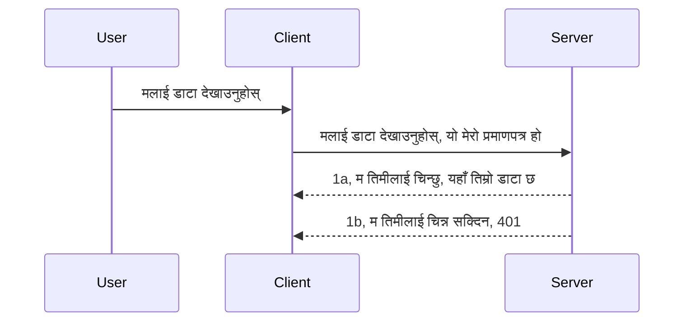

# सरल प्रमाणिकरण

MCP SDK हरूले OAuth 2.1 को प्रयोग समर्थन गर्छन् जुन यथार्थमा धेरै जटिल प्रक्रिया हो जसमा प्रमाणिकरण सर्भर, स्रोत सर्भर, क्रेडेन्सियल पोस्ट गर्ने, कोड प्राप्त गर्ने, कोडलाई बियरर टोकनमा परिवर्तन गर्ने सम्मका अवधारणा समावेश हुन्छन् र अन्ततः तपाईंले आफ्नो स्रोत डेटा प्राप्त गर्न सक्नुहुन्छ। यदि तपाईं OAuth बाट अपरिचित हुनुहुन्छ जुन कार्यान्वयन गर्नको लागि राम्रो कुरा हो भने, केही आधारभूत स्तरको प्रमाणिकरणबाट सुरु गरी क्रमशः राम्रो र राम्रो सुरक्षा तर्फ बढ्नु राम्रो हुन्छ।त्यसैले यो अध्याय अस्तित्वमा छ, तपाईंलाई उन्नत प्रमाणिकरणमा लैजान।

## प्रमाणिकरण, के भन्ने हाम्रो अर्थ हो?

प्रमाणिकरण भनेको authentication र authorization को संक्षिप्त रूप हो। विचार यो छ कि हामीले दुई कुरा गर्नुपर्छ:

- **प्रमाणिकरण**, जसको प्रक्रिया हो कि हामीले कसैलाई हाम्रो घरमा प्रवेश गर्न अनुमति दिने कि नदिने थाहा पाउने, उनीहरू "यहाँ" हुनको लागि अधिकार राख्छन् कि छैनन् भन्ने, जसले हाम्रो स्रोत सर्भर जहाँ हाम्रो MCP सर्भरका सुविधाहरू हुन्छन् पहुँच दिन्छ।
- **अधिकृतकरण**, प्रक्रिया हो कि प्रयोगकर्ताले सोचेका विशिष्ट स्रोतहरू (जस्तै यी आदेशहरू वा यी उत्पादनहरू) पहुँच गर्न पाउनु पर्छ कि छैन, वा उनीहरूले सामग्री पढ्न पाउँछन् तर मेटाउन नपाउने जस्ता अनुमति छ कि छैन भन्ने पत्ता लगाउने।

## क्रेडेन्सियलहरू: प्रणालीलाई हामी को हौं भन्ने कुरा कसरी बताउँछौं

धेरै वेब विकासकर्ताहरूले प्राय: सर्भरलाई क्रेडेन्सियल प्रदान गर्ने सोच्दछन्, प्राय: यस्तो गोप्य कुरा जसले प्रमाणित गर्छ कि उनीहरू यहाँ हुनु "Authentication" को लागि अनुमति छ।यस क्रेडेन्सियल प्राय: प्रयोगकर्ताको नाम र पासवर्डको बेस64 इन्कोड गरिएको संस्करण वा विशिष्ट प्रयोगकर्तालाई पहिचान गर्ने API कुञ्जी हुन्छ।

यसले "Authorization" नामक हेडर मार्फत पठाउन समावेश गर्छ, यस प्रकार:

```json
{ "Authorization": "secret123" }
```

यसलाई प्रायः आधारभूत प्रमाणिकरण (basic authentication) भनिन्छ। त्यसपछि समग्र प्रवाह यसरी काम गर्छ:


```mermaid
sequenceDiagram
   participant User
   participant Client
   participant Server

   User->>Client: मलाई डाटा देखाउनुहोस्
   Client->>Server: मलाई डाटा देखाउनुहोस्, यो मेरो प्रमाणपत्र हो
   Server-->>Client: 1a, म तिमीलाई चिन्छु, यहाँ तिम्रो डाटा छ
   Server-->>Client: 1b, म तिमीलाई चिन्न सक्दिन, 401 
```

अब हामीले प्रवाहको दृष्टिकोणबाट कसरी काम गर्छ बुझ्यौं, त्यसलाई कसरी कार्यान्वयन गर्ने? प्रायः वेब सर्भरहरूमा मिडलवेयर नामक अवधारणा हुन्छ, एउटा कोडको टुक्रा जसले सोधपुछको भागको रूपमा चल्छ र क्रेडेन्सियलहरू जाँच्न सक्छ, र यदि क्रेडेन्सियल मान्य भए अनुरोधलाई पास हुन दिन्छ। यदि अनुरोधसँग मान्य क्रेडेन्सियल छैन भने प्रमाणिकरण त्रुटि प्राप्त हुन्छ। यसलाई कसरी कार्यान्वयन गर्ने हेर्नुहोस्:

**Python**

```python
class AuthMiddleware(BaseHTTPMiddleware):
    async def dispatch(self, request, call_next):

        has_header = request.headers.get("Authorization")
        if not has_header:
            print("-> Missing Authorization header!")
            return Response(status_code=401, content="Unauthorized")

        if not valid_token(has_header):
            print("-> Invalid token!")
            return Response(status_code=403, content="Forbidden")

        print("Valid token, proceeding...")
       
        response = await call_next(request)
        # कुनै पनि ग्राहक हेडरहरू थप्नुहोस् वा जवाफमा केही प्रकारको परिवर्तन गर्नुहोस्
        return response


starlette_app.add_middleware(CustomHeaderMiddleware)
```

यहाँ हामीले:

- `AuthMiddleware` नामक मिडलवेयर बनाएका छौँ जहाँ यसको `dispatch` विधि वेब सर्भरले बोलाउँछ।
- मिडलवेयर वेब सर्भरमा थपेका छौँ:

    ```python
    starlette_app.add_middleware(AuthMiddleware)
    ```

- प्रमाणीकरण सम्बन्धी जाँच लेखेका छौँ जसले जाँच गर्छ कि Authorization हेडर छ कि छैन र पठाइएको गोप्य कुरा मान्य छ कि छैन:

    ```python
    has_header = request.headers.get("Authorization")
    if not has_header:
        print("-> Missing Authorization header!")
        return Response(status_code=401, content="Unauthorized")

    if not valid_token(has_header):
        print("-> Invalid token!")
        return Response(status_code=403, content="Forbidden")
    ```

    यदि गोप्य कुरा छ र मान्य भए हामी `call_next` लाई बोलाइ अनुरोधलाई अगाडि पठाउँछौँ र जवाफ फर्काउँछौँ।

    ```python
    response = await call_next(request)
    # कुनै पनि ग्राहक हेडरहरू थप्नुहोस् वा प्रतिक्रिया मा कुनै तरिकाले परिवर्तन गर्नुहोस्
    return response
    ```

यो यसरी काम गर्छ कि, यदि वेब अनुरोध सर्भरसम्म आएको छ भने मिडलवेयर चलाइन्छ र यसको कार्यान्वयन अनुसार अनुरोध पास गर्न वा क्लाइन्टलाई अनुमति नदिने त्रुटि फर्काउन सक्छ।

**TypeScript**

यहाँ हामी लोकप्रिय फ्रेमवर्क Express सँग मिडलवेयर बनाउँछौँ र अनुरोध MCP सर्भरमा पुग्नु अघि रोक्छौँ। यसको कोड यस प्रकार छ:

```typescript
function isValid(secret) {
    return secret === "secret123";
}

app.use((req, res, next) => {
    // 1. अनुमति हेडर उपस्थित छ?
    if(!req.headers["Authorization"]) {
        res.status(401).send('Unauthorized');
    }
    
    let token = req.headers["Authorization"];

    // 2. वैधता जाँच गर्नुहोस्।
    if(!isValid(token)) {
        res.status(403).send('Forbidden');
    }

   
    console.log('Middleware executed');
    // 3. अनुरोध पाइपलाइनको अर्को चरणमा अनुरोध पास गर्नुहोस्।
    next();
});
```

यस कोडमा हामीले:

1. पहिले जाँच्छौँ कि Authorization हेडर छ कि छैन, छैन भने 401 त्रुटि पठाउँछौँ।
2. क्रेडेन्सियल/टोकन मान्य छ कि छैन सुनिश्चित गर्छौँ, छैन भने 403 त्रुटि पठाउँछौँ।
3. अन्ततः अनुरोधलाई अनुरोध पाइपलाइनमा जारी राख्छौँ र मागिएको स्रोत फर्काउँछौँ।

## अभ्यास: प्रमाणिकरण लागू गर्नुहोस्

हामी हाम्रो ज्ञान लिएर यसलाई लागू गर्ने प्रयास गरौं। योजना यस प्रकार छ:

सर्भर

- वेब सर्भर र MCP इन्स्ट्यान्स बनाउनुहोस्।
- सर्भरको लागि मिडलवेयर implement गर्नुहोस्।

क्लाइन्ट

- हेडर मार्फत क्रेडेन्सियलसहित वेब अनुरोध पठाउनुहोस्।

### -1- वेब सर्भर र MCP इन्स्ट्यान्स बनाउनुहोस्

> [!WARNING]
> तलको TypeScript उदाहरण MCP `2025-11-25` लक्षित छ। यसले ट्रान्सपोर्टहरू ट्र्याक गर्दछ
> `mcp-session-id` द्वारा र यो हालको `2026-07-28` ट्रान्सपोर्ट उदाहरण होइन। MCP
> `2026-07-28` मा `initialize` ह्यान्डशेक र प्रोटोकल सेसन ID हटाइएको छ; नयाँ
> कार्यान्वयनहरू स्व-समावेश अनुरोध प्रयोग गर्छन्। हेर्नुहोस्
> [MCP मा के परिवर्तन भयो: 2026-07-28 स्पेसिफिकेसन](../../01-CoreConcepts/mcp-2026-07-28.md)।

हाम्रो पहिलो कदममा, हामी वेब सर्भर इन्स्ट्यान्स र MCP सर्भर सिर्जना गर्न आवश्यक छ।

**Python**

यहाँ हामी MCP सर्भर इन्स्ट्यान्स बनाउँछौँ, starlette वेब अनुप्रयोग सिर्जना गर्छौँ र uvicorn संग होस्ट गर्छौँ।

```python
# MCP सर्भर सिर्जना गर्दै

app = FastMCP(
    name="MCP Resource Server",
    instructions="Resource Server that validates tokens via Authorization Server introspection",
    host=settings["host"],
    port=settings["port"],
    debug=True
)

# starlette वेब एप्लिकेशन सिर्जना गर्दै
starlette_app = app.streamable_http_app()

# uvicorn मार्फत एप्लिकेशन सेवा गर्दै
async def run(starlette_app):
    import uvicorn
    config = uvicorn.Config(
            starlette_app,
            host=app.settings.host,
            port=app.settings.port,
            log_level=app.settings.log_level.lower(),
        )
    server = uvicorn.Server(config)
    await server.serve()

run(starlette_app)
```

यस कोडमा हामीले:

- MCP सर्भर सिर्जना गरेका छौँ।
- MCP सर्भरबाट starlette वेब एप्लिकेशन निर्माण गरेका छौँ, `app.streamable_http_app()`।
- uvicorn प्रयोग गरी वेब एप्लिकेसन होस्ट र सर्भ गरेको छौँ `server.serve()`।

**TypeScript**

यहाँ हामी MCP सर्भर इन्स्ट्यान्स बनाउँछौँ।

```typescript
const server = new McpServer({
      name: "example-server",
      version: "1.0.0"
    });

    // ... सर्भर स्रोतहरू, उपकरणहरू, र प्रॉम्प्टहरू सेट अप गर्नुहोस् ...
```

यो MCP सर्भर सिर्जना हाम्रो POST /mcp रुट परिभाषामा हुन आवश्यक छ, त्यसैले माथिको कोडलाई यसरी सारौं:

```typescript
import express from "express";
import { randomUUID } from "node:crypto";
import { McpServer } from "@modelcontextprotocol/sdk/server/mcp.js";
import { StreamableHTTPServerTransport } from "@modelcontextprotocol/sdk/server/streamableHttp.js";
import { isInitializeRequest } from "@modelcontextprotocol/sdk/types.js"

const app = express();
app.use(express.json());

// सत्र ID द्वारा ट्रान्सपोर्टहरू भण्डारण गर्न नक्सा
const transports: { [sessionId: string]: StreamableHTTPServerTransport } = {};

// क्लाइंट-देखि-सर्भर संचारका लागि POST अनुरोधहरू ह्यान्डल गर्नुहोस्
app.post('/mcp', async (req, res) => {
  // अवस्थित सत्र ID जाँच गर्नुहोस्
  const sessionId = req.headers['mcp-session-id'] as string | undefined;
  let transport: StreamableHTTPServerTransport;

  if (sessionId && transports[sessionId]) {
    // अवस्थित ट्रान्सपोर्ट पुन: प्रयोग गर्नुहोस्
    transport = transports[sessionId];
  } else if (!sessionId && isInitializeRequest(req.body)) {
    // नयाँ इनीसियलाइजेशन अनुरोध
    transport = new StreamableHTTPServerTransport({
      sessionIdGenerator: () => randomUUID(),
      onsessioninitialized: (sessionId) => {
        // सत्र ID द्वारा ट्रान्सपोर्ट भण्डारण गर्नुहोस्
        transports[sessionId] = transport;
      },
      // DNS रिबाइन्डिङ सुरक्षा पूर्वनिर्धारित रूपमा पछि सुसंगतताका लागि अक्षम छ। यदि तपाईं यो सर्भर
      // स्थानीय रूपमा चलाउँदै हुनुहुन्छ भने, सुनिश्चित गर्नुहोस् सेट गर्नुहोस्:
      // enableDnsRebindingProtection: true,
      // allowedHosts: ['127.0.0.1'],
    });

    // ट्रान्सपोर्ट बन्द हुँदा सफा गर्नुहोस्
    transport.onclose = () => {
      if (transport.sessionId) {
        delete transports[transport.sessionId];
      }
    };
    const server = new McpServer({
      name: "example-server",
      version: "1.0.0"
    });

    // ... सर्भर स्रोतहरू, उपकरणहरू, र प्रम्प्टहरू सेट अप गर्नुहोस् ...

    // MCP सर्भरमा जडान गर्नुहोस्
    await server.connect(transport);
  } else {
    // अमान्य अनुरोध
    res.status(400).json({
      jsonrpc: '2.0',
      error: {
        code: -32000,
        message: 'Bad Request: No valid session ID provided',
      },
      id: null,
    });
    return;
  }

  // अनुरोध ह्यान्डल गर्नुहोस्
  await transport.handleRequest(req, res, req.body);
});

// GET र DELETE अनुरोधहरूको लागि पुन: प्रयोगयोग्य ह्यान्डलर
const handleSessionRequest = async (req: express.Request, res: express.Response) => {
  const sessionId = req.headers['mcp-session-id'] as string | undefined;
  if (!sessionId || !transports[sessionId]) {
    res.status(400).send('Invalid or missing session ID');
    return;
  }
  
  const transport = transports[sessionId];
  await transport.handleRequest(req, res);
};

// SSE मार्फत सर्भर-देखि-क्लाइंट सूचनाहरूका लागि GET अनुरोधहरू ह्यान्डल गर्नुहोस्
app.get('/mcp', handleSessionRequest);

// सत्र समाप्तिका लागि DELETE अनुरोधहरू ह्यान्डल गर्नुहोस्
app.delete('/mcp', handleSessionRequest);

app.listen(3000);
```

अब तपाईं देख्नुहुन्छ MCP सर्भर सिर्जना `app.post("/mcp")` भित्र सारिएको छ।

अब हामी अर्को कदम, मिडलवेयर सिर्जना गर्ने चरणमा बढौं जसले आउने क्रेडेन्सियललाई प्रमाणित गर्छ।

### -2- सर्भरको लागि मिडलवेयर implement गर्नुहोस्

अब मिडलवेयर भागमा जान्छौँ। यहाँ हामी एउटा मिडलवेयर बनाउँछौँ जुन `Authorization` हेडरमा क्रेडेन्सियल खोज्छ र जाँच गर्छ। यदि स्वीकार्य छ भने अनुरोधले आवश्यक काम गर्छ (जस्तै उपकरण सूचीकरण, स्रोत पढ्ने वा क्लाइन्टले मागेको MCP कार्यसम्पादन)।

**Python**

मिडलवेयर बनाउन, हामीले `BaseHTTPMiddleware` बाट इनहेरिट गर्ने कक्षा बनाउनु पर्छ। दुई दिलचस्प कुरा छन्:

- अनुरोध `request`, जसबाट हामी हेडर जानकारी पढ्छौँ।
- `call_next` कलब्याक जुन बोलाउनु पर्छ यदि क्लाइन्टले ल्याएको क्रेडेन्सियल हामी स्वीकार गर्छौँ भने।

पहिले, यदि `Authorization` हेडर अभाव छ भने अवस्था सम्हाल्नु पर्छ:

```python
has_header = request.headers.get("Authorization")

# शीर्षक छैन, 401 सँग असफल, अन्यथा अगाडि बढ्नुहोस्।
if not has_header:
    print("-> Missing Authorization header!")
    return Response(status_code=401, content="Unauthorized")
```

यहाँ हामीले 401 unauthorized म्यासेज पठाएका छौँ किनकि क्लाइन्ट प्रमाणीकरणमा असफल भयो।

अर्को, यदि क्रेडेन्सियल प्रस्तुत भयो भने, यसको वैधता जाँच गर्नुपर्छ यसरी:

```python
 if not valid_token(has_header):
    print("-> Invalid token!")
    return Response(status_code=403, content="Forbidden")
```

माथि कसरि हामीले 403 forbidden म्यासेज पठायौं हेर्नुहोस्। तल सम्पूर्ण मिडलवेयर छ जुन माथि वर्णन गरिएको सबै कुरा लागू गर्छ:

```python
class AuthMiddleware(BaseHTTPMiddleware):
    async def dispatch(self, request, call_next):

        has_header = request.headers.get("Authorization")
        if not has_header:
            print("-> Missing Authorization header!")
            return Response(status_code=401, content="Unauthorized")

        if not valid_token(has_header):
            print("-> Invalid token!")
            return Response(status_code=403, content="Forbidden")

        print("Valid token, proceeding...")
        print(f"-> Received {request.method} {request.url}")
        response = await call_next(request)
        response.headers['Custom'] = 'Example'
        return response

```

राम्रो, तर `valid_token` फङ्क्शन के ? यहाँ छ:

```python
# उत्पादनको लागि प्रयोग नगर्नुहोस् - यसलाई सुधार गर्नुहोस् !!
def valid_token(token: str) -> bool:
    # "Bearer " उपसर्ग हटाउनुहोस्
    if token.startswith("Bearer "):
        token = token[7:]
        return token == "secret-token"
    return False
```

यसलाई स्पष्ट रूपमा सुधार्न सक्छौं।

महत्त्वपूर्ण: तपाईंले कहिल्यै यस प्रकारको गोप्य कुरा कोडमा राख्नु हुँदैन। तपाईंले चाहिँ यस्ता मानहरू डाटास्रोत वा IDP (पहिचान सेवा प्रदायक) बाट लिनु पर्छ या अझ राम्रो, IDP लाई प्रमाणिकरण गर्न दिनु पर्छ।

**TypeScript**

Express मा यो लागू गर्न `use` मेथड कल गर्नुपर्छ जसले मिडलवेयर फङ्क्शनहरू लिन्छ।

हामीलाई गर्नुपर्दछ:

- अनुरोध भेरिएबलसँग अन्तरक्रिया गरी `Authorization` प्रोपर्टीमा पठाइएको क्रेडेन्सियल जाँच्ने।
- क्रेडेन्सियल मान्य भए अनुरोध जारी राख्ने र क्लाइन्टको MCP अनुरोधलाई अनुमति दिने (जस्तै उपकरण सूची, स्रोत पढ्ने वा MCP सम्बन्धित अन्य कार्य)।

यहाँ हामी जाँच्दैछौं कि `Authorization` हेडर छ कि छैन, छैन भने अनुरोध रोकिन्छ:

```typescript
if(!req.headers["authorization"]) {
    res.status(401).send('Unauthorized');
    return;
}
```

यदि हेडर पठाइएको छैन भने 401 प्राप्त हुन्छ।

अर्को, हामी जाँच्छौं कि क्रेडेन्सियल मान्य छ कि छैन, छैन भने फेरी अनुरोध रोक्छौं तर फरक सन्देशसहित:

```typescript
if(!isValid(token)) {
    res.status(403).send('Forbidden');
    return;
} 
```

हेरौं अब तपाईं 403 त्रुटि प्राप्त गर्नुहुन्छ।

यहाँ पूरै कोड छ:

```typescript
app.use((req, res, next) => {
    console.log('Request received:', req.method, req.url, req.headers);
    console.log('Headers:', req.headers["authorization"]);
    if(!req.headers["authorization"]) {
        res.status(401).send('Unauthorized');
        return;
    }
    
    let token = req.headers["authorization"];

    if(!isValid(token)) {
        res.status(403).send('Forbidden');
        return;
    }  

    console.log('Middleware executed');
    next();
});
```

हामीले वेब सर्भर सेटअप गर्‍यौं ताकि मिडलवेयरले क्लाइन्टले पठाएको क्रेडेन्सियल जाँच गरोस्। अब क्लाइन्टको कुरा के हो?

### -3- हेडरमा क्रेडेन्सियल सहित वेब अनुरोध पठाउनुहोस्

हामीले सुनिश्चित गर्नुपर्छ कि क्लाइन्ट हेडरमार्फत क्रेडेन्सियल पठाउँदैछ। हामीले MCP क्लाइन्ट प्रयोग गर्ने हुँदा यसलाई कसरी गर्ने थाहा पाउनुपर्छ।

**Python**

क्लाइन्टको लागि हामीले क्रेडेन्सियलसहित हेडर पास गर्नुपर्ने हुन्छ यसरी:

```python
# मान कडाइबाट लेख्नु मत, कम्तीमा वातावरण चरमा वा बढी सुरक्षित भण्डारणमा राख्नुहोस्
token = "secret-token"

async with streamablehttp_client(
        url = f"http://localhost:{port}/mcp",
        headers = {"Authorization": f"Bearer {token}"}
    ) as (
        read_stream,
        write_stream,
        session_callback,
    ):
        async with ClientSession(
            read_stream,
            write_stream
        ) as session:
            await session.initialize()
      
            # TODO, क्लाइन्टमा के गर्न चाहनुहुन्छ, जस्तै उपकरणहरूको सूची बनाउने, उपकरणहरू कल गर्ने आदि।
```

हामीले `headers` प्रोपर्टी यसरी भरिरहेका छौँ ` headers = {"Authorization": f"Bearer {token}"}`।

**TypeScript**

हामीले यो दुई चरणमा गर्न सक्छौं:

1. क्रेडेन्सियल सहित एक कन्फिगरेसन वस्तु भर्नुहोस्।
2. कन्फिगरेसन वस्तुलाई ट्रान्सपोर्टसँग पास गर्नुहोस्।

```typescript

// यहाँ देखाइएको जस्तै मानलाई हार्डकोड नगर्नुहोस्। कम्तिमा यसलाई एक env भेरिएबलको रूपमा राख्नुहोस् र विकास मोडमा dotenv जस्ता केही प्रयोग गर्नुहोस्।
let token = "secret123"

// क्लाइन्ट ट्रान्सपोर्ट अप्सन वस्तु परिभाषित गर्नुहोस्
let options: StreamableHTTPClientTransportOptions = {
  sessionId: sessionId,
  requestInit: {
    headers: {
      "Authorization": "secret123"
    }
  }
};

// अप्सन वस्तुलाई ट्रान्सपोर्टमा पास गर्नुहोस्
async function main() {
   const transport = new StreamableHTTPClientTransport(
      new URL(serverUrl),
      options
   );
```

यहाँ तपाईंले माथि देख्नुहुन्छ कि हामीले `options` वस्तु सिर्जना गर्‍यौं र हेडरहरूलाई `requestInit` प्रोपर्टी भित्र राख्यौं।

महत्त्वपूर्ण: यसलाई यहाँबाट कसरी सुधार्ने? अहिलेको कार्यान्वयनमा केहि समस्या छन्। पहिलो, यसरी क्रेडेन्सियल पास गर्नु खतरा हुन्छ जबसम्म कम्तिमा HTTPS छ। त्यसमाथि, क्रेडेन्सियल चोरी हुन सक्छ, त्यसैले तपाईंलाई यस्तो प्रणाली चाहिन्छ जहाँ टोकन सजिलै रद्द गर्न सकिन्छ र अतिरिक्त जाँचहरू थप्न सकिन्छ जस्तै यो विश्वको कुन ठाउँबाट आउँदैछ, अनुरोध धेरै पटक भइरहेको छ कि (बोट जस्तो व्यवहार) जस्ता कुरा। छोटकरीमा धेरै चिन्ताहरू छन्।

यसले भनिरहनु पर्छ, धेरै सरल API हरू जहाँ तपाईं प्रमाणिकृत नभएकालाई पनि API कल गर्न नदिन चाहनुहुन्छ त्यहाँ यो एउटा राम्रो सुरुआत छ।

त्यसको साथ, हामी सुरक्षा थोरै कडा पार्ने प्रयास गरौं जसले JSON वेब टोकन जस्तो मानक स्वरुप प्रयोग गर्छ, जसलाई JWT वा "JOT" टोकन पनि भनिन्छ।

## JSON वेब टोकनहरू, JWT

त, हामी धेरै सरल क्रेडेन्सियलहरू पठाउने कुरा सुधार्ने प्रयास गरिरहेका छौँ। JWT अपनाउँदा तुरुन्त के सुधार प्राप्त हुन्छ?

- **सुरक्षा सुधारहरू**। आधारभूत प्रमाणिकरणमा तपाईं प्रयोगकर्ता नाम र पासवर्ड बेस64 इन्कोडेड टोकन (वा API कुञ्जी) पटकपटक पठाउनु हुन्छ जसले खतरा बढाउँछ। JWT मा, तपाईं प्रयोगकर्ता नाम र पासवर्ड पठाउनुहुन्छ र टोकन प्राप्त गर्नुहुन्छ जुन समय सीमित हुन्छ अर्थात यसले समाप्त हुन्छ। JWT ले सजिलै सूक्ष्म पहुँच नियन्त्रण (roles, scopes, permissions) दिन्छ।
- **राज्य-रहितता र स्केलेबिलिटी**। JWT स्व-समावेश हुन्छ, सबै प्रयोगकर्ता जानकारी बोकेको हुन्छ र सर्भर-पक्ष सत्र भण्डारण आवश्यक पर्दैन। टोकन स्थानीय रूपमा मान्य गर्न पनि सकिन्छ।
- **सहकार्य र संघ**। JWT Open ID Connect को केन्द्र हो र परिचित पहिचान प्रदायकहरू जस्तै Entra ID, Google Identity, Auth0 सँग प्रयोग हुन्छ। यसले सिंगल साइन-ऑन र धेरै कुरा सम्भव बनाउँछ जसले यसलाई उद्यम स्तरको बनाउँछ।
- **मोडुलैरिटी र लचिलोपन**। JWT API गेटवेहरू जस्तै Azure API Management, NGINX र अन्यमा पनि प्रयोग गर्न सकिन्छ। यसले प्रयोगकर्ता प्रमाणिकरण र सर्भर-बाट-सर्भर संचारमा पनि सहयोग गर्छ जसमा प्रतिनिधित्व र प्रतिनिधिमण्डलका परिदृश्यहरू पनि छन्।
- **प्रदर्शन र क्यासिंग**। JWT डिकोड गरेपछि क्यास गर्न सकिन्छ जसले पार्सिङ आवश्यकतालाई कम गर्छ। यो उच्च ट्राफिक एप्सलाई मद्दत गर्छ किनकि throughput बढ्छ र इन्फ्रास्ट्रक्चरमा लोड घट्छ।
- **उन्नत विशेषताहरू**। यसले इन्ट्रोस्पेक्सन (सर्भरमा मान्यताको जांच) र रद्दीकरण (टोकन अमान्य बनाउन) को समर्थन पनि गर्दछ।

यी सबै फाइदासहित, हामी हाम्रो कार्यान्वयनलाई कसरी अर्को स्तरमा लैजान सक्छौं हेरौं।

## आधारभूत प्रमाणिकरणलाई JWT मा रूपान्तरण

त, मुख्य समग्र स्तरमा आवश्यक परिवर्तनहरू यस्ता छन्:

- **JWT टोकन बनाउन सिक्ने** र क्लाइन्टबाट सर्भरमा पठाउन तयार गर्ने।
- **JWT टोकन प्रमाणित गर्ने**, र यदि सही छ भने क्लाइन्टलाई हाम्रो स्रोतहरू दिनु।
- **टोकन सुरक्षित भण्डारण**। टोकन कसरी भण्डारण गर्ने।
- **रुटहरू सुरक्षित गर्ने**। हाम्रो अवस्थाका लागि रुटहरू र विशेष MCP सुविधाहरू सुरक्षित गर्नुपर्छ।
- **रिफ्रेश टोकनहरू थप्ने**। छोटो अवधि हुनेसम्म टोकन सिर्जना गर्ने तर लामो अवधि रिफ्रेश टोकनहरू जसले टोकन म्याद सकिएमा नयाँ टोकन लिन मद्दत गर्छन्तथा रिफ्रेश अन्त बिन्दु र रोटेशन रणनीति सुनिश्चित गर्ने।

### -1- JWT टोकन बनाउनुहोस्

पहिलो, JWT टोकनका यी भागहरू हुन्छन्:

- **हेडर**, प्रयोग गरिएको एल्गोरिदम र टोकन प्रकार।
- **पेइलोड**, दाबीहरू, जस्तै sub (टोकनमा प्रतिनिधित्व गरिएको प्रयोगकर्ता वा इकाई। प्रमाणिकरणमा यो सामान्यतया userid हो), exp (कब समाप्त हुन्छ) र role (भूमिका)
- **सिग्नेचर**, गोप्य वा निजी कुञ्जीले हस्ताक्षरित।

यसको लागि हामीले हेडर, पेइलोड निर्माण गर्नुपर्नेछ र त्यसबाट इन्कोड गरिएको टोकन तयार पार्नुपर्नेछ।

**Python**

```python

import jwt
import jwt
from jwt.exceptions import ExpiredSignatureError, InvalidTokenError
import datetime

# JWT मा हस्ताक्षर गर्न प्रयोग गरिएको गोप्य कुञ्जी
secret_key = 'your-secret-key'

header = {
    "alg": "HS256",
    "typ": "JWT"
}

# प्रयोगकर्ता जानकारी र यसको दावीहरू र समाप्ति समय
payload = {
    "sub": "1234567890",               # विषय (प्रयोगकर्ता आईडी)
    "name": "User Userson",                # अनुकूलित दावी
    "admin": True,                     # अनुकूलित दावी
    "iat": datetime.datetime.utcnow(),# जारी गरिएको मिति
    "exp": datetime.datetime.utcnow() + datetime.timedelta(hours=1)  # समाप्ति
}

# यसलाई एन्कोड गर्नुहोस्
encoded_jwt = jwt.encode(payload, secret_key, algorithm="HS256", headers=header)
```

माथिको कोडमा हामीले:

- HS256 एल्गोरिदम प्रयोग गरी JWT को लागि हेडर परिभाषित गरेका छौँ।
- पेइलोड बनाएका छौँ जसमा विषय वा प्रयोगकर्ताको ID, प्रयोगकर्ताको नाम, भूमिका, जारी गरिएको समय र समाप्ति समय समावेश छ, जसले पहिले उल्लेख गरेको समय-सीमा पक्षलाई लागू गर्छ।

**TypeScript**

यहाँ हामीलाई JWT टोकन बनाउन केही निर्भरता चाहिन्छ।

निर्भरता

```sh

npm install jsonwebtoken
npm install --save-dev @types/jsonwebtoken
```

अब त्यो ठाउँमा छ, हेडर र पेइलोड बनाऔं र त्यसबाट इन्कोड गरिएको टोकन बनाऔं।

```typescript
import jwt from 'jsonwebtoken';

const secretKey = 'your-secret-key'; // उत्पादनमा env भ्यरहरू प्रयोग गर्नुहोस्

// पेलोड परिभाषित गर्नुहोस्
const payload = {
  sub: '1234567890',
  name: 'User usersson',
  admin: true,
  iat: Math.floor(Date.now() / 1000), // जारी गरिएको समय
  exp: Math.floor(Date.now() / 1000) + 60 * 60 // १ घण्टामा समाप्त हुन्छ
};

// हेडर परिभाषित गर्नुहोस् (वैकल्पिक, jsonwebtoken ले पूर्वनिर्धारित सेट गर्दछ)
const header = {
  alg: 'HS256',
  typ: 'JWT'
};

// टोकन सिर्जना गर्नुहोस्
const token = jwt.sign(payload, secretKey, {
  algorithm: 'HS256',
  header: header
});

console.log('JWT:', token);
```

यो टोकन:

HS256 प्रयोग गरी हस्ताक्षर गरिएको
१ घण्टा मान्य
sub, name, admin, iat, र exp जस्ता दाबीहरू समावेश गरेको

### -2- टोकन प्रमाणित गर्नुहोस्

हामीलाई टोकन प्रमाणित पनि गर्नुपर्छ, यो कुरा सर्भरमा गर्नुपर्छ जसले सुनिश्चित गर्छ क्लाइन्टले पठाएको चीज वास्तविकमा मान्य छ। यसको संरचना देखि यसको मान्यतासम्म धेरै जाँच गर्नुपर्छ। तपाईंलाई प्रोत्साहित गरिन्छ कि अन्य जाँचहरू थप्नुहोस् जस्तै प्रयोगकर्ता तपाइँको प्रणालीमा छ कि छैन आदि।

टोकन प्रमाणित गर्न हामीलाई यसलाई डिकोड गर्नुपर्छ ताकि पढ्न सकियोस् र त्यसपछि यसको मान्यता जाँच्न सुरु गर्न सकियोस्:

**Python**

```python

# JWT डिकोड र प्रमाणित गर्नुहोस्
try:
    decoded = jwt.decode(token, secret_key, algorithms=["HS256"])
    print("✅ Token is valid.")
    print("Decoded claims:")
    for key, value in decoded.items():
        print(f"  {key}: {value}")
except ExpiredSignatureError:
    print("❌ Token has expired.")
except InvalidTokenError as e:
    print(f"❌ Invalid token: {e}")

```


यस कोडमा, हामी `jwt.decode` लाई टोकन, गोप्य कुञ्जी र छनोट गरिएको एल्गोरिदमलाई इनपुटको रूपमा प्रयोग गरी कल गर्छौं। कसरी हामीले try-catch संरचना प्रयोग गर्छौं भन्ने कुरामा ध्यान दिनुहोस् किनभने असफल प्रमाणिकरणले त्रुटि उठाउँछ।

**TypeScript**

यहाँ हामीलाई टोकनको डिकोडेड संस्करण प्राप्त गर्न `jwt.verify` कल गर्न आवश्यक छ जुन हामी थप विश्लेषण गर्न सक्छौं। यदि यो कल असफल हुन्छ भने, यसको मतलब टोकनको संरचना गलत छ वा अब यो मान्य छैन।

```typescript

try {
  const decoded = jwt.verify(token, secretKey);
  console.log('Decoded Payload:', decoded);
} catch (err) {
  console.error('Token verification failed:', err);
}
```

नोट: पहिलेदेखि नै भनिएको जस्तै, हामीले थप जाँचहरू गर्नुपर्छ जसले सुनिश्चित गर्दछ कि यो टोकन हाम्रो प्रणालीमा प्रयोगकर्तालाई संकेत गर्छ र प्रयोगकर्ताले दावी गरेको अधिकारहरू छ कि छैनन्।

अब, भूमिका आधारित पहुँच नियन्त्रण, जसलाई RBAC पनि भनिन्छ, तर्फ हेरौं।

## भूमिका आधारित पहुँच नियन्त्रण थप्दै

विचार यो हो कि हामीले व्यक्त गर्न चाहन्छौं कि फरक फरक भूमिकाहरूका फरक फरक अनुमति हुन्छन्। उदाहरणका लागि, हामी मान्छौं एक प्रशासक सबै गर्न सक्छ र सामान्य प्रयोगकर्ताले पढ्न/लेख्न सक्छ र पाहुनाले मात्र पढ्न सक्छ। त्यसैले, यहाँ केही सम्भावित अनुमति स्तरहरू छन्:

- Admin.Write 
- User.Read
- Guest.Read

यस्तो नियन्त्रण कसरी मिडलवेयरबाट कार्यान्वयन गर्न सकिन्छ हेरौं। मिडलवेयरहरू प्रति मार्ग र सबै मार्गहरूको लागि थप्न सकिन्छ।

**Python**

```python
from starlette.middleware.base import BaseHTTPMiddleware
from starlette.responses import JSONResponse
import jwt

# कोडमा सीक्रेट न राख्नुहोस्, यो केवल प्रदर्शनको लागि हो। यसलाई सुरक्षित स्थानबाट पढ्नुहोस्।
SECRET_KEY = "your-secret-key" # यसलाई env भेरिएबलमा राख्नुहोस्।
REQUIRED_PERMISSION = "User.Read"

class JWTPermissionMiddleware(BaseHTTPMiddleware):
    async def dispatch(self, request, call_next):
        auth_header = request.headers.get("Authorization")
        if not auth_header or not auth_header.startswith("Bearer "):
            return JSONResponse({"error": "Missing or invalid Authorization header"}, status_code=401)

        token = auth_header.split(" ")[1]
        try:
            decoded = jwt.decode(token, SECRET_KEY, algorithms=["HS256"])
        except jwt.ExpiredSignatureError:
            return JSONResponse({"error": "Token expired"}, status_code=401)
        except jwt.InvalidTokenError:
            return JSONResponse({"error": "Invalid token"}, status_code=401)

        permissions = decoded.get("permissions", [])
        if REQUIRED_PERMISSION not in permissions:
            return JSONResponse({"error": "Permission denied"}, status_code=403)

        request.state.user = decoded
        return await call_next(request)


```

मिडलवेयर थप्न केही फरक तरिकाहरू छन् जस्तै तल:

```python

# Alt 1: स्टारलेट एप निर्माण समयमा मिडलवेयर थप्नुहोस्
middleware = [
    Middleware(JWTPermissionMiddleware)
]

app = Starlette(routes=routes, middleware=middleware)

# Alt 2: स्टारलेट एप पहिले नै निर्माण गरिएको पछि मिडलवेयर थप्नुहोस्
starlette_app.add_middleware(JWTPermissionMiddleware)

# Alt 3: प्रत्येक मार्गमा मिडलवेयर थप्नुहोस्
routes = [
    Route(
        "/mcp",
        endpoint=..., # ह्यान्डलर
        middleware=[Middleware(JWTPermissionMiddleware)]
    )
]
```

**TypeScript**

हामी `app.use` र सबै अनुरोधहरूका लागि चल्ने मिडलवेयर प्रयोग गर्न सक्छौं। 

```typescript
app.use((req, res, next) => {
    console.log('Request received:', req.method, req.url, req.headers);
    console.log('Headers:', req.headers["authorization"]);

    // 1. जाँचे कि प्राधिकरण हेडर पठाइएको छ कि छैन

    if(!req.headers["authorization"]) {
        res.status(401).send('Unauthorized');
        return;
    }
    
    let token = req.headers["authorization"];

    // 2. जाँचे कि टोकन मान्य छ कि छैन
    if(!isValid(token)) {
        res.status(403).send('Forbidden');
        return;
    }  

    // 3. जाँचे कि टोकन प्रयोगकर्ता हाम्रो प्रणालीमा अवस्थित छ कि छैन
    if(!isExistingUser(token)) {
        res.status(403).send('Forbidden');
        console.log("User does not exist");
        return;
    }
    console.log("User exists");

    // 4. प्रमाणित गर्नुहोस् कि टोकनसँग सही अनुमति छ
    if(!hasScopes(token, ["User.Read"])){
        res.status(403).send('Forbidden - insufficient scopes');
    }

    console.log("User has required scopes");

    console.log('Middleware executed');
    next();
});

```

हाम्रो मिडलवेयरले गर्न सक्ने र गर्नुपर्ने केही महत्वपूर्ण कामहरू छन्, जस्तै:

1. जाँच गर्नुहोस् कि अनुमति हेडर उपस्थित छ कि छैन
2. टोकन मान्य छ कि छैन जाँच गर्नुहोस्, हामीले लेखेको `isValid` विधि कल गर्छौं जसले JWT टोकनको अखण्डता र मान्यतालाई जाँच्छ।
3. प्रयोगकर्ता हाम्रो प्रणालीमा छ कि छैन सत्यापित गर्नुहोस्, यो हामीले जाँच्नुपर्छ।

   ```typescript
    // DB मा प्रयोगकर्ताहरू
   const users = [
     "user1",
     "User usersson",
   ]

   function isExistingUser(token) {
     let decodedToken = verifyToken(token);

     // TODO, DB मा प्रयोगकर्ता छ कि छैन जाँच गर्नुहोस्
     return users.includes(decodedToken?.name || "");
   }
   ```

   माथि, हामीले एउटा धेरै साधारण `users` सूची सिर्जना गरेका छौं, जुन स्पष्ट रूपमा डाटाबेसमा हुनुपर्छ।

4. थप रूपमा, हामीले टोकनसँग सही अनुमति छ कि छैन पनि जाँच्नुपर्छ।

   ```typescript
   if(!hasScopes(token, ["User.Read"])){
        res.status(403).send('Forbidden - insufficient scopes');
   }
   ```

   माथिको मिडलवेयर कोडमा, हामीले जाँच गरेका छौं कि टोकनमा User.Read अनुमति छ कि छैन, छैन भने 403 त्रुटि पठाउँछौं। तल `hasScopes` सहायक विधि छ।

   ```typescript
   function hasScopes(scope: string, requiredScopes: string[]) {
     let decodedToken = verifyToken(scope);
    return requiredScopes.every(scope => decodedToken?.scopes.includes(scope));
  }
   ```

Have a think which additional checks you should be doing, but these are the absolute minimum of checks you should be doing.

Using Express as a web framework is a common choice. There are helpers library when you use JWT so you can write less code.

- `express-jwt`, helper library that provides a middleware that helps decode your token.
- `express-jwt-permissions`, this provides a middleware `guard` that helps check if a certain permission is on the token.

Here's what these libraries can look like when used:

```typescript
const express = require('express');
const jwt = require('express-jwt');
const guard = require('express-jwt-permissions')();

const app = express();
const secretKey = 'your-secret-key'; // put this in env variable

// Decode JWT and attach to req.user
app.use(jwt({ secret: secretKey, algorithms: ['HS256'] }));

// Check for User.Read permission
app.use(guard.check('User.Read'));

// multiple permissions
// app.use(guard.check(['User.Read', 'Admin.Access']));

app.get('/protected', (req, res) => {
  res.json({ message: `Welcome ${req.user.name}` });
});

// Error handler
app.use((err, req, res, next) => {
  if (err.code === 'permission_denied') {
    return res.status(403).send('Forbidden');
  }
  next(err);
});

```

अब तपाईंले देख्नुभयो कि कसरी मिडलवेयरले प्रमाणिकरण र अनुमति दुवैको लागि प्रयोग गर्न सकिन्छ, भने MCP को के अवस्था छ, के यसले प्रमाणिकरण गर्नेलाई परिवर्तन गर्छ? अर्को भागमा पत्ता लगाउँछौं।

### -3- MCP मा RBAC थप्दै

तपाईंले अहिलेसम्म देख्नुभयो कि तपाईंले मिडलवेयर मार्फत RBAC कसरी थप्न सक्नुहुन्छ, यद्यपि MCP का लागि प्रति MCP सुविधा RBAC थप्न सजिलो तरिका छैन, त्यसोभए के गर्ने? हामीले यस्तो कोड थप्नुपर्छ जुन यो हेर्छ कि क्लाइन्टले निश्चित उपकरण कल गर्ने अधिकार छ कि छैन:

प्रति सुविधा RBAC प्राप्त गर्न तपाईंले केही फरक विकल्पहरू छन्, यहाँ केही छन्:

- हरेक उपकरण, स्रोत, प्रॉम्प्टमा अनुमति स्तर जाँच गर्न

   **python**

   ```python
   @tool()
   def delete_product(id: int):
      try:
          check_permissions(role="Admin.Write", request)
      catch:
        pass # ग्राहक प्रमाणीकरण असफल भयो, प्रमाणीकरण त्रुटि उठाउनुहोस्
   ```

   **typescript**

   ```typescript
   server.registerTool(
    "delete-product",
    {
      title: Delete a product",
      description: "Deletes a product",
      inputSchema: { id: z.number() }
    },
    async ({ id }) => {
      
      try {
        checkPermissions("Admin.Write", request);
        // गर्न बाँकी, productService र remote entry मा id पठाउनुहोस्
      } catch(Exception e) {
        console.log("Authorization error, you're not allowed");  
      }

      return {
        content: [{ type: "text", text: `Deletected product with id ${id}` }]
      };
    }
   );
   ```


- उन्नत सर्भर दृष्टिकोण र अनुरोध ह्यान्डलरहरू प्रयोग गरेर तपाईले जाँच गर्नुपर्ने ठाउँहरू कम गर्नुहोस्।

   **Python**

   ```python
   
   tool_permission = {
      "create_product": ["User.Write", "Admin.Write"],
      "delete_product": ["Admin.Write"]
   }

   def has_permission(user_permissions, required_permissions) -> bool:
      # user_permissions: प्रयोगकर्तासँग रहेको अनुमति सूची
      # required_permissions: उपकरणको लागि आवश्यक अनुमति सूची
      return any(perm in user_permissions for perm in required_permissions)

   @server.call_tool()
   async def handle_call_tool(
     name: str, arguments: dict[str, str] | None
   ) -> list[types.TextContent]:
    # request.user.permissions लाई प्रयोगकर्ताको अनुमति सूचीमान्नुहोस्
     user_permissions = request.user.permissions
     required_permissions = tool_permission.get(name, [])
     if not has_permission(user_permissions, required_permissions):
        # त्रुटि उठाउनुहोस् "तपाईंलाई उपकरण {name} कल गर्ने अनुमति छैन"
        raise Exception(f"You don't have permission to call tool {name}")
     # जारी राख्नुहोस् र उपकरण कल गर्नुहोस्
     # ...
   ```   
   

   **TypeScript**

   ```typescript
   function hasPermission(userPermissions: string[], requiredPermissions: string[]): boolean {
       if (!Array.isArray(userPermissions) || !Array.isArray(requiredPermissions)) return false;
       // यदि प्रयोगकर्तासँग कम्तिमा एक आवश्यक अनुमति छ भने सत्य फिर्ता गर्नुहोस्
       
       return requiredPermissions.some(perm => userPermissions.includes(perm));
   }
  
   server.setRequestHandler(CallToolRequestSchema, async (request) => {
      const { params: { name } } = request;
  
      let permissions = request.user.permissions;
  
      if (!hasPermission(permissions, toolPermissions[name])) {
         return new Error(`You don't have permission to call ${name}`);
      }
  
      // जारी राख्नुहोस्..
   });
   ```

   नोट, तपाईंले सुनिश्चित गर्नुपर्नेछ कि तपाईंको मिडलवेयरले अनुरोधको user गुणमा डिकोड गरिएको टोकन असाइन गर्दछ जसले माथिको कोडलाई सरल बनाउँछ।

### सारांश

अब जब हामीले सामान्यतया र MCP को लागि RBAC कसरी थप्ने भन्ने कुरा छलफल गरिसक्यौं, तपाईंले प्रस्तुत अवधारणाहरू बुझ्नुभएको छ कि छैन भनेर सुनिश्चित गर्न सुरक्षालाई आफैले कार्यान्वयन गर्ने समय हो।

## कार्य 1: आधारभूत प्रमाणिकरण प्रयोग गरेर mcp सर्भर र mcp क्लाइन्ट बनाउनुहोस्

यहाँ तपाईंले हेडरहरू मार्फत क्रेडेन्शियल पठाउने कुरा सिक्नुभएकोलाई प्रयोग गर्नुहुनेछ।

## समाधान 1

[Solution 1](./code/basic/README.md)

## कार्य 2: कार्य 1 बाट समाधानलाई JWT प्रयोग गर्न उपग्रेड गर्नुहोस्

पहिलो समाधान लिनुहोस् तर यस पटक सुधार गरौं।

बेसिक प्रमाणिकरणको सट्टा, JWT प्रयोग गरौं।

## समाधान 2

[Solution 2](./solution/jwt-solution/README.md)

## चुनौती

"MCP मा RBAC थप्नुहोस्" खण्डमा वर्णन गरिएकै अनुसार उपकरण प्रति RBAC थप्नुहोस्।

## सारांश

तपाईंले यस अध्यायमा धेरै कुरा सिक्नुभएको छ आशा छ, कुनै सुरक्षा बिना बाट, आधारभूत सुरक्षा, JWT र यसलाई MCP मा कसरी थप्ने सम्म।

हामीले कस्टम JWT सँग बलियो आधार बनायौं, तर जति ठूलो हुँदैछौं, हामी मानक-आधारित पहिचान मोडेलतर्फ अग्रसर भइरहेका छौं। Entra वा Keycloak जस्ता IdP अपनाउँदा हामीलाई टोकन जारीकरण, प्रमाणिकरण, र जीवनचक्र व्यवस्थापन एक विश्वसनीय प्लेटफर्ममा स्थानान्तरण गर्न सक्षम पार्छ — जसले हामीलाई एप्लिकेसन तर्क र प्रयोगकर्ता अनुभवमा केन्द्रित हुन स्वतन्त्र बनाउँछ।

त्यसका लागि, हाम्रो [Entra मा एक उन्नत अध्याय](../../05-AdvancedTopics/mcp-security-entra/README.md) छ

## के अगाडि छ

- अर्को: [MCP होस्टहरू सेटअप गर्दै](../12-mcp-hosts/README.md)

---

<!-- CO-OP TRANSLATOR DISCLAIMER START -->
**अस्वीकरण**:
यो दस्तावेज़ AI अनुवाद सेवा [Co-op Translator](https://github.com/Azure/co-op-translator) प्रयोग गरेर अनुवाद गरिएको हो। हामी सही हुन प्रयास गर्छौं, तर कृपया जानकार हुनुस् कि स्वचालित अनुवादमा त्रुटिहरू वा अशुद्धताहरू हुन सक्छन्। मूल दस्तावेज़ यसको मूल भाषामा आधिकारिक स्रोत मानिनुपर्छ। महत्वपूर्ण जानकारीका लागि व्यावसायिक मानव अनुवाद सिफारिस गरिन्छ। यस अनुवादको प्रयोगबाट उत्पन्न कुनै पनि गलत बुझाइ वा त्रुटिको लागि हामी जिम्मेवार छैनौं।
<!-- CO-OP TRANSLATOR DISCLAIMER END -->