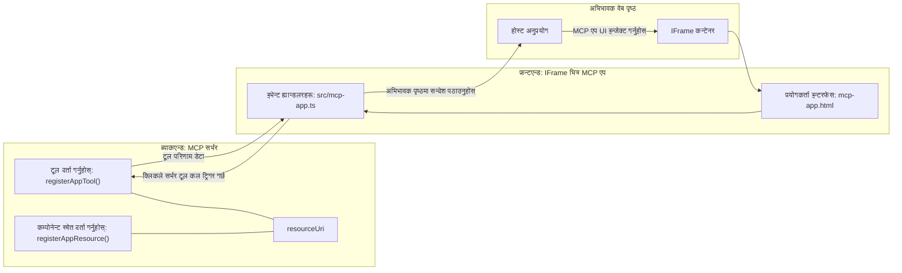
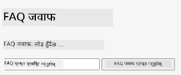
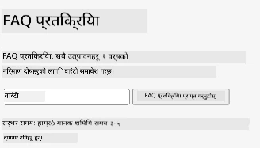
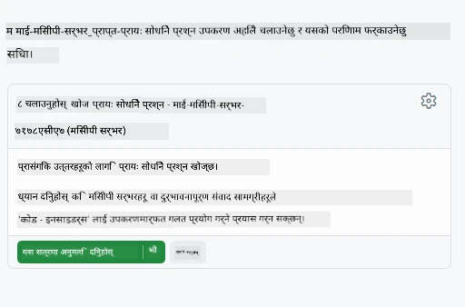
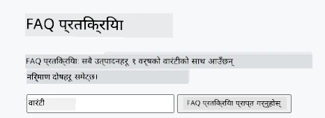

# MCP एप्स

MCP एप्स MCP मा एउटा नयाँ उपाय हो। विचार यस्तो छ कि तपाईं केवल उपकरण कलबाट डेटा फर्काएर मात्र होइन, तपाईंले यो जानकारीसँग कसरी अन्तरक्रिया गर्नुपर्छ भनेर पनि जानकारी प्रदान गर्नुहुन्छ। यसको मतलब उपकरण परिणामहरूले अब UI जानकारी समावेश गर्न सक्छन्। तर हामीलाई किन यो चाहिन्छ? ठीक छ, आज तपाईंले कसरी कार्य गर्नुहुन्छ भन्ने विचार गर्नुहोस्। तपाईं सम्भवतः MCP सर्भरका परिणामहरू उपभोग गर्दै हुनुहुन्छ जसको अगाडि केही प्रकारको फ्रन्टएन्ड राख्ने, त्यो तपाईंले लेख्न र मर्मत गर्नुपर्ने कोड हो। कहिलेकाहीं त्यही तपाईंले चाहनुहुन्छ, तर कहिलेकाहीं यदि तपाईंले यस्तो एउटा अंश ल्याउन सक्नुहुन्थ्यो जुन स्वयंमा पूर्ण हो र जसले डेटादेखि प्रयोगकर्ता इन्टरफेससम्म सबै कुरा समेट्छ भने त्यो राम्रो हुन्थ्यो।

## अवलोकन

यस पाठले MCP एप्समा व्यावहारिक मार्गनिर्देशन प्रदान गर्दछ, यो कसरी सुरू गर्ने र यसलाई तपाईंको विद्यमान वेब एप्समा कसरी एकीकरण गर्ने। MCP एप्स MCP मानकमा एक धेरै नयाँ थप हो।

## सिकाइ उद्देश्यहरू

यस पाठको अन्त्यमा, तपाईं सक्षम हुनुहुनेछ:

- MCP एप्स के हो भनेर व्याख्या गर्न।
- कहिले MCP एप्स प्रयोग गर्ने।
- तपाईंको आफ्नै MCP एप्स बनाउने र एकीकरण गर्ने।

## MCP एप्स - कसरी काम गर्दछ

MCP एप्सको विचार यस्तो छ कि जवाफ मूलतः एक कम्पोनेन्टको रूपमा प्रदान गरिन्छ जुन रेंडर गरिन सक्छ। यस्तो कम्पोनेन्टमा दृष्य र अन्तरक्रियात्मकता दुबै हुन सक्छ, जस्तै बटन क्लिकहरू, प्रयोगकर्ता इनपुट र थप। सर्भर पक्ष र हाम्रो MCP सर्भरबाट सुरु गरौं। MCP एप कम्पोनेन्ट बनाउन तपाईंलाई एउटा उपकरण र साथै एप्लिकेसन स्रोतत्र आवश्यक पर्छ। यी दुई भागहरू resourceUri द्वारा जोडिएका हुन्छन्।

यहाँ एउटा उदाहरण छ। यसमा संलग्न के हुन्छ र कुन भागले के गर्छ भन्ने प्रयास गरौं:

```text
server.ts -- responsible for registering tools and the component as a UI component
src/
  mcp-app.ts -- wiring up event handlers
mcp-app.html -- the user interface
```

यस दृश्यले कम्पोनेन्ट र यसको तर्कका लागि वास्तुकला वर्णन गर्दछ।


अब ब्याकएन्ड र फ्रन्टएन्डको जिम्मेवारीहरू क्रमशः वर्णन गर्ने प्रयास गरौं।

### ब्याकएन्ड

यहाँ दुई कुरा पूरा गर्न आवश्यक छ:

- हामीले अन्तरक्रिया गर्न चाहने उपकरणहरू दर्ता गर्ने।
- कम्पोनेन्ट परिभाषित गर्ने।

**उपकरण दर्ता गर्नुहोस्**

```typescript
registerAppTool(
    server,
    "get-time",
    {
      title: "Get Time",
      description: "Returns the current server time.",
      inputSchema: {},
      _meta: { ui: { resourceUri } }, // यो उपकरणलाई यसको UI स्रोतसँग जोड्दछ
    },
    async () => {
      const time = new Date().toISOString();
      return { content: [{ type: "text", text: time }] };
    },
  );

```

माथिको कोडले व्यवहार वर्णन गर्दछ, जहाँ यसले `get-time` नामको उपकरण प्रदान गर्दछ। यसले कुनै इनपुट लिँदैन तर वर्तमान समय उत्पादन गर्दछ। हामीसँग उपकरणहरूका लागि `inputSchema` परिभाषित गर्ने क्षमता छ जहाँ हामीले प्रयोगकर्ता इनपुट स्वीकार्न सक्नुपर्छ।

**कम्पोनेन्ट दर्ता गर्नुहोस्**

उही फाइलमा, हामीले कम्पोनेन्ट पनि दर्ता गर्नुपर्छ:

```typescript
const resourceUri = "ui://get-time/mcp-app.html";

// स्रोत दर्ता गर्नुहोस्, जुन UI को लागि बन्डल गरिएको HTML/JavaScript फर्काउँछ।
registerAppResource(
  server,
  resourceUri,
  resourceUri,
  { mimeType: RESOURCE_MIME_TYPE },
  async () => {
    const html = await fs.readFile(path.join(DIST_DIR, "mcp-app.html"), "utf-8");

    return {
    contents: [
        { uri: resourceUri, mimeType: RESOURCE_MIME_TYPE, text: html },
    ],
    };
  },
);
```

यहाँ हामीले `resourceUri` उल्लेख गरेको छ जुन कम्पोनेन्टलाई यसको उपकरणहरूसँग जोड्छ। चाखलाग्दो कुरा यो कलब्याक हो जहाँ हामी UI फाइल लोड गर्छौं र कम्पोनेन्ट फर्काउँछौं।

### कम्पोनेन्ट फ्रन्टएन्ड

ब्याकएन्ड जस्तै, यहाँ पनि दुई भागहरू छन्:

- शुद्ध HTML मा लेखिएको फ्रन्टएन्ड।
- घटना सम्हाल्ने र के गर्ने, जस्तै उपकरण कल गर्ने वा पितृ विन्डोलाई सन्देश पठाउने कोड।

**प्रयोगकर्ता इन्टरफेस**

प्रयोगकर्ता इन्टरफेसलाई हेरौं।

```html
<!-- mcp-app.html -->
<!DOCTYPE html>
<html lang="en">
  <head>
    <meta charset="UTF-8" />
    <title>Get Time App</title>
  </head>
  <body>
    <p>
      <strong>Server Time:</strong> <code id="server-time">Loading...</code>
    </p>
    <button id="get-time-btn">Get Server Time</button>
    <script type="module" src="/src/mcp-app.ts"></script>
  </body>
</html>
```

**घटना वायरअप**

अन्तिम भाग घटना वायरअप हो। यसको अर्थ हो हामीले हाम्रो UI को कुन भागले घटना ह्यान्डलरहरू चाहिन्छ र घटनाहरू उठ्दा के गर्ने:

```typescript
// mcp-app.ts

import { App } from "@modelcontextprotocol/ext-apps";

// तत्त्व सन्दर्भहरू प्राप्त गर्नुहोस्
const serverTimeEl = document.getElementById("server-time")!;
const getTimeBtn = document.getElementById("get-time-btn")!;

// एप्लिकेसन उदाहरण सिर्जना गर्नुहोस्
const app = new App({ name: "Get Time App", version: "1.0.0" });

// सर्भरबाट उपकरण परिणामहरू ह्यान्डल गर्नुहोस्। `app.connect()` अघि सेट गर्नुहोस् ताकि
// प्रारम्भिक उपकरण परिणाम गुम्न नजाओस्।
app.ontoolresult = (result) => {
  const time = result.content?.find((c) => c.type === "text")?.text;
  serverTimeEl.textContent = time ?? "[ERROR]";
};

// बटन क्लिक जडान गर्नुहोस्
getTimeBtn.addEventListener("click", async () => {
  // `app.callServerTool()` ले UI लाई सर्भरबाट नयाँ डेटा अनुरोध गर्न अनुमति दिन्छ
  const result = await app.callServerTool({ name: "get-time", arguments: {} });
  const time = result.content?.find((c) => c.type === "text")?.text;
  serverTimeEl.textContent = time ?? "[ERROR]";
});

// होस्टसँग जडान गर्नुहोस्
app.connect();
```

माथिको उदाहरणबाट देख्न सकिन्छ, यो सामान्य कोड हो जुन DOM तत्वहरूलाई घटनासँग जोड्दछ। उल्लेख गर्न लायक कुरा हो `callServerTool` कल जसले अन्ततः ब्याकएन्डमा उपकरण कल गर्दछ।

## प्रयोगकर्ता इनपुटसँग व्यवहार गर्नु

अहिलेसम्म हामीले एउटा कम्पोनेन्ट देख्यौं जसमा एउटा बटन छ र जब क्लिक गरिन्छ तब उपकरण कल गरिन्छ। अब हामी थप UI तत्वहरू, जस्तै इनपुट फिल्ड थप्ने र उपकरणलाई तर्क पठाउने प्रयास गरौं। FAQ कार्यक्षमता लागू गरौं। तरिका यस्तो हुनु पर्नेछ:

- एउटा बटन र एउटा इनपुट तत्व हुनु पर्छ जहाँ प्रयोगकर्ताले खोजीको लागि कुञ्जीशब्द टाइप गर्छ, उदाहरणका लागि "Shipping"। यसले ब्याकएन्डमा उपकरण कल गर्नेछ जसले FAQ डेटामा खोजी गर्दछ।
- एउटा उपकरण जसले उल्लेखित FAQ खोजी समर्थन गर्दछ।

पहिले ब्याकएन्डका लागि आवश्यक समर्थन थपौं:

```typescript
const faq: { [key: string]: string } = {
    "shipping": "Our standard shipping time is 3-5 business days.",
    "return policy": "You can return any item within 30 days of purchase.",
    "warranty": "All products come with a 1-year warranty covering manufacturing defects.",
  }

registerAppTool(
    server,
    "get-faq",
    {
      title: "Search FAQ",
      description: "Searches the FAQ for relevant answers.",
      inputSchema: zod.object({
        query: zod.string().default("shipping"),
      }),
      _meta: { ui: { resourceUri: faqResourceUri } }, // यो उपकरणलाई यसको UI स्रोतसँग लिंक गर्दछ
    },
    async ({ query }) => {
      const answer: string = faq[query.toLowerCase()] || "Sorry, I don't have an answer for that.";
      return { content: [{ type: "text", text: answer }] };
    },
  );
```

यहाँ हामीले `inputSchema` कसरी भर्दैछौं र `zod` स्कीमा जस्तो दिइरहेका छौं हेर्न सकिन्छ:

```typescript
inputSchema: zod.object({
  query: zod.string().default("shipping"),
})
```

माथिको स्कीमामा हामीले एउटा इनपुट प्यारामीटर `query` हो भनेर घोषणा गरेका छौं र यो वैकल्पिक छ र पूर्वनिर्धारित मान "shipping" छ।

अब *mcp-app.html* तिर जाउँ र यो UI कस्तो बनाउनुपर्छ हेर्नुहोस्:

```html
<div class="faq">
    <h1>FAQ response</h1>
    <p>FAQ Response: <code id="faq-response">Loading...</code></p>
    <input type="text" id="faq-query" placeholder="Enter FAQ query" />
    <button id="get-faq-btn">Get FAQ Response</button>
  </div>
```

उत्तम, अब हामीसँग एउटा इनपुट तत्व र बटन छ। अब *mcp-app.ts* मा जाउँ र यी घटनाहरू जोडौं:

```typescript
const getFaqBtn = document.getElementById("get-faq-btn")!;
const faqQueryInput = document.getElementById("faq-query") as HTMLInputElement;

getFaqBtn.addEventListener("click", async () => {
  const query = faqQueryInput.value;
  const result = await app.callServerTool({ name: "get-faq", arguments: { query } });
  const faq = result.content?.find((c) => c.type === "text")?.text;
  faqResponseEl.textContent = faq ?? "[ERROR]";
});
```

माथिको कोडमा हामीले:

- चाखलाग्दा UI तत्वहरूको रेफरेन्सहरू बनाए।
- बटन क्लिक ह्यान्डल गर्‍यौं जसले इनपुट तत्वको मान पार्स गर्छ र हामीले `app.callServerTool()` कल पनि गर्‍यौं जहाँ `name` र `arguments` हुन्छन् र यस्तै `query` सँग मान पास गरिन्छ।

`callServerTool` कल गर्दा वास्तवमा के हुन्छ भने यो सन्देश पितृ विन्डोलाई पठाउँछ र त्यो विन्डोले MCP सर्भर कल गर्दछ।

### प्रयास गर्नुहोस्

यसलाई प्रयास गर्दा हामीले तलका कुरा देख्नुपर्नेछ:



र यहाँ हामीले "warranty" जस्तो इनपुटका साथ प्रयास गर्यौं



यो कोड चलाउन, [कोड सेक्सन](./code/README.md) तिर जानुहोस्।

## Visual Studio Code मा परीक्षण

Visual Studio Code ले MCP एप्सका लागि राम्रो समर्थन प्रदान गर्दछ र सम्भवतः तपाईंको MCP एप्स परीक्षण गर्न सबैभन्दा सजिलो तरिकाहरू मध्ये एक हो। Visual Studio Code प्रयोग गर्न, *mcp.json* मा यसरी एक सर्भर प्रविष्टि थप्नुहोस्:

```json
"my-mcp-server-7178eca7": {
    "url": "http://localhost:3001/mcp",
    "type": "http"
  }
```

पछि सर्भर सुरु गर्नुहोस्, तपाईंलाई का'ट विन्डो मार्फत तपाईंको MVP एपसँग संवाद गर्न सकिन्छ यदि तपाईंले GitHub Copilot स्थापना गर्नुभएको छ भने।

उदाहरणका लागि प्रॉम्प्टद्वारा ट्रिगर गर्दै, जस्तै "#get-faq":



र वेब ब्राउजरमार्फत चलाउँदा जस्तो नै यसले यसरी रेंडर गर्दछ:



## कार्य

एक रक पपर सिजर खेल बनाउनुहोस्। यसले निम्न कुरा समावेश गर्नुपर्छ:

UI:

- विकल्पहरूको साथ ड्रपडाउन सूची
- विकल्प पेश गर्न बटन
- लेबल जुन देखाउँछ कोले के रोज्यो र को जीत्यो

सर्भर:

- एउटा रक पपर सिजर उपकरण जसले "choice" इनपुट लिन्छ। यसले कम्प्युटरको रोजाइ पनि रेंडर गर्नेछ र विजेता निर्धारण गर्नेछ।

## समाधान

[समाधान](./assignment/README.md)

## सारांश

हामीले यो नयाँ MCP एप्स उपाय सिक्यौं। यो नयाँ उपाय हो जसले MCP सर्भरहरूलाई मात्र डेटा होईन तर यो डेटा कसरी प्रदर्शन गरिनु पर्छ भन्ने बारे पनि आफूले राय दिने अनुमति दिन्छ।

थप रूपमा, हामीले सिक्यौं कि यी MCP एप्सहरू IFrame भित्र होस्ट गरिन्छन् र MCP सर्भरहरूसँग संवाद गर्न तिनीहरूले अभिभावक वेब एपलाई सन्देश पठाउन आवश्यक पर्छ। त्यस्ता धेरै पुस्तकालयहरू छन् जुन सामान्य JavaScript, React र अन्य भाषाहरूमा यो संवाद सजिलो बनाउँछन्।

## मुख्य सिकाइ

तपाईंले यो सिक्नु भयो:

- MCP एप्स एउटा नयाँ मानक हो जुन तपाईं डेटा र UI सुविधाहरू दुईटै पठाउन चाहनुहुन्छ भने उपयोगी हुन सक्छ।
- यी प्रकारका एपहरू सुरक्षा कारणले IFrame भित्र चल्छन्।

## के छ अर्को

- [अध्याय ४](../../04-PracticalImplementation/README.md)

---

<!-- CO-OP TRANSLATOR DISCLAIMER START -->
**सूचना**:
यस दस्तावेजलाई एआई अनुवाद सेवा [Co-op Translator](https://github.com/Azure/co-op-translator) प्रयोग गरी अनुवाद गरिएको छ। हामी शुद्धताको लागि प्रयास गर्छौं, तर कृपया बुझ्नुहोस् कि स्वचालित अनुवादमा त्रुटिहरू वा अशुद्धता समावेश हुन सक्छ। मूल दस्तावेज यसको मूल भाषामा मात्र आधिकारिक स्रोत मानिनेछ। महत्वपूर्ण जानकारीका लागि प्राविधिक मानव अनुवाद सिफारिस गरिन्छ। यस अनुवादको प्रयोगबाट उत्पन्न हुने कुनै पनि गलतफहमी वा भ्रमको लागि हामी जिम्मेवार छैनौं।
<!-- CO-OP TRANSLATOR DISCLAIMER END -->