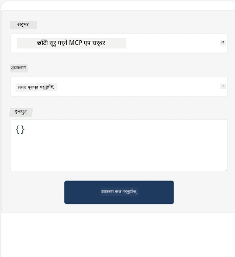
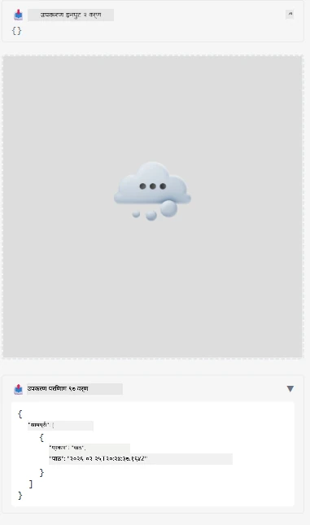

यहाँ MCP एप्लिकेसनलाई प्रदर्शन गर्ने एउटा नमुना छ

## इन्स्टल

1. *mcp-app* फोल्डरमा जानुहोस्
1. `npm install` चलाउनुहोस्, यसले फ्रन्टएण्ड र ब्याकएण्ड निर्भरता स्थापना गर्नुपर्छ

ब्याकएण्ड कम्पाइल हुन्छ कि हुँदैन जाँच्न:

```sh
npx tsc --noEmit
```

सबै ठीक भए कुनै आउटपुट आउँदैन।

## ब्याकएण्ड चलाउनुहोस्

> यदि तपाईं विन्डोज मेसिनमा हुनुहुन्छ भने यसले अलि बढी काम लिन सक्छ किनभने MCP एप समाधानले `concurrently` लाइब्रेरी प्रयोग गर्दछ, जसलाई चलाउन तपाईंले विकल्प खोज्नु पर्छ। यहाँ MCP एपको *package.json* मा त्यही समस्याग्रस्त लाइन छ:

    ```json
    "start": "concurrently \"cross-env NODE_ENV=development INPUT=mcp-app.html vite build --watch\" \"tsx watch main.ts\""
    ```

यस एपमा दुई भागहरू हुन्छन्, एउटा ब्याकएण्ड भाग र अर्को होस्ट भाग।

ब्याकएण्ड सुरुवात गर्न:

```sh
npm start
```

यसले `http://localhost:3001/mcp` मा ब्याकएण्ड सुरु गर्नु पर्छ।

> नोट गर्नुहोस्, यदि तपाईं Codespace मा हुनुहुन्छ भने, पोर्ट दृश्यता सार्वजनिकमा राख्न आवश्यक पर्न सक्छ। ब्राउजरमा https://<name of Codespace>.app.github.dev/mcp मार्फत अन्त्यबिन्दुमा पुग्न सकिन्छ कि छैन जाँच्नुहोस्।

## विकल्प -1 Visual Studio Code मा एप टेस्ट गर्नुहोस्

Visual Studio Code मा समाधान टेस्ट गर्न, तलका कार्यहरु गर्नुहोस्:

- `mcp.json` मा सर्भर इन्ट्री थप्नुहोस् यसरी:

    ```json
    {
        "servers": {
            "my-mcp-server-7178eca7": {
                "url": "http://localhost:3001/mcp",
                "type": "http"
            }
        },
        "inputs": []
    }
    ```

1. *mcp.json* मा "start" बटन क्लिक गर्नुहोस्
1. पक्का गर्नुहोस् कि च्याट विन्डो खुलेको छ र `get-faq` टाइप गर्नुहोस्, तपाईंलाई यस्तो परिणाम देखिनु पर्छ:

    

## विकल्प -2- होस्टसँग एप टेस्ट गर्नुहोस्

репो <https://github.com/modelcontextprotocol/ext-apps> मा विभिन्न होस्टहरू छन् जसलाई तपाईंले तपाईँको MVP एपहरू टेस्ट गर्न प्रयोग गर्न सक्नुहुन्छ।

यहाँ हामी तपाईंलाई दुई विकल्प प्रस्तुत गर्नेछौं:

### स्थानीय मेसिन

- रिपो क्लोन गरेपछि *ext-apps* मा जानुहोस्।

- निर्भरता इन्स्टल गर्नुहोस्

   ```sh
   npm install
   ```

- अर्को टर्मिनल विन्डोमा, *ext-apps/examples/basic-host* मा जानुहोस्

    > यदि तपाईं Codespace मा हुनुहुन्छ भने, serve.ts फाइलको लाइन 27 मा जानुहोस् र http://localhost:3001/mcp लाई तपाईंको Codespace URL सँग प्रतिस्थापन गर्नुहोस्, जस्तै https://psychic-xylophone-657rpjgvxpc5g64-3001.app.github.dev/mcp

- होस्ट चलाउनुहोस्:

    ```sh
    npm start
    ```

    यसले होस्टलाई ब्याकएण्डसँग जडान गर्नुपर्छ र तपाईंलाई एप चलिरहेको देखिनु पर्छ यसैगरी:

    

### Codespace

Codespace वातावरण काम गर्न अलि बढी मेहनत लाग्छ। Codespace मार्फत होस्ट प्रयोग गर्न:

- *ext-apps* निर्देशिकामा जानुहोस् र *examples/basic-host* मा जानुहोस्।
- निर्भरता इन्स्टल गर्न `npm install` चलाउनुहोस्
- होस्ट सुरु गर्न `npm start` चलाउनुहोस्।

## एप टेस्ट गर्नुहोस्

एप यसरी प्रयास गर्नुहोस्:

- "Call Tool" बटन चयन गर्नुहोस् र तपाईंले यसरी परिणामहरू देख्नु पर्छ:

    

सर्वोत्तम, सबै ठीक काम गर्दैछ।

---

<!-- CO-OP TRANSLATOR DISCLAIMER START -->
**अस्वीकरण**:
यो दस्तावेज़ एआई अनुवाद सेवा [Co-op Translator](https://github.com/Azure/co-op-translator) प्रयोग गरी अनुवाद गरिएको हो। हामी शुद्धताको लागि प्रयास गर्छौं, तथापि स्वचालित अनुवादमा त्रुटि वा गल्तीहरू हुन सक्ने हुनाले कृपया ध्यान दिनुहोस्। मूल दस्तावेज़ यसको मूल भाषामा नै प्रामाणिक स्रोत मानिनेछ। महत्वपूर्ण जानकारीका लागि व्यावसायिक मानव अनुवादको सिफारिश गरिन्छ। यस अनुवादको प्रयोगबाट उत्पन्न हुने कुनै पनि गलत बुझाइ वा व्याख्याका लागि हामी जिम्मेवार छैनौं।
<!-- CO-OP TRANSLATOR DISCLAIMER END -->