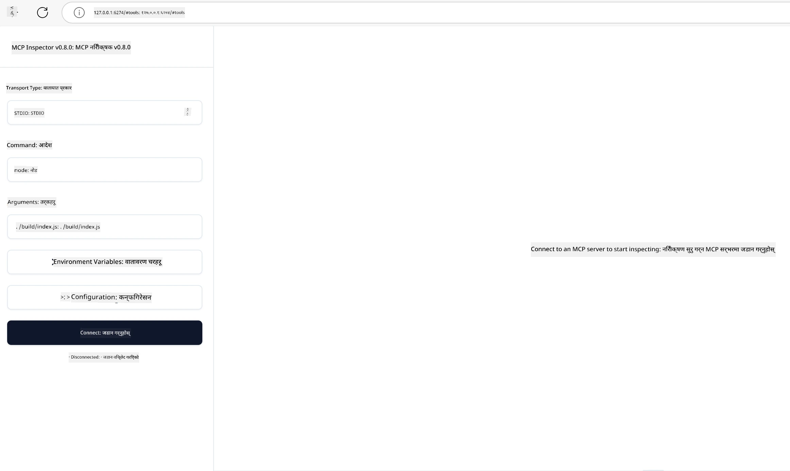

# व्यावहारिक कार्यान्वयन

[](https://youtu.be/vCN9-mKBDfQ)

_(यस पाठको भिडियो हेर्न माथिको छवि क्लिक गर्नुहोस्)_

व्यावहारिक कार्यान्वयन त्यही ठाउँ हो जहाँ मोडेल सन्दर्भ प्रोटोकल (MCP) को शक्ति अनुभवात्मक हुन्छ। MCP को सिद्धांत र वास्तुकलाको बुझाइ महत्वपूर्ण भए तापनि, वास्तविक मान तब आउँछ जब तपाईं यी अवधारणाहरूलाई वास्तविक संसारका समस्याहरू समाधान गर्नका लागि समाधानहरू निर्माण, परीक्षण, र परिनियोजन गर्न प्रयोग गर्नुहुन्छ। यो अध्याय वैचारिक ज्ञान र व्यावहारिक विकास बीचको दूरी कटौती गर्दछ, तपाईलाई MCP-आधारित अनुप्रयोगहरूलाई जीवनमा ल्याउने प्रक्रियामा मार्गदर्शन गर्दछ।

तपाईं बुद्धिमान सहायकहरू विकास गर्दै हुनुहुन्छ, व्यवसायिक वर्कफ्लोहरूमा AI एकीकृत गर्दै हुनुहुन्छ, वा डाटा प्रशोधनका लागि अनुकूल उपकरणहरू निर्माण गर्दै हुनुहुन्छ भने पनि, MCP ले लचीला आधार प्रदान गर्दछ। यसको भाषा-स्वतन्त्र डिजाइन र लोकप्रिय प्रोग्रामिङ भाषाहरूको लागि आधिकारिक SDK हरूले यसलाई विभिन्न विकासकर्ताहरूका लागि पहुँचयोग्य बनाएको छ। यी SDK हरू प्रयोग गरेर, तपाईं छिटो प्रोटोटाइप बनाउन, पुनरावृत्ति गर्न, र विभिन्न प्लेटफर्म र वातावरणहरूमा समाधानहरू विस्तार गर्न सक्नुहुन्छ।

पछिल्ला खण्डहरूमा, तपाईंले व्यावहारिक उदाहरणहरू, नमूना कोड, र परिनियोजन रणनीतिहरू पाउनुहुनेछ जुन C#, Java with Spring, TypeScript, JavaScript, र Python मा MCP कसरी कार्यान्वयन गर्ने देखाउँछन्। तपाईंले MCP सर्भरहरूलाई कसरी डिबग र परीक्षण गर्ने, API हरू व्यवस्थापन गर्ने, र Azure प्रयोग गरेर क्लाउडमा समाधानहरू परिनियोजन गर्ने सिक्नुहुनेछ। यी व्यावहारिक स्रोतहरू तपाईंको सिकाइलाई तीव्र बनाउन र भरपर्दो, उत्पादन तयारी MCP अनुप्रयोगहरू आत्मविश्वासका साथ निर्माण गर्न मद्दत गर्न डिजाइन गरिएका छन्।

## अवलोकन

यो पाठले विभिन्न प्रोग्रामिङ भाषाहरूमा MCP कार्यान्वयनका व्यावहारिक पक्षहरूमा केन्द्रित छ। हामी C#, Java with Spring, TypeScript, JavaScript, र Python मा MCP SDK हरू कसरी प्रयोग गर्ने, MCP सर्भरहरूलाई डिबग र परीक्षण गर्ने, र पुन: प्रयोगयोग्य स्रोतहरू, प्रॉम्प्टहरू, र उपकरणहरू कसरी सिर्जना गर्ने अन्वेषण गर्नेछौं।

## सिकाइ लक्ष्यहरू

यस पाठको अन्त्यसम्म, तपाईं सक्षम हुनुहुनेछ:

- विभिन्न प्रोग्रामिङ भाषाहरूमा आधिकारिक SDK प्रयोग गरी MCP समाधानहरू कार्यान्वयन गर्न
- MCP सर्भरहरूलाई प्रणालीगत रूपमा डिबग र परीक्षण गर्न
- सर्भर सुविधाहरू (स्रोतहरू, प्रॉम्प्टहरू, र उपकरणहरू) सिर्जना र प्रयोग गर्न
- जटिल कार्यहरूका लागि प्रभावकारी MCP वर्कफ्लोज डिजाइन गर्न
- प्रदर्शन र विश्वासिलताको लागि MCP कार्यान्वयनहरू अनुकूलन गर्न

## आधिकारिक SDK स्रोतहरू

मोडेल सन्दर्भ प्रोटोकलले विभिन्न भाषाहरूका लागि आधिकारिक SDK हरू प्रदान गर्दछ ([MCP विनिर्देश 2025-11-25](https://spec.modelcontextprotocol.io/specification/2025-11-25/) सँग मिलेर):

- [C# SDK](https://github.com/modelcontextprotocol/csharp-sdk)
- [Java with Spring SDK](https://github.com/modelcontextprotocol/java-sdk) **सूचना:** यसका लागि [Project Reactor](https://projectreactor.io) मा निर्भरता आवश्यक छ। (हेर्नुहोस् [चर्चा मुद्दा २४६](https://github.com/orgs/modelcontextprotocol/discussions/246).)
- [TypeScript SDK](https://github.com/modelcontextprotocol/typescript-sdk)
- [Python SDK](https://github.com/modelcontextprotocol/python-sdk)
- [Kotlin SDK](https://github.com/modelcontextprotocol/kotlin-sdk)
- [Go SDK](https://github.com/modelcontextprotocol/go-sdk)

## MCP SDK हरूसँग काम गर्ने

यस खण्डले विभिन्न प्रोग्रामिङ भाषाहरूमा MCP कार्यान्वयनका व्यावहारिक उदाहरणहरू प्रदान गर्दछ। तपाईं `samples` डाइरेक्टरीमा भाषाअनुसार व्यवस्थित नमूना कोडहरू पाउन सक्नुहुन्छ।

### उपलब्ध नमूनाहरू

यो रिपोजिटोरीमा निम्न भाषाहरूमा [नमूना कार्यान्वयनहरू](../../../04-PracticalImplementation/samples) समावेश छन्:

- [C#](./samples/csharp/README.md)
- [Java with Spring](./samples/java/containerapp/README.md)
- [TypeScript](./samples/typescript/README.md)
- [JavaScript](./samples/javascript/README.md)
- [Python](./samples/python/README.md)

प्रत्येक नमूनाले उक्त भाषा र यसका पारिस्थितिकी तन्त्रका लागि MCP का मुख्य अवधारणाहरू र कार्यान्वयन ढाँचाहरू देखाउँछ।

### व्यावहारिक मार्गनिर्देशनहरू

अतिरिक्त मार्गनिर्देशनहरू MCP को व्यावहारिक कार्यान्वयनका लागि:

- [पेजिनेशन र ठूलो परिणाम सेटहरू](./pagination/README.md) - उपकरणहरू, स्रोतहरू, र ठूलो डेटासेटहरूका लागि कर्सर-आधारित पेजिनेशन सम्हाल्न

## मूल सर्भर सुविधाहरू

MCP सर्भरहरूले यी सुविधाहरू संयोजनका रूपमा कार्यान्वयन गर्न सक्छन्:

### स्रोतहरू

स्रोतहरूले प्रयोगकर्ता वा AI मोडेलले प्रयोग गर्न सन्दर्भ र डाटा प्रदान गर्छन्:

- कागजात संग्रहहरू
- ज्ञान आधारहरू
- संरचित डाटा स्रोतहरू
- फाइल प्रणालीहरू

### प्रॉम्प्टहरू

प्रॉम्प्टहरू प्रयोगकर्ताका लागि टेम्पलेट गरिएको सन्देशहरू र वर्कफ्लोज हुन्:

- पूर्व-निर्धारित संवाद ढाँचाहरू
- निर्देशित अन्तरक्रिया ढाँचाहरू
- विशेषीकृत संवाद संरचनाहरू

### उपकरणहरू

उपकरणहरू AI मोडेलले कार्यान्वयन गर्न प्रयोग गर्ने कार्यहरू हुन्:

- डाटा प्रशोधन युटिलिटिज़हरू
- बाह्य API एकीकरणहरू
- गणनात्मक क्षमता
- खोज कार्यक्षमता

## नमूना कार्यान्वयन: C# कार्यान्वयन

आधिकारिक C# SDK रिपोजिटोरीमा MCP का विभिन्न पक्षहरू देखाउने धेरै नमूना कार्यान्वयनहरू समावेश छन्:

- **मूल MCP क्लाइन्ट**: MCP क्लाइन्ट कसरी बनाउन र उपकरणहरू कसरी कल गर्ने सरल उदाहरण
- **मूल MCP सर्भर**: आधारभूत उपकरण दर्तासहित न्यूनतम सर्भर कार्यान्वयन
- **उन्नत MCP सर्भर**: उपकरण दर्ता, प्रमाणीकरण, र त्रुटि व्यवस्थापन सहित पूर्ण-विशेषताहरू भएको सर्भर
- **ASP.NET एकीकरण**: ASP.NET कोरसँगको एकीकरण देखाउने उदाहरणहरू
- **उपकरण कार्यान्वयन ढाँचाहरू**: विभिन्न जटिलताको उपकरणहरू कार्यान्वयन गर्न विविध ढाँचाहरू

MCP C# SDK पूर्वावलोकनमा छ र API हरू बदलिन सक्छन्। SDK विकाससँगै हामी यो ब्लग निरन्तर अपडेट गर्नेछौं।

### मुख्य सुविधाहरू

- [C# MCP Nuget ModelContextProtocol](https://www.nuget.org/packages/ModelContextProtocol)
- तपाईँको [पहिलो MCP सर्भर निर्माण गर्ने](https://devblogs.microsoft.com/dotnet/build-a-model-context-protocol-mcp-server-in-csharp/) तरिका।

पूर्ण C# कार्यान्वयन नमूनाहरू हेर्न, कृपया [आधिकारिक C# SDK नमूना रिपोजिटोरी](https://github.com/modelcontextprotocol/csharp-sdk) भ्रमण गर्नुहोस्।

## नमूना कार्यान्वयन: Java with Spring कार्यान्वयन

Java with Spring SDK ले उद्यम-स्तर सुविधाहरू सहित मजबुत MCP कार्यान्वयन विकल्पहरू प्रदान गर्दछ।

### मुख्य सुविधाहरू

- Spring Framework एकीकरण
- बलियो प्रकार सुरक्षा
- प्रतिक्रियाशील प्रोग्रामिङ समर्थन
- व्यापक त्रुटि व्यवस्थापन

पूर्ण Java with Spring कार्यान्वयन नमूनाको लागि, नमूना डाइरेक्टरीमा [Java with Spring नमूना](samples/java/containerapp/README.md) हेर्नुहोस्।

## नमूना कार्यान्वयन: JavaScript कार्यान्वयन

JavaScript SDK ले MCP कार्यान्वयनका लागि हल्का र लचिलो दृष्टिकोण प्रदान गर्दछ।

### मुख्य सुविधाहरू

- Node.js र ब्राउजर समर्थन
- प्रत्याशित-आधारित API
- Express र अन्य फ्रेमवर्कहरूसँग सजिलो एकीकरण
- स्ट्रिमिङका लागि WebSocket समर्थन

पूर्ण JavaScript कार्यान्वयन नमूनाको लागि, नमूना डाइरेक्टरीमा [JavaScript नमूना](samples/javascript/README.md) हेर्नुहोस्।

## नमूना कार्यान्वयन: Python कार्यान्वयन

Python SDK ले उत्कृष्ट ML फ्रेमवर्क एकीकरणहरूसँग Pythonic दृष्टिकोण प्रदान गर्दछ।

### मुख्य सुविधाहरू

- asyncio संग Async/await समर्थन
- FastAPI एकीकरण``
- साधारण उपकरण दर्ता
- लोकप्रिय ML पुस्तकालयहरूसँग मूल एकीकरण

पूर्ण Python कार्यान्वयन नमूनाको लागि, नमूना डाइरेक्टरीमा [Python नमूना](samples/python/README.md) हेर्नुहोस्।

## API व्यवस्थापन

Azure API व्यवस्थापन एक उत्कृष्ट उत्तर हो MCP सर्भरहरूको सुरक्षा कसरी गर्ने भन्ने प्रश्नको। विचार यो हो कि तपाईँको MCP सर्भरको अगाडि Azure API व्यवस्थापन इन्स्ट्यान्स राख्नुहोस् र यसलाई आवश्यक सुविधाहरू जस्तै:

- दर सीमितीकरण
- टोकन व्यवस्थापन
- अनुगमन
- load balancing
- सुरक्षा

सम्हाल्न दिनुहोस्।

### Azure नमूना

यहाँ Azure नमूना छ जुन ठीक त्यही गर्छ, अर्थात् [MCP सर्भर सिर्जना गर्ने र Azure API व्यवस्थापनसँग सुरक्षित गर्ने](https://github.com/Azure-Samples/remote-mcp-apim-functions-python)।

तलको चित्रमा प्राधिकरण प्रवाह कसरी हुन्छ हेर्नुहोस्:


अघिल्लो चित्रमा निम्न कुरा हुन्छ:

- Microsoft Entra प्रयोग गरी प्रमाणीकरण/प्राधिकरण हुन्छ।
- Azure API व्यवस्थापनले गेटवेको रूपमा कार्य गर्दछ र नीतिहरू प्रयोग गरी ट्राफिक निर्देशन र व्यवस्थापन गर्दछ।
- Azure Monitor ले विश्लेषणको लागि सबै अनुरोधहरू लग गर्दछ।

#### प्राधिकरण प्रवाह

प्राधिकरण प्रवाहलाई विस्तृत रूपमा हेर्नुहोस्:


#### MCP प्राधिकरण विनिर्देशन

[MCP प्राधिकरण विनिर्देशन](https://spec.modelcontextprotocol.io/specification/2025-11-25/basic/authorization/) बारे थप जान्नुहोस्।

## रिमोट MCP सर्भर Azure मा परिनियोजन गर्ने

हामीले पहिले चर्चा गरिसकेको नमूनालाई परिनियोजन गर्न सक्छौं कि छैनौं हेर्नुहोस्:

1. रिपो क्लोन गर्नुहोस्

    ```bash
    git clone https://github.com/Azure-Samples/remote-mcp-apim-functions-python.git
    cd remote-mcp-apim-functions-python
    ```

1. `Microsoft.App` स्रोत प्रदायक दर्ता गर्नुहोस्।

   - यदि तपाईं Azure CLI प्रयोग गर्दै हुनुहुन्छ भने, `az provider register --namespace Microsoft.App --wait` चलाउनुहोस्।
   - यदि तपाईं Azure PowerShell प्रयोग गर्दै हुनुहुन्छ भने, `Register-AzResourceProvider -ProviderNamespace Microsoft.App` चलाउनुहोस्। केही समयपछि दर्ता पूरा भयो कि छैन जाँच गर्न `(Get-AzResourceProvider -ProviderNamespace Microsoft.App).RegistrationState` चलाउनुहोस्।

1. यो [azd](https://aka.ms/azd) आदेश चलाउनुहोस् जसले API व्यवस्थापन सेवा, फङ्क्शन एप (कोडसहित), र अन्य आवश्यक Azure स्रोतहरू provision गर्नेछ

    ```shell
    azd up
    ```

    यसले सबै क्लाउड स्रोतहरू Azure मा परिनियोजन गर्नुपर्नेछ।

### MCP Inspector सँग तपाईँको सर्भर परीक्षण गर्ने

1. **नयाँ टर्मिनल विन्डो** मा MCP Inspector इन्स्टल गरी चलाउनुहोस्

    ```shell
    npx @modelcontextprotocol/inspector
    ```

    तपाईँले यस्तै अन्तरफलक देख्नुहुनेछ:

    

1. URL द्वारा देखाइएको MCP Inspector वेब एप (जस्तै [http://127.0.0.1:6274/#resources](http://127.0.0.1:6274/#resources)) खोल्न CTRL क्लिक गर्नुहोस्
1. यातायात प्रकार `SSE` सेट गर्नुहोस्
1. तपाईं चलाइरहेको API व्यवस्थापन SSE अन्तबिन्दु URL सेट गर्नुहोस् जुन `azd up` पछि देखिन्छ र **Connect** गर्नुहोस्:

    ```shell
    https://<apim-servicename-from-azd-output>.azure-api.net/mcp/sse
    ```

1. **List Tools**। कुनै उपकरणमा क्लिक गरी **Run Tool** गर्नुहोस्।  

यदि सबै चरणहरू सफल भए, तपाईं MCP सर्भरसँग जडान हुनुभएको छ र उपकरण कल गर्न सक्नु भएको छ।

## Azure का लागि MCP सर्भरहरू

[Remote-mcp-functions](https://github.com/Azure-Samples/remote-mcp-functions-dotnet): यी रिपोजिटोरीहरू Python, C# .NET वा Node/TypeScript प्रयोग गरेर Azure Functions मार्फत कस्टम रिमोट MCP सर्भरहरू निर्माण र परिनियोजन गर्नको लागि क्विकस्टार्ट टेम्प्लेट हुन्।

नमूनाहरूले विकासकर्ताहरूलाई पूर्ण समाधान प्रदान गर्दछ जसले अनुमति दिन्छ:

- स्थानीय रूपमा निर्माण र चलाउनुहोस्: स्थानीय मेसिनमा MCP सर्भर विकास र डिबग गर्नुहोस्
- Azure मा परिनियोजन गर्नुहोस्: सरल azd up आदेश प्रयोग गरेर क्लाउडमा सजिलै परिनियोजन गर्नुहोस्
- क्लाइन्टहरूबाट जडान हुनुहोस्: MCP सर्भरसँग विभिन्न क्लाइन्टहरू, जस्तै VS Code को Copilot एजेन्ट मोड र MCP Inspector उपकरणबाट जडान गर्नुहोस्

### मुख्य सुविधाहरू

- डिजाईनले सुरक्षा: MCP सर्भर कुञ्जीहरू र HTTPS प्रयोग गरी सुरक्षित गरिएको छ
- प्रमाणीकरण विकल्पहरू: इनबिल्ट प्रमाणीकरण र/वा API व्यवस्थापन प्रयोग गरी OAuth समर्थन
- नेटवर्क पृथकीकरण: Azure भर्चुअल नेटवर्क (VNET) प्रयोग गरी नेटवर्क पृथकीकरण अनुमति
- सर्वररहित वास्तुकला: स्केलेबल, इभेन्ट-चालित कार्यान्वयनका लागि Azure Functions को उपयोग
- स्थानीय विकास: व्यापक स्थानीय विकास र डिबग समर्थन
- सरल परिनियोजन: Azure मा सहज परिनियोजन प्रक्रिया

यो रिपोजिटोरीमा सबै आवश्यक कन्फिगरेसन फाइलहरू, श्रोत कोड, र पूर्वाधार परिभाषाहरूहरू समावेश छन् जसले तपाईँलाई उत्पादन-मैत्री MCP सर्भर कार्यान्वयन छिटो शुरू गर्न अनुमति दिन्छ।

- [Azure Remote MCP Functions Python](https://github.com/Azure-Samples/remote-mcp-functions-python) - Python सहित Azure Functions प्रयोग गरी MCP को नमूना कार्यान्वयन

- [Azure Remote MCP Functions .NET](https://github.com/Azure-Samples/remote-mcp-functions-dotnet) - C# .NET सहित Azure Functions प्रयोग गरी MCP को नमूना कार्यान्वयन

- [Azure Remote MCP Functions Node/Typescript](https://github.com/Azure-Samples/remote-mcp-functions-typescript) - Node/TypeScript सहित Azure Functions प्रयोग गरी MCP को नमूना कार्यान्वयन।

## मुख्य शिर्षकहरू

- MCP SDK हरूले मजबुत MCP समाधानहरू कार्यान्वयनका लागि भाषा-विशिष्ट उपकरणहरू प्रदान गर्दछन्
- डिबग र परीक्षण प्रक्रिया भरपर्दो MCP अनुप्रयोगहरूका लागि महत्वपूर्ण छ
- पुनरावृत्त प्रयोगयोग्य प्रॉम्प्ट टेम्प्लेटहरूले AI अन्तरक्रियाहरूलाई निरन्तरता दिन सक्षम बनाउँछन्
- राम्रो डिजाइन गरिएका वर्कफ्लोजले एकाधिक उपकरणहरू प्रयोग गरेर जटिल कार्यहरू आयोजन गर्न सक्छन्
- MCP समाधानहरू कार्यान्वयन गर्दा सुरक्षा, प्रदर्शन, र त्रुटि व्यवस्थापनमा विचार गर्नु आवश्यक हुन्छ

## अभ्यास

तपाईंको बिषय क्षेत्रमा एक वास्तविक समस्या समाधान गर्ने व्यावहारिक MCP वर्कफ्लो डिजाइन गर्नुहोस्:

1. यस समस्याको समाधानका लागि उपयोगी हुन सक्ने 3-4 उपकरणहरू पहिचान गर्नुहोस्
2. यी उपकरणहरू कसरी अन्तरक्रिया गर्छन् देखाउँदै एक वर्कफ्लो आरेख सिर्जना गर्नुहोस्
3. तपाईँको रोजाइको भाषामा ती मध्ये एउटा उपकरणको आधारभूत संस्करण कार्यान्वयन गर्नुहोस्
4. मोडेललाई तपाईँको उपकरण प्रभावकारी ढंगले प्रयोग गर्न सहयोग गर्ने प्रॉम्प्ट टेम्प्लेट सिर्जना गर्नुहोस्

## अतिरिक्त स्रोतहरू

---

## के हुँदैछ

अर्को: [उन्नत विषयवस्तुहरू](../05-AdvancedTopics/README.md)

---

<!-- CO-OP TRANSLATOR DISCLAIMER START -->
**अस्वीकरण**:
यस दस्तावेजलाई AI अनुवाद सेवा [Co-op Translator](https://github.com/Azure/co-op-translator) प्रयोग गरी अनुवाद गरिएको छ। हामी शुद्धताका लागि प्रयासरत छन्, तर कृपया बुझ्नुहोस् कि स्वचालित अनुवादमा त्रुटिहरु वा अशुद्धिहरु हुन सक्छन्। मूल दस्तावेज यसको मूल भाषामा अधिकारिक स्रोतको रूपमा मानिनु पर्छ। महत्वपूर्ण जानकारीका लागि पेशेवर मानवीय अनुवाद सिफारिस गरिन्छ। यस अनुवादको प्रयोगबाट उत्पन्न भएका कुनै पनि गलतफहमी वा गलत व्याख्याहरूको लागि हामी जिम्मेवार छैनौं।
<!-- CO-OP TRANSLATOR DISCLAIMER END -->