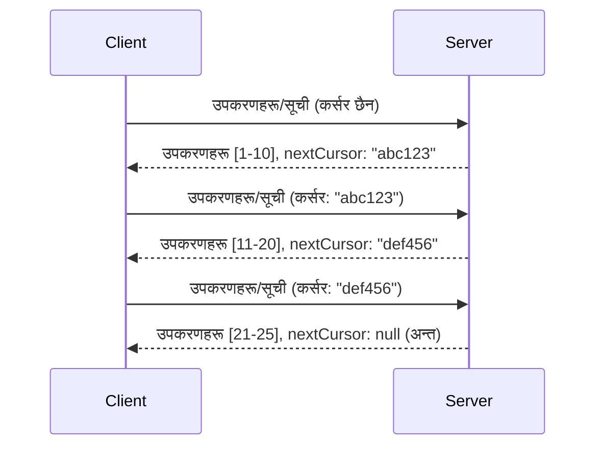

# MCP मा पृष्ठांकन र ठूलो परिणाम सेटहरू

जब तपाईंको MCP सर्भरले ठूलो डेटासेटहरू संचालन गर्दछ - हजारौं फाइलहरू, डाटाबेस रेकर्डहरू, वा खोज परिणामहरूको सूची बनाउँदा - तपाईंले मेमोरीलाई प्रभावकारी ढंगले व्यवस्थापन गर्न र उत्तरदायी प्रयोगकर्ता अनुभवहरू प्रदान गर्न पृष्ठांकन आवश्यक हुन्छ। यो मार्गदर्शिकाले MCP मा पृष्ठांकन कसरी लागू गर्ने र प्रयोग गर्ने कुरा समेट्छ।

## पृष्ठांकन किन आवश्यक छ

पृष्ठांकनबिना, ठूला प्रतिक्रियाहरूले निम्न समस्या ल्याउन सक्छन्:

- **मेमोरी समाप्ति** - एकैपटक लाखौं रेकर्डहरू लोड गर्नु
- **धीमी प्रतिक्रिया समय** - सबै डाटा लोड नहुँदासम्म प्रयोगकर्ताहरू इंतजार गर्छन्
- **समय सीमा त्रुटि** - अनुरोधहरूले समय सीमा सीमा पार गर्छन्
- **निराशाजनक AI प्रदर्शन** - LLM हरू विशाल सन्दर्भसँग जुध्न सक्दैनन्

MCP ले नतिजा सेटहरू मार्फत भरपर्दो, निरन्तर पृष्ठांकनका लागि **कर्सर-आधारित पृष्ठांकन** प्रयोग गर्छ।

---

## MCP पृष्ठांकन कसरी काम गर्छ

### कर्सर अवधारणा

एक **कर्सर** एक अस्पष्ट स्ट्रिङ हो जुन तपाईंको स्थिति नतिजा सेटमा चिन्ह लगाउँछ। यसलाई लामो किताबमा बुकमार्क जस्तै सोच्नुहोस्।



### MCP मेथडहरूमा पृष्ठांकन

यी MCP मेथडहरूले पृष्ठांकन समर्थन गर्छन्:

| मेथड | फर्काउँछ | कर्सर समर्थन |
|--------|---------|----------------|
| `tools/list` | उपकरण परिभाषाहरू | ✅ |
| `resources/list` | स्रोत परिभाषाहरू | ✅ |
| `prompts/list` | प्राम्प्ट परिभाषाहरू | ✅ |
| `resources/templates/list` | स्रोत टेम्प्लेटहरू | ✅ |

---

## सर्भर कार्यान्वयन

### पाइथन (FastMCP)

```python
from mcp.server import Server
from mcp.types import Tool, ListToolsResult
import math

app = Server("paginated-server")

# नक्कली ठूलो डेटा सेट
ALL_TOOLS = [
    Tool(name=f"tool_{i}", description=f"Tool number {i}", inputSchema={})
    for i in range(100)
]

PAGE_SIZE = 10

@app.list_tools()
async def list_tools(cursor: str | None = None) -> ListToolsResult:
    """List tools with pagination support."""
    
    # सुरुमा सूचकाङ्क पाउन कर्सर डिकोड गर्नुहोस्
    start_index = 0
    if cursor:
        try:
            start_index = int(cursor)
        except ValueError:
            start_index = 0
    
    # परिणामहरूको पृष्ठ प्राप्त गर्नुहोस्
    end_index = min(start_index + PAGE_SIZE, len(ALL_TOOLS))
    page_tools = ALL_TOOLS[start_index:end_index]
    
    # अर्को कर्सर गणना गर्नुहोस्
    next_cursor = None
    if end_index < len(ALL_TOOLS):
        next_cursor = str(end_index)
    
    return ListToolsResult(
        tools=page_tools,
        nextCursor=next_cursor
    )
```

### टाइपस्क्रिप्ट

```typescript
import { Server } from "@modelcontextprotocol/sdk/server/index.js";
import { ListToolsResultSchema } from "@modelcontextprotocol/sdk/types.js";

const server = new Server({
  name: "paginated-server",
  version: "1.0.0"
});

// अनुकरण गरिएको ठूलो डाटासेट
const ALL_TOOLS = Array.from({ length: 100 }, (_, i) => ({
  name: `tool_${i}`,
  description: `Tool number ${i}`,
  inputSchema: { type: "object", properties: {} }
}));

const PAGE_SIZE = 10;

server.setRequestHandler(ListToolsResultSchema, async (request) => {
  // कर्सर डिकोड गर्नुहोस्
  let startIndex = 0;
  if (request.params?.cursor) {
    startIndex = parseInt(request.params.cursor, 10) || 0;
  }
  
  // परिणामहरूको पृष्ठ प्राप्त गर्नुहोस्
  const endIndex = Math.min(startIndex + PAGE_SIZE, ALL_TOOLS.length);
  const pageTools = ALL_TOOLS.slice(startIndex, endIndex);
  
  // अर्को कर्सर गणना गर्नुहोस्
  const nextCursor = endIndex < ALL_TOOLS.length ? String(endIndex) : undefined;
  
  return {
    tools: pageTools,
    nextCursor
  };
});
```

### जाभा (Spring MCP)

```java
@Service
public class PaginatedToolService {
    
    private static final int PAGE_SIZE = 10;
    private final List<Tool> allTools;
    
    public PaginatedToolService() {
        // ठूलो डाटासेट सुरु गर्नुहोस्
        this.allTools = IntStream.range(0, 100)
            .mapToObj(i -> new Tool("tool_" + i, "Tool number " + i, Map.of()))
            .collect(Collectors.toList());
    }
    
    @McpMethod("tools/list")
    public ListToolsResult listTools(@Param("cursor") String cursor) {
        // कर्सर डिकोड गर्नुहोस्
        int startIndex = 0;
        if (cursor != null && !cursor.isEmpty()) {
            try {
                startIndex = Integer.parseInt(cursor);
            } catch (NumberFormatException e) {
                startIndex = 0;
            }
        }
        
        // परिणामहरूको पृष्ठ प्राप्त गर्नुहोस्
        int endIndex = Math.min(startIndex + PAGE_SIZE, allTools.size());
        List<Tool> pageTools = allTools.subList(startIndex, endIndex);
        
        // अर्को कर्सर गणना गर्नुहोस्
        String nextCursor = endIndex < allTools.size() ? String.valueOf(endIndex) : null;
        
        return new ListToolsResult(pageTools, nextCursor);
    }
}
```

---

## क्लाइन्ट कार्यान्वयन

### पाइथन क्लाइन्ट

```python
from mcp import ClientSession

async def get_all_tools(session: ClientSession) -> list:
    """Fetch all tools using pagination."""
    all_tools = []
    cursor = None
    
    while True:
        result = await session.list_tools(cursor=cursor)
        all_tools.extend(result.tools)
        
        if result.nextCursor is None:
            break
        cursor = result.nextCursor
    
    return all_tools

# प्रयोग गर्ने तरिका
async with client_session as session:
    tools = await get_all_tools(session)
    print(f"Found {len(tools)} tools")
```

### टाइपस्क्रिप्ट क्लाइन्ट

```typescript
import { Client } from "@modelcontextprotocol/sdk/client/index.js";

async function getAllTools(client: Client): Promise<Tool[]> {
  const allTools: Tool[] = [];
  let cursor: string | undefined = undefined;
  
  do {
    const result = await client.listTools({ cursor });
    allTools.push(...result.tools);
    cursor = result.nextCursor;
  } while (cursor);
  
  return allTools;
}

// प्रयोग गर्ने तरिका
const tools = await getAllTools(client);
console.log(`Found ${tools.length} tools`);
```

### अलस्य लोडिङ्ग ढाँचा

धेरै ठूला डेटासेटका लागि, पृष्ठहरू आवश्यकताअनुसार लोड गर्नुहोस्:

```python
class PaginatedToolIterator:
    """Lazily iterate through paginated tools."""
    
    def __init__(self, session: ClientSession):
        self.session = session
        self.cursor = None
        self.buffer = []
        self.exhausted = False
    
    async def __anext__(self):
        # यदि उपलब्ध छ भने बफरबाट फिर्ता गर्नुहोस्
        if self.buffer:
            return self.buffer.pop(0)
        
        # जाँच गर्नुहोस् कि हामीले सबै पृष्ठहरू समाप्त गरिसकेका छौं कि छैन
        if self.exhausted:
            raise StopAsyncIteration
        
        # अर्को पृष्ठ प्राप्त गर्नुहोस्
        result = await self.session.list_tools(cursor=self.cursor)
        self.buffer = list(result.tools)
        self.cursor = result.nextCursor
        
        if self.cursor is None:
            self.exhausted = True
        
        if not self.buffer:
            raise StopAsyncIteration
        
        return self.buffer.pop(0)
    
    def __aiter__(self):
        return self

# प्रयोग - ठूला डेटासेटहरूमाका लागि मेमोरी दक्ष
async for tool in PaginatedToolIterator(session):
    process_tool(tool)
```

---

## स्रोतहरूका लागि पृष्ठांकन

स्रोतहरूले प्रायः निर्देशिका वा ठूलो डेटासेटका लागि पृष्ठांकन आवश्यक पर्दछ:

```python
from mcp.server import Server
from mcp.types import Resource, ListResourcesResult
import os

app = Server("file-server")

@app.list_resources()
async def list_resources(cursor: str | None = None) -> ListResourcesResult:
    """List files in directory with pagination."""
    
    directory = "/data/files"
    all_files = sorted(os.listdir(directory))
    
    # कर्सर डिकोड गर्नुहोस् (फाइल सुचकांक)
    start_index = int(cursor) if cursor else 0
    page_size = 20
    end_index = min(start_index + page_size, len(all_files))
    
    # यस पृष्ठको लागि स्रोत सूची सिर्जना गर्नुहोस्
    resources = []
    for filename in all_files[start_index:end_index]:
        filepath = os.path.join(directory, filename)
        resources.append(Resource(
            uri=f"file://{filepath}",
            name=filename,
            mimeType="application/octet-stream"
        ))
    
    # अर्को कर्सर गणना गर्नुहोस्
    next_cursor = str(end_index) if end_index < len(all_files) else None
    
    return ListResourcesResult(
        resources=resources,
        nextCursor=next_cursor
    )
```

---

## कर्सर डिजाइन रणनीतिहरू

### रणनीति १: सूचकांक-आधारित (सरल)

```python
# कर्सर केवल सूचकांक हो
cursor = "50"  # वस्तु ५० बाट सुरू गर्नुहोस्
```

**फाइदा:** सरल, स्टेटलेस
**नुक्सान:** वस्तुहरू थपिए/हटाइएमा नतिजा सार्न सक्छ

### रणनीति २: ID-आधारित (स्थिर)

```python
# कर्सर अन्तिम देखिएको ID हो
cursor = "item_abc123"  # यस वस्तुको पछि सुरु गर्नुहोस्
```

**फाइदा:** वस्तुहरू परिवर्तन भए पनि स्थिर
**नुक्सान:** क्रमबद्ध ID हरू आवश्यक

### रणनीति ३: एन्कोड गरिएको अवस्था (जटिल)

```python
import base64
import json

def encode_cursor(state: dict) -> str:
    return base64.b64encode(json.dumps(state).encode()).decode()

def decode_cursor(cursor: str) -> dict:
    return json.loads(base64.b64decode(cursor).decode())

# कर्सरमा धेरै अवस्थाहरूका फिल्डहरू छन्
cursor = encode_cursor({
    "offset": 50,
    "filter": "active",
    "sort": "name"
})
```

**फाइदा:** जटिल अवस्था एन्कोड गर्न सक्छ
**नुक्सान:** बढी जटिल, ठूलो कर्सर स्ट्रिङहरू

---

## उत्तम अभ्यासहरू

### १. उपयुक्त पृष्ठ आकारहरू छान्नुहोस्

```python
# डाटा आकार विचार गर्नुहोस्
PAGE_SIZE_SMALL_ITEMS = 100   # सरल मेटाडाटा
PAGE_SIZE_MEDIUM_ITEMS = 20   # धनी वस्तुहरू
PAGE_SIZE_LARGE_ITEMS = 5     # जटिल सामग्री
```

### २. अमान्य कर्सरहरूलाई सौम्य व्यवहार गर्नुहोस्

```python
@app.list_tools()
async def list_tools(cursor: str | None = None) -> ListToolsResult:
    try:
        start_index = int(cursor) if cursor else 0
        if start_index < 0 or start_index >= len(ALL_TOOLS):
            start_index = 0  # सुरुमा रिसेट गर्नुहोस्
    except (ValueError, TypeError):
        start_index = 0  # अमान्य कर्सर, नयाँ सुरु
    # ...
```

### ३. कुल गणना समावेश गर्नुहोस् (वैकल्पिक)

```python
return ListToolsResult(
    tools=page_tools,
    nextCursor=next_cursor,
    # केही कार्यान्वयनहरूले UI प्रगतिको लागि कुल समावेश गर्छन्
    _meta={"total": len(ALL_TOOLS)}
)
```

### ४. किनाराका केसहरू टेस्ट गर्नुहोस्

```python
async def test_pagination():
    # खाली परिणाम सेट
    result = await session.list_tools()
    assert result.tools == []
    assert result.nextCursor is None
    
    # एकल पृष्ठ
    result = await session.list_tools()
    assert len(result.tools) <= PAGE_SIZE
    
    # अवैध कर्सर
    result = await session.list_tools(cursor="invalid")
    assert result.tools  # पहिलो पृष्ठ फिर्ता गर्नु पर्छ
```

---

## सामान्य त्रुटिहरू

### ❌ सबै परिणामहरू फर्काएर त्यसपछि क्लाइन्ट-साइडमा पृष्ठांकन गर्नु

```python
# खराब: सबै कुरा मेमोरीमा लोड गर्छ
@app.list_tools()
async def list_tools() -> ListToolsResult:
    all_tools = load_all_tools()  # १ मिलियन उपकरणहरू!
    return ListToolsResult(tools=all_tools)
```

### ✅ डेटा स्रोतमा नै पृष्ठांकन गर्नुहोस्

```python
# राम्रो: केवल आवश्यक कुरा मात्र लोड गर्दछ
@app.list_tools()
async def list_tools(cursor: str | None = None) -> ListToolsResult:
    offset = int(cursor) if cursor else 0
    tools = await db.query_tools(offset=offset, limit=PAGE_SIZE)
    return ListToolsResult(tools=tools, nextCursor=...)
```

---

## अर्को के हो

- [मोड्युल ५.१४ - सन्दर्भ इन्जिनियरिङ](../../05-AdvancedTopics/mcp-contextengineering/README.md)
- [मोड्युल ८ - उत्तम अभ्यासहरू](../../08-BestPractices/README.md)
- [३.८ - तपाईंको MCP सर्भर परीक्षण](../../03-GettingStarted/08-testing/README.md)

---

## अतिरिक्त स्रोतहरू

- [MCP विशिष्टता - पृष्ठांकन](https://modelcontextprotocol.io/specification/2026-07-28/)
- [कर्सर-आधारित पृष्ठांकन व्याख्या](https://slack.engineering/evolving-api-pagination-at-slack/)
- [पाइथन SDK पृष्ठांकन परीक्षणहरू](https://github.com/modelcontextprotocol/python-sdk/blob/main/tests/client/test_list_methods_cursor.py)

---

<!-- CO-OP TRANSLATOR DISCLAIMER START -->
**अस्वीकरण**:
यो दस्तावेज़ AI अनुवाद सेवा [Co-op Translator](https://github.com/Azure/co-op-translator) प्रयोग गरेर अनुवाद गरिएको हो। हामी सही हुन प्रयास गर्छौं, तर कृपया जानकार हुनुस् कि स्वचालित अनुवादमा त्रुटिहरू वा अशुद्धताहरू हुन सक्छन्। मूल दस्तावेज़ यसको मूल भाषामा आधिकारिक स्रोत मानिनुपर्छ। महत्वपूर्ण जानकारीका लागि व्यावसायिक मानव अनुवाद सिफारिस गरिन्छ। यस अनुवादको प्रयोगबाट उत्पन्न कुनै पनि गलत बुझाइ वा त्रुटिको लागि हामी जिम्मेवार छैनौं।
<!-- CO-OP TRANSLATOR DISCLAIMER END -->