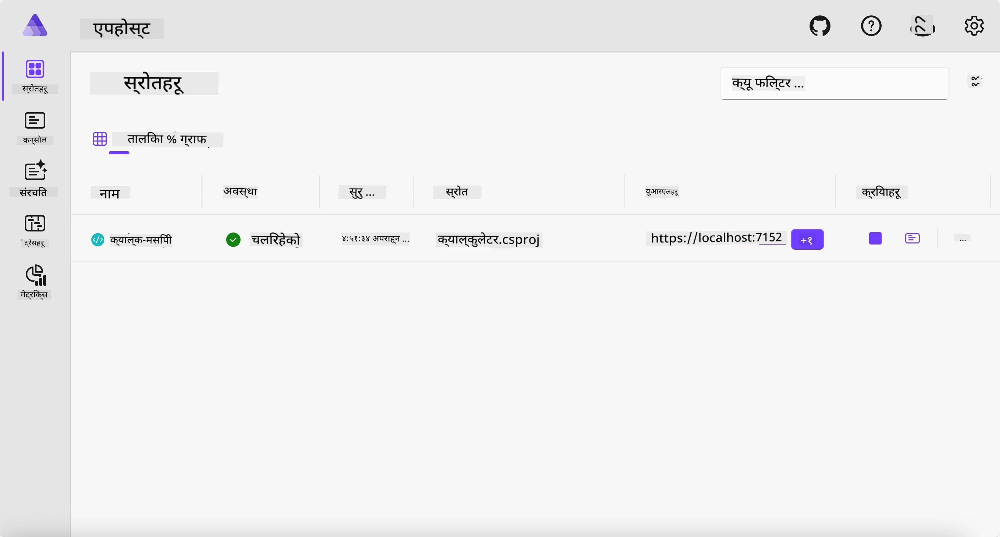
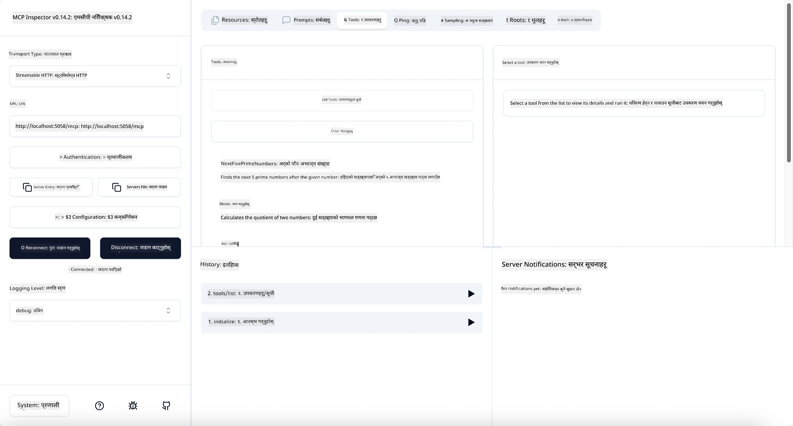
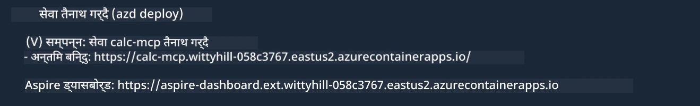

# नमुना

अघिल्लो उदाहरणले स्थानीय .NET परियोजना `stdio` प्रकारसँग कसरी प्रयोग गर्ने देखाउँछ। र कसरी कन्टेनरमा सर्भरलाई स्थानीय रूपमा चलाउने। यो धेरै परिस्थिति मा राम्रो समाधान हो। तर, सर्भरलाई क्लाउड वातावरण जस्तो दूरबाट चलाउनु उपयोगी हुन सक्छ। यस अवस्थामा `http` प्रकार उपयोगी हुन्छ।

`04-PracticalImplementation` फोल्डरमा समाधानलाई हेर्दा, यो अघिल्लो भन्दा धेरै जटिल देखिन सक्छ। तर व्यवहारमा, त्यस्तो छैन। परियोजना `src/Calculator` लाई नजिकबाट हेर्ने हो भने, यो प्रायः अघिल्लो उदाहरण जस्तै कोड हो भनी देखिन्छ। फरक यति हो कि हामी HTTP अनुरोधहरू हेर्न `ModelContextProtocol.AspNetCore` लाइब्रेरी प्रयोग गरिरहेका छौं। र `IsPrime` विधिलाई निजी बनाउन परिवर्तन गरेका छौं, जसले देखाउँछ कि तपाईँको कोडमा निजी विधि राख्न सकिन्छ। बाँकी सबै कोड पहिला जस्तै छ।

अन्य परियोजनाहरू [Aspire](https://aspire.dev/get-started/what-is-aspire/) बाट आएका हुन्। समाधानमा Aspire हुनु विकासकर्ताको अनुभव सुधार गर्छ विकास र परीक्षण गर्दा र अवलोकनयोग्यतामा मद्दत गर्छ। यो सर्भर चलाउन आवश्यक छैन, तर समाधानमा राख्नु राम्रो अभ्यास हो।

## स्थानीय रूपमा सर्भर सुरु गर्नुहोस्

1. VS Code (C# DevKit एक्सटेन्सन सहित) बाट `04-PracticalImplementation/samples/csharp` फोल्डरमा जानुहोस्।
1. सर्भर सुरु गर्न तलको आदेश चलाउनुहोस्:

   ```bash
    dotnet watch run --project ./src/AppHost
   ```

1. जब वेब ब्राउजरले Aspire ड्यासबोर्ड खोल्छ, `http` URL नोट गर्नुहोस्। यो लगभग `http://localhost:5058/` जस्तो हुने छ।

   

## MCP Inspector सँग Streamable HTTP परीक्षण गर्नुहोस्

तपाईंसँग Node.js 22.7.5 वा माथि छ भने, तपाईँ MCP Inspector प्रयोग गरी तपाइँको सर्भर परीक्षण गर्न सक्नुहुन्छ।

सर्भर सुरु गरी टर्मिनलमा तलको आदेश चलाउनुहोस्:

```bash
npx @modelcontextprotocol/inspector http://localhost:5058
```



- ट्रान्सपोर्ट प्रकारको रूपमा `Streamable HTTP` चयन गर्नुहोस्।
- Url फिल्डमा पहिला नोट गरेको सर्भरको URL लेख्नुहोस्, र पछि `/mcp` थप्नुहोस्। यसले `http` (https होइन) जस्तो केही `http://localhost:5058/mcp` हुनुपर्छ।
- Connect बटन चयन गर्नुहोस्।

Inspector को राम्रो कुरा के भने यसले भइरहेको कुरामा राम्रो दृश्यता दिन्छ।

- उपलब्ध उपकरणहरूको सूची प्रयास गर्नुहोस्
- केही उपकरणहरू प्रयोग गरेर हेर्नुहोस्, यो पहिले जस्तै काम गर्नेछ।

## VS Code मा GitHub Copilot Chat सँग MCP सर्भर परीक्षण गर्नुहोस्

Streamable HTTP ट्रान्सपोर्ट GitHub Copilot Chat सँग प्रयोग गर्न, पहिल्यै बनाएको `calc-mcp` सर्भरको कन्फिगरेसन यसरी परिवर्तन गर्नुहोस्:

```jsonc
// .vscode/mcp.json
{
  "servers": {
    "calc-mcp": {
      "type": "http",
      "url": "http://localhost:5058/mcp"
    }
  }
}
```

केही परीक्षणहरू गर्नुहोस्:

- "3 prime numbers after 6780" सोध्नुहोस्। के Copilot नयाँ उपकरणहरू `NextFivePrimeNumbers` प्रयोग गरेर पहिलो 3 मुख्य संख्याहरू मात्र फर्काउछ।
- "7 prime numbers after 111" सोध्नुहोस्, के हुन्छ हेर्न।
- "John has 24 lollies and wants to distribute them all to his 3 kids. How many lollies does each kid have?" सोध्नुहोस्, के हुन्छ हेर्न।

## सर्भरलाई Azure मा वितरण गर्नुहोस्

सर्भरलाई Azure मा वितरण गरौं जसले धेरैले प्रयोग गर्न सकोस्।

टर्मिनलबाट `04-PracticalImplementation/samples/csharp` फोल्डरमा जानुहोस् र तलको आदेश चलाउनुहोस्:

```bash
azd up
```

वितरण सकिए पछि, तपाईंलाई यस्तो सन्देश देखिनु पर्छ:



URL लिनुहोस् र MCP Inspector र GitHub Copilot Chat मा प्रयोग गर्नुहोस्।

```jsonc
// .vscode/mcp.json
{
  "servers": {
    "calc-mcp": {
      "type": "http",
      "url": "https://calc-mcp.gentleriver-3977fbcf.australiaeast.azurecontainerapps.io/mcp"
    }
  }
}
```

## अब के?

हामी विभिन्न ट्रान्सपोर्ट प्रकार र परीक्षण उपकरणहरू प्रयास गर्दछौं। हामी तपाईंको MCP सर्भरलाई Azure मा पनि वितरण गर्छौं। तर हाम्रो सर्भरलाई निजी स्रोतहरू पहुँच गर्न आवश्यक परे के गर्ने? उदाहरणका लागि, डेटाबेस वा निजी API? अर्को अध्यायमा हेरौं कसरी सर्भरको सुरक्षा सुधार गर्ने।

---

<!-- CO-OP TRANSLATOR DISCLAIMER START -->
**अस्वीकरण**:
यो दस्तावेज़ AI अनुवाद सेवा [Co-op Translator](https://github.com/Azure/co-op-translator) प्रयोग गरेर अनुवाद गरिएको हो। हामी सही हुन प्रयास गर्छौं, तर कृपया जानकार हुनुस् कि स्वचालित अनुवादमा त्रुटिहरू वा अशुद्धताहरू हुन सक्छन्। मूल दस्तावेज़ यसको मूल भाषामा आधिकारिक स्रोत मानिनुपर्छ। महत्वपूर्ण जानकारीका लागि व्यावसायिक मानव अनुवाद सिफारिस गरिन्छ। यस अनुवादको प्रयोगबाट उत्पन्न कुनै पनि गलत बुझाइ वा त्रुटिको लागि हामी जिम्मेवार छैनौं।
<!-- CO-OP TRANSLATOR DISCLAIMER END -->