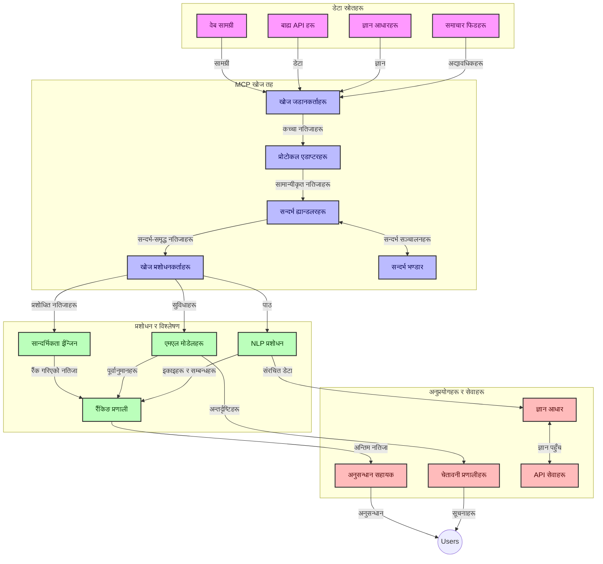
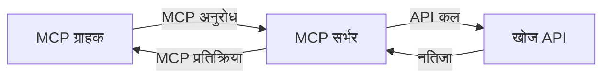
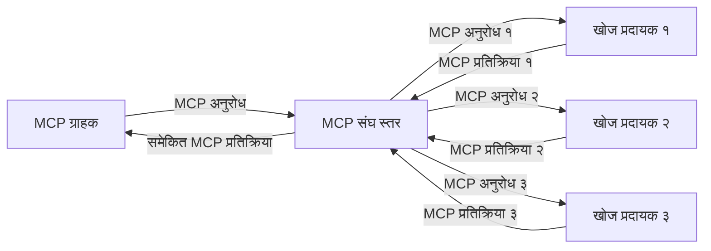
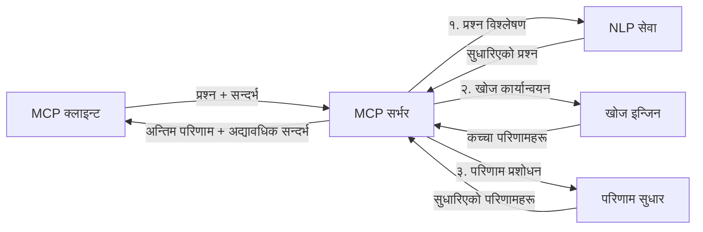

# वास्तविक-समय वेब खोजका लागि मोडेल सन्दर्भ प्रोटोकल

## अवलोकन

आजको सूचना-चालित वातावरणमा वास्तविक-समय वेब खोज अपरिहार्य भएको छ, जहाँ अनुप्रयोगहरूले उपयुक्त र समयमै प्रतिक्रिया दिन इन्टरनेटभरि अद्यावधिक जानकारीमा तत्काल पहुँच आवश्यक पर्छ। मोडेल सन्दर्भ प्रोटोकल (MCP) यी वास्तविक-समय खोज प्रक्रियाहरूलाई सुधार गर्ने महत्त्वपूर्ण प्रगति हो, जसले खोज प्रभावकारिता बढाउँछ, सन्दर्भीय अखण्डता कायम राख्छ, र समग्र प्रणाली प्रदर्शनमा सुधार ल्याउँछ।

यो मोड्युलले कसरि MCP ले वास्तविक-समय वेब खोजलाई परिवर्तन गर्छ भनेर अन्वेषण गर्दछ, जसले AI मोडेलहरू, खोज इञ्जिनहरू र अनुप्रयोगहरूमा सन्दर्भ व्यवस्थापनको लागि मानकीकृत दृष्टिकोण प्रदान गर्दछ।

### तपाईं के सिक्नेछौ

यस व्यापक मार्गदर्शिकामा तपाईंले पत्ता लगाउनुहुनेछ:

- कसरी MCP ले AI मोडेलहरू र वास्तविक-समय वेब खोज क्षमताबीच सहज सेतु बनाउँछ
- MCP का साथ कार्यान्वयन गर्न सकिने कुशल र स्केलेबल खोज समाधानका वास्तुकला ढाँचाहरू
- बहु सोधपुछ र अन्तरक्रियाहरूमा खोज सन्दर्भ संरक्षण गर्ने प्रविधिहरू
- विभिन्न खोज परिदृश्यहरूको लागि Python र JavaScript मा व्यवहार्य कोड कार्यान्वयनहरू
- MCP-संचालित खोज प्रणालीहरूमा प्रासङ्गिकता, नवीनता, र प्रदर्शन सन्तुलन गर्ने विधिहरू

## वास्तविक-समय वेब खोज परिचय

वास्तविक-समय वेब खोज एक प्राविधिक दृष्टिकोण हो जसले वेबमा प्रकाशित वा अद्यावधिक भइरहेका सूचनाहरूलाई निरन्तर सोधिने, प्रशोधन गर्ने, र विश्लेषण गर्ने सुविधा दिन्छ, जसले प्रणालीहरूलाई न्यूनतम ढिलाइमा ताजा र सान्दर्भिक जानकारी प्रदान गर्न सक्षम बनाउँछ। परम्परागत खोज प्रणालीहरू जसले घण्टा वा दिन पुराना अनुक्रमित डाटामा आधारित हुन्छन् भने, वास्तविक-समय खोजले वेबबाट लाइव डेटा प्रयोग गरेर हालको अनलाइन सामग्रीको अवस्था प्रतिबिम्बित गर्ने जानकारी र अन्तर्दृष्टि प्रदान गर्दछ।

### वास्तविक-समय वेब खोजका मुख्य अवधारणाहरू:

- **निरन्तर सोधपुछ प्रशोधन**: खोज सोधपुछहरू निरन्तर अद्यावधिक हुँदै गरेका डेटा स्रोतहरू विरुद्ध सञ्चालन गरिन्छ
- **नवीनता प्राथमिकता**: प्रणालीहरूले ताजा जानकारीलाई प्राथमिकता दिन डिजाइन गरिएका छन्
- **प्रासङ्गिकता सन्तुलन**: प्रासङ्गिकता र नवीनताको बीच सन्तुलन कायम राख्नु
- **विस्तृत वास्तुकला**: प्रणालीहरूले परिवर्तनशील सोधपुछ भार र डेटा भोल्युमहरू ह्यान्डल गर्न सक्नुपर्छ
- **सन्दर्भीय समझदारी**: खोज पुनरावृत्तिहरूमा प्रयोगकर्ता सन्दर्भ कायम राख्नु अर्थपूर्ण परिणामहरूको लागि अत्यावश्यक हुन्छ
- **गतिशील सोधपुछ पुनःस्वरूपण**: सन्दर्भ र अघिल्लो परिणामहरूका आधारमा अनुकुलित रूपमा सोधपुछहरू परिमार्जन गर्नु
- **बहु-स्रोत एकीकरण**: विभिन्न खोज प्रदायकहरू र वेब स्रोतहरूबाट परिणामहरू मिलाउनु
- **अर्थगत समझदारी**: केवल कुञ्जीशब्दहरू नभई अर्थका आधारमा सोधपुछ र सामग्री प्रशोधन गर्नु
- **वास्तविक-समय क्रमबद्धता**: नयाँ जानकारी उपलब्ध भएसँगै निरन्तर परिणामहरूको क्रम समायोजन गर्नु

### मोडेल सन्दर्भ प्रोटोकल र वास्तविक-समय वेब खोज

मोडेल सन्दर्भ प्रोटोकल (MCP) ले वास्तविक-समय वेब खोज वातावरणहरूमा विभिन्न महत्वपूर्ण चुनौतीहरू सम्बोधन गर्दछ:

1. **खोज सन्दर्भ संरक्षण**: MCP ले सन्दर्भलाई वितरित खोज कम्पोनेन्टहरूमाझ कसरी कायम राख्ने भन्ने कुरा मानकीकृत गर्छ, सुनिश्चित गर्दै कि AI मोडेलहरू र प्रशोधन नोडहरूलाई सम्बन्धित सोधपुछ इतिहास र प्रयोगकर्ता प्राथमिकतामा पहुँच हुन्छ।

2. **कुशल सोधपुछ व्यवस्थापन**: सन्दर्भ प्रेषणका लागि संरचित संयन्त्रहरू उपलब्ध गराएर, MCP ले प्रत्येक खोज पुनरावृत्तिमा सन्दर्भ पुनः प्रयोगको ओभरहेड कम गर्दछ।

3. **अन्तरचालन क्षमता**: MCP ले विभिन्न खोज प्रविधिहरू र AI मोडेलहरूबीच सन्दर्भ साझेदारीको लागि सामान्य भाषा सिर्जना गर्दछ, जसले बढी लचिलो र विस्तारयोग्य वास्तुकलाहरू सम्भव बनाउँछ।

4. **खोज-अनुकूलित सन्दर्भ**: MCP कार्यान्वयनहरूले कुन सन्दर्भ तत्त्वहरू सबैभन्दा प्रभावकारी खोजका लागि महत्त्वपूर्ण छन् भन्ने प्राथमिकता दिन सक्छ, प्रदर्शन र सहीतामा अनुकूलन गर्दै।

5. **अनुकुलित खोज प्रशोधन**: MCP मार्फत उचित सन्दर्भ व्यवस्थापन संग, खोज प्रणालीहरूले विकसित हुँदै गइरहेका प्रयोगकर्ता आवश्यकताहरू र सूचना परिदृश्यहरूमा आधारित गतिशील रूपमा प्रशोधन समायोजन गर्न सक्छन्।

आधुनिक अनुप्रयोगहरूमा समाचार सङ्कलनदेखि अनुसन्धान सहायकसम्म, MCP को वेब खोज प्रविधिहरूसँग एकीकरणले अझ बुद्धिमानीपूर्ण, सन्दर्भ-सजग खोज सक्षम गर्दछ जुन प्रयोगकर्ता अन्तरक्रियाहरू जारी रहँदा अझ सान्दर्भिक परिणामहरू प्रदान गर्न सक्छ।

## सिकाइ उद्देश्यहरू

यस पाठको अन्त्यमा, तपाईं सक्षम हुनुहुनेछ:

- वास्तविक-समय वेब खोजका आधारभूत सिद्धान्तहरू र आधुनिक अनुप्रयोगहरूमा त्यसका चुनौतीहरू बुझ्न
- मोडेल सन्दर्भ प्रोटोकल (MCP) ले कसरी वास्तविक-समय वेब खोज क्षमताहरू बढाउँछ व्याख्या गर्न
- लोकप्रिय फ्रेमवर्कहरू र API हरूको प्रयोग गरी MCP-आधारित खोज समाधानहरू कार्यान्वयन गर्न
- MCP सँग स्केलेबल, उच्च-प्रदर्शन खोज वास्तुकलाहरू डिजाइन र तैनाथ गर्न
- MCP अवधारणाहरूलाई विभिन्न प्रयोग मामिलाहरूमा लागू गर्न, जस्तै अर्थगत खोज, अनुसन्धान सहायता, र AI-सँयुक्त ब्राउजिङ
- MCP-आधारित खोज प्रविधिहरूमा उदाउँदो प्रवृत्ति र भबिष्यका नवप्रवर्तनहरूको मूल्याङ्कन गर्न
- प्रयोगकर्ता अन्तरक्रियाबाट सिक्ने सन्दर्भ-सजग खोज प्रणालीहरू विकास गर्न
- मानकीकृत MCP प्रोटोकलहरू प्रयोग गरी AI सहायकहरूमा वेब खोज क्षमता एकीकृत गर्न
- सन्दर्भको आधारमा क्रमिक रूपमा परिणाम परिमार्जन गर्ने बहु-चरण खोज पाइपलाइनहरू सिर्जना गर्न
- समग्र सन्दर्भ सजगता कायम राख्दै खोज प्रदर्शन अनुकूलन गर्न

### परिभाषा र महत्त्व

वास्तविक-समय वेब खोजले न्यूनतम ढिलाइमा वेब-आधारित जानकारीको निरन्तर सोधपुछ, पुनःप्राप्ति, र वितरण समेट्छ। परम्परागत खोज इञ्जिनहरूले जुन वेबलाई आवधिक रुपमा क्रल र अनुक्रमणिका गर्दछन् भन्दा फरक, वास्तविक-समय खोजले सूचना उपलब्ध भएसँगै सतहमा ल्याउने लक्ष्य राख्दछ, सबैभन्दा वर्तमान सामग्रीमा तत्काल पहुँच सक्षम पार्ने।

वास्तविक-समय वेब खोजका प्रमुख विशेषताहरू समावेश छन्:

- **ताजगी**: हालको सामग्री र अद्यावधिकहरूलाई प्राथमिकता दिनु
- **निरन्तर प्रशोधन**: नयाँ जानकारीका लागि निरन्तर अनुगमन गर्नु
- **सोधपुछ अनुकूलन**: सन्दर्भ र प्रतिक्रियाका आधारमा खोज सोधपुछ परिमार्जन गर्नु
- **तत्काल वितरण**: न्यूनतम ढिलाइमा खोज परिणामहरू प्रदान गर्नु
- **सन्दर्भ संरक्षण**: सुधारिएको सान्दर्भिकताका लागि अघिल्लो सोधपुछहरूमा आधरित हुनु

### परम्परागत वेब खोजमा चुनौतीहरू

वास्तविक-समय अवस्थामा लागू गर्दा परम्परागत वेब खोजका दृष्टिकोणहरूले अनेकौं सीमाहरू भोग्नु पर्दछ:

1. **सन्दर्भ खण्डीकरण**: बहु सोधपुछहरूमा खोज सन्दर्भ कायम राख्न कठिनाइ
2. **सूचना ताजगी**: सबैभन्दा ताजा जानकारी पहुँच र प्राथमिकता दिन चुनौतीहरू
3. **एकीकरण जटिलता**: खोज प्रणाली र अनुप्रयोगहरूबीच अन्तरचालनमा समस्या
4. **ढिलाइका समस्या**: समग्र खोज र प्रतिक्रिया समय आवश्यकता बीच सन्तुलन राख्नु
5. **प्रासङ्गिकता समायोजन**: नवीनता प्राथमिकता गर्दा शुद्धता र सान्दर्भिकता सुनिश्चित गर्नु

## खोजका लागि मोडेल सन्दर्भ प्रोटोकल (MCP) बुझ्न

### खोज सन्दर्भमा MCP के हो?

मोडेल सन्दर्भ प्रोटोकल (MCP) AI मोडेलहरू र अनुप्रयोगहरूबीच कुशल अन्तरक्रिया सहज बनाउनका लागि डिजाइन गरिएको मानकीकृत सञ्चार प्रोटोकल हो। वास्तविक-समय वेब खोज सन्दर्भमा, MCP यसका लागि फ्रेमवर्क प्रदान गर्दछ:

- सोधपुछ श्रृंखलाहरूमा खोज सन्दर्भ संरक्षण गर्ने
- खोज सोधपुछ र परिणाम फारम्याटहरू मानकीकृत गर्ने
- खोज प्यारामिटर र परिणामहरूको सञ्चारण अनुकूलन गर्ने
- मोडेल-देखि-खोज इञ्जिन सञ्चारलाई सुधार गर्ने

### मुख्य कम्पोनेन्टहरू र वास्तुकला

वास्तविक-समय वेब खोजका लागि MCP वास्तुकलामा निम्न मुख्य कम्पोनेन्टहरू छन्:

1. **सोधपुछ सन्दर्भ ह्याण्डलरहरू**: बहु सोधपुछहरूमा खोज सन्दर्भ व्यवस्थापन र संरक्षण गर्नु
2. **खोज प्रशोधनकर्ताहरू**: सन्दर्भ-सजग प्रविधिहरू प्रयोग गरी आएका खोज अनुरोधहरू प्रशोधन गर्नु
3. **प्रोटोकल एडेप्टरहरू**: विभिन्न खोज API हरू बीच सन्दर्भ संरक्षण गर्दै रूपान्तरण गर्नु
4. **सन्दर्भ स्टोर**: खोज इतिहास र प्राथमिकताहरू कुशलतापूर्वक भण्डारण र पुनःप्राप्ति गर्नु
5. **खोज कनेक्टरहरू**: विभिन्न खोज इञ्जिन र वेब API हरूसँग जडान गर्नु



### MCP ले कसरी वास्तविक-समय वेब खोज सुधार गर्छ

MCP ले परम्परागत वेब खोज चुनौतीहरू निम्न तरिकाले सम्बोधन गर्छ:

- **सन्दर्भीय निरन्तरता**: सम्पूर्ण खोज सत्रभरि सोधपुछहरूबीच सम्बन्धहरू कायम राख्ने
- **अनुकूलित सञ्चारण**: बौद्धिक सन्दर्भ व्यवस्थापनद्वारा खोज प्यारामिटरहरूमा अतिरेक घटाउने
- **मानकीकृत इन्टरफेसहरू**: खोज कम्पोनेन्टहरूको लागि सुसंगत API उपलब्ध गराउने
- **ढिलाइ घटाउने**: कुशल सन्दर्भ ह्यान्डलिङमार्फत प्रशोधन ओभरहेड न्यूनतम बनाउने
- **प्रासङ्गिकता सुधार**: बहु सोधपुछहरूमा प्रयोगकर्ता इरादा संरक्षण गरी खोज प्रासङ्गिकता बढाउने

## एकीकरण र कार्यान्वयन

वास्तविक-समय वेब खोज प्रणालीहरूले प्रदर्शन र सन्दर्भ अखण्डता दुवै कायम राख्न सावधानीपूर्ण वास्तुकला डिजाइन र कार्यान्वयन आवश्यक पर्छ। मोडेल सन्दर्भ प्रोटोकलले AI मोडेलहरू र खोज प्रविधिहरूलाई एकीकृत गर्न मानकीकृत दृष्टिकोण प्रदान गर्दछ, जसले अधिक जटिल, सन्दर्भ-सजग खोज पाइपलाइनहरू सम्भव बनाउँछ।

### खोज वास्तुकलाहरूमा MCP एकीकरणको अवलोकन

वास्तविक-समय वेब खोज वातावरणहरूमा MCP कार्यान्वयन गर्दा केहि मुख्य विचारहरू हुन्छन्:

1. **खोज सन्दर्भ सिरियलाइजेशन**: MCP ले खोज अनुरोधहरूमा सन्दर्भ जानकारी कन्कोड गर्न कुशल संयन्त्रहरू प्रदान गर्दछ, जसले सुनिश्चित गर्दछ कि आवश्यक सन्दर्भ सोधपुछभरि प्रशोधन पाइपलाइनमा परिचालित हुन्छ। यसमा खोज सम्बन्धित मेटाडाटा अनुकूलित मानकीकृत सिरियलाइजेशन ढाँचाहरू समावेश छन्।

2. **राज्यपूर्ण खोज प्रशोधन**: MCP ले खोज आवृत्तिहरूमा सुसंगत सन्दर्भ प्रतिनिधित्व कायम राखेर बढी बुद्धिमानीपूर्ण राज्यपूर्ण प्रशोधन सक्षम बनाउँछ। यो विशेष गरी त्यस्ता बहु-चरण खोज पाइपलाइनहरूमा महत्त्वपूर्ण हुन्छ जहाँ सन्दर्भ सुधारले परिणामहरूलाई सुधार गर्दछ।

3. **सोधपुछ विस्तार र सुधार**: MCP कार्यान्वयनहरूले संचित सन्दर्भको आधारमा परिष्कृत खोज सोधपुछ विस्तार र सुधारलाई सहज बनाउँछ, जसले खोज सत्र अगाडि बढ्दै जाँदा अझ सान्दर्भिक परिणामहरू सम्भव बनाउँछ।

4. **परिणाम क्यासिङ र प्राथमिकता**: सन्दर्भ व्यवस्थापन मानकीकृत गरेपछि, MCP ले परिणाम क्यासिङ र प्राथमिकता व्यवस्थापनमा मद्दत गर्दछ, जसले कम्पोनेन्टहरूलाई विकासशील खोज सन्दर्भ अनुसार अनुकूलन गर्न सक्षम बनाउँछ।

5. **खोज संघ र सङ्ग्रह**: MCP ले विभिन्न ब्याकएन्डहरूमा खोजको थप जटिल संघको लागि संरचित सन्दर्भ प्रतिनिधित्व प्रदान गर्दछ, जसले विविध स्रोतहरूबाट परिणामहरूको थप अर्थपूर्ण सङ्ग्रह सम्भव बनाउँछ।

विभिन्न खोज प्रविधिहरूमा MCP को कार्यान्वयनले सन्दर्भ व्यवस्थापनमा एकीकृत दृष्टिकोण तयार गर्दछ, जसले अनुकूलित एकीकरण कोड आवश्यकतालाई कम गर्छ र खोज सोधपुछहरू विकास हुनुका साथै अर्थपूर्ण सन्दर्भ कायम राख्ने प्रणालीको क्षमता सुधार्दछ।

### विभिन्न वेब खोज कार्यान्वयनहरूमा MCP

यी उदाहरणहरूले हालको MCP विनिर्देश पालना गर्छन् जसले JSON-RPC आधारित प्रोटोकलमा केन्द्रित छ र फरक ट्रान्सपोर्ट संयन्त्रहरू हुन्छन्। कोडले कसरी तपाईंले MCP प्रोटोकलसँग पूर्ण अनुकूलता कायम राख्दै अनुकूलित खोज एकीकरणहरू कार्यान्वयन गर्न सक्नुहुन्छ भनी देखाउँछ।


<details>
<summary>सामान्य खोज API सहित Python कार्यान्वयन</summary>

```python
import asyncio
import json
import aiohttp
from typing import Dict, Any, Optional, List
from contextlib import asynccontextmanager
from collections.abc import AsyncIterator

# मानक MCP लाइब्रेरीहरू आयात गर्नुहोस्
from mcp.client.session import ClientSession
from mcp.client.streamable_http import streamablehttp_client
from mcp.types import TextContent, CreateMessageRequestParams, CreateMessageResult
from mcp.server.fastmcp import FastMCP

# वेब खोजको लागि FastMCP सर्भर बनाउनुहोस्
search_server = FastMCP("WebSearch")

# वेब खोज कार्यहरू सम्हाल्ने कक्षा
class WebSearchHandler:
    def __init__(self, api_endpoint: str, api_key: str):
        self.api_endpoint = api_endpoint
        self.api_key = api_key
        self.session = None
        
    async def initialize(self):
        """Initialize the HTTP session"""
        self.session = aiohttp.ClientSession(
            headers={"Authorization": f"Bearer {self.api_key}"}
        )
    
    async def close(self):
        """Close the HTTP session"""
        if self.session:
            await self.session.close()
            
    async def perform_search(self, query: str, max_results: int = 5, 
                           include_domains: List[str] = None, 
                           exclude_domains: List[str] = None,
                           time_period: str = "any") -> Dict[str, Any]:
        """Perform web search using the search API"""
        # खोजका प्यारामीटरहरू निर्माण गर्नुहोस्
        search_params = {
            "q": query,
            "limit": max_results,
            "time": time_period
        }
        
        if include_domains:
            search_params["site"] = ",".join(include_domains)
            
        if exclude_domains:
            search_params["exclude_site"] = ",".join(exclude_domains)
        
        # खोज अनुरोध प्रदर्शन गर्नुहोस्
        try:
            async with self.session.get(
                self.api_endpoint,
                params=search_params
            ) as response:
                if response.status != 200:
                    error_text = await response.text()
                    raise Exception(f"Search API error: {response.status} - {error_text}")
                
                search_data = await response.json()
                
                # API-विशिष्ट प्रतिक्रिया सामान्य ढाँचामा रूपान्तरण गर्नुहोस्
                results = []
                for item in search_data.get("results", []):
                    results.append({
                        "title": item.get("title", ""),
                        "url": item.get("url", ""),
                        "snippet": item.get("snippet", ""),
                        "date": item.get("published_date", ""),
                        "source": item.get("source", "")
                    })
                
                return {
                    "query": query,
                    "totalResults": len(results),
                    "results": results
                }
        except Exception as e:
            print(f"Search API request error: {e}")
            raise

# खोज ह्यान्डलर शुरू गर्नुहोस्
search_handler = WebSearchHandler(
    api_endpoint="https://api.search-service.example/search",
    api_key="your-api-key-here"
)

# खोज ह्यान्डलर व्यवस्थापन गर्न जीवनकाल सेटअप गर्नुहोस्
@asyncio.asynccontextmanager
async def app_lifespan(server: FastMCP):
    """Manage application lifecycle"""
    await search_handler.initialize()
    try:
        yield {"search_handler": search_handler}
    finally:
        await search_handler.close()

# सर्भरको जीवनकाल सेट गर्नुहोस्
search_server = FastMCP("WebSearch", lifespan=app_lifespan)

# वेब खोज उपकरण दर्ता गर्नुहोस्
@search_server.tool()
async def web_search(query: str, max_results: int = 5, 
                   include_domains: List[str] = None,
                   exclude_domains: List[str] = None,
                   time_period: str = "any") -> Dict[str, Any]:
    """
    Search the web for information
    
    Args:
        query: The search query
        max_results: Maximum number of results to return (default: 5)
        include_domains: List of domains to include in search results
        exclude_domains: List of domains to exclude from search results
        time_period: Time period for results ("day", "week", "month", "any")
        
    Returns:
        Dictionary containing search results
    """
    ctx = search_server.get_context()
    search_handler = ctx.request_context.lifespan_context["search_handler"]
    
    results = await search_handler.perform_search(
        query=query,
        max_results=max_results,
        include_domains=include_domains,
        exclude_domains=exclude_domains,
        time_period=time_period
    )
    
    return results

# उदाहरण ग्राहक प्रयोग
async def client_example():
    # Streamable HTTP ट्रान्सपोर्ट प्रयोग गरी खोज सर्भरमा जडान गर्नुहोस्
    async with streamablehttp_client("http://localhost:8000/mcp") as (read, write, _):
        async with ClientSession(read, write) as session:
            # जडान प्रारम्भ गर्नुहोस्
            await session.initialize()
            
            # वेब_खोज उपकरण कल गर्नुहोस्
            search_results = await session.call_tool(
                "web_search", 
                {
                    "query": "latest developments in AI and Model Context Protocol",
                    "max_results": 5,
                    "time_period": "day",
                    "include_domains": ["github.com", "microsoft.com"]
                }
            )
            
            print(f"Search results: {search_results}")

# सर्भर सञ्चालन उदाहरण
if __name__ == "__main__":
    # Streamable HTTP ट्रान्सपोर्टसँग सर्भर चलाउनुहोस्
    search_server.run(transport="streamable-http")
```
</details> 

<details>
<summary>ब्राउजर-आधारित खोजसँग JavaScript कार्यान्वयन</summary>


```javascript
// वेब खोजका लागि MCP सर्भर कार्यान्वयन
import { McpServer, ResourceTemplate } from '@modelcontextprotocol/sdk/server/mcp.js';
import { StreamableHTTPServerTransport } from '@modelcontextprotocol/sdk/server/streamableHttp.js';
import { z } from 'zod';

// वेब खोजका लागि MCP सर्भर बनाउनुहोस्
const searchServer = new McpServer({
    name: "BrowserSearch",
    description: "A server that provides web search capabilities"
});

// खोज सेवा क्लास
class SearchService {
    constructor(searchApiUrl, apiKey) {
        this.searchApiUrl = searchApiUrl;
        this.apiKey = apiKey;
    }

    async performSearch(parameters) {
        const {
            query = '',
            maxResults = 5,
            includeDomains = [],
            excludeDomains = [],
            timePeriod = 'any'
        } = parameters;
        
        // प्यारामिटरहरू सहित खोज URL निर्माण गर्नुहोस्
        const url = new URL(this.searchApiUrl);
        url.searchParams.append('q', query);
        url.searchParams.append('limit', maxResults);
        url.searchParams.append('time', timePeriod);
        
        if (includeDomains.length > 0) {
            url.searchParams.append('site', includeDomains.join(','));
        }
        
        if (excludeDomains.length > 0) {
            url.searchParams.append('exclude_site', excludeDomains.join(','));
        }
        
        try {
            const response = await fetch(url.toString(), {
                method: 'GET',
                headers: {
                    'Authorization': `Bearer ${this.apiKey}`,
                    'Content-Type': 'application/json'
                }
            });
            
            if (!response.ok) {
                const errorText = await response.text();
                throw new Error(`Search API error: ${response.status} - ${errorText}`);
            }
            
            const searchData = await response.json();
            
            // API-विशिष्ट प्रतिक्रिया एउटा मानक ढाँचामा रूपान्तरण गर्नुहोस्
            const results = searchData.results?.map(item => ({
                title: item.title || '',
                url: item.url || '',
                snippet: item.snippet || '',
                date: item.published_date || '',
                source: item.source || ''
            })) || [];
            
            return {
                query,
                totalResults: results.length,
                results
            };
        } catch (error) {
            console.error('Search API request error:', error);
            throw error;
        }
    }
}

// खोज सेवा आरम्भ गर्नुहोस्
const searchService = new SearchService(
    'https://api.search-service.example/search',
    'your-api-key-here'
);

// सर्भरको लागि सन्दर्भ प्रदायक सेटअप गर्नुहोस्
searchServer.setContextProvider(() => {
    return {
        searchService
    };
});

// वेब खोज उपकरण दर्ता गर्नुहोस्
searchServer.tool({
    name: 'web_search',
    description: 'Search the web for information',
    parameters: {
        type: 'object',
        properties: {
            query: {
                type: 'string',
                description: 'The search query'
            },
            maxResults: {
                type: 'integer',
                description: 'Maximum number of results to return',
                default: 5
            },
            includeDomains: {
                type: 'array',
                items: { type: 'string' },
                description: 'List of domains to include in search results'
            },
            excludeDomains: {
                type: 'array',
                items: { type: 'string' },
                description: 'List of domains to exclude from search results'
            },
            timePeriod: {
                type: 'string',
                description: 'Time period for results',
                enum: ['day', 'week', 'month', 'any'],
                default: 'any'
            }
        },
        required: ['query']
    },
    handler: async (params, context) => {
        const { searchService } = context;
        return await searchService.performSearch(params);
    }
});

// खोज सर्भरसँग जडान गर्न उदाहरण क्लाइन्ट कोड
import { Client } from '@modelcontextprotocol/sdk/client/index.js';
import { StreamableHTTPClientTransport } from '@modelcontextprotocol/sdk/client/streamableHttp.js';

async function connectToSearchServer() {
    // खोज सर्भरसँग जडान गर्नुहोस्
    const transport = new StreamableHTTPClientTransport(
        new URL('http://localhost:8000/mcp')
    );
    
    const client = new Client({
        name: 'search-client',
        version: '1.0.0'
    });
    
    await client.connect(transport);
    
    // खोज उपकरण सञ्चालन गर्नुहोस्
    const searchResults = await client.callTool({
        name: 'web_search',
        arguments: {
            query: 'Model Context Protocol implementation examples',
            maxResults: 10,
            timePeriod: 'week',
            includeDomains: ['github.com', 'docs.microsoft.com']
        }
    });
    
    console.log('Search results:', searchResults);
    
    // सफाइ गर्नुहोस्
    await client.disconnect();
}

// सर्भर सुरु गर्नुहोस्
const transport = new StreamableHTTPServerTransport();
await searchServer.connect(transport);
console.log('Search server running at http://localhost:8000/mcp');

// अलग प्रक्रियामा वा सर्भर सुरु भएपछि
// connectToSearchServer().catch(console.error);
```
</details> 


## कोड उदाहरण अस्वीकरण

> **महत्त्वपूर्ण सूचना**: तलका कोड उदाहरणहरूले मोडेल सन्दर्भ प्रोटोकल (MCP) को वेब खोज कार्यक्षमतासँग एकीकरण देखाउँछन्। यद्यपि यीले आधिकारिक MCP SDK का ढाँचाहरू र संरचनाहरू अनुसरण गर्छन्, तिनीहरू शैक्षिक प्रयोजनको लागि सरल बनाइएको छन्।
> 
> यी उदाहरणहरूले देखाउँछन्:
> 
> 1. **Python कार्यान्वयन**: FastMCP सर्भर कार्यान्वयन जसले वेब खोज उपकरण प्रदान गर्छ र बाह्य खोज API सँग जडान गर्छ। यो उदाहरणले उचित आयु प्रबन्ध, सन्दर्भ व्यवस्थापन, र उपकरण कार्यान्वयन देखाउँछ, [आधिकारिक MCP Python SDK](https://github.com/modelcontextprotocol/python-sdk) का ढाँचाहरू अनुसार। सर्भरले सिफारिस गरिएको Streamable HTTP ट्रान्सपोर्ट प्रयोग गर्छ जुन उत्पादन तैनाथीकरणका लागि पुरानो SSE ट्रान्सपोर्टको प्रतिस्थापन हो।
> 
> 2. **JavaScript कार्यान्वयन**: [आधिकारिक MCP TypeScript SDK](https://github.com/modelcontextprotocol/typescript-sdk) बाट FastMCP ढाँचाको प्रयोग गरी TypeScript/JavaScript कार्यान्वयन, जसले उपयुक्त उपकरण परिभाषाहरू र क्लाइन्ट जडानहरू सहित खोज सर्भर सिर्जना गर्छ। यसले सत्र प्रबन्ध र सन्दर्भ संरक्षणका लागि नवीनतम सिफारिस गरिएका ढाँचाहरू अनुसरण गर्दछ।
> 
> यी उदाहरणहरूले उत्पादन प्रयोगका लागि थप त्रुटि ह्यान्डलिङ, प्रमाणीकरण, र विशेष API एकीकरण कोड आवश्यक पर्दछ। देखाइएको खोज API अन्तबिन्दुहरू (`https://api.search-service.example/search`) प्लेसहोल्डरहरू हुन् र वास्तविक खोज सेवा अन्तबिन्दुहरूसँग प्रतिस्थापन गर्नुपर्नेछ।
> 
> पूर्ण कार्यान्वयन विवरण र सबैभन्दा नयाँ दृष्टिकोणहरूको लागि,
> [आधिकारिक MCP विनिर्देश](https://modelcontextprotocol.io/specification/2026-07-28/)
> र SDK कागजातहरू हेरौं।

## प्रमुख अवधारणाहरू

### मोडेल सन्दर्भ प्रोटोकल (MCP) फ्रेमवर्क

यसका आधारमा, मोडेल सन्दर्भ प्रोटोकलले AI मोडेलहरू, अनुप्रयोगहरू, र सेवाहरू बीच सन्दर्भ आदानप्रदान गर्न मानकीकृत तरिका प्रदान गर्दछ। वास्तविक-समय वेब खोजमा, यो फ्रेमवर्क सुसंगत, बहु-चरण खोज अनुभवहरू सिर्जना गर्न अत्यावश्यक छ। प्रमुख कम्पोनेन्टहरू समावेश छन्:

1. **क्लाइन्ट-सर्भर वास्तुकला**: MCP ले खोज क्लाइन्टहरू (अनुरोधकर्ता) र खोज सर्भरहरू (प्रदायक) बीच स्पष्ट पृथक्करण स्थापना गर्छ, लचिलो तैनाथीकरण मोडेलहरू अनुमति दिन।

2. **JSON-RPC सञ्चार**: प्रोटोकलले सन्देश आदानप्रदानका लागि JSON-RPC प्रयोग गर्छ, यसले वेब प्रविधिहरूसँग अनुकूलता र विभिन्न प्लेटफर्महरूमा सजिलो कार्यान्वयन सुनिश्चित गर्दछ।

3. **सन्दर्भ व्यवस्थापन**: MCP ले बहु अन्तरक्रियाहरूमा खोज सन्दर्भलाई कायम राख्न, अद्यावधिक गर्न, र उपयोग गर्न संरचित विधिहरू परिभाषित गर्दछ।

4. **उपकरण परिभाषाहरू**: खोज क्षमताहरूलाई राम्रोसँग परिभाषित प्यारामिटरहरू र प्रतिफल मानहरूसहित मानकीकृत उपकरणहरूका रूपमा उपलब्ध गराइन्छ।

5. **स्ट्रिमिङ समर्थन**: प्रोटोकलले स्ट्रिमिङ परिणामहरूलाई समर्थन गर्छ, जुन वास्तविक-समय खोजका लागि आवश्यक हुन्छ जहाँ परिणामहरू क्रमिक रूपमा आउन सक्छन्।

### वेब खोज एकीकरण ढाँचाहरू

MCP लाई वेब खोजसँग एकीकृत गर्दा, विभिन्न ढाँचाहरू देखा पर्छन्:

#### 1. सिधा खोज प्रदायक एकीकरण



यस ढाँचामा, MCP सर्भरले सिधै एक वा बढी खोज API हरूसँग अन्तरक्रिया गर्छ, MCP अनुरोधहरूलाई API-विशिष्ट कलहरूमा अनुवाद गर्दै र परिणामहरूलाई MCP प्रतिक्रियाहरूको रूपमा ढाँचाबद्ध गर्दै।

#### 2. सन्दर्भ संरक्षणसहित संघीय खोज



यस ढाँचाले MCP-अनुकूल खोज प्रदायकहरूमा खोज सोधपुछहरू वितरण गर्छ, प्रत्येकलाई समावेशी सामग्री वा खोज क्षमताहरूमा विशेषज्ञता प्राप्त हुन सक्छ, र एकीकृत सन्दर्भ कायम राख्छ।

#### 3. सन्दर्भ-वृद्धि खोज श्रृंखला



यस ढाँचामा, खोज प्रक्रिया धेरै चरणहरूमा विभाजित हुन्छ, जहाँ प्रत्येक चरणमा सन्दर्भ समृद्धि हुन्छ, जसले क्रमिक रूपमा बढी सान्दर्भिक परिणामहरू ल्याउँछ।

### खोज सन्दर्भ कम्पोनन्टहरू

MCP-आधारित वेब खोजमा, सन्दर्भमा सामान्यतया समावेश हुन्छ:

- **सोधपुछ इतिहास**: सत्रका अघिल्ला खोज सोधपुछहरू
- **प्रयोगकर्ता प्राथमिकताहरू**: भाषा, क्षेत्र, सुरक्षित खोज सेटिङहरू
- **अन्तरक्रिया इतिहास**: कुन परिणामहरूमा क्लिक गरियो, परिणामहरूमा बिताइएको समय
- **खोज प्यारामिटरहरू**: फिल्टरहरू, क्रमबद्ध आदेशहरू, र अन्य खोज संशोधकहरू
- **डोमेन ज्ञान**: खोजसँग सम्बन्धित विषय-विशिष्ट सन्दर्भ
- **कालगत सन्दर्भ**: समयमा आधारित प्रासङ्गिकता कारकहरू
- **स्रोत प्राथमिकताहरू**: विश्वासिलो वा प्राथमिक सूचना स्रोतहरू

## प्रयोग मामिला र अनुप्रयोगहरू

### अनुसन्धान र सूचना सङ्कलन

MCP ले अनुसन्धान कार्यप्रवाहहरूलाई सुधार गर्दछ:

- खोज सत्रहरूमा अनुसन्धान सन्दर्भ संरक्षण गर्दै
- थप सुक्ष्म र सान्दर्भिक सोधपुछहरू सक्षम पार्दै
- बहु-स्रोत खोज संघधिकार समर्थन गर्दै
- खोज परिणामहरूबाट ज्ञान निष्कर्षणलाई सहज बनाउँदै

### वास्तविक-समय समाचार र प्रवृत्ति अनुगमन

MCP-सञ्चालित खोजले समाचार अनुगमनका लागि फाइदा दिन्छ:

- उदाउँदो समाचार कथाहरूको नजिक-रियल-टाइम पत्ता लगाउने
- सान्दर्भिक जानकारीको सन्दर्भीय छनौट
- विषय र इकाइहरूलाई बहु स्रोतहरूमा ट्र्याक गर्ने
- प्रयोगकर्ता सन्दर्भको आधारमा व्यक्तिगत समाचार सचेतकहरू

### AI-अँगीकृत ब्राउजिङ र अनुसन्धान

MCP ले AI-अँगीकृत ब्राउजिङका लागि नयाँ सम्भावनाहरू सिर्जना गर्दछ:

- वर्तमान ब्राउजर गतिविधिको आधारमा सन्दर्भीय खोज सुझावहरू
- LLM-सञ्चालित सहायकहरूसँग वेब खोजको सहज एकीकरण
- कायम गरिएको सन्दर्भसँग बहु-चरण खोज सुधार
- सुधारिएको तथ्य-परिक्षण र सूचना प्रमाणीकरण

## भविष्यका प्रवृत्ति र नवप्रवर्तनहरू

### वेब खोजमा MCP को विकास

भविष्यतर्फ हेरदा, हामी MCP ले सम्बोधन गर्ने आशा गर्दछौं:


- **मल्टिमोडल खोज**: पाठ, छवि, अडियो, र भिडियो खोजलाई सन्दर्भ सुरक्षित गर्दै एकीकृत गर्ने
- **केन्द्रीकृत खोज**: वितरित र संघीय खोज पारिस्थितिकी तंत्रहरूलाई समर्थन गर्ने
- **खोज गोपनीयता**: सन्दर्भ-सहज गोपनीयता-सुरक्षित खोज संयन्त्रहरू
- **प्रश्न बुझाइ**: प्राकृतिक भाषाका खोज प्रश्नहरूको गहिरो अर्थपूर्ण पार्सिङ

### प्रविधिमा सम्भावित प्रगति

उदाउँदै गएका प्रविधिहरू जसले MCP खोजको भविष्यलाई आकार दिने छन्:

1. **न्यूरल खोज वास्तुकला**: MCP का लागि अनुकूलित एम्बेडिङ-आधारित खोज प्रणालीहरू
2. **व्यक्तिगत खोज सन्दर्भ**: समयसँगै व्यक्तिगत प्रयोगकर्ता खोज नमूनाहरू सिक्ने
3. **ज्ञान ग्राफ एकीकरण**: डोमेन-विशिष्ट ज्ञान ग्राफसहित सन्दर्भात्मक खोजमा सुधार
4. **क्रस-मोडल सन्दर्भ**: विभिन्न खोज मोडालिटीजमा सन्दर्भ कायम राख्ने

## हातेमालो अभ्यासहरू

### अभ्यास 1: एउटा आधारभूत MCP खोज पाइपलाइन सेटअप गर्ने

यस अभ्यासमा, तपाईंले सिक्न सक्नुहुनेछ:
- एउटा आधारभूत MCP खोज वातावरण कन्फिगर गर्ने
- वेब खोजका लागि सन्दर्भ ह्यान्डलरहरू कार्यान्वयन गर्ने
- खोज पुनरावृत्तिहरूमा सन्दर्भ संरक्षण परीक्षण गर्ने र प्रमाणित गर्ने

### अभ्यास 2: MCP खोजसँग अनुसन्धान सहायक बनाउने

एउटा पूर्ण एप्लिकेशन सिर्जना गर्नुहोस् जसले:
- प्राकृतिक भाषा अनुसन्धान प्रश्नहरू प्रक्रियाकरण गर्ने
- सन्दर्भ-सहज वेब खोजहरू सञ्चालन गर्ने
- विभिन्न स्रोतहरूबाट सूचना संश्लेषण गर्ने
- व्यवस्थित अनुसन्धान नतिजाहरू प्रस्तुत गर्ने

### अभ्यास 3: MCP सँग बहु-स्रोत खोज संघसंस्था कार्यान्वयन गर्ने

उन्नत अभ्यासमा समावेश छ:
- बहु खोज इन्जिनहरूमा सन्दर्भ-सहज प्रश्न प्रेषण गर्ने
- परिणाम क्रमांकन र समेकन
- खोज परिणामहरूको सन्दर्भगत डुप्लिकेशन हटाउने
- स्रोत-विशिष्ट मेटाडाटा ह्यान्डलिङ गर्ने

## थप स्रोतहरू

- [Model Context Protocol Specification](https://modelcontextprotocol.io/specification/2026-07-28/) - आधिकारिक MCP विशिष्टता र विस्तृत प्रोटोकल प्रलेखन
- [Model Context Protocol Documentation](https://modelcontextprotocol.io/) - विस्तृत ट्यूटोरियलहरू र कार्यान्वयन गाइडहरू
- [MCP Python SDK](https://github.com/modelcontextprotocol/python-sdk) - MCP प्रोटोकलको आधिकारिक पाइथन कार्यान्वयन
- [MCP TypeScript SDK](https://github.com/modelcontextprotocol/typescript-sdk) - MCP प्रोटोकलको आधिकारिक टाइपस्क्रिप्ट कार्यान्वयन
- [MCP Reference Servers](https://github.com/modelcontextprotocol/servers) - MCP सर्भरहरूको सन्दर्भ कार्यान्वयनहरु
- [Bing Web Search API Documentation](https://learn.microsoft.com/en-us/bing/search-apis/bing-web-search/overview) - माइक्रोसफ्टको वेब खोज API
- [Google Custom Search JSON API](https://developers.google.com/custom-search/v1/overview) - गुगलको प्रोग्रामेबल खोज इन्जिन
- [SerpAPI Documentation](https://serpapi.com/search-api) - खोज इन्जिन परिणाम पृष्ठ API
- [Meilisearch Documentation](https://www.meilisearch.com/docs) - खुला स्रोत खोज इन्जिन
- [Elasticsearch Documentation](https://www.elastic.co/guide/index.html) - वितरित खोज र विश्लेषण इन्जिन
- [LangChain Documentation](https://python.langchain.com/docs/get_started/introduction) - LLMs प्रयोग गरी एप्लिकेशनहरू निर्माण गर्ने

## सिकाइ नतिजाहरू

यस मोड्युल पूरा गरेर, तपाईं सक्षम हुनुहुनेछ:

- वास्तविक-समय वेब खोजका आधारभूत कुरा र यसका चुनौतीहरू बुझ्न
- कसरी Model Context Protocol (MCP) ले वास्तविक-समय वेब खोज क्षमताहरू सुधार गर्छ बुझाउन
- लोकप्रिय फ्रेमवर्क र API हरूको प्रयोग गरेर MCP-आधारित खोज समाधानहरू कार्यान्वयन गर्न
- MCP सँग स्केलेबल, उच्च-प्रदर्शन खोज वास्तुकलाहरू डिजाइन र डिप्लॉय गर्न
- MCP अवधारणा विभिन्न प्रयोग केसहरूमा जस्तै अर्थपूर्ण खोज, अनुसन्धान सहयोगी, र AI-बढाएको ब्राउजिङमा लागू गर्न
- MCP-आधारित खोज प्रविधिहरूमा उदाउँदै गरेका ट्रेन्ड र भविष्यका नवप्रवर्तनहरूको मूल्याङ्कन गर्न


### विश्वास र सुरक्षा विचारहरू

MCP-आधारित वेब खोज समाधानहरू कार्यान्वयन गर्दा, MCP विशिष्टताका यी महत्त्वपूर्ण सिद्धान्तहरू याद गर्नुहोस्:

1. **प्रयोगकर्ता सहमति र नियन्त्रण**: प्रयोगकर्ताले सबै डेटा पहुँच र अपरेसनहरूलाई स्पष्ट रूपमा सहमति जनाउन र बुझ्नुपर्छ। यो विशेष गरी बाह्य डेटा स्रोतहरू पहुँच गर्न सक्ने वेब खोज कार्यान्वयनहरूका लागि महत्त्वपूर्ण छ।

2. **डेटा गोपनीयता**: खोज प्रश्न र परिणामहरूको उपयुक्त ह्यान्डलिङ सुनिश्चित गर्नुहोस्, विशेष गरी जब ती संवेदनशील जानकारी समावेश गर्न सक्छन्। प्रयोगकर्ता डेटा सुरक्षा गर्न उपयुक्त पहुँच नियन्त्रणहरू कार्यान्वयन गर्नुहोस्।

3. **उपकरण सुरक्षा**: खोज उपकरणहरूका लागि उचित अनुमति र प्रमाणीकरण कार्यान्वयन गर्नुहोस्, किनकि ती मनमानी कोड कार्यान्वयन मार्फत सम्भावित सुरक्षा जोखिम प्रतिनिधित्व गर्छन्। उपकरण व्यवहारका विवरणहरूलाई विश्वास नगर्नुहोस् जबसम्म तिनीहरू विश्वसनीय सर्भरबाट प्राप्त नगरिएको होस्।

4. **स्पष्ट प्रलेखन**: तपाईंको MCP-आधारित खोज कार्यान्वयनका क्षमता, सीमाहरू, र सुरक्षा विचारहरूबारे स्पष्ट प्रलेखन प्रदान गर्नुहोस्, MCP विशिष्टताबाट कार्यान्वयन मार्गदर्शनहरू अनुसरण गरेर।

5. **दृढ सहमति प्रवाहहरू**: प्रत्येक उपकरणले के गर्छ स्पष्ट रूपमा व्याख्या गर्ने, विशेष गरी बाह्य वेब स्रोतहरूका साथ अन्तरक्रिया गर्ने उपकरणहरूको लागि अनुमति दिनुअघि, दृढ सहमति र अनुमति प्रवाहहरू निर्माण गर्नुहोस्।

MCP सुरक्षा र विश्वास विचारहरूका लागि पूर्ण विवरणहरू, कृपया हेर्नुहोस्
[आधिकारिक प्रलेखन](https://modelcontextprotocol.io/specification/2026-07-28/basic/security_best_practices)।

## अब के

- [5.12 Model Context Protocol सर्भरहरूको लागि Entra ID प्रमाणीकरण](../mcp-security-entra/README.md)

---

<!-- CO-OP TRANSLATOR DISCLAIMER START -->
**अस्वीकरण**:
यो दस्तावेज़ AI अनुवाद सेवा [Co-op Translator](https://github.com/Azure/co-op-translator) प्रयोग गरेर अनुवाद गरिएको हो। हामी सही हुन प्रयास गर्छौं, तर कृपया जानकार हुनुस् कि स्वचालित अनुवादमा त्रुटिहरू वा अशुद्धताहरू हुन सक्छन्। मूल दस्तावेज़ यसको मूल भाषामा आधिकारिक स्रोत मानिनुपर्छ। महत्वपूर्ण जानकारीका लागि व्यावसायिक मानव अनुवाद सिफारिस गरिन्छ। यस अनुवादको प्रयोगबाट उत्पन्न कुनै पनि गलत बुझाइ वा त्रुटिको लागि हामी जिम्मेवार छैनौं।
<!-- CO-OP TRANSLATOR DISCLAIMER END -->