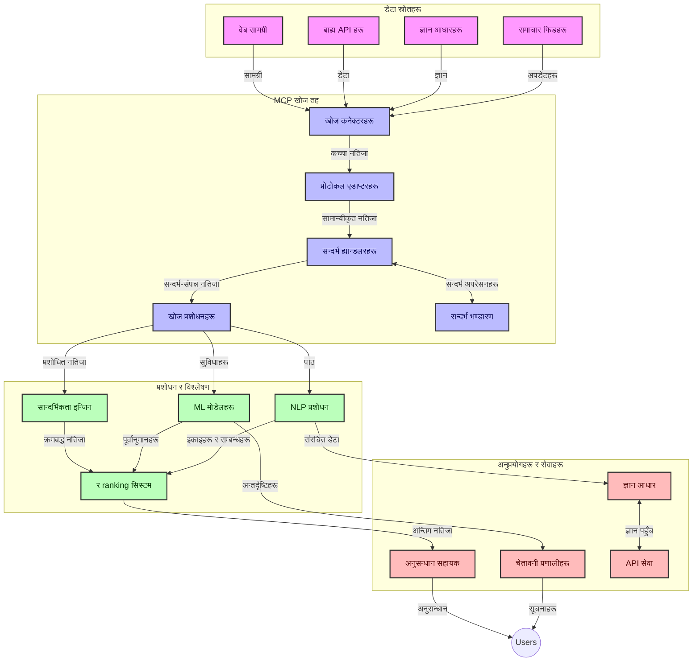
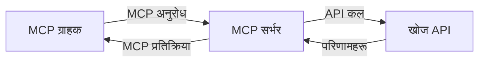
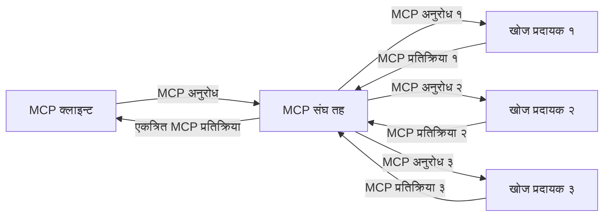
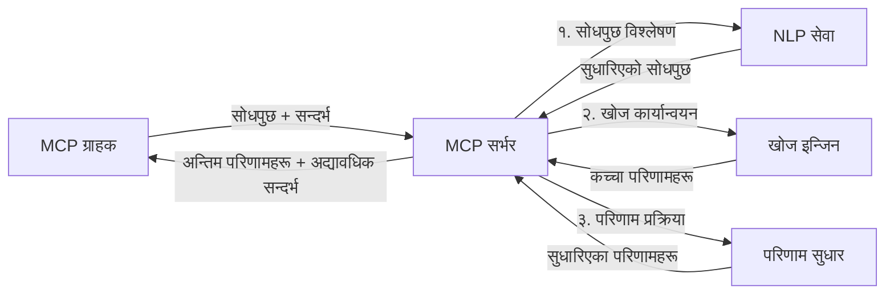

# वास्तविक-समय वेब खोजका लागि मोडेल सन्दर्भ प्रोटोकल

## अवलोकन

वास्तविक-समय वेब खोज आजको सूचना-संचालित वातावरणमा अनिवार्य भएको छ, जहाँ अनुप्रयोगहरूले इन्टरनेटभरि अद्यावधिक जानकारी तुरुन्त पहुँच गर्न आवश्यक पर्छ प्रासंगिक र समयमै जवाफहरू प्रदान गर्न। मोडेल सन्दर्भ प्रोटोकल (MCP) यी वास्तविक-समय खोज प्रक्रियाहरूलाई अनुकूलन गर्ने महत्वपूर्ण प्रगतिलाई प्रतिनिधित्व गर्दछ, खोज दक्षता बढाउँदै, सन्दर्भीय अखण्डता कायम राख्दै, र समग्र प्रणाली प्रदर्शन सुधार गर्दै।

यो मोड्युलले कसरी MCP ले वास्तविक-समय वेब खोज रूपान्तरण गर्छ भनेर अन्वेषण गर्दछ, AI मोडेलहरू, खोज ईन्जिनहरू, र अनुप्रयोगहरूबीच सन्दर्भ व्यवस्थापनको लागि एक मानकीकृत दृष्टिकोण प्रदान गर्दै।

### तपाईंले के सिक्नुहुनेछ

यस विस्तृत मार्गदर्शनमा, तपाईं पत्ता लगाउनुहुनेछ:

- कसरी MCP ले AI मोडेलहरू र वास्तविक-समय वेब खोज क्षमताहरूबीच एक सहज पुल सिर्जना गर्छ
- MCP मार्फत कुशल र स्केलेबल खोज समाधानहरू कार्यान्वयन गर्ने वास्तुकला ढाँचा
- बहुविध क्वेरीहरू र अन्तरक्रियाहरूमा खोज सन्दर्भ संरक्षण गर्ने प्रविधिहरू
- विभिन्न खोज परिदृश्यहरूको लागि Python र JavaScript मा व्यावहारिक कोड कार्यान्वयनहरू
- MCP-सञ्चालित खोज प्रणालीहरूमा प्रासंगिकता, ताजापन, र प्रदर्शनलाई सन्तुलन गर्ने विधिहरू

## वास्तविक-समय वेब खोजमा परिचय

वास्तविक-समय वेब खोज प्रविधिगत दृष्टिकोण हो जसले वेब-आधारित जानकारीको निरन्तर सोधपुछ, प्रशोधन, र विश्लेषणलाई अनुमति दिन्छ जस्तै यो प्रकाशित वा अद्यावधिक हुन्छ, प्रणालीहरूलाई न्यूनतम विलम्बतासँग ताजा र प्रासंगिक जानकारी प्रदान गर्न सक्षम पार्दछ। परम्परागत खोज प्रणालीहरू जुन घण्टा वा दिन पुराना सूचकांकित डाटामा आधारित हुन्छन् भन्दा फरक, वास्तविक-समय खोजले वेबबाट प्रत्यक्ष डाटा प्रयोग गर्छ, अनलाइन सामग्रीको वर्तमान अवस्थालाई प्रतिबिम्बित गर्ने अन्तर्दृष्टि र जानकारी प्रदान गर्दै।

### वास्तविक-समय वेब खोजका मुख्य अवधारणाहरू:

- **निरन्तर सोधपुछ प्रशोधन**: खोज क्वेरीहरू निरन्तर नयाँ डाटा स्रोतहरू विरुद्ध प्रशोधन गरिन्छ
- **ताजापन प्राथमिकता**: प्रणालीहरू ताजा जानकारीलाई प्राथमिकता दिन डिजाइन गरिएका हुन्छन्
- **प्रासंगिकता सन्तुलन**: प्रासंगिकता र ताजापन बीच सन्तुलन कायम रहन्छ
- **स्केलेबल वास्तुकला**: प्रणालीहरूले फरक-फरक क्वेरी भार र डाटा मात्रा सम्हाल्नुपर्छ
- **सन्दर्भीय समझ**: प्रासंगिक परिणामहरूको लागि प्रयोगकर्ता सन्दर्भलाई खोज दोहोर्याइमा कायम राख्न जरूरी छ
- **गतिशील क्वेरी पुनःरूपरेखा**: सन्दर्भ र अघिल्लो परिणामहरूका आधारमा क्वेरीहरू अनुकूलन गर्दै
- **बहु-स्रोत एकीकरण**: विभिन्न खोज प्रदायक र वेब स्रोतहरूबाट परिणामहरू संयोजन गर्दै
- **सामान्य भाषा समझ**: केवल कुञ्जीशब्दहरू भन्दा अर्थमा आधारित क्वेरी र सामग्री प्रशोधन
- **वास्तविक-समय रैंकिङ**: नयाँ जानकारी उपलब्ध हुँदै जाँदा निरन्तर परिणामको रैंक बदल्दै

### मोडेल सन्दर्भ प्रोटोकल र वास्तविक-समय वेब खोज

मोडेल सन्दर्भ प्रोटोकल (MCP) ले वास्तविक-समय वेब खोज वातावरणमा धेरै महत्वपूर्ण चुनौतीहरू समाधान गर्छ:

1. **खोज सन्दर्भ संरक्षण**: MCP ले कसरी सन्दर्भलाई वितरण गरिएको खोज कम्पोनेन्टहरूमा कायम राख्ने मानकीकृत बनाउँछ, AI मोडेल र प्रशोधन नोडहरूलाई सान्दर्भिक क्वेरी इतिहास र प्रयोगकर्ता प्राथमिकताहरू पहुँच सुनिश्चित गर्दै।

2. **कुशल क्वेरी व्यवस्थापन**: सन्दर्भ प्रसारणका संरचित मेकानिजमहरू प्रदान गरेर, MCP ले प्रत्येक खोज दोहोर्याइमा सन्दर्भ दोहोर्याउने अतिरिक्त बोझ घटाउँछ।

3. **परस्पर कार्यसम्पादनशीलता**: MCP ले विभिन्न खोज प्रविधिहरू र AI मोडेलहरूबीच सन्दर्भ साझेदारीका लागि साझा भाषा सिर्जना गर्छ, अधिक लचिलो र विस्तारयोग्य वास्तुकला सक्षम गर्दै।

4. **खोज-अनुकूलित सन्दर्भ**: MCP कार्यान्वयनहरूले कुन सन्दर्भ तत्त्वहरू प्रभावकारी खोजका लागि सबैभन्दा प्रासंगिक छन् प्राथमिकता दिन सक्छन्, प्रदर्शन र शुद्धता दुवैका लागि अनुकूलन गर्दै।

5. **अनुकूलनीय खोज प्रशोधन**: MCP मार्फत उचित सन्दर्भ व्यवस्थापनसँगै, खोज प्रणालीहरूले विकासशील प्रयोगकर्ता आवश्यकताहरू र सूचना वातावरणमा आधारित गतिशील रूपमा प्रशोधन समायोजन गर्न सक्छ।

आधुनिक अनुप्रयोगहरूमा समाचार सङ्कलनदेखि अनुसन्धान सहायकहरूसम्म, MCP को वेब खोज प्रविधिसँग एकीकरणले बृद्धिमान प्रासंगिक परिणामहरू प्रदान गर्न सक्ने अधिक बुद्धिमान, सन्दर्भ-सचेत खोज सक्षम बनाउँछ।

## सिकाइ उद्देश्यहरू

यस पाठ समाप्तिमा, तपाईं सक्नुहुनेछ:

- वास्तविक-समय वेब खोजका आधारभूत कुरा र आधुनिक अनुप्रयोगहरूमा यसको चुनौतीहरू बुझ्न
- मोडेल सन्दर्भ प्रोटोकल (MCP) ले कसरी वास्तविक-समय वेब खोज क्षमताहरू सुधार गर्छ व्याख्या गर्न
- लोकप्रिय फ्रेमवर्क र API हरू प्रयोग गरेर MCP-आधारित खोज समाधानहरू कार्यान्वयन गर्न
- MCP सँग स्केलेबल, उच्च-प्रदर्शन खोज वास्तुकलाहरू डिजाइन र डिप्लॉय गर्न
- MCP अवधारणाहरूलाई विभिन्न प्रयोग केसहरूमा लागू गर्न, जसमा सामान्य खोज, अनुसन्धान सहायता, र AI-वृद्ध वेब ब्राउजिङ समावेश छन्
- MCP-आधारित खोज प्रविधिहरूमा उदाउँदो प्रवृत्ति र भविष्य नवाचारहरू मूल्याङ्कन गर्न
- प्रयोगकर्ता अन्तरक्रियाबाट सिक्ने सन्दर्भ-सचेत खोज प्रणालीहरू विकास गर्न
- मानकीकृत MCP प्रोटोकल प्रयोग गरी AI सहायकहरूमा वेब खोज क्षमताहरू एकीकृत गर्न
- बहु-चरण खोज पाइपलाइनहरू सिर्जना गर्न जसले सन्दर्भको आधारमा परिणामहरू क्रमिक रूपमा परिमार्जन गर्छ
- व्यापक सन्दर्भ सचेतनता कायम राख्दै खोज प्रदर्शन अनुकूलन गर्न

### परिभाषा र महत्व

वास्तविक-समय वेब खोजले न्यूनतम विलम्बताका साथ निरन्तर सोधपुछ, पुन: प्राप्ति, र वेब-आधारित जानकारीको वितरण समावेश गर्दछ। परम्परागत खोज ईन्जिनहरूले जुन समय अन्तरालमा वेब क्रल गर्दै सूचकांक तयार गर्दछन् भन्दा फरक, वास्तविक-समय खोजले उपलब्ध हुने वित्तिकै जानकारी सतहमा ल्याउन लक्ष्य राख्छ, सबैभन्दा वर्तमान सामग्रीमा तुरुन्त पहुँच सक्षम पार्दै।

वास्तविक-समय वेब खोजका प्रमुख विशेषताहरू समावेश छन्:

- **ताजापन**: हालैको सामग्री र अपडेटहरूलाई प्राथमिकता दिने
- **निरन्तर प्रशोधन**: नयाँ जानकारीका लागि निरन्तर निगरानी गर्ने
- **क्वेरी अनुकूलन**: सन्दर्भ र प्रतिक्रिया आधारित खोज क्वेरीहरू संशोधन गर्ने
- **तत्काल वितरण**: न्यूनतम विलम्बमा खोज परिणामहरू प्रदान गर्ने
- **सन्दर्भ धारण**: सुधारिएको प्रासंगिकताका लागि अघिल्लो क्वेरीहरूमा आधारित बनाउने

### परम्परागत वेब खोजमा चुनौतीहरू

परम्परागत वेब खोज दृष्टिकोणहरू वास्तविक-समय परिदृश्यहरूमा लागू गर्दा केही सीमाहरूको सामना गर्छन्:

1. **सन्दर्भ खण्डीकरण**: बहुविध क्वेरीहरूको बीच खोज सन्दर्भ कायम राख्न कठिनाइ
2. **सूचना ताजापन**: सबैभन्दा ताजा जानकारी पहुँच र प्राथमिकता दिन चुनौतीहरू
3. **एकीकरण जटिलता**: खोज प्रणालीहरू र अनुप्रयोगहरूबीच परस्पर कार्यसम्पादनशीलताका समस्या
4. **विलम्ब समस्या**: व्यापक खोज र प्रतिक्रिया समय आवश्यकताहरू बीच सन्तुलन
5. **प्रासंगिकता ट्यूनिंग**: ताजापन प्राथमिकता दिने क्रममा शुद्धता र प्रासंगिकता सुनिश्चित गर्ने

## खोजका लागि मोडेल सन्दर्भ प्रोटोकल (MCP) बुझ्न

### खोज सन्दर्भहरूमा MCP के हो?

मोडेल सन्दर्भ प्रोटोकल (MCP) भनेको AI मोडेलहरू र अनुप्रयोगहरूबीच कुशल अन्तरक्रिया सजिलो बनाउन डिजाइन गरिएको एक मानकीकृत सञ्चार प्रोटोकल हो। वास्तविक-समय वेब खोज सन्दर्भमा, MCP ले निम्नहरूका लागि फ्रेमवर्क प्रदान गर्दछ:

- क्वेरी अनुक्रमहरूमा खोज सन्दर्भ संरक्षण
- खोज क्वेरी र परिणामहरूको स्वरुप मानकीकृत बनाउने
- खोज प्यारामिटरहरू र परिणामहरूको प्रसारणलाई अनुकूलन गर्ने
- मोडेल-देखि-खोज ईन्जिन सञ्चार बढाउने

### मुख्य कम्पोनेन्टहरू र वास्तुकला

वास्तविक-समय वेब खोजका लागि MCP वास्तुकला केहि मुख्य कम्पोनेन्टहरूबाट बनेको हुन्छ:

1. **क्वेरी सन्दर्भ ह्यान्डलरहरू**: बहुविध क्वेरीहरूमा खोज सन्दर्भ व्यवस्थापन र संरक्षण गर्ने
2. **खोज प्रोसेसरहरू**: सन्दर्भ-सचेत प्रविधिहरू प्रयोग गरेर आउने खोज अनुरोधहरू प्रशोधन गर्ने
3. **प्रोटोकल एडाप्टरहरू**: विभिन्न खोज API हरूबीच रूपान्तरण गर्ने क्रममा सन्दर्भ संरक्षण गर्ने
4. **सन्दर्भ भण्डार**: खोज इतिहास र प्राथमिकताहरू कुशलतापूर्वक भण्डारण र पुन:प्राप्ति गर्ने
5. **खोज कनेक्टरहरू**: विभिन्न खोज ईन्जिन र वेब API हरूसँग जडान गर्ने



### MCP ले वास्तविक-समय वेब खोज कसरी सुधार गर्दछ

MCP ले परम्परागत वेब खोज चुनौतीहरू समाधान गर्छ:

- **सन्दर्भीय निरन्तरता**: सम्पूर्ण खोज सत्रमा क्वेरीहरू बीच सम्बन्ध कायम राख्दै
- **सञ्चारित प्रसारण अनुकूलन**: बौद्धिक सन्दर्भ व्यवस्थापन मार्फत खोज प्याराामिटरहरूमा अतिरेक घटाउँदै
- **मानकीकृत इन्टरफेसहरू**: खोज कम्पोनेन्टहरूका लागि निरन्तर API हरू प्रदान गर्दै
- **विलम्ब घटाउने**: कुशल सन्दर्भ ह्यान्डलिङमार्फत प्रशोधन अतिरिक्त घटाउँदै
- **सुधारिएको प्रासंगिकता**: बहुविध क्वेरीहरूमा प्रयोगकर्ताको उद्देश्य संरक्षण गरेर खोज प्रासंगिकता बढाउँदै

## एकीकरण र कार्यान्वयन

वास्तविक-समय वेब खोज प्रणालीहरूले दुबै प्रदर्शन र सन्दर्भ अखण्डता कायम राख्न सावधानीपूर्वक वास्तुकला डिजाइन र कार्यान्वयन आवश्यक छ। मोडेल सन्दर्भ प्रोटोकल AI मोडेल र खोज प्रविधिहरूलाई एकीकृत गर्न मानकीकृत दृष्टिकोण प्रदान गर्दछ, अधिक परिष्कृत, सन्दर्भ-सचेत खोज पाइपलाइनहरू सक्षम पार्दै।

### खोज वास्तुकलाहरूमा MCP एकीकरणको अवलोकन

वास्तविक-समय वेब खोज वातावरणहरूमा MCP कार्यान्वयन गर्दा केहि मुख्य विचारहरू छन्:

1. **खोज सन्दर्भ सिरियलाइजेसन**: MCP ले खोज अनुरोधहरू भित्र सन्दर्भीय जानकारी इन्कोडिङका लागि कुशल मेकानिजमहरू प्रदान गर्छ, सुनिश्चित गर्दै आवश्यक सन्दर्भ प्रशोधन पाइपलाइनभर क्वेरीसँगै जान्छ। यसमा खोज-सम्बन्धित मेटाडाटा को लागि अनुकूलन गरिएको मानकीकृत सिरियलाइजेसन ढाँचाहरू समावेश छन्।

2. **राज्यपूर्ण खोज प्रशोधन**: MCP ले सन्दर्भ प्रतिनिधित्वलाई खोज दोहोर्याइमा निरन्तर कायम राखेर अधिक बुद्धिमानी राज्यपूर्ण प्रशोधन सक्षम बनाउँछ। यो विशेष गरी बहु-चरण खोज पाइपलाइनहरूमा मूल्यवान छ जहाँ सन्दर्भ सुधारले परिणामहरू बढाउँछ।

3. **क्वेरी विस्तार र सुधार**: MCP कार्यान्वयनहरूले संचयी सन्दर्भमा आधारित परिष्कृत क्वेरी विस्तार र सुधारलाई सहज बनाउन सक्छ, जसले खोज सत्र उन्नत हुँदै जाँदा प्रासंगिक परिणामहरू बढाउँछ।

4. **परिणाम क्यासिङ र प्राथमिकता**: सन्दर्भ ह्यान्डलिङ मानकीकृत गरेर, MCP ले परिणाम क्यासिङ र प्राथमिकतामा सहायता गर्दछ, कम्पोनेन्टहरूले विकासशील खोज सन्दर्भ अनुसार अनुकूलन गर्न सक्ने।

5. **खोज संघीयता र सङ्कलन**: MCP ले विभिन्न ब्याकएन्डहरूमा खोजको अधिक परिष्कृत संघीयता सहज बनाउँछ सन्दर्भका संरचित प्रतिनिधित्वहरू प्रदान गरेर, विविध स्रोतबाट परिणामहरूको अर्थपूर्ण सङ्कलन सक्षम पार्दै।

MCP को विभिन्न खोज प्रविधिहरूमा कार्यान्वयनले सन्दर्भ व्यवस्थापनमा एकीकृत दृष्टिकोण सिर्जना गर्छ, विशेष अनुकूलन एकीकरण कोडको आवश्यकतालाई घटाउँदै र खोज क्वेरीहरू विकास हुँदै गर्दा अर्थपूर्ण सन्दर्भ कायम राख्ने प्रणालीको क्षमता बढाउँदै।

### विभिन्न वेब खोज कार्यान्वयनहरूमा MCP

यी उदाहरणहरूले वर्तमान MCP विशिष्टता अनुसरण गर्दछन् जुन JSON-RPC आधारित प्रोटोकलमा केन्द्रित छ र फरक ट्रान्सपोर्ट मेकानिजमहरू छन्। कोडले कसरी तपाईंले अनुकूलित खोज एकीकरणहरू कार्यान्वयन गर्न सक्नुहुन्छ देखाउँछ जबकि पूर्ण रूपमा MCP प्रोटोकलसँग कम्प्याटिबल रहन्छ।


<details>
<summary>सामान्य खोज API सहित Python कार्यान्वयन</summary>

```python
import asyncio
import json
import aiohttp
from typing import Dict, Any, Optional, List
from contextlib import asynccontextmanager
from collections.abc import AsyncIterator

# मानक MCP पुस्तकालयहरू आयात गर्नुहोस्
from mcp.client.session import ClientSession
from mcp.client.streamable_http import streamablehttp_client
from mcp.types import TextContent, CreateMessageRequestParams, CreateMessageResult
from mcp.server.fastmcp import FastMCP

# वेब खोजको लागि FastMCP सर्भर सिर्जना गर्नुहोस्
search_server = FastMCP("WebSearch")

# वेब खोज सञ्चालनहरू व्यवस्थापन गर्न वर्ग
class WebSearchHandler:
    def __init__(self, api_endpoint: str, api_key: str):
        self.api_endpoint = api_endpoint
        self.api_key = api_key
        self.session = None
        
    async def initialize(self):
        """Initialize the HTTP session"""
        self.session = aiohttp.ClientSession(
            headers={"Authorization": f"Bearer {self.api_key}"}
        )
    
    async def close(self):
        """Close the HTTP session"""
        if self.session:
            await self.session.close()
            
    async def perform_search(self, query: str, max_results: int = 5, 
                           include_domains: List[str] = None, 
                           exclude_domains: List[str] = None,
                           time_period: str = "any") -> Dict[str, Any]:
        """Perform web search using the search API"""
        # खोज प्यारामिटरहरू बनाउनुहोस्
        search_params = {
            "q": query,
            "limit": max_results,
            "time": time_period
        }
        
        if include_domains:
            search_params["site"] = ",".join(include_domains)
            
        if exclude_domains:
            search_params["exclude_site"] = ",".join(exclude_domains)
        
        # खोज अनुरोध प्रदर्शन गर्नुहोस्
        try:
            async with self.session.get(
                self.api_endpoint,
                params=search_params
            ) as response:
                if response.status != 200:
                    error_text = await response.text()
                    raise Exception(f"Search API error: {response.status} - {error_text}")
                
                search_data = await response.json()
                
                # API-विशिष्ट प्रतिक्रिया मानक ढाँचामा रूपान्तरित गर्नुहोस्
                results = []
                for item in search_data.get("results", []):
                    results.append({
                        "title": item.get("title", ""),
                        "url": item.get("url", ""),
                        "snippet": item.get("snippet", ""),
                        "date": item.get("published_date", ""),
                        "source": item.get("source", "")
                    })
                
                return {
                    "query": query,
                    "totalResults": len(results),
                    "results": results
                }
        except Exception as e:
            print(f"Search API request error: {e}")
            raise

# खोज ह्यान्डलर आरम्भ गर्नुहोस्
search_handler = WebSearchHandler(
    api_endpoint="https://api.search-service.example/search",
    api_key="your-api-key-here"
)

# खोज ह्यान्डलर व्यवस्थापन गर्न lifespan सेटअप गर्नुहोस्
@asyncio.asynccontextmanager
async def app_lifespan(server: FastMCP):
    """Manage application lifecycle"""
    await search_handler.initialize()
    try:
        yield {"search_handler": search_handler}
    finally:
        await search_handler.close()

# सर्भरको लागि lifespan सेट गर्नुहोस्
search_server = FastMCP("WebSearch", lifespan=app_lifespan)

# वेब खोज उपकरण दर्ता गर्नुहोस्
@search_server.tool()
async def web_search(query: str, max_results: int = 5, 
                   include_domains: List[str] = None,
                   exclude_domains: List[str] = None,
                   time_period: str = "any") -> Dict[str, Any]:
    """
    Search the web for information
    
    Args:
        query: The search query
        max_results: Maximum number of results to return (default: 5)
        include_domains: List of domains to include in search results
        exclude_domains: List of domains to exclude from search results
        time_period: Time period for results ("day", "week", "month", "any")
        
    Returns:
        Dictionary containing search results
    """
    ctx = search_server.get_context()
    search_handler = ctx.request_context.lifespan_context["search_handler"]
    
    results = await search_handler.perform_search(
        query=query,
        max_results=max_results,
        include_domains=include_domains,
        exclude_domains=exclude_domains,
        time_period=time_period
    )
    
    return results

# उदाहरण ग्राहक प्रयोग
async def client_example():
    # Streamable HTTP ट्रान्सपोर्ट प्रयोग गरेर खोज सर्भरसँग जडान हुनुहोस्
    async with streamablehttp_client("http://localhost:8000/mcp") as (read, write, _):
        async with ClientSession(read, write) as session:
            # जडान आरम्भ गर्नुहोस्
            await session.initialize()
            
            # web_search उपकरण कल गर्नुहोस्
            search_results = await session.call_tool(
                "web_search", 
                {
                    "query": "latest developments in AI and Model Context Protocol",
                    "max_results": 5,
                    "time_period": "day",
                    "include_domains": ["github.com", "microsoft.com"]
                }
            )
            
            print(f"Search results: {search_results}")

# सर्भर सञ्चालन उदाहरण
if __name__ == "__main__":
    # Streamable HTTP ट्रान्सपोर्टसँग सर्भर चलाउनुहोस्
    search_server.run(transport="streamable-http")
```
</details> 

<details>
<summary>ब्राउजर-आधारित खोज सहित JavaScript कार्यान्वयन</summary>


```javascript
// वेब खोजको लागि MCP सर्भर कार्यान्वयन
import { McpServer, ResourceTemplate } from '@modelcontextprotocol/sdk/server/mcp.js';
import { StreamableHTTPServerTransport } from '@modelcontextprotocol/sdk/server/streamableHttp.js';
import { z } from 'zod';

// वेब खोजको लागि MCP सर्भर सिर्जना गर्नुहोस्
const searchServer = new McpServer({
    name: "BrowserSearch",
    description: "A server that provides web search capabilities"
});

// खोज सेवा वर्ग
class SearchService {
    constructor(searchApiUrl, apiKey) {
        this.searchApiUrl = searchApiUrl;
        this.apiKey = apiKey;
    }

    async performSearch(parameters) {
        const {
            query = '',
            maxResults = 5,
            includeDomains = [],
            excludeDomains = [],
            timePeriod = 'any'
        } = parameters;
        
        // प्यारामिटरहरूसँग खोज URL बनाउनुहोस्
        const url = new URL(this.searchApiUrl);
        url.searchParams.append('q', query);
        url.searchParams.append('limit', maxResults);
        url.searchParams.append('time', timePeriod);
        
        if (includeDomains.length > 0) {
            url.searchParams.append('site', includeDomains.join(','));
        }
        
        if (excludeDomains.length > 0) {
            url.searchParams.append('exclude_site', excludeDomains.join(','));
        }
        
        try {
            const response = await fetch(url.toString(), {
                method: 'GET',
                headers: {
                    'Authorization': `Bearer ${this.apiKey}`,
                    'Content-Type': 'application/json'
                }
            });
            
            if (!response.ok) {
                const errorText = await response.text();
                throw new Error(`Search API error: ${response.status} - ${errorText}`);
            }
            
            const searchData = await response.json();
            
            // API-विशेष प्रतिक्रिया लाई मानक ढाँचामा रूपान्तरण गर्नुहोस्
            const results = searchData.results?.map(item => ({
                title: item.title || '',
                url: item.url || '',
                snippet: item.snippet || '',
                date: item.published_date || '',
                source: item.source || ''
            })) || [];
            
            return {
                query,
                totalResults: results.length,
                results
            };
        } catch (error) {
            console.error('Search API request error:', error);
            throw error;
        }
    }
}

// खोज सेवा सुरु गर्नुहोस्
const searchService = new SearchService(
    'https://api.search-service.example/search',
    'your-api-key-here'
);

// सर्भरको लागि सन्दर्भ प्रदायक सेटअप गर्नुहोस्
searchServer.setContextProvider(() => {
    return {
        searchService
    };
});

// वेब खोज उपकरण दर्ता गर्नुहोस्
searchServer.tool({
    name: 'web_search',
    description: 'Search the web for information',
    parameters: {
        type: 'object',
        properties: {
            query: {
                type: 'string',
                description: 'The search query'
            },
            maxResults: {
                type: 'integer',
                description: 'Maximum number of results to return',
                default: 5
            },
            includeDomains: {
                type: 'array',
                items: { type: 'string' },
                description: 'List of domains to include in search results'
            },
            excludeDomains: {
                type: 'array',
                items: { type: 'string' },
                description: 'List of domains to exclude from search results'
            },
            timePeriod: {
                type: 'string',
                description: 'Time period for results',
                enum: ['day', 'week', 'month', 'any'],
                default: 'any'
            }
        },
        required: ['query']
    },
    handler: async (params, context) => {
        const { searchService } = context;
        return await searchService.performSearch(params);
    }
});

// खोज सर्भरसँग जडान गर्नको लागि उदाहरण ग्राहक कोड
import { Client } from '@modelcontextprotocol/sdk/client/index.js';
import { StreamableHTTPClientTransport } from '@modelcontextprotocol/sdk/client/streamableHttp.js';

async function connectToSearchServer() {
    // खोज सर्भरसँग जडान गर्नुहोस्
    const transport = new StreamableHTTPClientTransport(
        new URL('http://localhost:8000/mcp')
    );
    
    const client = new Client({
        name: 'search-client',
        version: '1.0.0'
    });
    
    await client.connect(transport);
    
    // खोज उपकरण कार्यान्वयन गर्नुहोस्
    const searchResults = await client.callTool({
        name: 'web_search',
        arguments: {
            query: 'Model Context Protocol implementation examples',
            maxResults: 10,
            timePeriod: 'week',
            includeDomains: ['github.com', 'docs.microsoft.com']
        }
    });
    
    console.log('Search results:', searchResults);
    
    // सफाई गर्नुहोस्
    await client.disconnect();
}

// सर्भर सुरू गर्नुहोस्
const transport = new StreamableHTTPServerTransport();
await searchServer.connect(transport);
console.log('Search server running at http://localhost:8000/mcp');

// अलग प्रक्रियामा वा सर्भर सुरू भएपछि
// connectToSearchServer().catch(console.error);
```
</details> 


## कोड उदाहरण अस्वीकरण

> **महत्त्वपूर्ण नोट**: तलका कोड उदाहरणहरूले मोडेल सन्दर्भ प्रोटोकल (MCP) को वेब खोज कार्यक्षमतासँग एकीकरण देखाउँछन्। यद्यपि तिनीहरू आधिकारिक MCP SDK हरूका ढाँचा र संरचनाहरू अनुसरण गर्दछन्, शैक्षिक प्रयोजनका लागि सरल बनाइएका छन्।
> 
> यी उदाहरणहरूले देखाउँछन्:
> 
> 1. **Python कार्यान्वयन**: FastMCP सर्भर कार्यान्वयन जसले वेब खोज उपकरण प्रदान गर्छ र बाह्य खोज API सँग जडान गर्छ। यो उदाहरणले उचित जीवनकाल व्यवस्थापन, सन्दर्भ ह्यान्डलिङ, र औजार कार्यान्वयन देखाउँछ आधिकारिक MCP Python SDK को ढाँचाहरू अनुसरण गर्दै। सर्भरले उत्पादन पर्यावरणका लागि पुरानो SSE ट्रान्सपोर्टको सट्टा सिफारिस गरिएको Streamable HTTP ट्रान्सपोर्ट प्रयोग गर्छ।
> 
> 2. **JavaScript कार्यान्वयन**: आधिकारिक MCP TypeScript SDK बाट FastMCP ढाँचामा आधारित TypeScript/JavaScript कार्यान्वयन जसले सही उपकरण परिभाषा र ग्राहक जडानहरूसहित खोज सर्भर सिर्जना गर्छ। यसले सत्र व्यवस्थापन र सन्दर्भ संरक्षणका लागि पछिल्ला सिफारिस गरिएको ढाँचाहरू अनुसरण गर्दछ।
> 
> यी उदाहरणहरूले उत्पादन प्रयोगका लागि थप त्रुटि ह्यान्डलिङ, प्रमाणिकरण, र विशेष API एकीकरण कोड आवश्यक पर्छ। देखाइएको खोज API अन्तबिन्दुहरू (`https://api.search-service.example/search`) प्लेसहोल्डर हुन् र यथार्थ खोज सेवा अन्तबिन्दुहरूसँग प्रतिस्थापन हुनु पर्छ।
> 
> पूर्ण कार्यान्वयन विवरण र सबैभन्दा नयाँ दृष्टिकोणहरूका लागि, कृपया आधिकारिक MCP विशिष्टता (https://spec.modelcontextprotocol.io/) र SDK दस्तावेजहरू समावेश गर्नुहोस्।

## मुख्य अवधारणाहरू

### मोडेल सन्दर्भ प्रोटोकल (MCP) फ्रेमवर्क

यसको आधारमा, मोडेल सन्दर्भ प्रोटोकल AI मोडेलहरू, अनुप्रयोगहरू, र सेवाहरूलाई सन्दर्भ आदानप्रदान गर्न मानकीकृत तरिका प्रदान गर्छ। वास्तविक-समय वेब खोजमा, यो फ्रेमवर्क सुसंगत, बहु-पटक खोज अनुभवहरू सिर्जना गर्न आवश्यक छ। प्रमुख कम्पोनेन्टहरू समावेश छन्:

1. **क्लाइंट-सर्भर वास्तुकला**: MCP ले खोज क्लाइंटहरू (अनुरोधकर्ताहरू) र खोज सर्भरहरू (प्रदायकहरू) बीच स्पष्ट पृथक्करण स्थापनागर्छ, लचिलो डिप्लोयमेन्ट मोडेलहरूका लागि अनुमति गर्दै।

2. **JSON-RPC सञ्चार**: प्रोटोकलले JSON-RPC प्रयोग गर्दछ सन्देश आदानप्रदानका लागि, वेब प्रविधिहरू संग अनुकूल हुने र फरक प्लेटफर्महरूमा सजिलै कार्यान्वयन गर्न मिल्ने।

3. **सन्दर्भ व्यवस्थापन**: MCP ले बहुविध अन्तरक्रियाहरूमा खोज सन्दर्भ कायम राख्ने, अद्यावधिक गर्ने, र उपयोग गर्ने संरचित विधिहरू परिभाषित गर्दछ।

4. **औजार परिभाषा**: खोज क्षमताहरू मानकीकृत उपकरणहरू रूपमा प्रकट गरिन्छ जसका स्पष्ट प्यारामिटर र फिर्ता मानहरू हुन्छन्।

5. **स्ट्रिमिङ समर्थन**: प्रोटोकलले स्ट्रिमिङ परिणामहरू समर्थन गर्दछ, वास्तविक-समय खोजका लागि आवश्यक जहाँ परिणामहरू क्रमिक रूपमा आइरहन सक्छन्।

### वेब खोज एकीकरण ढाँचाहरू

MCP लाई वेब खोजसँग एकीकृत गर्दा, केहि ढाँचाहरू देखा पर्छन्:

#### 1. प्रत्यक्ष खोज प्रदायक एकीकरण



यस ढाँचामा, MCP सर्भरले एक वा एकभन्दा बढी खोज API हरू सँग प्रत्यक्ष अन्तरफेस गर्छ, MCP अनुरोधहरूलाई API-विशिष्ट कलहरूमा अनुवाद गर्दै र परिणामहरू MCP प्रतिक्रियाहरूको रूपमा फर्म्याट गर्दै।

#### 2. सन्दर्भ संरक्षण सहित संघीय खोज



यस ढाँचाले खोज क्वेरीहरूलाई बहुविध MCP-अनुकूल खोज प्रदायकहरूमा वितरण गर्छ, प्रत्येक सम्भवतः विभिन्न प्रकारका सामग्री वा खोज क्षमतामा विशेषज्ञता राख्छ, जबकि एकीकृत सन्दर्भ कायम राख्दै।

#### 3. सन्दर्भ-सम्पन्न खोज श्रृंखला



यस ढाँचामा, खोज प्रक्रिया बहु-चरणहरूमा विभाजित हुन्छ, प्रत्येक चरणमा सन्दर्भ समृद्ध पारिँदै, क्रमिक रूपमा अझ प्रासंगिक परिणामहरू निकाल्दै।

### खोज सन्दर्भ कम्पोनेन्टहरू

MCP-आधारित वेब खोजमा, सामान्यतः सन्दर्भमा समावेश हुन्छ:

- **क्वेरी इतिहास**: सत्रमा अघिल्ला खोज क्वेरीहरू
- **प्रयोगकर्ता प्राथमिकता**: भाषा, क्षेत्र, सुरक्षित खोज सेटिङहरू
- **अन्तरक्रिया इतिहास**: कुन परिणामहरू क्लिक गरिए, परिणामहरूमा लाग्ने समय
- **खोज प्यारामिटरहरू**: फिल्टरहरू, क्रमबद्ध आदेशहरू, र अन्य खोज परिमार्जकहरू
- **डोमेन ज्ञान**: खोजसँग सम्बन्धित विषय-विशेष सन्दर्भ
- **कालिक सन्दर्भ**: समय-आधारित प्रासंगिकताका कारकहरू
- **स्रोत प्राथमिकता**: विश्वासिलो वा प्राथमिक सूचना स्रोतहरू

## प्रयोग केसहरू र अनुप्रयोगहरू

### अनुसन्धान र सूचना सङ्कलन

MCP ले अनुसन्धान कार्यप्रवाहहरूलाई बढावा दिन्छ:

- खोज सत्रहरूमा अनुसन्धान सन्दर्भ संरक्षण गर्दै
- अधिक परिष्कृत र सन्दर्भमैत्री क्वेरीहरू सक्षम गर्दै
- बहु-स्रोत खोज संघीयता समर्थन गर्दै
- खोज परिणामहरूबाट ज्ञान निष्कर्षण सहज बनाउँदै

### वास्तविक-समय समाचार र प्रवृत्ति अनुगमन

MCP-सञ्चालित खोज समाचार अनुगमनका लागि फाइदाहरू प्रदान गर्दछ:

- उदीयमान समाचार कथाहरूको लगभग वास्तविक-समय खोज
- सन्दर्भीय फिल्टरिङका साथ प्रासंगिक जानकारी
- बहुविध स्रोतमा विषय र इकाइ ट्र्याकिङ
- प्रयोगकर्ता सन्दर्भमा आधारित व्यक्तिगत समाचार चेतावनीहरू

### AI-वृद्ध वेब ब्राउजिङ र अनुसन्धान

MCP ले AI-वृद्ध वेब ब्राउजिङका नयाँ सम्भावनाहरू सिर्जना गर्छ:

- वर्तमान ब्राउजर क्रियाकलापमा आधारित सन्दर्भीय खोज सुझावहरू
- LLM-सञ्चालित सहायकहरूसँग वेब खोजको सहज एकीकरण
- सन्दर्भ कायम राख्दै बहु-पटक खोज सुधार
- सुधारिएको तथ्य-जाँच र जानकारी प्रमाणीकरण

## भविष्यका प्रवृत्ति र नवाचारहरू

### वेब खोजमा MCP को विकास

अगाडि हेर्दा, हामी MCP लाई निम्न कुराहरू सम्बोधन गर्न विकास हुँदै जाने अपेक्षा गर्दछौं:


- **बहुमाध्यम खोज**: पाठ, छवि, ध्वनि, र भिडियो खोजलाई सन्दर्भ कायम राखी समाहित गर्ने
- **केन्द्रविहीन खोज**: बिभाजित र संयुक्त खोज पारिस्थितिकी तन्त्रलाई समर्थन गर्ने
- **खोज गोप्याता**: सन्दर्भ-ज्ञान भएको गोप्य रक्षा गर्ने खोज यन्त्रहरू
- **प्रश्न बुझाइ**: प्राकृतिक भाषाको खोज प्रश्नहरूको गहिरो सेम्यान्टिक व्याख्या

### प्रविधिमा सम्भावित प्रगतिहरू

उदाउँदै गरेका प्रविधिहरू जसले MCP खोजको भविष्यलाई आकार दिनेछन्:

1. **न्यूरल खोज वास्तुकला**: MCP का लागि इम्बेडिङ-आधारित खोज प्रणालीहरू अनुकूलित
2. **व्यक्तिगत खोज सन्दर्भ**: व्यक्तिगत प्रयोगकर्ताका खोज बानीहरू समयसँग सिक्ने
3. **ज्ञान ग्राफ समावेशीकरण**: डोमेन-विशेष ज्ञान ग्राफले सन्दर्भकृत खोजलाई सुधार गर्ने
4. **क्रस-मोडल सन्दर्भ**: विभिन्न खोज माध्यमहरूमा सन्दर्भ कायम राख्ने

## व्यावहारिक अभ्यासहरू

### अभ्यास १: आधारभूत MCP खोज पाइपलाइन सेटअप गर्ने

यस अभ्यासमा, तपाईंले सिक्नु हुनेछ:
- एक आधारभूत MCP खोज वातावरण कन्फिगर गर्ने
- वेब खोजका लागि सन्दर्भ ह्यान्डलरहरू लागू गर्ने
- खोज पुनरावृत्तिहरूमा सन्दर्भ संरक्षण परीक्षण र मान्य गर्ने

### अभ्यास २: MCP खोज प्रयोग गरेर अनुसन्धान सहायक निर्माण गर्ने

पूर्ण अनुप्रयोग सिर्जना गर्नुहोस् जुन:
- प्राकृतिक भाषा अनुसन्धान प्रश्नहरू प्रशोधन गर्ने
- सन्दर्भ-ज्ञान भएको वेब खोज गर्छ
- बहु स्रोतहरूबाट जानकारी संयोजन गर्छ
- व्यवस्थित अनुसन्धान परिणामहरू प्रस्तुत गर्छ

### अभ्यास ३: MCP सँग बहु-स्रोत खोज संघ कार्यान्वयन गर्ने

उन्नत अभ्यास समावेश:
- बहु खोज ईन्जिनहरूमा सन्दर्भ-ज्ञानयुक्त प्रश्न प्रेषण
- परिणामको रैंकिङ र समेकन
- खोज परिणामहरूको सन्दर्भगत दोहोरोकरण हटाउने
- स्रोत-विशेष मेटाडाटा व्यवस्थापन

## अतिरिक्त स्रोतहरू

- [Model Context Protocol Specification](https://spec.modelcontextprotocol.io/) - आधिकारिक MCP स्पेसिफिकेसन र विस्तृत प्रोटोकल दस्तावेजीकरण
- [Model Context Protocol Documentation](https://modelcontextprotocol.io/) - विस्तृत ट्युटोरियलहरू र कार्यान्वयन मार्गदर्शकहरू
- [MCP Python SDK](https://github.com/modelcontextprotocol/python-sdk) - MCP प्रोटोकलको आधिकारिक Python कार्यान्वयन
- [MCP TypeScript SDK](https://github.com/modelcontextprotocol/typescript-sdk) - MCP प्रोटोकलको आधिकारिक TypeScript कार्यान्वयन
- [MCP Reference Servers](https://github.com/modelcontextprotocol/servers) - MCP सर्भरहरूको सन्दर्भ कार्यान्वयनहरू
- [Bing Web Search API Documentation](https://learn.microsoft.com/en-us/bing/search-apis/bing-web-search/overview) - माइक्रोसफ्टको वेब खोज API
- [Google Custom Search JSON API](https://developers.google.com/custom-search/v1/overview) - गुगलको प्रोग्रामेबल खोज ईन्जिन
- [SerpAPI Documentation](https://serpapi.com/search-api) - खोज ईन्जिन परिणाम पृष्ठ API
- [Meilisearch Documentation](https://www.meilisearch.com/docs) - खुला स्रोत खोज ईन्जिन
- [Elasticsearch Documentation](https://www.elastic.co/guide/index.html) - वितरित खोज र विश्लेषण ईन्जिन
- [LangChain Documentation](https://python.langchain.com/docs/get_started/introduction) - LLMहरू साथ अनुप्रयोग निर्माण

## सिक्ने परिणामहरू

यो मोड्युल पूरा गरेपछि, तपाईं सक्षम हुनुहुनेछ:

- वास्तविक-समय वेब खोजका आधारभूत सिद्धान्तहरू र त्यसका चुनौतीहरू बुझ्ने
- मोडेल सन्दर्भ प्रोटोकल (MCP) ले वास्तविक-समय वेब खोज क्षमताहरू कसरी सुधार गर्छ स्पष्ट पार्ने
- लोकप्रिय फ्रेमवर्क र API हरू प्रयोग गरी MCP-आधारित खोज समाधानहरू कार्यान्वयन गर्ने
- MCP सँग मापनयोग्य, उच्च-प्रदर्शन खोज वास्तुकला डिजाइन र परिचालन गर्ने
- MCP अवधारणाहरूलाई सेम्यान्टिक खोज, अनुसन्धान सहायताकार, र AI-संरचित ब्राउजिङसमेत विभिन्न प्रयोग केसहरूमा लागू गर्ने
- MCP-आधारित खोज प्रविधिहरूमा उदाउँदै गर्ने प्रवृत्ति र भविष्य नवप्रवर्तनहरूको मूल्याङ्कन गर्ने


### विश्वास र सुरक्षा सम्बन्धी विचारहरू

MCP-आधारित वेब खोज समाधानहरू कार्यान्वयन गर्दा, MCP स्पेसिफिकेसनबाट ती महत्वपूर्ण सिद्धान्तहरू सम्झनुहोस्:

1. **प्रयोगकर्ता सहमति र नियन्त्रण**: प्रयोगकर्ताहरूले सबै डाटा पहुँच र अपरेशनहरूमा स्पष्ट सहमति दिनुपर्छ र बुझ्नुपर्ने हुन्छ। यो वेब खोज कार्यान्वयनका लागि विशेष गरी महत्त्वपूर्ण छ जुन बाह्य डाटा स्रोतहरूसम्म पहुँच हुन सक्छ।

2. **डाटा गोप्याता**: खोज प्रश्न र परिणामहरूको उपयुक्त ह्यान्डलिङ सुनिश्चित गर्नुहोस्, विशेष गरी जब ती संवेदनशील जानकारी समावेश गर्न सक्छन्। प्रयोगकर्ता डाटाको सुरक्षा गर्न उपयुक्त पहुँच नियन्त्रण लागू गर्नुहोस्।

3. **उपकरण सुरक्षा**: खोज उपकरणहरूको लागि उचित प्राधिकरण र प्रमाणीकरण लागू गर्नुहोस्, किनकि ती मनमानी कोड कार्यान्वयन मार्फत सुरक्षा जोखिम हुन सक्छन्। उपकरण व्यवहारका वर्णनहरू अनट्रस्टेड मान्नुपर्छ यदि ती विश्वसनीय सर्भरबाट प्राप्त नभएको हो भने।

4. **स्पष्ट दस्तावेजीकरण**: तपाईंको MCP-आधारित खोज कार्यान्वयनका क्षमता, सीमाहरू, र सुरक्षा सम्बन्धी विचारहरू स्पष्ट रूपमा दस्तावेज गर्नुहोस्, MCP स्पेसिफिकेसनका कार्यान्वयन निर्देशहरू पालना गर्दै।

5. **दृढ सहमति प्रवाहहरू**: प्रत्येक उपकरणले के गर्छ भनेर प्रष्ट रूपमा व्याख्या गर्ने दिगो सहमति र प्राधिकरण प्रवाहहरू बनाउनुहोस्, विशेष गरी ती उपकरणहरूका लागि जुन बाह्य वेब स्रोतहरूसँग अन्तरक्रिया गर्छन्।

MCP सुरक्षा र विश्वास सम्बन्धी पूरै विवरणको लागि, [आधिकारिक दस्तावेज](https://modelcontextprotocol.io/specification/2025-11-25/basic/security_best_practices) हेर्नुहोस्।

## अब के गर्ने

- [5.12 Entra ID Authentication for Model Context Protocol Servers](../mcp-security-entra/README.md)

---

<!-- CO-OP TRANSLATOR DISCLAIMER START -->
**अस्वीकरण**:
यो दस्तावेज़ AI अनुवाद सेवा [Co-op Translator](https://github.com/Azure/co-op-translator) प्रयोग गरेर अनुवाद गरिएको हो। हामी सही हुन प्रयास गर्छौं, तर कृपया जानकार हुनुस् कि स्वचालित अनुवादमा त्रुटिहरू वा अशुद्धताहरू हुन सक्छन्। मूल दस्तावेज़ यसको मूल भाषामा आधिकारिक स्रोत मानिनुपर्छ। महत्वपूर्ण जानकारीका लागि व्यावसायिक मानव अनुवाद सिफारिस गरिन्छ। यस अनुवादको प्रयोगबाट उत्पन्न कुनै पनि गलत बुझाइ वा त्रुटिको लागि हामी जिम्मेवार छैनौं।
<!-- CO-OP TRANSLATOR DISCLAIMER END -->