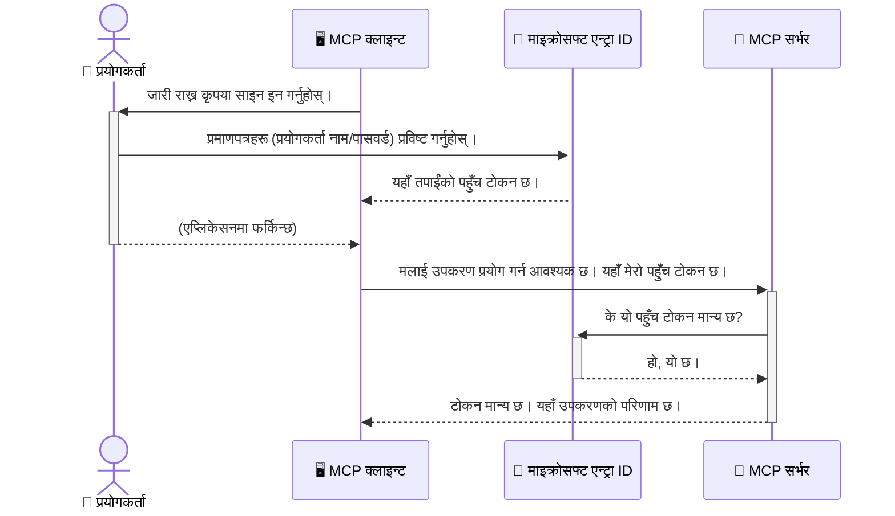

# एआई कार्यप्रवाहहरू सुरक्षित पार्ने: मोडेल सन्दर्भ प्रोटोकल सर्भरहरूका लागि Entra ID प्रमाणीकरण

> [!NOTE]
> यस पाठमा रहेको रिमोट सर्भर कोडले पुराना `/sse` र `/message`
> अन्तबिन्दुहरू सुरक्षित पार्दछ र MCP `2025-11-25` लक्षित गर्दछ। यसको पहिचान र टोकन-मान्यकरण
> अभ्यासहरू राख्नुहोस्, तर नयाँ
> कार्यान्वयनहरूको लागि `2026-07-28`-संगत स्ट्रिमेबल HTTP यातायात प्रयोग गर्नुहोस्।

## परिचय
तपाइँको मोडेल सन्दर्भ प्रोटोकल (MCP) सर्भरलाई सुरक्षित पार्नु तपाइँको घरको अगाडिको ढोका ताला लगाउनु जत्तिकै महत्त्वपूर्ण छ। तपाइँले आफ्नो MCP सर्भर खुला छोड्नुभयो भने तपाइँका उपकरण र डाटा अनधिकृत पहुँचमा पर्ने जोखिम हुन्छ, जसले सुरक्षा उल्लंघनहरू निम्त्याउन सक्छ। Microsoft Entra ID ले एउटा बलियो क्लाउड-आधारित पहिचान र पहुँच व्यवस्थापन समाधान प्रदान गर्दछ, जसले सुनिश्चित गर्दछ कि केवल अधिकृत प्रयोगकर्ताहरू र अनुप्रयोगहरू मात्र तपाइँको MCP सर्भरसँग अन्तरक्रिया गर्न सक्छन्। यस खण्डमा, तपाइँले Entra ID प्रमाणीकरण प्रयोग गरी आफ्नो AI कार्यप्रवाहहरू कसरी सुरक्षित गर्ने सिक्नु हुनेछ।

## सिक्ने उद्देश्यहरू
यस खण्डको अन्त्यसम्ममा, तपाइँ सक्षम हुनु हुनेछ:

- MCP सर्भरहरू सुरक्षित पार्नुको महत्त्व बुझ्न।
- Microsoft Entra ID र OAuth 2.0 प्रमाणीकरणका आधारहरू व्याख्या गर्न।
- सार्वजनिक र गोप्य क्लाइन्टहरूबीचको भिन्नता चिनारी गर्न।
- Entra ID प्रमाणीकरणलाई स्थानीय (सार्वजनिक क्लाइन्ट) र रिमोट (गोप्य क्लाइन्ट) MCP सर्भर परिदृश्यहरूमा कार्यान्वयन गर्न।
- AI कार्यप्रवाहहरू विकास गर्दा सुरक्षा उत्तम अभ्यासहरू लागू गर्न।

## सुरक्षा र MCP

जस्तै तपाइँ आफ्नो घरको अगाडिको ढोका खुला छोड्नु हुन्न, तपाइँले आफ्नो MCP सर्भरलाई सबैका लागि खुला छोड्नु हुँदैन। तपाइँका AI कार्यप्रवाहहरू सुरक्षित गर्नु मजबुत, विश्वासयोग्य, र सुरक्षित अनुप्रयोगहरू निर्माण गर्न आवश्यक छ। यस अध्यायले तपाइँलाई Microsoft Entra ID प्रयोग गरेर आफ्नो MCP सर्भरहरू कसरी सुरक्षित गर्ने परिचय गराउनेछ, जसले सुनिश्चित गर्दछ कि केवल अधिकृत प्रयोगकर्ता र अनुप्रयोगहरू मात्र तपाइँका उपकरण र डाटासँग अन्तरक्रिया गर्न सक्छन्।

## MCP सर्भरहरूको लागि सुरक्षा किन महत्त्वपूर्ण छ

कल्पना गर्नुहोस् कि तपाइँको MCP सर्भरमा एउटा उपकरण छ जसले इमेल पठाउन वा ग्राहक डाटाबेस पहुँच गर्न सक्छ। यदि सर्भर सुरक्षित छैन भने, कुनै पनि व्यक्तिले त्यो उपकरण प्रयोग गर्न सक्छ, जसले अनधिकृत डेटा पहुँच, स्प्याम, वा अन्य दुष्ट गतिविधिहरू तर्फ लैजान सक्छ।

प्रमाणीकरण कार्यान्वयन गर्दा, तपाइँ प्रत्येक अनुरोधलाई पुष्टि गर्नुहुन्छ, जसले प्रयोगकर्ता वा अनुप्रयोगको पहिचान प्रमाणित गर्दछ। यो तपाइँका AI कार्यप्रवाहहरू सुरक्षित पार्नको पहिलो र सबैभन्दा महत्वपूर्ण कदम हो।

## Microsoft Entra ID को परिचय

[**Microsoft Entra ID**](https://adoption.microsoft.com/microsoft-security/entra/) एउटा क्लाउड-आधारित पहिचान र पहुँच व्यवस्थापन सेवा हो। यसलाई तपाइँका अनुप्रयोगहरूका लागि एक सार्वभौमिक सुरक्षा गार्डको रूपमा सोच्नुहोस्। यसले प्रयोगकर्ताको पहिचान प्रमाणित गर्ने (प्रमाणीकरण) र उनीहरूलाई के गर्न अनुमति छ निर्धारण गर्ने (प्राधिकरण) जटिल प्रक्रियालाई व्यवस्थापन गर्दछ।

Entra ID प्रयोग गरेर, तपाइँले सक्षम बनाउन सक्नुहुन्छ:

- प्रयोगकर्ताहरूका लागि सुरक्षित साइन-इन सक्षम पार्न।
- एपीआईहरू र सेवाहरूलाई सुरक्षित पार्न।
- केन्द्रीकृत स्थानबाट पहुँच नीतिहरू व्यवस्थापन गर्न।

MCP सर्भरहरूको लागि, Entra ID ले तपाइँको सर्भरको क्षमता कसले पहुँच गर्न सक्छ भन्ने कुरा व्यवस्थापन गर्न एक बलियो र विश्वसनीय समाधान प्रदान गर्दछ।

---

## जादू बुझ्नुहोस्: Entra ID प्रमाणीकरण कसरी कार्य गर्छ

Entra ID ले प्रमाणीकरणको लागि **OAuth 2.0** जस्ता खुला मानकहरू प्रयोग गर्दछ। विवरणहरू जटिल हुन सक्छन्, तर मुख्य अवधारणा सरल छ र एउटा उदाहरणसहित बुझ्न सकिन्छ।

### OAuth 2.0 को एक सौम्य परिचय: भ्यालेट कुञ्जी

OAuth 2.0 लाई तपाइँको कारका लागि भ्यालेट सेवा जस्तो सोच्नुहोस्। जब तपाइँ रेस्टुरेन्ट पुग्नु हुन्छ, तपाइँले भ्यालेटलाई तपाइँको मास्टर कुञ्जी दिनुहुन्न। यसको सट्टा, तपाइँ भ्यालेट कुञ्जी दिनुहुन्छ जसमा सीमित अनुमति हुन्छ—यसले कार सुरु गर्न र ढोकाहरू ताला लगाउन सक्छ, तर ट्रंक या ग्लोव कम्पार्टमेन्ट खोल्न सक्दैन।

यस उदाहरणमा:

- **तपाइँ** हुनुहुन्छ **प्रयोगकर्ता**।
- **तपाइँको कार** हो **MCP सर्भर** यसको मूल्यवान् उपकरणहरू र डेटासँग।
- **भ्यालेट** हुन्छ **Microsoft Entra ID**।
- **पार्किङ्ग कर्मचारी** छ **MCP क्लाइन्ट** (सर्भर पहुँच गर्न कोसिस गर्ने अनुप्रयोग)।
- **भ्यालेट कुञ्जी** हो **प्रवेश टोकन**।

पहुँच टोकन एक सुरक्षित टेक्स्ट स्ट्रिंग हो जुन MCP क्लाइन्टले Entra ID बाट साइन-इन गरेपछि प्राप्त गर्छ। त्यसपछि क्लाइन्ट यस टोकनलाई प्रत्येक अनुरोधमा MCP सर्भरलाई प्रस्तुत गर्दछ। सर्भरले टोकनलाई प्रमाणित गर्न सक्छ कि अनुरोध वैध छ र क्लाइन्टसँग आवश्यक अनुमति छ, सबै तपाइँका वास्तविक प्रमाणहरू (जस्तै पासवर्ड) बिना नै।

### प्रमाणीकरण प्रवाह

यहाँ प्रक्रियाले व्यवहारमा कसरी काम गर्छ:



### Microsoft Authentication Library (MSAL) परिचय

कोडमा जानुअघि, तपाइँले उदाहरणहरूमा देख्नुपर्ने मुख्य कम्पोनेन्ट परिचय गराउन महत्त्वपूर्ण छ: **Microsoft Authentication Library (MSAL)**।

MSAL माइक्रोसफ्टले विकास गरेको पुस्तकालय हो जसले विकासकर्ताहरूलाई प्रमाणीकरण सहज पार्न ठूलो मद्दत गर्दछ। तपाइँ आफैले सबै जटिल कोड लेख्नुपर्ने सट्टा सुरक्षा टोकनहरू सम्हाल्न, साइन-इन व्यवस्थापन गर्न र सेसनहरू ताजा पार्न MSAL ले यो सबै काम गर्दछ।

MSAL जस्ता पुस्तकालय प्रयोग गर्न अत्यधिक सिफारिश गरिन्छ किनकि:

- **यो सुरक्षित छ:** यसले उद्योग-मानक प्रोटोकल र सुरक्षा उत्तम अभ्यासहरू कार्यान्वयन गर्दछ, जसले तपाइँको कोडमा जोखिम घटाउँछ।
- **यो विकासलाई सरल बनाउँछ:** यसले OAuth 2.0 र OpenID Connect प्रोटोकलहरूको जटिलता लुकेको हुन्छ, र तपाइँको अनुप्रयोगमा केही कोड पंक्तिहरूमा बलियो प्रमाणीकरण थप्न अनुमति दिन्छ।
- **यो मर्मत गरिएको छ:** माइक्रोसफ्टले MSAL लाई सक्रिय रूपमा मर्मत र अपडेट गर्दछ नयाँ सुरक्षा खतराहरू र प्लेटफर्म परिवर्तनहरूलाई समेट्न।

MSAL ले .NET, JavaScript/TypeScript, Python, Java, Go, र iOS र Android जस्ता मोबाइल प्लेटफर्महरू सहित विभिन्न भाषाहरू र अनुप्रयोग फ्रेमवर्कहरूलाई समर्थन गर्दछ। यसले समान प्रमाणीकरण ढाँचाहरू तपाइँको सम्पूर्ण प्रविधि स्ट्याकमा प्रयोग गर्न सक्षम बनाउँछ।

MSAL को बारेमा थप जान्नको लागि तपाइँ आधिकारिक [MSAL समीक्षा कागजात](https://learn.microsoft.com/entra/identity-platform/msal-overview) हेर्न सक्नुहुन्छ।

---

## Entra ID सँग तपाइँको MCP सर्भर सुरक्षित पार्ने: चरण-द्वारा-चरण मार्गदर्शन

अब, `stdio` मा सञ्चार गर्ने स्थानीय MCP सर्भरलाई Entra ID प्रयोग गरेर कसरी सुरक्षित गर्ने हेरौं। यो उदाहरणले **सार्वजनिक क्लाइन्ट** प्रयोग गर्दछ, जुन प्रयोगकर्ताको मेसिनमा चल्ने अनुप्रयोगहरू जस्तै डेस्कटप एप वा स्थानीय विकास सर्भरका लागि उपयुक्त छ।

### परिदृश्य 1: स्थानीय MCP सर्भर सुरक्षित पार्ने (सार्वजनिक क्लाइन्टसहित)

यस परिदृश्यमा, हामी यस्तो MCP सर्भर हेरिरहेका छौं जुन स्थानीय रूपमा चल्छ, `stdio` मार्फत सञ्चार गर्छ, र उपकरणहरू पहुँच गर्नुअघि प्रयोगकर्तालाई प्रमाणीकरण गर्न Entra ID प्रयोग गर्छ। सर्भरमा एउटा एकल उपकरण हुनेछ जुन Microsoft Graph API बाट प्रयोगकर्ताको प्रोफाइल जानकारी ल्याउँछ।

#### 1. Entra ID मा अनुप्रयोग सेटअप गर्ने

कुनै पनि कोड लेख्नु अघि, तपाइँले Microsoft Entra ID मा तपाइँको अनुप्रयोग दर्ता गर्नु आवश्यक छ। यसले Entra ID लाई तपाइँको अनुप्रयोगको बारेमा जानकार बनाउँछ र प्रमाणीकरण सेवा प्रयोग गर्ने अनुमति दिन्छ।

1. **[Microsoft Entra पोर्टल](https://entra.microsoft.com/)** मा जानुहोस्।
2. **App registrations** जानुहोस् र **New registration** मा क्लिक गर्नुहोस्।
3. तपाइँको अनुप्रयोगको नाम दिनुहोस् (जस्तै "मेरो स्थानीय MCP सर्भर")।
4. **Supported account types** को लागि **Accounts in this organizational directory only** छान्नुहोस्।
5. यो उदाहरणका लागि **Redirect URI** खाली छोड्न सक्नुहुन्छ।
6. **Register** मा क्लिक गर्नुहोस्।

दर्ता भएपछि, **Application (client) ID** र **Directory (tenant) ID** नोट गर्नुहोस्। तपाइँलाई यी कोडमा आवश्यक हुनेछ।

#### 2. कोड: एक विश्लेषण

प्रमाणीकरण सम्हाल्ने कोडका प्रमुख भागहरू हेरौं। यस उदाहरणको पूर्ण कोड [Entra ID - Local - WAM](https://github.com/Azure-Samples/mcp-auth-servers/tree/main/src/entra-id-local-wam) फोल्डरमा [mcp-auth-servers GitHub भण्डार](https://github.com/Azure-Samples/mcp-auth-servers) मा उपलब्ध छ।

**`AuthenticationService.cs`**

यो कक्षा Entra ID संग अन्तर्क्रिया सम्हाल्दछ।

- **`CreateAsync`**: यो विधिले MSAL (Microsoft Authentication Library) बाट `PublicClientApplication` आरम्भ गर्दछ। यसलाई तपाइँको अनुप्रयोगको `clientId` र `tenantId` सँग कन्फिगर गरिएको छ।
- **`WithBroker`**: यसले ब्रोकर (जस्तै Windows Web Account Manager) को प्रयोग सक्षम पार्दछ, जसले बढी सुरक्षित र सहज एकल साइन-इन अनुभव प्रदान गर्दछ।
- **`AcquireTokenAsync`**: यो मुख्य विधि हो। यसले पहिले मौन रूपमा टोकन पाउने प्रयास गर्दछ (अर्थात् यदि प्रयोगकर्तासँग पहिलेको मान्य सत्र छ भने पुनः साइन-इन गर्न बाध्य हुँदैन)। यदि मौन टोकन प्राप्त गर्न सकिन्न भने, यसले प्रयोगकर्तालाई अन्तर्क्रियात्मक रूपमा साइन-इन गर्न सुझाव दिन्छ।

```csharp
// Simplified for clarity
public static async Task<AuthenticationService> CreateAsync(ILogger<AuthenticationService> logger)
{
    var msalClient = PublicClientApplicationBuilder
        .Create(_clientId) // Your Application (client) ID
        .WithAuthority(AadAuthorityAudience.AzureAdMyOrg)
        .WithTenantId(_tenantId) // Your Directory (tenant) ID
        .WithBroker(new BrokerOptions(BrokerOptions.OperatingSystems.Windows))
        .Build();

    // ... cache registration ...

    return new AuthenticationService(logger, msalClient);
}

public async Task<string> AcquireTokenAsync()
{
    try
    {
        // Try silent authentication first
        var accounts = await _msalClient.GetAccountsAsync();
        var account = accounts.FirstOrDefault();

        AuthenticationResult? result = null;

        if (account != null)
        {
            result = await _msalClient.AcquireTokenSilent(_scopes, account).ExecuteAsync();
        }
        else
        {
            // If no account, or silent fails, go interactive
            result = await _msalClient.AcquireTokenInteractive(_scopes).ExecuteAsync();
        }

        return result.AccessToken;
    }
    catch (Exception ex)
    {
        _logger.LogError(ex, "An error occurred while acquiring the token.");
        throw; // Optionally rethrow the exception for higher-level handling
    }
}
```

**`Program.cs`**

यहाँ MCP सर्भर सेटअप गरिएको छ र प्रमाणीकरण सेवा समावेश गरिएको छ।

- **`AddSingleton<AuthenticationService>`**: यसले `AuthenticationService` लाई निर्भरता इञ्जेक्सन कन्टेनरमा दर्ता गर्छ, ताकि अनुप्रयोगका अन्य भागहरूले (जस्तै हाम्रो उपकरण) यसलाई प्रयोग गर्न सक्छन्।
- **`GetUserDetailsFromGraph` उपकरण**: यस उपकरणलाई `AuthenticationService` को एउटा उदाहरण चाहिन्छ। यसले पहिला `authService.AcquireTokenAsync()` कल गरेर मान्य पहुँच टोकन प्राप्त गर्छ। प्रमाणीकरण सफल भएमा, यो टोकन प्रयोग गरेर Microsoft Graph API कल गरी प्रयोगकर्ताको विवरण ल्याउँछ।

```csharp
// Simplified for clarity
[McpServerTool(Name = "GetUserDetailsFromGraph")]
public static async Task<string> GetUserDetailsFromGraph(
    AuthenticationService authService)
{
    try
    {
        // This will trigger the authentication flow
        var accessToken = await authService.AcquireTokenAsync();

        // Use the token to create a GraphServiceClient
        var graphClient = new GraphServiceClient(
            new BaseBearerTokenAuthenticationProvider(new TokenProvider(authService)));

        var user = await graphClient.Me.GetAsync();

        return System.Text.Json.JsonSerializer.Serialize(user);
    }
    catch (Exception ex)
    {
        return $"Error: {ex.Message}";
    }
}
```

#### 3. सबै कुरा कसरी सँगै काम गर्छ

1. जब MCP क्लाइन्टले `GetUserDetailsFromGraph` उपकरण प्रयोग गर्न खोज्छ, उपकरणले पहिले `AcquireTokenAsync` कल गर्दछ।
2. `AcquireTokenAsync` ले MSAL पुस्तकालयलाई मान्य टोकनको लागि जाँच गर्न ट्रिगर गर्दछ।
3. यदि टोकन फेला पर्दैन भने, MSAL ब्रोकर मार्फत प्रयोगकर्तालाई Entra ID खाताबाट साइन-इन गर्न भनिन्छ।
4. प्रयोगकर्ताले साइन-इन गरेपछि, Entra ID ले पहुँच टोकन जारी गर्दछ।
5. उपकरणले टोकन प्राप्त गरी Microsoft Graph API मा सुरक्षित कल गर्न प्रयोग गर्दछ।
6. प्रयोगकर्ताको विवरण MCP क्लाइन्टलाई फिर्ता गरिन्छ।

यस प्रक्रियाले सुनिश्चित गर्दछ कि केवल प्रमाणीकरण गरिएका प्रयोगकर्ताहरू मात्र उपकरण प्रयोग गर्न सक्छन्, र यसले तपाइँको स्थानीय MCP सर्भरलाई प्रभावकारी रूपमा सुरक्षित पार्दछ।

### परिदृश्य 2: रिमोट MCP सर्भर सुरक्षित पार्ने (गोप्य क्लाइन्टसहित)

जब तपाइँको MCP सर्भर रिमोट मेसिनमा चलिरहेको छ (जस्तै क्लाउड सर्भर) र HTTP स्ट्रिमिंग जस्तो प्रोटोकलमा सञ्चार गर्दैछ, सुरक्षा आवश्यकताहरू फरक हुन्छन्। यस अवस्थामा, तपाइँले **गोप्य क्लाइन्ट** र **अधिकृत कोड प्रवाह** प्रयोग गर्नुपर्छ। यो अधिक सुरक्षित विधि हो किनकि अनुप्रयोगका गोप्य कुरा कहिल्यै ब्राउजरमा प्रकट हुँदैनन्।

यो उदाहरणमा TypeScript-आधारित MCP सर्भर छ जसले HTTP अनुरोधहरू ह्यान्डल गर्न Express.js प्रयोग गर्दछ।

#### 1. Entra ID मा अनुप्रयोग सेटअप गर्ने

Entra ID मा सेटअप सार्वजनिक क्लाइन्ट जस्तै छ, तर एउटा मुख्य फरक छ: तपाइँले **क्लाइन्ट गोप्य कुञ्जी (client secret)** सिर्जना गर्न आवश्यक छ।

1. **[Microsoft Entra पोर्टल](https://entra.microsoft.com/)** मा जानुहोस्।
2. तपाइँको एप दर्तामा, **Certificates & secrets** ट्याबमा जानुहोस्।
3. **New client secret** मा क्लिक गर्नुहोस्, यसको वर्णन दिनुहोस्, र **Add** मा क्लिक गर्नुहोस्।
4. **महत्त्वपूर्ण:** गोप्य मान तुरुन्तै कपी गर्नुहोस्। तपाइँ यसलाई पुनः देख्न सक्नुहुन्न।
5. तपाइँले **Redirect URI** पनि कन्फिगर गर्नुपर्छ। **Authentication** ट्याबमा जानुहोस्, **Add a platform** क्लिक गर्नुहोस्, **Web** छान्नुहोस्, र तपाइँको अनुप्रयोगको लागि रिडाइरेक्ट URI प्रविष्ट गर्नुहोस् (जस्तै `http://localhost:3001/auth/callback`)।

> **⚠️ महत्त्वपूर्ण सुरक्षा नोट:** उत्पादन अनुप्रयोगहरूको लागि, Microsoft ले क्लाइन्ट गोप्य कुञ्जीहरूको सट्टा **प्रबन्धित पहिचान (Managed Identity)** वा **वर्कलोड पहिचान संघ (Workload Identity Federation)** जस्ता **बिना गोप्य प्रमाणीकरण** विधिहरू प्रयोग गर्न कडाइका साथ सिफारिस गर्दछ। क्लाइन्ट गोप्य कुञ्जीहरू सुरक्षा जोखिम ल्याउन सक्छन् किनकि तिनीहरू खुल्न वा लिक हुन सक्दछन्। प्रबन्धित पहिचानहरूले तपाइँको कोड वा कन्फिगरेसनमा प्रमाणपत्रहरू भण्डारण गर्नुपर्ने आवश्यकता हटाएर सुरक्षित विकल्प प्रदान गर्छन्।
>
> प्रबन्धित पहिचानहरू र तिनीहरूलाई कसरी कार्यान्वयन गर्ने बारे थप जानकारीको लागि, [Azure स्रोतहरूको लागि प्रबन्धित पहिचानहरू अवलोकन](https://learn.microsoft.com/entra/identity/managed-identities-azure-resources/overview) हेर्नुहोस्।

#### 2. कोड: एक विश्लेषण

यस उदाहरणले सेसन-आधारित दृष्टिकोण प्रयोग गर्दछ। प्रयोगकर्ताले प्रमाणीकरण गर्दा, सर्भरले पहुँच टोकन र रिफ्रेश टोकन सेसनमा भण्डारण गर्छ र प्रयोगकर्तालाई एउटा सेसन टोकन दिन्छ। यो सेसन टोकन पछि हुने अनुरोधहरूमा प्रयोग गरिन्छ। यस उदाहरणको पूर्ण कोड [Entra ID - Confidential client](https://github.com/Azure-Samples/mcp-auth-servers/tree/main/src/entra-id-cca-session) फोल्डरमा [mcp-auth-servers GitHub भण्डार](https://github.com/Azure-Samples/mcp-auth-servers) मा उपलब्ध छ।

**`Server.ts`**

यस फाइलले Express सर्भर र MCP यातायात तह सेट अप गर्दछ।

- **`requireBearerAuth`**: यो मिडलवेयर हो जसले `/sse` र `/message` अन्तबिन्दुहरू सुरक्षित पार्दछ। यो अनुरोधको `Authorization` हेडरमा मान्य बियरर टोकन छ कि छैन भनेर जाँच गर्छ।
- **`EntraIdServerAuthProvider`**: यो एउटा कस्टम क्लास हो जुन `McpServerAuthorizationProvider` इन्टरफेस लागू गर्दछ। यसले OAuth 2.0 प्रवाह सम्हाल्दछ।
- **`/auth/callback`**: यो अन्तबिन्दुले प्रयोगकर्ताले प्रमाणीकरण गरेपछि Entra ID बाट रिडाइरेक्ट सम्हाल्दछ। यसले अधिकृत कोडलाई पहुँच टोकन र रिफ्रेश टोकनमा विनिमय गर्दछ।

```typescript
// स्पष्टताका लागि सरल बनाइएको
const app = express();
const { server } = createServer();
const provider = new EntraIdServerAuthProvider();

// SSE अन्त बिन्दुलाई सुरक्षा गर्नुहोस्
app.get("/sse", requireBearerAuth({
  provider,
  requiredScopes: ["User.Read"]
}), async (req, res) => {
  // ... यातायातमा जडान गर्नुहोस् ...
});

// सन्देश अन्त बिन्दुलाई सुरक्षा गर्नुहोस्
app.post("/message", requireBearerAuth({
  provider,
  requiredScopes: ["User.Read"]
}), async (req, res) => {
  // ... सन्देश सम्हाल्नुहोस् ...
});

// OAuth 2.0 कलब्याक सम्हाल्नुहोस्
app.get("/auth/callback", (req, res) => {
  provider.handleCallback(req.query.code, req.query.state)
    .then(result => {
      // ... सफलता वा असफलता सम्हाल्नुहोस् ...
    });
});
```

**`Tools.ts`**

यस फाइलले MCP सर्भरले प्रदान गर्ने उपकरणहरू परिभाषित गर्दछ। `getUserDetails` उपकरण अघिल्लो उदाहरण जस्तै छ, तर यसले पहुँच टोकन सेसनबाट प्राप्त गर्दछ।

```typescript
// स्पष्टताका लागि सरल बनाइएको
server.setRequestHandler(CallToolRequestSchema, async (request) => {
  const { name } = request.params;
  const context = request.params?.context as { token?: string } | undefined;
  const sessionToken = context?.token;

  if (name === ToolName.GET_USER_DETAILS) {
    if (!sessionToken) {
      throw new AuthenticationError("Authentication token is missing or invalid. Ensure the token is provided in the request context.");
    }

    // सेसन स्टोरबाट Entra ID टोकन प्राप्त गर्नुहोस्
    const tokenData = tokenStore.getToken(sessionToken);
    const entraIdToken = tokenData.accessToken;

    const graphClient = Client.init({
      authProvider: (done) => {
        done(null, entraIdToken);
      }
    });

    const user = await graphClient.api('/me').get();

    // ... प्रयोगकर्ता विवरणहरू फिर्ता गर्नुहोस् ...
  }
});
```

**`auth/EntraIdServerAuthProvider.ts`**

यस कक्षाले निम्नलिखित तर्कहरू सम्हाल्दछ:

- प्रयोगकर्तालाई Entra ID साइन-इन पृष्ठमा रिडाइरेक्ट गर्ने।
- अधिकृत कोडलाई पहुँच टोकनमा विनिमय गर्ने।
- `tokenStore` मा टोकनहरू भण्डारण गर्ने।
- पहुँच टोकन समाप्त हुँदा ताजा टोकन प्राप्त गर्ने।


#### 3. यो सबै कसरी सँगै काम गर्दछ

1. जब प्रयोगकर्ताले पहिलोपटक MCP सर्भरमा जडान हुन प्रयास गर्छ, `requireBearerAuth` मिडलवेयरले उनीहरूसँग मान्य सत्र छैन भनेर थाहा पाउँछ र तिनीहरूलाई Entra ID साइन-इन पृष्ठमा पुनर्निर्देशित गर्छ।
2. प्रयोगकर्ताले आफ्नो Entra ID खातासँग साइन-इन गर्छ।
3. Entra ID ले प्रयोगकर्तालाई `/auth/callback` अन्त बिन्दुमा अनुमति कोडसहित फिर्ता पठाउँछ।
4. सर्भरले कोडलाई पहुँच टोकन र रिफ्रेस टोकनमा विनिमय गर्छ, तिनीहरूलाई संग्रह गर्छ, र एक सत्र टोकन सिर्जना गर्छ जुन ग्राहकलाई पठाइन्छ।
5. ग्राहकले अब यो सत्र टोकनलाई MCP सर्भरलाई गरिने सबै आगामी अनुरोधहरूको लागि `Authorization` हेडरमा प्रयोग गर्न सक्छ।
6. जब `getUserDetails` उपकरण कल गरिन्छ, यसले सत्र टोकन प्रयोग गरेर Entra ID पहुँच टोकन खोज्छ र त्यसपछि Microsoft Graph API कल गर्न प्रयोग गर्छ।

यो प्रवाह सार्वजनिक ग्राहक प्रवाह भन्दा जटिल छ, तर इन्टरनेट-सम्बन्धित अन्त बिन्दुहरूको लागि आवश्यक छ। किनकि दूरस्थ MCP सर्भरहरू सार्वजनिक इन्टरनेटमार्फत पहुँच योग्य छन्, तिनीहरूलाई अनाधिकृत पहुँच र सम्भावित आक्रमणबाट सुरक्षा गर्न अधिक कडा सुरक्षा उपायहरूको आवश्यकता हुन्छ।


## सुरक्षा उत्तम अभ्यासहरू

- **सधैं HTTPS प्रयोग गर्नुहोस्**: ग्राहक र सर्भरबीचको सञ्चारलाई एन्क्रिप्ट गरेर टोकनहरूलाई जबरजस्ती रोक्न सुरक्षित राख्नुहोस्।
- **भूमिका-आधारित पहुँच नियन्त्रण (RBAC) लागू गर्नुहोस्**: प्रयोगकर्ता प्रमाणित छ कि छैन मात्र जाँच नगर्नुहोस्; उनीहरू के गर्न अधिकृत छन् पनि जाँच गर्नुहोस्। तपाईं Entra ID मा भूमिका परिभाषित गर्न सक्नुहुन्छ र आफ्नो MCP सर्भरमा तिनीहरूलाई जाँच गर्न सक्नुहुन्छ।
- **निगरानी र अडिट गर्नुहोस्**: सबै प्रमाणीकरण घटनाहरूको लग राख्नुहोस् ताकि तपाईं शङ्का लाग्दो गतिविधि पत्ता लगाउन र जवाफ दिन सक्नुहुन्छ।
- **रिट लिमिटिङ र थ्रोटलिङ अघि बढाउनुहोस्**: Microsoft Graph र अन्य API हरूले दुरुपयोग रोक्न रिट लिमिटिङ लागू गर्छन्। HTTP 429 (धेरै अनुरोधहरू) प्रतिक्रियाहरूलाई राम्रोसँग हरेकाउन आफ्नो MCP सर्भरमा घातीय ब्याकअफ र पुन: प्रयास तर्क लागू गर्नुहोस्। API कलहरू घटाउन बारम्बार पहुँच गरिएका डाटालाई क्याचिङ गर्ने विचार गर्नुहोस्।
- **टोकन सुरक्षित भण्डारण**: पहुँच टोकनहरू र रिफ्रेस टोकनहरू सुरक्षित रूपमा भण्डारण गर्नुहोस्। स्थानीय अनुप्रयोगहरूको लागि सिस्टमको सुरक्षित भण्डारण संयन्त्र प्रयोग गर्नुहोस्। सर्भर अनुप्रयोगहरूको लागि एन्क्रिप्ट गरिएको भण्डारण वा Azure Key Vault जस्ता सुरक्षित की व्यवस्थापन सेवाहरू प्रयोग गर्न विचार गर्नुहोस्।
- **टोकन समाप्ति ह्यान्डलिंग**: पहुँच टोकनहरूको सीमित आयु हुन्छ। पुनः प्रमाणीकरण बिना निरन्तर प्रयोगकर्ता अनुभव कायम राख्न रिफ्रेस टोकनहरू प्रयोग गरेर स्वचालित टोकन रिफ्रेस लागू गर्नुहोस्।
- **Azure API Management प्रयोग गर्ने बारे सोच्नुहोस्**: आफ्नो MCP सर्भरमा सुरक्षा सिधै लागू गर्दा तपाईंलाई सूक्ष्म नियन्त्रण दिन्छ, तर Azure API Management जस्ता API गेटवेहरूले प्रमाणीकरण, अधिकृतता, रिट लिमिटिङ, र निगरानी जस्ता धेरै सुरक्षा चिन्ताहरू स्वचालित रूपमा सम्हाल्न सक्छन्। तिनीहरूले तपाईंका ग्राहक र MCP सर्भरहरूसँगको बीचमा केन्द्रीकृत सुरक्षा तह प्रदान गर्छन्। MCP सँग API गेटवेहरू प्रयोग गर्ने बारे थप विवरणका लागि हाम्रा [Azure API Management Your Auth Gateway For MCP Servers](https://techcommunity.microsoft.com/blog/integrationsonazureblog/azure-api-management-your-auth-gateway-for-mcp-servers/4402690) हेर्नुहोस्।


## प्रमुख बुँदाहरू

- तपाईंको MCP सर्भरलाई सुरक्षित राख्नु तपाईंको डाटा र उपकरणहरूको सुरक्षा गर्न अत्यन्त आवश्यक छ।
- Microsoft Entra ID प्रमाणीकरण र अधिकृतताका लागि एक दृढ र मापनयोग्य समाधान प्रदान गर्छ।
- स्थानीय अनुप्रयोगहरूका लागि **सार्वजनिक ग्राहक** र दूरस्थ सर्भरहरूको लागि **गोप्य ग्राहक** प्रयोग गर्नुहोस्।
- **अधिकारिकरण कोड प्रवाह** वेब अनुप्रयोगहरूको लागि सबैभन्दा सुरक्षित विकल्प हो।


## अभ्यास

1. तपाईंले बनाउने सोचिरहेको MCP सर्भर कस्तो हुनेछ? के त्यो स्थानीय सर्भर हो वा दूरस्थ सर्भर?
2. तपाईंको उत्तरको आधारमा, तपाईं सार्वजनिक वा गोप्य ग्राहकको प्रयोग गर्नुहुन्छ?
3. Microsoft Graph सँग कार्यहरू गर्न तपाईंको MCP सर्भरले के अनुमति अनुरोध गर्नेछ?


## व्यावहारिक अभ्यासहरू

### अभ्यास 1: Entra ID मा अनुप्रयोग दर्ता गर्नुहोस्
Microsoft Entra पोर्टलमा जानुहोस्।
तपाईंको MCP सर्भरका लागि नयाँ अनुप्रयोग दर्ता गर्नुहोस्।
अनुप्रयोग (ग्राहक) ID र निर्देशिका (किरायेदार) ID रेकर्ड गर्नुहोस्।

### अभ्यास 2: स्थानीय MCP सर्भर सुरक्षा (सार्वजनिक ग्राहक)
- प्रयोगकर्ता प्रमाणीकरणका लागि MSAL (Microsoft Authentication Library) एकीकरण गर्न कोड उदाहरण पालना गर्नुहोस्।
- Microsoft Graph बाट प्रयोगकर्ता विवरण ल्याउने MCP उपकरण कल गरेर प्रमाणीकरण प्रवाह परीक्षण गर्नुहोस्।

### अभ्यास 3: दूरस्थ MCP सर्भर सुरक्षा (गोप्य ग्राहक)
- Entra ID मा गोप्य ग्राहक दर्ता गर्नुहोस् र ग्राहक गोप्य कुञ्जी सिर्जना गर्नुहोस्।
- तपाईंको Express.js MCP सर्भरलाई अधिकृत कोड प्रवाह प्रयोग गर्न कन्फिगर गर्नुहोस्।
- सुरक्षित अन्त बिन्दुहरू परीक्षण गर्नुहोस् र टोकन-आधारित पहुँच पुष्टि गर्नुहोस्।

### अभ्यास 4: सुरक्षा उत्तम अभ्यासहरू लागू गर्नुहोस्
- तपाईंको स्थानीय वा दूरस्थ सर्भरसँग HTTPS सक्षम गर्नुहोस्।
- तपाईंको सर्भर तार्किकमा भूमिका-आधारित पहुँच नियन्त्रण (RBAC) लागू गर्नुहोस्।
- टोकन समाप्ति ह्यान्डलिंग र सुरक्षित टोकन भण्डारण थप्नुहोस्।

## स्रोतहरू

1. **MSAL अवलोकन कागजात**  
   Microsoft Authentication Library (MSAL) ले कसरी सुरक्षित टोकन प्राप्तिलाई विभिन्न प्लेटफर्ममा सक्षम बनाउँछ जान्नुहोस्:  
   [MSAL Overview on Microsoft Learn](https://learn.microsoft.com/en-gb/entra/msal/overview)

2. **Azure-Samples/mcp-auth-servers GitHub रिपोजिटरी**  
   प्रमाणीकरण प्रवाह देखाउने MCP सर्भरहरूको सन्दर्भ कार्यान्वयनहरू:  
   [Azure-Samples/mcp-auth-servers on GitHub](https://github.com/Azure-Samples/mcp-auth-servers)

3. **Azure स्रोतहरूका लागि व्यवस्थापन गरिएका पहिचानहरूको अवलोकन**  
   प्रणाली वा प्रयोगकर्ता व्यवस्थापन गरिएका पहिचानहरू प्रयोग गरेर गोप्य कुञ्जीहरू हटाउने तरिका बुझ्नुहोस्:  
   [Managed Identities Overview on Microsoft Learn](https://learn.microsoft.com/en-us/entra/identity/managed-identities-azure-resources/)

4. **Azure API Management: MCP सर्भरहरूको लागि तपाईँको प्रमाणीकरण गेटवे**  
   MCP सर्भरहरूको लागि सुरक्षित OAuth2 गेटवेका रूपमा APIM प्रयोग गर्ने गहिरो अध्ययन:  
   [Azure API Management Your Auth Gateway For MCP Servers](https://techcommunity.microsoft.com/blog/integrationsonazureblog/azure-api-management-your-auth-gateway-for-mcp-servers/4402690)

5. **Microsoft Graph अनुमति सन्दर्भ**  
   Microsoft Graph का लागि प्रतिनिधित्व र अनुप्रयोग अनुमति हरूको व्यापक सूची:  
   [Microsoft Graph Permissions Reference](https://learn.microsoft.com/zh-tw/graph/permissions-reference)


## सिकाइ नतिजाहरू
यो खण्ड पूरा गरेपछि, तपाईं सक्षम हुनुहुनेछ:

- MCP सर्भरहरू र AI कार्यप्रवाहहरूका लागि प्रमाणीकरण किन महत्वपूर्ण छ व्याख्या गर्नुहोस्।
- स्थानीय र दूरस्थ MCP सर्भरका परिदृश्यहरूको लागि Entra ID प्रमाणीकरण सेटअप र कन्फिगर गर्नुहोस्।
- तपाईंको सर्भरको परिनियोजनको आधारमा उपयुक्त ग्राहक प्रकार (सार्वजनिक वा गोप्य) रोज्नुहोस्।
- सुरक्षित कोडिङ अभ्यासहरू लागू गर्नुहोस्, जसमा टोकन भण्डारण र भूमिका-आधारित अधिकृतता समावेश छन्।
- आफ्नो MCP सर्भर र त्यसका उपकरणहरूलाई अनाधिकृत पहुँचबाट विश्वस्तरूपमा सुरक्षा गर्नुहोस्।

## के आउँदैछ 

- [5.13 मोडेल कोन्टेक्स्ट प्रोटोकल (MCP) Microsoft Foundry सँग एकीकरण](../mcp-foundry-agent-integration/README.md)

---

<!-- CO-OP TRANSLATOR DISCLAIMER START -->
**अस्वीकरण**:
यो दस्तावेज़ AI अनुवाद सेवा [Co-op Translator](https://github.com/Azure/co-op-translator) प्रयोग गरेर अनुवाद गरिएको हो। हामी सही हुन प्रयास गर्छौं, तर कृपया जानकार हुनुस् कि स्वचालित अनुवादमा त्रुटिहरू वा अशुद्धताहरू हुन सक्छन्। मूल दस्तावेज़ यसको मूल भाषामा आधिकारिक स्रोत मानिनुपर्छ। महत्वपूर्ण जानकारीका लागि व्यावसायिक मानव अनुवाद सिफारिस गरिन्छ। यस अनुवादको प्रयोगबाट उत्पन्न कुनै पनि गलत बुझाइ वा त्रुटिको लागि हामी जिम्मेवार छैनौं।
<!-- CO-OP TRANSLATOR DISCLAIMER END -->