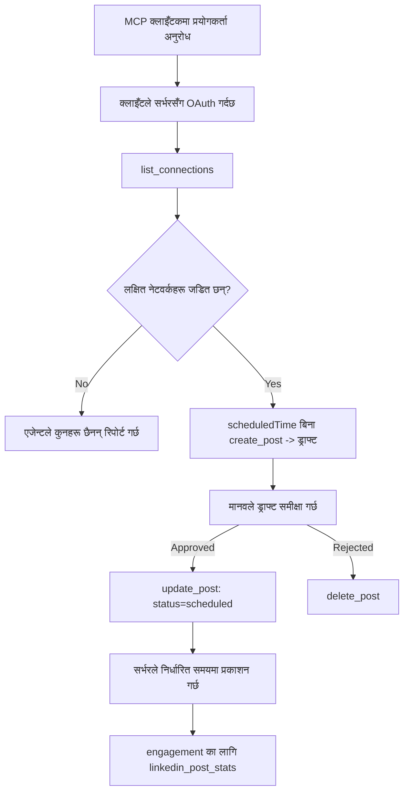

# केस स्टडी: एजेन्टबाट रिमोट MCP सर्भरसँग सामाजिक नेटवर्कहरूमा प्रकाशन

> **अस्वीकरण:** धेरै सेवाहरू र ओपन-सोर्स प्रोजेक्टहरूले सामाजिक नेटवर्कहरूमा प्रकाशन गर्न सक्छन्, र एक टोलीले प्रत्येक नेटवर्कको API सीधै इन्टिग्रेट गर्न सक्दछ। तलको अवस्था एउटा उदाहरणको रूपमा दिइएको छ कि कसरी **लेखन-सक्षम रिमोट MCP सर्भर** डिजाइन र उपयोग गर्न सकिन्छ। Publora एक व्यावसायिक सेवा हो जसमा एक निशुल्क तह पनि छ; यहाँ वर्णन गरिएको ढाँचाहरू कुनै पनि MCP सर्भरमा लागू हुन्छन् जुन प्रयोगकर्ताको तर्फबाट अपरिवर्तनीय कार्यहरू गर्छ।

## अवलोकन

एजेन्टहरू सामग्री तयार पार्न राम्रो हुन्छन् र वितरण गर्न कमजोर। मोडेलले केहि सेकेन्डमा रिलिज घोषण तयार पार्न सक्छ, तर त्यसपछि काम रोकियो: प्रकाशनको मतलब नेटवर्कको लागि एउटा API, नेटवर्कको लागि एउटा OAuth एप, र प्रत्येकका लागि फरक-मिडिया नियमहरू। अधिकांश टोलीहरूले यो समस्या समाधान गर्न पाठलाई हातले ब्राउजरमा कपी गर्छन्।

यो केस स्टडीले हेर्छ कि त्यो अन्तिम कदमलाई कसरी एकल रिमोट MCP सर्भरसँग बन्द गरिन्छ, र — जसलाई यो बनाउँदैछ — एउटा **लेखन-सक्षम** सर्भरले कुन डिजाइन निर्णयहरू सहि गर्नै पर्छ। डेटा पढ्न सजिलो छ। प्रकाशन होइन: गलत उपकरण कल दर्शकहरूले देख्छन् र फर्काउन सकिंदैन।

## परिदृश्य

एउटा सानो विकासकर्ता-संबन्धी टोली एजेन्ट (Claude, VS Code, Cursor — क्लाइन्टले मतलब गर्दैन) भित्र पोस्टहरू तयार पार्छ। उनीहरू एजेन्टलाई चाहन्छन्:

- कुन सामाजिक खाता जडान भएका छन् हेर्न,
- पोस्ट ड्राफ्ट गर्नु र मान्छेको स्वीकृतिका लागि ड्राफ्टमा राख्न,
- एउटा छवि संलग्न गर्न,
- चयन गरिएको समयमा धेरै नेटवर्कहरूमा तालिका गर्ने,
- र पछि यो कसरी प्रदर्शन गर्‍यो रिपोर्ट गर्ने।

महत्त्वपूर्ण कुरा, उनीहरू चाहन्छन् कि उनीहरूले अझै परीक्षण गरिरहेकामा एजेन्टले *गल्तीले* प्रकाशन गर्न नसकून्।

## प्रयोग गरिएका उपकरणहरू

- [Publora MCP Server](https://github.com/publora/mcp-server) — एक रिमोट MCP सर्भर (`streamable-http`) जसले प्रकाशन, तालिका, मिडिया र LinkedIn एनालिटिक्स उपकरणहरू उपलब्ध गराउँछ। आधिकारिक MCP रजिष्ट्रिमा `com.publora/mcp-server` रूपमा दर्ता गरिएको।

## चरण-द्वारा-चरण कार्यप्रवाह

1. **सर्भर जडान गर्नुहोस्।** OAuth बोल्ने क्लाइन्टहरूले सर्भरको आफ्नै सहमति स्क्रिनसँग PKCE सहित प्राधिकरण-कोड फ्लो पूरा गर्छन्; न बोल्ने क्लाइन्टहरू, जस्तै हेडलेस CLI हरूले, हेडरमा Publora API की प्रयोग गर्छन्। दुवै मार्गहरू समर्थित छन्, र कुन मार्ग पाइन्छ क्लाइन्टमा निर्भर गर्छ, सर्भरमा होइन।
2. **जडानहरू सूची बनाउनुहोस्।** एजेन्टले `list_connections` कल गर्छ र जडित खाताहरू तिनका पहिचानहरू सहित प्राप्त गर्छ।
3. **ड्राफ्ट गर्नुहोस्।** एजेन्टले अनिर्धारित समय *बिना* `create_post` कल गर्छ। पोस्ट ड्राफ्टको रूपमा संग्रहित हुन्छ — केही प्रकाशित हुँदैन।
4. **मिडिया संलग्न गर्नुहोस्।** सार्वजनिक छवि URL हरू उही कलमा पठाइन्छन्; सर्भर तिनीहरूलाई डाउनलोड र मान्य पार्छ।
5. **तालिका बनाउनुहोस्।** मान्छेले स्वीकृति दिएपछि, `update_post` ले स्थिति ISO 8601 समयमा तालिकाबद्धमा परिवर्तन गर्छ।
6. **मापन गर्नुहोस्।** LinkedIn का लागि, `linkedin_post_stats` पोस्ट लाइभ भएपछि सहभागिता फिर्ता गर्छ।

## उदाहरण प्रॉम्प्ट

```text
Which social accounts do I have connected?
Draft a post announcing our new changelog page, attach the screenshot at
https://example.com/changelog.png, and keep it as a draft — do not publish it.
Once I approve, schedule it to LinkedIn and Bluesky for tomorrow at 09:00 UTC.
```

## मरमेड फ्लोचार्ट



## टेक्निकल कार्यान्वयन

तलका पाठहरू यो केस स्टडीको सार्थक भाग हुन् जुन अन्यत्र उपयोग गर्न मिल्छ।

### खुला खोज, प्रमाणीकृत कार्यान्वयन

`tools/list` क्रेडेन्सियल बिना उपलब्ध हुन्छ; हरेक `tools/call` टोकन आवश्यक पर्छ
र अन्यथा `401` फर्काउँछ, जसमा `WWW-Authenticate` हेडर हुन्छ जसले
सुरक्षित-स्रोत मेटाडेटालाई निर्देशन गर्छ। सर्भरको पुरानो अन्तबिन्दुले पनि
प्रोटोकल संस्करणहरू `2026-07-28` भन्दा पहिलेका क्लाइन्टहरूको लागि
प्रमाणीकरणबिना `initialize` जवाफ दिन्छ; वर्तमान क्लाइन्टहरूले त्यो प्रयोग गर्दैनन्।

यो सर्भर-विशिष्ट विभाजनले रजिष्ट्रिज, सूचीहरू र क्लाइन्टहरूलाई
नाम, स्कीमा र व्याख्या बिना गुप्त देख्न दिने तर अज्ञात
कार्यान्वयन रोक्ने अनुमति दिन्छ। खुला खोज एक विन्यास विकल्प हो, MCP को आवश्यकता होइन; एक
सुरक्षित विन्यासले `tools/list` को लागि पनि प्राधिकरण आवश्यक पर्न सक्छ।

### दर्ता: गतिशील क्लाइन्ट दर्ता, र यसको विकल्प

सर्भरले `/.well-known/oauth-protected-resource` र `/.well-known/oauth-authorization-server` प्रचार गर्छ, र PKCE (`S256`) सहित प्राधिकरण-कोड फ्लो, रिफ्रेस टोकन, र **गतिशील क्लाइन्ट दर्ता** समर्थन गर्छ।

गतिशील दर्ताले पुराना क्लाइन्टहरूको लागि म्यानुअल चरण हटायो: बिना यसको,
प्रत्येक क्लाइन्टलाई विक्रेता बाट अगावै जारी गरिएको `client_id` चाहिन्छ।

यसलाई प्रतिलिपि बनाउन डिजाइनको सट्टा अनुकूलन व्यवहारको रूपमा व्यवहार गर्नुहोस्। `2026-07-28` स्पेसिफिकेशन संशोधनले गतिशील क्लाइन्ट दर्तालाई Client ID Metadata Documents मा स्थानान्तरण गर्‍यो, जहाँ क्लाइन्टले स्थिर HTTPS URL मा मेटाडाटा दस्तावेज होस्ट गर्छ र त्यो URL नै `client_id` हो। DCR हाल काम गरिरहे पनि, आजको सर्भरले CIMD को योजना बनाउनुपर्छ र DCR पुराना क्लाइन्टहरूका लागि मात्र राख्नुपर्छ।

### उपकरण व्याख्याहरू अलंकरण होइनन्

हरेक उपकरणसँग `title` र लागू इशाराहरू हुन्छन्: `readOnlyHint`, `destructiveHint`, `idempotentHint`, `openWorldHint`।

दुई कारणले तिनीहरूमा लगानी गर्नुहोस्। पहिलो, क्लाइन्टहरूले इशाराहरू प्रयोग गरेर प्रयोगकर्तासँग के पुष्टि गर्ने निर्णय गर्छन् — क्लाइन्टले रेड-ओनली हेरफेर स्वचालित चलाएर मेटाउने अघि स्वीकृति लिन सक्छ। स्पेसिफिकेशन स्पष्ट छ कि व्याख्या अविश्वासी इशारा हो, प्राधिकरण मेकानिजम होइन: तिनीहरूले क्लाइन्टले गर्ने प्रस्तावलाई रुप दिन्छन्, सर्भरमा केहि रोक्दैन, र सर्भरले आफ्ना नियमहरू लागू गर्नुपर्छ। दोस्रो, प्रमुख कनेक्टर निर्देशिकाहरूले अहिले *समिक्षाको लागि* तिनीहरू आवश्यक पार्छन्; उपकरणहरूमा शीर्षक र इशारा नभएका सर्भरहरूलाई ठीक काम गरे तापनि फिर्ता पठाइन्छ।

### पहिचानकर्ताहरू आविष्कार गर्न नसकिने बनाउनुहोस्

प्ल्याटफर्म आइडेन्टिफायरहरू अपारदर्शी स्ट्रिङहरू हुन् जुन `list_connections` ले फर्काउँछ र स्कीमा विवरणले स्पष्ट भन्छ कि तिनीहरूलाई यथावत् कपी गर्नुपर्छ र कहिल्यै अनुमान गर्न हुँदैन। सर्भरले अन्यथा अस्वीकार गर्छ।

मोडेलहरू सहज अनुमान गर्छन्। कुनै पनि लेखन-सक्षम सर्भरले मान्नु पर्छ कि आइडेन्टिफायर अन्ततः कल्पना गरिने छ र त्यो बाटो बोल्ड र छिटो असफल बनाउनु पर्छ, सम्भावित देखिने मानमा काम गर्नुुको सट्टा।

### प्रकाशन अघि असफल हुनुहोस्, कार्यान्वयनयोग्य सन्देशसँग

केही नेटवर्कहरूले मात्र पाठ पोस्ट नामञ्जुर गर्छन् र छवि वा भिडियो चाहिन्छ। पोस्ट तालिका गर्दा यसलाई मान्य गरिन्छ, र त्रुटिले प्लेटफर्म र अभाव रहेको आवश्यकतालाई नाम दिन्छ।

एजेन्टले "Instagram मा मिडिया चाहिन्छ — छवि वा भिडियो संलग्न गर्नुहोस्" बाट पुन: प्राप्ति गर्न सक्छ बिना अर्को राउन्ड ट्रिप। तर साधारण `400` बाट पुन: प्राप्ति गर्न सक्दैन।

### पुनः प्रयासहरू सुरक्षित बनाउनुहोस्

दुई उपकरणहरूले सामग्री बनाउँछन्, `create_post` र `update_post`, जसले एक इडेम्पोटेन्सी कुञ्जी स्वीकार्छन्: यसलाई एउटै अनुरोधसँग पुन: प्रयोग गर्दा मूल प्रतिक्रिया फेरि बजाइन्छ, दोस्रो पटक पोस्ट सिर्जना हुँदैन। एजेन्ट रनटाइमहरूले टाइमआउटमा पुनः प्रयास गर्छन्; बिना इडेम्पोटेन्सी, स्लो प्रतिक्रिया नक्कल प्रकाशन हुन्छ। अन्य लेखन उपकरणहरू — मेटाउने, मिडिया चरणहरू, LinkedIn प्रतिक्रियाहरू र टिप्पणीहरू — कुञ्जी लिँदैनन्, त्यसैले त्यहाँ पुनः प्रयास स्वतः सुरक्षित हुँदैन। आफूले गरेको कुन म्युटेसनहरू सुरक्षित छन् र कुन होइन थाहा राख्नु उपयोगी हुन्छ।

### केहि पनि प्रकाशित नगर्ने परीक्षण गर्ने उपाय प्रदान गर्नुहोस्


सर्भरले `publora-playground` नामक आरक्षित लक्ष्य स्वीकृत गर्छ, जुन वास्तविक गन्तव्य जस्तै मान्यता प्राप्त र पुष्टि गरिन्छ र पछि खारेज गरिन्छ — केही पनि प्रत्यक्ष खातामा पुग्दैन। यो उपकरण स्कीमामा नै वर्णन गरिएको छ, जुन कुनै पनि क्लाइन्टले प्रमाणपत्र बिना पढ्न सक्छ: `create_post` को `platforms` फिल्डले यसलाई "एक जडान-परीक्षण लक्ष्य जसले कुनै पनि वास्तविक जडान आवश्यक पर्दैन — पोष्टलाई मान्यता दिइन्छ र खारेज गरिन्छ, केही प्रकाशित हुँदैन" भनेर डकुमेन्ट गर्छ। यसलाई मात्र प्रविष्टिको रूपमा दिनुहोस्: `platforms: ["publora-playground"]`.

यो सम्पूर्ण सफ्टवेयरको सबैभन्दा उपयोगी विवरणहरूमध्ये एक हो। कनेक्टर डिरेक्टोरीहरूको समीक्षकहरू, योगदानकर्ताहरू र CI ले कुनै पनि जीवित दर्शकमा जोखिम नभई पूर्ण लेखन पथ अन्त देखि अन्तसम्म अभ्यास गर्न सक्छन्। कुनै पनि MCP सर्भरमा जुन अपरिवर्तनीय क्रियाहरू हुन्छन् त्यसले एउटा डकुमेन्ट गरिएको नोक अप लक्ष्यबाट लाभ उठाउँछ।

## परिणामहरू र प्रभाव

- प्रकाशन चरण ब्राउजरबाट त्यही संवादमा सारियो जहाँ सामग्री लेखिन्छ, र ड्राफ्ट-प्रथम बानीले मानवलाई लूपमा राख्छ। के हो त्यो स्पष्ट गर्नुहोस्: ड्राफ्ट एउटा प्रचलन हो, सीमा होइन। एउटै प्रमाणीकरणले तालिका बनाउन वा प्रकाशन गर्न सक्छ, त्यसैले जसलाई वास्तविक अनुमोदन गेट चाहिन्छ उसले उपकरण सतह बाहिर लागू गर्नु पर्छ — अलग प्रमाणीकरणहरू, वा सर्भरको अगाडि नीति तह।
- प्रति-नेटवर्क फरकहरू — मिडिया आवश्यकता, थ्रेडिङ, प्रतिक्रिया नियन्त्रणहरू — सर्भरमा एक पटक व्यवस्थापन हुन्छ, हरेक एजेन्टमा होइन जुन त्यससँग कुरा गर्छ।
- एउटै सर्भरले पूर्व जारी प्रमाणीकरण बिना धेरै MCP क्लाइन्टहरूलाई समर्थन गर्छ।
    हालका क्लाइन्टहरूले क्लाइन्ट ID मेटाडाटा डकुमेन्टहरू प्रयोग गर्न सक्छन्; DCR भने पुराना क्लाइन्टहरूको लागि ब्याकअप रहन्छ।
    पुराना क्लाइन्टहरूको लागि।
- माथिका डिजाइन सीमा कनेक्टर डिरेक्टोरी समीक्षाहरू र प्रयोगकर्ताहरूले आकार दिएका हुन्: एनोटेशनहरू, OAuth र सुरक्षित परीक्षण लक्ष्य मध्ये प्रत्येक एकले कम्तीमा एक आवश्यकतास्वरूप।

## सन्दर्भहरू

- [Publora MCP Server (स्रोत)](https://github.com/publora/mcp-server)
- [Publora API र MCP कागजातहरू](https://docs.publora.com)
- [MCP रजिष्ट्रि प्रविष्टि: `com.publora/mcp-server`](https://registry.modelcontextprotocol.io/v0/servers?search=com.publora/mcp-server)
- [MCP स्पेसिफिकेसन — प्राधिकरण](https://modelcontextprotocol.io/specification/2026-07-28/basic/authorization)
- [MCP स्पेसिफिकेसन — उपकरण एनोटेशनहरू](https://modelcontextprotocol.io/docs/concepts/tools)

## के छ अर्को

- तपाईंले बनाउँदै गरेको कुनै MCP सर्भर लिएर यहाँका तीन सस्ता सफलताहरू जाँच गर्नुहोस्: हरेक उपकरणमा एनोटेशनहरू, हरेक लेखनमा आगमनता कुञ्जी, र डकुमेन्ट गरिएको नोक अप लक्ष्य।
- खुला-खोज विभाजन प्रयास गर्नुहोस्: सार्वजनिक रिमोट सर्भरमा प्रमाणपत्र बिना `tools/list` कल गर्नुहोस्, त्यसपछि कुनै उपकरण कल गरेर `401` चुनौती निरीक्षण गर्नुहोस्।
- तपाईंको डोमेनका लागि "पूर्ववत" को अर्थ के हो विचार गर्नुहोस्। प्रकाशनसँग ड्राफ्ट र मेटाउने सुविधा हुन्छ; यदि तपाईंका क्रियाहरूको समकक्षी छैन भने पुष्टि उपकरण डिजाइनमा हुनुपर्छ, संकेतमा होइन।

---

<!-- CO-OP TRANSLATOR DISCLAIMER START -->
**अस्वीकरण**:
यो दस्तावेज़ AI अनुवाद सेवा [Co-op Translator](https://github.com/Azure/co-op-translator) प्रयोग गरेर अनुवाद गरिएको हो। हामी सही हुन प्रयास गर्छौं, तर कृपया जानकार हुनुस् कि स्वचालित अनुवादमा त्रुटिहरू वा अशुद्धताहरू हुन सक्छन्। मूल दस्तावेज़ यसको मूल भाषामा आधिकारिक स्रोत मानिनुपर्छ। महत्वपूर्ण जानकारीका लागि व्यावसायिक मानव अनुवाद सिफारिस गरिन्छ। यस अनुवादको प्रयोगबाट उत्पन्न कुनै पनि गलत बुझाइ वा त्रुटिको लागि हामी जिम्मेवार छैनौं।
<!-- CO-OP TRANSLATOR DISCLAIMER END -->