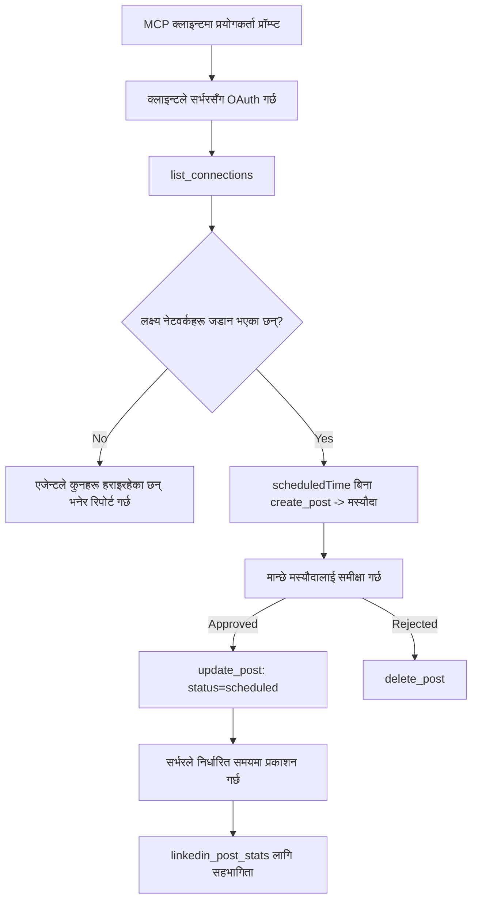

# केस स्टडी: एक एजेन्ट बाट सोसियल नेटवर्कहरुमा प्रकाशन एक रिमोट MCP सर्भर संग

> **अस्वीकरण:** धेरै सेवा र खुला स्रोत परियोजनाहरुले सामाजिक नेटवर्कमा प्रकाशन गर्न सक्छन्, र एउटा टोलीले प्रत्येक नेटवर्कको API सिधै एकीकृत गर्न पनि सक्छ। तलको परिदृश्य एउटा काम गरिएको उदाहरणको रुपमा प्रस्तुत गरिएको छ कि कसरी एक **लेखन-क्षमतावान रिमोट MCP सर्भर** डिजाईन र उपयोग गर्न सकिन्छ। Publora एक व्यावसायिक सेवा हो जुन निःशुल्क तहसँगै आउँछ; यहाँ वर्णन गरिएका ढाँचाहरू कुनै पनि MCP सर्भरमा लागू हुन्छन् जुन प्रयोगकर्ताको तर्फबाट अपरिवर्तनीय कार्यहरू गर्दछ।

## अवलोकन

एजेन्टहरू सामग्री तयार पार्न राम्रो हुन्छन् र यसलाई वितरण गर्न कमजोर। मोडेलले सेकेन्डमै विमोचन घोषणा तयार पार्न सक्छ, र त्यसपछि काम रोकिन्छ: प्रकाशन गर्नुपर्दा प्रत्येक नेटवर्कको लागि API, प्रत्येक नेटवर्कको लागि OAuth एप, र प्रत्येकको लागि विभिन्न मिडिया नियमहरु चाहिन्छ। धेरै टोलीहरूले यसलाई ब्राउजरमा टेक्स्ट प्रतिलिपि गरेर समाधान गर्छन्।

यस केस स्टडीले अन्तिम चरण कसरी एकल रिमोट MCP सर्भरसँग बन्द गर्न सकिन्छ भन्ने हेर्छ, र — जसले पनि एक निर्माण गर्दै छ — एक **लेखन-क्षमतावान** सर्भरले कुन डिजाइन निर्णयहरू सही गर्नुपर्छ। डेटा पढ्न सजिलो छ। प्रकाशन त्यस्तो छैन: गलत उपकरण कल पूर्वदर्शी दर्शक सामु देखिन्छ र फिर्ता गर्न सकिँदैन।

## परिदृश्य

एउटा सानो विकासक-संबन्ध टीम एजेन्ट भित्र पोस्टहरू तयार पार्छ (Claude, VS Code, Cursor — ग्राहकले महत्त्व राख्दैन)। उनीहरूले चाहन्छन् एजेन्टले:

- टोलीले जडान गरेका सामाजिक खाताहरू हेर्न,
- एउटा पोस्ट तयार पार्न र त्यसलाई मानव स्वीकृतिका लागि ड्राफ्टको रुपमा राख्न,
- एउटा छवि संलग्न गर्न,
- त्यसलाई छनोट गरिएको समयमा विभिन्न नेटवर्कहरूमा अनुसूचित गर्न,
- र पछि प्रदर्शन रिपोर्ट गर्न।

सबैभन्दा महत्वपूर्ण कुरा, उनीहरूले चाहन्छन् कि एजेन्टले अझै पनि परीक्षण गरिरहेको अवस्थामा गल्तीले प्रकाशन नगरोस्।

## प्रयोग गरिएका उपकरणहरू

- [Publora MCP Server](https://github.com/publora/mcp-server) — प्रकाशन, अनुसूचना, मिडिया र LinkedIn विश्लेषण उपकरणहरू सहित एक रिमोट MCP सर्भर (`streamable-http`)। आधिकारिक MCP रजिष्ट्रिमा `com.publora/mcp-server` को रूपमा दर्ता।

## चरण-द्वारा-चरण कार्यप्रवाह

1. **सर्भरमा जडान गर्नुहोस्।** OAuth बोल्ने क्लाइन्टहरूले स्वीकृति-कोड फ्लो PKCE सहित सर्भरको स्वीकृति स्क्रीनसँग पूरा गर्छन्; गैर OAuth क्लाइन्टहरू, जस्तै हेडलेस CLI, हेडरमा Publora API कुञ्जी प्रयोग गर्छन्। दुवै मार्ग समर्थन गरिएको छ र तपाइँले कुन पाउनुहुन्छ त्यो क्लाइन्टमा निर्भर छ, सर्भरमा होइन।
2. **जडानहरू सूचीबद्ध गर्नुहोस्।** एजेन्टले `list_connections` कल गर्छ र जडित खाताहरू पहिचान सङ्गै प्राप्त गर्छ।
3. **ड्राफ्ट बनाउनुहोस्।** एजेन्टले `create_post` कल गर्छ *अनुसूचित समय बिना*। पोस्ट ड्राफ्टको रूपमा सहेजिन्छ — केही पनि प्रकाशित हुँदैन।
4. **मिडिया संलग्न गर्नुहोस्।** सार्वजनिक छवि URL हरू एकै कलमा पास गरिन्छ; सर्भरले तिनीहरू डाउनलोड र मान्य गर्दछ।
5. **अनुसूचि बनाउनुहोस्।** एक पटक मानवले स्वीकृति गरेपछि, `update_post` ले स्थिति ISO 8601 समयसहित अनुसूचितमा सेट गर्छ।
6. **मापन गर्नुहोस्।** LinkedIn को लागि, `linkedin_post_stats`ले पोस्ट लाइभ भएपछि संलग्नता फर्काउँछ।

## उदाहरण प्रॉम्प्ट

```text
Which social accounts do I have connected?
Draft a post announcing our new changelog page, attach the screenshot at
https://example.com/changelog.png, and keep it as a draft — do not publish it.
Once I approve, schedule it to LinkedIn and Bluesky for tomorrow at 09:00 UTC.
```

## मर्मेड फ्लोचार्ट



## प्राविधिक कार्यान्वयन

तलका पाठहरू यस केस स्टडीको स्थानान्तरणयोग्य भाग हुन्।

### खुला खोज, प्रमाणित कार्यान्वयन

`tools/list` प्रमाणपत्र बिना सेवा गरिन्छ; प्रत्येक `tools/call` ले टोकन आवश्यक पर्छ र अन्यथा `401` फर्काउँछ जसमा `WWW-Authenticate` हेडर हुन्छ जुन संरक्षित-resource मेटाडाटा तर्फ इङ्गित गर्दछ। (सर्भरले प्रमाणित नभएको `initialize` पनि जवाफ दिन्छ, जुन `2026-07-28` पहिले प्रोटोकल संस्करणका क्लाइन्टहरूका लागि मात्र महत्त्वपूर्ण छ; त्यो संशोधनले हात मिलाउने प्रक्रिया पूर्णतया हटाइदियो।)

यो विभाजन व्यवहारमा महत्त्वपूर्ण छ। रजिष्ट्रिहरू, सूचीहरू र क्लाइन्टहरूले उपकरण सतह — नामहरू, स्किमाहरू, एनोटेशनहरू — इन्ट्रोस्पेक्ट गर्न सक्छन् बिना कुनै गोप्य कुरा बोकेर, जबकि केही पनि गुमनाम रूपमा *कार्यान्वयन* गर्न सकिँदैन। `initialize` को लागि टोकन माग्ने सर्भर उपकरणहरूसँग अदृश्य हुन्छ; गुमनाम `tools/call` अनुमति दिने सर्भर जोखिमपूर्ण छ।

### दर्ता: गतिशील क्लाइन्ट दर्ता, र यसको विकल्प के हो

सर्भरले `/.well-known/oauth-protected-resource` र `/.well-known/oauth-authorization-server` लाई प्रचार गर्छ र PKCE (`S256`), रिफ्रेस टोकन र **गतिशील क्लाइन्ट दर्ता** सहित स्वीकृति-कोड फ्लो समर्थन गर्छ।

गतिशील दर्ताले म्यानुअल कदम हटाउँछ: यसको बिना प्रत्येक क्लाइन्टलाई पहिलेबाट जारी गरिएको `client_id` चाहिन्छ, जसले प्रत्येक नयाँ क्लाइन्टका लागि विक्रेता तर्फ आउट-अफ-ब्यान्ड अनुरोध हो।

यो कामसँग मिलाउने व्यवहार मान्नुहोस् डिजाइनको नक्कलको रुपमा होइन। `2026-07-28` स्पेसिफिकेशन संशोधनले गतिशील क्लाइन्ट दर्तालाई Client ID मेटाडाटा डकुमेन्टहरू द्वारा प्रतिस्थापन गर्दछ, जसमा क्लाइन्ट आफूले स्थिर HTTPS URL मा मेटाडाटा डकुमेन्ट होस्ट गर्छ र त्यो URL नै `client_id` हो। DCR अहिलेका लागि काम गर्दैछ, तर नयाँ सर्भरले CIMD को योजना बनाउनु पर्छ र पुराना क्लाइन्टहरूका लागि मात्र DCR राख्नु पर्छ।

### उपकरण एनोटेशनहरू साजसज्जा होइनन्

प्रत्येक उपकरणसँग `title` र लागू सुढ्झाव हुन्छ: `readOnlyHint`, `destructiveHint`, `idempotentHint`, `openWorldHint`।

यसमा लगानी गर्ने दुई कारण छन्। पहिलो, क्लाइन्टहरूले प्रयोगकर्तासँग के पुष्टि गर्ने निर्णय गर्न सुढ्झाव प्रयोग गर्छन् — क्लाइन्टले स्वचालित रूपमा पढ्ने-एउटा खोज चलाउन सक्छ र मेटाउनेअघि स्वीकृतिका लागि रोक्न सक्छ। स्पेसिफिकेशन स्पष्ट छ कि एनोटेशनहरू अविश्वासी सुढ्झाव हुन्, प्राधिकरण संयन्त्र होइनन्: तिनीहरूले क्लाइन्टले के प्रस्ताव गर्ने निधो गर्छन्, सर्भरमा केही रोक्दैनन्, र सर्भरले आफ्ना नियमहरू लागू गर्नै पर्छ। दोस्रो, प्रमुख कनेक्टर निर्देशिकाहरूले अब समीक्षा गर्न तिनीहरू *आवश्यक* बनाएका छन्; जसको उपकरणमा शीर्षक र सुढ्झाव छैन, त्यो सर्भर कति राम्ररी काम गरे पनि फर्काइने छ।

### पहिचानकर्तालाई अनआविष्कारयोग्य बनाउनुहोस्

प्लेटफर्म पहिचानकर्ताहरू अपारदर्शी स्ट्रिङहरू हुन् जुन `list_connections` ले फर्काउँछ, र स्किमा वर्णन स्पष्ट रूपमा भन्छ कि तिनीहरू सोझै नक्कल गर्नुपर्छ र कहिल्यै अनुमान गर्न हुँदैन। सर्भरले अरू केही अस्वीकार गर्छ।

मोडेलहरू सहज अनुमानकर्ताहरू हुन्। कुनै पनि लेखन-क्षमतावान सर्भरले मान्नुपर्छ कि पहिचानकर्ता अन्ततः गलत हुनेछ र त्यो बाटो छिटो र स्पष्ट असफल हुनुपर्छ, सम्भावित देखिने मानमा काम गर्ने होइन।

### प्रकाशन अघि असफल हुनुहोस्, कार्यान्वयनयोग्य सन्देशसहित

केही नेटवर्कहरू केवल टेक्स्ट पोस्ट अस्वीकार गर्छन् र मिडिया वा भिडियो आवश्यक पार्छन्। त्यो पोस्ट अनुसूचित गर्दा मान्य गरिन्छ, र त्रुटि प्लेटफर्म र हराएको आवश्यकता नाम दिन्छ।

एजेन्टले "इन्स्टाग्रामले मिडिया आवश्यक छ — छवि वा भिडियो संलग्न गर्नुहोस्" बाट पुनरावृत्ति बिना पनि निको हुन सक्छ। यो सामान्य `400` बाट निको हुन सक्दैन।

### पुन: प्रयासहरू सुरक्षित बनाउनुहोस्

सामग्री सिर्जना गर्ने दुई उपकरणहरू `create_post` र `update_post` ले आइडेम्पोटेन्सी कुञ्जी स्वीकार्छन्: समान अनुरोधसँग पुन: उपयोग गर्दा मूल प्रतिक्रिया दोहोर्याइन्छ, दोस्रो लेख सिर्जना हुँदैन। एजेन्ट रनटाइमहरूले टाईमआउटमा पुन: प्रयास गर्छन्; आइडेम्पोटेन्सी बिना, सुस्त प्रतिक्रिया दोहोरो प्रकाशन हुन्छ। अन्य लेख उपकरणहरू — मेटाउने, मिडिया कदम, LinkedIn प्रतिक्रियाहरू र टिप्पणीहरू — कुञ्जी स्वीकार्दैनन्, त्यसैले त्यहाँ पुन: प्रयास स्वतः सुरक्षित छैन। आफ्ना म्युटेशनहरू मध्ये कुन सुरक्षित छन् र कति छैन जान्न राम्रो हुन्छ।

### केही प्रकाशन नगर्ने परीक्षण गर्ने तरिका प्रदान गर्नुहोस्

सर्भरले आरक्षित लक्ष्य `publora-playground` स्वीकार्छ, जुन वास्तविक गन्तव्य जस्तै मान्य र स्वीकृत हुन्छ र त्यसपछि खारेज हुन्छ — कुनै पनि कुरा लाइभ खातामा पुग्दैन। यसलाई उपकरण स्किमामा वर्णन गरिएको छ, जुन कुनै क्लाइन्टले प्रमाणपत्र बिना पढ्न सक्छ: `create_post` को `platforms` फिल्डले यसलाई "जडान परीक्षण लक्ष्य जसलाई वास्तविक जडान आवश्यक पर्दैन — पोस्ट स्वीकृत गरिन्छ र खारेज हुन्छ, केही पनि प्रकाशित हुँदैन" भनेर कागजात गर्दछ। यसको एकल प्रविष्टिको रूपमा पठाउनुहोस्: `platforms: ["publora-playground"]`।

यो सबै सतहको सबैभन्दा उपयोगी विवरणहरूमध्ये एक हो। कनेक्टर निर्देशिका समीक्षकहरू, योगदानकर्ता र CI ले पूर्ण लेख मार्गको अन्त्यदेखि अन्त सम्म अभ्यास गर्न सक्छन् कुनै वास्तविक दर्शकलाई जोखिम नपुर्याई। कुनै पनि MCP सर्भर जसले अपरिवर्तनीय क्रियाहरू गर्दछ त्यसलाई दस्तावेज गरिएको नो-अप लक्ष्यबाट फाइदा हुन्छ।

## नतिजा र प्रभाव

- प्रकाशन चरण ब्राउजरबाट त्यही वार्तालापमा सारियो जहाँ सामग्री लेखिन्छ, र ड्राफ्ट-प्रथम अभ्यासले मान्छेलाई समावेश राख्छ। स्पष्ट हुनुहोस् कि ड्राफ्ट के हो: एउटा परम्परा हो, सीमा होइन। एउटै साखले अनुसूचित वा प्रकाशन गर्न सक्छ, त्यसैले जसलाई वास्तविक स्वीकृति गेट चाहिन्छ त्यहाँ यो उपकरण सतहभन्दा बाहिर लागू गर्नुपर्छ — अलग साख वा सर्भर अगाडि नीति तह।
- प्रति-नेटवर्क फरकहरू — मिडिया आवश्यकता, थ्रेडिङ, जवाफ नियन्त्रणहरू — सर्भरमा एकचोटि ह्यान्डल गरिन्छ, हरेक एजेन्टमा होइन।
- एउटै सर्भरले विभिन्न MCP क्लाइंटहरूलाई प्रति-क्लाइंट काम बिना समर्थन गर्छ किनभने खोज खुला छ र दर्ता गतिशील छ।
- माथिका डिजाइन प्रतिबन्धहरू कनेक्टर-डाइरेक्टरी समीक्षाहरूद्वारा जतिन्जेल प्रयोगकर्ताहरूले गठन गरेका थिए: एनोटेशनहरू, OAuth र सुरक्षित परीक्षण लक्ष्य प्रत्येक कम्तिमा एउटाले आवश्यक पारेका थिए।

## सन्दर्भहरू

- [Publora MCP Server (स्रोत)](https://github.com/publora/mcp-server)
- [Publora API र MCP दस्तावेज](https://docs.publora.com)
- [MCP रजिष्ट्री प्रविष्टि: `com.publora/mcp-server`](https://registry.modelcontextprotocol.io/v0/servers?search=com.publora/mcp-server)
- [MCP विशिष्टता — प्रमाणीकरण](https://modelcontextprotocol.io/specification/draft/basic/authorization)
- [MCP विशिष्टता — उपकरण एनोटेशनहरू](https://modelcontextprotocol.io/docs/concepts/tools)

## के गर्ने अर्को

- तपाइँले निर्माण गर्दै हुनु भएको MCP सर्भर लिएर यहाँका तीन सबैभन्दा सस्तो जितहरू जाँच गर्नुहोस्: प्रत्येक उपकरणमा एनोटेशनहरू, प्रत्येक लेखमा आइडेम्पोटेन्सी कुञ्जी, र दस्तावेज गरिएको नो-अप लक्ष्य।
- खुला खोज विभाजन प्रयास गर्नुहोस्: सार्वजनिक रिमोट सर्भरमा प्रमाणपत्र बिना `tools/list` कल गर्नुहोस्, त्यसपछि उपकरण कल गरेर `401` चुनौती निरीक्षण गर्नुहोस्।
- तपाइँको डोमेनमा "पूर्ववत" को अर्थ विचार गर्नुहोस्। प्रकाशनसँग ड्राफ्ट र मेटाउने हुन्छ; यदि तपाइँका क्रियाहरुको समकक्ष छैन भने, पुष्टि उपकरण डिजाइनमा हुनुपर्छ, प्रॉम्प्ट मा होइन।

---

<!-- CO-OP TRANSLATOR DISCLAIMER START -->
**अस्वीकरण**:
यो दस्तावेज़ AI अनुवाद सेवा [Co-op Translator](https://github.com/Azure/co-op-translator) प्रयोग गरेर अनुवाद गरिएको हो। हामी सही हुन प्रयास गर्छौं, तर कृपया जानकार हुनुस् कि स्वचालित अनुवादमा त्रुटिहरू वा अशुद्धताहरू हुन सक्छन्। मूल दस्तावेज़ यसको मूल भाषामा आधिकारिक स्रोत मानिनुपर्छ। महत्वपूर्ण जानकारीका लागि व्यावसायिक मानव अनुवाद सिफारिस गरिन्छ। यस अनुवादको प्रयोगबाट उत्पन्न कुनै पनि गलत बुझाइ वा त्रुटिको लागि हामी जिम्मेवार छैनौं।
<!-- CO-OP TRANSLATOR DISCLAIMER END -->