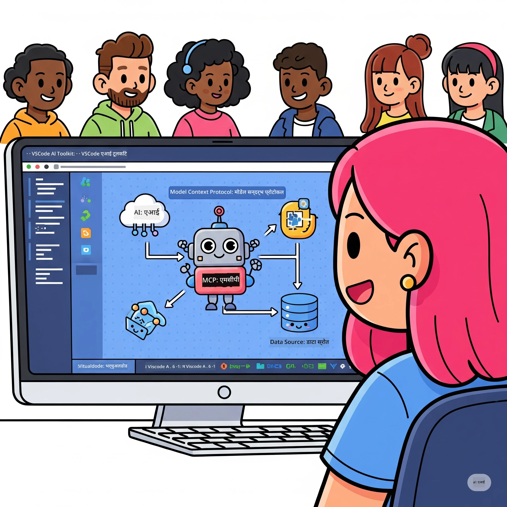

# एआई कार्यप्रवाहलाई सरल बनाउँदै: Microsoft Foundry Toolkit साथ MCP सर्भर निर्माण

## 🎯 अवलोकन

_(यस पाठको भिडियो हेर्न माथिको छवि क्लिक गर्नुहोस्)_

**Model Context Protocol (MCP) कार्यशालामा स्वागत छ!** यो व्यापक व्यावहारिक कार्यशालाले दुई अत्याधुनिक प्रविधिहरूलाई संयोजन गरेर एआई अनुप्रयोग विकासमा क्रान्ति ल्याउँछ:

> **अनुकूलता नोट:** कार्यशाला कोड MCP 
> `2025-11-25` सँग निर्माण र परीक्षण गरिएको छ, माथिको ब्याजले देखाइएको छ। नयाँ प्रोटोकल कार्यान्वयनहरूका लागि
> [हालको `2026-07-28` विनिर्देशन](https://modelcontextprotocol.io/specification/2026-07-28/) प्रयोग गर्नुहोस् र प्रयोगशाला स्थानान्तरण गर्नु अघि SDK रिलिज नोटहरू समीक्षा गर्नुहोस्।
> 

- **🔗 Model Context Protocol (MCP)**: सहज एआई-उपकरण एकीकरणको लागि खुला मानक
- **🛠️ Microsoft Foundry Toolkit Extension for VS Code**: Microsoft को शक्तिशाली AI विकास विस्तार

### 🎓 तपाईंले के सिक्नुहुनेछ

यस कार्यशालाको अन्त्य सम्ममा, तपाईं बुद्धिमान अनुप्रयोगहरू निर्माण गर्ने कलामा निपूर्ण हुनुहुनेछ जसले AI मोडेलहरूलाई वास्तविक विश्वका उपकरणहरू र सेवाहरूसँग जोड्छ। स्वचालित परीक्षणदेखि कस्टम API एकीकरणसम्म, तपाईंले जटिल व्यापार चुनौतीहरू समाधान गर्ने व्यावहारिक सीपहरू प्राप्त गर्नुहुनेछ।

## 🏗️ प्रविधि स्ट्याक

### 🔌 Model Context Protocol (MCP)

MCP **"एआईको लागि USB-C"** हो - एक सार्वभौमिक मानक जसले एआई मोडेलहरूलाई बाह्य उपकरण र डाटास्रोतहरूमा जडान गर्छ।

**✨ मुख्य विशेषताहरू:**

- 🔄 **मानकीकृत एकीकरण**: एआई-उपकरण जडानका लागि सार्वभौमिक अन्तरफेस
- 🏛️ **लचिलो संरचना**: stdio/SSE ट्रान्सपोर्ट मार्फत स्थानीय र रिमोट सर्भरहरू
- 🧰 **धनी पारिस्थितिकी तन्त्र**: उपकरणहरू, प्रम्प्टहरू, र स्रोतहरू एउटै प्रोटोकलमा
- 🔒 **उद्यम-तयार**: इम्बेड गरिएको सुरक्षा र विश्वसनीयता

**🎯 किन MCP महत्त्वपूर्ण छ:**
USB-C ले क्याब्ल भ्रम हटाएझैं, MCP ले एआई एकीकरणहरूको जटिलता हटाउँछ। एक प्रोटोकल, अनन्त सम्भावनाहरू।

### 🤖 Microsoft Foundry Toolkit Extension for VS Code

Microsoft को प्रमुख AI विकास विस्तार जसले VS Code लाई AI पावरहाउसमा परिणत गर्छ।

**🚀 मुख्य क्षमता:**

- 📦 **मोडेल क्याटलग**: Azure AI, GitHub, Hugging Face, Ollama बाट मोडेल पहुँच
- ⚡ **स्थानीय इनफरन्स**: ONNX-अनुकूलित CPU/GPU/NPU कार्यान्वयन
- 🏗️ **एजेन्ट बिल्डर**: MCP एकीकरण सहित भिजुअल AI एजेन्ट विकास
- 🎭 **मल्टि-मोडल**: टेक्स्ट, भिजन, र संरचित आउटपुट समर्थन

**💡 विकास लाभहरू:**

- शून्य कन्फिग मोडेल डिप्लोयमेन्ट
- भिजुअल प्रम्प्ट ईन्जिनियरिङ
- वास्तविक-समय परीक्षण प्लेग्राउन्ड
- सहज MCP सर्भर एकीकरण

## 📚 सिकाइ यात्रा

### [🚀 मोड्यूल 1: Microsoft Foundry Toolkit आधारभूत कुरा](./lab1/README.md)

**अवधि**: 15 मिनेट

- 🛠️ VS Code का लागि Microsoft Foundry Toolkit स्थापना र कन्फिगर गर्नुहोस्
- 🗂️ मोडेल क्याटलग अन्वेषण गर्नुहोस् (GitHub, ONNX, OpenAI, Anthropic, Google बाट १००+ मोडेलहरू)
- 🎮 वास्तविक-समय मोडेल परीक्षणका लागि अन्तरक्रियात्मक प्लेग्राउन्डमा निपुण हुनुहोस्
- 🤖 पहिलो AI एजेन्ट Agent Builder मार्फत बनाउनुहोस्
- 📊 निर्मित मेट्रिक्स (F1, सान्दर्भिकता, समानता, सुसंगतता) सँग मोडेल प्रदर्शन मूल्यांकन गर्नुहोस्
- ⚡ ब्याच प्रोसिसिङ र मल्टि-मोडल समर्थन क्षमता सिक्नुहोस्

**🎯 सिकाइ नतिजा**: Microsoft Foundry Toolkit क्षमताहरूको व्यापक बुझाइसहित कार्यशील AI एजेन्ट सिर्जना गर्नुहोस्

### [🌐 मोड्यूल 2: Microsoft Foundry Toolkit सँग MCP आधारभूत कुरा](./lab2/README.md)

**अवधि**: 20 मिनेट

- 🧠 Model Context Protocol (MCP) संरचना र अवधारणामा निपुण हुनुहोस्
- 🌐 Microsoft को MCP सर्भर पारिस्थितिकी तन्त्र अन्वेषण गर्नुहोस्
- 🤖 Playwright MCP सर्भर प्रयोग गरेर ब्राउजर स्वचालन एजेन्ट बनाउनुहोस्
- 🔧 MCP सर्भरहरूलाई Microsoft Foundry Toolkit Agent Builder सँग एकीकृत गर्नुहोस्
- 📊 आफ्नो एजेन्टहरू भित्र MCP उपकरणहरू कन्फिगर र परीक्षण गर्नुहोस्
- 🚀 उत्पादन प्रयोगका लागि MCP-सञ्चालित एजेन्टहरू निर्यात र डिप्लोय गर्नुहोस्

**🎯 सिकाइ नतिजा**: MCP मार्फत बाह्य उपकरणहरूसँग सुपरचार्ज गरिएको AI एजेन्ट डिप्लोय गर्नुहोस्

### [🔧 मोड्यूल 3: Microsoft Foundry Toolkit सँग उन्नत MCP विकास](./lab3/README.md)

**अवधि**: 20 मिनेट

- 💻 Microsoft Foundry Toolkit प्रयोग गरेर कस्टम MCP सर्भरहरू निर्माण गर्नुहोस्
- 🐍 नवीनतम MCP Python SDK (v1.9.3) कन्फिगर र प्रयोग गर्नुहोस्
- 🔍 डिबगिङका लागि MCP Inspector सेट अप र प्रयोग गर्नुहोस्
- 🛠️ व्यावसायिक डिबगिङ कार्यप्रवाहसहित Weather MCP Server बनाउनुहोस्
- 🧪 Agent Builder र Inspector वातावरणहरूमा MCP सर्भरहरू डिबग गर्नुहोस्

**🎯 सिकाइ नतिजा**: आधुनिक उपकरणहरूसँग कस्टम MCP सर्भरहरू विकास र डिबग गर्नुहोस्

### [🐙 मोड्यूल 4: व्यावहारिक MCP विकास - कस्टम GitHub Clone Server](./lab4/README.md)

**अवधि**: 30 मिनेट

- 🏗️ विकास कार्यप्रवाहका लागि वास्तविक-विश्व GitHub Clone MCP Server बनाउनुहोस्
- 🔄 भ्यालिडेसन र त्रुटि व्यवस्थापनसहित स्मार्ट रिपोजिटरी क्लोनिङ लागू गर्नुहोस्
- 📁 बुद्धिमान डाइरेक्टोरी व्यवस्थापन र VS Code एकीकरण सिर्जना गर्नुहोस्
- 🤖 कस्टम MCP उपकरणहरूसँग GitHub Copilot Agent मोड प्रयोग गर्नुहोस्
- 🛡️ उत्पादन-तयार विश्वसनीयता र क्रस-प्लेटफर्म अनुकूलता लागू गर्नुहोस्

**🎯 सिकाइ नतिजा**: वास्तविक विकास कार्यप्रवाहहरू सरल बनाउने उत्पादन-तयार MCP सर्भर डिप्लोय गर्नुहोस्

## 💡 वास्तविक-विश्व अनुप्रयोगहरू र प्रभाव

### 🏢 उद्यम उपयोग केसहरू

#### 🔄 DevOps स्वचालन

बुद्धिमान स्वचालनसँग आफ्नो विकास कार्यप्रवाह रूपान्तरण गर्नुहोस्:

- **स्मार्ट रिपोजिटरी व्यवस्थापन**: AI-चालित कोड समीक्षा र मर्ज निर्णयहरू
- **बुद्धिमान CI/CD**: कोड परिवर्तनहरूमा आधारित स्वचालित पाइपलाइन अनुकूलन
- **समस्या ट्रायाज**: स्वतः बग वर्गीकरण र आवंटन

#### 🧪 गुणस्तर आश्वासन क्रान्ति

AI-संचालित स्वचालनसँग परीक्षण उन्नत बनाउनुहोस्:

- **बुद्धिमान परीक्षण सिर्जना**: स्वतः व्यापक परीक्षण सूटहरू सिर्जना गर्नुहोस्
- **भिजुअल रिग्रेसन परीक्षण**: AI-संचालित UI परिवर्तन पत्ता लगाउने
- **प्रदर्शन अनुगमन**: सक्रिय समस्या पहिचान र समाधान

#### 📊 डाटा पाइपलाइन बुद्धिमत्ता

चतुर डेटा प्रशोधन कार्यप्रवाहहरू बनाउनुहोस्:

- **अनुकूली ETL प्रक्रिया**: आत्म-अनुकूलन डेटा रूपान्तरणहरू
- **असामान्य पहिचान**: वास्तविक-समय डेटा गुणस्तर निगरानी
- **बुद्धिमान राउटिङ**: स्मार्ट डेटा प्रवाह व्यवस्थापन

#### 🎧 ग्राहक अनुभव सुधार

असाधारण ग्राहक अन्तरक्रियाहरू सिर्जना गर्नुहोस्:

- **सन्दर्भ-सजग समर्थन**: ग्राहक इतिहासमा पहुँच भएको AI एजेन्टहरू
- **सक्रिय समस्या समाधान**: पूर्वानुमानित ग्राहक सेवा
- **बहु-च्यानल एकीकरण**: प्लेटफर्महरूमा एकीकृत AI अनुभव

## 🛠️ पूर्वापेक्षाहरू र सेटअप

### 💻 प्रणाली आवश्यकताहरू

| कम्पोनेन्ट | आवश्यकता | टिप्पणीहरू |
|-----------|-------------|-------|
| **अपरेटिङ सिस्टम** | Windows 10+, macOS 10.15+, Linux | कुनै पनि आधुनिक OS |
| **Visual Studio Code** | नवीनतम स्थिर संस्करण | Microsoft Foundry Toolkit को लागि आवश्यक |
| **Node.js** | v18.0+ र npm | MCP सर्भर विकासको लागि |
| **Python** | 3.10+ | Python MCP सर्भरहरूको लागि वैकल्पिक |
| **मेमोरी** | न्यूनतम 8GB RAM | स्थानीय मोडेलहरूको लागि 16GB सिफारिस गरिएको |

### 🔧 विकास वातावरण

#### सिफारिस गरिएका VS कोड एक्सटेन्सनहरू

- **Microsoft Foundry Toolkit** (ms-windows-ai-studio.windows-ai-studio)
- **Python** (ms-python.python)
- **Python डिबगगर** (ms-python.debugpy)
- **GitHub Copilot** (GitHub.copilot) - वैकल्पिक तर उपयोगी

#### वैकल्पिक उपकरणहरू

- **uv**: आधुनिक Python प्याकेज प्रबन्धक
- **MCP निरीक्षक**: MCP सर्भरहरूको लागि भिजुअल डिबगिङ उपकरण
- **Playwright**: वेब स्वचालन उदाहरणहरूको लागि

## 🎖️ सिकाइ नतिजाहरू र प्रमाणपत्र मार्ग

### 🏆 सीप विशेषज्ञता चेकलिस्ट

यस कार्यशाला पुरा गरेर, तपाईं निम्नमा विशेषज्ञ बन्नुहुनेछ:

#### 🎯 मुख्य दक्षताहरू

- [ ] **MCP प्रोटोकल विशेषज्ञता**: वास्तुकला र कार्यान्वयन ढाँचामा गहिरो बुझाइ
- [ ] **Microsoft Foundry Toolkit दक्षता**: Microsoft Foundry Toolkit को तीव्र विकासको लागि विशेषज्ञ स्तरको प्रयोग
- [ ] **कस्टम सर्भर विकास**: उत्पादन MCP सर्भरहरू निर्माण, परिचालन र मर्मत
- [ ] **उपकरण एकीकरण उत्कृष्टता**: AI लाई विद्यमान विकास कार्यप्रवाहहरूसँग सहज रूपमा जोड्ने
- [ ] **समस्याको समाधान प्रयोग**: सिकेका सीपहरूलाई वास्तविक व्यवसाय चुनौतीहरूमा लागू गर्ने

#### 🔧 प्राविधिक सीपहरू

- [ ] VS कोडमा Microsoft Foundry Toolkit सेटअप र कन्फिगर गर्ने
- [ ] कस्टम MCP सर्भरहरू डिजाइन र कार्यान्वयन गर्ने
- [ ] MCP वास्तुकलासँग GitHub मोडेलहरू एकीकृत गर्ने
- [ ] Playwright सँग स्वचालित परीक्षण कार्यप्रवाहहरू निर्माण गर्ने
- [ ] उत्पादन प्रयोगका लागि AI एजेन्टहरू परिनियोजन गर्ने
- [ ] MCP सर्भर प्रदर्शन डिबग र अनुकूलन गर्ने

#### 🚀 उन्नत क्षमता

- [ ] उद्यम-स्तर AI एकीकरणहरूको वास्तुकला बनाउने
- [ ] AI अनुप्रयोगका लागि सुरक्षा उत्तम अभ्यासहरू कार्यान्वयन गर्ने
- [ ] मापनयोग्य MCP सर्भर वास्तुकलाहरू डिजाइन गर्ने
- [ ] विशिष्ट क्षेत्रहरूको लागि कस्टम उपकरण श्रृंखलाहरू सिर्जना गर्ने
- [ ] AI-नेटिभ विकासमा अन्यलाई मार्गदर्शन गर्ने

## 📖 थप स्रोतहरू

- [MCP विशिष्टता (2026-07-28)](https://modelcontextprotocol.io/specification/2026-07-28/)
- [Microsoft Foundry Toolkit GitHub रिपोजिटरी](https://github.com/microsoft/vscode-ai-toolkit)
- [नमूना MCP सर्भरहरू संग्रह](https://github.com/modelcontextprotocol/servers)
- [उत्तम अभ्यास गाइड](https://modelcontextprotocol.io/docs/best-practices)
- [OWASP MCP शीर्ष 10](https://microsoft.github.io/mcp-azure-security-guide/mcp/) - सुरक्षा उत्तम अभ्यासहरू

---

**🚀 के तपाईं आफ्नो AI विकास कार्यप्रवाहलाई क्रान्तिकारी बनाउन तयार हुनुहुन्छ?**

आइए MCP र Microsoft Foundry Toolkit सँग मिलेर बुद्धिमान अनुप्रयोगहरूको भविष्य बनाऔं!

## के छ अर्को

जारी राख्नुहोस्: [मोड्युल 11: MCP सर्भर ह्याण्ड्स-ऑन ल्याबहरू](../11-MCPServerHandsOnLabs/README.md)

---

<!-- CO-OP TRANSLATOR DISCLAIMER START -->
**अस्वीकरण**:
यो दस्तावेज़ AI अनुवाद सेवा [Co-op Translator](https://github.com/Azure/co-op-translator) प्रयोग गरेर अनुवाद गरिएको हो। हामी सही हुन प्रयास गर्छौं, तर कृपया जानकार हुनुस् कि स्वचालित अनुवादमा त्रुटिहरू वा अशुद्धताहरू हुन सक्छन्। मूल दस्तावेज़ यसको मूल भाषामा आधिकारिक स्रोत मानिनुपर्छ। महत्वपूर्ण जानकारीका लागि व्यावसायिक मानव अनुवाद सिफारिस गरिन्छ। यस अनुवादको प्रयोगबाट उत्पन्न कुनै पनि गलत बुझाइ वा त्रुटिको लागि हामी जिम्मेवार छैनौं।
<!-- CO-OP TRANSLATOR DISCLAIMER END -->