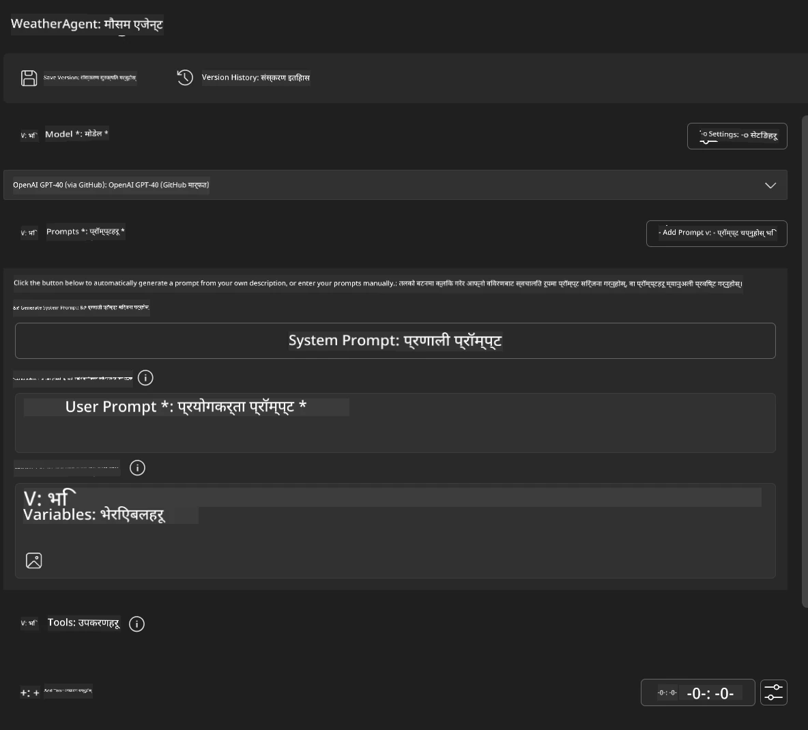
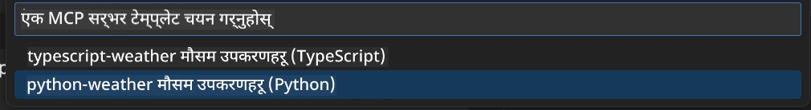
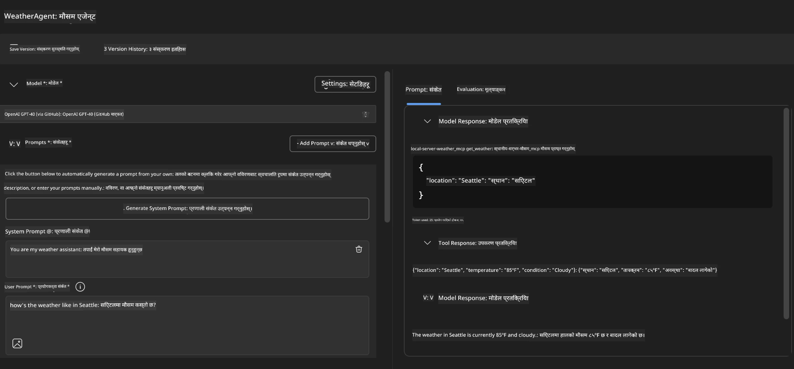
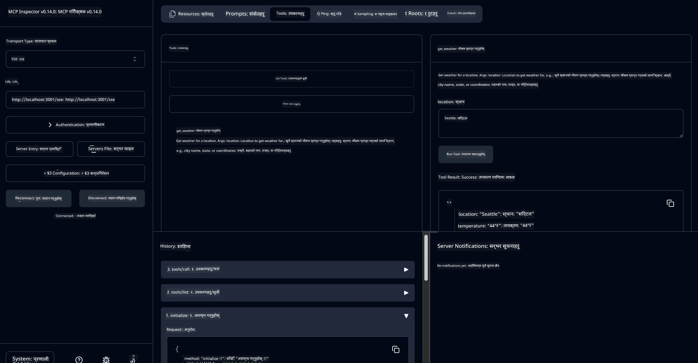

# 🔧 मोड्युल ३: Microsoft Foundry Toolkit सँग उन्नत MCP विकास

> [!NOTE]
> यस प्रयोगशालामा Inspector URL हरूले पुरानो `/sse` अन्तबिन्दु प्रयोग गर्छन् र लक्षित गर्दछ
> पिन गरिएको MCP SDK `1.9.3` र Inspector `0.14.0` निर्भरता। यी
> वर्तमान `2026-07-28` Streamable HTTP उदाहरणहरू होइनन्।


## 🎯 सिकाइका उद्देश्यहरू

यस प्रयोगशालाको अन्त्यसम्म, तपाईं सक्षम हुनुहुनेछ:

- ✅ Microsoft Foundry Toolkit प्रयोग गरेर अनुकूलित MCP सर्भरहरू सिर्जना गर्न
- ✅ नवीनतम MCP Python SDK (v1.9.3) कन्फिगर गर्न र प्रयोग गर्न
- ✅ डिबगिङको लागि MCP Inspector सेट अप गर्न र उपयोग गर्न
- ✅ Agent Builder र Inspector दुवै वातावरणमा MCP सर्भरहरू डिबग गर्न
- ✅ उन्नत MCP सर्भर विकास कार्यप्रवाहहरू बुझ्न

## 📋 पूर्वसर्तहरू

- प्रयोगशाला २ (MCP आधारभूत) सम्पन्न भएको हुनुपर्ने
- Microsoft Foundry Toolkit एक्सटेन्शन भएको VS Code
- Python 3.10+ वातावरण
- Inspector सेटअपको लागि Node.js र npm

## 🏗️ तपाईं के बनाउने हुनुहुन्छ

यस प्रयोगशालामा, तपाईंले **Weather MCP Server** सिर्जना गर्नु हुनेछ जसले देखाउँछ:
- अनुकूलित MCP सर्भर कार्यान्वयन
- Microsoft Foundry Toolkit Agent Builder सँग एकीकरण
- व्यावसायिक डिबगिङ कार्यप्रवाहहरू
- आधुनिक MCP SDK उपयोग रीतिहरू

---

## 🔧 मुख्य घटकहरूको अवलोकन

### 🐍 MCP Python SDK
Model Context Protocol Python SDK ले अनुकूलित MCP सर्भरहरू निर्माणका लागि आधार प्रदान गर्छ। तपाईं संस्करण 1.9.3 प्रयोग गर्नु हुनेछ जसमा प्रवर्द्धित डिबगिङ क्षमता छ।

### 🔍 MCP Inspector
शक्तिशाली डिबगिङ उपकरण जसले प्रदान गर्छ:
- वास्तविक-समय सर्भर अनुगमन
- उपकरण कार्यान्वयन दृश्यांकन
- नेटवर्क अनुरोध/प्रतिक्रिया निरीक्षण
- अन्तरक्रियात्मक परीक्षण वातावरण

---

## 📖 चरण-दर-चरण कार्यान्वयन

### चरण १: Agent Builder मा WeatherAgent सिर्जना गर्नुहोस्

१. Microsoft Foundry Toolkit एक्सटेन्शन मार्फत VS Code मा **Agent Builder सुरु गर्नुहोस्**
२. निम्न कन्फिगरेसनसहित **नयाँ एजेन्ट सिर्जना गर्नुहोस्**:
   - एजेन्ट नाम: `WeatherAgent`



### चरण २: MCP सर्भर प्रोजेक्ट प्रारम्भ गर्नुहोस्

१. Agent Builder मा **Tools** → **Add Tool** मा जानुहोस्
२. उपलब्ध विकल्पहरूबाट **"MCP Server" चयन गर्नुहोस्**
३. **"नयाँ MCP Server सिर्जना गर्नुहोस्" चयन गर्नुहोस्**
४. `python-weather` टेम्प्लेट चयन गर्नुहोस्
५. आफ्नो सर्भरको नाम राख्नुहोस्: `weather_mcp`



### चरण ३: प्रोजेक्ट खोल्नुहोस् र परीक्षण गर्नुहोस्

१. VS Code मा उत्पन्न प्रोजेक्ट खोल्नुहोस्
२. प्रोजेक्ट संरचनाको समीक्षा गर्नुहोस्:
   ```
   weather_mcp/
   ├── src/
   │   ├── __init__.py
   │   └── server.py
   ├── inspector/
   │   ├── package.json
   │   └── package-lock.json
   ├── .vscode/
   │   ├── launch.json
   │   └── tasks.json
   ├── pyproject.toml
   └── README.md
   ```

### चरण ४: नवीनतम MCP SDK मा अपग्रेड गर्नुहोस्

> **🔍 किन अपग्रेड गर्ने?** हामीले नवीनतम MCP SDK (v1.9.3) र Inspector सेवा (0.14.0) प्रयोग गर्न चाहन्छौं उत्कृष्ट सुविधा र बेहतर डिबगिङ क्षमताका लागि।

#### ४a. Python निर्भरता अपडेट गर्नुहोस्

**`pyproject.toml` सम्पादन गर्नुहोस्:** [./code/weather_mcp/pyproject.toml](../../../../10-StreamliningAIWorkflowsBuildingAnMCPServerWithAIToolkit/lab3/code/weather_mcp/pyproject.toml) अपडेट गर्नुहोस्


#### ४b. Inspector कन्फिगरेसन अपडेट गर्नुहोस्

**`inspector/package.json` सम्पादन गर्नुहोस्:** [./code/weather_mcp/inspector/package.json](../../../../10-StreamliningAIWorkflowsBuildingAnMCPServerWithAIToolkit/lab3/code/weather_mcp/inspector/package.json) अपडेट गर्नुहोस्

#### ४c. Inspector निर्भरता अपडेट गर्नुहोस्

**`inspector/package-lock.json` सम्पादन गर्नुहोस्:** [./code/weather_mcp/inspector/package-lock.json](../../../../10-StreamliningAIWorkflowsBuildingAnMCPServerWithAIToolkit/lab3/code/weather_mcp/inspector/package-lock.json) अपडेट गर्नुहोस्

> **📝 नोट:** यस फाइलमा व्यापक निर्भरता परिभाषाहरु छन्। तल आवश्यक संरचना छ - पूरा सामग्रीले सही निर्भरता समाधान सुनिश्चित गर्छ।


> **⚡ पूर्ण प्याकेज लक:** पूर्ण package-lock.json मा लगभग ३००० लाइन निर्भरता परिभाषाहरु छन्। माथिको संरचनाले मुख्य अंश देखाउँछ - पूरा निर्भरता समाधानका लागि प्रदान गरिएको फाइल प्रयोग गर्नुहोस्।

### चरण ५: VS Code डिबगिङ कन्फिगरेसन गर्नुहोस्

*सूचना: निर्दिष्ट पथमा फाइल प्रतिलिपि गरेर सम्बन्धित स्थानीय फाइल प्रतिस्थापन गर्नुहोस्*

#### ५a. लॉन्च कन्फिगरेसन अपडेट गर्नुहोस्

**`.vscode/launch.json` सम्पादन गर्नुहोस्:**

```json
{
  "version": "0.2.0",
  "configurations": [
    {
      "name": "Attach to Local MCP",
      "type": "debugpy",
      "request": "attach",
      "connect": {
        "host": "localhost",
        "port": 5678
      },
      "presentation": {
        "hidden": true
      },
      "internalConsoleOptions": "neverOpen",
      "postDebugTask": "Terminate All Tasks"
    },
    {
      "name": "Launch Inspector (Edge)",
      "type": "msedge",
      "request": "launch",
      "url": "http://localhost:6274?timeout=60000&serverUrl=http://localhost:3001/sse#tools",
      "cascadeTerminateToConfigurations": [
        "Attach to Local MCP"
      ],
      "presentation": {
        "hidden": true
      },
      "internalConsoleOptions": "neverOpen"
    },
    {
      "name": "Launch Inspector (Chrome)",
      "type": "chrome",
      "request": "launch",
      "url": "http://localhost:6274?timeout=60000&serverUrl=http://localhost:3001/sse#tools",
      "cascadeTerminateToConfigurations": [
        "Attach to Local MCP"
      ],
      "presentation": {
        "hidden": true
      },
      "internalConsoleOptions": "neverOpen"
    }
  ],
  "compounds": [
    {
      "name": "Debug in Agent Builder",
      "configurations": [
        "Attach to Local MCP"
      ],
      "preLaunchTask": "Open Agent Builder",
    },
    {
      "name": "Debug in Inspector (Edge)",
      "configurations": [
        "Launch Inspector (Edge)",
        "Attach to Local MCP"
      ],
      "preLaunchTask": "Start MCP Inspector",
      "stopAll": true
    },
    {
      "name": "Debug in Inspector (Chrome)",
      "configurations": [
        "Launch Inspector (Chrome)",
        "Attach to Local MCP"
      ],
      "preLaunchTask": "Start MCP Inspector",
      "stopAll": true
    }
  ]
}
```

**`.vscode/tasks.json` सम्पादन गर्नुहोस्:**

```
{
  "version": "2.0.0",
  "tasks": [
    {
      "label": "Start MCP Server",
      "type": "shell",
      "command": "python -m debugpy --listen 127.0.0.1:5678 src/__init__.py sse",
      "isBackground": true,
      "options": {
        "cwd": "${workspaceFolder}",
        "env": {
          "PORT": "3001"
        }
      },
      "problemMatcher": {
        "pattern": [
          {
            "regexp": "^.*$",
            "file": 0,
            "location": 1,
            "message": 2
          }
        ],
        "background": {
          "activeOnStart": true,
          "beginsPattern": ".*",
          "endsPattern": "Application startup complete|running"
        }
      }
    },
    {
      "label": "Start MCP Inspector",
      "type": "shell",
      "command": "npm run dev:inspector",
      "isBackground": true,
      "options": {
        "cwd": "${workspaceFolder}/inspector",
        "env": {
          "CLIENT_PORT": "6274",
          "SERVER_PORT": "6277",
        }
      },
      "problemMatcher": {
        "pattern": [
          {
            "regexp": "^.*$",
            "file": 0,
            "location": 1,
            "message": 2
          }
        ],
        "background": {
          "activeOnStart": true,
          "beginsPattern": "Starting MCP inspector",
          "endsPattern": "Proxy server listening on port"
        }
      },
      "dependsOn": [
        "Start MCP Server"
      ]
    },
    {
      "label": "Open Agent Builder",
      "type": "shell",
      "command": "echo ${input:openAgentBuilder}",
      "presentation": {
        "reveal": "never"
      },
      "dependsOn": [
        "Start MCP Server"
      ],
    },
    {
      "label": "Terminate All Tasks",
      "command": "echo ${input:terminate}",
      "type": "shell",
      "problemMatcher": []
    }
  ],
  "inputs": [
    {
      "id": "openAgentBuilder",
      "type": "command",
      "command": "ai-mlstudio.agentBuilder",
      "args": {
        "initialMCPs": [ "local-server-weather_mcp" ],
        "triggeredFrom": "vsc-tasks"
      }
    },
    {
      "id": "terminate",
      "type": "command",
      "command": "workbench.action.tasks.terminate",
      "args": "terminateAll"
    }
  ]
}
```


---

## 🚀 तपाईँको MCP सर्भर चलाउनुहोस् र परीक्षण गर्नुहोस्

### चरण ६: निर्भरता स्थापना गर्नुहोस्

कन्फिगरेसन परिवर्तनहरू गरेपछि तलका आदेशहरू चलाउनुहोस्:

**Python निर्भरता स्थापना गर्नुहोस्:**
```bash
uv sync
```

**Inspector निर्भरता स्थापना गर्नुहोस्:**
```bash
cd inspector
npm install
```

### चरण ७: Agent Builder सँग डिबग गर्नुहोस्

१. **F5 थिच्नुहोस्** वा **"Debug in Agent Builder"** कन्फिगरेसन प्रयोग गर्नुहोस्
२. डिबग प्यानलबाट संयुक्त कन्फिगरेसन चयन गर्नुहोस्
३. सर्भर सुरु हुने र Agent Builder खुल्ने पर्खनुहोस्
४. प्राकृतिक भाषा प्रश्नहरू प्रयोग गरी आफ्नो weather MCP सर्भर परीक्षण गर्नुहोस्

यसरी इनपुट प्रम्प्ट दिनुहोस्

SYSTEM_PROMPT

```
You are my weather assistant
```

USER_PROMPT

```
How's the weather like in Seattle
```



### चरण ८: MCP Inspector सँग डिबग गर्नुहोस्

१. **"Debug in Inspector"** कन्फिगरेसन प्रयोग गर्नुहोस् (Edge वा Chrome)
२. `http://localhost:6274` मा Inspector इन्टरफेस खोल्नुहोस्
३. अन्तरक्रियात्मक परीक्षण वातावरण अन्वेषण गर्नुहोस्:
   - उपलब्ध उपकरणहरू हेर्नुहोस्
   - उपकरण कार्यान्वयन परीक्षण गर्नुहोस्
   - नेटवर्क अनुरोधहरू अनुगमन गर्नुहोस्
   - सर्भर प्रतिक्रिया डिबग गर्नुहोस्



---

## 🎯 मुख्य सिकाइ नतिजाहरू

यस प्रयोगशाला पूरा गरेर, तपाईंले:

- [x] **अनुकूलित MCP सर्भर सिर्जना गर्नुभयो** Microsoft Foundry Toolkit टेम्प्लेट प्रयोग गरी
- [x] **नवीनतम MCP SDK** (v1.9.3) मा अपग्रेड गर्नुभयो उन्नत कार्यक्षमताका लागि
- [x] **Agent Builder र Inspector दुवैका लागि व्यावसायिक डिबगिङ कार्यप्रवाह कन्फिगर गर्नुभयो**
- [x] **अन्तरक्रियात्मक सर्भर परीक्षणका लागि MCP Inspector सेट अप गर्नुभयो**
- [x] **MCP विकासका लागि VS Code डिबगिङ कन्फिगरेसनहरूमा दक्षता हासिल गर्नुभयो**

## 🔧 अन्वेषण गरिएको उन्नत सुविधाहरू

| सुविधा | वर्णन | प्रयोग केस |
|---------|-------------|----------|
| **MCP Python SDK v1.9.3** | नवीनतम प्रोटोकल कार्यान्वयन | आधुनिक सर्भर विकास |
| **MCP Inspector 0.14.0** | अन्तरक्रियात्मक डिबगिङ उपकरण | वास्तविक-समय सर्भर परीक्षण |
| **VS Code Debugging** | एकीकृत विकास वातावरण | व्यावसायिक डिबगिङ कार्यप्रवाह |
| **Agent Builder Integration** | सिधा Microsoft Foundry Toolkit कनेक्शन | अन्त-देखि-अन्त एजेन्ट परीक्षण |

## 📚 अतिरिक्त स्रोतहरू

- [MCP Python SDK कागजात](https://modelcontextprotocol.io/docs/sdk/python)
- [Microsoft Foundry Toolkit एक्सटेन्शन गाइड](https://code.visualstudio.com/docs/ai/ai-toolkit)
- [VS Code डिबगिङ कागजात](https://code.visualstudio.com/docs/editor/debugging)
- [Model Context Protocol विशिष्टता](https://modelcontextprotocol.io/docs/concepts/architecture)

---

**🎉 बधाई!** तपाईंले सफलतापूर्वक प्रयोगशाला ३ पूरा गर्नुभयो र अब व्यावसायिक विकास कार्यप्रवाह प्रयोग गरी अनुकूलित MCP सर्भरहरू सिर्जना, डिबग, र वितरण गर्न सक्नुहुन्छ।

### 🔜 अर्को मोड्युलमा जारी राख्नुहोस्

तपाईंको MCP सीपहरू वास्तविक विश्व विकास कार्यप्रवाहमा लागू गर्न तयार हुनुहुन्छ? **[मोड्युल ४: व्यावहारिक MCP विकास - अनुकूलित GitHub Clone Server](../lab4/README.md)** मा जारी राख्नुहोस् जहाँ तपाईं:
- उत्पादन-तैयार MCP सर्भर बनाउनुहुनेछ जसले GitHub रिपोजिटोरी अपरेशनहरू स्वचालित गर्छ
- MCP मार्फत GitHub रिपोजिटोरी क्लोनिङ कार्यक्षमता कार्यान्वयन गर्नुहुनेछ
- VS Code र GitHub Copilot Agent Mode सँग अनुकूलित MCP सर्भरहरू एकीकृत गर्नुहुनेछ
- उत्पादन वातावरणमा अनुकूलित MCP सर्भरहरू परीक्षण र तैनाथ गर्नुहुनेछ
- विकासकर्ताहरूका लागि व्यावहारिक कार्यप्रवाह स्वचालन सिक्नुहुनेछ

---

<!-- CO-OP TRANSLATOR DISCLAIMER START -->
**अस्वीकरण**:
यो दस्तावेज़ AI अनुवाद सेवा [Co-op Translator](https://github.com/Azure/co-op-translator) प्रयोग गरेर अनुवाद गरिएको हो। हामी सही हुन प्रयास गर्छौं, तर कृपया जानकार हुनुस् कि स्वचालित अनुवादमा त्रुटिहरू वा अशुद्धताहरू हुन सक्छन्। मूल दस्तावेज़ यसको मूल भाषामा आधिकारिक स्रोत मानिनुपर्छ। महत्वपूर्ण जानकारीका लागि व्यावसायिक मानव अनुवाद सिफारिस गरिन्छ। यस अनुवादको प्रयोगबाट उत्पन्न कुनै पनि गलत बुझाइ वा त्रुटिको लागि हामी जिम्मेवार छैनौं।
<!-- CO-OP TRANSLATOR DISCLAIMER END -->