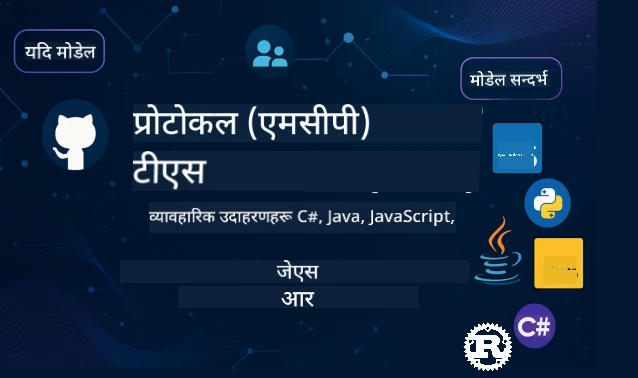

 

[](https://GitHub.com/microsoft/mcp-for-beginners/graphs/contributors)
[](https://GitHub.com/microsoft/mcp-for-beginners/issues)
[](https://GitHub.com/microsoft/mcp-for-beginners/pulls)
[](http://makeapullrequest.com)

[](https://GitHub.com/microsoft/mcp-for-beginners/watchers)
[](https://GitHub.com/microsoft/mcp-for-beginners/fork)
[](https://GitHub.com/microsoft/mcp-for-beginners/stargazers)


[](https://discord.gg/nTYy5BXMWG)

यी स्रोतहरू प्रयोग गर्न सुरु गर्न यी चरणहरू पछ्याउनुहोस्:
1. **रेपो फोर्क गर्नुहोस्**: क्लिक गर्नुहोस् [](https://GitHub.com/microsoft/mcp-for-beginners/fork)
2. **रेपो क्लोन गर्नुहोस्**:   `git clone https://github.com/microsoft/mcp-for-beginners.git`
3. **जोडिनुहोस्** [](https://discord.gg/nTYy5BXMWG)


### 🌐 बहुभाषी समर्थन

#### GitHub Action मार्फत समर्थित (स्वचालित र सधैं अद्यावधिक)

<!-- CO-OP TRANSLATOR LANGUAGES TABLE START -->
[Arabic](../ar/README.md) | [Bengali](../bn/README.md) | [Bulgarian](../bg/README.md) | [Burmese (Myanmar)](../my/README.md) | [Chinese (Simplified)](../zh-CN/README.md) | [Chinese (Traditional, Hong Kong)](../zh-HK/README.md) | [Chinese (Traditional, Macau)](../zh-MO/README.md) | [Chinese (Traditional, Taiwan)](../zh-TW/README.md) | [Croatian](../hr/README.md) | [Czech](../cs/README.md) | [Danish](../da/README.md) | [Dutch](../nl/README.md) | [Estonian](../et/README.md) | [Finnish](../fi/README.md) | [French](../fr/README.md) | [German](../de/README.md) | [Greek](../el/README.md) | [Hebrew](../he/README.md) | [Hindi](../hi/README.md) | [Hungarian](../hu/README.md) | [Indonesian](../id/README.md) | [Italian](../it/README.md) | [Japanese](../ja/README.md) | [Kannada](../kn/README.md) | [Korean](../ko/README.md) | [Lithuanian](../lt/README.md) | [Malay](../ms/README.md) | [Malayalam](../ml/README.md) | [Marathi](../mr/README.md) | [Nepali](./README.md) | [Nigerian Pidgin](../pcm/README.md) | [Norwegian](../no/README.md) | [Persian (Farsi)](../fa/README.md) | [Polish](../pl/README.md) | [Portuguese (Brazil)](../pt-BR/README.md) | [Portuguese (Portugal)](../pt-PT/README.md) | [Punjabi (Gurmukhi)](../pa/README.md) | [Romanian](../ro/README.md) | [Russian](../ru/README.md) | [Serbian (Cyrillic)](../sr/README.md) | [Slovak](../sk/README.md) | [Slovenian](../sl/README.md) | [Spanish](../es/README.md) | [Swahili](../sw/README.md) | [Swedish](../sv/README.md) | [Tagalog (Filipino)](../tl/README.md) | [Tamil](../ta/README.md) | [Telugu](../te/README.md) | [Thai](../th/README.md) | [Turkish](../tr/README.md) | [Ukrainian](../uk/README.md) | [Urdu](../ur/README.md) | [Vietnamese](../vi/README.md)

> **स्थानीय रूपमा क्लोन गर्न चाहनुहुन्छ?**

> यो रिपोजिटरीमा ५० भन्दा बढी भाषा अनुवादहरू समावेश छन् जसले डाउनलोड आकारलाई उल्लेखनीय रूपमा वृद्धि गर्छ। अनुवाद बिना क्लोन गर्न sparse checkout प्रयोग गर्नुहोस्:
> ```bash
> git clone --filter=blob:none --sparse https://github.com/microsoft/mcp-for-beginners.git
> cd mcp-for-beginners
> git sparse-checkout set --no-cone '/*' '!translations' '!translated_images'
> ```
> यसले तपाईंलाई कोर्स पूरा गर्न आवश्यक सबै कुरा छिटो डाउनलोडको साथ उपलब्ध गराउँछ।
<!-- CO-OP TRANSLATOR LANGUAGES TABLE END -->

# 🚀 मोडेल कन्टेक्स्ट प्रोटोकल (MCP) सुरूवातीहरूको लागि पाठ्यक्रम

## **MCP सिक्नुहोस् C#, Java, JavaScript, Rust, Python, र TypeScript मा हातमा कोड उदाहरणहरूसँग**

## 🧠 मोडेल कन्टेक्स्ट प्रोटोकल पाठ्यक्रमको अवलोकन
मोडेल कन्टेक्स्ट प्रोटोकलमा तपाईंको यात्रा स्वागत छ! यदि तपाईंलाई कहिल्यै केसो लाग्यो कि एआई अनुप्रयोगहरूले विभिन्न उपकरण र सेवाहरूसँग कसरी संवाद गर्छन्, तपाईं एक यस्तो सरल समाधान पत्ता लगाउन लाग्नुभएको छ जुन विकासकर्ताहरूलाई बुद्धिमान प्रणालीहरू निर्माण गर्ने तरिका परिवर्तन गर्दैछ।

MCP लाई एआई अनुप्रयोगहरूको लागि सार्वभौम अनुवादकको रूपमा सोच्नुहोस् - जसरी USB पोर्टहरूले तपाईंको कम्प्युटरमा कुनै पनि उपकरण जडान गर्न दिन्छ, MCP ले एआई मोडेलहरूलाई कुनै पनि उपकरण वा सेवासँग एक मानकीकृत तरिकाले जडान हुन दिन्छ। तपाईं पहिलो च्याटबोट निर्माण गर्दै हुनुहुन्छ वा जटिल एआई कार्यप्रवाहहरूमा काम गर्दै हुनुहुन्छ, MCP बुझ्नु भनेको अधिक सक्षम र लचिलो अनुप्रयोगहरू सिर्जना गर्न सक्ने शक्ति दिन्छ।

यो पाठ्यक्रम तपाईंको सिकाइ यात्राको लागि धैर्य र माया सहित डिजाइन गरिएको छ। हामी सरल अवधारणाहरूबाट सुरु गर्नेछौँ जुन तपाईंले पहिले नै बुझ्नुभएको छ र तपाईंको मनपर्ने प्रोग्रामिङ भाषामा हातमा अभ्यासबाट क्रमशः तपाईंको अनुभव बढाउनेछौँ। प्रत्येक चरणमा स्पष्ट व्याख्याहरू, व्यावहारिक उदाहरणहरू, र धेरै हौसला प्रदान गरिएको छ।

यस यात्रालाई सक्दा, तपाईंले आफ्नै MCP सर्भरहरू बनाउन, तिनीहरूलाई लोकप्रिय एआई प्लेटफर्महरूसँग एकीकृत गर्न, र यो प्रविधिले कसरी एआई विकासको भविष्यलाई पुनःआकार दिइरहेको छ बुझ्ने आत्मविश्वास पाउनेछ।

### आधिकारिक दस्तावेजहरू र विशिष्टताहरू

यी स्रोतहरू तपाईंको साझगत बुझाइसँग थप मूल्यवान हुनेछन्, तर तुरुन्त सबै पढ्न दबाबमा नपर्नुहोस्। तपाईंलाई सबैभन्दा रुचि भएका क्षेत्रहरूबाट सुरु गर्नुहोस्!
- 📘 [MCP दस्तावेज](https://modelcontextprotocol.io/) – यो तपाईंको गन्तव्य स्रोत हो चरण-दर-चरण ट्यूटोरियलहरू र प्रयोगकर्ता मार्गदर्शकहरूको लागि। दस्तावेजीकरण नयाँ सिक्नेहरूको लागि लेखिएको हो, जसले स्पष्ट उदाहरणहरू दिन्छ जुन तपाईं आफ्नै गतिमा पछ्याउन सक्नुहुन्छ।
- 📜 [MCP स्पेसिफिकेसन](https://modelcontextprotocol.io/docs/) – यसलाई तपाईंको सम्पूर्ण संदर्भ म्यानुअलको रूपमा सोच्नुहोस्। पाठ्यक्रम मार्फत काम गर्दा, तपाईंले विशेष विवरण हेर्न र उन्नत सुविधाहरू अन्वेषण गर्न यहाँ फर्कनुहुनेछ।
- 📜 [मूल MCP स्पेसिफिकेसन](https://modelcontextprotocol.io/specification/versioning) – यसले थप प्राविधिक विवरणहरू समावेश गर्छ जुन उन्नत कार्यान्वयनहरूमा उपयोगी हुन सक्छ। तपाईंलाई आवश्यक पर्दा यो त्यहाँ छ, तर सुरु गर्दा त्यसको चिन्ता नगर्नुहोस्।
- 🧑‍💻 [MCP GitHub रिपोजिटरी](https://github.com/modelcontextprotocol) – यहाँ तपाईंले विभिन्न प्रोग्रामिङ भाषाहरूमा SDKs, उपकरणहरू, र कोड नमूनाहरू पाउन सक्नुहुन्छ। यो प्रायोगिक उदाहरणहरू र तयार-प्रयोग कम्पोनेन्टहरूको खजाना जस्तो हो।
- 🌐 [MCP समुदाय](https://github.com/orgs/modelcontextprotocol/discussions) – साथी सिक्नेहरू र अनुभवी विकासकर्ताहरूसँग MCP सम्बन्धी छलफलहरूमा सहभागी हुनुहोस्। यो सहयोगी समुदाय हो जहाँ प्रश्नहरू स्वागत योग्य छन् र ज्ञान स्वतन्त्र रूपमा साझा गरिन्छ।
  
## सिक्ने लक्ष्यहरू

यस पाठ्यक्रमको अन्त्यमा, तपाईं नयाँ क्षमताहरूलाई लिएर आत्मविश्वासी र उत्साहित महसुस गर्नुहुनेछ। यहाँ तपाईंले हासिल गर्ने कुराहरू छन्:

• **MCP का आधारभूत कुरा बुझ्नु**: तपाईंले मोडेल कन्टेक्स्ट प्रोटोकल के हो र किन यो एआई अनुप्रयोगहरूलाई सँगै काम गर्न क्रान्तिकारी बनाइरहेको छ बुझ्नुहुनेछ, यस्तो उदाहरण र उपमाबाट जुन सजिलै बुझ्न सकिने।

• **आफ्नो पहिलो MCP सर्भर निर्माण गर्नुहोस्**: तपाईंले तपाईंसँग मनपर्ने प्रोग्रामिङ भाषामा काम गर्ने MCP सर्भर सिर्जना गर्नु हुनेछ, सरल उदाहरणहरूसँग सुरु गरी क्रमशः दक्षता बढाउँदै।

• **एआई मोडेलहरूलाई वास्तविक उपकरणहरूसँग जडान गर्नुहोस्**: तपाईं सिक्नुहुनेछ कसरी AI मोडेलहरूलाई वास्तविक सेवाहरूसँग ब्रिज गर्न सकिन्छ, जसले तपाईंका अनुप्रयोगहरूलाई शक्तिशाली नयाँ क्षमता दिन्छ।

• **सुरक्षा उत्तम अभ्यासहरू लागू गर्नुहोस्**: तपाईंलाई थाहा हुनेछ कसरी MCP कार्यान्वयनहरूलाई सुरक्षित राख्ने, तपाईंका अनुप्रयोगहरू र प्रयोगकर्ताहरूको रक्षा गर्ने।

• **आत्मविश्वासका साथ डिप्लोय गर्नुहोस्**: तपाईं जान्नुहुनेछ कसरी तपाईंका MCP परियोजनाहरू विकासबाट उत्पादनमा लैजान सकिन्छ, व्यावहारिक डिप्लोय रणनीतिहरूको साथ जुन वास्तविक संसारमा काम गर्छ।

• **MCP समुदायमा सामेल हुनुहोस्**: तपाईं विकासकर्ताहरूको बढ्दो समुदायको हिस्सा बन्नुहुनेछ जसले एआई अनुप्रयोग विकासको भविष्य बनाइरहेका छन्।

## आवश्यक पृष्ठभूमि

हामी MCP का विशिष्ट कुरा गुज्रनु अघि, केही आधारभूत अवधारणाहरूमा तपाईंलाई सहज महसुस गराउनेछौं। तपाईं यी क्षेत्रमा विशेषज्ञ नभए पनि चिन्ता नलिनुहोस् - हामी आवश्यक सबै कुरा सिकाउनेछौं।

### प्रोटोकलहरू बुझ्नुहोस् (आधार)

प्रोटोकललाई कुराकानीको नियमहरू जस्तै सोच्नुहोस्। जब तपाईं साथीलाई फोन गर्नुहुन्छ, दुबैले जवाफमा "नमस्ते" भन्न थाल्नुहुन्छ, बोल्ने पालो लिनुहुन्छ, र समाप्तिमा "बिदा" भन्न थाल्नुहुन्छ। कम्प्युटर प्रोग्रामहरूले पनि प्रभावकारी रूपमा संवाद गर्न यस्ता नियमहरू आवश्यक हुन्छ।

MCP एउटा प्रोटोकल हो - सहमत नियमहरूको समूह जसले AI मोडेलहरू र अनुप्रयोगहरूलाई उपकरण र सेवाहरूसँग उत्पादक "कुराकानी" गर्न मद्दत गर्दछ। जस्तै मानवीय संवादलाई सहज बनाउन कुराकानी नियमहरू आवश्यक हुन्छन्, MCP ले AI अनुप्रयोगको संवादलाई धेरै भरपर्दो र शक्तिशाली बनाउँछ।

### क्लाइन्ट-सर्भर सम्बन्धहरू (प्रोग्रामहरू सँगसँगै कसरी काम गर्छन्)

तपाईं दैनिक रूपमा क्लाइन्ट-सर्भर सम्बन्धहरू प्रयोग गर्नुहुन्छ! जब तपाईं वेब ब्राउजर (क्लाइन्ट) प्रयोग गरेर कुनै वेबसाइट भ्रमण गर्नुहुन्छ, तपाईं वेब सर्भरसँग जडान हुनुहुन्छ जुन तपाईंलाई पृष्ठ सामग्री पठाउँछ। ब्राउजर कसरी जानकारी माग्ने भनी जान्दछ, र सर्भर कसरी जवाफ दिने भनी पनि जान्दछ।

MCP मा, हामीसँग त्यस्तै सम्बन्ध छ: एआई मोडेलहरू क्लाइन्टको रूपमा काम गर्छन् जसले जानकारी वा कार्यहरूको अनुरोध गर्छन्, भने MCP सर्भरले ती क्षमताहरू प्रदान गर्दछ। यो त्यस्तो सहायक (सर्भर) जस्तै हो जसलाई एआईले विशिष्ट कार्यहरू गर्न माग्छ।

### किन मानकीकरण आवश्यक छ (संगै काम गर्न बनाउने)

कल्पना गर्नुहोस् यदि हरेक कार निर्माता भिन्न आकारका ग्यास पम्पहरू प्रयोग गर्थे - तपाईं प्रत्येक कारका लागि फरक एडाप्टर आवश्यक पर्थ्यो! मानकीकरणले साझा तरीकाहरूमा सम्झौता गर्ने हो जसले चीजहरू सहजै काम गर्न दिन्छ।

MCP ले AI अनुप्रयोगहरूको लागि यस्तै मानकीकरण दिन्छ। सबै AI मोडेललाई हरेक उपकरणको लागि कस्टम कोड आवश्यक नपरीकन, MCPले उनीहरूलाई संवाद गर्न सार्वभौम तरिका सिर्जना गर्छ। यसले विकासकर्ताहरूलाई उपकरणहरू एक पटक बनाउन र धेरै विभिन्न AI सिस्टमहरूसँग काम गर्न सक्षम बनाउँछ।

## 🧭 तपाईंको सिकाइ मार्ग अवलोकन

तपाईंको MCP यात्रा ध्यानपूर्वक संरचित छ ताकि तपाईंको आत्मविश्वास र कौशल बिस्तारै बृद्धि होस्। प्रत्येक चरणले नयाँ अवधारणाहरू प्रस्तुत गर्छ भने पहिले सिकेको कुरा दोहोर्याउँछ।

### 🌱 आधार चरण: आधारभूत बुझाइ (मोड्युल ०-२)

यसबाट तपाईंको यात्रा सुरु हुन्छ! हामी परिचित उपमा र सरल उदाहरणहरू प्रयोग गरी MCP अवधारणाहरू प्रस्तुत गर्नेछौं। तपाईं समझ्नुहुनेछ MCP के हो, किन अस्तित्वमा छ, र यो कसरी एआई विकासको ठूलो दुनियाँमा फिट हुन्छ।

• **मोड्युल ० - MCP परिचय**: हामी सुरुमा के MCP हो र किन यो आधुनिक AI अनुप्रयोगहरूको लागि यति महत्वपूर्ण छ बुझ्नेछौँ। तपाईंले व्यवहारिक MCP उदाहरणहरू देख्नुहुनेछ र बुझ्नुहुनेछ यो कसरि विकासकर्ताहरूले सामना गर्ने सामान्य समस्याहरू समाधान गर्छ।

• **मोड्युल १ - मुख्य अवधारणाहरू स्पष्ट पार्नु**: यहाँ तपाईंले MCP का आवश्यक आधारभूत संरचनाहरू सिक्नुहुनेछ। हामी धेरै उपमा र दृश्य उदाहरणहरू प्रयोग गर्नेछौं ताकि यी अवधारणाहरू सहज र बुझ्न मिल्ने महसुस होस्।

• **मोड्युल २ - MCP मा सुरक्षा**: सुरक्षा डर लाग्दो लाग्न सक्छ, तर हामी तपाईंलाई देखाउनेछौं कसरी MCP ले आन्तरिक सुरक्षा विशेषताहरू समावेश गर्दछ र सुरुवातदेखि नै तपाईंका अनुप्रयोगहरूलाई सुरक्षा गर्ने उत्तम अभ्यासहरू सिकाउनेछौं।

### 🔨 निर्माण चरण: तपाईंको पहिलो कार्यान्वयनहरू सिर्जना गर्नुहोस् (मोड्युल ३)

अब वास्तविक मज्जा सुरू हुन्छ! तपाईंले वास्तविक MCP सर्भरहरू र क्लाइन्टहरू बनाउने हातमा अनुभव पाउनुहुनेछ। चिन्ता नलिनुहोस् - हामी सजिलोबाट सुरु गर्नेछौँ र प्रत्येक चरणमा तपाईंलाई मार्गनिर्देशन गर्नेछौँ।

यस मोड्युलमा धेरै हातमा अभ्यास गाइडहरू छन् जसले तपाईंलाई मनपर्ने प्रोग्रामिङ भाषामा अभ्यास गर्न दिन्छ। तपाईं आफ्नो पहिलो सर्भर बनाउनुहुनेछ, त्यससँग जडान गर्न क्लाइन्ट बनाउनुहुनेछ, र लोकप्रिय विकास उपकरणहरू जस्तै VS Code सँग एकिकृत पनि गर्नुहुनेछ।
हरेक मार्गनिर्देशनमा पूर्ण कोड उदाहरणहरू, समस्याको समाधान सुझावहरू, र हामीले किन विशेष डिजाइन छनोटहरू गर्छौं भन्ने व्याख्याहरू समावेश छन्। यस चरणको अन्त्यसम्ममा, तपाईंसँग काम गर्ने MCP कार्यान्वयनहरू हुनेछ जुनमा तपाइँ गर्व गर्न सक्नुहुन्छ!

### 🚀 विकास चरण: उन्नत अवधारणाहरू र वास्तविक संसारको अनुप्रयोग (मोड्युलहरू 4-5)

आधारभूत कुराहरूमा निपुण भएपछि, तपाइँ थप परिष्कृत MCP विशेषताहरू अन्वेषण गर्न तयार हुनुहुन्छ। हामी व्यावहारिक कार्यान्वयन रणनीतिहरू, डिबगिङ प्रविधिहरू, र मल्टी-मोडल AI एकीकरण जस्ता उन्नत विषयहरू कभर गर्नेछौं।

तपाईंले उत्पादन प्रयोगका लागि तपाइँको MCP कार्यान्वयनहरू कसरी स्केल गर्ने र Azure जस्ता क्लाउड प्लेटफर्महरूसँग कसरी एकीकरण गर्ने पनि सिक्नेछौँ। यी मोड्युलहरूले तपाईलाई वास्तविक संसारको मागहरू सम्हाल्न सक्ने MCP समाधानहरू निर्माण गर्न तयार पार्छन्।

### 🌟 प्रवीणता चरण: समुदाय र विशेषज्ञता (मोड्युलहरू 6-11)

अन्तिम चरणले MCP समुदायमा सामेल हुनु र तपाइँलाई सबैभन्दा चासो लाग्ने क्षेत्रमा विशेषज्ञता हासिल गर्न केन्द्रित छ। तपाईंले खुला स्रोत MCP परियोजनाहरूमा कसरी योगदान दिने, उन्नत प्रमाणीकरण ढाँचाहरू कार्यान्वयन गर्ने, र व्यापक डेटाबेस-एकीकृत समाधानहरू निर्माण गर्ने सिक्नेछ।

मोड्युल 11 विशेष उल्लेखयोग्य छ - यो PostgreSQL एकीकरणसहित उत्पादन-तय MCP सर्भरहरू निर्माण गर्न सिकाउने पूर्ण १३-ल्याब हातमा सिक्ने मार्ग हो। यो एक क्यापस्टोन परियोजनाको जस्तो हो जसले तपाइँले सबै सिकेका कुराहरूलाई एकसाथ ल्याउँछ!

### 📚 पूर्ण पाठ्यक्रम संरचना

| मोड्युल | शीर्षक | विवरण | लिङ्क |
|--------|-------|-------------|------|
| **मोड्युल १-३: आधारभूत कुरा** | | | |
| 00 | MCP परिचय | मोडेल कन्टेक्स्ट प्रोटोकल र यसको AI पाइपलाइनहरूमा महत्त्वको अवलोकन | [थप पढ्नुहोस्](./00-Introduction/README.md) |
| 01 | मूल अवधारणाहरूको व्याख्या | मूल MCP अवधारणाहरूको गहिरो अन्वेषण | [थप पढ्नुहोस्](./01-CoreConcepts/README.md) |
| 02 | MCP मा सुरक्षा | सुरक्षा खतराहरू र उत्तम अभ्यासहरू | [थप पढ्नुहोस्](./02-Security/README.md) |
| 03 | MCP संग सुरु गर्ने | वातावरण सेटअप, आधारभूत सर्भर/क्लाइन्टहरू, एकीकरण | [थप पढ्नुहोस्](./03-GettingStarted/README.md) |
| **मोड्युल ३: तपाइँको पहिलो सर्भर र क्लाइन्ट बनाउन** | | | |
| 3.1 | पहिलो सर्भर | आफ्नो पहिलो MCP सर्भर सिर्जना गर्नुहोस् | [मार्गनिर्देशन](./03-GettingStarted/01-first-server/README.md) |
| 3.2 | पहिलो क्लाइन्ट | एक आधारभूत MCP क्लाइन्ट विकास गर्नुहोस् | [मार्गनिर्देशन](./03-GettingStarted/02-client/README.md) |
| 3.3 | LLM सहित क्लाइन्ट | ठूला भाषा मोडेलहरू एकीकृत गर्नुहोस् | [मार्गनिर्देशन](./03-GettingStarted/03-llm-client/README.md) |
| 3.4 | VS कोड एकीकरण | VS कोडमा MCP सर्भरहरू प्रयोग गर्नुहोस् | [मार्गनिर्देशन](./03-GettingStarted/04-vscode/README.md) |
| 3.5 | stdio सर्भर | stdio ट्रान्सपोर्ट प्रयोग गरेर सर्भरहरू सिर्जना गर्नुहोस् | [मार्गनिर्देशन](./03-GettingStarted/05-stdio-server/README.md) |
| 3.6 | HTTP स्ट्रिमिङ | MCP मा HTTP स्ट्रिमिङ कार्यान्वयन गर्नुहोस् | [मार्गनिर्देशन](./03-GettingStarted/06-http-streaming/README.md) |
| 3.7 | AI टूलकिट | MCP सँग AI टूलकिट प्रयोग गर्नुहोस् | [मार्गनिर्देशन](./03-GettingStarted/07-aitk/README.md) |
| 3.8 | परीक्षण | आफ्नो MCP सर्भर कार्यान्वयन परीक्षण गर्नुहोस् | [मार्गनिर्देशन](./03-GettingStarted/08-testing/README.md) |
| 3.9 | परिनियोजन | MCP सर्भरहरू उत्पादनमा परिनियोजित गर्नुहोस् | [मार्गनिर्देशन](./03-GettingStarted/09-deployment/README.md) |
| 3.10 | उन्नत सर्भर प्रयोग | उन्नत विशेषता प्रयोग र सुधारिएको संरचनाका लागि उन्नत सर्भरहरू प्रयोग गर्नुहोस् | [मार्गनिर्देशन](./03-GettingStarted/10-advanced/README.md) |
| 3.11 | सरल प्रमाणीकरण | आरम्भदेखि प्रमाणीकरण र RBAC देखाउने अध्याय | [मार्गनिर्देशन](./03-GettingStarted/11-simple-auth/README.md) |
| **मोड्युल ४-५: व्यावहारिक र उन्नत** | | | |
| 04 | व्यावहारिक कार्यान्वयन | SDK, डिबगिङ, परीक्षण, पुन: प्रयोगयोग्य प्रॉम्प्ट ढाँचा | [थप पढ्नुहोस्](./04-PracticalImplementation/README.md) |
| 05 | MCP मा उन्नत विषयहरू | मल्टि-मोडल AI, स्केलिङ, उद्यम प्रयोग | [थप पढ्नुहोस्](./05-AdvancedTopics/README.md) |
| 5.1 | Azure एकीकरण | Azure सँग MCP एकीकरण | [मार्गनिर्देशन](./05-AdvancedTopics/mcp-integration/README.md) |
| 5.2 | बहु-मोडालिटी | विविध मोडालिटीहरूसँग काम गर्ने | [मार्गनिर्देशन](./05-AdvancedTopics/mcp-multi-modality/README.md) |
| 5.3 | OAuth2 डेमो | OAuth2 प्रमाणीकरण कार्यान्वयन | [मार्गनिर्देशन](./05-AdvancedTopics/mcp-oauth2-demo/README.md) |
| 5.4 | मूल कन्टेक्स्टहरू | मूल कन्टेक्स्टहरू बुझ्ने र कार्यान्वयन गर्ने | [मार्गनिर्देशन](./05-AdvancedTopics/mcp-root-contexts/README.md) |
| 5.5 | मार्गनिर्देशन | MCP मार्गनिर्देशन रणनीतिहरू | [मार्गनिर्देशन](./05-AdvancedTopics/mcp-routing/README.md) |
| 5.6 | नमुना सङ्कलन | MCP मा नमुना सङ्कलन प्रविधिहरू | [मार्गनिर्देशन](./05-AdvancedTopics/mcp-sampling/README.md) |
| 5.7 | स्केलिङ | MCP कार्यान्वयनहरू स्केल गर्नुहोस् | [मार्गनिर्देशन](./05-AdvancedTopics/mcp-scaling/README.md) |
| 5.8 | सुरक्षा | उन्नत सुरक्षा विचारहरू | [मार्गनिर्देशन](./05-AdvancedTopics/mcp-security/README.md) |
| 5.9 | वेब खोज | वेब खोज क्षमताहरू कार्यान्वयन गर्नुहोस् | [मार्गनिर्देशन](./05-AdvancedTopics/web-search-mcp/README.md) |
| 5.10 | रियलटाइम स्ट्रिमिङ | रियलटाइम स्ट्रिमिङ कार्यक्षमता निर्माण गर्नुहोस् | [मार्गनिर्देशन](./05-AdvancedTopics/mcp-realtimestreaming/README.md) |
| 5.11 | रियलटाइम खोज | रियलटाइम खोज कार्यान्वयन गर्नुहोस् | [मार्गनिर्देशन](./05-AdvancedTopics/mcp-realtimesearch/README.md) |
| 5.12 | Entra ID प्रमाणीकरण | Microsoft Entra ID सँग प्रमाणीकरण | [मार्गनिर्देशन](./05-AdvancedTopics/mcp-security-entra/README.md) |
| 5.13 | Foundry एकीकरण | Azure AI Foundry सँग एकीकृत गर्नुहोस् | [मार्गनिर्देशन](./05-AdvancedTopics/mcp-foundry-agent-integration/README.md) |
| 5.14 | कन्टेक्स्ट इन्जिनियरिङ | प्रभावकारी कन्टेक्स्ट इन्जिनियरिङ प्रविधिहरू | [मार्गनिर्देशन](./05-AdvancedTopics/mcp-contextengineering/README.md) |
| 5.15 | MCP कस्टम ट्रान्सपोर्ट | कस्टम ट्रान्सपोर्ट कार्यान्वयनहरू | [मार्गनिर्देशन](./05-AdvancedTopics/mcp-transport/README.md) |
| **मोड्युल ६-१०: समुदाय र उत्तम अभ्यासहरू** | | | |
| 06 | सामुदायिक योगदानहरू | MCP पारिस्थितिकी तंत्रमा कसरी योगदान गर्ने | [मार्गनिर्देशन](./06-CommunityContributions/README.md) |
| 07 | प्रारम्भिक अपनत्वबाट ज्ञान | वास्तविक संसारको कार्यान्वयन कथाहरू | [मार्गनिर्देशन](./07-LessonsFromEarlyAdoption/README.md) |
| 08 | MCP का लागि उत्तम अभ्यासहरू | प्रदर्शन, फॉल्ट-टोलरेन्स, लचिलोपन | [मार्गनिर्देशन](./08-BestPractices/README.md) |
| 09 | MCP केस स्टडीहरू | व्यावहारिक कार्यान्वयन उदाहरणहरू | [मार्गनिर्देशन](./09-CaseStudy/README.md) |
| 10 | प्रयोगात्मक कार्यशाला | AI टूलकिटसँग MCP सर्भर बनाउँदै | [ल्याब](./10-StreamliningAIWorkflowsBuildingAnMCPServerWithAIToolkit/README.md) |
| **मोड्युल ११: MCP सर्भर हातमा ल्याब** | | | |
| 11 | MCP सर्भर डेटाबेस एकीकरण | PostgreSQL एकीकरणका लागि विषद १३-ल्याब हातमा सिक्ने मार्ग | [ल्याबहरू](./11-MCPServerHandsOnLabs/README.md) |
| 11.1 | परिचय | डेटाबेस एकीकरण र रिटेल एनालिटिक्स प्रयोग केस सहित MCP अवलोकन | [ल्याब ००](./11-MCPServerHandsOnLabs/00-Introduction/README.md) |
| 11.2 | मूल वास्तुकला | MCP सर्भर वास्तुकला, डेटाबेस तहहरू, र सुरक्षा ढाँचाहरू बुझ्नुहोस् | [ल्याब ०१](./11-MCPServerHandsOnLabs/01-Architecture/README.md) |
| 11.3 | सुरक्षा र बहु-टेनेंसी | रो स्तर सुरक्षा, प्रमाणीकरण, र बहु-टेनेंट डाटा पहुँच | [ल्याब ०२](./11-MCPServerHandsOnLabs/02-Security/README.md) |
| 11.4 | वातावरण सेटअप | विकास वातावरण, Docker, Azure स्रोतहरू सेटअप गर्नुहोस् | [ल्याब ०३](./11-MCPServerHandsOnLabs/03-Setup/README.md) |
| 11.5 | डेटाबेस डिजाइन | PostgreSQL सेटअप, रिटेल स्किमा डिजाइन, र नमूना डाटा | [ल्याब ०४](./11-MCPServerHandsOnLabs/04-Database/README.md) |
| 11.6 | MCP सर्भर कार्यान्वयन | डेटाबेस एकीकरणसहित FastMCP सर्भर निर्माण गर्नुहोस् | [ल्याब ०५](./11-MCPServerHandsOnLabs/05-MCP-Server/README.md) |
| 11.7 | उपकरण विकास | डेटाबेस क्वेरी उपकरणहरू र स्कीमा इंट्रोस्पेक्शन सिर्जना गर्नुहोस् | [ल्याब ०६](./11-MCPServerHandsOnLabs/06-Tools/README.md) |
| 11.8 | सेमेन्टिक खोज | Azure OpenAI र pgvector सँग भेक्टर एम्बेडिङ कार्यान्वयन गर्नुहोस् | [ल्याब ०७](./11-MCPServerHandsOnLabs/07-Semantic-Search/README.md) |
| 11.9 | परीक्षण र डिबगिङ | परीक्षण रणनीतिहरू, डिबगिङ उपकरणहरू, र प्रमाणीकरण दृष्टिकोणहरू | [ल्याब ०८](./11-MCPServerHandsOnLabs/08-Testing/README.md) |
| 11.10 | VS कोड एकीकरण | VS कोड MCP एकीकरण र AI च्याट प्रयोगको कन्फिगरेसन | [ल्याब ०९](./11-MCPServerHandsOnLabs/09-VS-Code/README.md) |
| 11.11 | परिनियोजन रणनीतिहरू | Docker परिनियोजन, Azure कन्टेनर एप्स, र स्केलिङ विचारहरू | [ल्याब १०](./11-MCPServerHandsOnLabs/10-Deployment/README.md) |
| 11.12 | अनुगमन | एप्लिकेशन इन्साइट्स, लगिङ, प्रदर्शन अनुगमन | [ल्याब ११](./11-MCPServerHandsOnLabs/11-Monitoring/README.md) |
| 11.13 | उत्तम अभ्यासहरू | प्रदर्शन अनुकूलन, सुरक्षा सुदृढीकरण, र उत्पादन सुझावहरू | [ल्याब १२](./11-MCPServerHandsOnLabs/12-Best-Practices/README.md) |

### 💻 नमूना कोड परियोजनाहरू

MCP सिक्नको सबैभन्दा रोमाञ्चक भागहरूमध्ये एक हो तपाइँको कोड कौशल क्रमबद्ध रूपमा विकास हुँदै जानु। हामीले हाम्रो कोड उदाहरणहरूलाई सरलबाट सुरु गरेर तपाइँको बुझाइ गहिरो हुँदै जाँदा थप परिष्कृत बन्न बनाएका छौं। हामीले अवधारणाहरू यसरी परिचय गराउँछौं - यस्तो कोड जस बुझ्न सजिलो हुन्छ तर वास्तविक MCP सिद्धान्तहरू देखाउँछ, तपाइँ बुझ्नुहुनेछ केवल यो कोड के गर्छ मात्र होइन, किन यसरी संरचित गरिएको छ र यो ठूलो MCP अनुप्रयोगहरूमा कसरी फिट हुन्छ।

#### आधारभूत MCP क्यालकुलेटर नमूनाहरू

| भाषा | विवरण | लिङ्क |
|----------|-------------|------|
| C# | MCP सर्भर उदाहरण | [कोड हेर्नुहोस्](./03-GettingStarted/samples/csharp/README.md) |
| Java | MCP क्यालकुलेटर | [कोड हेर्नुहोस्](./03-GettingStarted/samples/java/calculator/README.md) |
| JavaScript | MCP डेमो | [कोड हेर्नुहोस्](./03-GettingStarted/samples/javascript/README.md) |
| Python | MCP सर्भर | [कोड हेर्नुहोस्](../../03-GettingStarted/samples/python/mcp_calculator_server.py) |
| TypeScript | MCP उदाहरण | [कोड हेर्नुहोस्](./03-GettingStarted/samples/typescript/README.md) |
| Rust | MCP उदाहरण | [कोड हेर्नुहोस्](./03-GettingStarted/samples/rust/README.md) |

#### उन्नत MCP कार्यान्वयनहरू

| भाषा | विवरण | लिङ्क |
|----------|-------------|------|
| C# | उन्नत नमूना | [कोड हेर्नुहोस्](./04-PracticalImplementation/samples/csharp/README.md) |
| स्प्रिङसँग Java | कन्टेनर एप उदाहरण | [कोड हेर्नुहोस्](./04-PracticalImplementation/samples/java/containerapp/README.md) |
| JavaScript | उन्नत नमूना | [कोड हेर्नुहोस्](./04-PracticalImplementation/samples/javascript/README.md) |
| Python | जटिल कार्यान्वयन | [कोड हेर्नुहोस्](../../04-PracticalImplementation/samples/python/READMEmd) |
| TypeScript | कन्टेनर नमूना | [कोड हेर्नुहोस्](./04-PracticalImplementation/samples/typescript/README.md) |


## 🎯 MCP सिक्नका लागि पूर्वआवश्यकताहरू

यस पाठ्यक्रमबाट अधिकतम लाभ लिन, तपाइँसँग हुनु आवश्यक छ:

- C#, Java, JavaScript, Python, वा TypeScript मध्ये कम्तीमा एक भाषामा आधारभूत प्रोग्रामिङ ज्ञान
- क्लाइन्ट-सर्भर मोडल र APIहरूको समझ
- REST र HTTP अवधारणाहरूमा परिचय
- (वैकल्पिक) AI/ML अवधारणाहरूमा पृष्ठभूमि

- समर्थनका लागि हाम्रो समुदाय छलफलमा सहभागी हुनु

## 📚 अध्ययन मार्गदर्शक र स्रोतहरू

यस रिपोजिटरीमा तपाईलाई प्रभावकारी रूपमा सिक्न र नेभिगेट गर्न सहयोग गर्ने विभिन्न स्रोतहरू समावेश छन्:

### अध्ययन मार्गदर्शक

एक व्यापक [अध्ययन मार्गदर्शक](./study_guide.md) उपलब्ध छ जसले तपाइँलाई यो रिपोजिटरी प्रभावकारी प्रयोग गर्न मद्दत गर्दछ। यो दृश्य पाठ्यक्रम नक्साले सबै विषयहरू कसरी जडित छन् भनेर देखाउँछ र नमूना परियोजनाहरू कसरी प्रभावकारी प्रयोग गर्ने सुझाव दिन्छ। यदि तपाईं दृश्य सिकाइमा रुचि राख्नुहुन्छ भने यो विशेष रूपमा उपयोगी छ।

मार्गदर्शकमा समावेश छन्:
- सबै समेटिएका विषयहरूको दृश्य पाठ्यक्रम नक्सा
- प्रत्येक रिपोजिटरी खण्डको विस्तृत व्याख्या
- नमूना परियोजनाहरू कसरी प्रयोग गर्ने बारे निर्देशन
- विभिन्न कौशल स्तरहरूका लागि सुझाइएको सिकाइ मार्गहरू
- सिकाइ यात्रालाई पूरक गर्ने अतिरिक्त स्रोतहरू

### परिवर्तन सूची

हामीले विस्तृत [परिवर्तन सूची](./changelog.md) राख्छौं जसले पाठ्यक्रम सामग्रीमा सबै महत्वपूर्ण अपडेटहरू ट्र्याक गर्दछ, जसले तपाईलाई नवीनतम सुधार र थपहरूबाट अवगत राख्छ।
- नयाँ सामग्री थपहरू
- संरचनात्मक परिवर्तनहरू
- सुविधा सुधारहरू
- दस्तावेज अद्यावधिकहरू

## 🛠️ यो पाठ्यक्रमलाई प्रभावकारी रूपमा कसरी प्रयोग गर्ने

यस मार्गदर्शनको प्रत्येक पाठले समावेश गर्दछ:
1. MCP अवधारणाहरूको स्पष्ट व्याख्या  
2. विभिन्न भाषाहरूमा प्रत्यक्ष कोड उदाहरणहरू  
3. वास्तविक MCP अनुप्रयोगहरू निर्माण गर्न अभ्यासहरू  
4. उन्नत सिक्नेहरूका लागि अतिरिक्त स्रोतहरू

## आवश्यकता अनुसार सामग्री 

### [MCP Dev Days जुलाई 2025](https://developer.microsoft.com/en-us/reactor/series/S-1563/)
#### [➡️मंगाई अनुसार हेर्नुहोस् - MCP Dev Days](https://developer.microsoft.com/en-us/reactor/series/S-1563/)
MCP Dev Days को लागि दुई दिनको गहिरो प्राविधिक जानकारी, समुदायसँग जडान र हातमा सिकाइका लागि तयार हुनुहोस्, जुन मोडल सन्दर्भ प्रोटोकल (MCP) मा समर्पित भर्चुअल कार्यक्रम हो — बन्ने क्रममा रहेको मानक जुन AI मोडलहरू र तिनीहरूले भर पर्ने उपकरणहरूलाई जोड्दछ।  
तपाईं हाम्रो कार्यक्रम पृष्ठ https://aka.ms/mcpdevdays मा दर्ता गरेर MCP Dev Days हेर्न सक्नुहुन्छ।

#### [दिन 1: MCP उत्पादकता, DevTools, र समुदाय:](https://developer.microsoft.com/en-us/reactor/series/S-1563/)

यो डेवलपर्सलाई उनीहरूको विकास कार्यप्रवाहमा MCP प्रयोग गर्न सशक्त बनाउने र अद्भुत MCP समुदायलाई मनाउने बारे हो। हामी community सदस्यहरू र साझेदारहरू जस्तै Arcade, Block, Okta, र Neon सँग जोडिन्छौं जसले Microsoft सँग कसरी खुल्ला, विस्तारयोग्य MCP पारिस्थितिकी तंत्रको आकार दिन सहयोग गरिरहेका छन् भनी हेरौं।  
VS Code, Visual Studio, GitHub Copilot, र लोकप्रिय सामुदायिक उपकरणहरूमा वास्तविक-विश्व डेमोहरू  
व्यावहारिक, सन्दर्भ-आधारित विकास कार्यप्रवाहहरू  
समुदाय-नेतृत्वमा सत्रहरू र अन्तर्दृष्टिहरू  
तपाईं MCP संग हालै सुरु गर्दै हुनुहुन्छ वा पहिलेदेखि नै निर्माण गर्दै हुनुहुन्छ भने, दिन 1 ले प्रेरणा र लागू गर्न सकिने सिकाइहरू साथ प्रारम्भ गर्नेछ।

#### [दिन 2: विश्वस्त भएर MCP सर्भरहरू निर्माण गर्नुहोस्](https://developer.microsoft.com/en-us/reactor/series/S-1563/)

यो MCP निर्माताहरूका लागि हो। हामी MCP सर्भरहरू सिर्जना गर्ने र MCP लाई AI कार्यप्रवाहहरूमा समेट्ने लागि कार्यान्वयन रणनीतिहरू र सर्वोत्तम अभ्यासहरूमा गहिराइमा जान्छौं।

#### विषयहरूले समावेश गर्छन्:

- MCP सर्भरहरू निर्माण गर्ने र तिनीहरूलाई एजेन्ट अनुभवहरूमा समायोजन गर्ने  
- प्रॉम्प्ट-आधारित विकास  
- सुरक्षा सर्वोत्तम अभ्यासहरू  
- Functions, ACA, र API Management जस्ता निर्माण ब्लकहरू प्रयोग गर्ने  
- रेजिस्ट्री मिलान र उपकरणहरू (1P + 3P)

यदि तपाईं डेवलपर, उपकरण निर्माता, वा AI उत्पादन रणनीतिज्ञ हुनुहुन्छ भने, यो दिन तपाईंलाई मापनयोग्य, सुरक्षित, र भविष्य-तयार MCP समाधानहरू निर्माण गर्न आवश्यक छ।

### MCP बूट क्याम्प अगष्ट 2025
तीव्र भिडियो सत्रहरूमा MCP सर्भरहरू कसरी बनाउने, VS Code सँग कसरी समायोजन गर्ने, र Azure मा कसरी पेशेवर रूपमा डिप्लोय गर्ने सिक्नुहोस्, जुन MCP for Beginners पाठ्यक्रमबाट सामग्रीमा आधारित छ। एक प्रविधिमा व्यावहारिक कौशलहरूका साथ जानुहोस् जुन ठूला कम्पनीहरू पहिले नै प्रयोग गर्दैछन्।

#### [➡️मंगाई अनुसार हेर्नुहोस् MCP Bootcamp | अंग्रेजी](https://developer.microsoft.com/en-us/reactor/series/s-1568/)
#### [➡️मंगाई अनुसार हेर्नुहोस् MCP Bootcamp | ब्राजिल](https://developer.microsoft.com/en-us/reactor/series/S-1566/)
#### [➡️मंगाई अनुसार हेर्नुहोस् MCP Bootcamp | स्पेनिश](https://developer.microsoft.com/en-us/reactor/series/S-1567/)

### C# सँग MCP सिकौं - ट्युटोरियल सिरिज  
आउनुहोस् मोडल सन्दर्भ प्रोटोकल (MCP) को बारेमा सिकौं, एक अत्याधुनिक फ्रेमवर्क जसले AI मोडलहरू र क्लाइन्ट अनुप्रयोगबीच अन्तरक्रिया मानकीकरण गर्न डिजाइन गरेको हो। शुरुवाती मैत्रीपूर्ण सत्रमार्फत हामी तपाईंलाई MCP परिचय गराउनेछौं र तपाईंको पहिलो MCP सर्भर सिर्जना गर्न मार्गदर्शन गर्नेछौं।  
#### C#: [https://aka.ms/letslearnmcp-csharp](https://aka.ms/letslearnmcp-csharp)  
#### Java: [https://aka.ms/letslearnmcp-java](https://aka.ms/letslearnmcp-java)  
#### JavaScript: [https://aka.ms/letslearnmcp-javascript](https://aka.ms/letslearnmcp-javascript)  
#### Python: [https://aka.ms/letslearnmcp-python](https://aka.ms/letslearnmcp-python)  

## 🎓 तपाईंको MCP यात्रा सुरु हुन्छ

बधाई छ! तपाईंले एक उत्साहजनक यात्रामा पहिलो कदम चाल्नुभयो जुन तपाईंको प्रोग्रामिङ क्षमताहरू विस्तार गर्नेछ र तपाईंलाई AI विकासको अग्रीम सीमासँग जोड्नेछ।

### तपाईंले पहिले नै के हासिल गर्नुभयो

यस परिचयलाई पढेर, तपाईंले पहिले नै आफ्नो MCP ज्ञानको आधार निर्माण गर्न सुरु गर्नुभएको छ। तपाईं बुझ्नुहुन्छ कि MCP के हो, किन महत्त्वपूर्ण छ, र यो पाठ्यक्रमले तपाईंको सिकाइ यात्रालाई कसरी समर्थन गर्नेछ। यो एक ठूलो उपलब्धि हो र यस महत्वपूर्ण प्रविधिमा तपाईंको विशेषज्ञताको शुरुआत हो।

### अगाडि यात्रा

जब तपाईं मोड्युलहरूमा प्रगति गर्नुहुन्छ, सम्झनुहोस् कि हरेक विशेषज्ञ पहिले एक शुरुवाती हुँदोरहेछ। जुन अवधारणाहरू अहिले जटिल देखिन्छन् ती अभ्यास गर्दा र प्रयोग गर्दा सहजतम हुनेछ। प्रत्येक सानो कदमले शक्तिशाली क्षमताहरू निर्माण गर्छ जुन तपाईंको विकास क्यारियरभरि सहयोग गर्नेछ।

### तपाईंको समर्थन नेटवर्क

तपाईं MCP प्रति उत्साही सिक्नेहरू र विशेषज्ञहरूको समुदायमा सामेल हुँदै हुनुहुन्छ जुन अरूलाई सफल बनाउन उत्सुक छन्। तपाईं कोडिङ चुनौतीमा अड्किनुभयो वा सफलता सेयर गर्न चाहनुहुन्छ भने, समुदायले तपाईंको यात्रामा सहयोग गर्न तयार छ।

यदि तपाईं अड्किनुभयो वा AI एपहरू निर्माण गर्दा कुनै प्रश्नहरू छन् भने, साथी सिक्नेहरू र अनुभवी विकासकर्ताहरूसँग MCP सम्बन्धी छलफलमा सामेल हुनुहोस्। यो एक समर्थनपूर्ण समुदाय हो जहाँ प्रश्नहरू स्वागतयोग्य छन् र ज्ञान स्वतन्त्र रूपमा साझा गरिन्छ।

[](https://discord.gg/nTYy5BXMWG)

यदि तपाईंले उत्पादन प्रतिक्रिया दिन चाहनुहुन्छ वा निर्माण गर्दा त्रुटिहरू आउँछन् भने भ्रमण गर्नुहोस्:

[](https://aka.ms/foundry/forum)

### सुरु गर्न तयार?

तपाईंको MCP यात्रा अहिले सुरु हुन्छ! पहिलो हात-माथि MCP अनुभवमा डुबुल्की मार्न Module 0 बाट सुरु गर्नुहोस्, वा तपाईंले के बनाउँदै हुनुहुने हो हेर्न नमूना परियोजनाहरू अन्वेषण गर्नुहोस्। सम्झनुहोस् - हरेक विशेषज्ञ ठीक तपाईं जहाँ हुनुहुन्छ त्यहींबाट सुरु भएको हो, र धैर्य र अभ्यासले तपाईंलाई आश्चर्यचकित पार्नेछ।

मोडल सन्दर्भ प्रोटोकल विकासको संसारमा स्वागत छ। आउनुहोस् सँगै केही अद्भुत बनाऔं!

## 🤝 सिकाइ समुदायलाई योगदान गर्ने

यो पाठ्यक्रम तपाईं जस्ता सिक्नेहरूको योगदानले अझ सशक्त बन्दै गएको छ! तपाईं एक वर्तनी सुधार्दै हुनुहुन्छ, स्पष्ट व्याख्या सुझाव गर्दै हुनुहुन्छ, वा नयाँ उदाहरण थप्दै हुनुहुन्छ, तपाईंका योगदानहरूले अन्य शुरुवातीहरूलाई सफल बनाउन सहयोग पुर्याउँछन्।

Microsoft Valued Professional [Shivam Goyal](https://www.linkedin.com/in/shivam2003/) लाई कोड नमूनाहरू योगदान गरेकोमा धन्यवाद।

योगदान प्रक्रिया स्वागतयोग्य र सहयोगी बनाउन डिजाइन गरिएको छ। अधिकांश योगदानहरूमा Contributor License Agreement (CLA) आवश्यक पर्छ, तर स्वचालित उपकरणहरूले यो प्रक्रिया सहजै गर्न मद्दत गर्नेछन्।

## 📜 खुल्ला स्रोत सिकाइ

यो सम्पूर्ण पाठ्यक्रम MIT [LICENSE](../../LICENSE) अन्तर्गत उपलब्ध छ, जसको मतलब तपाईं यसलाई स्वतन्त्र रूपमा प्रयोग, संशोधन, र साझा गर्न सक्नुहुन्छ। यसले हामीलाई MCP ज्ञान विकासकर्ताहरूमाझ पहुँचयोग्य बनाउन सहयोग गर्दछ।

## 🤝 योगदान दिशानिर्देशहरू

यो परियोजनाले योगदान र सुझावहरू स्वागत गर्दछ। अधिकांश योगदानहरूको लागि तपाईंले यो प्रमाणित गर्नु आवश्यक हुन्छ कि तपाईं अधिकार राख्नुहुन्छ र वास्तवमै हामीलाई तपाईंको योगदान प्रयोग गर्ने अधिकार दिनुहुन्छ भन्ने Contributor License Agreement (CLA) मा सहमति जनाउनु पर्ने हुन्छ। विवरणको लागि <https://cla.opensource.microsoft.com> भ्रमण गर्नुहोस्।

जब तपाईं पुल अनुरोध पेश गर्नुहुन्छ, CLA बोटले स्वचालित रूपमा निर्धारण गर्नेछ कि तपाईंलाई CLA प्रदान गर्न आवश्यक छ वा छैन र PR लाई उपयुक्त रूपमा चिन्ह लगाउनेछ (जस्तै, स्थिति जाँच, टिप्पणी)। बोटले प्रदान गरेको निर्देशनहरू पालन गर्नुहोस्। तपाईंले हाम्रो CLA प्रयोग गर्ने सबै रिपोजमा यो एक पटक मात्र गर्नुपर्नेछ।

यस परियोजनामा [Microsoft Open Source Code of Conduct](https://opensource.microsoft.com/codeofconduct/) अपनाइएको छ। थप जानकारीका लागि [Code of Conduct FAQ](https://opensource.microsoft.com/codeofconduct/faq/) हेर्नुहोस् वा कुनै थप प्रश्न वा टिप्पणीको लागि [opencode@microsoft.com](mailto:opencode@microsoft.com) मा सम्पर्क गर्नुहोस्।

---

*तपाईंको MCP यात्रा सुरु गर्न तयार हुनुहुन्छ? [Module 00 - Introduction to MCP](./00-Introduction/README.md) बाट सुरु गर्नुहोस् र मोडल सन्दर्भ प्रोटोकल विकासको संसारमा तपाईका पहिलो पाइला चाल्नुहोस्!*


## 🎒 अन्य पाठ्यक्रमहरू  
हाम्रो टोलीले अन्य पाठ्यक्रमहरू उत्पादन गर्छ! जाँच गर्नुहोस्:

<!-- CO-OP TRANSLATOR OTHER COURSES START -->
### LangChain  
[](https://aka.ms/langchain4j-for-beginners)  
[](https://aka.ms/langchainjs-for-beginners?WT.mc_id=m365-94501-dwahlin)

---

### Azure / Edge / MCP / एजेन्टहरू  
[](https://github.com/microsoft/AZD-for-beginners?WT.mc_id=academic-105485-koreyst)  
[](https://github.com/microsoft/edgeai-for-beginners?WT.mc_id=academic-105485-koreyst)  
[](https://github.com/microsoft/mcp-for-beginners?WT.mc_id=academic-105485-koreyst)  
[](https://github.com/microsoft/ai-agents-for-beginners?WT.mc_id=academic-105485-koreyst)

---
 
### Generative AI श्रृंखला  
[](https://github.com/microsoft/generative-ai-for-beginners?WT.mc_id=academic-105485-koreyst)  
[-9333EA?style=for-the-badge&labelColor=E5E7EB&color=9333EA)](https://github.com/microsoft/Generative-AI-for-beginners-dotnet?WT.mc_id=academic-105485-koreyst)  
[-C084FC?style=for-the-badge&labelColor=E5E7EB&color=C084FC)](https://github.com/microsoft/generative-ai-for-beginners-java?WT.mc_id=academic-105485-koreyst)  
[-E879F9?style=for-the-badge&labelColor=E5E7EB&color=E879F9)](https://github.com/microsoft/generative-ai-with-javascript?WT.mc_id=academic-105485-koreyst)

---
 
### कोर सिकाइ  
[](https://aka.ms/ml-beginners?WT.mc_id=academic-105485-koreyst)  
[](https://aka.ms/datascience-beginners?WT.mc_id=academic-105485-koreyst)  
[](https://aka.ms/ai-beginners?WT.mc_id=academic-105485-koreyst)  
[](https://github.com/microsoft/Security-101?WT.mc_id=academic-96948-sayoung)
[](https://aka.ms/webdev-beginners?WT.mc_id=academic-105485-koreyst)
[](https://aka.ms/iot-beginners?WT.mc_id=academic-105485-koreyst)
[](https://github.com/microsoft/xr-development-for-beginners?WT.mc_id=academic-105485-koreyst)

---
 
### कोपाइलट श्रृंखला
[](https://aka.ms/GitHubCopilotAI?WT.mc_id=academic-105485-koreyst)
[](https://github.com/microsoft/mastering-github-copilot-for-dotnet-csharp-developers?WT.mc_id=academic-105485-koreyst)
[](https://github.com/microsoft/CopilotAdventures?WT.mc_id=academic-105485-koreyst)
<!-- CO-OP TRANSLATOR OTHER COURSES END -->

---

<!-- CO-OP TRANSLATOR DISCLAIMER START -->
**अस्वीकरण**:
यस दस्तावेजलाई AI अनुवाद सेवा [Co-op Translator](https://github.com/Azure/co-op-translator) प्रयोग गरेर अनुवाद गरिएको हो। हामी शुद्धताका लागि प्रयासरत छौं भने पनि, कृपया जानकार हुनुहोस् कि स्वचालित अनुवादमा त्रुटि वा गलतफहमी हुन सक्दछ। मौलिक दस्तावेजलाई यसको मूल भाषामा नै अधिकारिक स्रोत मानिनेछ। महत्वपूर्ण जानकारीको लागि पेशेवर मानव अनुवाद सिफारिस गरिन्छ। यस अनुवादको प्रयोगबाट हुने कुनै पनि गलतफहमी वा गलत व्याख्याको लागि हामी जिम्मेवार हुने छैनौं।
<!-- CO-OP TRANSLATOR DISCLAIMER END -->