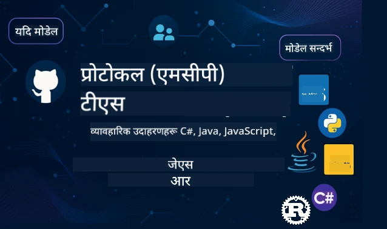

 

[](https://GitHub.com/microsoft/mcp-for-beginners/graphs/contributors)
[](https://GitHub.com/microsoft/mcp-for-beginners/issues)
[](https://GitHub.com/microsoft/mcp-for-beginners/pulls)
[](http://makeapullrequest.com)

[](https://GitHub.com/microsoft/mcp-for-beginners/watchers)
[](https://GitHub.com/microsoft/mcp-for-beginners/fork)
[](https://GitHub.com/microsoft/mcp-for-beginners/stargazers)


[](https://discord.gg/nTYy5BXMWG)

यी स्रोतहरू प्रयोग गर्न सुरु गर्न तलका चरणहरूको पालना गर्नुहोस्:
1. **रिपोजिटोरी फोर्क गर्नुहोस्**: क्लिक गर्नुहोस् [](https://GitHub.com/microsoft/mcp-for-beginners/fork)
2. **रिपोजिटोरी क्लोन गर्नुहोस्**:   `git clone https://github.com/microsoft/mcp-for-beginners.git`
3. **समेलिनुहोस्** [](https://discord.gg/nTYy5BXMWG)


### 🌐 बहुभाषिक समर्थन

#### GitHub क्रियाबाट समर्थित (स्वचालित र सधैं अद्यावधिक)

<!-- CO-OP TRANSLATOR LANGUAGES TABLE START -->
[Arabic](../ar/README.md) | [Bengali](../bn/README.md) | [Bulgarian](../bg/README.md) | [Burmese (Myanmar)](../my/README.md) | [Chinese (Simplified)](../zh-CN/README.md) | [Chinese (Traditional, Hong Kong)](../zh-HK/README.md) | [Chinese (Traditional, Macau)](../zh-MO/README.md) | [Chinese (Traditional, Taiwan)](../zh-TW/README.md) | [Croatian](../hr/README.md) | [Czech](../cs/README.md) | [Danish](../da/README.md) | [Dutch](../nl/README.md) | [Estonian](../et/README.md) | [Finnish](../fi/README.md) | [French](../fr/README.md) | [German](../de/README.md) | [Greek](../el/README.md) | [Hebrew](../he/README.md) | [Hindi](../hi/README.md) | [Hungarian](../hu/README.md) | [Indonesian](../id/README.md) | [Italian](../it/README.md) | [Japanese](../ja/README.md) | [Kannada](../kn/README.md) | [Korean](../ko/README.md) | [Lithuanian](../lt/README.md) | [Malay](../ms/README.md) | [Malayalam](../ml/README.md) | [Marathi](../mr/README.md) | [Nepali](./README.md) | [Nigerian Pidgin](../pcm/README.md) | [Norwegian](../no/README.md) | [Persian (Farsi)](../fa/README.md) | [Polish](../pl/README.md) | [Portuguese (Brazil)](../pt-BR/README.md) | [Portuguese (Portugal)](../pt-PT/README.md) | [Punjabi (Gurmukhi)](../pa/README.md) | [Romanian](../ro/README.md) | [Russian](../ru/README.md) | [Serbian (Cyrillic)](../sr/README.md) | [Slovak](../sk/README.md) | [Slovenian](../sl/README.md) | [Spanish](../es/README.md) | [Swahili](../sw/README.md) | [Swedish](../sv/README.md) | [Tagalog (Filipino)](../tl/README.md) | [Tamil](../ta/README.md) | [Telugu](../te/README.md) | [Thai](../th/README.md) | [Turkish](../tr/README.md) | [Ukrainian](../uk/README.md) | [Urdu](../ur/README.md) | [Vietnamese](../vi/README.md)

> **स्थानीय रूपमा क्लोन गर्न चाहनुहुन्छ?**
>
> यस रिपोजिटोरीमा ५०+ भाषाका अनुवादहरू छन् जसले डाउनलोड आकारलाई धेरै बढाउँछ। अनुवाद बिना क्लोन गर्न स्पार्स चेकेआउट प्रयोग गर्नुहोस्:
>
> **Bash / macOS / Linux:**
> ```bash
> git clone --filter=blob:none --sparse https://github.com/microsoft/mcp-for-beginners.git
> cd mcp-for-beginners
> git sparse-checkout set --no-cone '/*' '!translations' '!translated_images'
> ```
>
> **CMD (Windows):**
> ```cmd
> git clone --filter=blob:none --sparse https://github.com/microsoft/mcp-for-beginners.git
> cd mcp-for-beginners
> git sparse-checkout set --no-cone "/*" "!translations" "!translated_images"
> ```
>
> यसले तपाईंलाई छिटो डाउनलोडको साथ पाठ्यक्रम पूरा गर्न आवश्यक सबै कुरा दिन्छ।
<!-- CO-OP TRANSLATOR LANGUAGES TABLE END -->

# 🚀 मोडल प्रसंग प्रोटोकल (MCP) सुरुवातीहरूको लागि पाठ्यक्रम

## **C#, Java, JavaScript, Rust, Python, र TypeScript मा व्यवहारिक कोड उदाहरहरूसँग MCP सिक्नुहोस्**

## 🧠 मोडल प्रसंग प्रोटोकल पाठ्यक्रमको अवलोकन
मोडल प्रसंग प्रोटोकलको तपाईंको यात्रामा स्वागत छ! यदि तपाईंले कहिल्यै सोच्नुभएको छ कि AI अनुप्रयोगहरू कसरी विभिन्न उपकरणहरू र सेवाहरूसँग संवाद गर्छन् भने, तपाईं अब एउटा सुन्दर समाधान पत्ता लगाउन लाग्नुभएको छ जसले विकासकर्ताहरूलाई बुद्धिमान प्रणालीहरू बनाउन परिवर्तन गर्दैछ।

MCP लाई AI अनुप्रयोगहरूको लागि एक सार्वभौमिक अनुवादकको रूपमा सोच्नुहोस् - जस्तै USB पोर्टहरूले तपाईंको कम्प्युटरमा कुनै पनि उपकरण जडान गर्न दिन्छ, MCP ले AI मोडेलहरूलाई कुनै पनि उपकरण वा सेवामा मानकीकृत तरिकाले जडान गर्न दिन्छ। तपाईं पहिलो च्याटबट बनाउँदै हुनुहुन्छ वा जटिल AI कार्यप्रवाहहरूमा काम गर्दै हुनुहुन्छ, MCP को बुझाइले तपाईंलाई अधिक सक्षम र लचिलो अनुप्रयोगहरू सिर्जना गर्ने शक्ति दिनेछ।

यो पाठ्यक्रम तपाईंको सिकाइ यात्राको लागि धैर्य र ध्यानका साथ डिजाइन गरिएको छ। हामी तपाईंलाई पहिले नै बुझिएका सरल अवधारणाबाट सुरू गर्नेछौं र तपाईंको रुचि भएको प्रोग्रामिङ भाषामा व्यवहारिक अभ्यास मार्फत तपाईंको दक्षता विस्तार गर्नेछौं। हरेक चरणमा स्पष्ट व्याख्या, व्यावहारिक उदाहरणहरू, र धेरै उत्साहजनक समर्थन समावेश हुनेछ।

जब तपाईं यो यात्रा पूरा गर्नुहुनेछ, तब तपाईंले आफ्नै MCP सर्भरहरू बनाउने, तिनीहरूलाई लोकप्रिय AI प्लेटफर्महरूसँग एकीकृत गर्ने, र यो प्रविधिले AI विकासको भविष्यलाई कसरी रूपान्तरण गरिरहेको छ भनेर बुझ्ने आत्मविश्वास हुनेछ। आउनुहोस्, यो रोमाञ्चक साहसिक यात्रा सँगै सुरु गरौं!

### आधिकारिक कागजातहरू र विशिष्टताहरू

यो पाठ्यक्रम **MCP विशिष्टता 2025-11-25** (सबैभन्दा नवीन स्थिर संस्करण) सँग मेल खान्छ। MCP विशिष्टताले मिति-आधारित संस्करणिङ (YYYY-MM-DD ढाँचा) प्रयोग गर्दछ ताकि प्रोटोकल संस्करणको स्पष्ट ट्र्याकिङ सुनिश्चित होस।

यी स्रोतहरू तपाईंको बुझाइ बढेसँग अझ मूल्यवान बन्न जान्छन्, तर सबै कुरा तुरुन्त पढ्न दबाब नमहसुस गर्नुहोस्। पहिले तपाईंलाई सबैभन्दा बढी रुचि भएका क्षेत्रहरूबाट सुरु गर्नुहोस्!
- 📘 [MCP कागजात](https://modelcontextprotocol.io/) – यो तपाईंको चरण-द्वारा-चरण ट्यूटोरियल र प्रयोगकर्ता मार्गदर्शनको लागि मुख्य स्रोत हो। कागजातहरू सुरुवातीहरूको लागि लेखिएका छन्, जसले तपाईंलाई स्पष्ट उदाहरणहरू मार्फत आफ्नो गति अनुसार सिक्न मद्दत गर्छ।
- 📜 [MCP विशिष्टता](https://modelcontextprotocol.io/specification/2025-11-25) – यसलाई तपाईंको व्यापक सन्दर्भ पुस्तक जस्तो सोच्नुहोस्। पाठ्यक्रम मार्फत काम गर्दा तपाईं यहाँ विशिष्ट विवरणहरू खोज्न र उन्नत सुविधाहरू अन्वेषण गर्न फर्किनुहुनेछ।
- 📜 [MCP विशिष्टता संस्करणाङ्क](https://modelcontextprotocol.io/specification/versioning) – यसमा प्रोटोकल संस्करण इतिहास र MCP ले मिति-आधारित संस्करणिङ (YYYY-MM-DD ढाँचा) कसरी प्रयोग गर्छ भन्ने जानकारी छ।
- 🧑‍💻 [MCP GitHub रिपोजिटोरी](https://github.com/modelcontextprotocol) – यहाँ तपाईंले SDKs, उपकरणहरू, र विभिन्न प्रोग्रामिङ भाषाहरूमा कोड नमूनाहरू पाउनुहुनेछ। यो व्यावहारिक उदाहरण र प्रयोग गर्न तयार कम्पोनेन्टहरूको खजानाजस्तो हो।
- 🌐 [MCP समुदाय](https://github.com/orgs/modelcontextprotocol/discussions) – साथी सिक्ने र अनुभवि विकासकर्तासँग MCP विषयमा छलफलमा सामेल हुनुहोस्। यो एक सहयोगात्मक समुदाय हो जहाँ प्रश्नहरू स्वागतयोग्य छन् र ज्ञान साझा गरिन्छ।
  
## सिकाइ लक्ष्यहरू

यस पाठ्यक्रमको अन्त्यसम्म तपाईंसँग निम्न क्षमताहरू बढि आत्मविश्वास र उत्साहसाथ हुनेछ। तपाईंले प्राप्त गर्ने कुराहरू यसप्रकार छन्:

• **MCP को आधारभूत कुरा बुझ्नुहोस्**: तपाईंले मोडल प्रसंग प्रोटोकल के हो र किन यो AI अनुप्रयोगहरूको सहकार्यलाई क्रान्तिकारी बनाउँदैछ भन्ने बुझ्नेछु, उदाहरण र उपमाहरू प्रयोग गरेर जुन सहज बुझ्न सकिनेछ।

• **आफ्नो पहिलो MCP सर्भर बनाउनुहोस्**: तपाईंले आफ्नो रोजेको प्रोग्रामिङ भाषामा काम गर्ने MCP सर्भर सिर्जना गर्नुहुनेछ, सरल उदाहरणदेखि सुरू गरेर चरण–चरण आफ्नो सीप बढाउने।

• **AI मोडेललाई वास्तविक उपकरणहरूसँग जोड्नुहोस्**: तपाईंले AI मोडेल र वास्तविक सेवा बीचको दूरी घटाउन सिक्नु हुनेछ, जसले तपाईंका अनुप्रयोगहरूलाई नयाँ शक्तिशाली क्षमताहरू दिन्छ।

• **सुरक्षा उत्तम अभ्यासहरू कार्यान्वयन गर्नुहोस्**: तपाईंले आफ्नो MCP कार्यान्वयनहरू सुरक्षित राख्न सिक्नेछु, जसले तपाईंका अनुप्रयोग र प्रयोगकर्ताहरू दुवैको रक्षा गर्दछ।

• **आत्मविश्वासका साथ तैनाथ गर्नुहोस्**: तपाईंले विकासबाट उत्पादनसम्म MCP परियोजनाहरू कसरी लैजाने थाहा पाउनुहुनेछ, प्रायोगिक तैनाथ रणनीतिसहित जुन व्यवहारिक संसारमा काम गर्छ।

• **MCP समुदायमा सामेल हुनुहोस्**: तपाईं AI अनुप्रयोग विकासको भविष्य आकार दिने विकासकर्ताहरूको बढ्दो समुदायको हिस्सा बन्नुहुनेछ। 

## आवश्यक पृष्ठभूमि

हामी MCP का बिषयहरूमा तथा अघि बढ्नु अघि, केहि आधारभूत अवधारणाहरूमा तपाईं सहज महसुस गर्नु आवश्यक छ। यी क्षेत्रमा विशेषज्ञ नभए पनि चिन्ता नलिनुहोस् - हामी तपाईंलाई आवश्यक सबै कुरा विस्तारमा बताउँदै जानेछौं!

### प्रोटोकलको बुझाइ (आधार)

प्रोटोकललाई संवादका नियमहरूको रूप मा सोच्नुहोस्। जब तपाईं साथीलाई फोन गर्नुहुन्छ, दुबै जना "नमस्कार" भन्न जान्नुपर्छ, पालैपालो कुरा गर्नुपर्छ, र कुरा सकिँदा "बिदा" भन्नुपर्छ। कम्प्युटर प्रोग्रामहरूले पनि काम गर्न यस्तै नियमहरूको आवश्यकता पर्दछ।

MCP एउटा प्रोटोकल हो - एक सहमति गरिएको नियमहरूको सेट जसले AI मोडेलहरू र अनुप्रयोगहरूलाई उपकरण र सेवाहरूसँग फलदायी "संवाद" गर्न मद्दत गर्दछ। जस्तै मानिसहरूको संवादलाई नियमले सहज बनाउँछ, MCP ले AI अनुप्रयोग संवादलाई अझ विश्वसनीय र शक्तिशाली बनाउँछ।

### क्लाइन्ट-सर्भर सम्बन्धहरू (प्रोग्रामहरू कसरी सँगै काम गर्छन्)

तपाईंले दैनिक क्लाइन्ट-सर्भर सम्बन्धहरू प्रयोग गर्नुहुन्छ! जब तपाईं वेब ब्राउजर (क्लाइन्ट) प्रयोग गरेर वेबसाइट हेर्नुहुन्छ, तपाईं वेब सर्भरमा जडान हुनुहुन्छ जसले पेज सामग्री पठाउँछ। ब्राउजरले जानकारी माग्न जान्दछ, र सर्भरले प्रतिक्रिया दिन जान्दछ।

MCP मा, हामीसँग यस्तै सम्बन्ध छ: AI मोडेलहरू क्लाइन्टको रूपमा काम गर्छन् जसले जानकारी वा क्रियाहरू माग्छन्, जबकि MCP सर्भरहरूले ती क्षमता प्रदान गर्छन्। यो AI को लागि सहयोगी सहायक (सर्भर) जस्तो हो जुन निश्चित कार्यहरू गर्न सोध्न सकिन्छ।

### मानकीकरण किन आवश्यक छ (सामन्जस्यपूर्ण काम गर्नका लागि)

कल्पना गर्नुहोस् यदि प्रत्येक कार निर्माता फरक-फरक आकारका ग्यास पम्पहरू प्रयोग गर्थे भने - तपाईंलाई प्रत्येक कारको लागि फरक एडाप्टर चाहिन्छ! मानकीकरणले साझा उपायहरूमा सहमति जनाउँछ ताकि सबै कुरा सहजै काम गर्न सकून्।

MCP ले AI अनुप्रयोगहरूका लागि यस मानकीकरणलाई प्रदान गर्दछ। हरेक AI मोडेलले प्रत्येक उपकरणसँग काम गर्न फरक कोड आवश्यक नपर्ने, MCP ले उनीहरूलाई सम्पर्क गर्न सार्वभौमिक तरिका बनाउँछ। यसले विकासकर्ताहरूलाई उपकरणहरू एक पटक बनाउने र धेरै AI प्रणालीहरूसँग चलाउन सक्ने बनाउँछ।

## 🧭 तपाईंको सिकाइ मार्ग अवलोकन

तपाईंको MCP यात्रा धेरै सावधानीपूर्वक संरचित गरिएको छ ताकि तपाईंको आत्मविश्वास र कौशल बढ्दो क्रममा विकास होस्। प्रत्येक चरणले नयाँ अवधारणाहरू परिचय गराउनेछ र पहिले सिकेका कुराहरूलाई बलियो बनाउनेछ।

### 🌱 आधार चरण: आधारभूत कुरा बुझ्ने (मोड्युल 0-2)

यहाँबाट तपाईंको यात्रा सुरु हुन्छ! हामी परिचित उपमाहरू र सरल उदाहरणहरू प्रयोग गरेर MCP अवधारणाहरू परिचय गराउनेछौं। तपाईंले MCP के हो, किन यो छ, र AI विकासको ठूलो विश्वमा यसको स्थान के हो बुझ्नेछौं।

• **मोड्युल 0 - MCP परिचय**: हामी सुरुमा MCP के हो र आधुनिक AI अनुप्रयोगहरूको लागि किन यो यति महत्वपूर्ण छ बुझ्नेछौं। वास्तविक जीवनका MCP अनुप्रयोगहरूलाई हेर्नेछौं र यसले विकासकर्ताहरूले भोगेका सामान्य समस्याहरू कसरी समाधान गर्छ बुझ्नेछौं।

• **मोड्युल 1 - मुख्य अवधारणाहरू व्याख्या**: यहाँ तपाईंले MCP को आवश्यक निर्माण खण्डहरू सिक्नु हुनेछ। हामी धेरै उपमा र दृश्यात्मक उदाहरणहरू प्रयोग गर्नेछौं ताकि यी अवधारणाहरू सजिलो र बुझ्न सहज होस्।

• **मोड्युल 2 - MCP मा सुरक्षा**: सुरक्षा भयावह सुनिन सक्छ, तर हामी देखाउनेछौं कि MCP मा सुरक्षितता विशेषताहरू छन् र सुरुवातदेखि तपाईंकै अनुप्रयोगहरूको रक्षा गर्ने उत्तम अभ्यासहरू सिकाउनेछौं।

### 🔨 निर्माण चरण: आफ्नो पहिलो कार्यान्वयनहरू सिर्जना गर्ने (मोड्युल 3)

अब वास्तविक रमाइलो सुरु हुन्छ! तपाईंले व्यवहारिक रूपमा MCP सर्भरहरू र क्लाइन्टहरू निर्माण गर्ने अनुभव पाउनुहुनेछ। चिन्ता नलिनुहोस् - हामी सरलबाट सुरु गर्नेछौं र हरेक चरणमा तपाईंलाई मार्गदर्शन गर्नेछौं।
यो मोड्युलमा तपाईँलाई तपाईँको रुचि अनुसारको प्रोग्रामिङ भाषामा अभ्यास गर्न दिने धेरै हात-चलाउने गाइडहरू समावेश छन्। तपाईँले आफ्नो पहिलो सर्भर सिर्जना गर्नुहुनेछ, त्यसलाई जडान गर्न क्लाइन्ट बनाउनेछ, र लोकप्रिय विकास उपकरणहरू जस्तै VS Code सँग एकीकरण पनि गर्नुहुनेछ।

प्रत्येक गाइडमा पूरा कोड उदाहरणहरू, समस्या समाधान सुझावहरू, र हाम्रा विशिष्ट डिजाइन विकल्पहरू किन बनाउँछौं भन्ने व्याख्याहरू छन्। यस चरणको अन्त्यमा, तपाईंसँग गर्व गर्न सकिने चलिरहेको MCP कार्यान्वयनहरू हुनेछन्!

### 🚀 वृद्धि चरण: उन्नत अवधारणाहरू र वास्तविक-विश्व अनुप्रयोग (मोड्युल 4-5)

मूल कुरा मास्टर गरेपछि, तपाईँ थप परिष्कृत MCP सुविधाहरू अन्वेषण गर्न तयार हुनुहुन्छ। हामी व्यवहारिक कार्यान्वयन रणनीतिहरू, डिबगिङ प्रविधिहरू, र बहु-मोडल AI एकीकरण जस्ता उन्नत विषयहरू समेट्नेछौं।

तपाईँले उत्पादन प्रयोगका लागि तपाईँका MCP कार्यान्वयनहरू कसरी स्केल गर्ने र Azure जस्ता क्लाउड प्लेटफर्मसँग कसरी एकीकृत गर्ने पनि सिक्नुहुनेछ। यी मोड्युलहरूले तपाईँलाई वास्तविक-विश्व मागहरू सम्हाल्न सक्ने MCP समाधानहरू निर्माण गर्न तयार पार्दछन्।

### 🌟 दक्षता चरण: समुदाय र विशेषज्ञता (मोड्युल 6-11)

अन्तिम चरणमा MCP समुदायमा सामेल हुनु र तपाईँले सबैभन्दा रुचाउने क्षेत्रहरूमा विशेषज्ञता हासिल गर्ने कुरामा केन्द्रित छ। तपाईँले खुला स्रोत MCP परियोजनाहरूमा कसरी योगदान गर्ने, उन्नत प्रमाणीकरण ढाँचाहरू लागू गर्ने, र व्यापक डेटाबेस-एकीकृत समाधानहरू निर्माण गर्ने सिक्नुहुनेछ।

मोड्युल 11 विशेष उल्लेखयोग्य छ - यो १३-लैबको पूर्ण हात-चलाउने सिकाइ मार्ग हो जसले तपाईँलाई PostgreSQL एकीकरणसहित उत्पादन-तयार MCP सर्भरहरू निर्माण गर्न सिकाउँछ। यो त्यस्तो एउटा क्यापस्टोन परियोजना जस्तो हो जसले तपाईँले सिकेका सबै कुरा समेट्छ!

### 📚 पूर्ण पाठ्यक्रम संरचना

| मोड्युल | विषय | विवरण | लिंक |
|--------|-------|-------------|------|
| **मोड्युल 0-3: आधारभूत कुरा** | | | |
| 00 | MCP परिचय | मोडेल कन्टेक्स्ट प्रोटोकलको अवलोकन र AI पाइपलाइनहरूमा यसको महत्व | [थप पढ्नुहोस्](./00-Introduction/README.md) |
| 01 | मुख्य अवधारणाहरूको व्याख्या | मुख्य MCP अवधारणाहरूको गहिरो अन्वेषण | [थप पढ्नुहोस्](./01-CoreConcepts/README.md) |
| 02 | MCP मा सुरक्षा | सुरक्षा खतराहरू र उत्कृष्ट अभ्यासहरू | [थप पढ्नुहोस्](./02-Security/README.md) |
| 03 | MCP सुरु गर्ने तरिका | वातावरण सेटअप, आधारभूत सर्भर/क्लाइन्टहरू, एकीकरण | [थप पढ्नुहोस्](./03-GettingStarted/README.md) |
| **मोड्युल 3: पहिलो सर्भर र क्लाइन्ट निर्माण** | | | |
| 3.1 | पहिलो सर्भर | आफ्नो पहिलो MCP सर्भर सिर्जना गर्नुहोस् | [गाइड](./03-GettingStarted/01-first-server/README.md) |
| 3.2 | पहिलो क्लाइन्ट | आधारभूत MCP क्लाइन्ट विकास गर्नुहोस् | [गाइड](./03-GettingStarted/02-client/README.md) |
| 3.3 | LLM सहित क्लाइन्ट | ठूलो भाषा मोडेलहरूसँग एकीकृत गर्नुहोस् | [गाइड](./03-GettingStarted/03-llm-client/README.md) |
| 3.4 | VS Code एकीकरण | MCP सर्भरहरूलाई VS Code मा उपभोग गर्नुहोस् | [गाइड](./03-GettingStarted/04-vscode/README.md) |
| 3.5 | stdio सर्भर | stdio ट्रान्सपोर्ट प्रयोग गरेर सर्भरहरू सिर्जना गर्नुहोस् | [गाइड](./03-GettingStarted/05-stdio-server/README.md) |
| 3.6 | HTTP स्ट्रिमिङ | MCP मा HTTP स्ट्रिमिङ कार्यान्वयन गर्नुहोस् | [गाइड](./03-GettingStarted/06-http-streaming/README.md) |
| 3.7 | AI टुलकिट | MCP सँग AI टुलकिट प्रयोग गर्नुहोस् | [गाइड](./03-GettingStarted/07-aitk/README.md) |
| 3.8 | परीक्षण | MCP सर्भर कार्यान्वयन परीक्षण गर्नुहोस् | [गाइड](./03-GettingStarted/08-testing/README.md) |
| 3.9 | डिप्लॉयमेन्ट | MCP सर्भरहरू उत्पादनमा डिप्लोय गर्नुहोस् | [गाइड](./03-GettingStarted/09-deployment/README.md) |
| 3.10 | उन्नत सर्भर प्रयोग | उन्नत सुविधा प्रयोग र सुधारिएको वास्तुकलाका लागि उन्नत सर्भर प्रयोग गर्नुहोस् | [गाइड](./03-GettingStarted/10-advanced/README.md) |
| 3.11 | सरल प्रमाणीकरण | सुरु देखि प्रमाणीकरण र RBAC देखाउने अध्याय | [गाइड](./03-GettingStarted/11-simple-auth/README.md) |
| 3.12 | MCP होस्टहरू | Claude Desktop, Cursor, Cline र अन्य MCP होस्टहरू कन्फिगर गर्नुहोस् | [गाइड](./03-GettingStarted/12-mcp-hosts/README.md) |
| 3.13 | MCP निरीक्षक | निरीक्षक उपकरणसँग MCP सर्भरहरू डिबग र परीक्षण गर्नुहोस् | [गाइड](./03-GettingStarted/13-mcp-inspector/README.md) |
| 3.14 | स्याम्पलिङ | क्लाइन्टसँग सहकार्य गर्न स्याम्पलिङ प्रयोग गर्नुहोस् | [गाइड](./03-GettingStarted/14-sampling/README.md) |
| 3.15 | MCP अनुप्रयोगहरू | MCP अनुप्रयोगहरू निर्माण गर्नुहोस् | [गाइड](./03-GettingStarted/15-mcp-apps/README.md) |
| **मोड्युल 4-5: व्यवहारिक र उन्नत** | | | |
| 04 | व्यवहारिक कार्यान्वयन | SDKहरू, डिबगिङ, परीक्षण, पुन: प्रयोग गर्न मिल्ने प्रॉम्प्ट टेम्प्लेटहरू | [थप पढ्नुहोस्](./04-PracticalImplementation/README.md) |
| 4.1 | पेजिनेशन | कर्सर-आधारित पेजिनेशनसहित ठूलो परिणाम सेटहरू व्यवस्थापन गर्नुहोस् | [गाइड](./04-PracticalImplementation/pagination/README.md) |
| 05 | MCP मा उन्नत विषयहरू | बहु-मोडल AI, स्केलिङ, उद्यम प्रयोग | [थप पढ्नुहोस्](./05-AdvancedTopics/README.md) |
| 5.1 | Azure एकीकरण | Azure सँग MCP एकीकरण | [गाइड](./05-AdvancedTopics/mcp-integration/README.md) |
| 5.2 | बहु-मोडालिटी | धेरै मोडालिटीजमा काम गर्दै | [गाइड](./05-AdvancedTopics/mcp-multi-modality/README.md) |
| 5.3 | OAuth2 डेमो | OAuth2 प्रमाणीकरण कार्यान्वयन गर्नुहोस् | [गाइड](./05-AdvancedTopics/mcp-oauth2-demo/README.md) |
| 5.4 | रुट कन्टेक्स्टहरू | रुट कन्टेक्स्टहरू बुझ्नुहोस् र कार्यान्वयन गर्नुहोस् | [गाइड](./05-AdvancedTopics/mcp-root-contexts/README.md) |
| 5.5 | राउटिङ | MCP राउटिङ रणनीतिहरू | [गाइड](./05-AdvancedTopics/mcp-routing/README.md) |
| 5.6 | स्याम्पलिङ | MCP मा स्याम्पलिङ प्रविधिहरू | [गाइड](./05-AdvancedTopics/mcp-sampling/README.md) |
| 5.7 | स्केलिङ | MCP कार्यान्वयनहरू स्केल गर्नुहोस् | [गाइड](./05-AdvancedTopics/mcp-scaling/README.md) |
| 5.8 | सुरक्षा | उन्नत सुरक्षा विचारहरू | [गाइड](./05-AdvancedTopics/mcp-security/README.md) |
| 5.9 | वेब खोज | वेब खोज कार्यान्वयन गर्नुहोस् | [गाइड](./05-AdvancedTopics/web-search-mcp/README.md) |
| 5.10 | रियलटाइम स्ट्रिमिङ | रियलटाइम स्ट्रिमिङ कार्यक्षमता निर्माण गर्नुहोस् | [गाइड](./05-AdvancedTopics/mcp-realtimestreaming/README.md) |
| 5.11 | रियलटाइम खोज | रियलटाइम खोज कार्यान्वयन गर्नुहोस् | [गाइड](./05-AdvancedTopics/mcp-realtimesearch/README.md) |
| 5.12 | Entra ID प्रमाणीकरण | Microsoft Entra ID सँग प्रमाणीकरण | [गाइड](./05-AdvancedTopics/mcp-security-entra/README.md) |
| 5.13 | Foundry एकीकरण | Azure AI Foundry सँग एकीकरण गर्नुहोस् | [गाइड](./05-AdvancedTopics/mcp-foundry-agent-integration/README.md) |
| 5.14 | कन्टेक्स्ट इन्जिनियरिङ | प्रभावकारी कन्टेक्स्ट इन्जिनियरिङ प्रविधिहरू | [गाइड](./05-AdvancedTopics/mcp-contextengineering/README.md) |
| 5.15 | MCP कस्टम ट्रान्सपोर्ट | कस्टम ट्रान्सपोर्ट कार्यान्वयनहरू | [गाइड](./05-AdvancedTopics/mcp-transport/README.md) |
| 5.16 | प्रोटोकल सुविधाहरू | प्रगतिको सूचनाहरू, रद्द गर्न मिल्ने, स्रोत टेम्प्लेटहरू | [गाइड](./05-AdvancedTopics/mcp-protocol-features/README.md) |
| **मोड्युल 6-10: समुदाय र उत्कृष्ट अभ्यासहरू** | | | |
| 06 | समुदाय योगदानहरू | MCP इकोसिस्टममा कसरी योगदान गर्ने | [गाइड](./06-CommunityContributions/README.md) |
| 07 | प्रारम्भिक अपनत्वबाट सिकाइ | वास्तविक-विश्व कार्यान्वयन कथाहरू | [गाइड](./07-LessonsfromEarlyAdoption/README.md) |
| 08 | MCP का उत्कृष्ट अभ्यासहरू | प्रदर्शन, दोष सहिष्णुता, सहनशीलता | [गाइड](./08-BestPractices/README.md) |
| 09 | MCP केस अध्ययनहरू | व्यवहारिक कार्यान्वयन उदाहरणहरू | [गाइड](./09-CaseStudy/README.md) |
| 10 | हात-चलाउने कार्यशाला | AI टुलकिटसँग MCP सर्भर बनाउँदै | [प्रयोगशाला](./10-StreamliningAIWorkflowsBuildingAnMCPServerWithAIToolkit/README.md) |
| **मोड्युल 11: MCP सर्भर हात-चलाउने प्रयोगशाला** | | | |
| 11 | MCP सर्भर डेटाबेस एकीकरण | PostgreSQL एकीकरणको लागि १३-लैबको व्यापक हात-चलाउने सिकाइ मार्ग | [प्रयोगशाला](./11-MCPServerHandsOnLabs/README.md) |
| 11.1 | परिचय | डेटाबेस एकीकरण र खुद्रा विश्लेषण केससहित MCP अवलोकन | [प्रयोगशाला 00](./11-MCPServerHandsOnLabs/00-Introduction/README.md) |
| 11.2 | मूल वास्तुकला | MCP सर्भर वास्तुकला, डेटाबेस तहहरू, र सुरक्षा ढाँचाहरूको समझ | [प्रयोगशाला 01](./11-MCPServerHandsOnLabs/01-Architecture/README.md) |
| 11.3 | सुरक्षा र बहु-टेनेंसी | रो लेभल सुरक्षा, प्रमाणीकरण, र बहु-टेनेंट डाटा पहुँच | [प्रयोगशाला 02](./11-MCPServerHandsOnLabs/02-Security/README.md) |
| 11.4 | वातावरण सेटअप | विकास वातावरण सेटअप, डोकर, Azure स्रोतहरू | [प्रयोगशाला 03](./11-MCPServerHandsOnLabs/03-Setup/README.md) |
| 11.5 | डेटाबेस डिजाइन | PostgreSQL सेटअप, खुद्रा स्कीमा डिजाइन, र नमूना डाटा | [प्रयोगशाला 04](./11-MCPServerHandsOnLabs/04-Database/README.md) |
| 11.6 | MCP सर्भर कार्यान्वयन | डेटाबेस एकीकरणसहित FastMCP सर्भर निर्माण | [प्रयोगशाला 05](./11-MCPServerHandsOnLabs/05-MCP-Server/README.md) |
| 11.7 | उपकरण विकास | डेटाबेस क्वेरी उपकरणहरू र स्कीमा इन्ट्रोस्पेक्सन सिर्जना | [प्रयोगशाला 06](./11-MCPServerHandsOnLabs/06-Tools/README.md) |
| 11.8 | सेमेन्टिक खोज | Azure OpenAI र pgvector सँग भेक्टर एम्बेडिङ कार्यान्वयन | [प्रयोगशाला 07](./11-MCPServerHandsOnLabs/07-Semantic-Search/README.md) |
| 11.9 | परीक्षण र डिबगिङ | परीक्षण रणनीतिहरू, डिबगिङ उपकरणहरू, र मान्यकरण दृष्टिकोणहरू | [प्रयोगशाला 08](./11-MCPServerHandsOnLabs/08-Testing/README.md) |
| 11.10 | VS Code एकीकरण | VS Code MCP एकीकरण र AI च्याट प्रयोग सेटअप | [प्रयोगशाला 09](./11-MCPServerHandsOnLabs/09-VS-Code/README.md) |
| 11.11 | डिप्लॉयमेन्ट रणनीतिहरू | डोकर डिप्लोयमेन्ट, Azure कन्टेनर एप्स, र स्केलिङ विचारहरू | [प्रयोगशाला 10](./11-MCPServerHandsOnLabs/10-Deployment/README.md) |
| 11.12 | अनुगमन | एप्लिकेशन इन्साइट्स, लगिङ, प्रदर्शन अनुगमन | [प्रयोगशाला 11](./11-MCPServerHandsOnLabs/11-Monitoring/README.md) |
| 11.13 | उत्कृष्ट अभ्यासहरू | प्रदर्शन अनुकूलन, सुरक्षा मजबुतीकरण, र उत्पादन सुझावहरू | [प्रयोगशाला 12](./11-MCPServerHandsOnLabs/12-Best-Practices/README.md) |

### 💻 नमूना कोड परियोजनाहरू

MCP सिक्ने सबैभन्दा रोमाञ्चक भागहरू मध्ये एक हो तपाईँको कोड कौशल क्रमिक रूपमा विकास हुँदै गएको देख्नु। हामीले हाम्रो कोड उदाहरणहरूलाई सरलबाट सुरु गरेर जति तपाईँको बुझाइ गहिरिन्छ उति नै थप परिष्कृत बनाउन डिजाइन गरेका छौं। यहाँ हामी कसरी अवधारणाहरू परिचय गराउँछौं - यस्तो कोड जुन बुझ्न सजिलो छ र वास्तवमै MCP सिद्धान्तहरू देखाउँछ, तपाईँ बुझ्नुहुनेछ कि यो कोडले के गर्छ मात्र होइन, किन यसरी संरचित गरिएको छ र ठूलो MCP अनुप्रयोगहरूमा कसरी फिट हुन्छ।

#### आधारभूत MCP क्याल्कुलेटर नमूनाहरू

| भाषा | विवरण | लिंक |
|----------|-------------|------|
| C# | MCP सर्भर उदाहरण | [कोड हेर्नुहोस्](./03-GettingStarted/samples/csharp/README.md) |
| Java | MCP क्याल्कुलेटर | [कोड हेर्नुहोस्](./03-GettingStarted/samples/java/calculator/README.md) |
| JavaScript | MCP डेमो | [कोड हेर्नुहोस्](./03-GettingStarted/samples/javascript/README.md) |
| Python | MCP सर्भर | [कोड हेर्नुहोस्](../../03-GettingStarted/samples/python/mcp_calculator_server.py) |
| TypeScript | MCP उदाहरण | [कोड हेर्नुहोस्](./03-GettingStarted/samples/typescript/README.md) |
| Rust | MCP उदाहरण | [कोड हेर्नुहोस्](./03-GettingStarted/samples/rust/README.md) |

#### उन्नत MCP कार्यान्वयनहरू

| भाषा | विवरण | लिंक |
|----------|-------------|------|
| C# | उन्नत नमूना | [कोड हेर्नुहोस्](./04-PracticalImplementation/samples/csharp/README.md) |
| Java with Spring | कन्टेनर एप उदाहरण | [कोड हेर्नुहोस्](./04-PracticalImplementation/samples/java/containerapp/README.md) |
| JavaScript | उन्नत नमूना | [कोड हेर्नुहोस्](./04-PracticalImplementation/samples/javascript/README.md) |
| Python | जटिल कार्यान्वयन | [कोड हेर्नुहोस्](./04-PracticalImplementation/samples/python/README.md) |
| TypeScript | कन्टेनर नमूना | [कोड हेर्नुहोस्](./04-PracticalImplementation/samples/typescript/README.md) |


## 🎯 MCP सिक्नको लागि पूर्वआवश्यकताहरू

यस पाठ्यक्रमबाट अधिकतम लाभ लिन तपाईँसँग हुनु आवश्यक छ:
- कम्तीमा निम्न भाषाहरू मध्ये कुनै एकमा प्रोग्रामिङको आधारभूत ज्ञान: C#, Java, JavaScript, Python, वा TypeScript
- क्लाइन्ट-सर्भर मोडल र API हरूको बुझाइ
- REST र HTTP अवधारणाहरूको परिचय
- (ऐच्छिक) AI/ML अवधारणाहरूमा पृष्ठभूमि

- समर्थनका लागि हाम्रो समुदाय छलफलहरूमा सामेल हुनुहोस्

## 📚 अध्ययन गाइड र स्रोतहरू

यस भण्डारले तपाईंलाई प्रभावकारी रूपमा नेभिगेट गर्न र सिक्न मद्दत गर्ने धेरै स्रोतहरू समावेश गर्दछ:

### अध्ययन गाइड

एक समग्र [अध्ययन गाइड](./study_guide.md) उपलब्ध छ जसले तपाईंलाई यस भण्डारलाई प्रभावकारी रूपमा नेभिगेट गर्न मद्दत गर्दछ। यो दृश्य पाठ्यक्रम नक्साले सबै विषयहरू कसरी जडित छन् भनेर देखाउँछ र नमूना परियोजनाहरूलाई कसरी प्रभावकारी रूपमा प्रयोग गर्ने बारे मार्गदर्शन प्रदान गर्दछ। यदि तपाईं दृश्यात्मक सिक्ने हुनुहुन्छ र ठूलो चित्र हेर्न मन पराउनुभएको छ भने यो विशेष गरी उपयोगी छ।

गाइडमा समावेश छन्:
- सबै विषयहरू समेटिएको दृश्य पाठ्यक्रम नक्सा
- प्रत्येक भण्डार खण्डको विस्तृत विभाजन
- नमूना परियोजनाहरू उपयोग गर्ने मार्गदर्शन
- विभिन्न कौशल स्तरका लागि सिफारिस गरिएका सिकाइ मार्गहरू
- तपाईंको सिकाइ यात्रालाई पूरक गर्ने अतिरिक्त स्रोतहरू

### परिवर्तन इतिहास

हामीले एउटा विस्तृत [परिवर्तन इतिहास](./changelog.md) राख्छौं जसले पाठ्यक्रम सामग्रीहरूमा सबै महत्वपूर्ण अपडेटहरू ट्र्याक गर्छ, ताकि तपाईं नवीनतम सुधार र थपहरू संग अपडेट रहन सक्नुहुनेछ।
- नयाँ सामग्री थपहरू
- संरचनात्मक परिवर्तनहरू
- सुविधा सुधारहरू
- दस्तावेज़ अपडेटहरू

## 🛠️ यस पाठ्यक्रमलाई प्रभावकारी रूपमा कसरी प्रयोग गर्ने

यस गाइडको प्रत्येक पाठले समावेश गर्दछ:

1. MCP अवधारणाहरूको स्पष्ट व्याख्या  
2. धेरै भाषाहरूमा प्रत्यक्ष कोड उदाहरणहरू  
3. वास्तविक MCP अनुप्रयोग बनाउन अभ्यासहरू  
4. उन्नत सिक्नेहरूका लागि अतिरिक्त स्रोतहरू

### C# सँग MCP सिकौं - ट्युटोरियल श्रृंखला
Model Context Protocol (MCP) बारे जानौं, जुन एक अत्याधुनिक फ्रेमवर्क हो जसले AI मोडेलहरू र क्लाइन्ट अनुप्रयोगहरूबीचको अन्तरक्रियालाई मानकीकृत गर्ने उद्देश्य राख्दछ। यो सुरु गर्न सजिलो सत्रमार्फत, हामी तपाईंलाई MCP चिनाउनेछौं र पहिलो MCP सर्भर बनाउन मार्गदर्शन गर्नेछौं।
#### C#: [https://aka.ms/letslearnmcp-csharp](https://aka.ms/letslearnmcp-csharp)
#### Java: [https://aka.ms/letslearnmcp-java](https://aka.ms/letslearnmcp-java)
#### JavaScript: [https://aka.ms/letslearnmcp-javascript](https://aka.ms/letslearnmcp-javascript)
#### Python: [https://aka.ms/letslearnmcp-python](https://aka.ms/letslearnmcp-python)

## 🎓 तपाईंको MCP यात्रा शुरु हुन्छ

बधाइ छ! तपाईंले एक रोमाञ्चक यात्राको पहिलो कदम मात्र उठाउनुभएको छ जसले तपाईंको प्रोग्रामिङ क्षमता विस्तार गर्नेछ र तपाईंलाई AI विकासको अत्याधुनिकसँग जोड्नेछ।

### तपाईंले अहिलेसम्म के हासिल गर्नुभएको छ

यस परिचयमा पढ्दै गर्दा, तपाईंले पहिल्यै आफ्नो MCP ज्ञानको आधार स्थापना गर्न सुरु गर्नुभएको छ। तपाईंलाई थाहा छ MCP के हो, यसको महत्त्व के छ, र यस पाठ्यक्रमले तपाईंको सिकाइ यात्रालाई कसरी सहायता पुर्याउनेछ। त्यो एउटा ठूलो उपलब्धि हो र यो विशेष प्रविधिमा तपाईंको विशेषज्ञताको सुरुवात हो।

### आगामि साहसिक यात्रा

तपाईं मोड्युलहरू अघि बढ्दा सम्झनुहोस् हरेक विशेषज्ञ पहिले नवशिखुवा थिए। अहिले जटिल देखिने अवधारणाहरू अभ्यास र प्रयोगसँगै सहज बन्छन्। हरेक सानो कदमले शक्तिशाली क्षमता निर्माण गर्छ जसले तपाईंको विकास करियरमा सेवा पुर्याउनेछ।

### तपाईंको समर्थन नेटवर्क

तपाईं MCP मा उत्साही सिक्नेहरू र विज्ञहरूको समुदायमा सामेल हुँदै हुनुहुन्छ जसले अरूलाई सफल हुन सहयोग गर्न चाहन्छन्। तपाईं कोडिङ चुनौतीमा अड्किएर हों या कुनै सफलता साझा गर्न उत्साहित, समुदाय यहाँ तपाईंको यात्रालाई समर्थन गर्न तयार छ।

यदि तपाईं अड्किनु भयो वा AI अनुप्रयोगहरू बनाउने बारे कुनै प्रश्न छ भने। MCP सम्बन्धी छलफलहरूमा अन्य सिक्नेहरू र अनुभवी विकासकर्ताहरूसँग सामेल हुनुहोस्। यो एक सहयोगी समुदाय हो जहाँ प्रश्नहरू स्वागत छन् र ज्ञान स्वतन्त्र रूपमा साझा गरिन्छ।

[](https://discord.gg/nTYy5BXMWG)

यदि तपाईंको उत्पादन सम्बन्धी प्रतिक्रिया वा त्रुटिहरू छन् भने भ्रमण गर्नुहोस्:

[](https://aka.ms/foundry/forum)

### सुरु गर्न तयार?

तपाईंको MCP साहसिक यात्रा अहिले सुरु हुन्छ! Module 0 बाट सुरु गरेर तपाईंको पहिलो ह्यान्ड्स-अन MCP अनुभवमा डुब्नुहोस्, वा नमूना परियोजनाहरू अन्वेषण गरेर के बनाउन लागेको हेर्नुहोस्। याद राख्नुहोस् - हरेक विशेषज्ञ ठीक तपाईँ जस्तै ठाउँबाट सुरु गरेको हो, र धैर्यता र अभ्यासले तपाईंलाई के हासिल गर्न सकिन्छ आश्चर्यचकित पार्नेछ।

Model Context Protocol विकासको संसारमा स्वागत छ। आउनुस्, केही अद्भुत बनाऔं!

## 🤝 सिक्ने समुदायमा योगदान

यस पाठ्यक्रमले तपाईं जस्ता सिक्नेहरूले गरेको योगदानबाट बलियो हुन्छ! चाहे तपाईंले टाइपो सच्याउनुहोस्, स्पष्ट व्याख्या सुझाव गर्नुहोस्, वा नयाँ उदाहरण थप्नुहोस्, तपाईंले गरेको योगदानले अन्य नवशिखुवाहरूलाई सफल हुन मद्दत गर्दछ।

Microsoft Valued Professional [Shivam Goyal](https://www.linkedin.com/in/shivam2003/) लाई कोड नमूना योगदानका लागि धन्यवाद।

योगदान प्रक्रिया स्वागतयोग्य र सहयोगी बनाउन डिजाइन गरिएको छ। धेरैजसो योगदानहरूमा Contribution License Agreement (CLA) आवश्यक हुन्छ, तर स्वचालित उपकरणहरूले तपाईंलाई प्रक्रियामा सहजता पूर्वक मार्गनिर्देशन गर्नेछन्।

## 📜 खुल्ला स्रोत सिकाइ

यो सम्पूर्ण पाठ्यक्रम MIT [LICENSE](../../LICENSE) अन्तर्गत उपलब्ध छ, जसको अर्थ तपाईंले यसलाई स्वतन्त्र रूपमा प्रयोग, परिमार्जन, र सेयर गर्न सक्नुहुन्छ। यसले विकासकर्ताहरूलाई MCP ज्ञान पहुँचयोग्य बनाउन हाम्रो मिशनलाई समर्थन गर्दछ।

## 🤝 योगदान निर्देशनहरू

यस परियोजनाले योगदान र सुझावहरूलाई स्वागत गर्दछ। अधिकांश योगदानहरूमा तपाईंले योगदानको प्रयोग अधिकार हामीलाई उपलब्ध गराउन सक्ने अधिकार भएको सुनिश्चित गर्न Contributor License Agreement (CLA) मा सहमत हुन आवश्यक छ।รายละเอียดका लागि हेर्नुहोस् <https://cla.opensource.microsoft.com>।

तपाईंले Pull Request (PR) पठाउँदा, CLA बोटले स्वतः निर्धारण गर्नेछ कि तपाईंले CLA प्रविष्ट गर्न आवश्यक छ कि छैन र PR लाई उपयुक्त रूपमा चिन्ह लगाउनुहुनेछ (जस्तै स्थिति जाँच, टिप्पणी)। बोटले प्रदान गरेको निर्देशनहरू पालना गर्नुहोस्। तपाईंलाई यो सबै भण्डारहरूमा एकपटक मात्र गर्न आवश्यक पर्नेछ।

यस परियोजनाले [Microsoft Open Source Code of Conduct](https://opensource.microsoft.com/codeofconduct/) अंगीकार गरेको छ। थप जानकारीका लागि हेर्नुहोस् [Code of Conduct FAQ](https://opensource.microsoft.com/codeofconduct/faq/) वा कुनै थप प्रश्न वा टिप्पणीहरूको लागि सम्पर्क गर्नुहोस् [opencode@microsoft.com](mailto:opencode@microsoft.com)।

---

*तपाईंको MCP यात्रा सुरु गर्न तयार? शुरु गर्नुहोस् [Module 00 - Introduction to MCP](./00-Introduction/README.md) बाट र Model Context Protocol विकासको संसारमा तपाईंका पहिलो पाइलाहरू चाल्नुहोस्!*


## 🎒 अन्य पाठ्यक्रमहरू
हाम्रो टोलीले अन्य पाठ्यक्रमहरू उत्पादन गर्दछ! जाँच गर्नुहोस्:

<!-- CO-OP TRANSLATOR OTHER COURSES START -->
### LangChain
[](https://aka.ms/langchain4j-for-beginners)
[](https://aka.ms/langchainjs-for-beginners?WT.mc_id=m365-94501-dwahlin)
[](https://github.com/microsoft/langchain-for-beginners?WT.mc_id=m365-94501-dwahlin)
---

### Azure / Edge / MCP / Agents
[](https://github.com/microsoft/AZD-for-beginners?WT.mc_id=academic-105485-koreyst)
[](https://github.com/microsoft/edgeai-for-beginners?WT.mc_id=academic-105485-koreyst)
[](https://github.com/microsoft/mcp-for-beginners?WT.mc_id=academic-105485-koreyst)
[](https://github.com/microsoft/ai-agents-for-beginners?WT.mc_id=academic-105485-koreyst)

---
 
### Generative AI Series
[](https://github.com/microsoft/generative-ai-for-beginners?WT.mc_id=academic-105485-koreyst)
[-9333EA?style=for-the-badge&labelColor=E5E7EB&color=9333EA)](https://github.com/microsoft/Generative-AI-for-beginners-dotnet?WT.mc_id=academic-105485-koreyst)
[-C084FC?style=for-the-badge&labelColor=E5E7EB&color=C084FC)](https://github.com/microsoft/generative-ai-for-beginners-java?WT.mc_id=academic-105485-koreyst)
[-E879F9?style=for-the-badge&labelColor=E5E7EB&color=E879F9)](https://github.com/microsoft/generative-ai-with-javascript?WT.mc_id=academic-105485-koreyst)

---
 
### मूल सिकाइ
[](https://aka.ms/ml-beginners?WT.mc_id=academic-105485-koreyst)
[](https://aka.ms/datascience-beginners?WT.mc_id=academic-105485-koreyst)
[](https://aka.ms/ai-beginners?WT.mc_id=academic-105485-koreyst)
[](https://github.com/microsoft/Security-101?WT.mc_id=academic-96948-sayoung)
[](https://aka.ms/webdev-beginners?WT.mc_id=academic-105485-koreyst)
[](https://aka.ms/iot-beginners?WT.mc_id=academic-105485-koreyst)
[](https://github.com/microsoft/xr-development-for-beginners?WT.mc_id=academic-105485-koreyst)

---
 
### Copilot श्रृंखला
[](https://aka.ms/GitHubCopilotAI?WT.mc_id=academic-105485-koreyst)
[](https://github.com/microsoft/mastering-github-copilot-for-dotnet-csharp-developers?WT.mc_id=academic-105485-koreyst)
[](https://github.com/microsoft/CopilotAdventures?WT.mc_id=academic-105485-koreyst)
<!-- CO-OP TRANSLATOR OTHER COURSES END -->

---

<!-- CO-OP TRANSLATOR DISCLAIMER START -->
**अस्वीकरण**:
यो कागजात AI अनुवाद सेवा [Co-op Translator](https://github.com/Azure/co-op-translator) प्रयोग गरी अनुवाद गरिएको हो। हामी सटीकताको प्रयास गर्छौं भने पनि, कृपया ध्यान दिनुहोस् कि स्वचालित अनुवादमा त्रुटि वा असत्यता हुन सक्छ। मूल कागजात यसको मूल भाषामा आधिकारिक स्रोतका रूपमा मानिनु पर्छ। महत्वपूर्ण जानकारीका लागि, पेशेवर मानव अनुवाद सिफारिस गरिन्छ। यस अनुवादको प्रयोगबाट उत्पन्न कुनै पनि गलतफहमी वा गलत व्याख्यामा हामी जिम्मेवार छैनौं।
<!-- CO-OP TRANSLATOR DISCLAIMER END -->