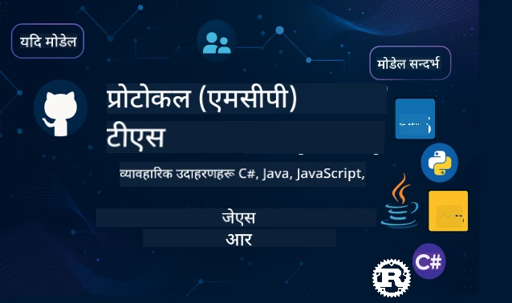

 

[](https://GitHub.com/microsoft/mcp-for-beginners/graphs/contributors)
[](https://GitHub.com/microsoft/mcp-for-beginners/issues)
[](https://GitHub.com/microsoft/mcp-for-beginners/pulls)
[](http://makeapullrequest.com)
[](https://mcptoplist.com/server/mcp.so%2Fmcp-for-beginners%2Fmicrosoft)

[](https://GitHub.com/microsoft/mcp-for-beginners/watchers)
[](https://GitHub.com/microsoft/mcp-for-beginners/fork)
[](https://GitHub.com/microsoft/mcp-for-beginners/stargazers)


[](https://discord.gg/nTYy5BXMWG)

यी स्रोतहरू प्रयोग गर्न सुरु गर्न यी चरणहरू पालन गर्नुहोस्:
1. **रिपोजिटरी फोर्क गर्नुहोस्**: क्लिक गर्नुहोस् [](https://GitHub.com/microsoft/mcp-for-beginners/fork)
2. **रिपोजिटरी क्लोन गर्नुहोस्**:   `git clone https://github.com/microsoft/mcp-for-beginners.git`
3. **सामेल हुनुहोस्** [](https://discord.gg/nTYy5BXMWG)


### 🌐 बहुभाषिक समर्थन

#### GitHub Action मार्फत समर्थन (स्वचालित र सँधै अद्यावधिक)

<!-- CO-OP TRANSLATOR LANGUAGES TABLE START -->
[Arabic](../ar/README.md) | [Bengali](../bn/README.md) | [Bulgarian](../bg/README.md) | [Burmese (Myanmar)](../my/README.md) | [Chinese (Simplified)](../zh-CN/README.md) | [Chinese (Traditional, Hong Kong)](../zh-HK/README.md) | [Chinese (Traditional, Macau)](../zh-MO/README.md) | [Chinese (Traditional, Taiwan)](../zh-TW/README.md) | [Croatian](../hr/README.md) | [Czech](../cs/README.md) | [Danish](../da/README.md) | [Dutch](../nl/README.md) | [Estonian](../et/README.md) | [Finnish](../fi/README.md) | [French](../fr/README.md) | [German](../de/README.md) | [Greek](../el/README.md) | [Hebrew](../he/README.md) | [Hindi](../hi/README.md) | [Hungarian](../hu/README.md) | [Indonesian](../id/README.md) | [Italian](../it/README.md) | [Japanese](../ja/README.md) | [Kannada](../kn/README.md) | [Khmer](../km/README.md) | [Korean](../ko/README.md) | [Lithuanian](../lt/README.md) | [Malay](../ms/README.md) | [Malayalam](../ml/README.md) | [Marathi](../mr/README.md) | [Nepali](./README.md) | [Nigerian Pidgin](../pcm/README.md) | [Norwegian](../no/README.md) | [Persian (Farsi)](../fa/README.md) | [Polish](../pl/README.md) | [Portuguese (Brazil)](../pt-BR/README.md) | [Portuguese (Portugal)](../pt-PT/README.md) | [Punjabi (Gurmukhi)](../pa/README.md) | [Romanian](../ro/README.md) | [Russian](../ru/README.md) | [Serbian (Cyrillic)](../sr/README.md) | [Slovak](../sk/README.md) | [Slovenian](../sl/README.md) | [Spanish](../es/README.md) | [Swahili](../sw/README.md) | [Swedish](../sv/README.md) | [Tagalog (Filipino)](../tl/README.md) | [Tamil](../ta/README.md) | [Telugu](../te/README.md) | [Thai](../th/README.md) | [Turkish](../tr/README.md) | [Ukrainian](../uk/README.md) | [Urdu](../ur/README.md) | [Vietnamese](../vi/README.md)

> **स्थानीय रूपमा क्लोन गर्न रुचाउनुहुन्छ?**
>
> यस रिपोजिटरीमा ५०+ भाषा अनुवादहरू समावेश छन् जसले डाउनलोड साइज उल्लेखनीय बढाउँछ। अनुवादहरू बिना क्लोन गर्न, sparse checkout प्रयोग गर्नुहोस्:
>
> **Bash / macOS / Linux:**
> ```bash
> git clone --filter=blob:none --sparse https://github.com/microsoft/mcp-for-beginners.git
> cd mcp-for-beginners
> git sparse-checkout set --no-cone '/*' '!translations' '!translated_images'
> ```
>
> **CMD (Windows):**
> ```cmd
> git clone --filter=blob:none --sparse https://github.com/microsoft/mcp-for-beginners.git
> cd mcp-for-beginners
> git sparse-checkout set --no-cone "/*" "!translations" "!translated_images"
> ```
>
> यसले तपाईंलाई कोर्स पूरा गर्न आवश्यक सबै कुरा धेरै छिटो डाउनलोड गर्न दिन्छ।
<!-- CO-OP TRANSLATOR LANGUAGES TABLE END -->

# 🚀 शुरुआतीहरूको लागि मोडेल कन्टेक्स्ट प्रोटोकल (MCP) पाठ्यक्रम

## **C#, Java, JavaScript, Rust, Python, र TypeScript मा व्यावहारिक कोड उदाहरणहरूसँग MCP सिक्नुहोस्**

## 🧠 मोडेल कन्टेक्स्ट प्रोटोकल पाठ्यक्रमको अवलोकन
मोडेल कन्टेक्स्ट प्रोटोकलमा तपाईंको यात्रामा स्वागत छ! यदि तपाईंले कहिले सोचेको छ कि AI अनुप्रयोगहरूले विभिन्न उपकरणहरू र सेवाहरू सँग कसरी संवाद गर्छन्, तपाईं एक यस्तो सुन्दर समाधान पत्ता लगाउन लाग्नुभएको छ जसले विकासकर्ताहरूलाई बुद्धिमान प्रणालीहरू बनाउन परिवर्तन गर्दैछ।

MCP लाई AI अनुप्रयोगहरूको लागि विश्वव्यापी अनुवादक जस्तो सोच्नुहोस् - जस्तै USB पोर्टहरूले तपाईंलाई कुनै पनि उपकरण कम्प्युटरसँग जोड्न दिन्छ, MCP ले AI मोडेलहरूलाई कुनै पनि उपकरण वा सेवासँग मानकीकृत तरिकाले जडान गर्न दिन्छ। तपाईं पहिलो च्याटबट बनाउँदै हुनुहुन्छ वा जटिल AI कार्यहरूमा काम गर्दै हुनुहुन्छ, MCP बुझ्नाले तपाईंलाई अझ सक्षम र लचकदार अनुप्रयोगहरू बनाउन शक्ति दिनेछ।

यो पाठ्यक्रम तपाईंको सिकाइ यात्राको लागि धैर्य र माया सहित डिजाइन गरिएको छ। हामी तपाईंले पहिले नै बुझिसक्नुभएको सरल अवधारणाबाट सुरु गर्नेछौं र तपाईंको मनपर्ने प्रोग्रामिङ भाषामा व्यावहारिक अभ्यास मार्फत बिस्तारै दक्षता वृद्धि गर्नेछौं। प्रत्येक चरणमा स्पष्ट व्याख्या, व्यवहारिक उदाहरणहरू, र पर्याप्त प्रोत्साहन समावेश गरिएको छ।

जब तपाईं यो यात्रा पूरा गर्नुहुन्छ, तपाईंले आफ्नो MCP सर्भरहरू निर्माण गर्ने, लोकप्रिय AI प्लेटफर्महरूसँग एकीकृत गर्ने र यो प्रविधिले कसरी AI विकासको भविष्य परिवर्तन गर्दैछ बुझ्ने आत्मविश्वास पाउनुहुनेछ। आउनुहोस् यो रोमाञ्चक साहसिक कार्य सँगै शुरु गरौँ!

### अधिकारिक दस्तावेज र विशिष्टताहरू

यो पाठ्यक्रम **MCP विशिष्टता २०२५-११-२५** (ताजा स्थिर संस्करण) सँग मेल खाँदछ। MCP विशिष्टताले प्रोटोकल संस्करण ट्र्याकिङलाई स्पष्ट बनाउने गरी मिति-आधारित संस्करण (YYYY-MM-DD ढाँचा) प्रयोग गर्दछ।

> **अगाडि हेर्दै:** अर्को विशिष्टता संस्करण, **२०२६-०७-२८**, को रिलिज क्यान्डिडेट जुलाई २८, २०२६ मा जारी हुने तय गरिएको छ। यसले ट्रान्सपोर्ट लेयरमा प्रोटोकललाई स्टेटलेस बनाउँछ, एक्सटेन्सन फ्रेमवर्क (MCP एप्स, टास्कहरू) औपचारिक बनाउँछ, प्राधिकरण कडा पार्दछ, र Roots, Sampling, र Logging लाई डिप्रिकेट गर्दछ। पूर्ण विवरणका लागि हेर्नुहोस् [What's Changing in MCP: The 2026-07-28 Release Candidate](./01-CoreConcepts/mcp-2026-07-28-release-candidate.md) ।

यी स्रोतहरू तपाईंको बुझाइ बढ्दै जाँदा अझ महत्वपूर्ण हुनेछन्, तर तुरुन्तै सबै पढ्न दबाब महसुस नगर्नुहोस्। तपाईंलाई सबैभन्दा रुचि हुने क्षेत्रहरूबाट सुरु गर्नुहोस्!
- 📘 [MCP दस्तावेज](https://modelcontextprotocol.io/) – यो तपाईंको चरण-द्वारा-चरण ट्युटोरियल र प्रयोगकर्ता मार्गदर्शकको स्रोत हो। दस्तावेजिकरण शुरुवातीहरूको लागि स्पष्ट उदाहरणहरूसहित लेखिएको छ जुन तपाईं आफ्नो गतिमा पालना गर्न सक्नुहुन्छ।
- 📜 [MCP विशिष्टता](https://modelcontextprotocol.io/specification/2025-11-25) – यसलाई तपाईंको व्यापक सन्दर्भ म्यानुअलको रूपमा सोच्नुहोस्। पाठ्यक्रम गर्दै जाँदा तपाईं यहाँ विशेष विवरणहरू हेर्न र उन्नत सुविधाहरू अन्वेषण गर्न फर्किने गर्नुहुनेछ।
- 📜 [MCP संस्करण प्रबन्धन](https://modelcontextprotocol.io/specification/versioning) – यसमा प्रोटोकल संस्करण इतिहास र MCP ले मिति-आधारित संस्करण (YYYY-MM-DD ढाँचा) कसरी प्रयोग गर्छ भन्ने जानकारी हुन्छ।
- 🧑‍💻 [MCP GitHub रिपोजिटरी](https://github.com/modelcontextprotocol) – यहाँ तपाईंले विभिन्न प्रोग्रामिङ भाषाहरूमा SDK, उपकरणहरू, र कोड नमूनाहरू पाउनुहुनेछ। यो व्यावहारिक उदाहरणहरू र प्रयोग गर्न तयार कम्पोनेन्टहरूको खजाना जस्तो छ।
- 🌐 [MCP समुदाय](https://github.com/orgs/modelcontextprotocol/discussions) – MCP बारे छलफल गर्न साथी विद्यार्थी र अनुभवी विकासकर्ताहरूको समुदायमा सहभागी हुनुहोस्। यो सहयोगी समुदाय जहाँ प्रश्नहरू स्वागत योग्य छन् र ज्ञान स्वतन्त्र रूपमा साझा हुन्छ।
  
## सिकाइ उद्देश्यहरू

यो पाठ्यक्रमको अन्त्यमा, तपाईं नयाँ क्षमताहरूको बारेमा आत्मविश्वासी र उत्साहित महसुस गर्नुहुनेछ। यहाँ तपाईंले के हासिल गर्नुहुनेछ:

• **MCP आधारभूत कुरा बुझ्नुहोस्**: तपाईं बुझ्नुहुनेछ कि मोडेल कन्टेक्स्ट प्रोटोकल के हो र किन यो AI अनुप्रयोगहरूको सहकार्यमा क्रान्ति ल्याइरहेको छ, जसरी बुझ्न सजिलो उपमा र उदाहरणहरूसँग।

• **तपाईंको पहिलो MCP सर्भर बनाउनुहोस्**: तपाईं आफ्नो रोजेको प्रोग्रामिङ भाषामा काम गर्ने MCP सर्भर निर्माण गर्नु हुनेछ, सरल उदाहरणहरूबाट सुरु गर्दै चरण-द्वारा-चरण तपाईंको सीप बढाउँदै।

• **AI मोडेलहरूलाई वास्तविक उपकरणहरूसँग जडान गर्नुहोस्**: तपाईं सिक्नु हुनेछ कि कसरी AI मोडेलहरू र वास्तविक सेवाहरूबीचको अन्तरलाई पुल गराउने, तपाईंका अनुप्रयोगहरूलाई शक्तिशाली नयाँ क्षमता दिने।

• **सुरक्षा राम्रो अभ्यासहरू कार्यान्वयन गर्नुहोस्**: तपाईं बुझ्नु हुनेछ कसरी तपाईंको MCP कार्यान्वयनहरू सुरक्षित र सुरक्षा कायम गर्ने, जसले तपाईंका अनुप्रयोग र प्रयोगकर्ताहरू दुवैको सुरक्षा गर्ने।

• **आत्मविश्वासका साथ परिनियोजन गर्नुहोस्**: तपाईं जान्नु हुनेछ कसरी तपाईंको MCP परियोजनाहरूलाई विकासबाट उत्पादनमा लैजान, वास्तविक संसारमा काम गर्ने व्यावहारिक परिनियोजन रणनीतिहरूका साथ।

• **MCP समुदायमा सामेल हुनुहोस्**: तपाईं ती विकासकर्ताहरूको बढिरहेको समुदायको भाग बन्नु हुनेछ जसले AI अनुप्रयोग विकासको भविष्य आकार दिइरहेका छन्।

## आवश्यक पृष्ठभूमि

हामी MCP विशिष्टतामा डुब्नुअघि, केही आधारभूत अवधारणाहरूमा तपाईंलाई सहज महसुस गराउनेछौं। यी क्षेत्रमा विशेषज्ञ नभए पनि चिन्ता नलिनुहोस् - हामी सबै आवश्यक कुरा जति अगाडी बढ्छौं त्यति नै स्पष्ट पार्नेछौं!

### प्रोटोकलहरू बुझ्नुहोस् (आधार)

प्रोटोकललाई कुराकानीका नियम जस्तो सोच्नुहोस्। जब तपाईं साथीलाई फोन गर्नुहुन्छ, दुबैजना "नमस्कार" भन्छन् जब जवाफ दिनुहुन्छ, पालैपालो बोल्ने, र अन्त्यमा "विदाई" भन्छन्। कम्प्युटर प्रोग्रामहरूलाई पनि प्रभावकारी संवादका लागि यस्तै नियमहरू आवश्यक हुन्छन्।

MCP एउटा प्रोटोकल हो - सहमति गरिएको नियमहरूको सेट जुन AI मोडेलहरू र अनुप्रयोगहरूलाई उपकरण र सेवाहरूसँग प्रभावकारी "कुरा" गर्न मद्दत गर्दछ। जसरी कुराकानीका नियमहरूले मानिसहरूको संवादलाई सहज बनाउँछ, MCP ले AI अनुप्रयोग संवादलाई अझ भरपर्दो र शक्तिशाली बनाउँछ।

### क्लाइंट-सर्भर सम्बन्धहरू (प्रोग्रामहरू कसरी सँगै काम गर्छन्)

तपाईं हरेक दिन क्लाइंट-सर्भर सम्बन्धहरू प्रयोग गर्नुहुन्छ! जब तपाईं वेब ब्राउजर (क्लाइंट) प्रयोग गरेर वेबसाइट भ्रमण गर्नुहुन्छ, तपाईं वेब सर्भरसँग जडान हुनुहुन्छ जुन पृष्ठ सामग्री पठाउँछ। ब्राउजरले जानकारी कसरी माग्ने थाहा छ र सर्भरले जवाफ दिन जान्दछ।

MCP मा, हामीसँग पनि यस्तै सम्बन्ध छ: AI मोडेलहरू क्लाइंटको रूपमा काम गर्छन् जसले जानकारी वा क्रियाहरू माग्न सक्छन्, जबकि MCP सर्भरहरू त्यस्ता सुविधा प्रदान गर्छन्। यो जस्तै सहायक (सर्भर) छ जसलाई AI ले विशेष कार्यहरू गर्न सोध्न सक्छ।

### मानकीकरण किन महत्वपूर्ण छ (चीजहरू सँगै काम गर्ने बनाउन)

कल्पना गर्नुहोस् यदि प्रत्येक कार निर्माता फरक आकारका इन्धन पम्प प्रयोग गर्थे भने - तपाईंलाई प्रत्येक कारका लागि फरक एडेप्टर चाहिन्छ! मानकीकरण भनेको साझा दृष्टिकोणमा सहमति जनाएर चीजहरू सहजै सँगै काम गर्ने बनाउनु हो।

MCP ले AI अनुप्रयोगहरूका लागि यो मानकीकरण प्रदान गर्छ। प्रत्येक AI मोडेललाई प्रत्येक उपकरणसँग काम गर्न कस्टम कोड बनाउनुपर्ने सट्टा, MCP ले तिनीहरूलाई संवाद गर्न एक सार्वभौम तरिका सिर्जना गर्छ। यसको अर्थ विकासकर्ताहरूले उपकरण एक पटक बनाउँछन् र धेरै विभिन्न AI प्रणालीहरूसँग काम गर्ने बनाउँछन्।

## 🧭 तपाईंको सिकाइ मार्ग अवलोकन

तपाईंको MCP यात्रा सावधानीपूर्वक संरचित छ जसले तपाईंको आत्मविश्वास र सीपहरू क्रमिक रूपमा निर्माण गर्छ। प्रत्येक चरणले नयाँ अवधारणाहरू प्रस्तुत गर्दछ भने पहिले सिकेका कुरा पुनः पुष्टि गर्दछ।

### 🌱 आधार चरण: आधारभूत कुरा बुझ्नुहोस् (मोड्युलहरू ०-२)

यहाँबाट तपाईंको साहसिक यात्रा सुरु हुन्छ! हामी तपाईंलाई MCP अवधारणाहरू परिचित उपमाहरू र सरल उदाहरणहरूको प्रयोग गरेर परिचय गर्नेछौं। तपाईं बुझ्ने हुनुहुनेछ MCP के हो, किन यो छ, र AI विकासको ठूलो संसारमा यसले कहाँ स्थान लिन्छ।


• **मोड्युल 0 - MCP परिचय**: हामी MCP के हो र किन यो आधुनिक AI अनुप्रयोगहरूका लागि यति महत्वपूर्ण छ भनेर अन्वेषण गर्दै सुरु गर्नेछौं। तपाईंले MCP को वास्तविक संसारका प्रयोगहरू देख्नु हुनेछ र बुझ्नु हुनेछ कि यसले विकासकर्ताहरूले सामना गर्ने सामान्य समस्याहरूलाई कसरी समाधान गर्दछ।

• **मोड्युल 1 - मूल अवधारणाहरू व्याख्या गरिएको**: यहाँ तपाईं MCP का अनिवार्य निर्माण ब्लकहरू सिक्नु हुनेछ। हामी धेरै उपमाहरू र दृश्य उदाहरणहरू प्रयोग गर्नेछौं ताकि यी अवधारणाहरू प्राकृतिक र बुझ्न सजिलो महसुस होस्।

• **मोड्युल 2 - MCP मा सुरक्षा**: सुरक्षा सायद डर लाग्दो लाग्न सक्छ, तर हामी तपाईंलाई देखाउनेछौं कि MCP मा निर्मित सुरक्षा सुविधाहरू कसरी समावेश छन् र तपाईंका अनुप्रयोगहरूलाई सुरुदेखि नै सुरक्षा गर्ने उत्तम अभ्यासहरू सिकाउनेछौं।

### 🔨 निर्माण चरण: तपाईंको पहिलो कार्यान्वयनहरू बनाउँदै (मोड्युल 3)

अब साँच्चिकै रमाइलो सुरु हुन्छ! तपाईंले वास्तविक MCP सर्भर र क्लाइन्टहरू बनाउने हातेमालो अनुभव प्राप्त गर्नेछौं। चिन्ता नलिनुहोस् - हामी सरलबाट सुरु गर्नेछौं र प्रत्येक चरणमा तपाईंलाई मार्गनिर्देशन गर्नेछौं।

यस मोड्युलमा धेरै हातेमालो गाइडहरू छन् जसले तपाईंलाई मनपर्ने प्रोग्रामिङ भाषामा अभ्यास गर्न अनुमति दिन्छ। तपाईं आफ्नो पहिलो सर्भर बनाउन, त्यसमा जडान गर्न क्लाइन्ट बनाउने, र लोकप्रिय विकास उपकरणहरू जस्तै VS कोडसँग एकीकरण गर्नेछौं।

प्रत्येक गाइडमा पूर्ण कोड उदाहरणहरू, समस्या समाधान सुझावहरू, र हामीले किन विशेष डिजाइन छनोट गर्ने सोका व्याख्या समावेश छन्। यस चरणको अन्त्यसम्म, तपाईंलाई गर्व लाग्ने गरी काम गर्ने MCP कार्यान्वयनहरू हुनेछन्!

### 🚀 विकास चरण: उन्नत अवधारणाहरू र वास्तविक संसारमा प्रयोग (मोड्युल 4-5)

आधारभूत कुराहरू सिकिसकेपछि, तपाईं परिष्कृत MCP सुविधाहरू अन्वेषण गर्न तयार हुनुहुन्छ। हामी व्यावहारिक कार्यान्वयन रणनीतिहरू, डिबगिङ विधिहरू, र मल्टि-मोडल AI एकीकरण जस्ता उन्नत विषयहरू समेट्नेछौं।

तपाईंले उत्पादन प्रयोगका लागि आफूले बनाएको MCP कार्यान्वयनहरूलाई कसरी मापन गर्ने र Azure जस्ता क्लाउड प्लेटफर्महरूसँग कसरी एकीकृत गर्ने सिक्नु हुनेछ। यी मोड्युलहरूले तपाईंलाई वास्तविक संसारका मागहरू सम्हाल्न सक्ने MCP समाधानहरू निर्माण गर्न तयार पार्नेछन्।

### 🌟 मास्टरी चरण: समुदाय र विशेषज्ञता (मोड्युल 6-11)

अन्तिम चरणले MCP समुदायमा सामेल हुने र तपाईंलाई सबैभन्दा चासो लाग्ने क्षेत्रहरूमा विशेषज्ञता हासिल गर्नेमा केन्द्रित छ। तपाईंले कसरी खुला स्रोत MCP परियोजनाहरूमा योगदान गर्ने, उन्नत प्रमाणीकरण ढाँचाहरू कार्यान्वयन गर्ने, र व्यापक डाटाबेस एकीकृत समाधानहरू निर्माण गर्ने सिक्नु हुनेछ।

मोड्युल 11 विशेष उल्लेखयोग्य छ - यो पूर्ण १३-लाब हातेमालो सिकाइ मार्ग हो जसले तपाईंलाई पोस्टग्रेसक्यूएल एकीकरणसहित उत्पादन-तयार MCP सर्भरहरू निर्माण गर्न सिकाउँछ। यो एउटा क्यापस्टोन प्रोजेक्ट जस्तो छ जुन तपाईंले सिकेका सबै कुराहरूलाई एउटै ठाउँमा ल्याउँछ!

### 📚 पूर्ण पाठ्यक्रम संरचना

| मोड्युल | विषय | विवरण | लिंक |
|--------|-------|-------------|------|
| **मोड्युल 0-3: आधारभूतहरू** | | | |
| 00 | MCP परिचय | मोडेल कन्टेक्स्ट प्रोटोकलको अवलोकन र AI पाइपलाइनहरूमा यसको महत्व | [Read more](./00-Introduction/README.md) |
| 01 | मूल अवधारणाहरू व्याख्या गरिएको | MCP मूल अवधारणाहरूको गहिरो अन्वेषण | [Read more](./01-CoreConcepts/README.md) |
| 1.1 | MCP मा के परिवर्तन हुँदैछ (2026-07-28 RC) | स्टेटलेस प्रोटोकल, एक्सटेन्सन फ्रेमवर्क, र अर्को स्पेक संस्करणमा आउने विशेषताहरू हटाउने | [Guide](./01-CoreConcepts/mcp-2026-07-28-release-candidate.md) |
| 02 | MCP मा सुरक्षा | सुरक्षा खतराहरू र उत्तम अभ्यासहरू | [Read more](./02-Security/README.md) |
| 03 | MCP सँग सुरु गर्ने | वातावरण सेटअप, आधारभूत सर्भर/क्लाइन्ट, एकीकृत | [Read more](./03-GettingStarted/README.md) |
| **मोड्युल 3: तपाईंको पहिलो सर्भर & क्लाइन्ट बनाउँदै** | | | |
| 3.1 | पहिलो सर्भर | तपाईंको पहिलो MCP सर्भर सिर्जना गर्नुहोस् | [Guide](./03-GettingStarted/01-first-server/README.md) |
| 3.2 | पहिलो क्लाइन्ट | आधारभूत MCP क्लाइन्ट विकास गर्नुहोस् | [Guide](./03-GettingStarted/02-client/README.md) |
| 3.3 | LLM सहित क्लाइन्ट | ठूलो भाषा मोडेलहरू एकीकृत गर्नुहोस् | [Guide](./03-GettingStarted/03-llm-client/README.md) |
| 3.4 | VS कोड एकीकरण | VS कोडमा MCP सर्भरहरू उपभोग गर्नुहोस् | [Guide](./03-GettingStarted/04-vscode/README.md) |
| 3.5 | stdio सर्भर | stdio ट्रान्सपोर्ट प्रयोग गरेर सर्भरहरू सिर्जना गर्नुहोस् | [Guide](./03-GettingStarted/05-stdio-server/README.md) |
| 3.6 | HTTP स्ट्रिमिङ | MCP मा HTTP स्ट्रिमिङ लागू गर्नुहोस् | [Guide](./03-GettingStarted/06-http-streaming/README.md) |
| 3.7 | माइक्रोसफ्ट फाउन्ड्री उपकरण | MCP सँग माइक्रोसफ्ट फाउन्ड्री उपकरण प्रयोग गर्नुहोस् | [Guide](./03-GettingStarted/07-aitk/README.md) |
| 3.8 | परीक्षण | तपाईंको MCP सर्भर कार्यान्वयन परीक्षण गर्नुहोस् | [Guide](./03-GettingStarted/08-testing/README.md) |
| 3.9 | वितरण | उत्पादनमा MCP सर्भरहरू परिनियोजन गर्नुहोस् | [Guide](./03-GettingStarted/09-deployment/README.md) |
| 3.10 | उन्नत सर्भर प्रयोग | उन्नत सुविधाहरूको प्रयोग र सुधारिएको वास्तुकलाका लागि उन्नत सर्भरहरू उपयोग गर्नुहोस् | [Guide](./03-GettingStarted/10-advanced/README.md) |
| 3.11 | सरल प्रमाणीकरण | सुरुबाटै प्रमाणीकरण र RBAC देखाउने एक अध्याय | [Guide](./03-GettingStarted/11-simple-auth/README.md) |
| 3.12 | MCP होस्टहरू | Claude Desktop, Cursor, Cline, र अन्य MCP होस्टहरू कन्फिगर गर्नुहोस् | [Guide](./03-GettingStarted/12-mcp-hosts/README.md) |
| 3.13 | MCP निरीक्षक | निरीक्षक उपकरणसँग MCP सर्भरहरू डिबग र परीक्षण गर्नुहोस् | [Guide](./03-GettingStarted/13-mcp-inspector/README.md) |
| 3.14 | नमुना लिने | क्लाइन्टसँग सहकार्य गर्न नमुना लिने प्रयोग गर्नुहोस् | [Guide](./03-GettingStarted/14-sampling/README.md) |
| 3.15 | MCP अनुप्रयोगहरू | MCP अनुप्रयोगहरू बनाउनुहोस् | [Guide](./03-GettingStarted/15-mcp-apps/README.md) |
| **मोड्युल 4-5: व्यावहारिक र उन्नत** | | | |
| 04 | व्यावहारिक कार्यान्वयन | SDK हरु, डिबगिङ, परीक्षण, पुनः प्रयोग गर्ने प्रॉम्प्ट टेम्प्लेटहरू | [Read more](./04-PracticalImplementation/README.md) |
| 4.1 | पेजिनेशन | कर्सर आधारित पेजिनेशनसँग ठूला परिणाम सेटहरू ह्यान्डल गर्ने | [Guide](./04-PracticalImplementation/pagination/README.md) |
| 05 | MCP मा उन्नत विषयहरू | मल्टि-मोडल AI, पैमाना, उद्यम प्रयोग | [Read more](./05-AdvancedTopics/README.md) |
| 5.1 | Azure एकीकरण | Azure सँग MCP एकीकरण | [Guide](./05-AdvancedTopics/mcp-integration/README.md) |
| 5.2 | मल्टि-मोडालिटी | धेरै प्रकारका माध्यमहरूसँग काम गर्ने | [Guide](./05-AdvancedTopics/mcp-multi-modality/README.md) |
| 5.3 | OAuth2 डेमो | OAuth2 प्रमाणीकरण लागू गर्नुहोस् | [Guide](./05-AdvancedTopics/mcp-oauth2-demo/README.md) |
| 5.4 | मूल सन्दर्भहरू | मूल सन्दर्भहरू बुझ्ने र लागू गर्ने | [Guide](./05-AdvancedTopics/mcp-root-contexts/README.md) |
| 5.5 | राउटिङ | MCP राउटिङ रणनीतिहरू | [Guide](./05-AdvancedTopics/mcp-routing/README.md) |
| 5.6 | नमुना लिने | MCP मा नमुना लिने प्रविधिहरू | [Guide](./05-AdvancedTopics/mcp-sampling/README.md) |
| 5.7 | स्केलिङ | MCP कार्यान्वयनहरू स्केल गर्नुहोस् | [Guide](./05-AdvancedTopics/mcp-scaling/README.md) |
| 5.8 | सुरक्षा | उन्नत सुरक्षा विचारहरू | [Guide](./05-AdvancedTopics/mcp-security/README.md) |
| 5.9 | वेब खोज | वेब खोज क्षमता लागू गर्नुहोस् | [Guide](./05-AdvancedTopics/web-search-mcp/README.md) |
| 5.10 | वास्तविक-समय स्ट्रिमिङ | वास्तविक-समय स्ट्रिमिङ सुविधा निर्माण गर्नुहोस् | [Guide](./05-AdvancedTopics/mcp-realtimestreaming/README.md) |
| 5.11 | वास्तविक-समय खोज | वास्तविक-समय खोज लागू गर्नुहोस् | [Guide](./05-AdvancedTopics/mcp-realtimesearch/README.md) |
| 5.12 | Entra ID प्रमाणीकरण | माइक्रोसफ्ट Entra ID सँग प्रमाणीकरण | [Guide](./05-AdvancedTopics/mcp-security-entra/README.md) |
| 5.13 | फाउन्ड्री एकीकरण | माइक्रोसफ्ट फाउन्ड्रीसँग एकीकृत गर्नुहोस् | [Guide](./05-AdvancedTopics/mcp-foundry-agent-integration/README.md) |
| 5.14 | सन्दर्भ ईन्जिनियरिङ | प्रभावकारी सन्दर्भ ईन्जिनियरिङ प्रविधिहरू | [Guide](./05-AdvancedTopics/mcp-contextengineering/README.md) |
| 5.15 | MCP कस्टम ट्रान्सपोर्ट | कस्टम ट्रान्सपोर्ट कार्यान्वयनहरू | [Guide](./05-AdvancedTopics/mcp-transport/README.md) |
| 5.16 | प्रोटोकल सुविधाहरू | प्रगति सूचना, रद्दीकरण, स्रोत टेम्प्लेटहरू | [Guide](./05-AdvancedTopics/mcp-protocol-features/README.md) |
| 5.17 | विरोधी बहु-एजेन्ट तार्किकता | दुई एजेन्टहरूले साझा MCP उपकरणहरू प्रयोग गरी विपरीत पक्षहरूलाई बहस गर्छन्, जसलाई न्यायाधीश एजेन्टले मूल्यांकन गर्छ | [Guide](./05-AdvancedTopics/mcp-adversarial-agents/README.md) |
| **मोड्युल 6-10: समुदाय र सर्वोत्तम अभ्यासहरू** | | | |
| 06 | समुदाय योगदानहरू | MCP इकोसिस्टममा योगदान कसरी गर्ने | [Guide](./06-CommunityContributions/README.md) |
| 07 | प्रारम्भिक अपनत्वबाट सिकाइ | वास्तविक संसारका कार्यान्वयन कथाहरू | [Guide](./07-LessonsfromEarlyAdoption/README.md) |
| 08 | MCP का लागि सर्वोत्तम अभ्यासहरू | प्रदर्शन, त्रुटि-सहिष्णुता, लचिलोपन | [Guide](./08-BestPractices/README.md) |
| 09 | MCP केस अध्ययनहरू | व्यावहारिक कार्यान्वयन उदाहरणहरू | [Guide](./09-CaseStudy/README.md) |
| 10 | हातेमालो कार्यशाला | माइक्रोसफ्ट फाउन्ड्री उपकरणसँग MCP सर्भर निर्माण | [Lab](./10-StreamliningAIWorkflowsBuildingAnMCPServerWithAIToolkit/README.md) |
| **मोड्युल 11: MCP सर्भर हातेमालो लाब** | | | |
| 11 | MCP सर्भर डाटाबेस एकीकरण | PostgreSQL एकीकरणका लागि व्यापक 13-लाब हस्तगत सिकाइ मार्ग | [Labs](./11-MCPServerHandsOnLabs/README.md) |
| 11.1 | परिचय | डाटाबेस एकीकरणसहित MCP को अवलोकन र खुद्रा विश्लेषण उपयोग केस | [Lab 00](./11-MCPServerHandsOnLabs/00-Introduction/README.md) |
| 11.2 | मूल वास्तुकला | MCP सर्भर वास्तुकला, डाटाबेस तहहरू, र सुरक्षा ढाँचाहरू बुझ्ने | [Lab 01](./11-MCPServerHandsOnLabs/01-Architecture/README.md) |
| 11.3 | सुरक्षा र बहु-टेनेन्सी | पंक्ति स्तरको सुरक्षा, प्रमाणीकरण, र बहु-टेनेन्ट डेटा पहुँच | [Lab 02](./11-MCPServerHandsOnLabs/02-Security/README.md) |
| 11.4 | वातावरण सेटअप | विकास वातावरण सेटअप, डकर, Azure स्रोतहरू | [Lab 03](./11-MCPServerHandsOnLabs/03-Setup/README.md) |
| 11.5 | डाटाबेस डिजाइन | PostgreSQL सेटअप, खुद्रा स्किम डिजाइन, र नमूना डेटा | [Lab 04](./11-MCPServerHandsOnLabs/04-Database/README.md) |
| 11.6 | MCP सर्भर कार्यान्वयन | डाटाबेस एकीकरणसँग FastMCP सर्भर निर्माण | [Lab 05](./11-MCPServerHandsOnLabs/05-MCP-Server/README.md) |
| 11.7 | उपकरण विकास | डाटाबेस क्वेरी उपकरण र स्कीमा इन्ट्रोस्पेक्शन सिर्जना | [Lab 06](./11-MCPServerHandsOnLabs/06-Tools/README.md) |
| 11.8 | सेमेन्टिक खोज | Azure OpenAI र pgvector सँग वेक्टर इम्बेडिङ कार्यान्वयन | [Lab 07](./11-MCPServerHandsOnLabs/07-Semantic-Search/README.md) |
| 11.9 | परीक्षण र डिबगिङ | परीक्षण रणनीतिहरू, डिबगिङ उपकरणहरू, र प्रमाणीकरण तरिकाहरू | [Lab 08](./11-MCPServerHandsOnLabs/08-Testing/README.md) |
| 11.10 | VS कोड एकीकरण | VS कोड MCP एकीकरण र AI च्याट उपयोग कन्फिगर गर्नुहोस् | [Lab 09](./11-MCPServerHandsOnLabs/09-VS-Code/README.md) |
| 11.11 | वितरण रणनीतिहरू | डकर वितरण, Azure कन्टेनर अनुप्रयोगहरू, र स्केलिङ विचारहरू | [Lab 10](./11-MCPServerHandsOnLabs/10-Deployment/README.md) |
| 11.12 | अनुगमन | एप्लिकेसन इनसाइट्स, लगिङ, प्रदर्शन अनुगमन | [Lab 11](./11-MCPServerHandsOnLabs/11-Monitoring/README.md) |
| 11.13 | सर्वोत्तम अभ्यासहरू | प्रदर्शन अनुकूलन, सुरक्षा कडा बनाउने, र उत्पादन सुझावहरू | [Lab 12](./11-MCPServerHandsOnLabs/12-Best-Practices/README.md) |
| **मोड्युल 12: MCP उपकरणहरू** | | | |
| 12.1 | उपकरण | Copilot App मा MCP उपयोग गर्नुहोस् | [ Guide ](./12-tooling/README.md) |

### 💻 नमुना कोड परियोजनाहरू

MCP सिक्ने सबैभन्दा रोमाञ्चक भागहरू मध्ये एक हो तपाईंका कोड सीपहरूको क्रमिक विकास देख्नु। हामीले हाम्रो कोड उदाहरणहरूलाई सरलबाट सुरु गरि तपाईंको बुझाइ गहिरो भएसँगै अधिक परिष्कृत बनाउन डिजाइन गरेका छौं। यहाँ हामी कसरी अवधारणाहरू प्रस्तुत गर्छौं - यस्तो कोड जसलाई बुझ्न सजिलो छ तर जसले वास्तविक MCP सिद्धान्तहरू प्रदर्शन गर्दछ, तपाईंलाई मात्र यो कोड के गर्छ भनेर होइन, किन यसरी संरचित छ र यो ठूलो MCP अनुप्रयोगहरूमा कसरी फिट हुन्छ भनेर बुझ्न मद्दत गर्नेछ।

#### आधारभूत MCP क्यालकुलेटर नमुना

| भाषा | विवरण | लिंक |
|----------|-------------|------|

| C# | MCP सर्भर उदाहरण | [कोड हेर्नुहोस्](./03-GettingStarted/samples/csharp/README.md) |
| Java | MCP क्यालकुलेटर | [कोड हेर्नुहोस्](./03-GettingStarted/samples/java/calculator/README.md) |
| JavaScript | MCP डेमो | [कोड हेर्नुहोस्](./03-GettingStarted/samples/javascript/README.md) |
| Python | MCP सर्भर | [कोड हेर्नुहोस्](../../03-GettingStarted/samples/python/mcp_calculator_server.py) |
| TypeScript | MCP उदाहरण | [कोड हेर्नुहोस्](./03-GettingStarted/samples/typescript/README.md) |
| Rust | MCP उदाहरण | [कोड हेर्नुहोस्](./03-GettingStarted/samples/rust/README.md) |

#### उन्नत MCP कार्यान्वयनहरू

| भाषा | वर्णन | लिंक |
|----------|-------------|------|
| C# | उन्नत नमूना | [कोड हेर्नुहोस्](./04-PracticalImplementation/samples/csharp/README.md) |
| Java with Spring | कन्टेनर अनुप्रयोग उदाहरण | [कोड हेर्नुहोस्](./04-PracticalImplementation/samples/java/containerapp/README.md) |
| JavaScript | उन्नत नमूना | [कोड हेर्नुहोस्](./04-PracticalImplementation/samples/javascript/README.md) |
| Python | जटिल कार्यान्वयन | [कोड हेर्नुहोस्](./04-PracticalImplementation/samples/python/README.md) |
| TypeScript | कन्टेनर नमूना | [कोड हेर्नुहोस्](./04-PracticalImplementation/samples/typescript/README.md) |


## 🎯 MCP सिक्नका लागि पूर्वशर्तहरू

यस पाठ्यक्रमबाट अधिकतम लाभ लिनको लागि, तपाईंले हुनुपर्छ:

- कम्तीमा एउट्सा तलका भाषाहरु मध्ये कुनै एकमा प्रोग्रामिङको आधारभूत ज्ञान: C#, Java, JavaScript, Python, वा TypeScript
- क्लाइन्ट-सर्भर मोडेल र API हरुको समझ
- REST र HTTP अवधारणासँग परिचित हुनु
- (वैकल्पिक) AI/ML अवधारणामा पृष्ठभूमि

- सहयोगका लागि हाम्रो समुदाय छलफलमा सामेल हुनु

## 📚 अध्ययन मार्गदर्शन र स्रोतहरू

यस रिपोजिटरीले तपाईंलाई प्रभावकारी रूपमा सिक्न र अन्वेषण गर्न मद्दत गर्ने विभिन्न स्रोतहरू समावेश गर्दछ:

### अध्ययन मार्गदर्शन

एक व्यापक [अध्ययन मार्गदर्शन](./study_guide.md) उपलब्ध छ जसले तपाईंलाई यस रिपोजिटरीलाई प्रभावकारी रूपमा अन्वेषण गर्न मद्दत गर्दछ। यो दृश्य पाठ्यक्रम नक्साले सबै विषयहरू कसरी जोडिएका छन् देखाउँछ र नमूना प्रोजेक्टहरू कसरी प्रभावकारी रूपमा प्रयोग गर्ने भन्ने बारे मार्गदर्शन प्रदान गर्दछ। यदि तपाईं दृश्य सिकाइमा रुचि राख्नुहुन्छ भने यो विशेष गरी उपयोगी छ।

मार्गदर्शनमा समावेश छन्:
- सबै विषयहरू समेटिएको दृश्य पाठ्यक्रम नक्सा
- प्रत्येक रिपोजिटरी सेक्सनको विस्तृत विवरण
- नमूना प्रोजेक्टहरू प्रयोग गर्ने तरिका बारे मार्गनिर्देशन
- विभिन्न कौशल स्तरका लागि सिफारिस गरिएका सिक्ने मार्गहरू
- तपाईँको सिकाइ यात्रालाई पूरक गर्ने अतिरिक्त स्रोतहरू

### परिवर्तन विवरण

हामीले विस्तृत [परिवर्तन विवरण](./changelog.md) राख्छौं जसले पाठ्यक्रम सामग्रीका सबै महत्वपूर्ण अपडेटहरू ट्र्याक गर्दछ, ताकि तपाईं नयाँ सुधार र थपहरू सँग अपडेट रहन सक्नुहुनेछ।
- नयाँ विषयहरू थप
- संरचनात्मक परिवर्तनहरू
- सुविधाहरूमा सुधार
- कागजात अद्यावधिकहरू

## 🛠️ यस पाठ्यक्रमलाई प्रभावकारी रूपमा कसरी प्रयोग गर्ने

यस मार्गदर्शनमा प्रत्येक पाठमा समावेश छन्:

1. MCP अवधारणाहरूको स्पष्ट व्याख्या  
2. बहुभाषी प्रत्यक्ष कोड उदाहरणहरू  
3. वास्तविक MCP अनुप्रयोग निर्माणका अभ्यासहरू  
4. उन्नत सिक्नेहरूका लागि अतिरिक्त स्रोतहरू

### C# सँग MCP सिकौं - ट्युटोरियल श्रृंखला
हामी मोडल कन्टेक्स्ट प्रोटोकल (MCP) को बारेमा सिकौं, जुन AI मोडलहरू र क्लाइन्ट अनुप्रयोगहरू बिच अन्तरक्रियालाई मानकीकृत गर्न डिज़ाइन गरिएको अत्याधुनिक फ्रेमवर्क हो। यो प्रारम्भिक मैत्री सत्रमार्फत, हामी तपाईंलाई MCP परिचय गराउनेछौं र तपाईंको पहिलो MCP सर्भर बनाउन मार्गदर्शन गर्नेछौं।
#### C#: [https://aka.ms/letslearnmcp-csharp](https://aka.ms/letslearnmcp-csharp)
#### Java: [https://aka.ms/letslearnmcp-java](https://aka.ms/letslearnmcp-java)
#### JavaScript: [https://aka.ms/letslearnmcp-javascript](https://aka.ms/letslearnmcp-javascript)
#### Python: [https://aka.ms/letslearnmcp-python](https://aka.ms/letslearnmcp-python)

## 🎓 तपाईंको MCP यात्रा सुरु हुन्छ

बधाई छ! तपाईंले एउटा रोमाञ्चक यात्राको पहिलो कदम चाल्नुभयो जसले तपाईंको प्रोग्रामिङ क्षमताहरू विस्तार गर्नेछ र तपाईंलाई AI विकासको अग्रपङ्क्तिसँग जडान गर्नेछ।

### तपाईंले पहिले नै के हासिल गर्नुभयो

यो परिचय पढेर, तपाईंले पहिले नै आफ्नो MCP ज्ञानको आधार निर्माण गर्न सुरु गरिसक्नुभएको छ। तपाईंले बुझ्नुभयो MCP के हो, किन महत्वपूर्ण छ, र यो पाठ्यक्रमले तपाईंको सिकाइ यात्रालाई कसरी समर्थन गर्नेछ। त्यो ठूलो उपलब्धि हो र यस महत्वपूर्ण प्रविधिमा तपाईंको विशेषज्ञताको सुरुवात हो।

### आगामि साहसिक यात्रामा

तपाईंले मोड्युलहरू मार्फत प्रगतिका क्रममा, सम्झनुहोस् कि हरेक विशेषज्ञ एकपटक विद्यार्थी नै थिए। अहिले जटिल देखिने अवधारणाहरू अभ्यास र प्रयोगसँगै दोस्रो स्वभाव बन्नेछन्। हरेक सानो कदमले शक्तिशाली क्षमताहरू निर्माण गर्दछ जुन तपाईंको विकास क्यारियर भरि काम लाग्नेछ।

### तपाईंको समर्थन नेटवर्क

तपाईं MCP प्रति उत्सुक सिक्नेमन र विशेषज्ञहरूको समुदायमा जोडिनुभएको छ जसले अरूलाई सफल हुन सहयोग गर्न चाहन्छन्। तपाईं कोडिङ चुनौतीमा अड्किनु भएको भए वा कुनै सफलता साझा गर्न उत्साहित हुनुहुन्छ भने, समुदाय तपाईंको यात्रामा समर्थन गर्न तयार छ।

यदि तपाईं अड्किनुभयो वा AI एपहरू बनाउन बारे कुनै प्रश्न छ भने, सहकर्मी सिक्नेहरू र अनुभवी विकासकर्ताहरूसँग MCP सम्बन्धी छलफलहरूमा सामेल हुनुहोस्। यो एक सहायक समुदाय हो जहाँ प्रश्नहरू स्वागतयोग्य छन् र ज्ञान स्वतन्त्र रूपमा साझा गरिन्छ।

[](https://discord.gg/nTYy5BXMWG)

यदि तपाईंलाई उत्पादन प्रतिक्रिया वा सिर्जना गर्दा त्रुटिहरू छन् भने भ्रमण गर्नुहोस्:

[](https://aka.ms/foundry/forum)

### सुरु गर्न तयार हुनुहुन्छ?

तपाईंको MCP साहसिक यात्रा अहिले सुरु हुन्छ! Module 0 बाट सुरु गरी आफ्नो पहिलो हातमा MCP अनुभवमा डुब्नुहोस्, वा नमूना प्रोजेक्टहरू अन्वेषण गरेर तपाईं के बनाउँदै हुनुहुने छ हेर्नुहोस्। सम्झनुहोस् - हरेक विशेषज्ञ ठीक तपाईं जस्तै सुरु भएका थिए, र धैर्य र अभ्याससँग, तपाईं आश्चर्यचकित हुनुहुनेछ के तपाईं गर्न सक्नुहुन्छ।

मोडल कन्टेक्स्ट प्रोटोकल विकासको संसारमा स्वागत छ। आउनुहोस्, सँगै केही अद्भुत निर्माण गरौं!

## 🤝 सिकाइ समुदायमा योगदान

यो पाठ्यक्रम तपाईं जस्ता सिक्नेहरूका योगदानले बलियो हुन्छ! तपाईंले टाइपो सुधार्नुहोस्, स्पष्ट व्याख्या सुझाव गर्नुहोस्, वा नयाँ उदाहरण थप्नुहोस्, तपाईंका योगदानहरूले अन्य शुरुवातीहरूलाई सफल हुन सहयोग गर्छ।

माइक्रोसफ्ट मान्य पेशेवर [Shivam Goyal](https://www.linkedin.com/in/shivam2003/) लाई कोड नमूनाहरू योगदान गर्न धन्यवाद।

योगदान प्रक्रिया स्वागतयोग्य र सहयोगी बन्न डिजाइन गरिएको छ। अधिकांश योगदानहरूलाई Contributor License Agreement (CLA) आवश्यक पर्दछ, तर स्वचालित उपकरणहरूले तपाईंलाई प्रक्रियामा सहज रूपमा मार्गदर्शन गर्नेछन्।

## 📜 खुला स्रोत सिकाइ

यो सम्पूर्ण पाठ्यक्रम MIT [LICENSE](../../LICENSE) अन्तर्गत उपलब्ध छ, जसको अर्थ तपाईं यसलाई स्वतन्त्र रूपमा प्रयोग, संशोधन, र साझा गर्न सक्नुहुन्छ। यसले MCP ज्ञान विकासकर्ताहरूलाई सबै ठाउँमा पहुँचयोग्य बनाउने हाम्रो मिशनलाई समर्थन गर्छ।
## 🤝 योगदान दिशानिर्देशहरू


यस परियोजनाले योगदान र सुझावहरूलाई स्वागत गर्दछ। अधिकांश योगदानहरूले तपाईंलाई स्वीकार्नु आवश्यक हुन्छ
सहायक अनुज्ञापन सम्झौता (CLA) जसले घोषणा गर्छ कि तपाईंसँग अधिकार छ, र वास्तवमा हामीलाई प्रदान गर्न सक्नुहुन्छ
तपाईंको योगदान प्रयोग गर्ने अधिकार। विवरणका लागि <https://cla.opensource.microsoft.com> मा जानुहोस्।

जब तपाईं पुल अनुरोध पेश गर्नुहुन्छ, CLA बोटले स्वचालित रूपमा निर्धारण गर्नेछ कि तपाईंले CLA प्रदान गर्न आवश्यक छ वा छैन
र PR लाई उपयुक्त रूपमा सजाउनेछ (जस्तै, स्थिति जाँच, टिप्पणी)। बोटले दिइएका निर्देशनहरूलाई मात्र पालना गर्नुहोस्।
तपाईंले हाम्रो CLA प्रयोग गर्ने सबै रिपोजहरूमा यो केवल एकपटक गर्नु पर्नेछ।

यस परियोजनाले [Microsoft Open Source Code of Conduct](https://opensource.microsoft.com/codeofconduct/) अपनाएको छ।
थप जानकारीको लागि [Code of Conduct FAQ](https://opensource.microsoft.com/codeofconduct/faq/) हेर्नुहोस् वा
कुनै थप प्रश्न वा टिप्पणीका लागि [opencode@microsoft.com](mailto:opencode@microsoft.com) संपर्क गर्नुहोस्।

---

*के तपाईँ आफ्नो MCP यात्रा सुरु गर्न तयार हुनुहुन्छ? [Module 00 - Introduction to MCP](./00-Introduction/README.md) बाट सुरु गर्नुहोस् र मोडेल कण्टेक्स्ट प्रोटोकल विकासको संसारमा पहिलो पाइलाहरू चाल्नुहोस्!*


## 🎒 अन्य पाठ्यक्रमहरू
हाम्रो टोलीले अन्य पाठ्यक्रमहरू पनि उत्पादन गर्दछ! यहाँ जाँच गर्नुहोस्:

<!-- CO-OP TRANSLATOR OTHER COURSES START -->
### LangChain
[](https://aka.ms/langchain4j-for-beginners)
[](https://aka.ms/langchainjs-for-beginners?WT.mc_id=m365-94501-dwahlin)
[](https://github.com/microsoft/langchain-for-beginners?WT.mc_id=m365-94501-dwahlin)
---

### Azure / Edge / MCP / एजेन्टहरू
[](https://github.com/microsoft/AZD-for-beginners?WT.mc_id=academic-105485-koreyst)
[](https://github.com/microsoft/edgeai-for-beginners?WT.mc_id=academic-105485-koreyst)
[](https://github.com/microsoft/mcp-for-beginners?WT.mc_id=academic-105485-koreyst)
[](https://github.com/microsoft/ai-agents-for-beginners?WT.mc_id=academic-105485-koreyst)

---
 
### जेनेरटिभ AI सिरिज
[](https://github.com/microsoft/generative-ai-for-beginners?WT.mc_id=academic-105485-koreyst)
[-9333EA?style=for-the-badge&labelColor=E5E7EB&color=9333EA)](https://github.com/microsoft/Generative-AI-for-beginners-dotnet?WT.mc_id=academic-105485-koreyst)
[-C084FC?style=for-the-badge&labelColor=E5E7EB&color=C084FC)](https://github.com/microsoft/generative-ai-for-beginners-java?WT.mc_id=academic-105485-koreyst)
[-E879F9?style=for-the-badge&labelColor=E5E7EB&color=E879F9)](https://github.com/microsoft/generative-ai-with-javascript?WT.mc_id=academic-105485-koreyst)

---
 
### कोर सिकाइ
[](https://aka.ms/ml-beginners?WT.mc_id=academic-105485-koreyst)
[](https://aka.ms/datascience-beginners?WT.mc_id=academic-105485-koreyst)
[](https://aka.ms/ai-beginners?WT.mc_id=academic-105485-koreyst)

[](https://github.com/microsoft/Security-101?WT.mc_id=academic-96948-sayoung)
[](https://aka.ms/webdev-beginners?WT.mc_id=academic-105485-koreyst)
[](https://aka.ms/iot-beginners?WT.mc_id=academic-105485-koreyst)
[](https://github.com/microsoft/xr-development-for-beginners?WT.mc_id=academic-105485-koreyst)

---
 
### कोपाइलेट सिरिज
[](https://aka.ms/GitHubCopilotAI?WT.mc_id=academic-105485-koreyst)
[](https://github.com/microsoft/mastering-github-copilot-for-dotnet-csharp-developers?WT.mc_id=academic-105485-koreyst)
[](https://github.com/microsoft/CopilotAdventures?WT.mc_id=academic-105485-koreyst)
<!-- CO-OP TRANSLATOR OTHER COURSES END -->

---

<!-- CO-OP TRANSLATOR DISCLAIMER START -->
**अस्वीकरण**:
यो दस्तावेज़ AI अनुवाद सेवा [Co-op Translator](https://github.com/Azure/co-op-translator) प्रयोग गरेर अनुवाद गरिएको हो। हामी सही हुन प्रयास गर्छौं, तर कृपया जानकार हुनुस् कि स्वचालित अनुवादमा त्रुटिहरू वा अशुद्धताहरू हुन सक्छन्। मूल दस्तावेज़ यसको मूल भाषामा आधिकारिक स्रोत मानिनुपर्छ। महत्वपूर्ण जानकारीका लागि व्यावसायिक मानव अनुवाद सिफारिस गरिन्छ। यस अनुवादको प्रयोगबाट उत्पन्न कुनै पनि गलत बुझाइ वा त्रुटिको लागि हामी जिम्मेवार छैनौं।
<!-- CO-OP TRANSLATOR DISCLAIMER END -->