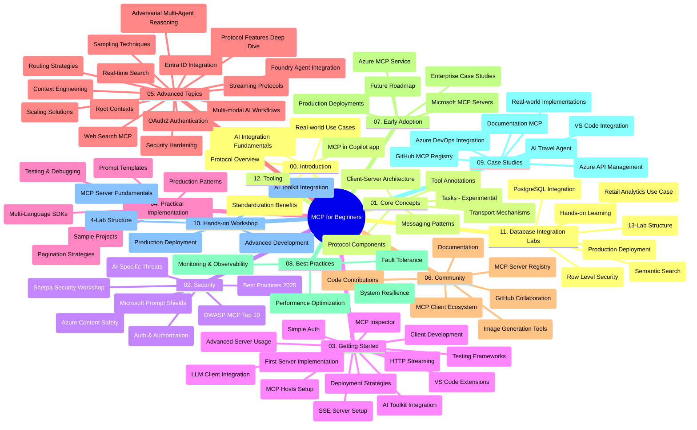

# शुरुवातीहरूको लागि मोडेल सन्दर्भ प्रोटोकल (MCP) - अध्ययन मार्गदर्शन

यो अध्ययन मार्गदर्शनले "शुरुवातीहरूको लागि मोडेल सन्दर्भ प्रोटोकल (MCP)" पाठ्यक्रमका लागि रिपोजिटरी संरचना र सामग्रीको अवलोकन प्रदान गर्दछ। रिपोजिटरीलाई प्रभावकारी रूपमा नेभिगेट गर्न र उपलब्ध स्रोतहरूको अधिकतम लाभ लिन यस मार्गदर्शनको प्रयोग गर्नुहोस्।

## रिपोजिटरी अवलोकन

मोडेल सन्दर्भ प्रोटोकल (MCP) एआई मोडेलहरू र क्लाइन्ट अनुप्रयोगहरू बीच अन्तरक्रियाका लागि एक मानकीकृत फ्रेमवर्क हो। सुरुमा एनथ्रोपिकले बनाएर, MCP अब आधिकारिक GitHub संगठनमार्फत व्यापक MCP समुदायद्वारा सञ्चालित छ। यो रिपोजिटरी एआई विकासकर्ता, सिस्टम आर्किटेक्ट, र सफ्टवेयर ईन्जिनियरहरूको लागि डिजाइन गरिएको C#, Java, JavaScript, Python, र TypeScript मा व्यवहारिक कोड उदाहरणहरू सहित व्यापक पाठ्यक्रम प्रदान गर्दछ।

## दृश्य पाठ्यक्रम नक्सा

## रिपोजिटरी संरचना

यो रिपोजिटरी बारह मुख्य खण्डहरूमा विभाजित छ, प्रत्येकले MCP का विभिन्न पक्षहरूमा ध्यान केन्द्रित गर्दछ:

1. **परिचय (00-Introduction/)**
   - मोडेल सन्दर्भ प्रोटोकलको अवलोकन
   - एआई पाइपलाइनहरूमा मानकीकरण किन महत्त्वपूर्ण छ
   - व्यवहारिक प्रयोग केसहरू र लाभहरू

2. **मूल अवधारणाहरू (01-CoreConcepts/)**
   - क्लाइन्ट-सर्भर संरचना
   - मुख्य प्रोटोकल कमponenteहरू
   - MCP मा सन्देश पठाउने तरिकाहरू
   - हालको विशिष्टता: [MCP मा के परिवर्तन भयो: 2026-07-28 विशिष्टता](./01-CoreConcepts/mcp-2026-07-28.md) — अवस्थारहित प्रोटोकल कोर, विस्तार फ्रेमवर्क, र रूट्स/नमूनाकरण/लगिङ्ग अवमूल्यनहरू

3. **सुरक्षा (02-Security/)**
   - MCP-आधारित प्रणालीहरूमा सुरक्षा खतराहरू
   - कार्यान्वयन सुरक्षित गर्नका लागि उत्तम अभ्यासहरू
   - प्रमाणीकरण र अधिकार रणनीतिहरू
   - व्यवहारिक [CIMD र DCR प्रमाणीकरण नमुना](./02-Security/samples/cimd-dcr-auth/README.md)
   - **व्यापक सुरक्षा कागजातहरू**:
     - MCP सुरक्षा उत्तम अभ्यासहरू
     - Azure सामग्री सुरक्षा कार्यान्वयन मार्गदर्शन
     - MCP सुरक्षा नियन्त्रणहरू र प्रविधिहरू
     - MCP उत्तम अभ्यास तत्पर सन्दर्भ
   - **मुख्य सुरक्षा विषयहरू**:
     - प्रविष्टि सञ्चिका र उपकरण विषाक्तता हमलाहरू
     - सत्र हाइज्याकिङ्ग र भ्रमित उप-प्रतिनिधि समस्याहरू
     - टोकन पासथ्रू भेद्यता
     - अत्यधिक अनुमति र पहुँच नियन्त्रण
     - एआई कम्पोनेन्टहरूको लागि आपूर्ति श्रृंखला सुरक्षा
     - Microsoft प्रविष्टि शिल्ड एकीकरण

4. **सुरु गरौं (03-GettingStarted/)**
   - वातावरण सेटअप र कन्फिगरेसन
   - आधारभूत MCP सर्भरहरू र क्लाइन्टहरू सिर्जना
   - विद्यमान अनुप्रयोगहरूसँग एकीकरण
   - यसमा समावेश छ:
     - पहिलो सर्भर कार्यान्वयन
     - क्लाइन्ट विकास
     - LLM क्लाइन्ट एकीकरण
     - VS कोड एकीकृत
     - सर्भर-भेजाइन इभेन्ट्स (SSE) सर्भर
     - उन्नत सर्भर प्रयोग
     - HTTP स्ट्रिमिङ्ग
     - एआई उपकरण किट एकीकरण
     - परीक्षण रणनीतिहरू
     - परिनियोजन मार्गदर्शन

5. **व्यावहारिक कार्यान्वयन (04-PracticalImplementation/)**
   - विभिन्न प्रोग्रामिङ भाषाहरूमा SDK प्रयोग
   - डिबगिङ, परीक्षण, र प्रमाणीकरण तरिकाहरू
   - पुन: प्रयोग गर्न मिल्ने प्रविष्टि ढाँचा र कार्यप्रवाह निर्माण
   - कार्यान्वयन उदाहरणहरूसहित नमूना परियोजनाहरू

6. **उन्नत विषयहरू (05-AdvancedTopics/)**
   - सन्दर्भ इन्जिनियरिङ्ग प्रविधिहरू
   - फाउन्ड्री एजेन्ट एकीकरण
   - बहु-मोडल एआई कार्यप्रवाहहरू
   - OAuth2 प्रमाणीकरण डेमोहरू
   - वास्तविक समय खोज क्षमताहरू
   - वास्तविक समय स्ट्रिमिङ्ग
   - मूल सन्दर्भ कार्यान्वयन
   - मार्ग निर्देशन रणनीतिहरू
   - नमूनाकरण प्रविधिहरू
   - स्तरबद्ध विधिहरू
   - सुरक्षा विषयहरू
   - Entra ID सुरक्षा एकीकरण
   - वेब खोज एकीकरण
   - विरोधात्मक बहु-एजेन्ट तर्क (बहस नमूनाहरू)

7. **समुदाय सहयोग (06-CommunityContributions/)**
   - कोड र कागजात प्रस्तुत गर्ने तरिका
   - GitHub मार्फत सहकार्य
   - समुदाय-चालित सुधार र प्रतिक्रिया
   - विभिन्न MCP क्लाइन्टहरू (Claude Desktop, Cline, VSCode) को प्रयोग
   - छविहरू सिर्जना गर्ने लोकप्रिय MCP सर्भरहरूसँग काम

8. **पहिलो अंगीकारबाट सिकाइहरू (07-LessonsfromEarlyAdoption/)**
   - वास्तविक कार्यान्वयनहरू र सफलता कथाहरू
   - MCP-आधारित समाधान निर्माण र परिनियोजन
   - प्रवृत्ति र भविष्यको रोडम्याप
   - **Microsoft MCP सर्भरहरू गाइड**: १० उत्पादन-तय Microsoft MCP सर्भर समावेश विस्तृत मार्गदर्शन:
     - Microsoft Learn Docs MCP सर्भर
     - Azure MCP सर्भर (१५+ विशेष कनेक्टरहरू)
     - GitHub MCP सर्भर
     - Azure DevOps MCP सर्भर
     - MarkItDown MCP सर्भर
     - SQL Server MCP सर्भर
     - Playwright MCP सर्भर
     - Dev Box MCP सर्भर
     - Microsoft Foundry MCP सर्भर
     - Microsoft 365 एजेन्ट्स टूलकिट MCP सर्भर

9. **उत्तम अभ्यासहरू (08-BestPractices/)**
   - प्रदर्शन ट्यूनिङ्ग र अनुकूलन
   - दोष-तहक MCP प्रणाली डिजाइन
   - परीक्षण र दृढता रणनीतिहरू

10. **केस अध्ययनहरू (09-CaseStudy/)**
    - विभिन्न परिस्थितिहरूमा MCP बहुमुखी प्रतिभा देखाउने सातवटा व्यापक केस अध्ययनहरू:
    - **Azure AI यात्रा एजेन्टहरू**: Azure OpenAI र एआई खोजसँग बहु-एजेन्ट समन्वय
    - **Azure DevOps एकीकरण**: YouTube डेटा अपडेटहरूसँग कार्यप्रवाह प्रक्रिया स्वचालित बनाउँदै
    - **रियल-टाइम कागजात पुनःप्राप्ति**: स्ट्रिमिङ HTTP सहितको Python कन्सोल क्लाइन्ट
    - **इन्टरेक्टिभ अध्ययन योजना जेनेरेटर**: conversational AI सहित Chainlit वेब एप
    - **इन-एडिटर कागजात**: GitHub Copilot कार्यप्रवाहहरूसँग VS Code एकीकरण
    - **Azure API व्यवस्थापन**: MCP सर्भर सिर्जना सहित उद्यम API एकीकरण
    - **GitHub MCP रजिस्ट्री**: इकोसिस्टम विकास र एजेन्टिक एकीकरण प्लेटफर्म
    - उद्यम एकीकरण, विकासकर्ता उत्पादकता, र इकोसिस्टम विकासमा कार्यान्वयन उदाहरणहरू

11. **व्यावहारिक कार्यशाला (10-StreamliningAIWorkflowsBuildingAnMCPServerWithAIToolkit/)**
    - MCP र AI टूलकिट मिलेर व्यापक व्यवहारिक कार्यशाला
    - वास्तविक संसारका उपकरणहरूसँग AI मोडेलहरू जोड्ने बौद्धिक अनुप्रयोगहरू बनाउँदै
    - मूलभूत, अनुकूलित सर्भर विकास, र उत्पादन परिनियोजन रणनीतिहरू समेट्ने व्यवहारिक मोड्यूलहरू
    - **प्रयोगशाला संरचना**:
      - प्रयोगशाला 1: MCP सर्भर मूलभूतहरू
      - प्रयोगशाला 2: उन्नत MCP सर्भर विकास
      - प्रयोगशाला 3: AI टूलकिट एकीकरण
      - प्रयोगशाला 4: उत्पादन परिनियोजन र स्तरबद्धता
    - चरण-द्वारा-चरण निर्देशन सहित प्रयोगशाला-आधारित सिकाइ

12. **MCP सर्भर डाटाबेस एकीकरण प्रयोगशाला (11-MCPServerHandsOnLabs/)**
    - उत्पादन-तय MCP सर्भरहरू PostgreSQL एकीकरणसँग निर्माणका लागि व्यापक १३-प्रयोगशाला सिकाइ मार्ग
    - Zava खुद्रा प्रयोग केस प्रयोग गरी वास्तविक विश्व खुद्रा विश्लेषण कार्यान्वयन
    - उद्यम-स्तरका ढाँचाहरू, जसमा रो स्तर सुरक्षा (RLS), सेमान्टिक खोज, र बहु-भाडामा डाटा पहुँच समावेश छन्
    - **पूर्ण प्रयोगशाला संरचना**:
      - **प्रयोगशाला ००-०३: आधार** - परिचय, संरचना, सुरक्षा, वातावरण सेटअप
      - **प्रयोगशाला ०४-०६: MCP सर्भर निर्माण** - डाटाबेस डिजाइन, MCP सर्भर कार्यान्वयन, टूल विकास
      - **प्रयोगशाला ०७-०९: उन्नत सुविधाहरू** - सेमान्टिक खोज, परीक्षण र डिबगिङ्ग, VS कोड एकीकरण
      - **प्रयोगशाला १०-१२: उत्पादन र उत्तम अभ्यासहरू** - परिनियोजन, अनुगमन, अनुकूलन
    - **संयुक्त प्रविधिहरू**: FastMCP फ्रेमवर्क, PostgreSQL, Azure OpenAI, Azure कण्टेनर एप्स, अनुप्रयोग अन्तर्दृष्टि
    - **सिकाइ परिणामहरू**: उत्पादन-तय MCP सर्भरहरू, डाटाबेस एकीकरण ढाँचा, एआई-सञ्चालित विश्लेषण, उद्यम सुरक्षा

13. **उपकरणहरू (12-tooling/)**
    - MCP लाई Copilot एप र अन्य उपकरणहरूमा कसरी प्रयोग गर्ने जान्नुहोस्

## थप स्रोतहरू

रिपोजिटरीमा समर्थन गर्ने स्रोतहरू छन्:

- **छविहरू फोल्डर**: पाठ्यक्रमभर प्रयोग गरिएका रेखाचित्र र चित्रहरू समावेश
- **अनुवादहरू**: कागजातहरूको स्वचालित अनुवाद सहित बहुभाषी समर्थन
- **आधिकारिक MCP स्रोतहरू**:
  - [MCP कागजात](https://modelcontextprotocol.io/)
  - [MCP विशिष्टता](https://modelcontextprotocol.io/specification/2026-07-28/)
  - [MCP GitHub रिपोजिटरी](https://github.com/modelcontextprotocol)

## यो रिपोजिटरी कसरी प्रयोग गर्ने

1. **क्रमिक सिकाइ**: संगठित सिकाइ अनुभवको लागि अध्यायहरूलाई अनुक्रममा (०० देखि ११ सम्म) पालना गर्नुहोस्।
2. **भाषा-विशेष ध्यान**: यदि तपाइँलाई कुनै विशेष प्रोग्रामिङ भाषा रुचि छ भने, तपाईंको मनपर्ने भाषामा कार्यान्वयनहरूको लागि नमूना निर्देशिकाहरू अन्वेषण गर्नुहोस्।
3. **व्यावहारिक कार्यान्वयन**: आफ्नो वातावरण सेटअप गर्न र पहिलो MCP सर्भर र क्लाइन्ट बनाउनको लागि "सुरु गरौं" खण्डबाट सुरु गर्नुहोस्।
4. **उन्नत अन्वेषण**: आधारभूतमा सहज भएपछि आफ्नो ज्ञान विस्तार गर्न उन्नत विषयहरूमा प्रवेश गर्नुहोस्।
5. **समुदाय सहभागिता**: GitHub छलफलहरू र Discord च्यानलहरू मार्फत MCP समुदायमा सामेल हुनुहोस् र विज्ञहरू र सह-विकासकर्ताहरूसँग जडान गर्नुहोस्।

## MCP क्लाइन्टहरू र उपकरणहरू

पाठ्यक्रमले विभिन्न MCP क्लाइन्टहरू र उपकरणहरू समावेश गर्दछ:

1. **आधिकारिक क्लाइन्टहरू**:
   - Visual Studio Code 
   - Visual Studio Code मा MCP
   - Claude Desktop
   - VSCode मा Claude 
   - Claude API

2. **समुदाय क्लाइन्टहरू**:
   - Cline (टर्मिनल-आधारित)
   - Cursor (कोड सम्पादक)
   - ChatMCP
   - Windsurf

3. **MCP व्यवस्थापन उपकरणहरू**:
   - MCP CLI
   - MCP व्यवस्थापक
   - MCP लिंक
   - MCP राउटर

## लोकप्रिय MCP सर्भरहरू

यो रिपोजिटरीले विभिन्न MCP सर्भरहरू परिचय गराउँछ, जसमा समावेश छन्:

1. **आधिकारिक Microsoft MCP सर्भरहरू**:
   - Microsoft Learn Docs MCP सर्भर
   - Azure MCP सर्भर (१५+ विशेष कनेक्टरहरू)
   - GitHub MCP सर्भर
   - Azure DevOps MCP सर्भर
   - MarkItDown MCP सर्भर
   - SQL Server MCP सर्भर
   - Playwright MCP सर्भर
   - Dev Box MCP सर्भर
   - Microsoft Foundry MCP सर्भर
   - Microsoft 365 एजेन्ट्स टूलकिट MCP सर्भर

2. **आधिकारिक संदर्भ सर्भरहरू**:
   - फाइल सिस्टम
   - फेच
   - मेमोरी
   - अनुक्रमिक सोच

3. **छवि सिर्जना**:
   - Azure OpenAI DALL-E 3
   - स्थिर प्रसारण वेबUI
   - प्रतिकृति

4. **विकास उपकरणहरू**:
   - Git MCP
   - टर्मिनल नियन्त्रण
   - कोड सहायक

5. **विशेष सर्भरहरू**:
   - सेल्सफोर्स
   - Microsoft Teams
   - Jira र Confluence

## योगदान गर्ने

यो रिपोजिटरी समुदायबाट योगदानहरूको स्वागत गर्छ। MCP पारिस्थितिकी तन्त्रमा प्रभावकारी रूपमा योगदान कसरी गर्ने भन्ने मार्गदर्शनका लागि समुदाय सहयोग खण्ड हेर्नुहोस्।

----

*यो अध्ययन मार्गदर्शन अन्तिम पटक सेप्टेम्बर ९, २०२६ मा अद्यावधिक गरिएको हो। यसले MCP
विशिष्टता `2026-07-28` लाई प्रतिबिम्बित गर्छ, जुन हालको प्रोटोकल संशोधन हो। केही व्यवहारिक
उदाहरणहरू अझै स्पष्ट रूपमा `2025-11-25` को संस्करणमा राखिएका छन् भने तिनका SDKs र उपकरणहरूले
अवस्थारहित प्रोटोकल APIहरू अंगिकार गरेका छन्।*

---

<!-- CO-OP TRANSLATOR DISCLAIMER START -->
**अस्वीकरण**:
यो दस्तावेज़ AI अनुवाद सेवा [Co-op Translator](https://github.com/Azure/co-op-translator) प्रयोग गरेर अनुवाद गरिएको हो। हामी सही हुन प्रयास गर्छौं, तर कृपया जानकार हुनुस् कि स्वचालित अनुवादमा त्रुटिहरू वा अशुद्धताहरू हुन सक्छन्। मूल दस्तावेज़ यसको मूल भाषामा आधिकारिक स्रोत मानिनुपर्छ। महत्वपूर्ण जानकारीका लागि व्यावसायिक मानव अनुवाद सिफारिस गरिन्छ। यस अनुवादको प्रयोगबाट उत्पन्न कुनै पनि गलत बुझाइ वा त्रुटिको लागि हामी जिम्मेवार छैनौं।
<!-- CO-OP TRANSLATOR DISCLAIMER END -->