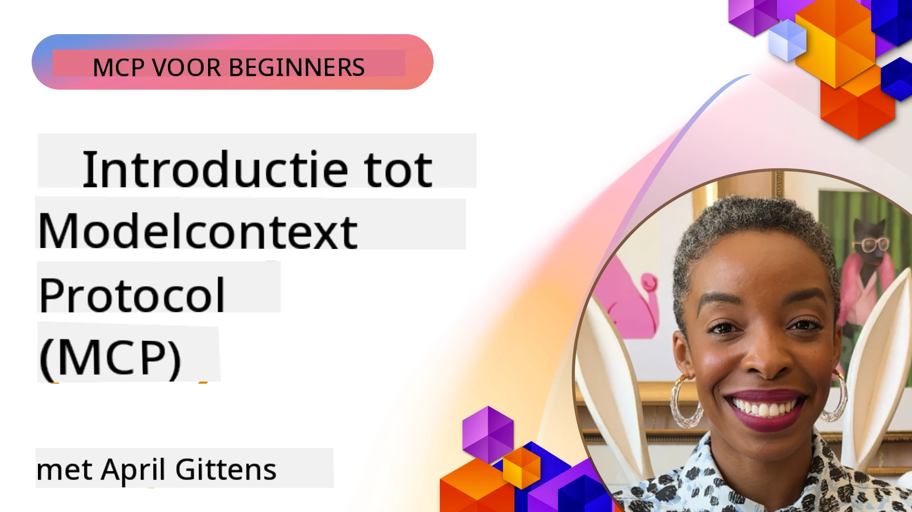
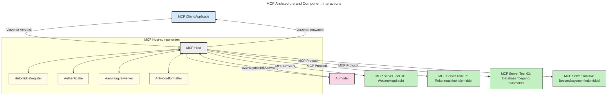
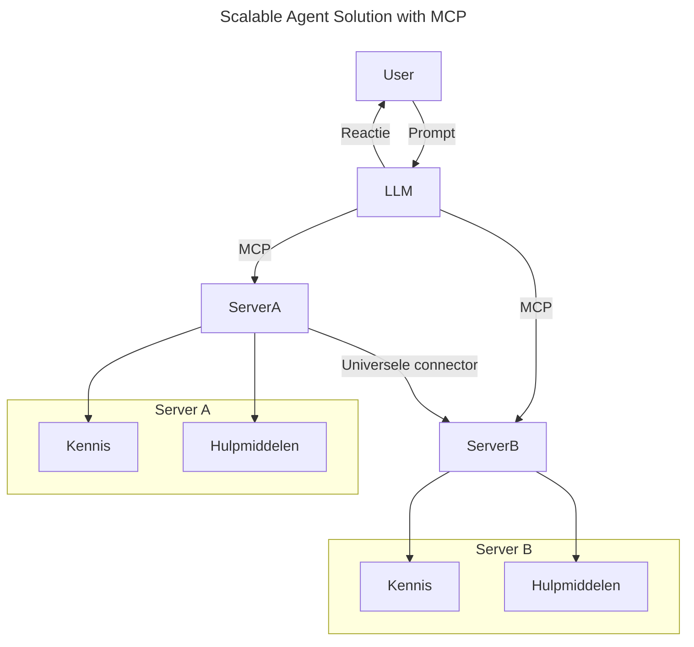
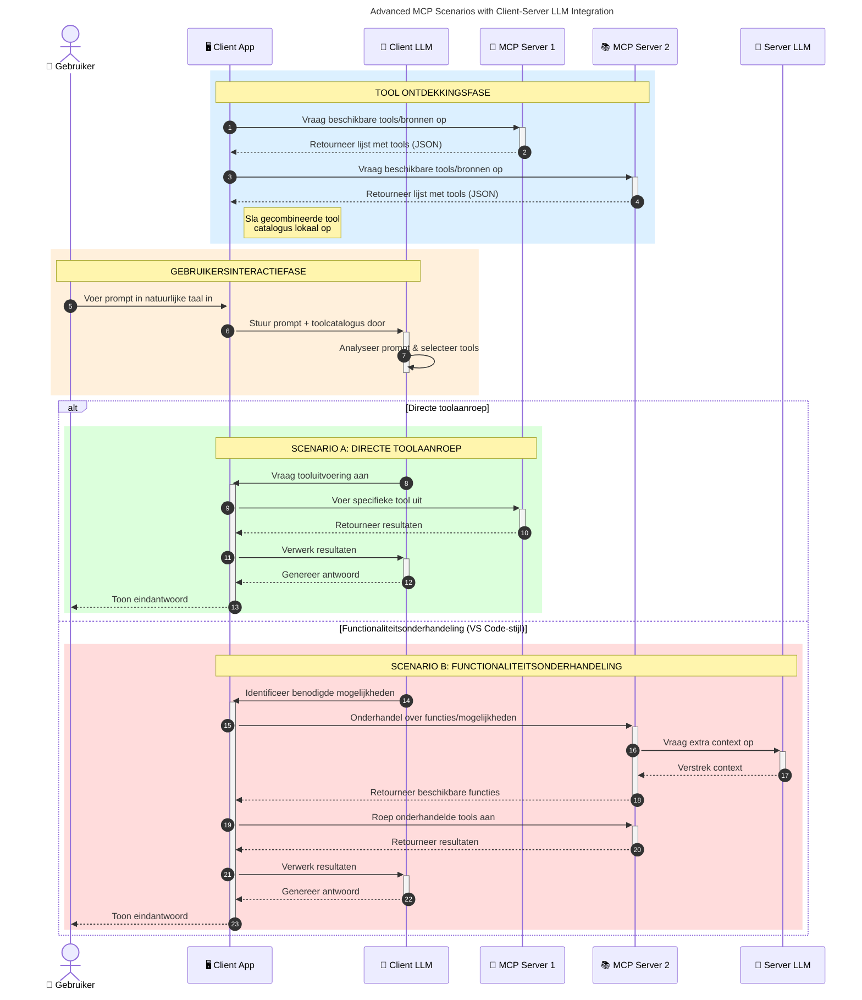

# Introductie tot het Model Context Protocol (MCP): Waarom het belangrijk is voor schaalbare AI-toepassingen

_(Klik op de afbeelding hierboven om de video van deze les te bekijken)_

Generatieve AI-toepassingen zijn een grote stap vooruit, omdat ze gebruikers vaak laten communiceren met de app via natuurlijke taal prompts. Maar naarmate er meer tijd en middelen in zulke apps worden geïnvesteerd, wil je ervoor zorgen dat je functionaliteiten en bronnen gemakkelijk kunt integreren op een manier die eenvoudig uit te breiden is, dat je app meerdere modellen tegelijk kan bedienen, en verschillende modelnuances aankan. Kortom, het bouwen van Gen AI-apps is makkelijk om mee te beginnen, maar naarmate ze groeien en complexer worden, moet je een architectuur gaan definiëren en zal je waarschijnlijk moeten vertrouwen op een standaard om te verzekeren dat je apps op een consistente manier gebouwd worden. Hier komt MCP in beeld om zaken te organiseren en een standaard te bieden.

---

## **🔍 Wat is het Model Context Protocol (MCP)?**

Het **Model Context Protocol (MCP)** is een **open, gestandaardiseerde interface** die het mogelijk maakt dat Grote Taalmodellen (LLM's) naadloos kunnen samenwerken met externe tools, API's en databronnen. Het biedt een consistente architectuur om de functionaliteit van AI-modellen uit te breiden voorbij hun trainingsdata, waardoor slimmere, schaalbaardere en meer responsieve AI-systemen mogelijk worden.

---

## **🎯 Waarom standaardisatie in AI belangrijk is**

Naarmate generatieve AI-toepassingen complexer worden, is het essentieel om standaarden te adopteren die zorgen voor **schaalbaarheid, uitbreidbaarheid, onderhoudbaarheid** en **het vermijden van vendor lock-in**. MCP voorziet in deze behoeften door:

- Integratie van model en tools te verenigen
- Het verminderen van breekbare, eenmalige maatwerkoplossingen
- Het mogelijk maken dat meerdere modellen van verschillende leveranciers binnen één ecosysteem naast elkaar bestaan

**Opmerking:** Hoewel MCP zich profileert als een open standaard, zijn er geen plannen om MCP te standaardiseren via bestaande standaardisatie-instellingen zoals IEEE, IETF, W3C, ISO of enige andere standaardisatie-organisatie.

---

## **📚 Leerdoelen**

Aan het einde van dit artikel kun je:

- Het **Model Context Protocol (MCP)** definiëren en de toepassingsgebieden ervan benoemen
- Begrijpen hoe MCP standaardiseert hoe modellen met tools communiceren
- De kerncomponenten van de MCP-architectuur identificeren
- De toepassingen van MCP in de praktijk verkennen binnen ondernemingen en ontwikkelcontexten

---

## **💡 Waarom het Model Context Protocol (MCP) een doorbraak is**

### **🔗 MCP lost fragmentatie in AI-interacties op**

Voor MCP vereiste het integreren van modellen met tools:

- Maatwerkcode per tool-model combinatie
- Niet-standaard API's per leverancier
- Regelmatige onderbrekingen door updates
- Slechte schaalbaarheid bij meer tools

### **✅ Voordelen van MCP-standaardisatie**

| **Voordeel**               | **Beschrijving**                                                              |
|---------------------------|--------------------------------------------------------------------------------|
| Interoperabiliteit         | LLM's werken naadloos samen met tools van verschillende leveranciers          |
| Consistentie              | Uniform gedrag over platforms en tools                                        |
| Herbruikbaarheid           | Tools die eenmaal gebouwd zijn, kunnen hergebruikt worden in projecten en systemen |
| Versnelde ontwikkeling    | Verminder ontwikkeltijd door gebruik van gestandaardiseerde, plug-and-play interfaces |

---

## **🧱 Overzicht van de MCP-architectuur op hoog niveau**

MCP volgt een **client-server model**, waarbij:

- **MCP Hosts** de AI-modellen draaien
- **MCP Clients** verzoeken initiëren
- **MCP Servers** context, tools en mogelijkheden aanbieden

### **Kerncomponenten:**

- **Resources** – Statische of dynamische data voor modellen  
- **Prompts** – Vooraf gedefinieerde workflows voor begeleide generatie  
- **Tools** – Uitvoerbare functies zoals zoeken, berekeningen  
- **Sampling** – Agentisch gedrag via recursieve interacties (vervallen in
    MCP `2026-07-28`; nieuwe implementaties dienen direct te integreren met een LLM
    provider)
- **Elicitation** – Server-geïnitieerde verzoeken om gebruikersinvoer
- **Roots** – Informatieve bestandslocaties die relevant zijn voor een server
    (vervallen in MCP `2026-07-28`; geef de voorkeur aan toolparameters, resource-URI's, of
    serverconfiguratie)

### **Protocolarchitectuur:**

MCP gebruikt een architectuur met twee lagen:
- **Datalayer**: JSON-RPC 2.0 berichten, per-verzoek metadata, ontdekking en
    protocolprimitieven
- **Transportlaag**: stdio voor lokale subprocessen en Streamable HTTP voor
    externe servers. Streamable HTTP kan SSE framing gebruiken voor gestreamde antwoorden,
    maar de oudere HTTP+SSE transportmethode is verouderd.

---

## Hoe MCP Servers Werken

MCP-servers werken op de volgende manier:

- **Verzoekstroom**:
    1. Een verzoek wordt gestart door een eindgebruiker of software die namens hen handelt.
    2. De **MCP Client** stuurt het verzoek naar een **MCP Host**, die de AI model runtime beheert.
    3. Het **AI Model** ontvangt de gebruikersprompt en kan via één of meerdere tool-oproepen toegang vragen tot externe tools of data.
    4. De **MCP Host**, niet het model direct, communiceert met de juiste **MCP Server(s)** via het gestandaardiseerde protocol.
- **MCP Host Functionaliteit**:
    - **Toolregister**: Beheert een catalogus van beschikbare tools en hun mogelijkheden.
    - **Authenticatie**: Verifieert toestemming voor tooltoegang.
    - **Request Handler**: Verwerkt inkomende toolverzoeken van het model.
    - **Response Formatter**: Structureert tooluitvoer in een formaat dat het model kan begrijpen.
- **MCP Server Uitvoering**:
    - De **MCP Host** leidt tool-oproepen door naar één of meerdere **MCP Servers**, die elk gespecialiseerde functies aanbieden (bijv. zoeken, berekeningen, databasequeries).
    - De **MCP Servers** voeren hun respectieve taken uit en sturen resultaten terug aan de **MCP Host** in een consistent formaat.
    - De **MCP Host** formatteert en zendt deze resultaten door naar het **AI Model**.
- **Afhandeling van reactie**:
    - Het **AI Model** verwerkt de toolresultaten in een definitief antwoord.
    - De **MCP Host** stuurt dit antwoord terug naar de **MCP Client**, die het levert aan de eindgebruiker of aanroepende software.
    

## 👨‍💻 Hoe bouw je een MCP Server (Met Voorbeelden)

MCP-servers stellen je in staat om LLM-mogelijkheden uit te breiden door data en functionaliteit te leveren.

Klaar om het uit te proberen? Hier zijn taal- en/of stack-specifieke SDK's met voorbeelden van eenvoudige MCP-servers in verschillende talen/stacks:

- **Python SDK**: https://github.com/modelcontextprotocol/python-sdk

- **TypeScript SDK**: https://github.com/modelcontextprotocol/typescript-sdk

- **Java SDK**: https://github.com/modelcontextprotocol/java-sdk

- **C#/.NET SDK**: https://github.com/modelcontextprotocol/csharp-sdk

## 🌍 Praktische toepassingsgevallen voor MCP

MCP maakt een breed scala aan toepassingen mogelijk door AI-mogelijkheden uit te breiden:

| **Toepassing**              | **Beschrijving**                                                              |
|----------------------------|--------------------------------------------------------------------------------|
| Enterprise Data-integratie | Verbind LLM's met databases, CRM's of interne tools                           |
| Agentische AI-systemen      | Stel autonome agents in staat met tooltoegang en besluitvormingsworkflows      |
| Multi-modale toepassingen  | Combineer tekst-, beeld- en audio-tools binnen één uniforme AI-app            |
| Integratie van realtime data| Breng live data in AI-interacties voor nauwkeurigere, actuele output          |

### 🧠 MCP = Universele standaard voor AI-interacties

Het Model Context Protocol (MCP) fungeert als een universele standaard voor AI-interacties, vergelijkbaar met hoe USB-C fysieke connecties voor apparaten standaardiseerde. In de AI-wereld biedt MCP een consistente interface, waarmee modellen (clients) naadloos kunnen integreren met externe tools en dataproviders (servers). Dit elimineert de noodzaak voor diverse, aangepaste protocollen voor elke API of databron.

Onder MCP volgt een MCP-compatibele tool (een MCP-server genoemd) een uniforme standaard. Deze servers kunnen de tools of acties die ze aanbieden vermelden en deze acties uitvoeren wanneer een AI-agent erom vraagt. AI-agentplatforms die MCP ondersteunen kunnen beschikbare tools van de servers ontdekken en ze aanroepen via dit standaardprotocol.

### 💡 Faciliteert toegang tot kennis

Naast het aanbieden van tools faciliteert MCP ook de toegang tot kennis. Het stelt applicaties in staat om context te bieden aan grote taalmodellen (LLM's) door ze te koppelen aan diverse databronnen. Bijvoorbeeld, een MCP-server kan een bedrijfsdocumentenrepository vertegenwoordigen, waarmee agents relevante informatie op aanvraag kunnen ophalen. Een andere server zou specifieke acties kunnen afhandelen zoals het verzenden van e-mails of het bijwerken van records. Vanuit het perspectief van de agent zijn dit eenvoudigweg tools die hij kan gebruiken — sommige tools geven data terug (kenniscontext), andere voeren acties uit. MCP beheert beide efficiënt.

Een agent die verbinding maakt met een MCP-server leert automatisch over de beschikbare mogelijkheden en toegankelijke data van de server via een standaardformaat. Deze standaardisatie maakt dynamische toolbeschikbaarheid mogelijk. Bijvoorbeeld, door een nieuwe MCP-server toe te voegen aan het systeem van een agent, worden de functies daarvan direct bruikbaar zonder verdere aanpassing van de agentinstructies.

Deze gestroomlijnde integratie sluit aan bij de flow die in het volgende diagram wordt weergegeven, waarbij servers zowel tools als kennis leveren, wat zorgt voor naadloze samenwerking tussen systemen.

### 👉 Voorbeeld: schaalbare agent-oplossing

De Universal Connector stelt MCP-servers in staat om met elkaar te communiceren en mogelijkheden te delen, waardoor ServerA taken kan delegeren aan ServerB of toegang kan krijgen tot diens tools en kennis. Dit federationeert tools en data over servers heen, wat schaalbare en modulaire agent-architecturen ondersteunt. Omdat MCP de toolexposure standaardiseert, kunnen agents dynamisch tools ontdekken en verzoeken tussen servers routeren zonder vaste integraties.

Federatie van tools en kennis: tools en data kunnen over servers heen worden geraadpleegd, wat meer schaalbare en modulaire agentische architecturen mogelijk maakt.

### 🔄 Geavanceerde MCP-scenario's met client-side LLM-integratie

Naast de basisarchitectuur van MCP zijn er geavanceerde scenario's waarin zowel client als server LLM's bevatten, wat meer verfijnde interacties mogelijk maakt. In het volgende diagram zou **Client App** een IDE kunnen zijn met een aantal MCP-tools beschikbaar voor gebruik door de LLM:

## 🔐 Praktische voordelen van MCP

Hier zijn de praktische voordelen van het gebruik van MCP:

- **Actualiteit**: Modellen kunnen toegang krijgen tot up-to-date informatie buiten hun trainingsdata
- **Uitbreiding van mogelijkheden**: Modellen kunnen gespecialiseerde tools gebruiken voor taken waarvoor ze niet getraind zijn
- **Minder hallucinaties**: Externe databronnen zorgen voor feitelijke onderbouwing
- **Privacy**: Gevoelige data kan binnen veilige omgevingen blijven in plaats van in prompts ingebed te worden

## 📌 Belangrijkste conclusies

Hieronder volgen de belangrijkste conclusies bij het gebruik van MCP:

- **MCP** standaardiseert hoe AI-modellen met tools en data interacteren
- Bevordert **uitbreidbaarheid, consistentie en interoperabiliteit**
- MCP helpt **ontwikkeltijd te verminderen, betrouwbaarheid te verbeteren en modelmogelijkheden uit te breiden**
- De client-server architectuur **maakt flexibele, uitbreidbare AI-toepassingen mogelijk**

## 🧠 Oefening

Denk na over een AI-toepassing die je graag zou willen bouwen.

- Welke **externe tools of data** zouden de mogelijkheden kunnen verbeteren?
- Hoe zou MCP integratie **eenvoudiger en betrouwbaarder** kunnen maken?

## Extra bronnen

- [MCP GitHub Repository](https://github.com/modelcontextprotocol)

## Wat volgt hierna

Volgende: [Hoofdstuk 1: Kernconcepten](../01-CoreConcepts/README.md)

---

<!-- CO-OP TRANSLATOR DISCLAIMER START -->
**Disclaimer**:
Dit document is vertaald met behulp van de AI vertaaldienst [Co-op Translator](https://github.com/Azure/co-op-translator). Hoewel we streven naar nauwkeurigheid, dient u er rekening mee te houden dat geautomatiseerde vertalingen fouten of onnauwkeurigheden kunnen bevatten. Het originele document in de oorspronkelijke taal moet worden beschouwd als de gezaghebbende bron. Voor kritieke informatie wordt professionele menselijke vertaling aanbevolen. Wij zijn niet aansprakelijk voor eventuele misverstanden of verkeerde interpretaties die voortvloeien uit het gebruik van deze vertaling.
<!-- CO-OP TRANSLATOR DISCLAIMER END -->