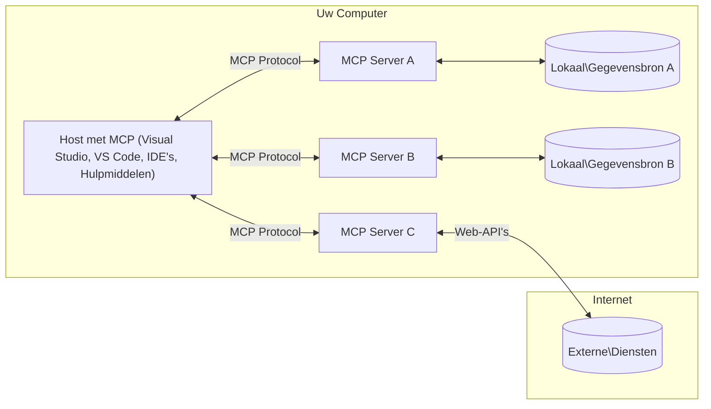

# MCP Kernconcepten: Beheersing van het Model Context Protocol voor AI-integratie

[](https://youtu.be/earDzWGtE84)

_(Klik op de afbeelding hierboven om de video van deze les te bekijken)_

Het [Model Context Protocol (MCP)](https://github.com/modelcontextprotocol) is een krachtig, gestandaardiseerd kader dat de communicatie tussen Large Language Models (LLM's) en externe tools, applicaties en databronnen optimaliseert.  
Deze gids leidt je door de kernconcepten van MCP. Je leert over de client-serverarchitectuur, essentiële componenten, communicatiemechanismen en implementatiebest practices.

- **Expliciete Gebruikersgoedkeuring**: Alle data-toegang en operaties vereisen expliciete goedkeuring van de gebruiker vóór uitvoering. Gebruikers moeten duidelijk begrijpen welke data wordt geraadpleegd en welke acties worden uitgevoerd, met gedetailleerde controle over permissies en autorisaties.

- **Bescherming van Gegevensprivacy**: Gebruikersdata wordt alleen blootgesteld met expliciete toestemming en moet worden beschermd door robuuste toegangscontroles gedurende de gehele interactielifecycle. Implementaties moeten ongeautoriseerde datatransmissie voorkomen en strikte privacygrenzen handhaven.

- **Veiligheid bij Tooluitvoering**: Elke toolaanroep vereist expliciete gebruikersgoedkeuring met duidelijk begrip van de functionaliteit, parameters en mogelijke impact van de tool. Robuuste beveiligingsgrenzen moeten onbedoelde, onveilige of kwaadaardige tooluitvoering voorkomen.

- **Transportlaagbeveiliging**: Alle communicatiekanalen moeten geschikte encryptie- en authenticatiemechanismen gebruiken. Externe verbindingen moeten veilige transportprotocollen en correcte credentialbeheer implementeren.

#### Implementatierichtlijnen:

- **Beheer van Permissies**: Implementeer fijnmazige permissiesystemen waarmee gebruikers kunnen bepalen welke servers, tools en bronnen toegankelijk zijn  
- **Authenticatie & Autorisatie**: Gebruik veilige authenticatiemethoden (OAuth, API-sleutels) met correct tokenbeheer en verval  
- **Inputvalidatie**: Valideer alle parameters en data-invoer volgens gedefinieerde schema's om injectieaanvallen te voorkomen  
- **Auditlogging**: Houd uitgebreide logs bij van alle operaties voor beveiligingsmonitoring en compliance  

## Overzicht

Deze les verkent de fundamentele architectuur en componenten die het Model Context Protocol (MCP) ecosysteem vormen. Je leert over de client-serverarchitectuur, kerncomponenten en communicatiemechanismen die MCP-interacties aandrijven.

## Belangrijkste Leerdoelen

Aan het einde van deze les zul je:

- De MCP client-serverarchitectuur begrijpen.  
- Rollen en verantwoordelijkheden van Hosts, Clients en Servers identificeren.  
- De kernfuncties analyseren die MCP een flexibele integratielaag maken.  
- Leren hoe informatie binnen het MCP-ecosysteem stroomt.  
- Praktische inzichten opdoen via codevoorbeelden in .NET, Java, Python en JavaScript.

## MCP Architectuur: Een Diepere Kijk

Het MCP-ecosysteem is gebouwd op een client-servermodel. Deze modulaire structuur stelt AI-applicaties in staat efficiënt te communiceren met tools, databases, API's en contextuele bronnen. Laten we deze architectuur opdelen in de kerncomponenten.

In de kern volgt MCP een client-serverarchitectuur waarbij een hostapplicatie verbinding kan maken met meerdere servers:


- **MCP Hosts**: Programma's zoals VSCode, Claude Desktop, IDE's of AI-tools die data via MCP willen benaderen  
- **MCP Clients**: Protocolclients die 1:1-verbindingen met servers onderhouden  
- **MCP Servers**: Lichtgewicht programma's die elk specifieke mogelijkheden blootstellen via het gestandaardiseerde Model Context Protocol  
- **Lokale Databronnen**: Bestanden, databases en services op je computer die MCP-servers veilig kunnen benaderen  
- **Externe Services**: Externe systemen beschikbaar via internet waarmee MCP-servers kunnen verbinden via API's.

Het MCP-protocol is een evoluerende standaard met datumgebaseerde versiebeheer (formaat JJJJ-MM-DD). De huidige protocolversie is **2025-11-25**. Je kunt de laatste updates zien in de [protocolspecificatie](https://modelcontextprotocol.io/specification/2025-11-25/)

### 1. Hosts

In het Model Context Protocol (MCP) zijn **Hosts** AI-applicaties die fungeren als de primaire interface waarmee gebruikers met het protocol interageren. Hosts coördineren en beheren verbindingen met meerdere MCP-servers door voor elke serververbinding een dedicated MCP-client te creëren. Voorbeelden van Hosts zijn:

- **AI-applicaties**: Claude Desktop, Visual Studio Code, Claude Code  
- **Ontwikkelomgevingen**: IDE's en code-editors met MCP-integratie  
- **Aangepaste applicaties**: Speciaal gebouwde AI-agenten en tools

**Hosts** zijn applicaties die AI-modelinteracties coördineren. Ze:

- **Orkestreren AI-modellen**: Voeren LLM's uit of interageren ermee om antwoorden te genereren en AI-workflows te coördineren  
- **Beheren Clientverbindingen**: Creëren en onderhouden één MCP-client per MCP-serververbinding  
- **Beheersen Gebruikersinterface**: Handelen conversatiestromen, gebruikersinteracties en presentatie van antwoorden af  
- **Handhaven Beveiliging**: Controleren permissies, beveiligingsbeperkingen en authenticatie  
- **Beheren Gebruikersgoedkeuring**: Regelen gebruikersgoedkeuring voor datadeling en tooluitvoering  

### 2. Clients

**Clients** zijn essentiële componenten die dedicated één-op-één verbindingen onderhouden tussen Hosts en MCP-servers. Elke MCP-client wordt door de Host geïnstalleerd om verbinding te maken met een specifieke MCP-server, wat georganiseerde en veilige communicatiekanalen garandeert. Meerdere clients stellen Hosts in staat om gelijktijdig met meerdere servers te verbinden.

**Clients** zijn connectorcomponenten binnen de hostapplicatie. Ze:

- **Protocolcommunicatie**: Verzenden JSON-RPC 2.0-verzoeken naar servers met prompts en instructies  
- **Capabiliteitsonderhandeling**: Onderhandelen over ondersteunde functies en protocolversies met servers tijdens initialisatie  
- **Tooluitvoering**: Beheren tooluitvoeringsverzoeken van modellen en verwerken antwoorden  
- **Realtime Updates**: Handelen notificaties en realtime updates van servers af  
- **Antwoordverwerking**: Verwerken en formatteren serverantwoorden voor weergave aan gebruikers  

### 3. Servers

**Servers** zijn programma's die context, tools en mogelijkheden aan MCP-clients bieden. Ze kunnen lokaal draaien (op dezelfde machine als de Host) of extern (op externe platforms) en zijn verantwoordelijk voor het afhandelen van clientverzoeken en het leveren van gestructureerde antwoorden. Servers stellen specifieke functionaliteit beschikbaar via het gestandaardiseerde Model Context Protocol.

**Servers** zijn services die context en mogelijkheden bieden. Ze:

- **Functieregistratie**: Registreren en stellen beschikbare primitieve elementen (bronnen, prompts, tools) bloot aan clients  
- **Verzoekverwerking**: Ontvangen en voeren toolaanroepen, bronverzoeken en promptverzoeken van clients uit  
- **Contextvoorziening**: Bieden contextuele informatie en data om modelantwoorden te verbeteren  
- **Statusbeheer**: Beheren sessiestatus en behandelen stateful interacties indien nodig  
- **Realtime Notificaties**: Verzenden notificaties over capaciteitswijzigingen en updates aan verbonden clients  

Servers kunnen door iedereen worden ontwikkeld om modelmogelijkheden uit te breiden met gespecialiseerde functionaliteit, en ondersteunen zowel lokale als externe implementatiescenario's.

### 4. Serverprimitieven

Servers in het Model Context Protocol (MCP) bieden drie kern-**primitieven** die de fundamentele bouwstenen definiëren voor rijke interacties tussen clients, hosts en taalmodellen. Deze primitieven specificeren de typen contextuele informatie en acties die via het protocol beschikbaar zijn.

MCP-servers kunnen elke combinatie van de volgende drie kernprimitieven blootstellen:

#### Bronnen

**Bronnen** zijn databronnen die contextuele informatie aan AI-applicaties leveren. Ze vertegenwoordigen statische of dynamische inhoud die het begrip en de besluitvorming van modellen kan verbeteren:

- **Contextuele Data**: Gestructureerde informatie en context voor consumptie door AI-modellen  
- **Kennisbanken**: Documentrepositories, artikelen, handleidingen en onderzoeksartikelen  
- **Lokale Databronnen**: Bestanden, databases en lokale systeeminformatie  
- **Externe Data**: API-responses, webservices en externe systeemdata  
- **Dynamische Inhoud**: Realtime data die wordt bijgewerkt op basis van externe omstandigheden

Bronnen worden geïdentificeerd door URI's en ondersteunen ontdekking via `resources/list` en ophalen via `resources/read` methoden:

```text
file://documents/project-spec.md
database://production/users/schema
api://weather/current
```

#### Prompts

**Prompts** zijn herbruikbare sjablonen die helpen interacties met taalmodellen te structureren. Ze bieden gestandaardiseerde interactiepatronen en sjabloonworkflows:

- **Sjabloon-gebaseerde Interacties**: Vooraf gestructureerde berichten en gespreksstarters  
- **Workflow-sjablonen**: Gestandaardiseerde reeksen voor veelvoorkomende taken en interacties  
- **Few-shot Voorbeelden**: Voorbeeldgebaseerde sjablonen voor modelinstructies  
- **Systeem Prompts**: Fundamentele prompts die modelgedrag en context definiëren  
- **Dynamische Sjablonen**: Geparametriseerde prompts die zich aanpassen aan specifieke contexten

Prompts ondersteunen variabele substitutie en kunnen worden ontdekt via `prompts/list` en opgehaald met `prompts/get`:

```markdown
Generate a {{task_type}} for {{product}} targeting {{audience}} with the following requirements: {{requirements}}
```

#### Tools

**Tools** zijn uitvoerbare functies die AI-modellen kunnen aanroepen om specifieke acties uit te voeren. Ze vertegenwoordigen de "werkwoorden" van het MCP-ecosysteem, waarmee modellen met externe systemen kunnen interageren:

- **Uitvoerbare Functies**: Discrete operaties die modellen kunnen aanroepen met specifieke parameters  
- **Integratie met Externe Systemen**: API-aanroepen, databasequery's, bestandsbewerkingen, berekeningen  
- **Unieke Identiteit**: Elke tool heeft een unieke naam, beschrijving en parameterschema  
- **Gestructureerde I/O**: Tools accepteren gevalideerde parameters en retourneren gestructureerde, getypeerde antwoorden  
- **Actiemogelijkheden**: Stellen modellen in staat om echte acties uit te voeren en live data op te halen

Tools worden gedefinieerd met JSON Schema voor parametervalidatie en ontdekt via `tools/list` en uitgevoerd via `tools/call`:

```typescript
server.tool(
  "search_products", 
  {
    query: z.string().describe("Search query for products"),
    category: z.string().optional().describe("Product category filter"),
    max_results: z.number().default(10).describe("Maximum results to return")
  }, 
  async (params) => {
    // Voer zoekopdracht uit en retourneer gestructureerde resultaten
    return await productService.search(params);
  }
);
```

## Clientprimitieven

In het Model Context Protocol (MCP) kunnen **clients** primitieve functies blootstellen waarmee servers aanvullende mogelijkheden van de hostapplicatie kunnen opvragen. Deze client-side primitieven maken rijkere, interactievere serverimplementaties mogelijk die toegang hebben tot AI-modelmogelijkheden en gebruikersinteracties.

### Sampling

**Sampling** stelt servers in staat om taalmodelcompleties op te vragen bij de AI-applicatie van de client. Deze primitief maakt het servers mogelijk om LLM-mogelijkheden te gebruiken zonder eigen modelafhankelijkheden in te bouwen:

- **Modelonafhankelijke Toegang**: Servers kunnen completies opvragen zonder LLM-SDK's te includeren of modeltoegang te beheren  
- **Server-geïnitieerde AI**: Maakt het servers mogelijk autonoom content te genereren met het AI-model van de client  
- **Recursieve LLM-interacties**: Ondersteunt complexe scenario's waarin servers AI-hulp nodig hebben voor verwerking  
- **Dynamische Contentgeneratie**: Laat servers contextuele antwoorden creëren met het model van de host

Sampling wordt gestart via de `sampling/complete` methode, waarbij servers completieverzoeken naar clients sturen.

### Elicitation

**Elicitation** stelt servers in staat om aanvullende informatie of bevestiging van gebruikers te vragen via de clientinterface:

- **Gebruikersinvoer Verzoeken**: Servers kunnen om extra informatie vragen wanneer dat nodig is voor tooluitvoering  
- **Bevestigingsdialogen**: Vragen om gebruikersgoedkeuring voor gevoelige of impactvolle operaties  
- **Interactieve Workflows**: Stellen servers in staat stapsgewijze gebruikersinteracties te creëren  
- **Dynamische Parameterverzameling**: Verzamelen ontbrekende of optionele parameters tijdens tooluitvoering

Elicitation-verzoeken worden gedaan via de `elicitation/request` methode om gebruikersinvoer via de clientinterface te verzamelen.

### Logging

**Logging** stelt servers in staat gestructureerde logberichten naar clients te sturen voor debugging, monitoring en operationele zichtbaarheid:

- **Debugondersteuning**: Laat servers gedetailleerde uitvoeringslogs leveren voor probleemoplossing  
- **Operationele Monitoring**: Verzenden statusupdates en prestatiestatistieken naar clients  
- **Foutmelding**: Bieden gedetailleerde foutcontext en diagnostische informatie  
- **Audit Trails**: Creëren uitgebreide logs van serveroperaties en beslissingen

Loggingberichten worden naar clients gestuurd om transparantie in serveroperaties te bieden en debugging te vergemakkelijken.

## Informatiestroom in MCP

Het Model Context Protocol (MCP) definieert een gestructureerde informatiestroom tussen hosts, clients, servers en modellen. Het begrijpen van deze stroom helpt verduidelijken hoe gebruikersverzoeken worden verwerkt en hoe externe tools en data worden geïntegreerd in modelantwoorden.

- **Host Initieert Verbinding**  
  De hostapplicatie (zoals een IDE of chatinterface) maakt een verbinding met een MCP-server, meestal via STDIO, WebSocket of een ander ondersteund transport.

- **Capabiliteitsonderhandeling**  
  De client (ingebed in de host) en de server wisselen informatie uit over hun ondersteunde functies, tools, bronnen en protocolversies. Dit zorgt ervoor dat beide zijden begrijpen welke mogelijkheden beschikbaar zijn voor de sessie.

- **Gebruikersverzoek**  
  De gebruiker interageert met de host (bijv. voert een prompt of commando in). De host verzamelt deze invoer en geeft deze door aan de client voor verwerking.

- **Gebruik van Bron of Tool**  
  - De client kan aanvullende context of bronnen opvragen bij de server (zoals bestanden, database-items of kennisbankartikelen) om het begrip van het model te verrijken.  
  - Als het model bepaalt dat een tool nodig is (bijv. om data op te halen, een berekening uit te voeren of een API aan te roepen), stuurt de client een toolaanroepverzoek naar de server, met specificatie van de toolnaam en parameters.

- **Serveruitvoering**  
  De server ontvangt het bron- of toolverzoek, voert de benodigde operaties uit (zoals het uitvoeren van een functie, queryen van een database of ophalen van een bestand) en retourneert de resultaten aan de client in een gestructureerd formaat.

- **Antwoordgeneratie**  
  De client integreert de antwoorden van de server (brondata, tooluitvoer, enz.) in de lopende modelinteractie. Het model gebruikt deze informatie om een uitgebreid en contextueel relevant antwoord te genereren.

- **Resultaatpresentatie**  
  De host ontvangt de uiteindelijke output van de client en presenteert deze aan de gebruiker, vaak inclusief zowel de door het model gegenereerde tekst als eventuele resultaten van tooluitvoeringen of bronopvragingen.

Deze stroom maakt het MCP mogelijk geavanceerde, interactieve en contextbewuste AI-applicaties te ondersteunen door modellen naadloos te verbinden met externe tools en databronnen.

## Protocolarchitectuur & Lagen

MCP bestaat uit twee verschillende architectuurlagen die samenwerken om een compleet communicatiekader te bieden:

### Datalayer

De **Datalayer** implementeert het kern-MCP-protocol met **JSON-RPC 2.0** als basis. Deze laag definieert de berichtstructuur, semantiek en interactiepatronen:

#### Kerncomponenten:

- **JSON-RPC 2.0 Protocol**: Alle communicatie gebruikt het gestandaardiseerde JSON-RPC 2.0-berichtformaat voor methodeaanroepen, antwoorden en notificaties
- **Levenscyclusbeheer**: Behandelt het initialiseren van verbindingen, het onderhandelen over mogelijkheden en het beëindigen van sessies tussen clients en servers
- **Serverprimitieven**: Stelt servers in staat kernfunctionaliteit te bieden via tools, bronnen en prompts
- **Clientprimitieven**: Stelt servers in staat om sampling van LLM's aan te vragen, gebruikersinvoer op te roepen en logberichten te verzenden
- **Realtime meldingen**: Ondersteunt asynchrone meldingen voor dynamische updates zonder polling

#### Belangrijkste kenmerken:

- **Protocolversieonderhandeling**: Gebruikt datumgebaseerde versiebeheer (JJJJ-MM-DD) om compatibiliteit te waarborgen
- **Mogelijkhedenontdekking**: Clients en servers wisselen tijdens initialisatie informatie uit over ondersteunde functies
- **Stateful sessies**: Behoudt verbindingsstatus over meerdere interacties voor contextcontinuïteit

### Transportlaag

De **Transportlaag** beheert communicatiekanalen, berichtafbakening en authenticatie tussen MCP-deelnemers:

#### Ondersteunde transportmechanismen:

1. **STDIO Transport**:
   - Gebruikt standaard in-/uitvoerstromen voor directe procescommunicatie
   - Optimaal voor lokale processen op dezelfde machine zonder netwerkoverhead
   - Veelgebruikt voor lokale MCP-serverimplementaties

2. **Streamable HTTP Transport**:
   - Gebruikt HTTP POST voor client-naar-server berichten  
   - Optionele Server-Sent Events (SSE) voor server-naar-client streaming
   - Maakt communicatie met externe servers over netwerken mogelijk
   - Ondersteunt standaard HTTP-authenticatie (bearer tokens, API-sleutels, aangepaste headers)
   - MCP beveelt OAuth aan voor veilige token-gebaseerde authenticatie

#### Transportabstractie:

De transportlaag abstraheert communicatiedetails van de datalaag, waardoor hetzelfde JSON-RPC 2.0-berichtformaat over alle transportmechanismen wordt gebruikt. Deze abstractie maakt het mogelijk om naadloos te schakelen tussen lokale en externe servers.

### Beveiligingsoverwegingen

MCP-implementaties moeten zich houden aan verschillende kritieke beveiligingsprincipes om veilige, betrouwbare en beveiligde interacties over alle protocoloperaties te waarborgen:

- **Gebruikersconsent en controle**: Gebruikers moeten expliciete toestemming geven voordat gegevens worden geraadpleegd of bewerkingen worden uitgevoerd. Ze moeten duidelijke controle hebben over welke gegevens worden gedeeld en welke acties zijn geautoriseerd, ondersteund door intuïtieve gebruikersinterfaces voor het beoordelen en goedkeuren van activiteiten.

- **Gegevensprivacy**: Gebruikersgegevens mogen alleen met expliciete toestemming worden blootgesteld en moeten worden beschermd door passende toegangscontroles. MCP-implementaties moeten ongeautoriseerde gegevensoverdracht voorkomen en ervoor zorgen dat privacy tijdens alle interacties wordt gehandhaafd.

- **Toolveiligheid**: Voor het aanroepen van een tool is expliciete gebruikersconsent vereist. Gebruikers moeten een duidelijk begrip hebben van de functionaliteit van elke tool, en robuuste beveiligingsgrenzen moeten worden gehandhaafd om onbedoelde of onveilige uitvoering van tools te voorkomen.

Door deze beveiligingsprincipes te volgen, zorgt MCP ervoor dat gebruikersvertrouwen, privacy en veiligheid worden gehandhaafd over alle protocolinteracties, terwijl krachtige AI-integraties mogelijk worden gemaakt.

## Codevoorbeelden: Belangrijke componenten

Hieronder staan codevoorbeelden in verschillende populaire programmeertalen die illustreren hoe belangrijke MCP-servercomponenten en tools kunnen worden geïmplementeerd.

### .NET Voorbeeld: Een eenvoudige MCP-server maken met tools

Hier is een praktisch .NET-codevoorbeeld dat laat zien hoe je een eenvoudige MCP-server met aangepaste tools implementeert. Dit voorbeeld toont hoe je tools definieert en registreert, verzoeken afhandelt en de server verbindt met het Model Context Protocol.

```csharp
using System;
using System.Threading.Tasks;
using ModelContextProtocol.Server;
using ModelContextProtocol.Server.Transport;
using ModelContextProtocol.Server.Tools;

public class WeatherServer
{
    public static async Task Main(string[] args)
    {
        // Create an MCP server
        var server = new McpServer(
            name: "Weather MCP Server",
            version: "1.0.0"
        );
        
        // Register our custom weather tool
        server.AddTool<string, WeatherData>("weatherTool", 
            description: "Gets current weather for a location",
            execute: async (location) => {
                // Call weather API (simplified)
                var weatherData = await GetWeatherDataAsync(location);
                return weatherData;
            });
        
        // Connect the server using stdio transport
        var transport = new StdioServerTransport();
        await server.ConnectAsync(transport);
        
        Console.WriteLine("Weather MCP Server started");
        
        // Keep the server running until process is terminated
        await Task.Delay(-1);
    }
    
    private static async Task<WeatherData> GetWeatherDataAsync(string location)
    {
        // This would normally call a weather API
        // Simplified for demonstration
        await Task.Delay(100); // Simulate API call
        return new WeatherData { 
            Temperature = 72.5,
            Conditions = "Sunny",
            Location = location
        };
    }
}

public class WeatherData
{
    public double Temperature { get; set; }
    public string Conditions { get; set; }
    public string Location { get; set; }
}
```

### Java Voorbeeld: MCP-servercomponenten

Dit voorbeeld toont dezelfde MCP-server en toolregistratie als het .NET-voorbeeld hierboven, maar geïmplementeerd in Java.

```java
import io.modelcontextprotocol.server.McpServer;
import io.modelcontextprotocol.server.McpToolDefinition;
import io.modelcontextprotocol.server.transport.StdioServerTransport;
import io.modelcontextprotocol.server.tool.ToolExecutionContext;
import io.modelcontextprotocol.server.tool.ToolResponse;

public class WeatherMcpServer {
    public static void main(String[] args) throws Exception {
        // Maak een MCP-server aan
        McpServer server = McpServer.builder()
            .name("Weather MCP Server")
            .version("1.0.0")
            .build();
            
        // Registreer een weerhulpmiddel
        server.registerTool(McpToolDefinition.builder("weatherTool")
            .description("Gets current weather for a location")
            .parameter("location", String.class)
            .execute((ToolExecutionContext ctx) -> {
                String location = ctx.getParameter("location", String.class);
                
                // Verkrijg weergegevens (vereenvoudigd)
                WeatherData data = getWeatherData(location);
                
                // Geef geformatteerde reactie terug
                return ToolResponse.content(
                    String.format("Temperature: %.1f°F, Conditions: %s, Location: %s", 
                    data.getTemperature(), 
                    data.getConditions(), 
                    data.getLocation())
                );
            })
            .build());
        
        // Verbind de server met stdio-transport
        try (StdioServerTransport transport = new StdioServerTransport()) {
            server.connect(transport);
            System.out.println("Weather MCP Server started");
            // Houd de server draaiende totdat het proces wordt beëindigd
            Thread.currentThread().join();
        }
    }
    
    private static WeatherData getWeatherData(String location) {
        // Implementatie zou een weer-API aanroepen
        // Vereenvoudigd voor voorbeelddoeleinden
        return new WeatherData(72.5, "Sunny", location);
    }
}

class WeatherData {
    private double temperature;
    private String conditions;
    private String location;
    
    public WeatherData(double temperature, String conditions, String location) {
        this.temperature = temperature;
        this.conditions = conditions;
        this.location = location;
    }
    
    public double getTemperature() {
        return temperature;
    }
    
    public String getConditions() {
        return conditions;
    }
    
    public String getLocation() {
        return location;
    }
}
```

### Python Voorbeeld: Een MCP-server bouwen

Dit voorbeeld gebruikt fastmcp, zorg er dus voor dat je het eerst installeert:

```python
pip install fastmcp
```
Codevoorbeeld:

```python
#!/usr/bin/env python3
import asyncio
from fastmcp import FastMCP
from fastmcp.transports.stdio import serve_stdio

# Maak een FastMCP-server
mcp = FastMCP(
    name="Weather MCP Server",
    version="1.0.0"
)

@mcp.tool()
def get_weather(location: str) -> dict:
    """Gets current weather for a location."""
    return {
        "temperature": 72.5,
        "conditions": "Sunny",
        "location": location
    }

# Alternatieve benadering met een klasse
class WeatherTools:
    @mcp.tool()
    def forecast(self, location: str, days: int = 1) -> dict:
        """Gets weather forecast for a location for the specified number of days."""
        return {
            "location": location,
            "forecast": [
                {"day": i+1, "temperature": 70 + i, "conditions": "Partly Cloudy"}
                for i in range(days)
            ]
        }

# Registreer klassehulpmiddelen
weather_tools = WeatherTools()

# Start de server
if __name__ == "__main__":
    asyncio.run(serve_stdio(mcp))
```

### JavaScript Voorbeeld: Een MCP-server maken

Dit voorbeeld laat zien hoe je een MCP-server maakt in JavaScript en hoe je twee weergerelateerde tools registreert.

```javascript
// Gebruik van de officiële Model Context Protocol SDK
import { McpServer } from "@modelcontextprotocol/sdk/server/mcp.js";
import { StdioServerTransport } from "@modelcontextprotocol/sdk/server/stdio.js";
import { z } from "zod"; // Voor parametervalidatie

// Maak een MCP-server aan
const server = new McpServer({
  name: "Weather MCP Server",
  version: "1.0.0"
});

// Definieer een weerhulpmiddel
server.tool(
  "weatherTool",
  {
    location: z.string().describe("The location to get weather for")
  },
  async ({ location }) => {
    // Dit zou normaal gesproken een weer-API aanroepen
    // Vereenvoudigd voor demonstratie
    const weatherData = await getWeatherData(location);
    
    return {
      content: [
        { 
          type: "text", 
          text: `Temperature: ${weatherData.temperature}°F, Conditions: ${weatherData.conditions}, Location: ${weatherData.location}` 
        }
      ]
    };
  }
);

// Definieer een voorspellingshulpmiddel
server.tool(
  "forecastTool",
  {
    location: z.string(),
    days: z.number().default(3).describe("Number of days for forecast")
  },
  async ({ location, days }) => {
    // Dit zou normaal gesproken een weer-API aanroepen
    // Vereenvoudigd voor demonstratie
    const forecast = await getForecastData(location, days);
    
    return {
      content: [
        { 
          type: "text", 
          text: `${days}-day forecast for ${location}: ${JSON.stringify(forecast)}` 
        }
      ]
    };
  }
);

// Hulpfuncties
async function getWeatherData(location) {
  // Simuleer API-aanroep
  return {
    temperature: 72.5,
    conditions: "Sunny",
    location: location
  };
}

async function getForecastData(location, days) {
  // Simuleer API-aanroep
  return Array.from({ length: days }, (_, i) => ({
    day: i + 1,
    temperature: 70 + Math.floor(Math.random() * 10),
    conditions: i % 2 === 0 ? "Sunny" : "Partly Cloudy"
  }));
}

// Verbind de server met behulp van stdio-transport
const transport = new StdioServerTransport();
server.connect(transport).catch(console.error);

console.log("Weather MCP Server started");
```

Dit JavaScript-voorbeeld demonstreert hoe je een MCP-client maakt die verbinding maakt met een server, een prompt verzendt en de respons verwerkt inclusief eventuele gemaakte toolaanroepen.

## Beveiliging en autorisatie

MCP bevat verschillende ingebouwde concepten en mechanismen voor het beheren van beveiliging en autorisatie gedurende het hele protocol:

1. **Tooltoestemmingscontrole**:  
  Clients kunnen specificeren welke tools een model mag gebruiken tijdens een sessie. Dit zorgt ervoor dat alleen expliciet geautoriseerde tools toegankelijk zijn, wat het risico op onbedoelde of onveilige bewerkingen vermindert. Toestemmingen kunnen dynamisch worden geconfigureerd op basis van gebruikersvoorkeuren, organisatiebeleid of de context van de interactie.

2. **Authenticatie**:  
  Servers kunnen authenticatie vereisen voordat toegang wordt verleend tot tools, bronnen of gevoelige bewerkingen. Dit kan API-sleutels, OAuth-tokens of andere authenticatieschema's omvatten. Juiste authenticatie zorgt ervoor dat alleen vertrouwde clients en gebruikers server-side mogelijkheden kunnen aanroepen.

3. **Validatie**:  
  Parametervalidatie wordt afgedwongen voor alle toolaanroepen. Elke tool definieert de verwachte types, formaten en beperkingen voor zijn parameters, en de server valideert binnenkomende verzoeken dienovereenkomstig. Dit voorkomt dat verkeerd gevormde of kwaadaardige invoer toolimplementaties bereikt en helpt de integriteit van bewerkingen te behouden.

4. **Rate Limiting**:  
  Om misbruik te voorkomen en eerlijk gebruik van serverbronnen te waarborgen, kunnen MCP-servers rate limiting implementeren voor toolaanroepen en toegang tot bronnen. Rate limits kunnen per gebruiker, per sessie of globaal worden toegepast en helpen beschermen tegen denial-of-service-aanvallen of overmatig gebruik van bronnen.

Door deze mechanismen te combineren, biedt MCP een veilige basis voor het integreren van taalmodellen met externe tools en databronnen, terwijl gebruikers en ontwikkelaars fijne controle krijgen over toegang en gebruik.

## Protocolberichten & Communicatiestroom

MCP-communicatie gebruikt gestructureerde **JSON-RPC 2.0**-berichten om duidelijke en betrouwbare interacties tussen hosts, clients en servers te faciliteren. Het protocol definieert specifieke berichtpatronen voor verschillende soorten bewerkingen:

### Kernberichttypen:

#### **Initialisatieberichten**
- **`initialize` Verzoek**: Legt verbinding vast en onderhandelt over protocolversie en mogelijkheden
- **`initialize` Respons**: Bevestigt ondersteunde functies en serverinformatie  
- **`notifications/initialized`**: Geeft aan dat initialisatie voltooid is en de sessie klaar is

#### **Ontdekkingsberichten**
- **`tools/list` Verzoek**: Ontdekt beschikbare tools van de server
- **`resources/list` Verzoek**: Lijst met beschikbare bronnen (databronnen)
- **`prompts/list` Verzoek**: Haalt beschikbare prompttemplates op

#### **Uitvoeringsberichten**  
- **`tools/call` Verzoek**: Voert een specifieke tool uit met opgegeven parameters
- **`resources/read` Verzoek**: Haalt inhoud op van een specifieke bron
- **`prompts/get` Verzoek**: Haalt een prompttemplate op met optionele parameters

#### **Client-side berichten**
- **`sampling/complete` Verzoek**: Server vraagt LLM-completie aan bij de client
- **`elicitation/request`**: Server vraagt gebruikersinvoer via de clientinterface
- **Loggingberichten**: Server verzendt gestructureerde logberichten naar de client

#### **Meldingsberichten**
- **`notifications/tools/list_changed`**: Server meldt client over wijzigingen in tools
- **`notifications/resources/list_changed`**: Server meldt client over wijzigingen in bronnen  
- **`notifications/prompts/list_changed`**: Server meldt client over wijzigingen in prompts

### Berichtstructuur:

Alle MCP-berichten volgen het JSON-RPC 2.0-formaat met:
- **Verzoekberichten**: Bevatten `id`, `method` en optionele `params`
- **Responsberichten**: Bevatten `id` en ofwel `result` of `error`  
- **Meldingsberichten**: Bevatten `method` en optionele `params` (geen `id` of respons verwacht)

Deze gestructureerde communicatie zorgt voor betrouwbare, traceerbare en uitbreidbare interacties die geavanceerde scenario's ondersteunen zoals realtime updates, tool chaining en robuuste foutafhandeling.

## Belangrijkste punten

- **Architectuur**: MCP gebruikt een client-serverarchitectuur waarbij hosts meerdere clientverbindingen met servers beheren
- **Deelnemers**: Het ecosysteem omvat hosts (AI-toepassingen), clients (protocolkoppelingen) en servers (mogelijkheidverleners)
- **Transportmechanismen**: Communicatie ondersteunt STDIO (lokaal) en Streamable HTTP met optionele SSE (extern)
- **Kernprimitieven**: Servers bieden tools (uitvoerbare functies), bronnen (databronnen) en prompts (templates)
- **Clientprimitieven**: Servers kunnen sampling (LLM-completies), elicitation (gebruikersinvoer) en logging van clients aanvragen
- **Protocolbasis**: Gebouwd op JSON-RPC 2.0 met datumgebaseerde versie (huidig: 2025-11-25)
- **Realtime mogelijkheden**: Ondersteunt meldingen voor dynamische updates en realtime synchronisatie
- **Beveiliging eerst**: Expliciete gebruikersconsent, bescherming van gegevensprivacy en veilige transport zijn kernvereisten

## Oefening

Ontwerp een eenvoudige MCP-tool die nuttig zou zijn in jouw domein. Definieer:
1. Hoe de tool zou heten
2. Welke parameters het zou accepteren
3. Welke output het zou teruggeven
4. Hoe een model deze tool zou kunnen gebruiken om gebruikersproblemen op te lossen


---

## Wat nu

Volgende: [Hoofdstuk 2: Beveiliging](../02-Security/README.md)

---

<!-- CO-OP TRANSLATOR DISCLAIMER START -->
**Disclaimer**:  
Dit document is vertaald met behulp van de AI-vertalingsdienst [Co-op Translator](https://github.com/Azure/co-op-translator). Hoewel we streven naar nauwkeurigheid, dient u er rekening mee te houden dat geautomatiseerde vertalingen fouten of onnauwkeurigheden kunnen bevatten. Het originele document in de oorspronkelijke taal moet als de gezaghebbende bron worden beschouwd. Voor cruciale informatie wordt professionele menselijke vertaling aanbevolen. Wij zijn niet aansprakelijk voor eventuele misverstanden of verkeerde interpretaties die voortvloeien uit het gebruik van deze vertaling.
<!-- CO-OP TRANSLATOR DISCLAIMER END -->