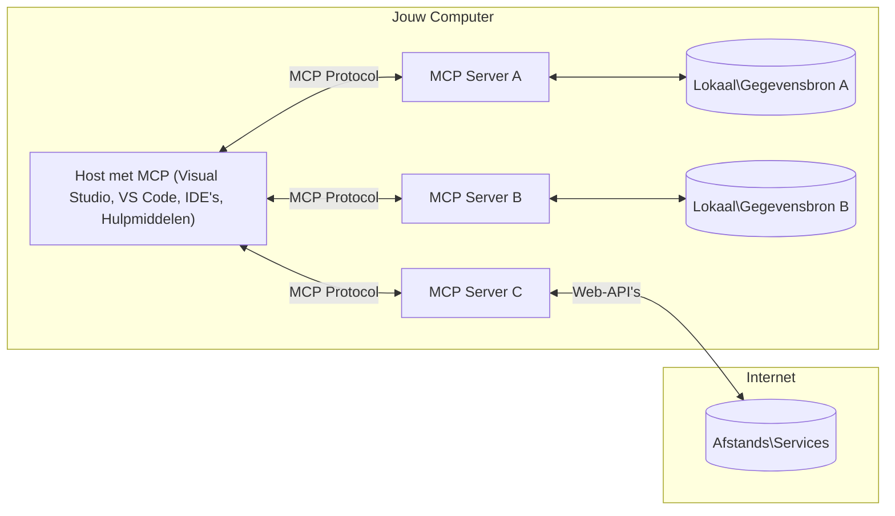

# MCP Kernconcepten: Het Model Context Protocol beheersen voor AI-integratie

[](https://youtu.be/earDzWGtE84)

_(Klik op de afbeelding hierboven om de video van deze les te bekijken)_

Het [Model Context Protocol (MCP)](https://github.com/modelcontextprotocol) is een krachtig, gestandaardiseerd raamwerk dat de communicatie tussen Grote Taalmodellen (LLM's) en externe tools, applicaties en databronnen optimaliseert. 
Deze gids leidt je door de kernconcepten van MCP. Je leert over de client-serverarchitectuur, essentiële componenten, communicatiemechanica en beste implementatiepraktijken.

- **Gebruikerscontrole en Toestemming**: Hosts moeten duidelijk laten zien welke data en tools een
  server blootstelt, gebruikers toestaan om operaties te weigeren en expliciete bevestiging vragen
  voor gevoelige of belangrijke acties. MCP vereist geen bevestigingsdialoog
  voor elke tool-aanroep.

- **Bescherming van Gegevensprivacy**: Gebruikersdata wordt alleen blootgesteld met expliciete toestemming en moet gedurende de gehele interactielifecycle beschermd worden met robuuste toegangscontroles. Implementaties moeten ongeautoriseerde datatransmissie voorkomen en strikte privacygrenzen handhaven.

- **Veiligheid bij Tooluitvoering**: Hosts moeten tool-aanroepen zichtbaar maken en
  een mens in staat stellen deze te weigeren. Gevoelige operaties moeten de tool-inputs
  en impact tonen vóór uitvoering, met beveiligingsgrenzen die onbedoelde
  of kwaadaardige acties voorkomen.

- **Transportsbeveiliging**: Externe verbindingen moeten HTTPS en het MCP
  autorisatiemodel gebruiken. Lokale stdio-servers vertrouwen op procesisolatie, vertrouwde
  configuratie en veilige afhandeling van geërfde credentials.

#### Implementatierichtlijnen:

- **Beheer van Machtigingen**: Implementeer fijnmazige machtigingssysteem dat gebruikers toestaat te bepalen welke servers, tools en bronnen toegankelijk zijn
- **Authenticatie & Autorisatie**: Gebruik veilige authenticatiemethoden (OAuth, API-sleutels) met correct tokenbeheer en verlopen  
- **Invoervalidatie**: Valideer alle parameters en data-inputs volgens gedefinieerde schema's om injectieaanvallen te voorkomen
- **Auditlogging**: Houd uitgebreide logs bij van alle operaties voor beveiligingsmonitoring en naleving

## Overzicht

Deze les onderzoekt de fundamentele architectuur en componenten die het Model Context Protocol (MCP) ecosysteem vormen. Je leert over de client-serverarchitectuur, belangrijke componenten en communicatie-mechanismen die MCP-interacties aansturen.

## Belangrijkste Leerdoelen

Aan het einde van deze les zul je:

- De MCP client-serverarchitectuur begrijpen.
- Rollen en verantwoordelijkheden van Hosts, Clients en Servers identificeren.
- De kernkenmerken analyseren die MCP een flexibele integratielaag maken.
- Leren hoe informatie binnen het MCP-ecosysteem stroomt.
- Praktische inzichten verkrijgen via codevoorbeelden in .NET, Java, Python en JavaScript.

## MCP Architectuur: Een Diepere Blik

Het MCP-ecosysteem is gebouwd op een client-server model. Deze modulaire structuur maakt het mogelijk dat AI-toepassingen efficiënt met tools, databases, API's en contextuele bronnen communiceren. Laten we deze architectuur opbreken in de kerncomponenten.

MCP volgt in de kern een client-serverarchitectuur waarbij een hostapplicatie verbinding kan maken met meerdere servers:


```mermaid
flowchart LR
    subgraph "Jouw Computer"
        Host["Host met MCP (Visual Studio, VS Code, IDE's, Hulpmiddelen)"]
        S1["MCP Server A"]
        S2["MCP Server B"]
        S3["MCP Server C"]
        Host <-->|"MCP Protocol"| S1
        Host <-->|"MCP Protocol"| S2
        Host <-->|"MCP Protocol"| S3
        S1 <--> D1[("Lokaal\Gegevensbron A")]
        S2 <--> D2[("Lokaal\Gegevensbron B")]
    end
    subgraph "Internet"
        S3 <-->|"Web-API's"| D3[("Afstands\Services")]
    end
```

- **MCP Hosts**: Programma's zoals VSCode, Claude Desktop, IDE's, of AI-tools die data via MCP willen benaderen
- **MCP Clients**: Protocolcomponenten die één logische relatie onderhouden
  met een server; MCP `2026-07-28` verzoeken zijn niet afhankelijk van een persistente
  verbinding of sessie
- **MCP Servers**: Lichtgewicht programma's die elk specifieke mogelijkheden blootstellen via het gestandaardiseerde Model Context Protocol
- **Lokale Databronnen**: De bestanden, databases en services van jouw computer waarop MCP-servers veilig kunnen inloggen
- **Externe Services**: Externe systemen beschikbaar via internet waarmee MCP-servers via API's kunnen verbinden.

Het MCP-protocol is een evoluerende standaard die datumgebaseerde versiebeheer gebruikt
(formaat JJJJ-MM-DD). De huidige protocolversie is **2026-07-28**. Zie de
[2026-07-28 protocol specificatie](https://modelcontextprotocol.io/specification/2026-07-28/).

> **Huidige release:** MCP `2026-07-28` maakt het protocol stateless op het
> transportniveau door de `initialize` handshake en protocolniveau
> sessie-ID's te verwijderen. Het formaliseert ook een uitbreidingsraamwerk en deprecieert
> Roots, Sampling en Logging ten gunste van nieuwere patronen. Zie
> [Wat is veranderd in MCP: De 2026-07-28 Specificatie](./mcp-2026-07-28.md)
> voor een volledige uitleg en migratiegids. Voorbeelden die expliciet `2025-11-25`
> targeten, blijven gehandhaafd als legacy compatibiliteitslessen.

### 1. Hosts

In het Model Context Protocol (MCP) zijn **Hosts** AI-toepassingen die de primaire interface vormen waarmee gebruikers met het protocol interageren. Hosts coördineren en beheren verbindingen met meerdere MCP-servers door voor elke serververbinding een toegewijde MCP-client aan te maken. Voorbeelden van Hosts zijn:

- **AI-toepassingen**: Claude Desktop, Visual Studio Code, Claude Code
- **Ontwikkelomgevingen**: IDE's en code-editors met MCP-integratie  
- **Aangepaste toepassingen**: Speciaal gebouwde AI-agenten en tools

**Hosts** zijn applicaties die AI-modelinteracties coördineren. Ze:

- **Orkestreren AI-modellen**: Voeren LLM's uit of interageren ermee om antwoorden te genereren en AI-workflows te coördineren
- **Beheren klantrelaties**: Creëren en beheren één MCP-client per MCP
  server die de host gebruikt
- **Beheren gebruikersinterface**: Afhandelen van gespreksstromen, gebruikersinteracties en antwoordpresentatie  
- **Handhaven beveiliging**: Controleren van machtigingen, beveiligingsbeperkingen en authenticatie
- **Beheren gebruikersconsent**: Regelen van gebruikersgoedkeuring voor data delen en tooluitvoering


### 2. Clients

**Clients** zijn protocolcomponenten die door een host worden aangemaakt voor specifieke MCP
servers. Dit is een logische één-op-één relatie, geen vereiste voor een
persistente netwerkverbinding. In MCP `2026-07-28` is elk verzoek
op zichzelf staand en kan door elke serverinstantie worden afgehandeld.

**Clients** zijn connectorcomponenten binnen de hostapplicatie. Ze:

- **Protocolcommunicatie**: Verzenden JSON-RPC 2.0-verzoeken naar servers met prompts en instructies
- **Ontdekken van mogelijkheden**: Gebruik `server/discover` om ondersteunde
  protocolversies, capabilities en extensies van een server te leren kennen
- **Tooluitvoering**: Beheren verzoeken tot tooluitvoering van modellen en verwerken van antwoorden
- **Realtime updates**: Afhandelen van notificaties en realtime updates van servers
- **Verwerking van antwoorden**: Verwerken en formatteren van serverantwoorden voor weergave aan gebruikers

### 3. Servers

**Servers** zijn programma's die context, tools en mogelijkheden aan MCP-clients leveren. Ze kunnen lokaal draaien (op dezelfde machine als de Host) of extern (op externe platforms), en zijn verantwoordelijk voor het verwerken van clientverzoeken en het bieden van gestructureerde antwoorden. Servers bieden specifieke functionaliteit via het gestandaardiseerde Model Context Protocol.

**Servers** zijn diensten die context en mogelijkheden bieden. Ze:


- **Functieregistratie**: Registreer en stel beschikbare primitieve elementen (bronnen, prompts, tools) bloot aan cliënten
- **Verzoekverwerking**: Ontvang en voer tool-oproepen, bronverzoeken en promptverzoeken van cliënten uit
- **Contextvoorziening**: Bied contextuele informatie en data om modelantwoorden te verbeteren
- **Statusbeheer**: Onderhoud de applicatiestatus met expliciete verwijzingen die
  indien nodig in verzoeken worden doorgegeven; MCP `2026-07-28` kent geen sessies op protocolniveau
- **Realtime Meldingen**: Verstuur meldingen over capaciteitswijzigingen en updates aan verbonden cliënten

Servers kunnen door iedereen worden ontwikkeld om functionaliteit te specialiseren en modelmogelijkheden uit te breiden, en ondersteunen zowel lokale als externe implementatiescenario’s.

### 4. Serverprimitieven

Servers binnen het Model Context Protocol (MCP) bieden drie kern-**primitieven** die de fundamentele bouwstenen definiëren voor rijke interacties tussen cliënten, hosts en taalmodellen. Deze primitieven specificeren de typen contextuele informatie en acties die via het protocol beschikbaar zijn.

MCP-servers kunnen elke combinatie van de volgende drie kernprimitieven blootstellen:

#### Bronnen

**Bronnen** zijn gegevensbronnen die contextuele informatie aan AI-toepassingen verstrekken. Ze vertegenwoordigen statische of dynamische inhoud die het begrip van het model en de besluitvorming kunnen verbeteren:

- **Contextuele Data**: Gestructureerde informatie en context voor consumptie door AI-modellen
- **Kennisbanken**: Documentrepositories, artikelen, handleidingen en onderzoeksartikelen
- **Lokale Gegevensbronnen**: Bestanden, databases en lokale systeeminformatie  
- **Externe Data**: API-antwoorden, webservices en gegevens van externe systemen
- **Dynamische Inhoud**: Realtime data die geüpdatet wordt op basis van externe omstandigheden

Bronnen worden geïdentificeerd door URI’s en ondersteunen ontdekking via `resources/list` en opvraging via `resources/read` methoden:

```text
file://documents/project-spec.md
database://production/users/schema
api://weather/current
```

#### Prompts

**Prompts** zijn herbruikbare sjablonen die helpen bij het structureren van interacties met taalmodellen. Ze bieden gestandaardiseerde interactiepatronen en sjabloongedreven workflows:

- **Sjabloon-gebaseerde Interacties**: Vooraf gestructureerde berichten en gespreksstarters
- **Workflow-sjablonen**: Gestandaardiseerde reeksen voor veelvoorkomende taken en interacties
- **Few-shot Voorbeelden**: Op voorbeelden gebaseerde sjablonen voor modelinstructies
- **Systeem-prompts**: Fundamentele prompts die modelgedrag en context definiëren
- **Dynamische Sjablonen**: Geparametriseerde prompts die zich aanpassen aan specifieke contexten

Prompts ondersteunen variabele substitutie en kunnen worden ontdekt via `prompts/list` en opgevraagd met `prompts/get`:

```markdown
Generate a {{task_type}} for {{product}} targeting {{audience}} with the following requirements: {{requirements}}
```

#### Tools

**Tools** zijn uitvoerbare functies die AI-modellen kunnen aanroepen om specifieke acties uit te voeren. Ze vormen de "werkwoorden" van het MCP-ecosysteem, waarmee modellen kunnen interacteren met externe systemen:

- **Uitvoerbare Functies**: Afgebakende operaties die modellen kunnen aanroepen met specifieke parameters
- **Integratie Externe Systemen**: API-aanroepen, databasequeries, bestandshandelingen, berekeningen
- **Unieke Identiteit**: Elke tool heeft een unieke naam, beschrijving en parameterschema
- **Gestructureerde I/O**: Tools accepteren gevalideerde parameters en geven gestructureerde, getypeerde antwoorden terug
- **Actiemogelijkheden**: Stellen modellen in staat om handelingen in de echte wereld uit te voeren en live data op te halen

Tools worden gedefinieerd met JSON Schema voor parameter-validatie en ontdekt via `tools/list` en uitgevoerd via `tools/call`. Tools kunnen ook **iconen** bevatten als extra metadata voor een betere UI-presentatie.

**Toolannotaties**: Tools ondersteunen gedragsannotaties (bijv. `readOnlyHint`, `destructiveHint`) die aangeven of een tool alleen-lezen of destructief is, wat cliënten helpt weloverwogen beslissingen te nemen over tooluitvoering.


Voorbeeld gereedschapsdefinitie:

```typescript
server.tool(
  "search_products", 
  {
    query: z.string().describe("Search query for products"),
    category: z.string().optional().describe("Product category filter"),
    max_results: z.number().default(10).describe("Maximum results to return")
  }, 
  async (params) => {
    // Voer een zoekopdracht uit en retourneer gestructureerde resultaten
    return await productService.search(params);
  }
);
```

## Clientprimitieven

In het Model Context Protocol (MCP) kunnen **clients** primitieve functies blootstellen die servers in staat stellen om aanvullende mogelijkheden van de hostapplicatie op te vragen. Deze client-side primitieve functies stellen servers in staat om rijkere, interactievere implementaties te maken die toegang hebben tot AI-modelmogelijkheden en gebruikersinteracties.

### Sampling

> **Verouderd in MCP `2026-07-28`:** Sampling blijft beschikbaar voor
> compatibiliteit, maar nieuwe implementaties dienen direct te integreren met een LLM
> provider-API. Het kan verwijderd worden in de eerste specificatierevisie
> uitgebracht op of na 28 juli 2027. Zie
> [Wat is veranderd in MCP: De specificatie van 2026-07-28](./mcp-2026-07-28.md).

**Sampling** stelt servers in staat om taalmodel-completions aan te vragen bij de AI-toepassing van de client. Deze primitief maakt het voor servers mogelijk om toegang te krijgen tot LLM-mogelijkheden zonder hun eigen modelafhankelijkheden in te bouwen:

- **Modelonafhankelijke Toegang**: Servers kunnen completions aanvragen zonder LLM SDK's te hoeven opnemen of modeltoegang te beheren
- **Server-geïnitieerde AI**: Hiermee kunnen servers autonoom inhoud genereren met het AI-model van de client
- **Recursieve LLM-interacties**: Ondersteunt complexe scenario's waarbij servers AI-assistentie nodig hebben voor verwerking
- **Dynamische Inhoudsgeneratie**: Maakt het voor servers mogelijk contextuele antwoorden te creëren met het model van de host
- **Ondersteuning voor Toolaanroep**: Servers kunnen `tools` en `toolChoice` parameters opnemen om het model van de client toe te staan tools aan te roepen tijdens sampling

Sampling gebruikt de methode `sampling/createMessage`, waarbij servers een
completion van clients aanvragen.

### Roots

> **Verouderd in MCP `2026-07-28`:** Roots blijven beschikbaar voor
> compatibiliteit, maar nieuwe implementaties dienen directories of bestanden door te geven via
> toolparameters, resource-URI's of serverconfiguratie. Roots kunnen worden
> verwijderd in de eerste specificatierevisie uitgebracht op of na 28 juli
> 2027. Zie
> [Wat is veranderd in MCP: De specificatie van 2026-07-28](./mcp-2026-07-28.md).

**Roots** bieden een gestandaardiseerde manier voor clients om bestandslocaties
aan te wijzen die relevant zijn voor servers:

- **Bestandssysteem hints**: Identificeert mappen en bestanden die relevant zijn voor het verzoek
- **Aparte autorisatie**: Verleen geen toegang en hanteer geen beveiligingsgrens
- **Mogelijkheid per verzoek**: Clients geven Roots-ondersteuning aan in request-metadata
- **URI-gebaseerde identificatie**: Roots gebruiken `file://` URI's om toegankelijke directories en bestanden te identificeren

In MCP `2026-07-28` vraagt een server `roots/list` aan via een
`InputRequiredResult` tijdens het verwerken van een ondersteund clientverzoek. De client
retourneert de roots wanneer het dat oorspronkelijke verzoek opnieuw probeert.

### Elicitation  

**Elicitation** stelt servers in staat om aanvullende informatie of bevestiging aan gebruikers te vragen via de clientinterface:

- **Verzoeken om gebruikersinvoer**: Servers kunnen aanvullende informatie vragen wanneer dat nodig is voor tooluitvoering
- **Bevestigingsdialogen**: Vraag gebruikersgoedkeuring voor gevoelige of impactvolle handelingen
- **Interactieve workflows**: Maak het mogelijk voor servers om stapsgewijze gebruikersinteracties te creëren
- **Dynamische parameterverzameling**: Verzamel ontbrekende of optionele parameters tijdens tooluitvoering

Elicitation gebruikt de methode `elicitation/create` binnen een
`InputRequiredResult` om gebruikersinvoer te verzamelen via de interface van de client.


**URL-moduselicitatie**: Servers kunnen ook URL-gebaseerde gebruikersinteracties aanvragen, waardoor servers gebruikers kunnen doorverwijzen naar externe webpagina's voor authenticatie, bevestiging of het invoeren van gegevens.

### Logboekregistratie

> **Verouderd in MCP `2026-07-28`:** Logboekregistratie blijft beschikbaar voor
> compatibiliteit, maar nieuwe implementaties moeten `stderr` met stdio en
> OpenTelemetry gebruiken voor gestructureerde observatie. Logboekregistratie kan
> worden verwijderd in de eerste specificatieherziening die op of na 28 juli 2027 wordt uitgebracht. Zie
> [Wat is veranderd in MCP: De specificatie van 2026-07-28](./mcp-2026-07-28.md).

**Logboekregistratie** stelt servers in staat om gestructureerde logberichten naar clients te sturen voor debugging, monitoring en operationele zichtbaarheid:

- **Ondersteuning voor debugging**: Servers kunnen gedetailleerde uitvoeringslogs leveren voor probleemoplossing
- **Operationele monitoring**: Statusupdates en prestatiestatistieken naar clients sturen
- **Foutmeldingen**: Gedetailleerde foutcontext en diagnostische informatie geven
- **Auditsporen**: Uitgebreide logs van serveractiviteiten en beslissingen aanmaken

Logboekberichten worden naar clients gestuurd om transparantie te bieden in serveractiviteiten en debugging te vergemakkelijken.

## Informatiestroom in MCP

Het Model Context Protocol (MCP) definieert een gestructureerde stroom van informatie tussen hosts, clients, servers en modellen. Het begrijpen van deze stroom helpt te verduidelijken hoe gebruikersverzoeken worden verwerkt en hoe externe tools en gegevens worden geïntegreerd in modelantwoorden.

- **Host initieert verbinding**  
  De hostapplicatie (zoals een IDE of chatinterface) maakt een verbinding met een MCP-server, doorgaans via STDIO, WebSocket of een ander ondersteund transportmiddel.

- **Mogelijkheden onderhandelen**  
  De client (ingebed in de host) en de server wisselen informatie uit over hun ondersteunde functies, tools, bronnen en protocolversies. Dit zorgt ervoor dat beide kanten begrijpen welke mogelijkheden beschikbaar zijn voor de sessie.

- **Gebruikersverzoek**  
  De gebruiker interacteert met de host (bijv. voert een prompt of commando in). De host verzamelt deze invoer en geeft deze door aan de client voor verwerking.

- **Gebruik van bron of tool**  
  - De client kan extra context of bronnen van de server opvragen (zoals bestanden, database-items of kennisbankartikelen) om het begrip van het model te verrijken.
  - Indien het model bepaalt dat een tool nodig is (bijv. om data op te halen, een berekening uit te voeren of een API aan te roepen), stuurt de client een tool-aanroepverzoek naar de server, met de toolnaam en parameters.

- **Serveruitvoering**  
  De server ontvangt het bron- of toolverzoek, voert de benodigde handelingen uit (zoals het draaien van een functie, queryen van een database of ophalen van een bestand) en retourneert de resultaten aan de client in een gestructureerd formaat.

- **Genereren van antwoord**  
  De client integreert de antwoorden van de server (data, tooloutputs, enz.) in de lopende modelinteractie. Het model gebruikt deze informatie om een uitgebreid en contextueel relevant antwoord te genereren.

- **Presentatie van resultaat**  
  De host ontvangt de uiteindelijke output van de client en presenteert deze aan de gebruiker, vaak inclusief de door het model gegenereerde tekst en resultaten van tooluitvoeringen of bronopzoekingen.

Deze stroom stelt MCP in staat geavanceerde, interactieve en contextbewuste AI-toepassingen te ondersteunen door modellen naadloos te verbinden met externe tools en databronnen.

## Protocolarchitectuur & lagen

MCP bestaat uit twee verschillende architectuurlagen die samenwerken om een volledig communicatieframework te bieden:

### Datalayer

De **Datalayer** implementeert het kern-MCP-protocol met **JSON-RPC 2.0** als basis. Deze laag definieert de berichtstructuur, semantiek en interactiepatronen:

#### Kerncomponenten:

- **JSON-RPC 2.0 Protocol**: Alle communicatie gebruikt gestandaardiseerd JSON-RPC 2.0 berichtenformaat voor methode-aanroepen, antwoorden en notificaties
- **Levenscyclusbeheer**: Beheert verbindinginitialisatie, onderhandeling van mogelijkheden en sessiebeëindiging tussen clients en servers
- **Serverprimitieven**: Maakt het servers mogelijk kernfunctionaliteit te bieden via tools, bronnen en prompts
- **Clientprimitieven**: Maakt het servers mogelijk sampling van LLMs aan te vragen, gebruikersinput op te vragen en logberichten te versturen
- **Realtime notificaties**: Ondersteunt asynchrone notificaties voor dynamische updates zonder polling

#### Belangrijkste eigenschappen:

- **Protocolversie-onderhandeling**: Maakt gebruik van datumgebaseerde versiebeheer (JJJJ-MM-DD) om compatibiliteit te waarborgen
- **Mogelijkhedendetectie**: Clients en servers wisselen informatie over ondersteunde functies uit tijdens initialisatie
- **Stateful Sessies**: Onderhoudt verbindingsstatus over meerdere interacties voor contextcontinuïteit

### Transportlaag

De **Transportlaag** beheert communicatiekanalen, berichtafbakening en authenticatie tussen MCP-deelnemers:

#### Ondersteunde transportmechanismen:

1. **STDIO Transport**:
   - Gebruikt standaard input/outputstromen voor directe procescommunicatie
   - Optimaal voor lokale processen op dezelfde machine zonder netwerkoverhead
   - Wordt vaak gebruikt voor lokale MCP-serverimplementaties

2. **Streambare HTTP Transport**:
   - Gebruikt HTTP POST voor client-naar-server berichten  
   - Optionele Server-Sent Events (SSE) voor server-naar-client streaming
   - Maakt communicatie met externe servers over netwerken mogelijk
   - Ondersteunt standaard HTTP-authenticatie (bearer tokens, API-sleutels, aangepaste headers)
   - MCP adviseert OAuth voor veilige token-gebaseerde authenticatie

#### Transportabstractie:

De transportlaag abstraheert communicatiedetails van de datalaag, waardoor hetzelfde JSON-RPC 2.0 berichtenformaat over alle transportmechanismen kan worden gebruikt. Deze abstractie maakt het mogelijk applicaties naadloos te laten schakelen tussen lokale en externe servers.

### Veiligheidsoverwegingen

MCP-implementaties moeten voldoen aan verschillende kritieke beveiligingsprincipes om veilige, betrouwbare en beveiligde interacties over alle protocolhandelingen heen te garanderen:

- **Toestemming en controle van gebruikers**: Gebruikers moeten expliciete toestemming geven voordat gegevens worden benaderd of handelingen worden uitgevoerd. Ze moeten duidelijke controle hebben over welke data gedeeld wordt en welke acties zijn goedgekeurd, ondersteund door intuïtieve gebruikersinterfaces om activiteiten te beoordelen en goed te keuren.

- **Dataprivacy**: Gebruikersgegevens mogen alleen worden blootgesteld met expliciete toestemming en moeten beschermd zijn door passende toegangscontroles. MCP-implementaties moeten beschermen tegen ongeautoriseerde datatransmissie en ervoor zorgen dat privacy wordt gehandhaafd tijdens alle interacties.

- **Toolveiligheid**: Voor het aanroepen van een tool is expliciete toestemming van de gebruiker vereist. Gebruikers moeten een duidelijk begrip hebben van de functionaliteit van elke tool, en robuuste beveiligingsgrenzen moeten worden gehandhaafd om onbedoelde of onveilige tooluitvoering te voorkomen.

Door deze beveiligingsprincipes te volgen, zorgt MCP ervoor dat vertrouwen, privacy en veiligheid van gebruikers behouden blijven in alle protocolinteracties, terwijl krachtige AI-integraties mogelijk worden gemaakt.

## Codevoorbeelden: Belangrijke componenten

Hieronder staan codevoorbeelden in diverse populaire programmeertalen die illustreren hoe belangrijke MCP-servercomponenten en tools kunnen worden geïmplementeerd.

### .NET Voorbeeld: Een eenvoudige MCP-server met tools maken

Hier is een praktisch .NET-codevoorbeeld dat laat zien hoe je een eenvoudige MCP-server met aangepaste tools implementeert. Dit voorbeeld laat zien hoe je tools definieert en registreert, verzoeken afhandelt en de server verbindt met het Model Context Protocol.

```csharp
using System;
using System.Threading.Tasks;
using ModelContextProtocol.Server;
using ModelContextProtocol.Server.Transport;
using ModelContextProtocol.Server.Tools;

public class WeatherServer
{
    public static async Task Main(string[] args)
    {
        // Create an MCP server
        var server = new McpServer(
            name: "Weather MCP Server",
            version: "1.0.0"
        );
        
        // Register our custom weather tool
        server.AddTool<string, WeatherData>("weatherTool", 
            description: "Gets current weather for a location",
            execute: async (location) => {
                // Call weather API (simplified)
                var weatherData = await GetWeatherDataAsync(location);
                return weatherData;
            });
        
        // Connect the server using stdio transport
        var transport = new StdioServerTransport();
        await server.ConnectAsync(transport);
        
        Console.WriteLine("Weather MCP Server started");
        
        // Keep the server running until process is terminated
        await Task.Delay(-1);
    }
    
    private static async Task<WeatherData> GetWeatherDataAsync(string location)
    {
        // This would normally call a weather API
        // Simplified for demonstration
        await Task.Delay(100); // Simulate API call
        return new WeatherData { 
            Temperature = 72.5,
            Conditions = "Sunny",
            Location = location
        };
    }
}

public class WeatherData
{
    public double Temperature { get; set; }
    public string Conditions { get; set; }
    public string Location { get; set; }
}
```

### Java Voorbeeld: MCP-servercomponenten

Dit voorbeeld toont dezelfde MCP-server en toolregistratie als het .NET-voorbeeld hierboven, maar geïmplementeerd in Java.

```java
import io.modelcontextprotocol.server.McpServer;
import io.modelcontextprotocol.server.McpToolDefinition;
import io.modelcontextprotocol.server.transport.StdioServerTransport;
import io.modelcontextprotocol.server.tool.ToolExecutionContext;
import io.modelcontextprotocol.server.tool.ToolResponse;

public class WeatherMcpServer {
    public static void main(String[] args) throws Exception {
        // Maak een MCP-server aan
        McpServer server = McpServer.builder()
            .name("Weather MCP Server")
            .version("1.0.0")
            .build();
            
        // Registreer een weerhulpmiddel
        server.registerTool(McpToolDefinition.builder("weatherTool")
            .description("Gets current weather for a location")
            .parameter("location", String.class)
            .execute((ToolExecutionContext ctx) -> {
                String location = ctx.getParameter("location", String.class);
                
                // Haal weergegevens op (vereenvoudigd)
                WeatherData data = getWeatherData(location);
                
                // Retourneer geformatteerd antwoord
                return ToolResponse.content(
                    String.format("Temperature: %.1f°F, Conditions: %s, Location: %s", 
                    data.getTemperature(), 
                    data.getConditions(), 
                    data.getLocation())
                );
            })
            .build());
        
        // Verbind de server via stdio-transport
        try (StdioServerTransport transport = new StdioServerTransport()) {
            server.connect(transport);
            System.out.println("Weather MCP Server started");
            // Houd de server draaiende totdat het proces wordt beëindigd
            Thread.currentThread().join();
        }
    }
    
    private static WeatherData getWeatherData(String location) {
        // Implementatie zou een weer-API aanroepen
        // Vereenvoudigd voor voorbeelddoeleinden
        return new WeatherData(72.5, "Sunny", location);
    }
}

class WeatherData {
    private double temperature;
    private String conditions;
    private String location;
    
    public WeatherData(double temperature, String conditions, String location) {
        this.temperature = temperature;
        this.conditions = conditions;
        this.location = location;
    }
    
    public double getTemperature() {
        return temperature;
    }
    
    public String getConditions() {
        return conditions;
    }
    
    public String getLocation() {
        return location;
    }
}
```

### Python Voorbeeld: Een MCP-server bouwen

Dit voorbeeld gebruikt fastmcp, zorg ervoor dat je dit eerst installeert:

```python
pip install fastmcp
```
Codevoorbeeld:

```python
#!/usr/bin/env python3
import asyncio
from fastmcp import FastMCP
from fastmcp.transports.stdio import serve_stdio

# Maak een FastMCP-server aan
mcp = FastMCP(
    name="Weather MCP Server",
    version="1.0.0"
)

@mcp.tool()
def get_weather(location: str) -> dict:
    """Gets current weather for a location."""
    return {
        "temperature": 72.5,
        "conditions": "Sunny",
        "location": location
    }

# Alternatieve benadering met een klasse
class WeatherTools:
    @mcp.tool()
    def forecast(self, location: str, days: int = 1) -> dict:
        """Gets weather forecast for a location for the specified number of days."""
        return {
            "location": location,
            "forecast": [
                {"day": i+1, "temperature": 70 + i, "conditions": "Partly Cloudy"}
                for i in range(days)
            ]
        }

# Registreer klasgereedschappen
weather_tools = WeatherTools()

# Start de server
if __name__ == "__main__":
    asyncio.run(serve_stdio(mcp))
```

### JavaScript Voorbeeld: Een MCP-server maken

Dit voorbeeld toont hoe een MCP-server in JavaScript wordt gemaakt en hoe twee weergerelateerde tools worden geregistreerd.

```javascript
// Gebruik van de officiële Model Context Protocol SDK
import { McpServer } from "@modelcontextprotocol/sdk/server/mcp.js";
import { StdioServerTransport } from "@modelcontextprotocol/sdk/server/stdio.js";
import { z } from "zod"; // Voor parametervalidatie

// Maak een MCP-server aan
const server = new McpServer({
  name: "Weather MCP Server",
  version: "1.0.0"
});

// Definieer een weerhulpmiddel
server.tool(
  "weatherTool",
  {
    location: z.string().describe("The location to get weather for")
  },
  async ({ location }) => {
    // Dit zou normaal gesproken een weer-API aanroepen
    // Vereenvoudigd voor demonstratie
    const weatherData = await getWeatherData(location);
    
    return {
      content: [
        { 
          type: "text", 
          text: `Temperature: ${weatherData.temperature}°F, Conditions: ${weatherData.conditions}, Location: ${weatherData.location}` 
        }
      ]
    };
  }
);

// Definieer een voorspellinghulpmiddel
server.tool(
  "forecastTool",
  {
    location: z.string(),
    days: z.number().default(3).describe("Number of days for forecast")
  },
  async ({ location, days }) => {
    // Dit zou normaal gesproken een weer-API aanroepen
    // Vereenvoudigd voor demonstratie
    const forecast = await getForecastData(location, days);
    
    return {
      content: [
        { 
          type: "text", 
          text: `${days}-day forecast for ${location}: ${JSON.stringify(forecast)}` 
        }
      ]
    };
  }
);

// Hulpfuncties
async function getWeatherData(location) {
  // Simuleer API-aanroep
  return {
    temperature: 72.5,
    conditions: "Sunny",
    location: location
  };
}

async function getForecastData(location, days) {
  // Simuleer API-aanroep
  return Array.from({ length: days }, (_, i) => ({
    day: i + 1,
    temperature: 70 + Math.floor(Math.random() * 10),
    conditions: i % 2 === 0 ? "Sunny" : "Partly Cloudy"
  }));
}

// Verbind de server met behulp van stdio transport
const transport = new StdioServerTransport();
server.connect(transport).catch(console.error);

console.log("Weather MCP Server started");
```

Dit JavaScript-voorbeeld demonstreert hoe je een MCP-server maakt met de Model Context Protocol SDK. Het laat zien hoe je twee tools genaamd `weatherTool` en `forecastTool` registreert en beschikbaar stelt aan MCP-clients via de `StdioServerTransport`.

## Veiligheid en autorisatie

MCP bevat verschillende ingebouwde concepten en mechanismen voor het beheren van beveiliging en autorisatie door het protocol heen:

1. **Controle van tooltoestemming**:  
  Clients kunnen specificeren welke tools een model mag gebruiken voor elk verzoek of workflow.
  Dit zorgt ervoor dat alleen expliciet geautoriseerde tools toegankelijk zijn, wat
  het risico op onbedoelde of onveilige handelingen verkleint.

2. **Authenticatie**:  
  Servers kunnen authenticatie vereisen voordat toegang wordt verleend tot tools, bronnen of gevoelige handelingen. Dit kan API-sleutels, OAuth-tokens of andere authenticatieschema’s omvatten. Juiste authenticatie zorgt ervoor dat alleen vertrouwde clients en gebruikers servercapaciteiten kunnen aanroepen.

3. **Validatie**:  
  Parametervalidatie wordt afgedwongen bij alle toolaanroepen. Elke tool definieert de verwachte types, formaten en beperkingen voor zijn parameters en de server valideert inkomende verzoeken overeenkomstig. Dit voorkomt dat foutieve of kwaadaardige invoer de toolimplementaties bereikt en helpt de integriteit van operaties te waarborgen.

4. **Snelheidsbeperking**:  
  Om misbruik te voorkomen en eerlijk gebruik van serverbronnen te garanderen, kunnen MCP-servers
  snelheidsbeperkingen toepassen op toolaanroepen en bronbenaderingen. Limieten kunnen
  per gebruiker, credential, bewerking of globaal zijn.

Door deze mechanismen te combineren biedt MCP een veilige basis voor het integreren van taalmodellen met externe tools en databronnen, terwijl gebruikers en ontwikkelaars fijne controle krijgen over toegang en gebruik.

## Protocolberichten & communicatieflow

MCP-communicatie gebruikt gestructureerde **JSON-RPC 2.0**-berichten om duidelijke en betrouwbare interacties tussen hosts, clients en servers te faciliteren. Het protocol definieert specifieke berichtpatronen voor verschillende soorten handelingen:

### Kernberichttypen

#### **Verzoek-metadata en ontdekking**

- **Per-verzoek metadata**: Elk `2026-07-28`-verzoek is zelfvoorzienend en
  draagt protocolversie, clientidentiteit en clientmogelijkheden in `_meta`.
- **`server/discover` Verzoek**: Haalt ondersteunde protocolversies, server
  identiteit, mogelijkheden en extensies op wanneer de client deze nodig heeft.
- **Streambare HTTP-headers**: HTTP-verzoeken bevatten `MCP-Protocol-Version` en
  `Mcp-Method`; methoden die een benoemde tool of bron adresseren bevatten ook
  `Mcp-Name`.

De `initialize`/`initialized`-handshake en protocolniveau sessie-ID's behoren
tot eerdere protocolherzieningen en maken geen deel uit van MCP `2026-07-28`.

#### **Ontdekkingsberichten**
- **`tools/list` Verzoek**: Ontdekt beschikbare tools van de server
- **`resources/list` Verzoek**: Lijst aanwezige bronnen (databronnen)
- **`prompts/list` Verzoek**: Haalt beschikbare prompttemplates op

#### **Uitvoeringsberichten**  
- **`tools/call` Verzoek**: Voert een specifieke tool uit met opgegeven parameters
- **`resources/read` Verzoek**: Haalt content op van een specifieke bron
- **`prompts/get` Verzoek**: Haalt een prompttemplate met optionele parameters op

#### **Client-side invoerverzoeken**

- **`elicitation/create`**: Server vraagt gebruikersinput via de client-
  interface tijdens het verwerken van een clientverzoek.
- **`sampling/createMessage`**: Verouderd serververzoek voor een LLM-completion.
- **`roots/list`**: Verouderd serververzoek voor clientfilesysteembreedtes.

Onder `2026-07-28` gebruiken server-naar-client invoerverzoeken het multi-ronde-vraag
`InputRequiredResult` patroon in plaats van te vertrouwen op een persistente sessie.

#### **Notificatieberichten**
- **`notifications/tools/list_changed`**: Server meldt client toolwijzigingen
- **`notifications/resources/list_changed`**: Server meldt client bronwijzigingen  
- **`notifications/prompts/list_changed`**: Server meldt client promptwijzigingen

### Berichtstructuur:

Alle MCP-berichten volgen het JSON-RPC 2.0-formaat met:
- **Verzoekberichten**: Bevatten `id`, `method` en optioneel `params`
- **Antwoordberichten**: Bevatten `id` en ofwel `result` of `error`  
- **Notificatieberichten**: Bevatten `method` en optioneel `params` (geen `id` of antwoord verwacht)

Deze gestructureerde communicatie zorgt voor betrouwbare, traceerbare en uitbreidbare interacties die geavanceerde scenario's ondersteunen zoals realtime updates, toolketens en robuuste foutafhandeling.

### Takenextensie

In MCP `2026-07-28` is Taken een officiële extensie in plaats van een experimentele
kernfunctie. Het gebruikt een herontworpen `tasks/get`, `tasks/update` en
`tasks/cancel` levenscyclus; `tasks/list` is verwijderd. De experimentele
`2025-11-25` Tasks API is niet achterwaarts compatibel met deze extensie. Zie
[Wat is veranderd in MCP: De specificatie van 2026-07-28](./mcp-2026-07-28.md).

**Taken** bieden duurzame uitvoering-omslagen voor uitgestelde resultaatsopvraging en
statustracking:

- **Langdurige operaties**: Houdt zware berekeningen, workflowautomatisering en batchverwerking bij
- **Uitgestelde resultaten**: Toont taakstatus en haalt resultaten op wanneer operaties zijn voltooid
- **Statusbijhouding**: Bewaakt voortgang van taken via gedefinieerde levenscyclusstadia
- **Meervoudige stappen operaties**: Ondersteunt complexe workflows die meerdere interacties omvatten

Taken wikkelen standaard MCP-verzoeken in om asynchrone uitvoeringspatronen mogelijk te maken voor operaties die niet onmiddellijk kunnen worden afgerond.

## Belangrijkste punten

- **Architectuur**: MCP gebruikt een client-serverarchitectuur waarbij hosts meerdere clientverbindingen met servers beheren
- **Deelnemers**: Het ecosysteem omvat hosts (AI-applicaties), clients (protocolkoppelingen) en servers (mogelijkheidverleners)
- **Transportmechanismen**: Communicatie ondersteunt stdio (lokaal) en Streamable
  HTTP (extern); `2026-07-28` verwijdert de standalone GET-eventstream
- **Kernprimitieven**: Servers bieden tools (uitvoerbare functies), bronnen (databronnen) en prompts (sjablonen)
- **Clientprimitieven**: Elicitatie ondersteunt gebruikersinvoer, terwijl Sampling en
  Roots alleen als verouderde compatibiliteitsfuncties behouden blijven
- **Extensies**: De officiële Takenextensie biedt duurzame uitvoering-
  omslagen voor langdurige operaties
- **Protocolbasis**: Gebouwd op JSON-RPC 2.0 met datumgebaseerde versiebeheer
  (huidig: `2026-07-28`)

- **Realtime mogelijkheden**: Ondersteunt meldingen voor dynamische updates en realtime synchronisatie
- **Beveiliging eerst**: Expliciete toestemming van de gebruiker, gegevensprivacybescherming en veilige overdracht zijn kernvereisten

## Oefening

Ontwerp een eenvoudige MCP-tool die nuttig zou zijn in jouw domein. Definieer:
1. Hoe de tool zou heten
2. Welke parameters het zou accepteren
3. Welke output het zou teruggeven
4. Hoe een model deze tool zou kunnen gebruiken om gebruikersproblemen op te lossen


---

## Wat volgt

Volgend: [Hoofdstuk 2: Beveiliging](../02-Security/README.md)

Lees [Wat is er veranderd in MCP: De specificatie van 2026-07-28](./mcp-2026-07-28.md)
voor migratie-instructies vanaf `2025-11-25`.

---

<!-- CO-OP TRANSLATOR DISCLAIMER START -->
**Disclaimer**:
Dit document is vertaald met behulp van de AI vertaaldienst [Co-op Translator](https://github.com/Azure/co-op-translator). Hoewel we streven naar nauwkeurigheid, dient u er rekening mee te houden dat geautomatiseerde vertalingen fouten of onnauwkeurigheden kunnen bevatten. Het originele document in de oorspronkelijke taal moet worden beschouwd als de gezaghebbende bron. Voor kritieke informatie wordt professionele menselijke vertaling aanbevolen. Wij zijn niet aansprakelijk voor eventuele misverstanden of verkeerde interpretaties die voortvloeien uit het gebruik van deze vertaling.
<!-- CO-OP TRANSLATOR DISCLAIMER END -->