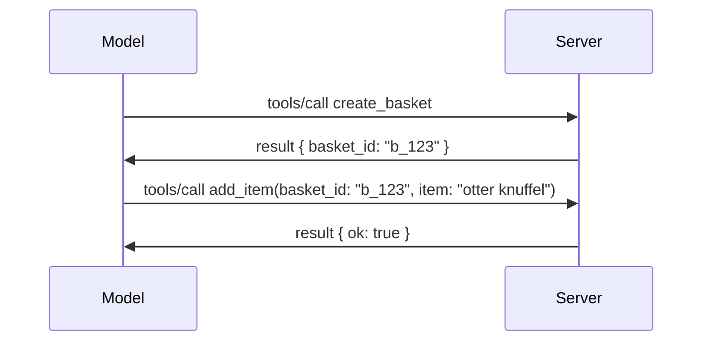

# Wat is er veranderd in MCP: De specificatie van 2026-07-28

> **Status:** Definitief. MCP-specificatie `2026-07-28` verscheen op 28 juli 2026
> en is de huidige protocolherziening. Deze les beschrijft de definitieve
> specificatie. Sommige curriculumvoorbeelden blijven expliciet gelabeld als
> `2025-11-25` omdat hun SDK's de nieuwe stateless API nog niet hebben overgenomen;
> behandel die voorbeelden als legacy-compatibiliteitsrichtlijnen.

## Overzicht

`2026-07-28` is de grootste revisie van MCP sinds de lancering. Zes
Specificatie Verbeteringsvoorstellen (SEPs) verwijderen protocolniveau-sessies en
maken MCP stateless op de transportlaag, extensies worden een volwaardig,
versieerbaar mechanisme, en diverse functies die eerder in dit curriculum werden behandeld
(Roots, Sampling, Logging) worden uitgefaseerd onder een nieuw levenscyclusbeleid. Deze
les vat samen wat er is veranderd, waarom het belangrijk is en wat het betekent voor code
geschreven voor `2025-11-25`.

Bron: [De MCP-specificatie Release Candidate van 2026-07-28](https://blog.modelcontextprotocol.io/posts/2026-07-28-release-candidate/) (Model Context Protocol Blog, David Soria Parra en Den Delimarsky).

## Leerdoelen

Aan het einde van deze les kun je:

- Uitleggen waarom MCP naar een stateless protocolkern gaat en welk probleem dit oplost voor horizontaal geschaalde implementaties.
- Beschrijven hoe de `initialize`/`initialized` handshake en `Mcp-Session-Id` header worden vervangen.
- De nieuwe `Mcp-Method` en `Mcp-Name` headers en de `ttlMs`/`cacheScope` caching metadata herkennen.
- Het Extensions-framework en de twee extensies die met deze release worden meegeleverd herkennen: MCP Apps en Tasks.
- De verscherping van autorisatie en het afschaffen van Dynamic Client Registration samenvatten.

- Identificeren welke kernfuncties (Roots, Sampling, Logging) nu zijn uitgefaseerd en wat dat praktisch betekent.
- De wijziging naar de volledige JSON Schema 2020-12 voor tool `inputSchema`/`outputSchema` uitleggen.

## Een Stateless Protocol

De belangrijkste verandering: MCP wordt stateless op protocolniveau.

### Vóór (2025-11-25): sessies bepalen dat je aan één serverinstantie vastzit

Een tool aanspreken via Streamable HTTP begint met een `initialize` handshake. De server reageert met een `Mcp-Session-Id` header die elke volgende aanvraag moet bevatten:

```http
POST /mcp HTTP/1.1
Mcp-Session-Id: 1868a90c-3a3f-4f5b
Content-Type: application/json

{"jsonrpc":"2.0","id":2,"method":"tools/call",
 "params":{"name":"search","arguments":{"q":"otters"}}}
```

Omdat de sessie gebonden is aan de serverinstantie die deze uitgaf, hebben horizontaal geschaalde implementaties **sticky routing** nodig bij de load balancer en een **gedeelde sessiewinkel** tussen instanties.

### Daarna (2026-07-28): elke aanvraag is zelfvoorzienend

```http
POST /mcp HTTP/1.1
MCP-Protocol-Version: 2026-07-28
Mcp-Method: tools/call
Mcp-Name: search
Content-Type: application/json

{"jsonrpc":"2.0","id":1,"method":"tools/call",
 "params":{"name":"search","arguments":{"q":"otters"},
           "_meta":{"io.modelcontextprotocol/protocolVersion":"2026-07-28",
                    "io.modelcontextprotocol/clientInfo":{"name":"my-app","version":"1.0"},
                    "io.modelcontextprotocol/clientCapabilities":{}}}}
```

Elke serverinstantie kan deze aanvraag verwerken. Belangrijke veranderingen:

- **De `initialize`/`initialized` handshake wordt verwijderd** ([SEP-2575](https://github.com/modelcontextprotocol/modelcontextprotocol/pull/2575)). Protocolversie, clientinformatie en clientmogelijkheden verhuizen naar `_meta` bij elke aanvraag. Een nieuwe `server/discover` methode laat een client vooraf de servermogelijkheden opvragen wanneer dat nodig is.
- **De `Mcp-Session-Id` header en protocolniveau-sessie worden verwijderd** ([SEP-2567](https://github.com/modelcontextprotocol/modelcontextprotocol/pull/2567)). Sticky routing en gedeelde sessiewinkels zijn niet langer vereist op protocolniveau.

### Stateless protocol, statevolle toepassingen

Het verwijderen van de protocolniveau-sessie betekent niet dat je server niet stateful kan zijn. Het aanbevolen patroon is hetzelfde als altijd in HTTP-API's: genereer een expliciet handvat (een `basket_id`, een `browser_id`) van één tool-aanroep en laat de model dat handvat teruggeven als een gewone parameter bij latere aanroepen.



Dit maakt de status zichtbaar en begrijpelijk voor het model in plaats van verborgen in transportmetadata, en het stelt elke serverinstantie in staat om elke aanroep af te handelen.

### Server-naar-client aanvragen, herzien

Een stateless protocol heeft nog steeds een manier nodig zodat een server de client halverwege een aanroep kan vragen om iets (bijvoorbeeld een elicitation prompt):

- **Server-geïnitieerde aanvragen mogen alleen worden gedaan terwijl de server actief een client-aanvraag verwerkt** ([SEP-2260](https://github.com/modelcontextprotocol/modelcontextprotocol/pull/2260)) — voorheen een aanbeveling, nu verplicht. Een gebruiker wordt nooit onverwacht gevraagd.
- **Multi Round-Trip Requests** ([SEP-2322](https://github.com/modelcontextprotocol/modelcontextprotocol/pull/2322)) vervangen het openhouden van een SSE-stream. In plaats daarvan retourneert de server een `InputRequiredResult`:

  ```json
  {
    "resultType": "input_required",
    "inputRequests": {
      "confirm": {
        "type": "elicitation",
        "message": "Delete 3 files?",
        "schema": { "type": "boolean" }
      }
    },
    "requestState": "eyJzdGVwIjoxLCJmaWxlcyI6WyJhIiwiYiIsImMiXX0="
  }
  ```

  De client verzamelt de antwoorden en doet de originele oproep opnieuw met `inputResponses` plus de teruggekaatste `requestState`. Elke serverinstantie kan de retry overnemen omdat alles wat nodig is in de payload zit.

### Routeerbaar, cachebaar, traceerbaar

Drie kleinere veranderingen maken stateless verkeer gemakkelijker te beheren:

- **`Mcp-Method` en `Mcp-Name` headers zijn verplicht bij Streamable HTTP** ([SEP-2243](https://github.com/modelcontextprotocol/modelcontextprotocol/pull/2243)), zodat load balancers, gateways en rate limiters kunnen routeren op de operatie zonder de JSON-body te inspecteren. Servers weigeren verzoeken waarbij headers en body niet overeenkomen.
- **`tools/list` en resource read-resultaten dragen `ttlMs` en `cacheScope`** ([SEP-2549](https://github.com/modelcontextprotocol/modelcontextprotocol/pull/2549)), gemodelleerd naar HTTP `Cache-Control`. Clients weten hoe lang een lijstresultaat vers is en of het veilig is om te delen tussen gebruikers, zonder een langdurige SSE-stream te hoeven openhouden om veranderingen te detecteren.
- **W3C Trace Context propagatie in `_meta` is gedocumenteerd** ([SEP-414](https://github.com/modelcontextprotocol/modelcontextprotocol/pull/414)), met verbeterde `traceparent`, `tracestate` en `baggage` sleutelnaamgeving zodat een gedistribueerde trace een oproep kan volgen via de client SDK, de MCP-server en downstream systemen in een [OpenTelemetry](https://opentelemetry.io/)-compatibele backend.

## Extensies Worden Volwaardige Onderdelen

Extensies bestonden informeel in `2025-11-25`. [SEP-2133](https://github.com/modelcontextprotocol/modelcontextprotocol/pull/2133) formaliseert ze:

- Extensies worden geïdentificeerd door reverse-DNS IDs.
- Ze worden onderhandeld via een `extensions` map in client- en servermogelijkheden.
- Ze bevinden zich in eigen `ext-*` repositories met gedelegeerde beheerders en worden onafhankelijk van de core-specificatie geversioneerd.
- Een nieuwe Extensions Track in het SEP-proces biedt ze een traject van experimenteel naar officieel.

Deze release bevat twee officiële extensies.

### MCP Apps: server-gerenderde gebruikersinterfaces

[MCP Apps](https://blog.modelcontextprotocol.io/posts/2026-01-26-mcp-apps/) ([SEP-1865](https://github.com/modelcontextprotocol/modelcontextprotocol/pull/1865)) laat servers interactieve HTML-interfaces leveren die hosts in een sandboxed iframe renderen. Tools declareren hun UI-sjablonen vooraf zodat hosts kunnen prefetch, cachen en een beveiligingsaudit kunnen uitvoeren voordat iets draait. Je hebt de basis hiervan al behandeld in [Les 15: MCP Apps](../03-GettingStarted/15-mcp-apps/README.md) — onder het Extensions-framework is MCP Apps nu formeel een extensie in plaats van een experimentele kernfunctie.

### Tasks wordt een extensie

Tasks werd als experimentele kernfunctie geleverd in `2025-11-25`. Productiegebruik bracht genoeg herontwerp naar voren dat de juiste plek een extensie is: de [Tasks-extensie](https://github.com/modelcontextprotocol/modelcontextprotocol/pull/2663) herschikt de levenscyclus rond het stateless model — een server kan antwoorden op `tools/call` met een taakhandvat, en de client stuurt de taak voort met `tasks/get`, `tasks/update` en `tasks/cancel`. Taakcreatie is servergestuurd: de client adverteert de extensie en de server beslist wanneer een call als taak moet worden uitgevoerd. `tasks/list` is helemaal verwijderd omdat het niet veilig geschaald kan worden zonder sessies.

> **Migratienoot:** als je de experimentele `2025-11-25` Tasks API hebt geïmplementeerd, moet je migreren naar de nieuwe extensielevenscyclus — die is niet achterwaarts compatibel.

## Autorisatieverscherping

Verschillende SEPs verscherpen de
[autorisatiespecificatie](https://modelcontextprotocol.io/specification/2026-07-28/basic/authorization)
om nauwer aan te sluiten bij real-world OAuth 2.0 / OpenID Connect-implementaties:

| SEP | Verandering |
|---|---|
| [SEP-2468](https://github.com/modelcontextprotocol/modelcontextprotocol/pull/2468) | Clients moeten de `iss` parameter valideren op autorisatie-antwoorden volgens [RFC 9207](https://www.rfc-editor.org/rfc/rfc9207), wat mix-up attacks voorkomt die vaak voorkomen in MCP’s patroon van één client, veel servers. Een toekomstige versie zal het weigeren van antwoorden zonder `iss` verplicht stellen. |
| [SEP-837](https://github.com/modelcontextprotocol/modelcontextprotocol/pull/837) | Alleen-compatibiliteit Dynamic Client Registration clients declareren hun OpenID Connect `application_type`, zodat onjuiste `"web"`-standaarden voor desktop- en CLI-clients worden vermeden. |
| [SEP-2352](https://github.com/modelcontextprotocol/modelcontextprotocol/pull/2352) | Alleen-compatibiliteit geregistreerde referenties zijn gebonden aan de `issuer` van de uitgevende autorisatieserver; clients registreren opnieuw wanneer een bron migreert. |
| [SEP-2207](https://github.com/modelcontextprotocol/modelcontextprotocol/pull/2207) | Documenteert hoe refresh tokens aangevraagd kunnen worden bij OpenID Connect-stijl autorisatieservers. |
| [SEP-2350](https://github.com/modelcontextprotocol/modelcontextprotocol/pull/2350) | Verheldert de scope-accumulatie tijdens step-up autorisatie. |
| [SEP-2351](https://github.com/modelcontextprotocol/modelcontextprotocol/pull/2351) | Verheldert de `.well-known` discovery suffix. |

Als je een autorisatieserver bouwt voor MCP, voeg dan `iss` toe aan
autorisatie-antwoorden en volg de definitieve autorisatiespecificatie. Zie
[02-Security](../02-Security/README.md) voor implementatierichtlijnen.

Dynamic Client Registration blijft beschikbaar voor compatibiliteit maar is ook
uitgefaseerd in `2026-07-28`. Nieuwe implementaties moeten Client ID Metadata
Documents gebruiken.

## Uitgefaseerde functies

Onder het nieuwe
[functielevenscyclusbeleid](https://github.com/modelcontextprotocol/modelcontextprotocol/pull/2577),
zijn Roots, Sampling, Logging en Dynamic Client Registration **uitgefaseerd**:

| Functie | Aanbevolen vervanging |
|---|---|
| Roots | Toolparameters, resource-URI's of serverconfiguratie |
| Sampling | Directe integratie met LLM-provider-API's |
| Logging | `stderr` voor stdio-transports; OpenTelemetry voor gestructureerde observatie |
| Dynamic Client Registration | Client ID Metadata Documents |

Deze functies blijven in `2026-07-28` voor compatibiliteit. Ze komen in aanmerking voor
verwijdering in de eerste specificatierevisie uitgegeven op of na 28 juli 2027;
daadwerkelijke verwijdering kan later gebeuren. Nieuwe implementaties moeten de vervangende
patronen hierboven gebruiken.

## Volledige JSON Schema 2020-12 voor Tools

Tool `inputSchema` en `outputSchema` zijn opgewaardeerd naar volledige [JSON Schema 2020-12](https://json-schema.org/draft/2020-12) ([SEP-2106](https://github.com/modelcontextprotocol/modelcontextprotocol/pull/2106)):

- Inputschema's behouden de `type: "object"` root-constraint maar staan nu samenstellingen toe (`oneOf`, `anyOf`, `allOf`), conditionals en verwijzingen (`$ref`, `$defs`).
- Outputschema's zijn onbeperkt, en `structuredContent` kan nu elke JSON-waarde zijn in plaats van alleen een object.
- Implementaties mogen geen externe `$ref`-URIs automatisch dereferencen en moeten schema-diepte en validatietijd begrenzen (een denial-of-service overweging om rekening mee te houden als je schema's server-side valideert).

Daarnaast verandert de foutcode voor een ontbrekende resource van de MCP-custom `-32002` naar de JSON-RPC standaard `-32602` (Invalid Params) ([SEP-2164](https://github.com/modelcontextprotocol/modelcontextprotocol/pull/2164)). Als je client specifiek zoekt op de letterlijke waarde `-32002`, moet je deze bijwerken.

## Hoe het Protocol Vanaf Hier Verder Evolueert

Deze release bevat brekende veranderingen, waarvan de MCP-beheerders niet verwachten dat dit de norm wordt. Drie governance-SEPs proberen herhaling te voorkomen:

- Het **functielevenscyclusbeleid** geeft elke functie een traject Actief → Uitgefaseerd → Verwijderd met minstens twaalf maanden tussen uitfasering en de vroegst mogelijke verwijdering.
- Het **Extensions-framework** laat nieuwe mogelijkheden als opt-in extensies worden geleverd en daar stabiliseren voordat ze (indien ooit) in de core-specificatie worden opgenomen.
- Een Standards Track SEP kan niet langer Final-status bereiken totdat een bijpassend scenario aanwezig is in de [conformiteitsuite](https://github.com/modelcontextprotocol/conformance) ([SEP-2484](https://github.com/modelcontextprotocol/modelcontextprotocol/pull/2484)) — dezelfde suite waarmee het [SDK-tier-systeem](https://github.com/modelcontextprotocol/modelcontextprotocol/pull/1777) officiële SDK's beoordeelt.

## Release Tijdlijn en Validatie

- De release candidate werd vastgezet op 21 mei 2026.
- De definitieve specificatie verscheen op 28 juli 2026.

- SDK-ondersteuning kan achterlopen op de specificatie. Controleer de
  [SDK-documentatie](https://modelcontextprotocol.io/docs/sdk) en de SDK
  release-opmerkingen voordat u een voorbeeld migreert.
- Volg de definitieve wijzigingen in de
  [2026-07-28-specificatie](https://modelcontextprotocol.io/specification/2026-07-28/)
  en de
  [wijzigingsgeschiedenis](https://modelcontextprotocol.io/specification/2026-07-28/changelog).

## Wat Dit Betekent voor Dit Curriculum

Het curriculum maakt de overgang van `2025-11-25` voorbeelden naar de huidige
`2026-07-28` specificatie. Concreet:

- **Sessies en de `initialize`-handshake** in voorbeelden die expliciet gericht zijn op
  `2025-11-25` zijn legacy gedrag. Het `2026-07-28` protocol vervangt deze
  door het stateloze verzoekmodel hierboven.
- **Sampling en Roots** blijven beschikbaar voor compatibiliteit maar zijn verouderd.
  Nieuwe ontwerpen zouden de hierboven genoemde vervangingspatronen moeten gebruiken.
- **De experimentele Taakfunctie**, als je die hebt gebruikt, moet worden gemigreerd naar de nieuwe levenscyclus van de Taakextensie.
- **MCP Apps** ([Les 15](../03-GettingStarted/15-mcp-apps/README.md)) worden praktisch niet beïnvloed; ze verhuizen gewoon onder het formele Extensiekader.

## Aanvullende Bronnen

- [MCP Specificatie 2026-07-28](https://modelcontextprotocol.io/specification/2026-07-28/)
- [2026-07-28 Wijzigingsgeschiedenis](https://modelcontextprotocol.io/specification/2026-07-28/changelog)
- [De 2026-07-28 MCP Specificatie Release Candidate (historische blogpost)](https://blog.modelcontextprotocol.io/posts/2026-07-28-release-candidate/)
- [De Toekomst van MCP-Transports](https://blog.modelcontextprotocol.io/posts/2025-12-19-mcp-transport-future/)
- [SEP-Richtlijnen](https://modelcontextprotocol.io/community/sep-guidelines)
- [MCP SDK Tiersysteem](https://modelcontextprotocol.io/docs/sdk)

## Volgende Stappen

Ga terug naar [Kernconcepten](./README.md) of ga door naar
[Beveiliging](../02-Security/README.md) om de huidige `2026-07-28` richtlijnen toe te passen.

---

<!-- CO-OP TRANSLATOR DISCLAIMER START -->
**Disclaimer**:
Dit document is vertaald met behulp van de AI vertaaldienst [Co-op Translator](https://github.com/Azure/co-op-translator). Hoewel we streven naar nauwkeurigheid, dient u er rekening mee te houden dat geautomatiseerde vertalingen fouten of onnauwkeurigheden kunnen bevatten. Het originele document in de oorspronkelijke taal moet worden beschouwd als de gezaghebbende bron. Voor kritieke informatie wordt professionele menselijke vertaling aanbevolen. Wij zijn niet aansprakelijk voor eventuele misverstanden of verkeerde interpretaties die voortvloeien uit het gebruik van deze vertaling.
<!-- CO-OP TRANSLATOR DISCLAIMER END -->