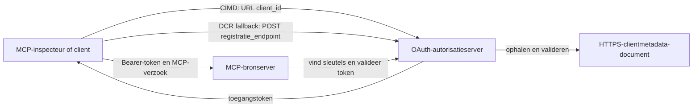

# CIMD en DCR Autorisatie Voorbeeld

Deze TypeScript-voorbeeld vergelijkt twee manieren waarop een OAuth-client een identiteit kan verkrijgen
voordat deze toegang krijgt tot een beveiligde MCP-server:

- **Client ID Metadata Documents (CIMD)** gebruiken een stabiele HTTPS-URL als
  `client_id`. Dit is de voorkeursmethode voor clients en autorisatieservers
  die geen vooraf bestaande relatie hebben.
- **Dynamic Client Registration (DCR)** vraagt de autorisatieserver om
  een ondoorzichtige client-ID tijdens runtime aan te maken. MCP `2026-07-28`
  behoudt DCR alleen voor achterwaartse compatibiliteit.

Het voorbeeld gebruikt de stabiele MCP TypeScript SDK v2 en het stateless
MCP `2026-07-28` request model. Het werkt met een externe OAuth 2.1/OpenID
Connect autorisatieserver zoals Auth0. De MCP-server is een resource
server: het valideert access tokens maar authenticeert gebruikers niet en
geeft geen tokens uit.

## Leerdoelen

Door dit voorbeeld te voltooien, kun je:

- Uitleggen waarom CIMD de voorkeur heeft boven DCR voor nieuwe MCP-clients.
- Een geldig CIMD-document publiceren voor een publieke native client.
- Een MCP resource server configureren voor OAuth discovery en JWT-validatie.
- CIMD en DCR uitproberen met dezelfde MCP-server en autorisatieserver.
- Een OAuth scope afdwingen binnen een MCP-tool.
- Identificeren welke verantwoordelijkheden bij de client, resource server en
  autorisatieserver horen.

## Architectuur



De autorisatieserver kiest en valideert het registratiemechanisme.
De MCP-server ziet alleen de resulterende geverifieerde `client_id` claim. Een HTTPS-URL
met een pad identificeert CIMD. Een ondoorzichtige ID is niet voldoende om DCR te bewijzen, 
omdat een voorregistreerde client ook een ondoorzichtige ID kan gebruiken; de optionele
`DCR_CLIENT_ID_PREFIX` instelling levert een providerspecifieke demohint.

## Registratieprioriteit

MCP-clients die elk mechanisme ondersteunen, moeten deze volgorde aanhouden:

1. Gebruik voorregistreerde clientinformatie als die al beschikbaar is.
2. Gebruik CIMD wanneer de autorisatieserver `client_id_metadata_document_supported: true` adverteert.
3. Gebruik DCR alleen als fallback wanneer de server een `registration_endpoint` adverteert.
4. Vraag de gebruiker om voorregistreerde clientinformatie als geen van bovenstaande beschikbaar is.


## Projectindeling

```text
src/
  config.ts          Environment validation
  dcr.ts             DCR compatibility request
  mcp.ts             MCP tools and scope checks
  oauth.ts           Authorization metadata and JWT verification
  register-dcr.ts    DCR command-line helper
  registration.ts    CIMD document and mechanism classification
  server.ts          Express, OAuth discovery, and MCP endpoint
test/
  dcr.test.ts
  oauth.test.ts
  registration.test.ts
  server.test.ts
```

## Vereisten

- Node.js 20.6 of nieuwer. De scripts gebruiken `--env-file` en `--import`.
- Een OAuth 2.1/OpenID Connect autorisatieserver die ondersteunt:
  - Autorisatiecode flow met S256 PKCE.
  - OAuth Protected Resource Metadata en Resource Indicators.
  - JWT access tokens en een JWKS endpoint.
  - CIMD, plus DCR als je de legacy fallback wilt vergelijken.
- MCP Inspector of een andere MCP `2026-07-28` client.
- Een publieke HTTPS URL voor het CIMD-document. Een ontwikkeltunnel is geschikt
  voor het lab; gebruik een stabiele domeinnaam in productie.

## Installatie en testen

```bash
npm install
npm run build
npm test
```

De twaalf tests gebruiken lokale sleutels en mock HTTP-eindpunten. Ze vereisen geen
autorisatieserveraccount. Ze verifiëren:

- Vorm van het CIMD-document en URL-voorwaarden.
- Eerlijke classificatie van URL en ondoorzichtige client IDs.
- Afhandeling van DCR-aanvragen en -antwoorden.
- Afwijzing van onveilige niet-loopback DCR-eindpunten.
- Validatie van JWT-handtekening, issuer, audience, verval, client ID en scope.
- Een in-proces MCP `2026-07-28` oproep naar `registration-info`.

## Configureer de Autorisatieserver

De exacte controletitels variëren per provider. Configureer deze mogelijkheden:

1. Maak een API of resource server waarvan de identifier exact overeenkomt met je MCP
   URL, inclusief `/mcp`, bijvoorbeeld `http://127.0.0.1:3001/mcp`.
2. Gebruik RS256 access tokens en voeg een `client_id` of `azp` claim toe.
3. Voeg toestemming of scope `tool:greet` toe.
4. Schakel autorisatiecode flow met S256 PKCE in voor publieke native clients.
5. Schakel Client ID Metadata Documents in.
6. Voor de vergelijking alleen, schakel Dynamic Client Registration in.
7. Zorg dat autorisatieservermetadata adverteert:
   - `issuer`
   - `authorization_endpoint`
   - `token_endpoint`
   - `jwks_uri`
   - `client_id_metadata_document_supported: true`
   - `registration_endpoint` wanneer DCR is ingeschakeld

### Auth0 Voorbeeld

Voor Auth0, schakel Client ID Metadata Document Registratie, OIDC Dynamic
Application Registration, en Resource Parameter compatibiliteit in. Maak een API
aan waarvan de identifier exact de MCP URL is en voeg de `tool:greet` toestemming toe.
Sta toe dat de testgebruiker en derde partij clients die toestemming kunnen aanvragen.

Providerdashboards en functiebeschikbaarheid veranderen in de loop van de tijd. Controleer de
providerdocumentatie voordat je deze instellingen buiten dit lab gebruikt.

## Configureer het Voorbeeld

Maak `.env` aan op basis van het voorbeeld:

```powershell
Copy-Item .env.example .env
```

In bash-compatibele shells:

```bash
cp .env.example .env
```

Stel deze waarden in:

```dotenv
MCP_SERVER_URL=http://127.0.0.1:3001/mcp
AUTHORIZATION_SERVER_ISSUER=https://your-tenant.example.com/
AUTHORIZATION_SERVER_METADATA_URL=https://your-tenant.example.com/.well-known/openid-configuration
CLIENT_METADATA_URL=https://your-public-host.example.com/client-metadata.json
OAUTH_REDIRECT_URIS=http://127.0.0.1:6274/oauth/callback
DCR_CLIENT_ID_PREFIX=tpc_
```

Belangrijke details:

- `AUTHORIZATION_SERVER_ISSUER` moet exact overeenkomen met `issuer` in de ontdekte
  autorisatieservermetadata, inclusief eventuele afsluitende slash.
- `MCP_SERVER_URL` moet overeenkomen met de audience van het access token.
- `CLIENT_METADATA_URL` moet HTTPS gebruiken, een niet-root pad bevatten, en de
  publieke URL zijn die de metadata route serveert. Query strings en fragments worden
  afgewezen zodat de route en `client_id` identiek blijven.
- `OAUTH_REDIRECT_URIS` is een door komma's gescheiden allowlist. Standaard is het de MCP
  Inspector loopback callback.
- `DCR_CLIENT_ID_PREFIX` is optioneel en providerspecifiek. Laat leeg wanneer
  je provider geen betrouwbare DCR-prefix heeft.

## Publiceer het CIMD Document

Start een tunnel die zijn publieke HTTPS-origin doorstuurt naar `127.0.0.1:3001`.
Stel `CLIENT_METADATA_URL` in op die origin plus `/client-metadata.json`, en voer dan uit:

```bash
npm run build
npm start
```

Verifieer beide discovery-documenten:

```bash
curl http://127.0.0.1:3001/health
curl http://127.0.0.1:3001/client-metadata.json
curl http://127.0.0.1:3001/.well-known/oauth-protected-resource/mcp
```

De `client_id` die door de publieke HTTPS metadata URL wordt teruggegeven, moet byte-for-byte
identiek zijn aan die URL. De autorisatieserver moet het document en
de redirect URI valideren voordat een token wordt uitgegeven.

> [!NOTE]
> Het voorbeeld host het clientdocument en de MCP resource server in één proces
> om het lab klein te houden. In productie bezit en host de MCP client zijn CIMD
> document onafhankelijk van de resource server.

## Vergelijk CIMD en DCR

Start MCP Inspector:

```bash
npx @modelcontextprotocol/inspector
```

Gebruik Streamable HTTP en verbind met `http://127.0.0.1:3001/mcp`.

### CIMD (Voorkeur)

1. Voer de publieke `CLIENT_METADATA_URL` in als de OAuth Client ID.
2. Vraag `tool:greet` plus elke identiteitsscope die je provider vereist.
3. Rond inloggen en toestemming af.
4. Roep `registration-info` aan. Het geeft `mechanism: "cimd"` terug.
5. Roep `greet` aan om afdwinging van de scope te verifiëren.

### DCR (Compatibiliteitsfallback)

1. Maak de opgeslagen OAuth-status van Inspector leeg.
2. Laat OAuth Client ID leeg zodat Inspector mogelijk de geadverteerde
   `registration_endpoint` gebruikt.
3. Rond inloggen en toestemming af.
4. Roep `registration-info` aan.
5. Als `DCR_CLIENT_ID_PREFIX` overeenkomt met door de provider gegenereerde ID's, rapporteert het gereedschap
   `mechanism: "dcr"`; anders rapporteert het correct
   `opaque-client-id`.

Je kunt ook direct de registratieaanvraag demonstreren:

```bash
npm run build
npm run register:dcr
```

De helper print de teruggegeven client ID, maar print nooit een client secret.
Behandel elke teruggegeven secret als vertrouwelijk en sla deze op in een geschikte geheime opslag.

## Tools

| Tool | Vereiste scope | Doel |
| --- | --- | --- |
| `registration-info` | Geverifieerde client | Rapporteren van het client ID type |
| `greet` | `tool:greet` | Demonstreren van per-tool autorisatie |

## Beveiligingsnotities

- Valideer JWT-handtekeningen via het JWKS endpoint van de autorisatieserver.
- Vereis exacte overeenkomsten van issuer en audience.
- Vereis verval- en client ID claims.
- Accepteer nooit een token uitgegeven voor een andere resource.
- Geef het MCP-token nooit door aan een downstream API.
- Houd DCR-credentials gebonden aan de issuer die ze heeft gemaakt.
- Valideer CIMD redirect URI's met exacte matching.
- Pas SSRF-controles toe wanneer een autorisatieserver CIMD URLs ophaalt.
- Gebruik HTTPS voor autorisatie- en metadata-eindpunten buiten loopback ontwikkeling.

- Trek DCR niet af uit een ondoorzichtige client ID tenzij de provider een
  betrouwbare identificatieconventie documenteert.

## Referenties

- [MCP authorisatiespecificatie](https://modelcontextprotocol.io/specification/2026-07-28/basic/authorization)
- [MCP clientregistratie](https://modelcontextprotocol.io/specification/2026-07-28/basic/authorization/client-registration)
- [MCP beste beveiligingspraktijken](https://modelcontextprotocol.io/specification/2026-07-28/basic/security_best_practices)
- [MCP TypeScript SDK v2 autorisatiehandleiding](https://ts.sdk.modelcontextprotocol.io/v2/serving/authorization)
- [OAuth Dynamic Client Registration (RFC 7591)](https://datatracker.ietf.org/doc/html/rfc7591)
- [OAuth Client ID Metadata Document concept](https://datatracker.ietf.org/doc/html/draft-ietf-oauth-client-id-metadata-document-00)

## Erkenning

De side-by-side leermethode is geïnspireerd door
[Sambego/auth0-xmcp-cimd](https://github.com/Sambego/auth0-xmcp-cimd). Dit
voorbeeld is een originele, provider-neutrale implementatie gebouwd met de officiële
MCP TypeScript SDK v2 voor dit curriculum.

---

<!-- CO-OP TRANSLATOR DISCLAIMER START -->
**Disclaimer**:
Dit document is vertaald met behulp van de AI vertaaldienst [Co-op Translator](https://github.com/Azure/co-op-translator). Hoewel we streven naar nauwkeurigheid, dient u er rekening mee te houden dat geautomatiseerde vertalingen fouten of onnauwkeurigheden kunnen bevatten. Het originele document in de oorspronkelijke taal moet worden beschouwd als de gezaghebbende bron. Voor kritieke informatie wordt professionele menselijke vertaling aanbevolen. Wij zijn niet aansprakelijk voor eventuele misverstanden of verkeerde interpretaties die voortvloeien uit het gebruik van deze vertaling.
<!-- CO-OP TRANSLATOR DISCLAIMER END -->